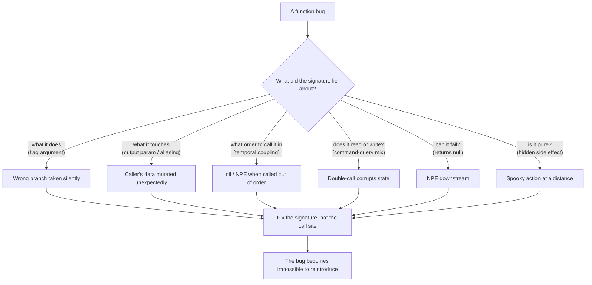

# Functions — Find the Bug

> 12 snippets where a flaw in **function design** — a flag argument, an output parameter, hidden temporal coupling, a command-query mix, a returned `null`, a hidden side effect — causes or hides a real defect. Find the bug first; then notice that the *shape* of the function is what let the bug in. Fixing the shape usually makes the bug impossible to reintroduce.

The lesson of this chapter: most function bugs are not arithmetic mistakes. They are **interface mistakes**. A function whose signature lies about what it does, what it touches, or what order it must be called in will eventually be called incorrectly — by you, in six months, in good faith.

---

## Table of Contents

- [How to Use](#how-to-use)
- [The shape of a function bug](#the-shape-of-a-function-bug)
- [Snippet 1 — Flag argument takes the wrong branch (Go)](#snippet-1--flag-argument-takes-the-wrong-branch-go)
- [Snippet 2 — Output parameter aliasing (Python)](#snippet-2--output-parameter-aliasing-python)
- [Snippet 3 — Hidden temporal coupling → NPE (Java)](#snippet-3--hidden-temporal-coupling--npe-java)
- [Snippet 4 — Command-query mix corrupts state on retry (Go)](#snippet-4--command-query-mix-corrupts-state-on-retry-go)
- [Snippet 5 — Returning null leads to NPE (Java)](#snippet-5--returning-null-leads-to-npe-java)
- [Snippet 6 — A "pure" helper with a hidden side effect (Python)](#snippet-6--a-pure-helper-with-a-hidden-side-effect-python)
- [Snippet 7 — One function doing two things; one half fails silently (Go)](#snippet-7--one-function-doing-two-things-one-half-fails-silently-go)
- [Snippet 8 — Default mutable argument (Python)](#snippet-8--default-mutable-argument-python)
- [Snippet 9 — Boolean flag inverts on a refactor (Java)](#snippet-9--boolean-flag-inverts-on-a-refactor-java)
- [Snippet 10 — Mixed abstraction levels hide a skipped guard (Go)](#snippet-10--mixed-abstraction-levels-hide-a-skipped-guard-go)
- [Snippet 11 — Query method that mutates a cache, called under a read lock (Java)](#snippet-11--query-method-that-mutates-a-cache-called-under-a-read-lock-java)
- [Snippet 12 — Output parameter "filled in" only on the happy path (Python)](#snippet-12--output-parameter-filled-in-only-on-the-happy-path-python)
- [Scorecard](#scorecard)
- [Related Topics](#related-topics)

---

## How to Use

For each snippet:

1. Read the code and the calling site. **Assume the caller is reasonable** — the bug is almost never "the caller is an idiot." It is "the signature invited this mistake."
2. Answer the prompt **before** opening the `<details>`. Say out loud: *what does this function promise, and where does it break that promise?*
3. Open the answer. It names the bug, then the **root cause in function design** (flag / output param / temporal coupling / CQS violation / null / hidden effect), then the fix that removes the entire *class* of bug.

Score yourself with the [Scorecard](#scorecard). A senior reviewer should catch 10+ of these on a first read.

---

## The shape of a function bug



Every fix below pushes the same direction: **make the function's interface honest**, so the compiler, the reader, or the type system catches the next person before they ship the bug.

---

## Snippet 1 — Flag argument takes the wrong branch (Go)

> Difficulty: **Easy**

```go
// SendReport renders a report and delivers it.
// If draft is true, it is saved internally and NOT emailed.
func SendReport(r Report, recipients []string, draft bool) error {
    body := render(r)
    if draft {
        return archive(body) // save only
    }
    return email(recipients, body)
}

// Caller A — nightly job that emails finished reports:
func runNightly(reports []Report) error {
    for _, r := range reports {
        // We want these EMAILED. They are final.
        if err := SendReport(r, mailingList, r.IsDraft()); err != nil {
            return err
        }
    }
    return nil
}
```

**What's wrong?** The nightly job is supposed to email *final* reports. Some of them go out, some don't. Why?

<details><summary>Answer</summary>

**The bug:** the nightly job passes `r.IsDraft()` as the `draft` flag. Any report whose `IsDraft()` is still `true` (e.g., it was queued before being marked final, or `IsDraft` defaults to `true`) silently gets **archived instead of emailed**. No error, no log — the recipient simply never receives it. The flag *quietly* selects the wrong branch.

**Root cause in function design:** `SendReport(..., draft bool)` is a **flag argument**. The boolean fuses two genuinely different operations — "archive a draft" and "email a final report" — into one function. At the call site, `SendReport(r, mailingList, r.IsDraft())` does not *read* like "email this"; it reads like "send this, mode = whatever IsDraft returns." The intent ("these are final, email them") is lost. A flag argument is a function that is visibly doing more than one thing (Clean Code: a function should do one thing).

**The fix:** split into two named functions. Each call site states its intent, and the wrong branch becomes unreachable.

```go
func EmailReport(r Report, recipients []string) error {
    return email(recipients, render(r))
}

func ArchiveDraft(r Report) error {
    return archive(render(r))
}

// Caller A is now unambiguous and cannot "accidentally" archive:
func runNightly(reports []Report) error {
    for _, r := range reports {
        if err := EmailReport(r, mailingList); err != nil {
            return err
        }
    }
    return nil
}
```

If a caller genuinely needs to branch on draft status, the *caller* decides — `if r.IsDraft() { ArchiveDraft(r) } else { EmailReport(r, list) }` — and the decision is visible at the call site, not buried inside `SendReport`.
</details>

---

## Snippet 2 — Output parameter aliasing (Python)

> Difficulty: **Medium**

```python
def apply_defaults(config: dict, defaults: dict) -> dict:
    """Return config with any missing keys filled from defaults."""
    for key, value in defaults.items():
        config.setdefault(key, value)
    return config


BASE_DEFAULTS = {"timeout": 30, "retries": 3, "region": "us-east-1"}


def build_client(user_config: dict):
    cfg = apply_defaults(user_config, BASE_DEFAULTS)
    return Client(cfg)


# Somewhere else, two requests in the same process:
build_client({"region": "eu-west-1"})   # request 1
build_client({})                          # request 2: expects us-east-1
```

**What's wrong?** Request 2 passes an empty config and expects the defaults. Run them in this order and request 2 is correct. Now reverse the order — or run request 1 a few times. Things drift. Why?

<details><summary>Answer</summary>

**The bug:** `apply_defaults` **mutates its first argument in place** and also returns it, so `cfg is user_config`. That alone is surprising, but the real damage is subtler. Consider request 1: `user_config = {"region": "eu-west-1"}`. After `apply_defaults`, that *same dict object* now contains `{"region": "eu-west-1", "timeout": 30, "retries": 3}`.

The worse failure is when callers reuse a dict. If any caller does `shared = {"region": "eu-west-1"}; build_client(shared); build_client(shared)`, the second call sees a dict already polluted by the first. And because `setdefault` only fills *missing* keys, a dict that was mutated once will never pick up *changed* defaults later. The function looks pure ("return config with ... filled") but it **writes through an aliased output parameter**.

**Root cause in function design:** `config` is an **output parameter** disguised as an input. The name and docstring promise a pure transformation ("return config with missing keys filled"); the body mutates the caller's object. The return value creates a false sense of safety — readers see `cfg = apply_defaults(...)` and assume `apply_defaults` produced a *new* value. Aliasing (`cfg is user_config`) means a change to one is a change to the other.

**The fix:** do not mutate inputs. Build and return a new dict; defaults first, caller's values win.

```python
def apply_defaults(config: dict, defaults: dict) -> dict:
    """Return a NEW dict: defaults overlaid with config (config wins)."""
    return {**defaults, **config}
```

Now `apply_defaults({"region": "eu-west-1"}, BASE_DEFAULTS)` returns a fresh dict and leaves both inputs untouched. The caller's `user_config` is never aliased, never polluted, and the function is genuinely the pure transformation its name claims. (If the language allows it, accepting and returning a frozen/immutable mapping makes the guarantee enforced rather than promised.)
</details>

---

## Snippet 3 — Hidden temporal coupling → NPE (Java)

> Difficulty: **Medium**

```java
public class ReportExporter {
    private List<Row> rows;
    private Formatter formatter;

    public void load(DataSource source) {
        this.rows = source.fetchRows();
    }

    public void configure(ExportOptions options) {
        this.formatter = new Formatter(options);
    }

    public byte[] export() {
        StringBuilder sb = new StringBuilder();
        for (Row row : rows) {                 // line X
            sb.append(formatter.format(row));   // line Y
        }
        return sb.toString().getBytes(UTF_8);
    }
}

// Caller, new endpoint added under deadline:
ReportExporter exporter = new ReportExporter();
exporter.configure(options);
byte[] out = exporter.export();   // <-- ships to prod
```

**What's wrong?** It compiles. It passes the one unit test (which happened to call `load` first). In production it throws. Where, and why?

<details><summary>Answer</summary>

**The bug:** `export()` throws `NullPointerException` at line X — `for (Row row : rows)` — because the new caller never called `load()`, so `rows` is still `null`. The object has a **required call order** (`load` → `configure` → `export`) that nothing enforces and nothing documents. The new endpoint called `configure` and `export` but forgot `load`, and the class let it.

**Root cause in function design:** **hidden temporal coupling.** `export()` silently depends on `load()` having run first, but its signature (`byte[] export()`) makes no such requirement visible. The dependency lives only in the author's head and in the order of statements in the one test. Any caller can call the methods in any order; most orders produce a `NullPointerException` or stale data. Mutable, optional, sequentially-required fields are a temporal-coupling trap.

**The fix:** make the dependency a parameter, not an instance field. If `export` needs rows and a formatter, *take them as inputs* — then it is impossible to call without them.

```java
public final class ReportExporter {
    // No mutable setup fields. Everything export needs is passed in.
    public byte[] export(List<Row> rows, ExportOptions options) {
        Objects.requireNonNull(rows, "rows");
        Formatter formatter = new Formatter(options);
        StringBuilder sb = new StringBuilder();
        for (Row row : rows) {
            sb.append(formatter.format(row));
        }
        return sb.toString().getBytes(UTF_8);
    }
}

// Caller cannot forget to provide the data — the compiler enforces it:
byte[] out = new ReportExporter().export(source.fetchRows(), options);
```

If you must keep a builder-style API, enforce the order with the type system: `load()` returns a `ConfiguredExporter` whose only method is `configure()`, which returns a `ReadyExporter` whose only method is `export()`. Illegal orders then fail to compile. Either way, the rule "call load first" stops being tribal knowledge.
</details>

---

## Snippet 4 — Command-query mix corrupts state on retry (Go)

> Difficulty: **Hard**

```go
type Counter struct {
    mu    sync.Mutex
    value int
}

// NextID returns the next ID. (Looks like a query: it "returns the next ID".)
func (c *Counter) NextID() int {
    c.mu.Lock()
    defer c.mu.Unlock()
    c.value++
    return c.value
}

// Caller: build an audit record. Logged at two levels for debugging.
func recordEvent(c *Counter, e Event) AuditRecord {
    log.Printf("allocating id for event %q (will be %d)", e.Name, c.NextID())
    rec := AuditRecord{
        ID:    c.NextID(),
        Event: e,
    }
    log.Printf("recorded event %q as id %d", e.Name, rec.ID)
    return rec
}
```

**What's wrong?** IDs are skipping — the audit table has gaps (1, then 3, then 5...), and the "will be N" log never matches the actual ID. Why?

<details><summary>Answer</summary>

**The bug:** `NextID()` is called **twice** per event — once in the first log line (`c.NextID()`), once when building the record (`ID: c.NextID()`). Each call increments `value`. So every event consumes two IDs: the log claims "will be 1," the record actually gets ID 2, the next event's log says "will be 3," it gets 4, and so on. IDs are burned and the log line lies.

**Root cause in function design:** `NextID()` **violates Command-Query Separation (CQS).** Its name reads like a *query* ("return the next ID"), so the author treated it as side-effect-free and called it freely — once for logging, once for the real use. But it is actually a *command*: it mutates `value` every call. A method should **either** return a value and change nothing (query) **or** change state and return nothing (command), not both. When a "query" secretly mutates, double-calling — a totally natural thing to do, especially in logging — corrupts state.

**The fix:** call the command once, store its result, and use that value everywhere. Even better, make the name honestly say it mutates (`Allocate`), and never call it inside a log argument.

```go
// Name says it mutates. CQS is respected: this is a command that returns
// the allocated value, and callers must treat each call as consuming one ID.
func (c *Counter) Allocate() int {
    c.mu.Lock()
    defer c.mu.Unlock()
    c.value++
    return c.value
}

func recordEvent(c *Counter, e Event) AuditRecord {
    id := c.Allocate() // called exactly once
    log.Printf("allocating id %d for event %q", id, e.Name)
    rec := AuditRecord{ID: id, Event: e}
    log.Printf("recorded event %q as id %d", e.Name, rec.ID)
    return rec
}
```

The general rule: if a method changes state, do not call it speculatively (in logs, in assertions, in conditionals you might short-circuit). Allocate once, bind to a variable, reuse the variable.
</details>

---

## Snippet 5 — Returning null leads to NPE (Java)

> Difficulty: **Easy**

```java
public class UserRepository {
    public User findByEmail(String email) {
        for (User u : allUsers) {
            if (u.getEmail().equalsIgnoreCase(email)) {
                return u;
            }
        }
        return null; // not found
    }
}

// Caller:
public boolean isAdmin(String email) {
    User user = userRepository.findByEmail(email);
    return user.getRoles().contains(Role.ADMIN);
}
```

**What's wrong?** Admin checks work for everyone in the database. Then someone passes an email that isn't registered, and the request 500s. Why?

<details><summary>Answer</summary>

**The bug:** `findByEmail` returns `null` when no user matches. `isAdmin` immediately calls `user.getRoles()` on that `null`, throwing `NullPointerException`. The "not found" case is a perfectly ordinary outcome (someone typed an unknown email), but it is encoded as `null`, and the caller — reasonably — forgot to check, because the signature `User findByEmail(...)` *promises a User*.

**Root cause in function design:** **returning `null` to signal "absent."** The return type `User` claims the method always yields a user; `null` silently breaks that claim and pushes the burden of remembering onto every single caller. The compiler offers no help — `null` is assignable to any reference type. This is Tony Hoare's "billion-dollar mistake" in miniature: a function whose type lies about whether a value exists.

**The fix:** make absence part of the return type with `Optional<User>`. Now the caller *cannot* dereference without first handling the empty case — the type forces it.

```java
public Optional<User> findByEmail(String email) {
    return allUsers.stream()
        .filter(u -> u.getEmail().equalsIgnoreCase(email))
        .findFirst();
}

// Caller is forced to handle "not found":
public boolean isAdmin(String email) {
    return userRepository.findByEmail(email)
        .map(u -> u.getRoles().contains(Role.ADMIN))
        .orElse(false);
}
```

The same rule scales to collections: a function that returns a list should return an **empty list**, never `null`, so callers can iterate without a guard. "Return a special-case object, not `null`" (Clean Code, *Error Handling*) is the broader principle; `Optional` is the typed version of it.
</details>

---

## Snippet 6 — A "pure" helper with a hidden side effect (Python)

> Difficulty: **Medium**

```python
def normalize_scores(scores: list[float]) -> list[float]:
    """Return scores scaled to 0..1. Pure helper, safe to call anywhere."""
    hi = max(scores)
    lo = min(scores)
    span = hi - lo or 1.0
    for i in range(len(scores)):
        scores[i] = (scores[i] - lo) / span   # <-- (!)
    return scores


def report(raw: list[float]):
    normalized = normalize_scores(raw)
    print("normalized:", normalized)
    print("raw average:", sum(raw) / len(raw))   # expects ORIGINAL raw
```

**What's wrong?** "raw average" prints a number between 0 and 1, not the average of the original scores. The docstring says the helper is pure. Where did the raw data go?

<details><summary>Answer</summary>

**The bug:** `normalize_scores` writes back into the list it was handed (`scores[i] = ...`). Lists are passed by reference in Python, so `raw` and `scores` are the **same object**. After the call, `raw` has been overwritten with normalized values, and "raw average" computes the average of normalized data. The helper that advertised itself as "pure, safe to call anywhere" quietly destroyed its caller's input.

**Root cause in function design:** a **hidden side effect in a function the reader believes is pure.** The docstring ("Pure helper") and the return value both signal "I compute a new value and give it back." The body contradicts that by mutating the argument in place. Purity is a contract; a function that claims purity but mutates shared state breaks every caller that relied on the claim — and those callers won't add defensive copies, *because the contract told them not to*.

**The fix:** actually be pure. Compute into a new list; never write into the input.

```python
def normalize_scores(scores: list[float]) -> list[float]:
    """Return a NEW list of scores scaled to 0..1. Does not modify input."""
    hi, lo = max(scores), min(scores)
    span = hi - lo or 1.0
    return [(s - lo) / span for s in scores]
```

Now `raw` is untouched and "raw average" is correct. A pure function — same output for the same input, no observable effect on anything else — is testable in isolation, reorderable, cacheable, and safe to call speculatively. If a function *must* mutate, its name should say so (`normalize_in_place`) so no caller is surprised. See [`../15-pure-functions`](../15-pure-functions/README.md) for why the boundary between "computes" and "mutates" is worth defending.
</details>

---

## Snippet 7 — One function doing two things; one half fails silently (Go)

> Difficulty: **Medium**

```go
// SaveAndNotify persists the order and emails the customer.
func SaveAndNotify(o Order) error {
    if err := db.Save(o); err != nil {
        return err
    }
    // best-effort notify; we don't want email problems to fail the save
    _ = notifier.Send(o.CustomerEmail, confirmation(o))
    return nil
}

// Caller:
func placeOrder(o Order) error {
    if err := SaveAndNotify(o); err != nil {
        return err
    }
    metrics.Inc("orders.confirmed_and_notified")
    return nil
}
```

**What's wrong?** The order is saved. The customer swears they never got a confirmation email, yet the "confirmed_and_notified" metric keeps climbing and there are zero errors in the logs. Why?

<details><summary>Answer</summary>

**The bug:** `notifier.Send`'s error is discarded with `_ =`. When the email provider is down, `Send` returns an error, but `SaveAndNotify` swallows it and returns `nil`. The caller then increments `orders.confirmed_and_notified` — claiming a notification that never happened. The failure is **silent**: no error propagates, no metric distinguishes "notified" from "not notified," and on-call sees a green dashboard while customers see no email.

**Root cause in function design:** **one function doing two things**, where the two things have *different failure semantics* fused into a single return value. "Save" must not fail silently; "notify" is best-effort. By bundling them, `SaveAndNotify` has to pick one error policy for both — and it picked "swallow," which is correct for notify and catastrophic for the caller's ability to know what happened. A function that does two things cannot report the outcome of each.

**The fix:** separate the two operations so each reports its own outcome. The caller — which knows the policy — decides what a notification failure means.

```go
func Save(o Order) error {
    return db.Save(o)
}

// Returns the notify error instead of hiding it. Caller chooses the policy.
func Notify(o Order) error {
    return notifier.Send(o.CustomerEmail, confirmation(o))
}

func placeOrder(o Order) error {
    if err := Save(o); err != nil {
        return err
    }
    metrics.Inc("orders.saved")

    if err := Notify(o); err != nil {
        // explicit best-effort: log it AND record that we failed to notify
        log.Printf("order %s saved but notify failed: %v", o.ID, err)
        metrics.Inc("orders.notify_failed")
        return nil // truly best-effort, but now it's visible and measured
    }
    metrics.Inc("orders.notified")
    return nil
}
```

"Best-effort" is a legitimate choice — but it must be a *visible, instrumented* choice at the layer that owns the policy, not a `_ =` buried inside a function whose name implies both halves succeeded.
</details>

---

## Snippet 8 — Default mutable argument (Python)

> Difficulty: **Medium**

```python
def add_item(item, cart=[]):
    """Add item to cart and return the cart. Defaults to a fresh empty cart."""
    cart.append(item)
    return cart


# Two unrelated shoppers, two calls that each omit `cart`:
alice_cart = add_item("apple")
bob_cart = add_item("banana")

print(alice_cart)  # expected: ["apple"]
print(bob_cart)    # expected: ["banana"]
```

**What's wrong?** Alice and Bob each start with no cart and add one item. Both carts come back with **two** items. Why?

<details><summary>Answer</summary>

**The bug:** `alice_cart` and `bob_cart` are both `["apple", "banana"]`. The default value `cart=[]` is evaluated **once**, when the function is defined — not once per call. Every call that omits `cart` shares the *same* list object. Alice's "apple" and Bob's "banana" accumulate in that one shared list. State leaks across completely unrelated calls.

**Root cause in function design:** a **mutable default argument** — a hidden, function-level piece of shared mutable state, and a side effect that outlives any single call. The signature *looks* like "each caller gets a fresh empty cart"; in reality there is exactly one cart for the lifetime of the program. The default-parameter mechanism quietly turned a per-call default into a global. (This is Python's most famous footgun, but the underlying sin is generic: a default that is mutable and shared.)

**The fix:** use `None` as the sentinel and create a fresh list inside the function on each call.

```python
def add_item(item, cart=None):
    """Add item to cart and return it. A fresh cart is created when omitted."""
    if cart is None:
        cart = []
    cart.append(item)
    return cart
```

Now every call that omits `cart` gets a brand-new list, and Alice's cart and Bob's cart are independent. The deeper guidance: **defaults should be immutable** (numbers, strings, tuples, frozensets, `None`). If a function needs per-call fresh state, construct it in the body, never in the signature.
</details>

---

## Snippet 9 — Boolean flag inverts on a refactor (Java)

> Difficulty: **Hard**

```java
public class CacheLoader {
    // Original: load(key, useCache). useCache=true means "read cache first".
    public Value load(String key, boolean useCache) {
        if (useCache) {
            Value cached = cache.get(key);
            if (cached != null) return cached;
        }
        Value fresh = source.fetch(key);
        cache.put(key, fresh);
        return fresh;
    }
}

// Six months later, someone "clarifies" the API by renaming the flag,
// because callers were confused about what `true` meant:
public Value load(String key, boolean bypassCache) {
    if (bypassCache) {
        Value cached = cache.get(key);
        if (cached != null) return cached;
    }
    Value fresh = source.fetch(key);
    cache.put(key, fresh);
    return fresh;
}

// Existing caller, unchanged through the rename:
Value v = loader.load("config", true);
```

**What's wrong?** Only the parameter *name* changed; the body is identical. The code compiles, all existing call sites are untouched. Yet caching behavior is now backwards. Why?

<details><summary>Answer</summary>

**The bug:** the parameter was renamed from `useCache` to `bypassCache`, but the **body still does `if (flag) { read cache }`**. Under the new name that reads as "if bypassCache, read the cache" — the exact opposite of what `bypassCache` should mean. Worse, every existing caller still passes `true` meaning "use the cache," and now the *name* at the declaration says they're asking to *bypass* it. The literal `true` at the call site has silently flipped meaning; nothing flags the contradiction because a `boolean` is a `boolean`.

**Root cause in function design:** a **flag argument whose meaning lives only in a name** — and names can drift out of sync with behavior with zero compiler resistance. A bare `boolean` parameter has no intrinsic semantics; `load("config", true)` is unreadable at the call site (you must open the signature to know what `true` does), and when the name changes, every call site silently re-interprets. The flag both obscures intent and is fragile under refactoring.

**The fix:** replace the boolean with a small, self-describing type — or, better, with two methods, so there is no flag to misname and no `true`/`false` to misread.

```java
public enum CachePolicy { USE_CACHE, REFRESH }

public Value load(String key, CachePolicy policy) {
    if (policy == CachePolicy.USE_CACHE) {
        Value cached = cache.get(key);
        if (cached != null) return cached;
    }
    Value fresh = source.fetch(key);
    cache.put(key, fresh);
    return fresh;
}

// Or eliminate the parameter entirely:
public Value load(String key)        { /* USE_CACHE path */ }
public Value reload(String key)      { /* REFRESH path  */ }
```

Now the call site reads `loader.load("config", CachePolicy.USE_CACHE)` or simply `loader.load("config")`. The intent is on the page, and a rename of the *constant* cannot silently invert the *behavior*, because the comparison `policy == USE_CACHE` is checked by the compiler against the enum.
</details>

---

## Snippet 10 — Mixed abstraction levels hide a skipped guard (Go)

> Difficulty: **Hard**

```go
func transferFunds(from, to *Account, amount Money) error {
    // High-level intent mixed with low-level mechanics:
    fromLocked := tryLock(&from.mu)
    if !fromLocked {
        return ErrBusy
    }

    if err := authorize(from, amount); err != nil {
        unlock(&from.mu)
        return err
    }

    toLocked := tryLock(&to.mu)

    from.balance = from.balance.Sub(amount)
    to.balance = to.balance.Add(amount)

    unlock(&from.mu)
    unlock(&to.mu)
    return nil
}
```

**What's wrong?** This works in every test (single-threaded, accounts never contended). Under load, money is occasionally created or destroyed, and the service sometimes panics on unlock. Where are the bugs?

<details><summary>Answer</summary>

**The bug(s):** there are two, both hiding in the fact that the function jumps between *intent* ("transfer funds," "authorize") and *mechanics* ("tryLock," "unlock") in the same breath:

1. **`toLocked` is checked nowhere.** `tryLock(&to.mu)` may have *failed*, but the code proceeds to mutate `to.balance` anyway — without holding `to`'s lock — and then calls `unlock(&to.mu)` on a mutex it may not own. The skipped `if !toLocked { ... }` guard is invisible because the eye reads the surrounding high-level lines ("subtract, add, unlock") as a coherent story and glides past the missing check.
2. **`to` is mutated without a held lock** even in the success-ish case the author imagined, because the failure branch was never written. Concurrent transfers race on `to.balance`, so money is lost or duplicated.

**Root cause in function design:** **mixed levels of abstraction in one function.** `authorize(from, amount)` is a domain concept; `tryLock`/`unlock` are plumbing. Interleaving them means a missing plumbing guard sits right next to domain logic, where it does not stand out — the reader's mental model is operating at the "transfer money" altitude and never drops down to audit the locking protocol. When every line is at the same level, an omitted line is conspicuous; when levels are mixed, omissions blend in.

**The fix:** separate the levels. Push the locking protocol into one place that *cannot* proceed without both locks, and keep `transferFunds` at the domain level.

```go
func transferFunds(from, to *Account, amount Money) error {
    release, err := lockBoth(from, to) // one place owns the locking protocol
    if err != nil {
        return err // could not acquire BOTH locks; nothing was touched
    }
    defer release()

    if err := authorize(from, amount); err != nil {
        return err
    }
    from.balance = from.balance.Sub(amount)
    to.balance = to.balance.Add(amount)
    return nil
}

// lockBoth acquires both mutexes (in a stable order to avoid deadlock) or none.
func lockBoth(a, b *Account) (release func(), err error) {
    first, second := orderByID(a, b) // consistent ordering prevents deadlock
    if !tryLock(&first.mu) {
        return nil, ErrBusy
    }
    if !tryLock(&second.mu) {
        unlock(&first.mu)
        return nil, ErrBusy
    }
    return func() { unlock(&second.mu); unlock(&first.mu) }, nil
}
```

Now `transferFunds` reads as a single-level story ("lock both or fail, authorize, move money"). The locking logic is in `lockBoth`, where a missing guard would be obvious because *that* function is entirely about locking. Mixing levels didn't just hurt readability — it hid a correctness bug.
</details>

---

## Snippet 11 — Query method that mutates a cache, called under a read lock (Java)

> Difficulty: **Hard**

```java
public class PricingService {
    private final Map<String, BigDecimal> priceCache = new HashMap<>();
    private final ReadWriteLock lock = new ReentrantReadWriteLock();

    // Looks like a pure getter. Callers treat it as read-only.
    public BigDecimal getPrice(String sku) {
        BigDecimal cached = priceCache.get(sku);
        if (cached == null) {
            cached = remotePricing.fetch(sku);
            priceCache.put(sku, cached);   // (!) write inside a "getter"
        }
        return cached;
    }

    // Caller assumes getPrice is a read, so it grabs only the READ lock:
    public BigDecimal totalFor(List<String> skus) {
        lock.readLock().lock();
        try {
            return skus.stream()
                       .map(this::getPrice)
                       .reduce(BigDecimal.ZERO, BigDecimal::add);
        } finally {
            lock.readLock().unlock();
        }
    }
}
```

**What's wrong?** Under concurrency the price cache occasionally throws `ConcurrentModificationException` or returns corrupt totals, even though `totalFor` carefully takes a lock. Why isn't the lock protecting it?

<details><summary>Answer</summary>

**The bug:** `getPrice` is named and used like a **query** (read-only), so `totalFor` acquires only the **read** lock — and multiple threads can hold the read lock simultaneously. But `getPrice` actually **writes** to `priceCache` on a cache miss (`priceCache.put`). Several threads, each holding a *shared* read lock, concurrently mutate a plain `HashMap`. That is exactly the unsynchronized concurrent mutation a `ReadWriteLock` is supposed to prevent — the result is a corrupted map (`ConcurrentModificationException`, lost entries, or worse, silent corruption of the bucket array).

**Root cause in function design:** a **command-query mix.** `getPrice` violates CQS: it presents as a query but performs a write (lazy cache population). Because the contract said "this is a getter," the caller reasoned "reads are safe to parallelize under a read lock" — a *correct* inference from the contract, leading to a *wrong* program, because the contract lied. The bug is not in `totalFor`; it is in a method whose name and apparent purpose conceal a state mutation.

**The fix:** make the mutation honest. Either (a) take a write lock where the write happens, or (b) separate the populate (command) from the read (query). Option (b) keeps CQS clean:

```java
public BigDecimal getPrice(String sku) {       // QUERY: never mutates
    lock.readLock().lock();
    try {
        BigDecimal cached = priceCache.get(sku);
        if (cached != null) return cached;
    } finally {
        lock.readLock().unlock();
    }
    return populateAndGet(sku);                 // miss path is explicit
}

private BigDecimal populateAndGet(String sku) { // COMMAND: takes write lock
    lock.writeLock().lock();
    try {
        return priceCache.computeIfAbsent(sku, remotePricing::fetch);
    } finally {
        lock.writeLock().unlock();
    }
}
```

Now the only place that mutates `priceCache` holds the **write** lock, and the query path holds only a read lock and genuinely reads. (A `ConcurrentHashMap` with `computeIfAbsent` would also work and removes the explicit locking — but the design lesson stands: a method that mutates must not masquerade as a query, because callers make threading and caching decisions based on that masquerade.)
</details>

---

## Snippet 12 — Output parameter "filled in" only on the happy path (Python)

> Difficulty: **Medium**

```python
def parse_config(text: str, errors: list) -> dict:
    """Parse config text into a dict. Append any problems to `errors`."""
    result = {}
    for lineno, line in enumerate(text.splitlines(), start=1):
        line = line.strip()
        if not line or line.startswith("#"):
            continue
        if "=" not in line:
            errors.append(f"line {lineno}: missing '='")
            return result          # <-- early return on first error
        key, value = line.split("=", 1)
        result[key.strip()] = value.strip()
    return result


# Caller:
errors = []
config = parse_config(user_text, errors)
if errors:
    raise ConfigError("\n".join(errors))
apply(config)
```

**What's wrong?** The caller carefully checks `errors` and raises if there are any. Yet malformed configs with *several* mistakes only ever report **one** error, and sometimes a config with a typo gets partially applied. Why?

<details><summary>Answer</summary>

**The bug:** two problems, both stemming from how errors are reported:

1. `parse_config` **returns early** on the first malformed line, so only the first error is ever appended. A user with three typos fixes one, re-runs, hits the next, and so on — the function never reports the full set, even though gathering all errors would be trivial.
2. Because the function returns a *partial* `result` (the keys parsed before the bad line) **alongside** the populated `errors`, a caller who is slightly less careful — `config = parse_config(text, errors); apply(config)` without re-checking — applies a half-parsed config.

The shared theme: errors are smuggled out through an **output parameter** (`errors: list`) that the caller passes in and the function mutates. The "did it succeed?" signal is split from the return value, so it is easy to use one and forget the other, and easy for the function to populate the result and the errors inconsistently.

**Root cause in function design:** an **output parameter used as a side channel for results.** The function's real output is "either a config or a list of problems," but the signature returns only `dict` and writes problems into a caller-supplied list. This separates the two halves of the result — making it possible to read the `dict` without the `errors`, or to get a partial `dict` that looks complete. Output parameters split a single logical result across the return value and a mutated argument; callers then have to remember to consult both.

**The fix:** return *one* value that bundles outcome and problems, so the caller cannot read the result without confronting whether it succeeded. Collect all errors, and return nothing usable when parsing failed.

```python
from dataclasses import dataclass, field

@dataclass(frozen=True)
class ParseResult:
    config: dict = field(default_factory=dict)
    errors: list[str] = field(default_factory=list)

    @property
    def ok(self) -> bool:
        return not self.errors


def parse_config(text: str) -> ParseResult:
    result, errors = {}, []
    for lineno, line in enumerate(text.splitlines(), start=1):
        line = line.strip()
        if not line or line.startswith("#"):
            continue
        if "=" not in line:
            errors.append(f"line {lineno}: missing '='")
            continue                      # collect ALL errors, don't bail
        key, value = line.split("=", 1)
        result[key.strip()] = value.strip()
    return ParseResult(config=result if not errors else {}, errors=errors)


# Caller can't apply a half-parsed config by accident:
outcome = parse_config(user_text)
if not outcome.ok:
    raise ConfigError("\n".join(outcome.errors))
apply(outcome.config)
```

The single `ParseResult` ties the config to its validity. There is no partial dict to leak, no output parameter to forget, and all errors are reported at once. A function's result should come back *through its return value*, as one coherent thing — not be scattered across an argument the caller has to remember to inspect.
</details>

---

## Scorecard

Count the snippets where you named the bug **and** the function-design root cause before opening the answer.

| Score | Level | What it means |
|-------|-------|---------------|
| 11–12 | Staff / Principal | You read signatures as contracts and spot the lie instantly. You'd block these in review with the root-cause name. |
| 8–10 | Senior | Strong instinct for flag args, null, and aliasing. Tighten up on the concurrency-flavored CQS cases (4, 11) and mixed-abstraction (10). |
| 5–7 | Mid-level | You catch the obvious shapes (null, flag). Study output parameters and temporal coupling — they hide the subtlest bugs. |
| 2–4 | Junior+ | You can find a bug when pointed at the line. Next: predict *which signatures invite bugs* before reading the body. |
| 0–1 | Junior | Start with [`junior.md`](junior.md), then re-attempt. Focus on "what does this function promise, and where does it break that promise?" |

The signal that matters is not "I found a bug" but "I can name the *interface* defect that made the bug possible" — flag argument, output parameter, temporal coupling, command-query violation, returned null, hidden side effect. Each name comes with a standard fix.

---

## Related Topics

- [`README.md`](README.md) — the positive rules of function design this file inverts.
- [`junior.md`](junior.md) — the beginner-level definitions of each anti-pattern shown here.
- [`tasks.md`](tasks.md) — exercises to refactor flag args, output params, and CQS violations out of real code.
- [`../15-pure-functions`](../15-pure-functions/README.md) — why hidden side effects (Snippets 2, 6) break referential transparency.
- [`../06-error-handling`](../06-error-handling/README.md) — return special-case objects / `Optional` / `Result` instead of `null` (Snippets 5, 12).
- [`../11-concurrency`](../11-concurrency/README.md) — command-query mixes turn into data races under locks (Snippets 4, 11).
- [`../../anti-patterns/README.md`](../../anti-patterns/README.md) — the broader catalogue of code-level traps these snippets belong to.
- [`../../refactoring/README.md`](../../refactoring/README.md) — the mechanical refactorings (Replace Flag with Methods, Introduce Parameter Object, Remove Output Parameter) that fix these bugs safely.
