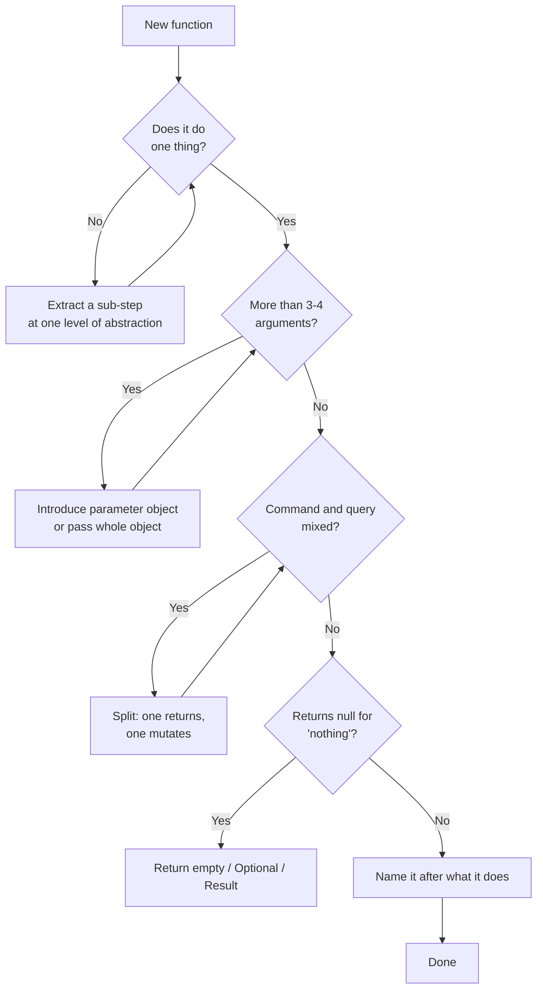

# Functions — Interview Questions

> 50+ questions on function design, grouped by tier (Junior → Mid → Senior → Staff). Crisp, correct answers; harder questions also explain *what the interviewer is really checking*. Use as self-review or interview prep.

---

## Table of Contents

- [Junior (15)](#junior-15) — the cleanliness rules: size, one thing, naming, arguments
- [Mid (15)](#mid-15) — side effects, CQS, flag/output arguments, null handling
- [Senior (12)](#senior-12) — temporal coupling, purity, abstraction levels, when *not* to extract
- [Staff (8)](#staff-8) — function design as an API contract, language idioms, performance
- [Rapid-Fire](#rapid-fire)
- [Summary](#summary)
- [Further Reading](#further-reading)
- [Related Topics](#related-topics)

The decision flow a clean function travels before it's "done":



---

## Junior (15)

### J1. What makes a function "clean"?

<details><summary>Answer</summary>

It does **one thing**, at **one level of abstraction**, with a name that says exactly what that thing is, and as few arguments as possible. A reader should understand its purpose from the signature alone and be able to predict its effects without surprises (no hidden side effects). Robert C. Martin's two rules in *Clean Code*: "functions should be small" and "they should be smaller than that."
</details>

### J2. How small should a function be?

<details><summary>Answer</summary>

Small enough that it does one thing. There is no universal line count, but the practical signal is: if you can describe the function honestly with a single sentence that has no "and" / "then" in it, it's the right size. *Clean Code* suggests "rarely 20 lines," often far fewer. Line count is a symptom, not the rule — see [J15](#j15-isnt-100-lines-automatically-too-long).
</details>

### J3. What is the "one thing" test?

<details><summary>Answer</summary>

A function does one thing if **all its statements are at the same level of abstraction** and you cannot extract another meaningful function from it with a name that isn't just a restatement of an implementation step. The classic phrasing: "Functions should do one thing. They should do it well. They should do it only."
</details>

### J4. How do you tell if a function does more than one thing?

<details><summary>Answer</summary>

Three quick heuristics:
- **Sections.** If the body has blank-line-separated "paragraphs," each is probably a separate thing.
- **The "to" test.** Describe it as "To X, we Y and then Z." Each step after "we" is a candidate function.
- **Mixed abstraction.** If one line is `calculateTax(order)` and the next is `for (int i = 0; i < items.length; i++)`, you've mixed a high-level intent with a low-level mechanism.
</details>

### J5. What does "one level of abstraction per function" mean?

<details><summary>Answer</summary>

Every statement in a function should be roughly the same "distance" from the problem domain. High-level functions read like prose (`fetchUser`, `validate`, `save`); low-level functions deal with mechanics (string slicing, index math, byte buffers). Mixing them forces the reader to constantly shift gears. The cure is the **Stepdown Rule**: code reads top-to-bottom, each function followed by those one level below it.
</details>

### J6. How many arguments should a function have?

<details><summary>Answer</summary>

Fewer is better. The ideal is zero (niladic), then one (monadic), then two (dyadic). Three (triadic) needs justification. Four or more is a smell — almost always those arguments form a hidden concept that wants to be an object. Fewer arguments means fewer things the reader must hold in their head and fewer test combinations.
</details>

### J7. Why are functions with many arguments hard to test?

<details><summary>Answer</summary>

Each argument multiplies the input space. A function with three booleans has 2³ = 8 behavioral paths to cover; add an enum with four values and you're at 32. Many arguments usually also mean many responsibilities, so the assertions multiply too. Small argument lists keep the combinatorics — and the test suite — manageable.
</details>

### J8. What is a flag argument and why is it bad?

<details><summary>Answer</summary>

A boolean parameter that switches the function's behavior: `render(true)`. It's bad because (a) the call site is opaque — `render(true)` tells the reader nothing; (b) it's a confession that the function does **two things**, one per branch. Cure: split it.

```java
// Bad
report.render(true);          // true means... what?

// Good
report.renderHtml();
report.renderPlainText();
```
</details>

### J9. What's an output argument?

<details><summary>Answer</summary>

A parameter the function mutates to return a result, instead of using the return value: `appendFooter(report)` where `report` is modified in place. Readers expect arguments to be **inputs**; mutating them is surprising. Prefer returning a value, or — if mutation is genuinely the intent — make it a method on the object being changed: `report.appendFooter()`.
</details>

### J10. Why prefer a return value over mutating a parameter?

<details><summary>Answer</summary>

Return values make data flow visible and composable: `b = f(a)` is obvious. Mutated arguments hide the effect behind the call and break referential transparency, making the code harder to reason about, reorder, and test. They also invite aliasing bugs when the same object is passed to two functions.
</details>

### J11. What is a side effect?

<details><summary>Answer</summary>

Any observable change a function makes beyond returning a value: mutating a field or argument, writing to a file/DB/network, printing, throwing, or changing global state. Side effects aren't evil — programs need them — but **hidden** side effects are. The danger is a function whose name promises one thing (`checkPassword`) but also does another (initializes the session).
</details>

### J12. Why should a function name be a verb (or verb phrase)?

<details><summary>Answer</summary>

Functions *do* things, so their names should read like actions: `deleteUser`, `isValid`, `parseDate`. A good name lets the call site read like a sentence and removes the need to read the body to know what it does. Boolean-returning functions read best as predicates: `isEmpty`, `hasAccess`, `shouldRetry`.
</details>

### J13. Should a function's name describe *what* it does or *how*?

<details><summary>Answer</summary>

**What**, at the abstraction level of the caller. `sortDescending` is fine; `bubbleSort` leaks the mechanism into the name and forces a rename if you swap algorithms. The how belongs inside the body. See the sibling chapter [Meaningful Names](../01-meaningful-names/README.md).
</details>

### J14. What's wrong with a function that returns `null`?

<details><summary>Answer</summary>

It pushes the burden of remembering the null check onto every caller; one forgotten check becomes a `NullPointerException` in production far from the source. For collections, return an **empty collection**. For "maybe a value," return `Optional`/`Option`/`Result`. For "this is an error," throw or return a typed error. Returning `null` is the source of a large fraction of runtime crashes.
</details>

### J15. Isn't 100 lines automatically too long?

<details><summary>Answer</summary>

**Trick question.** Length is a *symptom*, not the rule. A 100-line function that is one flat `switch` mapping 100 enum cases to strings, or one tight loop doing a single well-named operation, does one thing — splitting it would only scatter cohesion. The smell is **multiple unrelated phases** crammed together, not raw line count. Judge by responsibilities, not by `wc -l`.
</details>

---

## Mid (15)

### M1. What is Command-Query Separation (CQS)?

<details><summary>Answer</summary>

A function should be **either** a command (performs an action, changes state, returns nothing) **or** a query (returns data, changes nothing) — never both. Coined by Bertrand Meyer. The benefit: queries are safe to call freely and in any order; you can read state without fear of altering it.

```java
// Violates CQS: sets AND tells you the old value
boolean set(String attr, String value);

// CQS-clean
boolean attributeExists(String attr);  // query
void    setAttribute(String attr, String value);  // command
```
</details>

### M2. When is it OK to break CQS?

<details><summary>Answer</summary>

When atomicity demands it and the dual nature is a well-known idiom. `stack.pop()` mutates and returns; `map.putIfAbsent(k, v)` returns the previous value; `AtomicInteger.getAndIncrement()` is intentionally both. These are accepted because separating them would create a race condition (check-then-act). The rule is a default, not a religion — break it consciously, and name it so the dual behavior is obvious (`getAndIncrement`, not `increment`).

*What the interviewer is checking:* that you know the rule **and** its principled exceptions, rather than applying it dogmatically.
</details>

### M3. What is a pure function?

<details><summary>Answer</summary>

A function whose output depends **only** on its inputs and which has **no side effects**. Two consequences: (1) referential transparency — `f(2)` can be replaced by its result anywhere; (2) it's trivially testable and cacheable. `add(a, b)` is pure; `now()`, `rand()`, and anything reading mutable global state are not.
</details>

### M4. Why are pure functions valuable even in a non-functional language?

<details><summary>Answer</summary>

They are the easiest code to test (no setup, no mocks, no teardown), to reason about (no temporal dependencies), to parallelize (no shared state), and to memoize. A common architecture — "functional core, imperative shell" — pushes all logic into pure functions and confines side effects to a thin outer layer. See [Pure Functions](../15-pure-functions/README.md) for the dedicated chapter.
</details>

### M5. What is temporal coupling, and how do you spot it?

<details><summary>Answer</summary>

When functions must be called in a specific order for correctness, but nothing in the API enforces it: the caller must `connect()` before `send()` before `close()`. You spot it by a method that throws or misbehaves if a *different* method wasn't called first. It's fragile because the constraint lives only in the programmer's memory.

```java
// Hidden temporal coupling
mb.buildGradient();   // must be called first...
mb.reticulateSplines(); // ...or this NPEs
```
</details>

### M6. How do you remove temporal coupling?

<details><summary>Answer</summary>

Make the ordering impossible to get wrong:
- **Pass dependencies as arguments** so a step can't run without its prerequisite's output (`reticulate(buildGradient())`).
- **Builder / fluent API** that only exposes the next valid step.
- **Constructor establishes invariants**, so a half-built object never exists (resource acquired in the constructor, released in `close()`).
- **Combine the steps** into one method when they're never used independently.
</details>

### M7. What is a parameter object and when do you introduce one?

<details><summary>Answer</summary>

A small type that groups arguments which always travel together. When you see `(x, y)`, `(start, end)`, or `(street, city, zip)` recurring across signatures, that's a **data clump** — a missing concept. Replace it with `Point`, `Range`, `Address`. It shrinks the parameter list, names the concept, and gives behavior a home (`range.contains(t)`).
</details>

### M8. Doesn't bundling arguments into an object just hide the long parameter list?

<details><summary>Answer</summary>

Only if the object is an arbitrary bag. The refactor is legitimate when the grouped fields form a **cohesive concept** — they're conceptually one thing, so naming them as one thing is honesty, not hiding. `drawCircle(Point center, double radius)` is genuinely simpler than `drawCircle(x, y, radius)`. If the fields have nothing to do with each other, you've just renamed the smell.

*What the interviewer is checking:* whether you understand cohesion, not just mechanical refactoring.
</details>

### M9. How should a function signal an error: exception, null, or Result?

<details><summary>Answer</summary>

Depends on the kind of failure and the language idiom:
- **Exceptions** for *exceptional*, unexpected conditions where you can't sensibly continue (Java/Python idiom).
- **`Optional`/`Option`** when "no value" is a normal, expected outcome (`findUser` → `Optional<User>`).
- **`Result`/`Either`** (Rust, functional Scala/Kotlin) when errors are values to be handled explicitly and you want the type system to force handling.
- **`(value, error)`** in Go, where errors are ordinary return values.

Never use `null` to mean "error" — it's untyped and silently propagates.
</details>

### M10. What's the problem with throwing exceptions for control flow?

<details><summary>Answer</summary>

Exceptions are for the *exceptional*. Using them for ordinary branching (e.g., "user not found" as an exception in a lookup that misses half the time) is slow (stack capture), obscures the normal path, and surprises readers who expect exceptions to be rare. If "not found" is a normal outcome, model it as a return value (`Optional`).
</details>

### M11. What does "extract till you drop" mean, and what's its risk?

<details><summary>Answer</summary>

The discipline of extracting functions until each does exactly one thing — keep extracting while you can still name a coherent sub-step. The **risk** is over-extraction: a swarm of one-line functions called once, each forcing a jump to understand, producing "spaghetti by indirection." Extraction is good until the names stop adding meaning over the code they replace. See [S6](#s6-when-should-you-not-extract-a-function).
</details>

### M12. What is the "Stepdown Rule"?

<details><summary>Answer</summary>

Code should read like a top-down narrative: every function is followed by those at the next lower level of abstraction, so you can read the file as a sequence of "TO do X, we do A, B, C" paragraphs descending in detail. It makes a module skimmable — you read the top functions for intent and drill down only where needed.
</details>

### M13. Should a function have a single return statement?

<details><summary>Answer</summary>

**No — that's a myth from the structured-programming era.** Modern guidance favors **guard clauses**: return early for edge cases, keeping the happy path un-indented. Forcing a single exit often requires flag variables and deep nesting that hurt readability more than multiple returns ever could.

```java
// Guard clauses beat one-return-with-nesting
double pay(Employee e) {
    if (e == null) return 0;
    if (!e.isActive()) return 0;
    return e.baseSalary() + e.bonus();
}
```
</details>

### M14. What's wrong with mutating the input arguments of a function?

<details><summary>Answer</summary>

It surprises callers (arguments look like inputs), creates aliasing hazards (the same object passed twice, or held elsewhere, changes unexpectedly), and defeats parallelism. Prefer returning a new value. If you must mutate, do it on `this` (a method on the owning object), not on a passed-in parameter, so the mutation is expected. See [Immutability](../14-immutability/README.md).
</details>

### M15. How do side effects affect testability?

<details><summary>Answer</summary>

A pure function needs only `assertEquals(expected, f(input))`. A function with side effects needs setup (a DB, a clock, a filesystem), test doubles to observe the effects, and teardown to avoid cross-test contamination — and the tests are slower and flakier. Isolating side effects into a thin shell, with pure logic underneath, is the single biggest testability win for function design.
</details>

---

## Senior (12)

### S1. Walk me through refactoring a 150-line function with mixed abstraction levels.

<details><summary>Answer</summary>

1. **Write characterization tests** first if coverage is thin — capture current behavior so the refactor is safe.
2. **Identify the phases** (blank-line paragraphs, comment headers). Each is a candidate function.
3. **Extract each phase** to a function named for its *intent*, at the high level. The original becomes a short list of those calls.
4. **Pull data clumps into parameter objects** as you go; this shrinks the new signatures.
5. **Apply the Stepdown Rule** — order the extracted functions by abstraction level.
6. **Re-check the top function**: it should now read like a paragraph of prose. If a step still mixes levels, recurse.

The end state: one high-level orchestrator and a stack of single-purpose helpers. See [Refactoring techniques](../../refactoring/02-refactoring-techniques/README.md).
</details>

### S2. How do you balance "small functions" against "too many tiny functions"?

<details><summary>Answer</summary>

The metric isn't size — it's whether each function **earns its name**. A function is justified when its name communicates more than its body would inline: it hides a *decision*, names a *concept*, or removes *duplication*. A one-liner called once whose name merely restates its single statement (`incrementCounter()` → `counter++`) is noise. Optimize for the reader's number of mental "hops," not for function count in either direction.

*What the interviewer is checking:* judgment over dogma — that you've felt the pain of both god-functions and over-fragmentation.
</details>

### S3. Explain "functional core, imperative shell."

<details><summary>Answer</summary>

An architecture that pushes all decision-making logic into **pure** functions (the core) and confines side effects — I/O, DB, time, randomness — to a thin **imperative** outer layer (the shell). The core is fully unit-testable without mocks; the shell is simple enough to cover with a few integration tests. The shell fetches data, calls the pure core to decide, and performs the resulting effects. It maximizes the testable surface and localizes the hard-to-test parts.
</details>

### S4. How does CQS interact with idempotency and concurrency?

<details><summary>Answer</summary>

Pure **queries** are naturally idempotent and safe to call concurrently — no locking needed for correctness. **Commands** are where concurrency bugs live. CQS helps because it concentrates all state change into clearly-marked methods, so you know exactly where to reason about ordering, locking, and idempotency. The CQS exceptions (`getAndIncrement`) exist precisely because splitting them would open a check-then-act race; the atomic combined operation is the correct concurrent primitive.
</details>

### S5. What is referential transparency and why does it matter at scale?

<details><summary>Answer</summary>

An expression is referentially transparent if it can be replaced by its value without changing program behavior — the hallmark of pure functions. At scale it enables: aggressive **caching/memoization** (the compiler or you can cache freely), **common-subexpression elimination**, safe **reordering and parallelization**, and **equational reasoning** in code review ("this call equals that value, always"). It's the property that makes large functional codebases tractable.
</details>

### S6. When should you NOT extract a function?

<details><summary>Answer</summary>

**Trick / judgment question.** Don't extract when:
- The extracted name would only **restate the code** (`addOne(x)` for `x + 1`).
- It would **fragment a tight algorithm** whose steps are only meaningful together (a numerical kernel, a parser inner loop) — splitting hurts locality and cache behavior and obscures the math.
- It forces you to **thread many parameters and return tuples** just to share local state — that's a sign the method should become an *object* (Replace Method with Method Object), not several functions.
- It creates a **single-call helper that hides nothing** and adds a navigation hop.

The test: does the extraction increase or decrease the reader's total cognitive load? Extract for *meaning*, not for *line count*.
</details>

### S7. How do you design a function so callers can't misuse it (make illegal states unrepresentable)?

<details><summary>Answer</summary>

- **Types over comments.** Accept `Email`, not `String`; `PositiveInt`, not `int`. The compiler rejects bad calls.
- **No nullable returns** where empty/Optional/Result expresses intent.
- **Constructors enforce invariants** so a half-valid object can't be passed in.
- **Fluent/step builders** that only expose the next legal operation, killing temporal coupling.
- **Narrow parameter types** — take the smallest interface that does the job (`Iterable`, not `ArrayList`), so callers can't depend on or break unrelated capabilities.
</details>

### S8. How do flag arguments relate to the Open/Closed and Single Responsibility principles?

<details><summary>Answer</summary>

A flag argument is a branch baked into a signature — the function has (at least) two responsibilities, violating **SRP**. Every new variant adds another flag and another branch, so you modify the function for each change, violating **Open/Closed**. Splitting into separate functions (or polymorphic strategies) restores SRP and lets you add variants by adding code, not editing existing branches. See [SOLID principles](../../design-patterns/README.md) and the [anti-patterns](../../anti-patterns/README.md) section.
</details>

### S9. Describe converting hidden temporal coupling into a type-safe API.

<details><summary>Answer</summary>

Encode the protocol in the **types** so an out-of-order call won't compile. The step-builder / typestate pattern: each method returns a *different* interface representing the next valid state.

```java
// Connection can only send AFTER it is opened, enforced by types
interface Closed { Open open(); }
interface Open   { Open send(byte[] b); Closed close(); }

server.open().send(data).close();   // the only legal order compiles
```

In Go you'd return a distinct type from `Open()`; in Rust this is the typestate pattern via consuming `self`. The illegal order becomes a compile error instead of a runtime crash.
</details>

### S10. How do output parameters differ across Go, Java, and Python — and what's idiomatic?

<details><summary>Answer</summary>

- **Go:** has no exceptions for ordinary errors and *encourages* multiple return values: `v, err := f()`. The "output" is a real return, not a mutated arg — idiomatic and CQS-friendly. Mutating through a pointer arg exists (`json.Unmarshal(data, &v)`) but is reserved for specific cases.
- **Java:** output parameters are a smell; return a value or a small record. Pre-records, people abused them; `record` (Java 16+) made multi-value returns clean.
- **Python:** return a tuple (`return value, error`) or a dataclass; mutating a passed list/dict is occasionally idiomatic but should be documented. Beware the **mutable default argument** trap (`def f(x, acc=[])`).
</details>

### S11. What's the difference between defensive copying and trusting the caller in function arguments?

<details><summary>Answer</summary>

If a function stores a passed-in mutable collection, the caller can later mutate it and corrupt your object's invariants (and vice versa). **Defensive copy** at the boundary (`this.items = List.copyOf(items)`) trades a small allocation for safety and immutability. The alternative — documenting "don't mutate what you pass me" — relies on discipline and fails eventually. Copy at trust boundaries (public APIs, constructors of value objects); skip it for hot internal paths you fully control. See [Defensive vs offensive](../16-defensive-vs-offensive/README.md).
</details>

### S12. How do you keep a function at one level of abstraction when it must orchestrate I/O and logic?

<details><summary>Answer</summary>

Separate them. The orchestrator reads as intent — `var data = load(); var result = compute(data); store(result);` — where `load`/`store` are the (impure) shell calls and `compute` is the pure core. The orchestrator is at the *coordination* level; it never inlines a SQL string or a parsing loop. This is the function-level expression of "functional core, imperative shell," and it's what keeps a high-level function from drowning in mechanism.
</details>

---

## Staff (8)

### St1. Argue both sides: "small functions everywhere" as a team standard.

<details><summary>Answer</summary>

**For:** consistent readability, easy reuse, fine-grained testing, smaller diffs, easier code review, names that document intent.

**Against:** over-decomposition creates indirection fatigue — readers stack-jump across a dozen files to follow one operation; performance-sensitive code can lose locality; "one assertion per concept" can devolve into ceremony. Some operations are intrinsically a sequence and read better inline.

**Staff position:** make *cohesion and reader cognitive load* the standard, not a line-count lint rule. Encode it as guidance + code review judgment, with automated checks (cyclomatic/cognitive complexity) as a backstop, not a hard gate. The goal is comprehensible code, and both extremes can fail it.
</details>

### St2. How do you treat a public function signature as an API contract?

<details><summary>Answer</summary>

A public signature is a promise you can't cheaply break — callers depend on names, parameter order, types, nullability, thrown exceptions, and side-effect behavior. Design for evolution: prefer a **parameter object** so you can add fields without breaking callers; avoid boolean flags (they ossify into the contract); make nullability explicit in the type; document the side-effect and error contract. Changing it later requires deprecation cycles. Treat every exported function the way you'd treat a wire protocol. See API versioning at the system level.
</details>

### St3. How does function design change in hot-path / performance-critical code?

<details><summary>Answer</summary>

The clean-code defaults still hold *until a profiler says otherwise*. When it does:
- **Inlining limits:** very small extracted functions are usually inlined by the JIT/compiler (Java's `MaxInlineSize`, Go's inliner), so extraction is often free — but megamorphic virtual calls (4+ implementations) defeat devirtualization.
- **Allocation:** value objects from parameter-object refactors are typically scalar-replaced by escape analysis (Java) or stack-allocated (Go) when they don't escape — verify with `-XX:+PrintEscapeAnalysis` / `go build -gcflags=-m`.
- **Purity pays:** pure functions are safe to memoize/hoist out of loops.

The staff move is to *measure*, keep the clean structure for the 99% cold code, and make surgical, commented exceptions for the proven hot 1%.
</details>

### St4. Pure functions and the "now()" / "rand()" problem — how do you architect around inherent impurity?

<details><summary>Answer</summary>

Inject the impure source as a dependency so the core stays pure: pass a `Clock`, a `Random` (seeded), an ID generator. The function becomes pure with respect to its arguments — `price(order, clock.now())` — and tests pass a fixed clock. At the architecture level, this is dependency injection serving purity: the shell supplies real `Clock.systemUTC()`, tests supply `Clock.fixed(...)`. You've moved the impurity from buried-inside-the-logic to explicit-at-the-boundary.
</details>

### St5. How do you enforce function-design standards across a large codebase without bikeshedding?

<details><summary>Answer</summary>

Layer the controls:
- **Automated, objective gates:** cognitive-complexity and cyclomatic-complexity thresholds (SonarQube, golangci-lint's `gocyclo`/`gocognit`), parameter-count and nesting-depth lints. Use **baseline mode** so legacy debt doesn't block; only *new* violations fail.
- **Code review** for the subjective parts (naming, "does this earn its name," abstraction level) — humans, not linters.
- **A short, opinionated style guide** so debates resolve by reference, not by re-litigation.

The principle: automate what's objective, review what's judgment, document the agreed defaults.
</details>

### St6. Compare error-as-value (Go/Rust) vs exceptions (Java/Python) for function design.

<details><summary>Answer</summary>

**Errors as values** (Go `(v, err)`, Rust `Result`): explicit in the signature, forces handling at each call, no hidden control flow, but verbose and can drown the happy path in boilerplate (Go's `if err != nil`). **Exceptions:** keep the happy path clean and propagate automatically, but failures are *invisible in the signature* (Java checked exceptions tried to fix this and were widely disliked), and over-broad `catch` hides bugs.

Function-design implication: with errors-as-values, the error contract is in the type — great for reliability. With exceptions, you must document what's thrown and reserve them for the genuinely exceptional. Neither is universally right; match the idiom of the language and the failure's nature ([M9](#m9-how-should-a-function-signal-an-error-exception-null-or-result)).
</details>

### St7. How do generics change function design and the "one thing" rule?

<details><summary>Answer</summary>

Generics let one function do one thing *across many types* (`max<T extends Comparable>`), increasing reuse without violating single-responsibility — the "one thing" is now parametric. The risks: over-generalization (a function with five type parameters and three bounds is harder to read than two concrete versions), and constraints leaking complexity into the signature. The staff guideline: generalize when you have **two or more** real call sites with genuinely identical logic, not speculatively. See [Generics and types](../13-generics-and-types/README.md).
</details>

### St8. A junior submits a PR splitting one readable 30-line function into eight one-line functions. How do you respond?

<details><summary>Answer</summary>

*What the interviewer is checking: mentorship + principled judgment, not reflexive approval/rejection.*

Don't reject on instinct. Evaluate each extraction against "does it earn its name." Likely outcome: keep the 2-3 extractions that hide a real concept or remove duplication; inline the rest that merely restate a single statement. Frame the feedback around the **reader's cognitive load** and the *meaning* test, not a rule ("we don't do that"). Use it as a teaching moment: small functions are a means to comprehensibility, not the goal; over-fragmentation trades one readability problem (a long function) for another (indirection sprawl). Pair it with examples from the codebase.
</details>

---

## Rapid-Fire

| Question | Answer |
|---|---|
| Ideal argument count? | 0, then 1, then 2; 3 needs a reason; 4+ wants an object. |
| Flag argument fix? | Split into two named functions. |
| `null` for an empty list? | Return an empty collection. |
| `null` for "maybe a value"? | Return `Optional`/`Option`. |
| CQS in one line? | A method either does something or answers something — not both. |
| Pure function definition? | Output depends only on inputs; no side effects. |
| Single-return rule? | Myth — prefer guard clauses. |
| Output argument? | A mutated parameter used as a result — avoid; return instead. |
| Temporal coupling cure? | Pass prerequisites as args, or encode order in types. |
| "One thing" test? | One sentence, no "and"/"then"; all statements same abstraction level. |
| When NOT to extract? | When the name only restates the code or fragments a tight algorithm. |
| Go's error idiom? | `value, err := f()` — errors as return values. |
| Data clump cure? | Introduce a parameter object. |
| Mutable default arg (Python)? | Never — use `None` and create inside. |
| Stepdown Rule? | Read top-down; each function followed by ones a level lower. |
| Functional core, imperative shell? | Pure logic inside, side effects at a thin edge. |

---

## Summary

Clean functions are **small, single-purpose, single-abstraction-level**, with **few arguments** and **honest names**. The recurring themes across tiers:

- **Do one thing** — judged by responsibilities and abstraction level, not line count ([J3](#j3-what-is-the-one-thing-test), [J15](#j15-isnt-100-lines-automatically-too-long)).
- **Minimize and group arguments** — zero is best; flag args and data clumps are smells with known cures ([J6](#j6-how-many-arguments-should-a-function-have), [J8](#j8-what-is-a-flag-argument-and-why-is-it-bad), [M7](#m7-what-is-a-parameter-object-and-when-do-you-introduce-one)).
- **Separate commands from queries**, and isolate **side effects** so the testable core stays pure ([M1](#m1-what-is-command-query-separation-cqs), [M3](#m3-what-is-a-pure-function), [S3](#s3-explain-functional-core-imperative-shell)).
- **Make misuse impossible** — kill temporal coupling, avoid `null`, encode contracts in types ([M5](#m5-what-is-temporal-coupling-and-how-do-you-spot-it), [S7](#s7-how-do-you-design-a-function-so-callers-cant-misuse-it-make-illegal-states-unrepresentable), [S9](#s9-describe-converting-hidden-temporal-coupling-into-a-type-safe-api)).
- **Know when *not* to apply the rules** — over-extraction and dogmatic single-return hurt readability as much as god-functions ([M13](#m13-should-a-function-have-a-single-return-statement), [S6](#s6-when-should-you-not-extract-a-function), [St1](#st1-argue-both-sides-small-functions-everywhere-as-a-team-standard)).

The senior signal in every answer: principle plus its exceptions, and *the reader's cognitive load* as the north star.

---

## Further Reading

- Robert C. Martin, *Clean Code* — Chapter 3, "Functions."
- Martin Fowler, *Refactoring* (2nd ed.) — Extract Function, Introduce Parameter Object, Replace Method with Method Object.
- Bertrand Meyer, *Object-Oriented Software Construction* — Command-Query Separation.
- Gary Bernhardt, "Boundaries" talk — functional core, imperative shell.
- Local: [clean-code criticisms](../00-criticisms.md) for the counter-arguments to these rules.

---

## Related Topics

- [Functions — chapter README](../README.md)
- Same chapter: [junior.md](junior.md) · [professional.md](professional.md)
- Sibling chapter: [Meaningful Names](../01-meaningful-names/README.md)
- This section: [Pure Functions](../15-pure-functions/README.md) · [Immutability](../14-immutability/README.md) · [Defensive vs Offensive](../16-defensive-vs-offensive/README.md)
- Other code-craft sections: [Anti-Patterns](../../anti-patterns/README.md) · [Refactoring](../../refactoring/README.md) · [Design Patterns](../../design-patterns/README.md)
