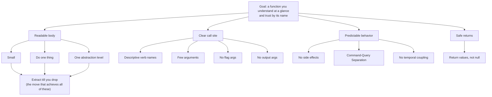

# Functions — Junior Level

> **Level:** Junior — *"What is the rule? Show me a clean example."*
> **Source:** Robert C. Martin, *Clean Code*, Chapter 3 — Functions.

---

## Table of Contents

1. [Why functions are the unit of clean code](#why-functions-are-the-unit-of-clean-code)
2. [Real-world analogy](#real-world-analogy)
3. [The rules at a glance](#the-rules-at-a-glance)
4. [Rule 1 — Functions should be small](#rule-1--functions-should-be-small)
5. [Rule 2 — Do one thing](#rule-2--do-one-thing)
6. [Rule 3 — One level of abstraction per function](#rule-3--one-level-of-abstraction-per-function)
7. [Rule 4 — Descriptive verb names](#rule-4--descriptive-verb-names)
8. [Rule 5 — Few arguments (0 is best, then 1, 2)](#rule-5--few-arguments-0-is-best-then-1-2)
9. [Rule 6 — No flag arguments](#rule-6--no-flag-arguments)
10. [Rule 7 — No side effects](#rule-7--no-side-effects)
11. [Rule 8 — No output arguments](#rule-8--no-output-arguments)
12. [Rule 9 — Command-Query Separation](#rule-9--command-query-separation)
13. [Rule 10 — Avoid hidden temporal coupling](#rule-10--avoid-hidden-temporal-coupling)
14. [Rule 11 — Return values, not null](#rule-11--return-values-not-null)
15. [Rule 12 — Extract till you drop](#rule-12--extract-till-you-drop)
16. [Common Mistakes](#common-mistakes)
17. [Test Yourself](#test-yourself)
18. [Cheat Sheet](#cheat-sheet)
19. [Summary](#summary)
20. [Further Reading](#further-reading)
21. [Related Topics](#related-topics)

---

## Why functions are the unit of clean code

A program is a collection of functions calling other functions. If each function is small, honest about what it does, and named so you can read it without opening its body, the whole program reads like prose. If functions are long, do several things, and lie about it in their names, every reading is an investigation.

Clean Code's chapter on functions is really one idea expressed twelve ways: **a function should be so small and so focused that you can understand it in a single glance, and trust its name without reading its body.** Every rule below pushes toward that goal.

This is the junior file. Its job is simple: state each rule plainly, show a dirty version, and show the clean version in **Go, Java, and Python**. The *when* and the *trade-offs* come at the [middle](middle.md) and [senior](senior.md) levels.

---

## Real-world analogy

### A recipe vs. a wall of text

Compare two ways of writing the same recipe.

**Version A — one paragraph:**

> Heat the oven, but first dice the onions while it heats, then in a bowl mix flour and sugar unless you already creamed the butter, in which case fold the dry mix in after you whisk three eggs, oh and grease the pan before any of this or it'll stick...

You have to read the whole thing, twice, to cook anything. The steps are tangled. The order is hidden inside prose.

**Version B — named steps:**

> 1. `preheatOven(180)`
> 2. `prepareePan()`
> 3. `mixDryIngredients()`
> 4. `creamButterAndSugar()`
> 5. `combineAndBake()`

Each step has a name. You can read the top level and understand the whole dish without knowing *how* `mixDryIngredients` works. If a step is wrong, you go fix exactly that step. **That is what well-factored functions do to a program.**

A long, multi-purpose function is Version A. The rules in this chapter turn it into Version B.

---

## The rules at a glance

| Rule | One-line statement | Anti-pattern it kills |
|---|---|---|
| Small | Functions should be small — then smaller | 200-line method |
| One thing | A function does ONE thing, well | Mixed validation + compute + I/O |
| One abstraction level | Don't mix high-level and low-level steps | `chargeCard()` next to `s[i] = '\0'` |
| Descriptive names | Name says what it does; names are verbs | `handle()`, `doIt()`, `process2()` |
| Few arguments | 0 ideal, 1–2 fine, 3 suspicious | `f(a, b, c, d, e, f)` |
| No flag args | Don't pass a boolean that switches behavior | `render(true)` |
| No side effects | Don't secretly change hidden state | `checkPassword()` that also logs you in |
| No output args | Return results; don't mutate parameters | `void appendFooter(report)` |
| Command-Query Separation | Do something **or** answer something — not both | `if (set("k","v")) ...` |
| No temporal coupling | Caller shouldn't need to call `a()` before `b()` | `open()` required before `read()` |
| No null returns | Return empty/Optional/Result, not `null` | `getItems()` returns `null` |
| Extract till you drop | Keep extracting until each function can't be split | god method |

---

## Rule 1 — Functions should be small

**The rule:** Functions should be small. The first rule is that they should be small. The second rule is that *they should be smaller than that.* A function that doesn't fit on a screen is a warning; one well-named thing rarely needs 100 lines.

Small isn't a line-count law — it's a consequence of doing one thing (Rule 2). But size is the symptom you notice first.

### Before — one big function

```go
// Go — everything crammed into one function
func RegisterUser(name, email, rawPassword string) error {
    if name == "" || len(name) > 100 {
        return errors.New("invalid name")
    }
    if !strings.Contains(email, "@") {
        return errors.New("invalid email")
    }
    if len(rawPassword) < 8 {
        return errors.New("password too short")
    }
    hash := sha256.Sum256([]byte(rawPassword + "salt"))
    hashed := hex.EncodeToString(hash[:])
    _, err := db.Exec("INSERT INTO users(name,email,pw) VALUES(?,?,?)",
        name, email, hashed)
    if err != nil {
        return err
    }
    log.Printf("registered %s", email)
    return nil
}
```

### After — small, named steps

```go
func RegisterUser(name, email, rawPassword string) error {
    if err := validateRegistration(name, email, rawPassword); err != nil {
        return err
    }
    hashed := hashPassword(rawPassword)
    if err := saveUser(name, email, hashed); err != nil {
        return err
    }
    log.Printf("registered %s", email)
    return nil
}
```

```java
// Java — after
void registerUser(String name, String email, String rawPassword) {
    validateRegistration(name, email, rawPassword);
    String hashed = hashPassword(rawPassword);
    saveUser(name, email, hashed);
    log.info("registered {}", email);
}
```

```python
# Python — after
def register_user(name: str, email: str, raw_password: str) -> None:
    validate_registration(name, email, raw_password)
    hashed = hash_password(raw_password)
    save_user(name, email, hashed)
    log.info("registered %s", email)
```

The top-level function now fits in five lines and reads like a summary. The details moved into named helpers you can read on demand.

---

## Rule 2 — Do one thing

**The rule:** A function should do ONE thing, do it well, and do it only. The classic test: if you can extract another function from it with a name that is *not* just a restatement of its implementation, it was doing more than one thing.

Another test: describe the function in one sentence with **no "and"** and no "to do X, first do Y." If you need "and," it does more than one thing.

### Before — three things in one function

```python
# Python — validates, computes, AND emails. Three responsibilities.
def process_invoice(invoice):
    if invoice.total < 0:
        raise ValueError("negative total")
    tax = invoice.total * 0.08
    grand_total = invoice.total + tax
    send_email(invoice.customer_email, f"You owe ${grand_total:.2f}")
    return grand_total
```

### After — each function does one thing

```python
def process_invoice(invoice):
    validate(invoice)
    grand_total = total_with_tax(invoice)
    notify_customer(invoice.customer_email, grand_total)
    return grand_total

def validate(invoice):
    if invoice.total < 0:
        raise ValueError("negative total")

def total_with_tax(invoice):
    return invoice.total * 1.08

def notify_customer(email, amount):
    send_email(email, f"You owe ${amount:.2f}")
```

```java
// Java — after
double processInvoice(Invoice invoice) {
    validate(invoice);
    double grandTotal = totalWithTax(invoice);
    notifyCustomer(invoice.customerEmail(), grandTotal);
    return grandTotal;
}
```

```go
// Go — after
func ProcessInvoice(inv Invoice) (float64, error) {
    if err := validate(inv); err != nil {
        return 0, err
    }
    grandTotal := totalWithTax(inv)
    notifyCustomer(inv.CustomerEmail, grandTotal)
    return grandTotal, nil
}
```

> **Note:** "Do one thing" and "be small" are the same rule seen from two sides. A function that does one thing *is* naturally small; making a function small forces you to factor out the extra things.

---

## Rule 3 — One level of abstraction per function

**The rule:** All statements in a function should be at the same level of abstraction. Don't mix high-level policy (`chargeCustomer()`) with low-level mechanics (`buffer[i] = 0`) in the same body. Mixing levels forces the reader to constantly shift mental gears.

A good heuristic: if you read a function top to bottom, each line should feel like it belongs to the same paragraph. A line about *what the business wants* sitting next to a line about *string-index arithmetic* is a level mismatch.

### Before — mixed levels

```java
// Java — high-level intent mixed with low-level string surgery
String renderPageTitle(Page page) {
    StringBuilder sb = new StringBuilder();   // low level
    sb.append("<h1>");                          // low level
    String title = page.getTitle();             // mid level
    for (int i = 0; i < title.length(); i++) {  // low level
        char c = title.charAt(i);
        if (c == '<') sb.append("&lt;");        // low level: escaping
        else sb.append(c);
    }
    sb.append("</h1>");                          // low level
    return sb.toString();
}
```

### After — one level per function

```java
String renderPageTitle(Page page) {
    return wrapInH1(escapeHtml(page.getTitle()));   // all high level
}

private String wrapInH1(String text) {
    return "<h1>" + text + "</h1>";
}

private String escapeHtml(String text) {
    return text.replace("<", "&lt;").replace(">", "&gt;");
}
```

```python
# Python — after
def render_page_title(page):
    return wrap_in_h1(escape_html(page.title))

def wrap_in_h1(text):
    return f"<h1>{text}</h1>"

def escape_html(text):
    return text.replace("<", "&lt;").replace(">", "&gt;")
```

```go
// Go — after
func RenderPageTitle(p Page) string {
    return wrapInH1(escapeHTML(p.Title))
}

func wrapInH1(text string) string { return "<h1>" + text + "</h1>" }

func escapeHTML(text string) string {
    text = strings.ReplaceAll(text, "<", "&lt;")
    return strings.ReplaceAll(text, ">", "&gt;")
}
```

Now `renderPageTitle` reads as pure intent. The character-level escaping lives one level down, where it belongs.

---

## Rule 4 — Descriptive verb names

**The rule:** A function *does* something, so its name should be a verb or verb phrase that says exactly what. The longer and more descriptive the name, the better — a long descriptive name beats a short cryptic one, and beats a long comment explaining a vague name.

Bad: `handle()`, `doIt()`, `process()`, `data()`, `manager2()`.
Good: `isEligibleForDiscount()`, `sendWelcomeEmail()`, `parseIsoDate()`, `calculateMonthlyInterest()`.

### Before — vague names

```go
// Go — what does any of this do?
func (s *Service) Do(u *User) bool {
    return s.check(u) && s.proc(u)
}
func (s *Service) check(u *User) bool { /* validates account */ }
func (s *Service) proc(u *User) bool  { /* charges the card */ }
```

### After — names that read like sentences

```go
func (s *Service) ActivateSubscription(u *User) bool {
    return s.hasValidPaymentMethod(u) && s.chargeFirstMonth(u)
}
func (s *Service) hasValidPaymentMethod(u *User) bool { /* ... */ }
func (s *Service) chargeFirstMonth(u *User) bool       { /* ... */ }
```

```java
// Java — after
boolean activateSubscription(User u) {
    return hasValidPaymentMethod(u) && chargeFirstMonth(u);
}
```

```python
# Python — after
def activate_subscription(self, user) -> bool:
    return self.has_valid_payment_method(user) and self.charge_first_month(user)
```

Naming conventions worth internalizing:

- **Actions** are verbs: `save`, `delete`, `render`, `calculate`.
- **Predicates** (return a boolean) read as questions: `is_valid`, `has_access`, `can_retry`.
- **Getters** that answer something: `get_total`, `current_user`, `find_by_id`.

> **Tip:** If you can't think of a good verb name, the function probably does more than one thing (Rule 2). The naming difficulty is a smell, not a vocabulary problem.

---

## Rule 5 — Few arguments (0 is best, then 1, 2)

**The rule:** The ideal number of arguments is **zero**. Then **one**, then **two**. **Three** is suspicious and needs justification. More than three almost always means a missing concept that should be bundled into an object. Fewer arguments are easier to read, easier to call correctly, and easier to test.

Why arguments are costly:

- Each argument is one more thing the reader must hold in their head.
- Order matters and is invisible at the call site: `transfer(from, to)` vs `transfer(to, from)`.
- Each argument multiplies the number of test cases.

### Before — too many loose arguments

```python
# Python — six arguments, order is a guessing game
def create_event(title, year, month, day, hour, minute):
    ...

create_event("Standup", 2026, 6, 10, 9, 30)  # which number is what?
```

### After — bundle related arguments

```python
from dataclasses import dataclass
from datetime import datetime

@dataclass(frozen=True)
class Event:
    title: str
    starts_at: datetime

def create_event(event: Event):
    ...

create_event(Event("Standup", datetime(2026, 6, 10, 9, 30)))
```

```java
// Java — bundle the date fields into a single value
record Event(String title, LocalDateTime startsAt) {}

void createEvent(Event event) { /* ... */ }

createEvent(new Event("Standup", LocalDateTime.of(2026, 6, 10, 9, 30)));
```

```go
// Go — group the clump into a struct
type Event struct {
    Title    string
    StartsAt time.Time
}

func CreateEvent(e Event) error { /* ... */ }

CreateEvent(Event{
    Title:    "Standup",
    StartsAt: time.Date(2026, 6, 10, 9, 30, 0, 0, time.UTC),
})
```

When several arguments always travel together (`year, month, day, hour, minute` → a timestamp; `street, city, zip` → an address), that group is a missing type. Bundling it shortens *every* call site and gives the concept a home.

---

## Rule 6 — No flag arguments

**The rule:** Don't pass a boolean (or an enum used only to switch behavior) into a function to make it do one of two different things. A flag argument loudly announces that the function does **more than one thing** — and the call site `render(true)` tells the reader nothing. Split it into two clearly named functions.

### Before — flag argument

```java
// Java — what does `true` mean here?
String render(boolean isHtml) {
    if (isHtml) {
        return "<p>" + body + "</p>";
    } else {
        return body;
    }
}

render(true);   // unreadable at the call site
render(false);
```

### After — one function per behavior

```java
String renderHtml() {
    return "<p>" + body + "</p>";
}

String renderText() {
    return body;
}

renderHtml();   // self-documenting
renderText();
```

```python
# Python — before
def render(is_html):
    return f"<p>{body}</p>" if is_html else body

# Python — after
def render_html():
    return f"<p>{body}</p>"

def render_text():
    return body
```

```go
// Go — before
func Render(isHTML bool) string {
    if isHTML {
        return "<p>" + body + "</p>"
    }
    return body
}

// Go — after
func RenderHTML() string { return "<p>" + body + "</p>" }
func RenderText() string { return body }
```

> **Watch for:** the same problem hides behind enums and string modes when they only choose a branch: `export(data, "csv")` vs `export(data, "json")`. If each mode runs a separate code path, prefer `exportCsv(data)` and `exportJson(data)`.

---

## Rule 7 — No side effects

**The rule:** A function should not secretly do something its name doesn't promise. A side effect is any hidden change to state outside the function — mutating a global, writing a file, changing a passed-in object, logging the user in — that a reader wouldn't expect from the name. Hidden side effects create coupling and bugs that are brutal to trace.

### Before — a hidden side effect

```python
# Python — the name says "check"; it secretly logs you in
def check_password(user, password):
    if hashlib.sha256(password.encode()).hexdigest() == user.password_hash:
        Session.initialize(user)   # SURPRISE: hidden side effect
        return True
    return False
```

A caller who only wants to *check* a password — say, in a "change password" form — accidentally creates a session. The name lied.

### After — the function does only what its name says

```python
def is_password_correct(user, password) -> bool:
    return hashlib.sha256(password.encode()).hexdigest() == user.password_hash

# the caller decides, explicitly, to start a session:
if is_password_correct(user, password):
    Session.initialize(user)
```

```java
// Java — after
boolean isPasswordCorrect(User user, String password) {
    return hash(password).equals(user.passwordHash());
}

if (isPasswordCorrect(user, password)) {
    session.initialize(user);   // side effect is now explicit and visible
}
```

```go
// Go — after
func IsPasswordCorrect(u User, password string) bool {
    return hash(password) == u.PasswordHash
}

if IsPasswordCorrect(u, password) {
    session.Initialize(u)
}
```

The rule isn't "never have side effects" — programs must change state. The rule is: **don't hide them.** If a function's job *is* to cause an effect, name it for that effect (`startSession`, `writeLog`). The danger is effects that contradict or hide behind an innocent name.

---

## Rule 8 — No output arguments

**The rule:** Don't pass an object into a function for the function to *mutate* and hand back through the parameter. Arguments are naturally read as **inputs**. When a function modifies one, the reader has to inspect the body to discover the parameter was actually an output. Prefer returning the result.

### Before — output argument

```java
// Java — does this READ report or CHANGE it? You can't tell from the call.
void appendFooter(StringBuilder report) {
    report.append("\n--- end of report ---");
}

appendFooter(report);   // looks like report is just input
```

### After — return the new value

```java
String withFooter(String report) {
    return report + "\n--- end of report ---";
}

report = withFooter(report);   // the assignment makes the change obvious
```

```python
# Python — before: mutates the caller's list in place
def add_footer(lines):
    lines.append("--- end of report ---")

# Python — after: returns a new list, leaves the input alone
def with_footer(lines):
    return [*lines, "--- end of report ---"]

report = with_footer(report)
```

```go
// Go — before: mutates via pointer
func AppendFooter(report *[]string) {
    *report = append(*report, "--- end of report ---")
}

// Go — after: takes a value, returns the new one
func WithFooter(report []string) []string {
    return append(report, "--- end of report ---")
}

report = WithFooter(report)
```

The `report = withFooter(report)` form puts the change on the left of an `=`, exactly where a reader looks for "what got modified." Output arguments hide that.

> **Object-oriented exception:** when the object's *own* method changes the object's *own* state (`list.append(x)`, `account.deposit(50)`), that is not an output argument — it is the object acting on itself, which `this`/`self` makes obvious. The smell is mutating *someone else's* object passed in as a parameter.

---

## Rule 9 — Command-Query Separation

**The rule:** A function should either **do** something (a *command*: change state, return nothing meaningful) **or answer** something (a *query*: return a value, change nothing) — **never both.** A function that both changes the world and returns a value forces callers to guess which it's for, and makes the same call mean different things in different places.

### Before — does AND answers

```go
// Go — does set() store the value, or test whether a key already exists?
// The bool return is ambiguous, and it mutates while answering.
func (m *Config) Set(key, value string) bool {
    _, existed := m.data[key]
    m.data[key] = value
    return existed
}

// Reads confusingly — what is this branch about?
if config.Set("timeout", "30") {
    // ...
}
```

### After — separate the command from the query

```go
func (m *Config) Has(key string) bool {       // query: answers, no mutation
    _, ok := m.data[key]
    return ok
}

func (m *Config) Set(key, value string) {     // command: mutates, returns nothing
    m.data[key] = value
}

// Now each call reads clearly:
if config.Has("timeout") {
    // ...
}
config.Set("timeout", "30")
```

```java
// Java — after
boolean has(String key) { return data.containsKey(key); }   // query
void set(String key, String value) { data.put(key, value); } // command
```

```python
# Python — after
def has(self, key) -> bool:        # query
    return key in self._data

def set(self, key, value) -> None: # command
    self._data[key] = value
```

The mental model: a **query** is a question you can ask twice and get the same answer (no surprises). A **command** is an action you perform deliberately. Keeping them apart removes a whole category of "wait, calling this *changed* something?" bugs.

---

## Rule 10 — Avoid hidden temporal coupling

**The rule:** Don't design functions so that the caller must call them in a secret, unenforced order — `a()` *must* run before `b()`, or `init()` before everything. This is **temporal coupling**: the dependency exists in time but is invisible in the code. If order matters, make the code *enforce* it, so it can't be gotten wrong.

### Before — hidden ordering

```python
# Python — you MUST call connect() before query(), but nothing says so
class Database:
    def connect(self):
        self.conn = open_connection()

    def query(self, sql):
        return self.conn.execute(sql)   # crashes if connect() wasn't called

db = Database()
db.query("SELECT 1")   # AttributeError: no attribute 'conn' — easy mistake
```

### After — make the order impossible to get wrong

```python
class Database:
    def __init__(self, conn):
        self._conn = conn   # cannot exist without a connection

    @classmethod
    def connect(cls):
        return cls(open_connection())

    def query(self, sql):
        return self._conn.execute(sql)

db = Database.connect()    # the only way to get a Database is connected
db.query("SELECT 1")       # always safe
```

```java
// Java — after: the constructor requires the connection, so order can't be wrong
class Database {
    private final Connection conn;
    private Database(Connection conn) { this.conn = conn; }

    static Database connect() {
        return new Database(openConnection());
    }

    ResultSet query(String sql) { return conn.execute(sql); }
}
```

```go
// Go — after: NewDatabase returns a ready-to-use value or an error
type Database struct{ conn *Conn }

func NewDatabase() (*Database, error) {
    conn, err := openConnection()
    if err != nil {
        return nil, err
    }
    return &Database{conn: conn}, nil
}

func (d *Database) Query(sql string) (*Rows, error) {
    return d.conn.Execute(sql)
}
```

The fix pattern: **pass what's needed into the constructor** (or a factory) so an object can't exist in a half-initialized, must-call-`init()`-first state. When that isn't possible, have one function *return* the thing the next function needs, so the compiler forces the order.

---

## Rule 11 — Return values, not null

**The rule:** Prefer returning an empty collection, an `Optional`/`Result`, or throwing a clear exception over returning `null`. Returning `null` pushes the burden onto every caller to remember a `null` check — and the one who forgets gets a `NullPointerException` far from the cause.

### Before — returns null

```java
// Java — caller MUST null-check or crash later
List<Order> getOrders(Customer c) {
    if (c.hasOrders()) {
        return c.orders();
    }
    return null;   // forces a null check on every caller
}

for (Order o : getOrders(c)) {   // NullPointerException if no orders
    ...
}
```

### After — empty collection or Optional

```java
// For "many" results: return an empty list, never null.
List<Order> getOrders(Customer c) {
    return c.hasOrders() ? c.orders() : List.of();
}

for (Order o : getOrders(c)) {   // safely iterates zero times
    ...
}

// For "maybe one" result: return Optional, never null.
Optional<Customer> findByEmail(String email) {
    return repository.lookup(email);   // Optional.empty() if absent
}

findByEmail("a@b.com")
    .map(Customer::name)
    .ifPresent(System.out::println);
```

```python
# Python — return [] for collections; raise or return None deliberately for "one"
def get_orders(customer) -> list:
    return customer.orders if customer.has_orders else []   # never None

# For a single optional result, make absence explicit in the type hint:
def find_by_email(email: str) -> Customer | None:
    return repository.lookup(email)   # caller sees `| None` and must handle it
```

```go
// Go — the idiom is a (value, ok) or (value, error) pair, not a bare nil
func GetOrders(c Customer) []Order {
    if !c.HasOrders() {
        return []Order{}   // empty slice ranges safely; never return nil-as-surprise
    }
    return c.Orders
}

func FindByEmail(email string) (Customer, bool) {
    cust, ok := repository.Lookup(email)
    return cust, ok   // caller must check `ok` — the compiler nudges them
}
```

Three clean alternatives, in order of preference:

1. **Empty collection** when the result is "zero or more." An empty list iterates safely; a `null` list crashes.
2. **`Optional` / `(value, ok)` / `T | None`** when the result is "zero or one." The type itself tells the caller absence is possible.
3. **Throw / return an error** when absence is genuinely exceptional (the ID *must* exist).

---

## Rule 12 — Extract till you drop

**The rule:** Keep extracting smaller functions until you *cannot* meaningfully extract another — until each function does exactly one thing and you can't think of a name for a sub-part that isn't just the implementation restated. This is how all the rules above get applied in practice: extraction is the mechanical move that makes functions small, single-purpose, and single-level.

### Before — one function carrying four steps

```go
// Go — readable-ish, but four distinct steps live in one body
func GeneratePayslip(emp Employee) Payslip {
    // gross
    gross := emp.HourlyRate * float64(emp.HoursWorked)
    if emp.HoursWorked > 160 {
        gross += emp.HourlyRate * 1.5 * float64(emp.HoursWorked-160)
    }
    // tax
    var tax float64
    if gross > 5000 {
        tax = gross * 0.30
    } else {
        tax = gross * 0.20
    }
    // deductions
    deductions := emp.HealthPlanCost + emp.RetirementContribution
    // net
    net := gross - tax - deductions
    return Payslip{Gross: gross, Tax: tax, Deductions: deductions, Net: net}
}
```

### After — extract each step

```go
func GeneratePayslip(emp Employee) Payslip {
    gross := grossPay(emp)
    tax := taxOn(gross)
    deductions := totalDeductions(emp)
    return Payslip{
        Gross:      gross,
        Tax:        tax,
        Deductions: deductions,
        Net:        gross - tax - deductions,
    }
}

func grossPay(emp Employee) float64 {
    base := emp.HourlyRate * float64(emp.HoursWorked)
    if emp.HoursWorked > 160 {
        base += emp.HourlyRate * 1.5 * float64(emp.HoursWorked-160)
    }
    return base
}

func taxOn(gross float64) float64 {
    if gross > 5000 {
        return gross * 0.30
    }
    return gross * 0.20
}

func totalDeductions(emp Employee) float64 {
    return emp.HealthPlanCost + emp.RetirementContribution
}
```

```python
# Python — after
def generate_payslip(emp):
    gross = gross_pay(emp)
    tax = tax_on(gross)
    deductions = total_deductions(emp)
    return Payslip(gross, tax, deductions, net=gross - tax - deductions)

def gross_pay(emp):
    base = emp.hourly_rate * emp.hours_worked
    if emp.hours_worked > 160:
        base += emp.hourly_rate * 1.5 * (emp.hours_worked - 160)
    return base

def tax_on(gross):
    return gross * 0.30 if gross > 5000 else gross * 0.20

def total_deductions(emp):
    return emp.health_plan_cost + emp.retirement_contribution
```

```java
// Java — after
Payslip generatePayslip(Employee emp) {
    double gross = grossPay(emp);
    double tax = taxOn(gross);
    double deductions = totalDeductions(emp);
    return new Payslip(gross, tax, deductions, gross - tax - deductions);
}

double grossPay(Employee emp) {
    double base = emp.hourlyRate() * emp.hoursWorked();
    if (emp.hoursWorked() > 160) {
        base += emp.hourlyRate() * 1.5 * (emp.hoursWorked() - 160);
    }
    return base;
}

double taxOn(double gross) {
    return gross > 5000 ? gross * 0.30 : gross * 0.20;
}

double totalDeductions(Employee emp) {
    return emp.healthPlanCost() + emp.retirementContribution();
}
```

Now `generatePayslip` is a four-line summary; the overtime rule, the tax bracket, and the deduction list each have a name, a single home, and a place to be tested in isolation.

> **Caution:** "extract till you drop" stops when extracting would force a *bad* name. If the only name you can give a fragment is `step2()` or `helperForLoop()`, that fragment isn't a real concept — leave it inline. A function whose name merely restates its body adds noise, not clarity.

---

## Common Mistakes

| Mistake | Why it hurts | Fix |
|---|---|---|
| Splitting by line count, not by concept | `partA()`/`partB()` with meaningless names are worse than one honest function | Extract along *responsibilities*, name by what each does |
| Boolean flag arguments | `save(true)` is unreadable at the call site | Two functions: `saveDraft()` / `savePublished()` |
| Mutating a passed-in argument | Reader assumes parameters are input-only | Return a new value; assign it back |
| Returning `null` for "nothing" | Every caller must remember a null check; one forgets | Empty collection, `Optional`/`Result`, or a thrown error |
| A query that also mutates | Calling it to "check" silently changes state | Separate command from query (CQS) |
| A function whose name has "and" in it | It's doing two things | Split into two functions |
| Requiring callers to call `init()` first | Temporal coupling → crashes when forgotten | Initialize in the constructor/factory; return a ready object |
| Mixing `chargeCard()` with byte-level string work | Reader's brain shifts levels constantly | One abstraction level per function |

---

## Test Yourself

**1. Why is `render(true)` worse than `renderHtml()`, even though both compile and run?**

<details><summary>Answer</summary>

`render(true)` is unreadable at the call site — `true` carries no meaning, so you must open `render`'s body to learn what it does. It also proves `render` does *two* things (HTML vs. non-HTML), violating "do one thing." `renderHtml()` and `renderText()` are self-documenting and each does exactly one thing. Flag arguments are a code smell precisely because they bundle two behaviors behind one ambiguous call.

</details>

**2. A function `getUsers()` returns `null` when there are no users. What's the problem, and what should it return instead?**

<details><summary>Answer</summary>

Returning `null` forces every caller to write a null check before iterating; the caller who forgets gets a `NullPointerException` (or `AttributeError`/nil panic) far from the cause. Since the result is "zero or more," it should return an **empty collection** (`List.of()`, `[]`, `[]User{}`), which iterates safely zero times. For a "zero or one" result, return `Optional` / `T | None` / `(value, ok)` so the type itself signals possible absence.

</details>

**3. What is wrong with this function, in CQS terms?**
```java
boolean setName(String name) {
    boolean changed = !name.equals(this.name);
    this.name = name;
    return changed;
}
```

<details><summary>Answer</summary>

It violates **Command-Query Separation**: it both *does* something (mutates `this.name` — a command) and *answers* something (returns whether the name changed — a query). A reader at the call site can't tell whether `if (setName("Sam"))` is testing a condition or performing an action, and the same call means different things to different readers. Split it: a `void setName(String)` command, and if the "did it change?" information is truly needed, a separate query computed before the set.

</details>

**4. Your teammate says, "This function is only 12 lines, so it's fine — small functions are the rule." Is line count the real rule?**

<details><summary>Answer</summary>

No. Line count is a *symptom*, not the rule. The real rule is **do one thing at one level of abstraction**. A 12-line function that validates input, computes a total, *and* sends an email is too big — it does three things. A 40-line function that applies one named transformation in a loop can be perfectly clean. Smallness is what naturally results from doing one thing; chase the one-thing rule and size takes care of itself.

</details>

**5. What is "temporal coupling," and how do you design it away?**

<details><summary>Answer</summary>

Temporal coupling is when functions must be called in a specific order that nothing in the code enforces — e.g., you must call `connect()` before `query()`, or `init()` before anything else. It's invisible and easy to violate, causing crashes when someone forgets. Design it away by making the bad order impossible: require the dependency in the constructor/factory so an object can't exist half-initialized, or have one function *return* the input the next one needs, so the compiler enforces the sequence.

</details>

**6. Is `account.deposit(50)` an "output argument" violation, since it mutates state?**
</invoke>
<details><summary>Answer</summary>

No. An output argument is when a function mutates *another object passed in as a parameter* and returns the result through it (e.g., `appendFooter(report)`). Here, `deposit` mutates the object's **own** state through `this`/`self`, which is the normal, expected job of a method — the receiver acting on itself is obvious from the syntax. The smell is reaching out to modify a *parameter*, not an object operating on its own fields.

</details>

---

## Cheat Sheet

```text
SIZE & FOCUS
  • Small — then smaller. Doesn't fit a screen = warning.
  • Do ONE thing. Describe it without "and."
  • One abstraction level per function (no policy next to byte math).

NAMES
  • Verbs for actions: save, render, calculate.
  • Questions for predicates: isValid, hasAccess, canRetry.
  • Long descriptive name > short cryptic name > vague name + comment.

ARGUMENTS
  • 0 best, 1 good, 2 ok, 3 suspicious, 4+ = missing object.
  • No flag args: render(true) → renderHtml() / renderText().
  • No output args: return a new value, assign it back.

BEHAVIOR
  • No hidden side effects — name must match what it does.
  • CQS: do something OR answer something, never both.
  • No temporal coupling — don't require call order; enforce it in code.

RETURNS
  • Never return null. Empty collection / Optional / Result / error.

METHOD
  • Extract till you drop — stop only when the next name would be bad.
```

---

## Summary

Every rule in this chapter is one face of a single goal: **a function you can understand at a glance and trust by its name.**

- **Small, one thing, one level** make the body readable without effort.
- **Descriptive verb names** let you trust a function without opening it.
- **Few arguments, no flags, no output args** make the call site clear.
- **No hidden side effects, CQS, no temporal coupling** make behavior predictable.
- **Return values instead of null** push correctness into the type system instead of the caller's memory.
- **Extract till you drop** is the mechanical habit that produces all of the above.

You don't need to memorize twelve rules. Internalize the goal — *understandable at a glance, trustworthy by name* — and the rules become obvious consequences. The next levels show *when* these rules bend and what they cost: [middle.md](middle.md) covers real-world judgment calls, and [senior.md](senior.md) covers design-scale trade-offs.



---

## Further Reading

- Robert C. Martin, *Clean Code* (2008) — Chapter 3, "Functions." The primary source for every rule here.
- Martin Fowler, *Refactoring* (2nd ed., 2018) — the *Extract Function* and *Introduce Parameter Object* refactorings put these rules into mechanical steps.
- Bertrand Meyer, *Object-Oriented Software Construction* — the origin of Command-Query Separation.

---

## Related Topics

- [middle.md](middle.md) — when these rules bend, and the judgment calls behind them.
- [senior.md](senior.md) — function design at the scale of modules and systems.
- [Chapter README](../README.md) — full scope of the Functions chapter.
- [Meaningful Names](../01-meaningful-names/README.md) — naming functions well is half of writing them well.
- [Error Handling](../06-error-handling/README.md) — the clean alternative to returning `null` and to error-flag returns.
- [Classes](../09-classes/README.md) — when "few arguments" and "do one thing" push logic up into well-designed objects.
- [Refactoring](../../refactoring/README.md) — *Extract Function* and friends are how you apply these rules to existing code.
- [Functional Programming](../../functional-programming/README.md) — pure functions and immutability take "no side effects" to its logical conclusion.
- [Design Patterns](../../design-patterns/README.md) — patterns that replace flag arguments and long parameter lists with structure.
- [Anti-Patterns](../../anti-patterns/README.md) — the catalog of what these rules exist to prevent.
