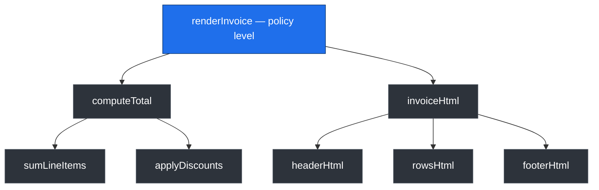

# Functions — Middle Level

> Focus: "Why?" and "When does the rule bend?" — the trade-offs behind small functions, the cost of over-extraction, when extra arguments and side effects are justified, and what "one level of abstraction" actually means in practice.

---

## Table of Contents

1. [The rules you already know — and why they have edges](#the-rules-you-already-know--and-why-they-have-edges)
2. [How small is too small: the over-extraction trap](#how-small-is-too-small-the-over-extraction-trap)
3. [One level of abstraction — the real definition](#one-level-of-abstraction--the-real-definition)
4. [Reading top-down: the stepdown rule](#reading-top-down-the-stepdown-rule)
5. [When 3+ arguments are justified](#when-3-arguments-are-justified)
6. [Command-Query Separation vs. idiomatic exceptions](#command-query-separation-vs-idiomatic-exceptions)
7. [Side effects: when unavoidable, how to isolate](#side-effects-when-unavoidable-how-to-isolate)
8. [Cohesion within a function](#cohesion-within-a-function)
9. [Language differences: Go, Java, Python](#language-differences-go-java-python)
10. [Common Mistakes](#common-mistakes)
11. [Test Yourself](#test-yourself)
12. [Cheat Sheet](#cheat-sheet)
13. [Summary](#summary)
14. [Further Reading](#further-reading)
15. [Related Topics](#related-topics)

---

## The rules you already know — and why they have edges

The [junior](junior.md) level gives you the rules: small functions, do one thing, descriptive names, few arguments, no side effects, no flag arguments. Every one of those rules is correct *most* of the time and wrong *some* of the time. The difference between a 1-year and a 3-year engineer is not knowing the rules — it is knowing when applying them mechanically makes the code worse.

The mistake at this level is treating "small functions" as the goal. It is not. **Readability is the goal**, and small functions are usually the means. When they stop serving readability — when you have a swarm of three-line helpers each called exactly once, with names that just restate the next line — you have optimized the proxy and lost the target.

This file is about the edges: where a rule starts to cost more than it pays, and what signal tells you that you have crossed the line.

---

## How small is too small: the over-extraction trap

"Functions should be small. Then smaller than that." — Uncle Bob's line is famous and frequently over-applied. Decomposition has a cost, and past a certain point each extraction *adds* cognitive load instead of removing it.

### What over-extraction looks like

```python
# Over-extracted: every line became a function called exactly once.
def process(order):
    validated = _validate(order)
    priced = _price(validated)
    saved = _save(priced)
    _notify(saved)

def _validate(order):
    return validate_order(order)        # one call, no added meaning

def _price(order):
    return order.with_total(compute_total(order.items))

def _save(order):
    return repository.save(order)       # name restates the call

def _notify(order):
    email.send(order.customer, "confirmed")
```

`_validate`, `_save`, and `_notify` add nothing. Their bodies are a single call whose name is *already* descriptive. The reader now jumps to four definitions to learn what `process` does, and three of those jumps teach them nothing.

### The signals that you have gone too far

- **The helper's name restates its single line.** `_save(order)` whose body is `repository.save(order)` is a synonym, not an abstraction.
- **The helper is called exactly once and has no name worth more than its body.** Extraction earns its keep when the name replaces a *chunk* of logic with a concept, or when the body is reused.
- **You scroll more to read less.** If understanding a 12-line orchestrator requires opening six other functions, the decomposition is shotgunned, not layered.
- **Parameters multiply at the seams.** Splitting one cohesive computation often forces you to thread five locals through three signatures. That threading is the cost; if it exceeds the benefit, the split was wrong.

> **Rule of thumb:** Extract when the name introduces a *concept* the reader needs ("`apply_loyalty_discount`"), or when the body is *reused*, or when the body is a *distinct level of abstraction*. Do **not** extract just to hit a line count. A cohesive 25-line function with one level of abstraction beats eight three-line functions stitched together.

### Shotgun decomposition

The pathological form: a developer with a "max 5 lines" rule slices a 40-line function into eight pieces along arbitrary boundaries — not where concepts change, but wherever the counter hit five. The result reads like a table of contents with no chapters: you see the *shape* of the work but must reassemble the *meaning* yourself. This is strictly worse than the original, because the original at least kept related lines adjacent.

The cure is to split along **conceptual seams** — phases that have a name a domain expert would recognize — not along line counts.

---

## One level of abstraction — the real definition

"A function should do things that are all at the same level of abstraction" is the most misunderstood rule in the chapter. People read it as "short" or "do one thing." It means something more precise.

A **level of abstraction** is the distance between a statement and the bare machine. High-level statements name *what* in domain terms (`chargeCustomer`, `reserveInventory`). Low-level statements describe *how* in mechanical terms (`buffer[i] = b & 0xFF`, `sb.append(c)`). Mixing them in one function forces the reader to constantly shift mental gears.

```java
// MIXED levels — reads like whiplash.
public String renderInvoice(Invoice inv) {
    StringBuilder sb = new StringBuilder();          // low: string mechanics
    sb.append("<h1>Invoice ").append(inv.id()).append("</h1>");
    BigDecimal total = BigDecimal.ZERO;              // low: arithmetic
    for (LineItem li : inv.items()) {
        total = total.add(li.price().multiply(       // low
            BigDecimal.valueOf(li.quantity())));
        sb.append(formatRow(li));
    }
    if (inv.customer().isVip())                       // high: domain rule
        total = applyVipDiscount(total);              // high: domain rule
    sb.append("<p>Total: ").append(total).append("</p>");
    return sb.toString();
}
```

The function jumps between "domain policy" (VIP discount) and "HTML string concatenation" and "decimal arithmetic" sentence by sentence. **One level of abstraction** means: pick the level this function lives at, and push everything below it into named calls.

```java
// SINGLE level — every line reads as a step at the same altitude.
public String renderInvoice(Invoice inv) {
    Money total = computeTotal(inv);
    return invoiceHtml(inv, total);
}
```

`renderInvoice` now reads as policy: compute the total, render the HTML. The mechanics of *how* totals are computed and *how* HTML is built live one level down, where they belong. You can read `renderInvoice` without caring about `StringBuilder` at all.

> The test: read the function aloud. If a sentence is about business policy and the next is about byte manipulation, you have two levels in one function.

---

## Reading top-down: the stepdown rule

The payoff of single-level functions is the **stepdown rule**: the code reads like a top-down narrative, each function followed by those one level below it. You should be able to read a class top to bottom and have it descend in abstraction the way well-structured prose descends from thesis to detail.

```
To render an invoice, compute the total, then render the HTML.
  To compute the total, sum the line items, then apply discounts.
    To sum the line items, multiply each price by quantity and add.
  To render the HTML, build the header, the rows, and the footer.
```

Each "To X, do Y and Z" is a function; each Y and Z is a function one level down. When code obeys the stepdown rule, a reader can stop descending the moment they have enough detail. That is the real value of decomposition: it lets readers **choose their depth**. Over-extraction breaks this because the levels are too thin to be worth a stop; mixed-level functions break it because there is no consistent descent at all.



A reader who only needs "what does this do" stops at the top node. A reader debugging discounts descends to `applyDiscounts` and ignores the rest. The tree shape *is* the readability.

---

## When 3+ arguments are justified

The junior rule "zero/one/two args, avoid three, never four" is a heuristic, not a law. Argument count is a smell because (a) it strains memory at the call site, (b) it invites positional swaps, and (c) it often signals a missing concept. But there are legitimate signatures with three or more arguments.

### Genuinely independent, equally important inputs

```java
// Three distinct domain entities, none derivable from another, all required.
TransferResult transfer(Account from, Account to, Money amount);
```

There is no missing concept here — collapsing `from`, `to`, `amount` into a `TransferRequest` object would be ceremony. Three is fine when each argument is a different *concept* the operation genuinely needs.

### The line you should not cross

The smell sharpens when arguments **travel together** or **share an invariant**. Two `double`s named `lat`, `lon` appearing in five signatures are a *data clump* — they belong in a `Coordinate`. Four parameters where some are only valid in combination ("at least one of email/phone required") hide an invariant the signature should express.

### Introduce a Parameter Object — but not reflexively

```python
# Smell: five primitives, several of which travel together everywhere.
def create_event(title, start, end, lat, lon, organizer_id): ...

# Fix: group the clumps that have a name and an invariant.
@dataclass(frozen=True)
class TimeRange:
    start: datetime
    end: datetime
    def __post_init__(self):
        if self.end <= self.start:
            raise ValueError("end must be after start")

@dataclass(frozen=True)
class Coordinate:
    lat: float
    lon: float

def create_event(title: str, when: TimeRange, where: Coordinate, organizer_id: UserId): ...
```

Four arguments became three *and* the `end > start` invariant moved from "validated in every caller (and forgotten in some)" to "impossible to construct invalidly." That is the real win — not the count dropping, but the invariant being enforced once.

> **Counter-rule:** Do not invent a Parameter Object just to lower the number. A `CreateEventParams` bag that groups unrelated fields only to dodge the "too many arguments" lint is **worse** — it hides the real arity and couples callers to a structure with no conceptual identity. Group fields that *belong together* (share a name a domain expert would use, or share an invariant). If they do not, the high arity is telling you the function does too much — split the function instead.

---

## Command-Query Separation vs. idiomatic exceptions

**Command-Query Separation (CQS):** a function should either *do* something (command, returns void/unit, has effects) or *answer* something (query, returns a value, no observable effect) — never both. The point is that queries are safe to call freely and in any order; commands are not. When a function both mutates and returns, callers cannot tell from the signature whether calling it twice is safe.

```java
// VIOLATION: is this a question or an action? Both. Calling it has a hidden effect.
if (userRepository.findOrCreate(email).isNew()) { ... }   // mutates DB, also answers
```

```go
// Separated: the query is pure; the command is explicit.
u, found := repo.Find(email)   // query — safe to repeat
if !found {
    u = repo.Create(email)     // command — has effect, named as one
}
```

### Where CQS deliberately bends

CQS is a *guideline*, and idiomatic language constructs break it on purpose, with good reason:

- **`stack.pop()`** returns the top element *and* removes it. This is a deliberate, universally understood atomic operation — splitting it into `peek()` + `remove()` introduces a race in concurrent code and is clumsy in single-threaded code. The combined effect is the contract.
- **Go's comma-ok idiom** `v, ok := m[k]` queries and signals presence in one expression — it does not mutate, so it honors the spirit of CQS while folding two answers into one.
- **`Iterator.next()`** returns the next value *and* advances the cursor. Inseparable by design.
- **Compare-and-swap** / `getAndIncrement()` — the atomicity *is* the value; separating read from write would destroy the guarantee.

The principle behind the exceptions: CQS bends when the combined read-and-effect is **atomic and that atomicity is the whole point**. It does *not* bend for convenience — `save()` returning the saved entity with a generated ID is borderline (common and tolerated), but `findOrCreate` returning "was it new" while writing to a database is the smell, because the effect is incidental, not the contract.

---

## Side effects: when unavoidable, how to isolate

A side effect is any observable change beyond the return value: mutating an argument, writing a field, touching the filesystem, network, clock, or RNG. Pure functions (output depends only on input, no effects) are trivially testable and reorderable. But programs that do nothing observable are useless — effects are the *point* of software. The goal is not zero effects; it is **effects that are explicit, isolated, and pushed to the edges**.

### The hidden side effect — the genuinely dangerous one

```java
// The name promises a query. It silently mutates session state.
public boolean checkPassword(String pw) {
    if (matches(pw)) {
        Session.initialize();   // <-- temporal coupling, hidden in a "check"
        return true;
    }
    return false;
}
```

Now `checkPassword` *must* be called before anything that needs an initialized session, and callers cannot see that from the name. This is the worst kind of side effect: undocumented in the signature.

### Functional core, imperative shell

The standard isolation technique: keep the decision-making code pure, and concentrate effects in a thin outer layer.

```python
# CORE — pure. Easy to test, no I/O, no clock, no mutation of inputs.
def next_state(account: Account, withdrawal: Money) -> Result[Account, str]:
    if withdrawal > account.balance:
        return Err("insufficient funds")
    return Ok(account.with_balance(account.balance - withdrawal))

# SHELL — effects live here, and only here.
def withdraw(account_id: AccountId, amount: Money):
    account = repo.load(account_id)            # effect: read
    match next_state(account, amount):          # pure decision
        case Ok(updated):
            repo.save(updated)                  # effect: write
            audit.record(account_id, amount)    # effect: log
        case Err(msg):
            raise InsufficientFunds(msg)
```

`next_state` can be tested with a thousand cases and zero mocks. The effects (`load`, `save`, `record`) are visible, sequenced, and confined to `withdraw`. When an effect is genuinely unavoidable — and most real work has them — this is how you keep it from contaminating your logic: name it, isolate it, and keep it out of the functions that decide things.

> **Decision rule:** If an effect is incidental to the function's name, eliminate it or rename the function to advertise it. If it is essential (a `save` *should* write), make it the function's single, obvious job and keep the surrounding decision logic pure.

---

## Cohesion within a function

Cohesion is usually discussed at the class level, but it applies inside a function too. A **cohesive function** is one where every line participates in the single task the name promises. Low cohesion inside a function is the precise signal that it "does more than one thing."

The practical test: **try to extract a fragment and give it a name.** If a contiguous block of the function can be named with a verb phrase that does *not* mention the rest of the function, that block is a separate responsibility and probably wants to be its own function.

```go
// Low cohesion: two unrelated jobs share a function because they share a loop.
func reportAndArchive(orders []Order) (Report, error) {
    var r Report
    for _, o := range orders {
        r.total += o.Amount          // job A: build a report
        r.count++
        if o.Age() > 90*Day {
            if err := archive(o); err != nil {  // job B: archival side effect
                return r, err
            }
        }
    }
    return r, nil
}
```

Reporting and archiving are independent concerns that happen to iterate the same slice. They will change for different reasons and at different times. Two cohesive functions (`buildReport`, `archiveStale`) each do one thing; the caller composes them. The shared loop is *not* a reason to fuse them — it is an incidental, not an essential, connection.

> When you cannot name an extractable fragment without referencing the parts you left behind, the function is cohesive and should stay whole. When you *can*, it is not, and you have found the seam.

---

## Language differences: Go, Java, Python

The principles are universal; the idioms that satisfy them differ.

### Reducing argument count

```go
// Go: functional options — the idiomatic answer to "too many config args".
srv := NewServer(addr,
    WithTimeout(30*time.Second),
    WithTLS(cert),
    WithMaxConns(1000),
)
```

```java
// Java: builder for the same job; records for small grouped value objects.
Server srv = Server.builder()
    .address(addr)
    .timeout(Duration.ofSeconds(30))
    .tls(cert)
    .build();

record Coordinate(double lat, double lon) {}   // cheap, immutable parameter object
```

```python
# Python: keyword-only arguments make many parameters readable without a builder.
def new_server(addr, *, timeout=30, tls=None, max_conns=1000): ...
new_server(addr, timeout=30, tls=cert)   # no positional-swap risk; flags are named
```

Python's keyword arguments soften the argument-count smell that Go and Java feel more acutely — but they do not cure data clumps. `lat, lon` keyword args still travel together; a `@dataclass(frozen=True)` is still the right fix.

### Command-Query and "do nothing / return value" idioms

- **Go** leans on multiple return values, which folds many query+status patterns into one call (`v, ok`, `result, err`) without violating CQS — these are pure reads.
- **Java** has no tuples; query-with-status tends to use `Optional<T>` for "maybe a value" rather than returning `null`. A function that both mutates and returns is more conspicuous (and more tempting) here.
- **Python** returns tuples freely (`found, value = lookup(k)`), and exceptions are idiomatic for "not found" in some APIs (`dict[k]` raises) and comma-ok-like in others (`dict.get(k)` returns `None`). Choose one convention per module and hold it.

### Error signaling and CQS

```go
// Go: errors are values, returned explicitly — the effect of "this can fail" is in the signature.
data, err := readConfig(path)
if err != nil { return err }
```

```java
// Java: exceptions remove the error from the return type, keeping queries "pure-looking".
String data = readConfig(path);   // may throw — the failure is out-of-band
```

```python
# Python: exceptions for exceptional cases; Result-style returns when failure is routine.
data = read_config(path)          # raises on failure
```

Go's explicit `err` arguably honors honesty-in-signature better; Java/Python keep the happy-path return clean at the cost of an invisible failure mode. Neither is "more correct" — but in all three, the rule holds: **do not return a sentinel like `null`/`-1`/`""` to signal failure.** Use the language's real mechanism (`error`, exception, `Optional`/`Result`).

---

## Common Mistakes

- **Optimizing line count instead of readability.** Slicing a cohesive function into single-call helpers to satisfy a "max N lines" rule. The metric is a smoke alarm, not a target.
- **Helpers whose names restate their body.** `getCount()` returning `count`, `_save(x)` calling `repo.save(x)`. The name must add a concept, not a synonym.
- **A "Parameter Object" that is just a bag.** Grouping unrelated fields only to lower the argument count hides the true arity and couples callers to a structureless struct. Group fields that share a name or an invariant; otherwise split the function.
- **Hidden side effects behind query-shaped names.** `isValid()` that also logs/mutates, `checkX()` that initializes state. If it has an effect, the name must say so.
- **Mixing abstraction levels.** Domain policy and `StringBuilder` mechanics in the same function. Pick one altitude; push the rest down.
- **Returning `null` to mean "nothing".** Forces every caller into defensive null checks and invites NPEs. Return empty collections, `Optional`/`Result`, or raise.
- **Flag arguments that switch behavior.** `render(true)` selecting HTML vs. text. Split into `renderHtml()` / `renderText()`. (A flag that flows through as *data* is fine; one that *branches control flow* is the smell.)
- **Fusing two responsibilities because they share a loop or a variable.** Incidental adjacency is not cohesion. If you can name an extractable block independently, extract it.

---

## Test Yourself

1. **You have a 28-line function with one clear job and a single level of abstraction. Your team's linter flags it (`max 20 lines`). Do you split it?**
   <details><summary>Answer</summary>
   Not mechanically. The line count is a heuristic that has produced a false positive. If the 28 lines are one cohesive task at one altitude, splitting them creates single-call helpers that hurt readability. Suppress the lint with a comment explaining why, or — better — check whether there is a genuine conceptual seam you missed. The seam, not the count, decides.
   </details>

2. **Why is `stack.pop()` (returns a value *and* mutates) acceptable, but `repo.findOrCreate(email)` (returns "was it new" *and* writes to the DB) a CQS smell?**
   <details><summary>Answer</summary>
   `pop()`'s combined read-and-effect is atomic and *is the contract* — splitting it introduces races and serves no one. `findOrCreate`'s write is *incidental* to the boolean it returns; the effect is a side job smuggled into a query. CQS bends for essential, atomic combinations, not for convenience. Prefer an explicit `Find` then `Create`.
   </details>

3. **A function takes `(Account from, Account to, Money amount)`. Is three arguments a smell? When would you introduce a parameter object?**
   <details><summary>Answer</summary>
   No smell as written — three distinct, required, independent concepts. Introduce a `TransferRequest` object only if these three start traveling together through many signatures (a data clump) or gain a shared invariant (e.g., `from != to`, `amount > 0`) that you want enforced once at construction. Otherwise the object is ceremony.
   </details>

4. **What is the difference between a flag argument that is a smell and one that is fine?**
   <details><summary>Answer</summary>
   A smell flag *branches control flow* — the function does one thing when `true` and a different thing when `false` (`render(isHtml)`). Split into two named functions. A fine flag is *data that flows through unchanged* — `setEnabled(bool)` stores a value; it does not select between two behaviors.
   </details>

5. **Define "one level of abstraction" without using the words "small" or "one thing".**
   <details><summary>Answer</summary>
   Every statement in the function should sit at the same conceptual distance from the machine: either all domain-level steps (`chargeCard`, `reserveSeat`) or all mechanical steps (`buf[i] = b`), but not a mix. When levels mix, push the lower ones into named calls so each function reads at a single altitude.
   </details>

6. **An effect is unavoidable — you must write to the database. How do you keep it from contaminating your logic?**
   <details><summary>Answer</summary>
   Functional core, imperative shell. Put the decision (what *should* happen) in a pure function that takes inputs and returns a description or new value with no I/O. Put the effect (the actual write) in a thin outer function that calls the pure core and then performs the I/O. The logic becomes testable without mocks; the effect is visible, sequenced, and confined.
   </details>

7. **You extracted six 3-line helpers from a 25-line function. A reviewer says it is now harder to read. How do you tell who is right?**
   <details><summary>Answer</summary>
   Check each helper: does its name introduce a concept (good) or restate its single line (bad)? Is it reused (good) or called once (suspect)? Do you scroll more to learn less (bad)? If most helpers are once-called name-synonyms, the reviewer is right — this is shotgun decomposition. Inline the ones that add no concept; keep only the splits that fall on real seams.
   </details>

8. **Why is returning `null` for "no matching user" worse than returning `Optional<User>` / `(User, bool)` / raising?**
   <details><summary>Answer</summary>
   `null` is invisible in the type — the signature says `User`, lying about the possibility of absence. Every caller must remember a defensive check the compiler does not enforce, and forgetting one is an NPE in production. `Optional`/comma-ok/exception all make absence part of the contract the caller cannot ignore.
   </details>

---

## Cheat Sheet

| Tension | Default | Bends when... |
|---|---|---|
| How small? | Small enough to do one thing at one level | A cohesive single-level block reads worse when split; helpers would just restate lines |
| Extract a helper? | Yes, if the name adds a concept or the body is reused | No, if name ≈ body, called once, and adds a scroll for no meaning |
| Argument count | ≤ 2 ideal, 3 tolerable | 3+ fine for distinct required concepts; group only true clumps/invariants into an object |
| Parameter object | Use for fields that share a name or invariant | Avoid as a bag for unrelated fields just to dodge a lint |
| CQS | Command *or* query, not both | Atomic read-and-effect that *is* the contract: `pop`, `next`, comma-ok, CAS |
| Side effects | Push to the edges; keep core pure | When essential, make it the function's named job; never hide it behind a query name |
| Flag argument | Split into named functions | Fine only if the flag is data flowing through, not a control-flow switch |
| "Nothing" return | Empty collection / `Optional` / `Result` / raise | Never a `null`/sentinel that the type does not advertise |

**Stepdown test:** read the class top to bottom — does abstraction descend smoothly? **Altitude test:** read a function aloud — do any two adjacent lines sit at different conceptual levels? **Cohesion test:** can you name an extractable block without mentioning the rest? If yes, extract it; if no, leave it whole.

---

## Summary

The junior rules — small, one thing, few args, no side effects — are correct defaults, but a middle engineer is paid to know their edges. **Small is a means to readability, not the goal**: over-extraction and shotgun decomposition produce a swarm of name-synonym helpers that you scroll through to learn nothing. Extract on conceptual seams, not line counts. **One level of abstraction** means a function reads at a single altitude; the payoff is the **stepdown rule**, where code descends from policy to mechanism and readers choose their depth. **Three-plus arguments are fine** when each is a distinct required concept; introduce a parameter object only for true data clumps or shared invariants — never as a bag to dodge a lint. **CQS** keeps commands and queries separate so callers can reason about safety, but it bends for atomic read-and-effect idioms (`pop`, `next`, comma-ok) where the combination is the contract. **Side effects are the point of software**; isolate them with a functional core and imperative shell so logic stays pure and testable, and never hide an effect behind a query-shaped name. **Cohesion inside a function** is the real meaning of "does one thing": if you can name an extractable block without referencing the rest, it is a separate responsibility. The idioms differ across Go (functional options, comma-ok, error values), Java (builders, records, `Optional`, exceptions), and Python (keyword args, dataclasses, exceptions) — but the underlying judgment is the same everywhere.

---

## Further Reading

- *Clean Code*, Robert C. Martin — Chapter 3, "Functions" (the source of these rules; read it critically, with this file's edges in mind).
- *Refactoring*, Martin Fowler (2nd ed.) — Extract Function, Inline Function, Introduce Parameter Object, Separate Query from Modifier.
- Mark Seemann, "Functional Core, Imperative Shell" and the *Dependency Rejection* series — the canonical treatment of isolating effects.
- Bertrand Meyer, *Object-Oriented Software Construction* — the original statement of Command-Query Separation.

---

## Related Topics

- [junior.md](junior.md) — the baseline rules these trade-offs refine.
- [senior.md](senior.md) — architectural impact, function design across module and team boundaries, and tooling.
- [Chapter README](../README.md) — the positive rules and the anti-patterns this chapter covers.
- [Meaningful Names](../01-meaningful-names/README.md) — a function's name carries half its readability; the two chapters reinforce each other.
- [Emergence](../10-emergence/README.md) — small, well-named functions are how the "simple design" rules express themselves at the function level.
- [Refactoring](../../refactoring/README.md) — the mechanical moves (Extract/Inline Function, Introduce Parameter Object) that implement these decisions safely.
- [Functional Programming](../../functional-programming/README.md) — purity, immutability, and the functional-core/imperative-shell pattern in depth.
- [Design Patterns](../../design-patterns/README.md) — Builder and Strategy are the structural answers to argument bloat and flag arguments.
