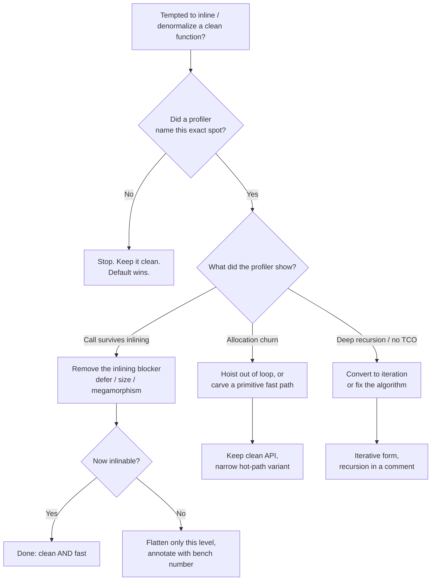

# Functions — Optimize & Reconcile

> "Extract till you drop" and "keep functions small" are the right *default*. But every function boundary has a cost: a call, possibly an allocation, possibly a missed inlining opportunity. This file reconciles clean-function discipline with performance. The principled stance: **stay clean by default; collapse a boundary only when a profiler — not intuition — names it as the bottleneck.** Each scenario gives a concrete situation, the measurement that settles the argument, and the resolution that keeps the code as clean as the numbers allow.

---

## Table of Contents

1. [Function-call overhead is not free — but inlining usually erases it](#scenario-1--function-call-overhead-is-not-free--but-inlining-usually-erases-it)
2. [Go's inlining budget and `//go:noinline`](#scenario-2--gos-inlining-budget-and-gonoinline)
3. [JVM JIT inlining thresholds — when "extract" survives compilation](#scenario-3--jvm-jit-inlining-thresholds--when-extract-survives-compilation)
4. [Python's per-call cost — the language where small functions actually hurt](#scenario-4--pythons-per-call-cost--the-language-where-small-functions-actually-hurt)
5. ["Extract till you drop" vs hot-path inlining](#scenario-5--extract-till-you-drop-vs-hot-path-inlining)
6. [Passing large structs by value vs pointer (Go)](#scenario-6--passing-large-structs-by-value-vs-pointer-go)
7. [Boxing on the argument path (Java)](#scenario-7--boxing-on-the-argument-path-java)
8. [Closures and the allocation cost of higher-order helpers](#scenario-8--closures-and-the-allocation-cost-of-higher-order-helpers)
9. [When a parameter object adds an allocation](#scenario-9--when-a-parameter-object-adds-an-allocation)
10. [Tail calls — what the runtime will and won't optimize](#scenario-10--tail-calls--what-the-runtime-will-and-wont-optimize)
11. [The cost of returning `Optional` / `error` / `Result` wrappers vs raw values](#scenario-11--the-cost-of-returning-optional--error--result-wrappers-vs-raw-values)
12. [Guard-clause helpers that defeat inlining](#scenario-12--guard-clause-helpers-that-defeat-inlining)
13. [Recursion vs iteration for deep call chains](#scenario-13--recursion-vs-iteration-for-deep-call-chains)

- [Rules of Thumb](#rules-of-thumb)
- [Related Topics](#related-topics)

---

### Scenario 1 — Function-call overhead is not free — but inlining usually erases it

A reviewer objects to extracting a one-line helper called inside a tight loop: "that's a function call per iteration, it'll be slow." Is it?

```go
// Extracted, "clean":
func isVowel(c byte) bool {
    return c == 'a' || c == 'e' || c == 'i' || c == 'o' || c == 'u'
}

func countVowels(s string) int {
    n := 0
    for i := 0; i < len(s); i++ {
        if isVowel(s[i]) {
            n++
        }
    }
    return n
}
```

The raw cost of a call — push arguments, jump, set up a stack frame, return — is roughly **1–3 ns** on a modern CPU when the call actually happens. Over a 100M-iteration loop that is 100–300 ms of pure call overhead, which sounds alarming. But the reviewer is reasoning about the *unoptimized* program. `isVowel` is tiny and leaf-level; every mainstream compiler will inline it, leaving zero call overhead.

<details><summary>Resolution</summary>

Extract the helper. The compiler inlines small leaf functions, so the clean version and the manually-inlined version compile to the *same machine code*. Confirm rather than assume:

- **Go:** `go build -gcflags='-m' ./...` prints `inlining call to isVowel`. If you see that line, the abstraction is free.
- **Java:** run with `-XX:+PrintInlining -XX:+UnlockDiagnosticVMOptions` and look for `isVowel (X bytes) inline (hot)`.

Function-call overhead only matters when the call *survives* — i.e., the function is too large to inline, is called through an interface/virtual dispatch the compiler can't devirtualize, or is explicitly marked no-inline. Scenarios 2–4 cover exactly those cases. For everything else, "the call is slow" is a myth that costs you readability for nothing.

</details>

---

### Scenario 2 — Go's inlining budget and `//go:noinline`

Go's inliner is governed by a **cost budget**, not by line count. As of Go 1.20+ the default budget is **80 "nodes"** (an internal AST-cost unit); a function whose body exceeds the budget is not inlined into its callers. A handful of constructs cost far more than they look and silently push a function over budget:

```go
func priceOf(item Item) float64 {
    defer trace("priceOf")()        // `defer` makes the function non-inlinable
    if item.Qty == 0 {
        panic("zero qty")            // direct `panic` is costly in the budget
    }
    return item.Unit * float64(item.Qty)
}
```

Both `defer` and (historically) closures/`panic` in the body can disqualify inlining. The "clean" instinct — wrap everything in a tracing `defer` — turns a hot leaf function into a real call on every invocation.

<details><summary>Resolution</summary>

Keep hot leaf functions free of inlining-blockers:

```go
func priceOf(item Item) float64 {
    return item.Unit * float64(item.Qty)   // inlinable; ~5 nodes
}
```

Push `defer`/tracing up to a coarse-grained boundary (the request handler), not the per-item leaf. Verify with `go build -gcflags='-m=2'`, which prints the cost: `cannot inline priceOf: function too complex: cost 84 exceeds budget 80`.

`//go:noinline` is the *deliberate* opposite tool. Use it to:
- Stabilize benchmarks (prevent the compiler from optimizing away the very call you're measuring).
- Keep a large cold function out of a hot caller so the caller itself stays small enough to inline into *its* caller (inlining is transitive and budget-bounded).

The principle holds: don't merge `priceOf` back into its caller by hand. Instead, remove what blocks the inliner so the clean factoring stays free.

</details>

---

### Scenario 3 — JVM JIT inlining thresholds — when "extract" survives compilation

The JVM inlines at runtime based on call frequency and bytecode size, controlled by these defaults (HotSpot, `-XX:+PrintFlagsFinal`):

| Flag | Default | Meaning |
| --- | --- | --- |
| `MaxInlineSize` | 35 bytes | Methods this small are inlined even if not hot |
| `FreqInlineSize` | 325 bytes | Hot methods up to this size are inlined |
| `InlineSmallCode` | 1000 bytes | Don't inline if the already-compiled callee exceeds this native size |
| `MaxInlineLevel` | 9–15 | Max nested-inline depth |

A clean 30-line method may compile to ~120 bytes of bytecode — too big for `MaxInlineSize`, but fine for `FreqInlineSize` *once it's hot*. So extraction is free for hot code and only costs a real call for cold or megamorphic call sites.

```java
// Extracted accessor in a hot pricing loop:
double lineTotal(OrderLine l) { return l.unitPrice() * l.quantity(); }
```

<details><summary>Resolution</summary>

Trust the JIT and verify the few hot paths that matter:

```
java -XX:+UnlockDiagnosticVMOptions -XX:+PrintInlining MyApp
```

Look for `lineTotal (9 bytes) inline (hot)`. The failure modes worth knowing:

- **Megamorphic call sites.** If `lineTotal` is called through an interface with 3+ concrete implementations seen at one call site, HotSpot gives up on inlining (it can't pick a target). Fix by making the type monomorphic where it's hot, not by deleting the method.
- **"too large" / "hot method too big".** Your extracted method grew past `FreqInlineSize`. That's the JIT telling you the *method* is the bloater — extract further, the opposite of inlining.
- **`@ForceInline`** exists (`jdk.internal.vm.annotation`) but is JDK-internal; application code cannot reliably force inlining and shouldn't try.

Stay clean. The JVM is built around the assumption that you write many small methods; it inlines aggressively precisely so you can.

</details>

---

### Scenario 4 — Python's per-call cost — the language where small functions actually hurt

Python has no inliner. Every function call is a real, interpreted dispatch: build a frame object, bind arguments, push/pop the value stack. On CPython 3.11 a trivial call costs on the order of **30–60 ns** — *10–50× more* than the same call in compiled Go or warmed-up Java. In a 10M-element numeric loop, a per-element helper call can dominate runtime.

```python
def _scale(x, factor):          # called 10M times
    return x * factor

result = [_scale(x, 1.8) for x in data]   # the call is the bottleneck
```

<details><summary>Resolution</summary>

Python is the one mainstream language where "inline the hot leaf by hand" is a legitimate, measured optimization — but it is still the *last* resort, after the idiomatic vectorized fix:

1. **Vectorize — eliminate the loop, not just the call.** This is both faster *and* cleaner:
   ```python
   import numpy as np
   result = data * 1.8        # ~100× faster than the Python loop; no per-element call at all
   ```
2. **If you must stay in pure Python**, inline the body into the comprehension:
   ```python
   result = [x * 1.8 for x in data]   # no call frame per element
   ```
3. **Hoist attribute/method lookups** out of the loop (each `obj.method` is a dict lookup):
   ```python
   append = out.append
   for x in data:
       append(x * 1.8)
   ```

Measure with `timeit` and confirm with `python -X importtime` / `cProfile` that the call is actually the hot spot. The reconciliation: keep small named functions everywhere *except* the proven numeric hot loop, where Python's call cost is real and inlining (or vectorizing) is the principled fix — and prefer vectorization because it restores cleanliness instead of sacrificing it.

</details>

---

### Scenario 5 — "Extract till you drop" vs hot-path inlining

"Extract till you drop" (Robert Martin) says: keep extracting functions until each does one thing and you cannot meaningfully extract further. Taken literally on a hot path, it can produce a chain of one-line calls. Does the chain cost anything?

```java
boolean eligible(User u) { return active(u) && verified(u) && inRegion(u); }
boolean active(User u)    { return u.status() == ACTIVE; }
boolean verified(User u)  { return u.emailVerified(); }
boolean inRegion(User u)  { return REGIONS.contains(u.region()); }
```

<details><summary>Resolution</summary>

In Go and warm Java this entire chain inlines into one comparison-and-branch sequence — `eligible` and its three helpers collapse to the same code as a hand-merged version. The extraction is free *and* more readable, so keep it.

The exception is depth. The JVM's `MaxInlineLevel` (~9) and Go's transitive budget mean a *deep* chain of small calls can hit a wall: somewhere down the chain a call stops being inlined, and now you pay for it on every iteration of a 100M loop. The signal is `PrintInlining` reporting `callee uses too much stack` or budget exhaustion partway down.

Resolution: "extract till you drop" is the right default everywhere; on a measured hot path, flatten only the *specific* level where inlining demonstrably stops — and leave a comment with the benchmark number so the next reader knows the ugliness is earned:

```java
// Flattened: PrintInlining showed inRegion not inlined at depth 10 in the
// pricing loop (see bench PricingBench#eligibility, 22ns -> 6ns). Keep flat.
boolean eligible(User u) {
    return u.status() == ACTIVE && u.emailVerified() && REGIONS.contains(u.region());
}
```

</details>

---

### Scenario 6 — Passing large structs by value vs pointer (Go)

Go passes everything by value, including structs. Clean Go often favors value receivers and value parameters because they're immutable and easy to reason about. But a *large* value parameter is copied on every call:

```go
type Snapshot struct {       // 240 bytes: many fields + 3 [16]byte arrays
    // ...
}

func score(s Snapshot) float64 { ... }   // copies 240 bytes per call

for _, snap := range snapshots {         // 50M snapshots
    total += score(snap)
}
```

Copying 240 bytes is ~tens of bytes/ns memory bandwidth; across 50M calls the copies alone can add **hundreds of milliseconds** and evict useful data from L1.

<details><summary>Resolution</summary>

Rule of thumb: **value semantics up to roughly 1–3 machine words (≤ 32 bytes); pointer beyond that on a hot path.** A copy of a small struct is cheaper than a pointer indirection (no cache miss, no escape risk). A copy of a large struct is not.

```go
func score(s *Snapshot) float64 { ... }   // copies 8 bytes (a pointer)
```

Two cautions that keep this from being a blanket "always use pointers":

- **Escape analysis.** Taking `&snap` can force the struct to the heap if it escapes, trading a stack copy for a GC allocation. Check with `go build -gcflags='-m'` (`moved to heap: snap`). A small value that stays on the stack often *beats* a pointer.
- **Mutability/clarity.** Pointers reintroduce aliasing and nil. If the struct is small, the value version is both faster and cleaner — don't pointer-ify on reflex.

Benchmark the actual struct size with `unsafe.Sizeof`, then `go test -bench`. Stay value-typed until the size and the call count together justify the pointer.

</details>

---

### Scenario 7 — Boxing on the argument path (Java)

A clean generic helper accepts `Object`/boxed types, but the caller passes primitives in a hot loop. Each call **autoboxes**, allocating an `Integer` (or `Double`) per invocation:

```java
<T> void record(Map<String, T> m, String k, T v) { m.merge(k, v, this::combine); }

for (int i = 0; i < 100_000_000; i++) {
    record(counts, key, i);   // autoboxes int -> Integer every iteration
}
```

Each boxed `Integer` outside the cache range (`-128..127`) is a heap allocation: ~16 bytes plus GC pressure. 100M allocations is gigabytes of churn and major GC pauses.

<details><summary>Resolution</summary>

Boxing is the JVM's quietest performance tax — invisible in source, brutal in a hot loop. Options, cleanest first:

1. **Provide a primitive-specialized path** where it's hot. The JDK does exactly this (`IntStream`, `LongStream`, `ToIntFunction`):
   ```java
   void recordInt(Map<String, Integer> m, String k, int v) { ... }
   counts.merge(key, v, Integer::sum);   // still boxes the value, but no per-call lambda capture
   ```
2. **Use a primitive-keyed/valued map** (e.g., Eclipse Collections `ObjectIntMap`, fastutil `Object2IntOpenHashMap`) for the truly hot aggregation; they store `int` directly, no boxing.
3. **Keep the generic clean API for the cold 99%**, and route only the proven hot path to the specialized version.

Confirm allocations with async-profiler in allocation mode (`-e alloc`) — you'll see `java.lang.Integer.valueOf` at the top. The reconciliation: generics keep the API clean for general use; specialization is a *narrow* hot-path carve-out, justified by an allocation profile, not added everywhere preemptively.

</details>

---

### Scenario 8 — Closures and the allocation cost of higher-order helpers

Higher-order functions (`map`, `filter`, callbacks) read beautifully. But a closure that *captures* variables is an allocation, and one created inside a loop allocates per iteration:

```go
func process(items []Item, taxRate float64) {
    for _, it := range items {                 // 10M items
        apply(it, func(x float64) float64 {     // captures taxRate -> heap closure per item
            return x * (1 + taxRate)
        })
    }
}
```

A non-capturing function literal is a constant (zero allocation). A *capturing* one becomes a heap-allocated closure object in Go (and Java if it captures), and creating it inside the loop allocates 10M times.

<details><summary>Resolution</summary>

The fix is to hoist the closure so it's created once, or avoid capture entirely:

```go
// Created once, reused across all iterations:
withTax := func(x float64) float64 { return x * (1 + taxRate) }
for _, it := range items {
    apply(it, withTax)
}
```

Or pass the data as a parameter so the function captures nothing and the compiler treats it as a constant:

```go
func withTax(x, rate float64) float64 { return x * (1 + rate) }
```

In Java, a lambda that captures effectively-final locals allocates a synthetic instance unless the JIT proves it doesn't escape; the same hoist-out-of-loop rule applies. Verify in Go with `-gcflags='-m'` (`func literal escapes to heap`), in Java with allocation profiling.

The reconciliation: higher-order helpers are clean and *usually* free (non-capturing literals cost nothing). Only the **capturing closure inside a hot loop** is a problem, and the fix preserves the functional style — you hoist the allocation, you don't abandon the abstraction. See [`../../functional-programming/README.md`](../../functional-programming/README.md) for the broader allocation profile of HOFs.

</details>

---

### Scenario 9 — When a parameter object adds an allocation

"Introduce Parameter Object" replaces a long parameter list with a single struct/record. Cleaner signature — but if the language heap-allocates the object and it's built per call in a hot path, you've traded register-passed scalars for an allocation:

```python
@dataclass
class Bounds:
    lo: int
    hi: int

def clamp(value: int, bounds: Bounds) -> int:        # caller builds Bounds(0, 255) per call
    return max(bounds.lo, min(value, bounds.hi))

pixels = [clamp(p, Bounds(0, 255)) for p in raw]     # 1 object + attribute lookups per pixel
```

In Python every `Bounds(0,255)` is an object allocation plus two attribute lookups inside `clamp`. In Java, a non-escaping record may be eliminated by escape analysis (scalar replacement) — but only if EA fires. In Go, a small value struct is free (stays on the stack), so the smell is language-dependent.

<details><summary>Resolution</summary>

Decide by language and by whether the object is *invariant*:

- **Hoist invariant parameter objects out of the loop** — the single biggest win, and it stays clean:
  ```python
  bounds = Bounds(0, 255)                  # built once
  pixels = [clamp(p, bounds) for p in raw]
  ```
- **Go:** keep the parameter object; a small value struct passed by value is allocation-free. Verify with `-gcflags='-m'`.
- **Java:** keep the record for clarity; check with `-XX:+PrintInlining` plus allocation profiling that scalar replacement eliminated it. If EA fails (the object escapes into a collection), then and only then consider passing scalars on that path.

The principle: a parameter object is a *readability* win that is allocation-free in the common cases. Don't unwind it into a long parameter list on reflex — first hoist the invariant instance, then confirm with a profiler that an allocation actually survives.

</details>

---

### Scenario 10 — Tail calls — what the runtime will and won't optimize

Tail-recursive code is often the cleanest expression of an iterative process. The trap: most mainstream runtimes here **do not** perform tail-call optimization (TCO), so a "clean" deep tail recursion overflows the stack instead of running in constant space.

```python
def sum_to(n, acc=0):
    if n == 0:
        return acc
    return sum_to(n - 1, acc + n)   # tail call, but CPython does NOT optimize it

sum_to(1_000_000)   # RecursionError: maximum recursion depth exceeded
```

| Runtime | TCO? |
| --- | --- |
| CPython | No (Guido rejected it deliberately) |
| HotSpot JVM | No (only sibling-call hints; not general TCO) |
| Go (gc) | No |
| V8 / modern JS | Spec'd (ES6 PTC) but unshipped in practice |
| Scala / Kotlin | Self-tail-recursion only, via `@tailrec` / `tailrec` |

<details><summary>Resolution</summary>

Do not rely on TCO in Python, Java, or Go. Choose by depth:

- **Bounded, shallow recursion** (tree of known small depth, e.g. parsing JSON ≤ tens deep): recursion is clean and safe — keep it.
- **Unbounded depth** (linked lists, `1..N`): write the loop. The iterative form is both correct (no stack overflow) and, here, equally readable:
  ```python
  def sum_to(n):
      acc = 0
      for i in range(1, n + 1):
          acc += i
      return acc
  ```
- **Kotlin/Scala:** annotate self-tail-recursion with `tailrec`/`@tailrec`; the compiler *guarantees* the loop transform and errors if your function isn't actually tail-recursive — clean recursion that compiles to a loop.

The reconciliation: tail recursion is elegant but is only safe in constant stack space where the *compiler promises* the transform. In runtimes that don't, depth is a correctness limit, not just a performance one — convert to iteration when depth is unbounded.

</details>

---

### Scenario 11 — The cost of returning `Optional` / `error` / `Result` wrappers vs raw values

Returning `Optional<T>` (Java) or a wrapped `Result`/`error` instead of a sentinel is a clean-code win: the absence of a value is in the type, not in a magic `-1` or `null`. But the wrapper can allocate, and in a hot path that adds up.

```java
// Clean: absence is explicit.
Optional<Customer> find(long id) { ... }

long count = 0;
for (long id : ids) {                  // 50M ids
    if (find(id).isPresent()) count++; // each find() may allocate an Optional
}
```

`Optional` is an object; outside escape-analysis elimination, each `find` allocates ~16 bytes. Go's `(T, error)` returns are allocation-free for the happy path (multi-value return, no wrapper), but constructing an `error` value (especially `fmt.Errorf`, which allocates) on a hot *error* path is costly.

<details><summary>Resolution</summary>

Keep the clean wrapper in APIs; optimize only the proven hot interior:

- **Java:** `Optional` is designed for *return types of methods that might be hot but not red-hot*. In an inner loop where allocation profiling shows `Optional` churn, expose a primitive/boolean-returning variant for that path (`boolean contains(long id)`), and keep `Optional<Customer> find(...)` as the general API. Don't replace `Optional` with `null` everywhere — that re-introduces the bug class it cured.
- **Go:** the `(T, error)` convention is already allocation-free on success. The waste is on the error path: `fmt.Errorf("…: %w", err)` allocates. For a hot loop that legitimately errors often, return a **sentinel error** (`var ErrNotFound = errors.New("not found")`) declared once and compared with `errors.Is`, rather than formatting a new error per failure.
- **Rust/`Result`:** `Result<T, E>` is a stack value (enum), genuinely zero-cost — no reconciliation needed; this trade-off is a managed-runtime concern.

Measure with allocation profiling (`-e alloc` / `go test -benchmem`). The principle: explicit-absence types are correct by default; carve out a raw-value fast path only where the allocation is measured and the call count is enormous.

</details>

---

### Scenario 12 — Guard-clause helpers that defeat inlining

Guard clauses keep functions flat and readable. Extracting the guard into a validator helper can, however, make the *caller* too large to inline or add a surviving call on a hot path:

```go
func transfer(from, to *Account, amount int64) error {
    if err := validate(from, to, amount); err != nil {   // helper does 5 checks + builds errors
        return err
    }
    from.balance -= amount
    to.balance += amount
    return nil
}

func validate(from, to *Account, amount int64) error {
    if from == nil { return errors.New("nil from") }
    if to == nil { return errors.New("nil to") }
    if amount <= 0 { return errors.New("non-positive amount") }
    if from.balance < amount { return ErrInsufficient }
    if from == to { return errors.New("same account") }
    return nil
}
```

`validate` is large (multiple `errors.New` calls, several branches) — well over Go's budget, so it won't inline. On the success path you pay a real call plus the cost of the inliner refusing to fold `transfer` into *its* caller.

<details><summary>Resolution</summary>

Keep the guards, but separate the cheap common-case checks from the expensive error construction:

```go
func transfer(from, to *Account, amount int64) error {
    // Cheap predicate, inlinable, covers the hot success path:
    if from != nil && to != nil && from != to && amount > 0 && from.balance >= amount {
        from.balance -= amount
        to.balance += amount
        return nil
    }
    return transferError(from, to, amount)   // cold path: builds the specific error
}
```

The hot path is now a single inlinable predicate; the verbose, error-constructing logic lives in a cold helper the inliner is happy to leave as an out-of-line call (it's rarely taken). This is the general pattern: **split a function on its temperature, not just its responsibility** — cheap-and-hot inline, expensive-and-cold extracted. You keep guard-clause clarity *and* inlining. See [`find-bug.md`](find-bug.md) for the correctness pitfalls of reordering guards, and [`professional.md`](professional.md) for the readability trade-offs.

</details>

---

### Scenario 13 — Recursion vs iteration for deep call chains

Beyond tail calls (Scenario 10), ordinary (non-tail) recursion expresses tree/divide-and-conquer algorithms cleanly, but each frame costs memory and a call. On a hot, deep, or wide recursion the frame overhead and lack of inlining matter:

```python
def fib(n):                       # exponential calls; each is a real Python frame
    if n < 2:
        return n
    return fib(n - 1) + fib(n - 2)

fib(35)   # ~29M calls, seconds of runtime — frame setup dominates
```

The cleanliness here is illusory: the recursion isn't just slow per call, it recomputes subproblems. The performance fix is also the *clearer* expression of intent.

<details><summary>Resolution</summary>

- **First, fix the algorithm, not the call mechanism.** `fib` is exponential because of overlapping subproblems; memoization or iteration makes it linear and is no less readable:
  ```python
  from functools import lru_cache

  @lru_cache(maxsize=None)
  def fib(n):
      return n if n < 2 else fib(n - 1) + fib(n - 2)
  ```
  The decorator turns ~29M calls into ~35. Frame overhead becomes irrelevant once the call *count* collapses.
- **For genuinely deep linear recursion** (depth in the tens of thousands), convert to an explicit stack/loop to avoid `RecursionError` and per-frame cost — this is a correctness fix as much as a speed one.
- **In Go/Java**, deep recursion grows the goroutine/thread stack; the inliner won't help across recursion, so a hot recursive leaf may warrant an iterative rewrite — but only after profiling, and keep the recursive version in a comment if it documented the algorithm better.

The reconciliation: recursion is a clean way to *describe* a divide-and-conquer algorithm. When it's slow, the cause is almost always the algorithm (recomputation, depth), not the call overhead — fix that first, and the clean form often survives.

</details>

---

## Rules of Thumb



1. **Clean is the default; performance is the exception you must justify with numbers.** Never inline, denormalize, or unwind an abstraction on intuition — only on a profile.
2. **The call is free until proven otherwise.** Small leaf functions inline in Go and warm Java to identical machine code. Verify (`-gcflags='-m'`, `-XX:+PrintInlining`) before believing a reviewer who says "that call is slow."
3. **Know your language's call cost.** Compiled (Go/Java warm): ~1–3 ns, usually inlined to 0. Python: ~30–60 ns, never inlined — the one place hand-inlining (or vectorizing) is legitimate.
4. **Inlining has a budget.** Go (~80 nodes), JVM (`MaxInlineSize` 35 B / `FreqInlineSize` 325 B / depth ~9). `defer`, megamorphic dispatch, and oversized bodies break it. Fix the *blocker*, don't merge the function.
5. **Split functions on temperature, not just responsibility.** Cheap-and-hot logic inline; expensive-and-cold (error construction, logging, tracing) extracted to a cold helper. Keeps both inlining and guard-clause clarity.
6. **Pass small structs by value, large by pointer (Go) — but watch escape analysis.** ≤ ~32 bytes: value (stack, no GC). Larger on a hot path: pointer. Always check `moved to heap`.
7. **Hoist invariants out of loops** — capturing closures, parameter objects, regex/`Pattern`, attribute lookups. This is the single most common "clean code that got slow" fix, and it keeps the code clean.
8. **Beware silent allocations on the argument/return path:** autoboxing (Java), capturing closures, `Optional`/`fmt.Errorf` per call. Use allocation profiling (`-e alloc`, `-benchmem`) to find them; carve a narrow fast path, keep the clean general API.
9. **Don't rely on TCO** in Python/Java/Go. Deep, unbounded recursion is a *correctness* hazard, not just a speed one — write the loop.
10. **When recursion is slow, fix the algorithm first.** Memoization/iteration usually collapses the call count, making per-call overhead moot, and is often clearer than the naive recursion.
11. **Every earned ugliness gets a comment with its benchmark.** A flattened hot path without a number is just unjustified mess to the next reader.

---

## Related Topics

- [`README.md`](README.md) — the positive rules of clean functions this file reconciles with performance.
- [`find-bug.md`](find-bug.md) — correctness bugs hiding in function boundaries (guard ordering, output args, temporal coupling).
- [`professional.md`](professional.md) — senior judgment on function design trade-offs in real reviews.
- [Chapter README](../README.md) — the Functions chapter overview and anti-pattern list.
- [`../../functional-programming/README.md`](../../functional-programming/README.md) — allocation and call-cost profile of higher-order functions, closures, and immutable transforms.
- [`../../refactoring/01-code-smells/01-bloaters/optimize.md`](../../refactoring/01-code-smells/01-bloaters/optimize.md) — the companion treatment of allocation and indirection costs created by extraction-style refactorings.
