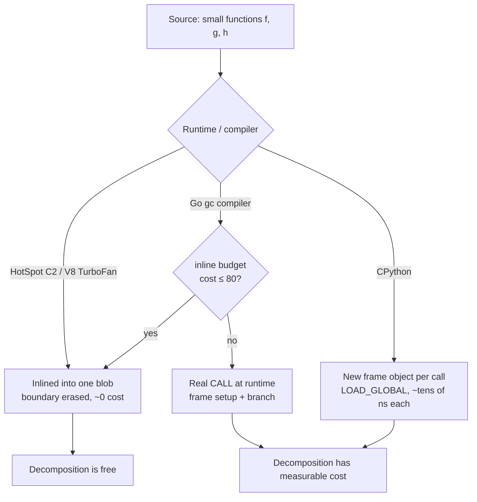
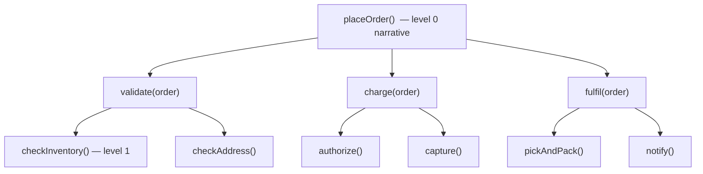

# Functions — Professional Level

> Focus: the deep end and the exceptions. Where "extract till you drop" stops being free, what the compiler does with your function boundaries, the cognitive science behind the stepdown rule, pure vs effectful design, the limits of Command-Query Separation, and the empirical case *against* maximal decomposition. Go + Java + Python, plus a worked counter-example where small functions are the wrong call.

---

## Table of Contents

1. [The function boundary is not free](#the-function-boundary-is-not-free)
2. [Inlining across three runtimes](#inlining-across-three-runtimes)
3. [When "extract till you drop" hurts](#when-extract-till-you-drop-hurts)
4. [Functions and the cognitive science of comprehension](#functions-and-the-cognitive-science-of-comprehension)
5. [Pure vs effectful design and referential transparency](#pure-vs-effectful-design-and-referential-transparency)
6. [Command-Query Separation and its limits](#command-query-separation-and-its-limits)
7. [The Ousterhout critique: shallow functions and classitis](#the-ousterhout-critique-shallow-functions-and-classitis)
8. [Designing functions for the hot path](#designing-functions-for-the-hot-path)
9. [Error-handling shape: returns vs exceptions vs Result](#error-handling-shape-returns-vs-exceptions-vs-result)
10. [A counter-example: where small functions are wrong](#a-counter-example-where-small-functions-are-wrong)
11. [Common Mistakes](#common-mistakes)
12. [Test Yourself](#test-yourself)
13. [Cheat Sheet](#cheat-sheet)
14. [Summary](#summary)
15. [Further Reading](#further-reading)
16. [Related Topics](#related-topics)

---

## The function boundary is not free

A function call is an abstraction at the source level. At the machine level it is a *protocol*: spill live registers, marshal arguments into the calling convention, push a return address, jump, build a stack frame, do the work, tear the frame down, jump back, restore registers. On a modern out-of-order CPU a non-inlined call is on the order of a few nanoseconds when the branch predictor is warm — cheap individually, but a real tax in a loop that runs a billion times.

The honest mental model is a layered one:

| Layer | What "a function call" costs there |
|---|---|
| Source code | One unit of abstraction; the reader pays only attention |
| Bytecode / IR | A `call` / `invokevirtual` / `CALL_FUNCTION` op |
| After inlining | Often *nothing* — the boundary is erased |
| Not inlined (hot path) | Register spills + frame setup + an indirect/direct branch |
| Python (no inlining) | A new frame object, dict-based name resolution, ~tens of ns |

The entire "make functions small" debate sits on top of one empirical fact: **in JIT-compiled and AOT-compiled languages, small hot functions are usually inlined away, so the cost of decomposition rounds to zero. In CPython, it does not.** Everything below is the consequence of that single asymmetry.



---

## Inlining across three runtimes

Inlining is the optimization that decides whether your function boundaries survive to the machine. Knowing each compiler's policy tells you *exactly* when "small functions" is free advice and when it is a bill.

### JVM (HotSpot) — profile-driven, generous

HotSpot's C2 compiler inlines based on bytecode size and observed hotness. The relevant defaults:

- **`MaxInlineSize` = 35** bytes — inlined even when not yet hot.
- **`FreqInlineSize` = 325** bytes — hot methods up to this size are inlined.
- **`MaxInlineLevel` = 15** (Java 14+) — maximum nesting depth of inlining.

Because the JVM profiles before it compiles, it inlines *along the hot path specifically*. A 5-method stepdown decomposition collapses into one compiled blob. Inspect it:

```bash
java -XX:+UnlockDiagnosticVMOptions -XX:+PrintInlining MyApp
```

```
@ 8   Order::subtotal (12 bytes)   inline (hot)
@ 19  Order::discount (28 bytes)   inline (hot)
@ 31  Order::tax (210 bytes)       too big          <-- boundary survives
```

The killer for inlining is **megamorphic dispatch**: when a call site sees 4+ concrete receiver types, HotSpot can no longer predict the target and stops inlining. Decomposition through a polymorphic interface in a hot loop is where the JVM's generosity runs out.

### Go (gc compiler) — budget-based, frugal

Go's inliner runs at compile time with no profile (PGO since Go 1.21 adds one). It assigns each function a **cost** roughly proportional to its AST node count and inlines only if cost ≤ **80** (the `inlineMaxBudget`). Crucially, **any function containing certain constructs is not inlinable at all** historically: `defer`, `recover`, closures, `select`, range-over-func, and (until Go 1.20) calls to other non-inlined functions in deep chains.

```bash
go build -gcflags='-m=2' ./...
```

```
./order.go:12:6: can inline subtotal with cost 22
./order.go:20:6: cannot inline applyDiscount: function too complex: cost 96 exceeds budget 80
./order.go:28:6: cannot inline logAndCharge: unhandled op DEFER
```

The practical consequence: **decomposition in Go is more expensive than in Java for hot paths.** A helper with a `defer` will *never* be inlined, so calling it inside a tight loop pays the full call cost every iteration. This is why idiomatic hot-path Go often keeps `defer` out of the loop body and accepts a slightly larger function.

PGO (`go build -pgo=cpu.pprof`) raises the budget for hot call sites specifically, partially closing the gap with HotSpot — but only where you've supplied a representative profile.

### Python (CPython) — no inlining, real per-call cost

CPython does not inline. Every call to a pure-Python function:

1. Allocates (or, since 3.11, recycles from a per-thread stack) a **frame object**.
2. Resolves the callee name via `LOAD_GLOBAL` / `LOAD_FAST` (global lookup is a dict probe).
3. Binds arguments, including building tuples/dicts for `*args`/`**kwargs`.

This is tens of nanoseconds *per call* — orders of magnitude more than an inlined JVM/Go call that costs zero. CPython 3.11's "zero-cost exceptions" and frame-object reuse and 3.12/3.13 specializing adaptive interpreter (PEP 659) shrink this, but the boundary is never free.

```python
import dis
def is_internal(addr): return addr.endswith("@example.com")
def process(addr):     return is_internal(addr)

dis.dis(process)
#   ...
#   LOAD_GLOBAL  (is_internal + NULL)   <-- dict lookup, every call
#   LOAD_FAST    (addr)
#   CALL         1                       <-- new frame, not inlined
```

**The CPython rule of thumb:** in a genuinely hot loop, fold trivial helpers back into the loop body, hoist `self.method`/global lookups into locals before the loop, and reach for `functools`/comprehensions/NumPy vectorization that push the loop into C. Outside hot loops, decompose freely — clarity dominates.

---

## When "extract till you drop" hurts

Uncle Bob's *Clean Code* pushes decomposition to its limit: "extract till you drop" — keep extracting until you cannot extract anything meaningful. As a *readability* heuristic it is mostly sound. As an *unconditional* rule it has three documented failure modes.

**1. Hot paths in non-inlining or budget-limited runtimes.** Covered above. In CPython every extracted helper is a real, costed call. In Go, an extracted helper that trips the budget or contains `defer` becomes a permanent call boundary. Benchmark before extracting inside a billion-iteration loop.

**2. Fragmentation of a single logical operation.** When a 30-line algorithm is split into eight 4-line functions that are each called exactly once, the reader must now perform eight jumps and hold eight names in working memory to reconstruct one idea. The names become *the only documentation*, and if they are weak (`doStep2`, `handlePart`) the split is pure loss. This is the "shallow function" failure (next section).

**3. False reuse signal.** Extracting code into a named function implies "this is a reusable concept." If it is called once and never will be again, the extraction lies about its own generality. A future maintainer may "reuse" `validateAndTrim` in a context where the trimming is wrong, because the name promised a clean contract the body never had.

The reconciliation: **extract to name a concept, not to hit a line count.** If the extracted function has a name that adds meaning and a body that is a coherent abstraction at one level, extract — performance will almost always forgive you. If it only exists to make the parent shorter, you are trading comprehension for a metric.

---

## Functions and the cognitive science of comprehension

The "small functions" argument is ultimately a claim about human working memory, and the evidence is worth knowing precisely.

**Working-memory capacity.** Miller's "7 ± 2" (1956) is the famous figure, but the more defensible modern estimate is Cowan's **~4 chunks** of novel information held simultaneously (Cowan, 2001, *Behavioral and Brain Sciences*). A function that forces the reader to track more than ~4 live, interacting facts at once exceeds that budget and comprehension degrades. This is the real reason long functions with many in-flight variables are hard: not their length, but their *number of simultaneously-live concepts*.

**Chunking and abstraction.** A well-named function call is a single chunk. `total = computeOrderTotal(order)` occupies one working-memory slot; the inlined ten lines that compute the total occupy several. This is the cognitive payoff of extraction — *as long as the name lets the reader stop reading*. If the reader must open the function to understand the call, extraction added a jump without removing a chunk (Ousterhout's "shallow module" again).

**The stepdown rule.** *Clean Code's* stepdown narrative — each function is followed by those one level of abstraction below it, so the file reads top-to-bottom like prose — is a direct application of chunking. The reader consumes the high-level story first (a few chunks), and descends only into the parts they care about. It works because it respects the ~4-chunk ceiling at every level.



**Where the science cuts against decomposition.** Comprehension also has a *jump cost*. Each function boundary the reader must traverse to answer a question is a context switch — they lose the surrounding state. Empirical studies of program comprehension (e.g., work building on Letovsky's and von Mayrhauser's mental-model theories) show readers prefer *locally complete* code for understanding a single behavior. So decomposition helps when the reader needs the *overview* and hurts when they need the *detail*. The right granularity is the one that matches how the code is actually read.

---

## Pure vs effectful design and referential transparency

A **pure** function: its return value depends only on its arguments, and it has no observable side effects. A pure function is **referentially transparent** — any call can be replaced by its result without changing program behavior. This is the property that unlocks memoization, common-subexpression elimination, safe reordering, trivial testing (no mocks), and fearless parallelism.

The professional discipline is not "make everything pure" — I/O exists. It is **push effects to the edges**: a thin imperative shell that does I/O wrapping a thick functional core that is pure. ("Functional core, imperative shell" — Gary Bernhardt; the same idea as Haskell's `IO` boundary and hexagonal architecture's ports.)

```go
// Pure core: deterministic, trivially testable, no mocks.
func priceOrder(items []Item, rates TaxRates) (Money, error) {
    var total Money
    for _, it := range items {
        total += it.Price.Mul(it.Qty)
    }
    return total.WithTax(rates), nil
}

// Effectful shell: the only place that touches the world.
func (s *Service) Checkout(ctx context.Context, id OrderID) error {
    order, err := s.repo.Load(ctx, id) // effect
    if err != nil { return err }
    rates, err := s.rates.For(order.Region) // effect
    if err != nil { return err }
    total, err := priceOrder(order.Items, rates) // pure
    if err != nil { return err }
    return s.payments.Charge(ctx, id, total) // effect
}
```

```python
# The pure core needs no patching; the shell is where mocks live.
def price_order(items: list[Item], rates: TaxRates) -> Money:
    subtotal = sum((it.price * it.qty for it in items), Money.zero())
    return subtotal.with_tax(rates)
```

Purity has costs to weigh: a pure transform often allocates a new value instead of mutating in place (relevant when GC pressure or large structures matter), and "no side effects" can force you to *return* what you would have logged or cached, threading more data through signatures. The senior judgement is to keep the *core* pure for testability and reasoning, and accept localized mutation inside a pure function's body (a private mutable accumulator that never escapes is still referentially transparent from the outside — this is exactly what Go's escape analysis and a `var total` accumulator above rely on).

---

## Command-Query Separation and its limits

**CQS** (Bertrand Meyer, *Object-Oriented Software Construction*): every method is either a **command** that changes state and returns nothing, or a **query** that returns a value and changes nothing — never both. Asking a question should not change the answer.

CQS is an excellent default. It makes queries safe to call freely (idempotent, no surprises in logs/order-of-evaluation) and makes commands honest about their intent. But there are principled exceptions where merging command and query is *correct*, not sloppy:

**1. Atomic test-and-set / compare-and-swap.** Concurrency primitives *must* fuse the read and the write to be atomic. `AtomicInteger.getAndIncrement()`, Go's `atomic.CompareAndSwap`, `sync.Map.LoadOrStore` — splitting these into a query then a command introduces a race. CQS would make them *unsafe*.

```go
// Fusing read+write is mandatory here — a split would be a TOCTOU bug.
if old, swapped := atomic.CompareAndSwapInt64(&counter, expected, expected+1); swapped {
    ...
}
```

**2. `pop` / `poll` / `take`.** A stack's `pop()` both returns the top element (query) and removes it (command). Separating into `peek()` + `remove()` reintroduces a race in concurrent contexts and a redundant lookup in single-threaded ones. `BlockingQueue.poll(timeout)` is the canonical CQS-violating-but-correct method.

**3. Caching / lazy initialization.** A `get()` that lazily computes-and-memoizes mutates internal state but is *observably* a pure query (referentially transparent to callers). This is "benevolent side effects" — CQS in spirit even though it writes a cache field.

The rule with teeth: **violate CQS only when the violation buys atomicity or removes a genuine race — and when the mutation is invisible to the logical contract.** A `User getUser(id)` that silently increments a hit-counter visible elsewhere is a *bad* CQS violation: it surprises the caller. `getOrCompute` is a *good* one: the caller's mental model is unchanged.

---

## The Ousterhout critique: shallow functions and classitis

John Ousterhout's *A Philosophy of Software Design* (2018) is the most cited empirical counterweight to *Clean Code's* decomposition maxims, and a professional must be able to hold both.

His core unit is the **deep module**: a module (or function) whose *interface* is small relative to the *functionality* it provides. Depth = functionality ÷ interface complexity. A `read(buffer)` call that hides an entire I/O subsystem is deep. A function whose signature is nearly as complex as its body is **shallow** — it costs the reader an interface to learn and a jump to make, while hiding almost nothing.

Ousterhout's direct charge against "functions should be tiny":

> "Sometimes [breaking up a method] makes the system more complex... The most important reason to break up a method is to create a deeper interface; if the new method has a shallow interface, it isn't worth it."

He names two failure modes that fine-grained decomposition causes:

- **Shallow functions:** a swarm of 2–4 line helpers, each called once, whose names barely abstract their bodies. The reader pays interface cost for near-zero hiding. The decomposition increased total complexity.
- **Classitis** (and its function-level analogue): the belief that more, smaller units is always better, producing many shallow components and a maze of cross-references. The cumulative interface and indirection cost exceeds the benefit.

His other directly relevant heuristics: **conjoined methods** (two functions you can't understand without reading both, because state or temporal coupling flows between them — these should usually be one function or share an explicit object) and the warning against **over-extraction that splits one idea across files**.

The synthesis professionals actually use:

| *Clean Code* (Martin) | *A Philosophy of Software Design* (Ousterhout) | Reconciliation |
|---|---|---|
| Functions should be very small | Functions should be deep | Small *and* deep: extract only when the result hides complexity behind a simpler interface |
| Extract till you drop | Don't create shallow methods | Extract to name a non-trivial concept, not to shorten |
| One level of abstraction per function | Minimize interface complexity | Both serve comprehension; depth is the tiebreaker |

Neither author is wrong; they optimize different costs (reader's local-detail load vs. system-wide interface load). The skill is knowing which cost dominates *this* function.

---

## Designing functions for the hot path

In performance-critical code, function design follows different rules — informed by the inlining and allocation facts above, not abandoned.

**Keep the hot loop body inlinable.** In Go, that means: no `defer` in the loop, keep the body under the inline budget, avoid closures that escape, avoid interface dispatch where a concrete type works. Verify with `-gcflags='-m'`. In Java, keep hot helpers under `MaxInlineSize` and avoid megamorphic call sites (cache the concrete type, or use sealed hierarchies so the JIT can devirtualize).

**Avoid allocation in signatures.** A function returning `[]byte` that the caller immediately discards forces an allocation per call. Idiomatic Go offers a caller-supplied buffer: `func (h *Hasher) Sum(b []byte) []byte` appends into `b`, letting the caller reuse memory (the `append`-to-slice convention throughout the standard library). This is a *deliberate* CQS-adjacent ergonomics trade for zero-allocation.

```go
// Hot-path friendly: caller controls allocation, reuses the buffer.
func formatKey(dst []byte, id int64) []byte {
    return strconv.AppendInt(dst, id, 10) // no new allocation if dst has cap
}
```

**Pass large structs by pointer, small ones by value.** Below ~3 machine words, by-value fits in registers and avoids a pointer chase plus a potential heap escape. Above that, by-pointer avoids copying — but a pointer often *forces* the value to escape to the heap in Go. Measure both with `-benchmem`.

**Hoist invariants out of the function call.** In CPython, `m = self.method; for x in xs: m(x)` is meaningfully faster than `for x in xs: self.method(x)` because it pays the attribute lookup once. This is an *anti*-decomposition optimization that only makes sense in profiled hot loops.

The discipline: **hot-path function design is a measured local exception, not a global style.** Apply it where a profiler points, document *why* the function is shaped oddly, and keep the rest of the codebase readable.

---

## Error-handling shape: returns vs exceptions vs Result

How a function reports failure is part of its signature and shapes every caller. Three philosophies dominate, each with a coherent rationale.

**Exceptions (Java, Python).** Failure unwinds the stack until a handler catches it. The happy path stays uncluttered; errors propagate automatically. Costs: control flow is *invisible* at the call site (any line may throw), and the stack-unwind + stack-trace capture is genuinely expensive — Java throwing an exception is dramatically slower than a normal return (which is why `fillInStackTrace` is sometimes overridden for control-flow exceptions, and why exceptions for *expected* outcomes is an anti-pattern). Use exceptions for the *exceptional*, not for expected branches.

```java
// Checked exceptions force callers to acknowledge failure — at the cost of verbosity.
Order load(OrderId id) throws OrderNotFoundException;
```

**Error returns (Go).** Failure is an ordinary value: `(T, error)`. The control flow is explicit — every `if err != nil` is visible — and there is no unwind cost. The price is verbosity and the discipline to never ignore the returned error (vet/`errcheck` enforce this). The professional concerns are **wrapping** (`fmt.Errorf("load order %d: %w", id, err)` preserves the chain for `errors.Is`/`errors.As`) and **not over-wrapping** (don't add a frame at every level — annotate where it adds context).

```go
func load(id OrderID) (Order, error) {
    o, err := repo.Get(id)
    if err != nil {
        return Order{}, fmt.Errorf("load order %d: %w", id, err) // wrap, don't swallow
    }
    return o, nil
}
```

**Result / Either types (Rust `Result<T, E>`, Python via libraries, Java with sealed types).** Failure is encoded in the *type*, forcing the caller to handle both arms at compile time — combining Go's explicitness with composability (`?`, `map`, `and_then`). The cost is ceremony in languages without first-class support and the temptation to model genuinely exceptional conditions (OOM, programmer bugs) as recoverable values when they shouldn't be.

The decision framework:

| Failure is... | Prefer | Rationale |
|---|---|---|
| Expected, part of normal flow (not found, invalid input) | Error return / `Result` | Cheap, explicit, type-checked |
| Truly exceptional (invariant broken, unrecoverable) | Exception / `panic` | Don't burden every caller; fail loud |
| A programmer bug | `panic` / unchecked exception | Crash early, don't pretend to recover |

A function's error shape is part of its contract: **a function that mixes return-value errors with thrown exceptions for the same logical category is the worst of both worlds** — callers can't reason about failure uniformly. Pick one shape per layer and hold it.

---

## A counter-example: where small functions are wrong

Consider a tight numerical kernel — a step of a physics simulation applied to millions of particles per frame. The *Clean Code* instinct says extract each sub-step into a named function. Here is why that is the wrong call, with the reasoning made concrete.

```python
# "Clean" decomposition — and a 3-5x slowdown in CPython's hot loop.
def update_velocity(p, dt): p.vx += p.ax * dt; p.vy += p.ay * dt
def update_position(p, dt): p.x  += p.vx * dt; p.y  += p.vy * dt
def apply_drag(p, k):       p.vx *= (1 - k);   p.vy *= (1 - k)

def step(particles, dt, k):
    for p in particles:          # millions of iterations
        update_velocity(p, dt)   # 3 calls/particle: 3 new frames,
        update_position(p, dt)   #   3 LOAD_GLOBAL lookups, 3x arg binding
        apply_drag(p, k)
```

Each extracted helper is a real CPython call with frame setup and a global lookup, *per particle, per frame*. The three "clean" functions triple the per-iteration call overhead in the single hottest loop in the program. The same shape in Go would force three call boundaries unless each helper inlines (a closure or `defer` would prevent it); in Java the JIT would likely rescue it via inlining — but you cannot rely on that across runtimes.

The correct hot-path version fuses the kernel and, ideally, vectorizes:

```python
import numpy as np

def step(pos, vel, acc, dt, k):  # arrays, not objects
    vel += acc * dt              # all sub-steps fused, executed in C
    vel *= (1 - k)
    pos += vel * dt
    # one logical operation, zero per-particle Python calls
```

This is **deliberately less decomposed** and it is *more* correct engineering: the function is deep (it hides the whole integration step behind one call), it respects the runtime's cost model, and it is still readable as a unit because the three lines *are* the algorithm. The lesson is not "never decompose" — it is that the boundary between "extract for clarity" and "fuse for speed" is drawn by a profiler and the runtime's inlining rules, not by a line-count rule.

---

## Common Mistakes

1. **Treating "small functions" as free in every language.** It is essentially free in HotSpot, mostly free in Go (within the inline budget, no `defer`), and *not* free in CPython. Quoting *Clean Code* line counts at a Python hot loop is malpractice; benchmark it.
2. **Extracting shallow functions to hit a metric.** A 3-line helper called once with a weak name (`doStep`) increases total complexity — interface cost without hiding (Ousterhout). Extract to name a concept, not to shorten the parent.
3. **Blindly enforcing CQS.** Splitting `pop`, `getAndIncrement`, or `LoadOrStore` into query+command introduces races. CQS yields to atomicity.
4. **Hidden, non-benevolent side effects in queries.** A `getX()` that mutates observable state surprises callers and breaks referential reasoning. Benevolent (cache) side effects are fine; visible ones are not.
5. **Using exceptions for expected branches.** Throwing on "not found" in a hot lookup pays the stack-unwind/trace-capture cost on a normal path. Model expected failure as a value.
6. **Mixing error shapes in one layer.** Some functions return errors, siblings throw for the same category — callers can't reason uniformly. One shape per layer.
7. **`defer` inside hot loops in Go.** A function with `defer` is not inlinable and the `defer` itself has per-call cost; move it out of the loop body.
8. **Assuming the JIT will always inline.** Megamorphic call sites and oversized methods break inlining. Verify with `-XX:+PrintInlining` / `-gcflags='-m'` before relying on it.

---

## Test Yourself

1. A team extracts a 40-line CPython hot loop into six 5-line helpers. Throughput drops 30%. Why, and what is the fix?

<details><summary>Answer</summary>
CPython does not inline. Each helper is now a real call per iteration: a new frame object, a `LOAD_GLOBAL` dict lookup, and argument binding — multiplied by the loop count. The fix is to fold the helpers back into the loop body for the hot path (keep them extracted for clarity only outside hot loops), hoist any `self.method`/global lookups into locals before the loop, and ideally push the loop into C via a comprehension or NumPy. Verify with a profiler (`py-spy`) and `dis` to confirm the call overhead.
</details>

2. Why is `AtomicLong.getAndIncrement()` not a violation of good design even though it breaks Command-Query Separation?

<details><summary>Answer</summary>
CQS is a default for sequential code; it assumes you can safely split a query and a command. Under concurrency, splitting read-then-write creates a race (TOCTOU): another thread can interleave between the read and the write. Atomic read-modify-write *must* be fused to be correct. CQS yields to atomicity — this is a principled exception, not sloppiness. The same applies to `pop`, `poll`, and `LoadOrStore`.
</details>

3. In Go, a hot-loop helper compiles fine but `-gcflags='-m'` says `cannot inline ...: unhandled op DEFER`. What's happening and what are the options?

<details><summary>Answer</summary>
A function containing `defer` is not inlinable by Go's compiler, so it remains a real call boundary every iteration, and the `defer` adds its own per-call setup cost. Options: remove the `defer` from the hot helper (handle cleanup at the call site or once outside the loop), restructure so the deferred work happens after the loop, or accept a slightly larger fused function in the hot path. Confirm the win with `go test -bench -benchmem`.
</details>

4. Reconcile *Clean Code's* "extract till you drop" with Ousterhout's "don't create shallow methods."

<details><summary>Answer</summary>
They optimize different costs. Martin minimizes the reader's local working-memory load by chunking via tiny functions; Ousterhout minimizes system-wide interface and indirection cost by demanding each function be deep (functionality ≫ interface). The synthesis: extract *only when the result is a deep abstraction* — a name that hides non-trivial complexity behind a simpler interface. Don't extract to hit a line count, because a shallow once-called 3-liner adds interface cost while hiding almost nothing, raising total complexity. Small and deep, not just small.
</details>

5. When does a value-returning, cache-mutating `getOrCompute()` respect Command-Query Separation in spirit, and when does it violate it in a bad way?

<details><summary>Answer</summary>
It respects CQS in spirit when the mutation is *benevolent*: the cache write is invisible to the caller's logical contract — the function is referentially transparent (same input → same observable output), and the side effect only affects performance. It violates CQS badly when the side effect is *observable* elsewhere (e.g., a query that increments a counter other code reads, or that changes what a subsequent query returns). The test: would a caller be surprised that calling this "question" changed an "answer" they can observe?
</details>

6. A Java method throwing an exception on every "validation failed" in a request-validation hot path shows up high in the profiler. Why, and what shape should the function have instead?

<details><summary>Answer</summary>
Throwing is expensive in the JVM: stack unwinding plus `fillInStackTrace` capturing the whole call stack, on a path that is *expected* (validation routinely fails). Exceptions should signal the exceptional, not normal branches. Reshape validation to return a value: a `Result`/`Either`, a list of `ValidationError`, or a sealed `Valid | Invalid` type — explicit, cheap, and forces the caller to handle the failure arm. Reserve exceptions for genuinely unexpected, unrecoverable conditions.
</details>

---

## Cheat Sheet

| Topic | The professional rule |
|---|---|
| Inlining — JVM | C2 inlines ≤35 B always, ≤325 B if hot; megamorphic sites break it. `-XX:+PrintInlining` |
| Inlining — Go | Cost ≤80 budget; `defer`/`recover`/closures block it; PGO raises hot budgets. `-gcflags='-m'` |
| Inlining — Python | None. Every call = frame + global lookup, tens of ns. `dis` to see the cost |
| Extract till you drop | True for clarity; false in CPython hot loops and Go `defer`/budget cases |
| Stepdown rule | Chunking that respects ~4-chunk working memory (Cowan); read top-down, descend on demand |
| Pure functions | Push effects to the edges; functional core, imperative shell. Local mutation that doesn't escape is still pure |
| CQS | Default yes; violate only for atomicity (`pop`, CAS, `getAndIncrement`) or benevolent caching |
| Ousterhout | Functions should be *deep* (functionality ≫ interface); avoid shallow once-called helpers |
| Hot path | No `defer` in loops; caller-supplied buffers; small structs by value; hoist lookups; profile-driven |
| Error shape | Return/`Result` for expected failure; exception/`panic` for exceptional; one shape per layer |

---

## Summary

The professional view of functions is the empirical one. "Small functions" is excellent advice that rests on a single fact — that hot small functions are usually inlined away — and that fact holds strongly in HotSpot, partially in Go (within the inline budget, no `defer`), and not at all in CPython. Decompose freely for clarity everywhere comprehension dominates; benchmark before decomposing inside the hottest loops.

The cognitive case for decomposition is real (chunking against a ~4-item working-memory ceiling, the stepdown narrative), but it has a counter-cost: each boundary is a jump the reader must traverse to see detail. Ousterhout's "deep module" gives the tiebreaker — extract only when the result hides more than the interface it adds. Keep the core pure for testability and reasoning, push effects to the edges, and respect Command-Query Separation as a default while allowing its principled exceptions for atomicity and benevolent caching. Choose one error shape per layer and match it to whether failure is expected or exceptional. Above all, let a profiler and the runtime's actual inlining rules — not a line-count maxim — draw the line between "extract for clarity" and "fuse for speed."

---

## Further Reading

- Robert C. Martin, *Clean Code* (2008), Ch. 3 "Functions" — the small-functions / stepdown / "extract till you drop" canon.
- John Ousterhout, *A Philosophy of Software Design* (2nd ed., 2021) — deep modules, shallow functions, the critique of over-decomposition.
- Bertrand Meyer, *Object-Oriented Software Construction* (2nd ed., 1997) — origin of Command-Query Separation.
- Nelson Cowan, "The magical number 4 in short-term memory" (*Behavioral and Brain Sciences*, 2001) — working-memory chunk capacity.
- Gary Bernhardt, "Boundaries" / "Functional Core, Imperative Shell" (2012 talk) — purity at the edges.
- HotSpot Wiki / Aleksey Shipilëv's JVM Anatomy Park — inlining, escape analysis, layout under the JIT.
- The Go Blog, "Profile-guided optimization" (Go 1.21+) and `cmd/compile` inlining notes — the inline budget and PGO.
- Python docs — `dis`, and PEP 659 (specializing adaptive interpreter, 3.11+) — CPython call cost and its reduction.

---

## Related Topics

- [senior.md](senior.md) — function design heuristics and trade-offs at the senior level.
- [interview.md](interview.md) — function-design questions across all levels.
- [Chapter README](../README.md) — the positive rules and anti-patterns for functions.
- [Pure Functions](../15-pure-functions/README.md) — referential transparency in depth.
- [Abstraction and Information Hiding](../22-abstraction-and-information-hiding/README.md) — the deep-module idea applied to interfaces.
- [Functional Programming](../../functional-programming/README.md) — purity, immutability, and effect handling as a paradigm.
- [Refactoring](../../refactoring/README.md) — Extract Function and the smells that motivate (and over-motivate) it.
