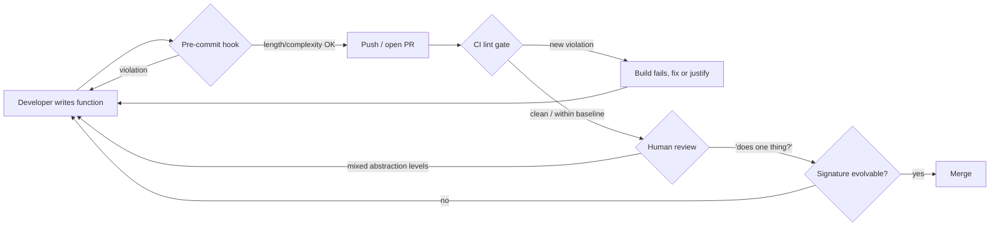

# Functions — Senior Level

> Focus: enforcing function quality across a team — not "how do I write a good function?" but "how do I make *every* function the team ships meet the bar, automatically, without becoming the bottleneck?" Lint rules, review heuristics, safe refactoring of legacy functions, and public-API ergonomics that survive years of change.

---

## Table of Contents

1. [From taste to policy](#from-taste-to-policy)
2. [Enforcing length and complexity with linters](#enforcing-length-and-complexity-with-linters)
3. [Reviewing for "does one thing"](#reviewing-for-does-one-thing)
4. [Refactoring large functions safely behind tests](#refactoring-large-functions-safely-behind-tests)
5. [Designing public function signatures for evolvability](#designing-public-function-signatures-for-evolvability)
6. [Argument count and the options pattern across languages](#argument-count-and-the-options-pattern-across-languages)
7. [Team conventions on side effects and CQS](#team-conventions-on-side-effects-and-cqs)
8. [How function design enables testability](#how-function-design-enables-testability)
9. [Rolling out the policy without a revolt](#rolling-out-the-policy-without-a-revolt)
10. [Common Mistakes](#common-mistakes)
11. [Test Yourself](#test-yourself)
12. [Cheat Sheet](#cheat-sheet)
13. [Summary](#summary)
14. [Further Reading](#further-reading)
15. [Related Topics](#related-topics)

---

## From taste to policy

At junior and middle level, "write small functions that do one thing" is advice you apply to your own code. At senior level it stops being advice and becomes a **system**: a set of automated gates, review norms, and refactoring recipes that hold the line across dozens of contributors who do not share your taste and never read the same book you did.

The shift in framing:

| Individual habit (junior/middle) | Team policy (senior) |
|---|---|
| "I keep my functions short." | The linter fails the build above N lines. |
| "I avoid flag arguments." | The review checklist flags boolean params; a custom lint rule catches them. |
| "I split when it does two things." | Cognitive-complexity delta is reported per PR. |
| "My function is easy to test." | Untestable signatures (hidden I/O, global state) are caught in review and, where possible, by static analysis. |
| "I designed a clean signature." | Public signatures are reviewed for *evolvability*: can we add a parameter in 18 months without breaking callers? |

Two failure modes to avoid. **Anarchy:** no gates, so quality tracks the weakest contributor on the worst day. **Tyranny:** gates so strict that people game them — splitting a coherent 55-line function into three incoherent 18-line functions purely to satisfy `funlen`. The senior job is calibrating gates so the easy path is the clean path, catching genuinely bad cases without punishing the legitimately-long-but-cohesive ones.



The diagram's point: machines catch *measurable* problems (length, complexity, param count, boolean params) cheaply and consistently; humans are reserved for *judgment* problems (single responsibility, abstraction levels, naming, API evolvability) no linter can decide. Don't waste reviewer attention on what a linter handles, and don't pretend a linter can replace the reviewer.

---

## Enforcing length and complexity with linters

Pick a small number of metrics, set thresholds you can defend, and wire them into CI. The three that matter most for functions: **length** (a proxy, but a useful one), **cyclomatic complexity** (path count, good for test planning), and **cognitive complexity** (nesting-aware, closest to human reading cost). Prefer cognitive complexity as the *primary* gate — it doesn't punish a flat 30-branch dispatch table the way it punishes a 5-deep nest.

### Go — golangci-lint

`funlen` (length), `gocyclo` (cyclomatic), `gocognit` (cognitive), and `revive`'s `argument-limit` cover the function-level smells. Real config:

```yaml
# .golangci.yml
linters:
  enable:
    - funlen
    - gocyclo
    - gocognit
    - revive
    - nakedret      # naked returns hide what a long func actually returns
    - nestif        # deeply nested if blocks

linters-settings:
  funlen:
    lines: 60          # statements + blank/comment lines
    statements: 40     # logical statements only — the number that actually matters
    ignore-comments: true
  gocyclo:
    min-complexity: 15
  gocognit:
    min-complexity: 20
  nestif:
    min-complexity: 4
  revive:
    rules:
      - name: argument-limit
        arguments: [5]
      - name: cognitive-complexity
        arguments: [20]

issues:
  # Test files legitimately have long table-driven tests; relax there.
  exclude-rules:
    - path: _test\.go
      linters: [funlen, gocognit]
```

`funlen`'s `statements` knob is the one to tune; `lines` over-counts table literals and struct composition. For Go specifically there are no classes, so file/package-level cohesion is enforced separately — at the function level, the above is the bulk of the work.

### Java — Checkstyle + PMD

Checkstyle owns length and param count; PMD owns the richer complexity metrics including cognitive complexity.

```xml
<!-- checkstyle.xml -->
<module name="Checker">
  <module name="TreeWalker">
    <module name="MethodLength">
      <property name="max" value="60"/>
      <property name="countEmpty" value="false"/>
    </module>
    <module name="ParameterNumber">
      <property name="max" value="5"/>
      <!-- constructors injected by DI frameworks are exempt -->
      <property name="ignoreOverriddenMethods" value="true"/>
    </module>
    <module name="CyclomaticComplexity">
      <property name="max" value="15"/>
    </module>
  </module>
</module>
```

```xml
<!-- pmd-ruleset.xml -->
<ruleset name="team-functions"
         xmlns="http://pmd.sourceforge.net/ruleset/2.0.0">
  <rule ref="category/java/design.xml/CognitiveComplexity">
    <properties>
      <property name="reportLevel" value="20"/>
    </properties>
  </rule>
  <rule ref="category/java/design.xml/NPathComplexity"/>
  <rule ref="category/java/design.xml/ExcessiveParameterList">
    <properties><property name="minimum" value="6"/></properties>
  </rule>
</ruleset>
```

If the team already runs SonarQube, its `java:S3776` (cognitive complexity) and `java:S107` (too many parameters) cover the same ground with a managed baseline — useful for legacy code (see rollout below).

### Python — pylint + radon + ruff

Pylint's `too-many-*` family plus radon for standalone complexity scoring; ruff for fast pre-commit feedback with equivalent codes.

```ini
# .pylintrc  (or [tool.pylint.*] in pyproject.toml)
[DESIGN]
max-args = 5              # R0913 too-many-arguments
max-locals = 15          # R0914 too-many-locals
max-branches = 12        # R0912 too-many-branches
max-statements = 50      # R0915 too-many-statements
max-returns = 6          # R0911 too-many-return-statements
max-bool-expr = 5        # R0916 too-many-boolean-expressions in one condition
```

```toml
# pyproject.toml — ruff: fast, drop-in equivalents
[tool.ruff.lint]
select = ["PLR0912", "PLR0913", "PLR0915", "C901"]  # branches, args, statements, mccabe
[tool.ruff.lint.mccabe]
max-complexity = 12
[tool.ruff.lint.pylint]
max-args = 5
max-statements = 50
```

```bash
# radon — cognitive/cyclomatic report you can trend over time or gate in CI
radon cc src/ --min C --show-complexity        # list functions rank C and worse
radon cc src/ --total-average --json > cc.json # machine-readable for a CI gate
xenon --max-absolute B --max-average A src/    # radon's CI-gate companion
```

`xenon` is the piece that turns radon's *report* into a *gate*: it exits non-zero when any function exceeds the configured rank, so it slots straight into a pipeline.

### Make CI the source of truth, not the laptop

Run the same config locally (pre-commit) and in CI, but let CI be authoritative — laptops drift. A minimal pre-commit wiring:

```yaml
# .pre-commit-config.yaml
repos:
  - repo: https://github.com/golangci/golangci-lint
    rev: v1.59.0
    hooks: [{ id: golangci-lint }]
  - repo: https://github.com/astral-sh/ruff-pre-commit
    rev: v0.5.0
    hooks: [{ id: ruff }]
```

> **Threshold guidance, not gospel:** length 50–60, cyclomatic ~15, cognitive ~15–20, params ≤5. These are *warn-then-fail* bands, not bright lines from physics. The right number is the one your team can hold without gaming it. A function 5 lines over a soft cap is a conversation; one 4× over is a defect.

---

## Reviewing for "does one thing"

No linter can tell you whether a function does one thing — that's a semantic judgment, and it's the highest-value thing a reviewer contributes on the function axis. Concrete tells that a function does more than one thing, usable as a review checklist:

- **Sectioning comments.** `// validate`, `// then persist`, `// finally notify` are the function announcing its own seams. Each section wants to be a named function.
- **Mixed levels of abstraction.** A function that both formulates a SQL string *and* makes a business decision *and* formats a date is operating at three altitudes at once. A clean function reads as a paragraph of steps at *one* level; the next level down lives in the functions it calls. This is the **Stepdown Rule**.
- **"And" / "or" in an honest name.** If the truthful name is `validateAndSaveAndNotify`, it does three things. The name is the tell.
- **A boolean (flag) parameter.** `render(boolean asHtml)` is two functions wearing a trench coat: `renderHtml()` and `renderText()`. The flag means the body has an `if` that selects between two behaviors — two responsibilities.
- **Output / mutated parameters.** A function that returns a value *and* mutates an argument is doing query and command at once (see CQS below).
- **Temporal coupling.** If callers must invoke `open()` before `read()` before `close()` and nothing in the types enforces it, the "one thing" is smeared across three functions with an implicit contract. Builder/fluent APIs or a single `withResource(fn)` make the ordering impossible to get wrong.

A useful reviewer reframing: instead of "is this function too long?", ask **"can you summarize what this does in one sentence with no 'and'?"** If the author can't, the function doesn't do one thing — regardless of its line count. Length is the symptom; multiple responsibilities is the disease, and a short function can still have the disease.

Keep these as an explicit, shared checklist (in the PR template or the team's [code-review guide](../17-code-reviews/README.md)) so the bar doesn't depend on which reviewer happened to pick up the PR.

---

## Refactoring large functions safely behind tests

The senior move when you inherit a 400-line function is not to rewrite it — it's to **pin its current behavior with tests, then extract in small reversible steps**, leaning on the compiler/IDE to keep each step safe.

### Step 1 — characterize before you touch

If the function has no tests, write **characterization tests** first: tests that capture *what it does today*, not what it should do. Feed representative inputs, record outputs, assert on the recording. These tests pass by construction and become your refactoring net. (See [unit tests](../08-unit-tests/README.md) for structuring them.)

```python
# Pin current behavior of a legacy pricing function before refactoring.
import pytest
from legacy.pricing import compute_total

@pytest.mark.parametrize("cart, coupon, expected", [
    ({"items": [{"price": 10, "qty": 2}]}, None,        20.00),
    ({"items": [{"price": 10, "qty": 2}]}, "SAVE10",     18.00),
    ({"items": []},                         "SAVE10",     0.00),
    ({"items": [{"price": 9.99, "qty": 3}]}, "BOGUS",    29.97),  # captures the *actual* odd behavior
])
def test_compute_total_characterization(cart, coupon, expected):
    assert compute_total(cart, coupon) == pytest.approx(expected)
```

Note the `BOGUS` case: characterization tests document reality, including bugs. You preserve behavior first; you fix the bug as a *separate, named* change afterward, so a regression in the refactor never hides behind an intended fix.

### Step 2 — extract one cohesive block at a time

Use **Extract Function** mechanically: pick a block with a clear local purpose, give it a name, pass in what it reads, return what it produces. Lean on the IDE's "Extract Method" refactoring (IntelliJ, GoLand, PyCharm) which is far less error-prone than hand-extraction. After each extraction, run the characterization tests. Green → commit. Red → revert that one step; it was unsafe.

```go
// BEFORE: one function deciding shipping, mixing levels of abstraction.
func process(o Order) (Receipt, error) {
    // ... 30 lines computing subtotal ...
    var ship float64
    if o.Weight > 50 {
        if o.Express { ship = o.Weight * 0.9 } else { ship = o.Weight * 0.5 }
    } else if o.Express {
        ship = 15
    } else {
        ship = 5
    }
    // ... 40 more lines applying tax, building receipt ...
}

// AFTER: the shipping decision is one thing, named, testable in isolation.
func process(o Order) (Receipt, error) {
    subtotal := computeSubtotal(o)
    ship := shippingCost(o.Weight, o.Express)
    return buildReceipt(o, subtotal, ship, applyTax(subtotal))
}

func shippingCost(weight float64, express bool) float64 {
    switch {
    case weight > 50 && express: return weight * 0.9
    case weight > 50:            return weight * 0.5
    case express:                return 15
    default:                     return 5
    }
}
```

`shippingCost` is now a **pure function** of its inputs — trivially unit-testable with a table, no `Order` fixture needed.

### Step 3 — the safety ladder

| If you have... | Use |
|---|---|
| Reliable tests | IDE Extract Method + run tests after each step |
| No tests, simple inputs | Characterization tests first, then extract |
| No tests, complex/IO inputs | Approval/golden-master tests (record real outputs), or VCR-style capture |
| Too tangled to extract directly | Mikado method: attempt, record what breaks, revert, fix prerequisites first |
| Need a kill-switch during rollout | Branch by abstraction behind a feature flag |

The deeper mechanics of these recipes live in [refactoring](../../refactoring/README.md); the senior responsibility is *choosing the right rung* for the risk level and never extracting without a net.

---

## Designing public function signatures for evolvability

The cost of a signature is paid by everyone who calls it, forever. For a private helper, a bad signature costs one edit to fix. For a **published** function — a library API, a service client, an SDK method — every change is a coordinated migration across every caller, possibly outside your repo. Design these for the change you *will* need to make later.

Principles for evolvable signatures:

- **Reserve room to grow without breaking callers.** Adding a parameter is a breaking change in most languages. Languages and patterns that let you add *optional* inputs without touching existing call sites (options structs, keyword args, builders) trade a little verbosity now for years of source compatibility.
- **Return types that can gain fields.** Returning a *named struct* (Go), a *value object* (Java record), or a *dataclass* (Python) instead of a tuple means you can add a field later without breaking destructuring callers. A function returning `(string, int, bool, error)` is a future migration; one returning `(Result, error)` can grow `Result` freely.
- **Don't leak internal types across the boundary.** A public function that returns your ORM entity has welded your persistence layer to your API contract. Return a DTO/domain type you control.
- **Make illegal calls unrepresentable.** Prefer types over runtime checks: a `NonEmptyList`, a typed `UserID` instead of `string`, an enum instead of a magic int. The signature then documents and enforces the contract.
- **Stability of name and meaning.** Renaming a published function or quietly changing what it returns breaks callers silently. Deprecate-then-remove; never repurpose.

> **The asymmetry to internalize:** signature changes to private functions are cheap and local; signature changes to published functions are expensive and global. Spend design effort in proportion. It is entirely correct to deliberate for an hour over a public SDK method and to not think twice about a one-off private helper.

---

## Argument count and the options pattern across languages

Long parameter lists are the most common signature smell, and the *idiomatic* cure differs by language. A function with 6+ positional parameters is hard to call correctly (`f(true, false, 0, nil, "", 3)` — which is which?) and impossible to extend safely. Each ecosystem has its own evolvable answer.

### Go — functional options

Go has no default parameters and no overloading. The idiom for "many optional knobs, source-compatible growth" is **functional options**:

```go
type Server struct {
    addr    string
    timeout time.Duration
    tls     *tls.Config
    maxConn int
}

type Option func(*Server)

func WithTimeout(d time.Duration) Option { return func(s *Server) { s.timeout = d } }
func WithTLS(c *tls.Config) Option       { return func(s *Server) { s.tls = c } }
func WithMaxConn(n int) Option           { return func(s *Server) { s.maxConn = n } }

// Required args positional; everything optional via variadic options.
func NewServer(addr string, opts ...Option) *Server {
    s := &Server{addr: addr, timeout: 30 * time.Second, maxConn: 100} // sane defaults
    for _, opt := range opts {
        opt(s)
    }
    return s
}

// Call site reads itself; adding WithRetries later breaks no caller.
srv := NewServer(":8080", WithTimeout(5*time.Second), WithMaxConn(1000))
```

Adding `WithRetries` later is purely additive — no existing call site changes. For a handful of *required, cohesive* parameters, prefer a plain config struct instead; options shine when most inputs are optional.

### Java — builder and (sparingly) overloads

For 3+ optional parameters, a **builder** beats telescoping constructors and beats overload explosions:

```java
public final class HttpRequest {
    private final URI uri;
    private final Duration timeout;
    private final Map<String, String> headers;

    private HttpRequest(Builder b) {
        this.uri = b.uri; this.timeout = b.timeout; this.headers = b.headers;
    }

    public static Builder to(URI uri) { return new Builder(uri); }

    public static final class Builder {
        private final URI uri;                       // required
        private Duration timeout = Duration.ofSeconds(30); // defaulted optional
        private Map<String, String> headers = Map.of();

        private Builder(URI uri) { this.uri = Objects.requireNonNull(uri); }
        public Builder timeout(Duration t) { this.timeout = t; return this; }
        public Builder header(String k, String v) {
            this.headers = /* copy-on-write add */ withHeader(headers, k, v); return this;
        }
        public HttpRequest build() { return new HttpRequest(this); }
    }
}

// var req = HttpRequest.to(uri).timeout(Duration.ofSeconds(5)).header("Accept","json").build();
```

Overloads are fine for a *small, fixed* set of variants (`of(int)`, `of(int, int)`); they become unmaintainable past ~3 and can't express "set the 4th option but not the 2nd." A boolean parameter is *never* the answer — split into two named methods.

### Python — keyword-only arguments

Python's evolvable cure is **keyword-only parameters** (everything after `*`), plus defaults and dataclasses for grouped config. Keyword-only forces call-site clarity and lets you reorder/add params freely:

```python
from dataclasses import dataclass

# `*` makes everything after it keyword-only: connect(host, port=..., tls=...)
def connect(host: str, *, port: int = 5432, timeout: float = 30.0,
            tls: bool = False, pool_size: int = 10) -> "Connection":
    ...

# Call site is self-documenting; you can never mix up tls and pool_size.
conn = connect("db.internal", port=6432, tls=True, pool_size=50)

# For a cohesive bundle of related fields, group into a dataclass:
@dataclass(frozen=True, slots=True)
class RetryPolicy:
    attempts: int = 3
    backoff: float = 0.5
    jitter: bool = True

def call(endpoint: str, *, retry: RetryPolicy = RetryPolicy()) -> Response:
    ...
```

`frozen=True` makes the config immutable (no surprise mutation of a shared default); `slots=True` saves memory. A bare mutable default (`retry=RetryPolicy()` as a *mutable* instance, or worse `headers={}`) is a classic Python footgun — keep defaults immutable.

### Cross-language summary

| Language | Required args | Optional args (evolvable) | Avoid |
|---|---|---|---|
| Go | positional | functional options or config struct | many positional; boolean flags |
| Java | constructor / first method | builder; overloads only for small fixed sets | telescoping constructors; boolean params |
| Python | positional or keyword | keyword-only + defaults; dataclass bundles | long positional lists; mutable defaults |

The unifying rule: **separate the few required inputs from the many optional ones, and make the optional ones named and additive.** That single principle, expressed in each language's idiom, kills the Long Parameter List smell *and* buys signature evolvability.

---

## Team conventions on side effects and CQS

**Command–Query Separation (CQS):** a function should either *do* something (a command — changes state, returns nothing or just a status) or *answer* something (a query — returns a value, changes nothing), but not both. A function that does both is harder to reason about, harder to test, and surprising to callers.

The classic violation:

```java
// BAD: getUser both reads (query) AND silently creates on miss (command).
User getUser(String id) {
    User u = repo.find(id);
    if (u == null) {
        u = repo.create(id);   // surprise mutation hidden behind a "get"
    }
    return u;
}
```

A caller reasonably assumes `getUser` is safe to call repeatedly, in a loop, in a log statement — and unknowingly creates rows. Split it:

```java
Optional<User> findUser(String id);     // pure query, safe to call anywhere
User createUser(String id);             // explicit command
User getOrCreateUser(String id);        // if both are truly needed, NAME the combination
```

`getOrCreateUser` is the honest version: the name advertises that it may mutate.

Senior-level team conventions worth codifying:

- **Name commands with verbs, queries with nouns/`get`/`is`/`has`.** `save`, `delete`, `publish` mutate; `total`, `isValid`, `findById` don't. When a name lies, the bug is in the name.
- **Queries must be side-effect-free** (memoization/lazy-init caching is the only acceptable hidden write, and it must be observationally pure).
- **No output parameters.** Don't mutate an argument as a way of returning data — return a value. Mutated-input is invisible at the call site and breaks under concurrency.
- **Isolate I/O at the edges.** Keep core logic as pure functions; push file/network/clock/DB access to thin adapter functions at the boundary. This is the **functional core, imperative shell** pattern and it's the single biggest lever for testability.
- **Make hidden inputs explicit.** A function reading `time.Now()`, a global config, or a random source has *invisible parameters*. Inject the clock, the config, the RNG — now the function is deterministic and the dependency is in the signature where reviewers can see it.

These conventions are most valuable written down and enforced in review, because they're judgment calls a linter can rarely make. The payoff lands directly in the next section.

---

## How function design enables testability

Testability is not a separate concern you bolt on — it's a *consequence* of the function-design choices above. A function is easy to test exactly when its inputs and outputs are explicit and its side effects are isolated. Trace the chain:

| Design choice | Testability consequence |
|---|---|
| Pure function (output depends only on args) | Test with a value table; no setup, no mocks, no teardown. Fast and deterministic. |
| Side effects isolated at edges | Core logic tests need no DB/network/filesystem; edges get a few integration tests. |
| Dependencies injected, not reached for | Pass a fake clock / in-memory repo; no global patching, no `time.Sleep`. |
| CQS respected | A query can be asserted on directly; a command can be verified by observing state once. |
| Small, single-responsibility functions | Few branches → few test cases → high coverage cheaply. |
| Named return struct, not tuple | Tests read by field name; adding a field doesn't break existing assertions. |

The contrapositive is the diagnostic: **if a function is hard to test, the function is badly designed, not the test framework.** Hard-to-test almost always means hidden inputs (global state, `now()`), hidden outputs (mutated args, console writes), or too many responsibilities. The test pain is a *design smell detector*. When a reviewer sees a PR that needs five mocks to test one function, the right feedback is "this function is doing too much / reaching for too many dependencies," not "add more mocks."

Concretely, the Go `shippingCost` extracted earlier:

```go
func TestShippingCost(t *testing.T) {
    cases := []struct {
        name           string
        weight         float64
        express, want  any
    }{
        {"light standard", 10, false, 5.0},
        {"light express", 10, true, 15.0},
        {"heavy standard", 60, false, 30.0},
        {"heavy express", 60, true, 54.0},
    }
    for _, c := range cases {
        t.Run(c.name, func(t *testing.T) {
            if got := shippingCost(c.weight, c.express.(bool)); got != c.want {
                t.Errorf("shippingCost(%v,%v) = %v, want %v",
                    c.weight, c.express, got, c.want)
            }
        })
    }
}
```

No `Order` fixture, no database, no clock — because the function is pure. That table is the *dividend* of good function design. The same logic trapped inside the original 70-line `process` would have required constructing a full `Order`, stubbing tax, and asserting on a deeply nested receipt field — ten times the test code for the same coverage.

---

## Rolling out the policy without a revolt

Turning on `funlen` or `CognitiveComplexity` against a mature codebase produces thousands of violations on day one. Failing the whole build is a non-starter — it blocks unrelated work and the team will disable the linter out of self-defense. Roll out gradually:

1. **Baseline the existing violations.** SonarQube, golangci-lint (`--new-from-rev`), ESLint, and ruff all support a baseline: snapshot today's violations, fail only on *new* ones or on *changes to violation-bearing lines*. The backlog shrinks as files are touched, with zero big-bang refactor.

   ```bash
   # golangci-lint: only report issues introduced since the main branch.
   golangci-lint run --new-from-rev=origin/main
   ```

2. **"Don't make it worse" gate.** Even simpler: a PR may not *increase* the violation count for the files it changes. Allows urgent fixes; prevents drift.

3. **Report the complexity delta per PR.** Surface "this PR raised `processOrder` cognitive complexity from 18 → 28" as a review comment. Makes the cost of "just one more `if`" visible at the cheapest moment.

4. **Stricter on new code, lenient on legacy.** Tag legacy directories with relaxed thresholds; new files get the full bar. New code is born clean; old code improves opportunistically (the Boy Scout Rule).

5. **Tune thresholds with the team, then freeze them.** Pick numbers people accept, write them in the linter config (version-controlled), and stop relitigating per PR. The config is the agreement.

The goal is a ratchet, not a cliff: the codebase can only get cleaner, never dirtier, and nobody's Tuesday is ruined by a backlog they didn't create.

---

## Common Mistakes

- **Treating line count as the whole story.** A 15-line function that does three things is worse than a 45-line function that does one thing legibly. Length is a *proxy* for complexity, not complexity itself. Gate on cognitive complexity primarily; use length as a soft secondary signal.
- **Letting people game the linter.** Splitting one cohesive function into three artificial fragments to satisfy `funlen` produces *more* cognitive load (now the reader chases the logic across three names). Calibrate thresholds so this isn't incentivized, and call it out in review when it happens.
- **Big-bang linter adoption.** Turning on strict gates against a legacy codebase and failing the build → the team disables the linter. Always baseline.
- **Allowing boolean parameters because "it's just one."** One boolean is the seed; the second and third follow. Catch the first with a custom lint rule or review heuristic and split into named functions.
- **Designing private-helper signatures with the same ceremony as public ones (or vice versa).** Over-engineering a one-off helper with a builder wastes effort; under-designing a published SDK method creates a forever-migration. Spend in proportion to blast radius.
- **Returning tuples from public functions to "save a struct."** The first time you need a fourth return value you break every caller. Name the return type from the start if it crosses a module boundary.
- **Mocking your way around an untestable function.** Five mocks to test one function is the design telling you the function does too much or reaches for too many dependencies. Fix the function, not the test.
- **Hidden I/O and global state in "pure-looking" functions.** A function that reads `now()` or a global config is impure and non-deterministic. Inject the dependency; reviewers can't see what isn't in the signature.

---

## Test Yourself

1. **Your `funlen` cap is 50 lines. A reviewer pushes back: "this 70-line function does exactly one thing — it's a long but flat data-transformation pipeline." What do you do?**

<details><summary>Answer</summary>

Trust the judgment over the metric, and check it. `funlen`/length is a proxy; the real questions are cognitive complexity and "does one thing." If cognitive complexity is low (flat, no deep nesting, no mixed abstraction levels) and the function genuinely has a single responsibility, it's a legitimate exception — add an inline `//nolint:funlen` with a justifying comment, or raise the soft cap. Forcing an artificial split here would *increase* total cognitive load. The metric exists to start this conversation, not to win it.
</details>

2. **Why prefer cognitive complexity over cyclomatic complexity as the primary function gate — and when is cyclomatic still the right tool?**

<details><summary>Answer</summary>

Cyclomatic counts decision points and is blind to nesting: a flat 20-branch dispatch scores the same as 20 deeply nested `if`s, even though the nested version is far harder to read. Cognitive complexity penalizes nesting, matching human reading cost — so it's the better *maintainability* gate. Cyclomatic is still the right tool for **test-coverage planning**: it approximates the number of independent paths through a function, which roughly equals the number of tests needed for path coverage.
</details>

3. **A teammate adds `process(order, sendEmail bool, async bool)`. What's wrong, and what's the fix in Go, Java, and Python?**

<details><summary>Answer</summary>

Two boolean parameters = up to four behaviors hidden behind flags; the call `process(o, true, false)` is unreadable and the body holds branching that means the function does several things. Fix: separate the behaviors. Go — split into named functions (`processSync`, `processAndNotify`) or, if combinations are real, functional options (`WithEmail()`, `WithAsync()`). Java — split into named methods or use a builder for the optional behaviors; never a boolean param. Python — keyword-only args at minimum (`process(order, *, send_email=False, async_=False)`) so call sites are self-documenting, but prefer splitting if the booleans select genuinely different behavior.
</details>

4. **You must refactor a 350-line function with zero tests. Outline the safe sequence.**

<details><summary>Answer</summary>

(1) Write **characterization tests** that pin current behavior on representative inputs — including any odd/buggy behavior, since the goal is "preserve behavior," not "fix bugs yet." (2) Use the IDE's Extract Method to pull out one cohesive block at a time; run the tests after each extraction — green means commit, red means revert that single step. (3) For inputs too complex to assert by hand, use approval/golden-master tests. (4) If it's too tangled to extract directly, use the Mikado method: attempt, record what breaks, revert, fix prerequisites first. (5) Only after structure is clean do you fix the captured bugs, as separate named commits, and replace characterization tests with intent-based tests.
</details>

5. **Explain why "if a function is hard to test, the function is badly designed" is usually true.**

<details><summary>Answer</summary>

Test difficulty almost always traces to hidden inputs (global state, `now()`, ambient config), hidden outputs (mutated arguments, console/file writes), or too many responsibilities (so a single test must exercise many paths and dependencies). All three are *design* defects, not test-tooling defects. A function with explicit inputs, an explicit return, isolated side effects, and one responsibility is testable with a value table and no mocks. So test pain is a reliable design-smell detector; the fix is to refactor the function (inject dependencies, isolate I/O, split responsibilities), not to add more mocks.
</details>

6. **Why is returning a named struct from a public function more evolvable than returning a tuple?**

<details><summary>Answer</summary>

Adding a field to a named struct/record/dataclass is backward-compatible — existing callers ignore the new field and keep compiling. Adding an element to a tuple changes its arity and breaks every caller that destructures it (and every type signature that names it). For a *published* function, that's a coordinated migration across all callers, possibly outside your repo. The named return type buys you additive evolution; reserve tuples for private helpers where a change is one local edit.
</details>

---

## Cheat Sheet

| Concern | Go | Java | Python |
|---|---|---|---|
| Length lint | `funlen` | Checkstyle `MethodLength` | pylint `R0915` / ruff `PLR0915` |
| Cyclomatic | `gocyclo` | Checkstyle `CyclomaticComplexity` / PMD | ruff `C901` (mccabe) / radon |
| Cognitive | `gocognit` / revive | PMD `CognitiveComplexity` / Sonar `S3776` | radon + xenon |
| Param count | `revive: argument-limit` | Checkstyle `ParameterNumber` / Sonar `S107` | pylint `R0913` / ruff `PLR0913` |
| Optional-arg pattern | functional options | builder | keyword-only + dataclass |
| Avoid | boolean flags, many positional | telescoping ctors, boolean flags | long positional lists, mutable defaults |

**Default thresholds (warn→fail):** length 50→60 · cyclomatic ~15 · cognitive 15→20 · params ≤5 · boolean params 0 ideal, ≥3 is a defect.

**Review questions for any function:**
- One sentence, no "and"? (single responsibility)
- All inputs and outputs in the signature? (no hidden I/O, no mutated args)
- Command or query, not both? (CQS)
- One level of abstraction throughout? (Stepdown Rule)
- If public: can I add a parameter / return field in a year without breaking callers?
- Could I test it with a value table, or does it need mocks? (testability = design)

**Legacy rollout ladder:** baseline → "don't make it worse" gate → per-PR complexity delta → stricter-on-new → freeze agreed thresholds in version-controlled config.

---

## Summary

At senior level, function quality stops being a personal habit and becomes an enforced, calibrated team policy. Machines handle the measurable axes — length, cyclomatic and cognitive complexity, parameter count, boolean-flag detection — via real linter config (`golangci-lint`'s `funlen`/`gocyclo`/`gocognit`, Checkstyle + PMD, pylint/ruff/radon) wired into pre-commit and CI, with CI as the source of truth. Humans handle the judgment axes: "does this do one thing?", correct abstraction levels, CQS, and — most consequentially — the *evolvability* of public signatures, where every change is a global migration. The cures for long parameter lists are language-idiomatic (functional options in Go, builders in Java, keyword-only args and dataclasses in Python) but share one rule: separate the few required inputs from the many optional, additive ones. Refactoring large functions is done behind a test net (characterize → extract one block → run tests → commit or revert), choosing the safety rung that matches the risk. And the through-line that ties it all together: testability is a *consequence* of good function design — pure functions, isolated side effects, injected dependencies, and single responsibility make tests trivial, while hard-to-test code is the design smell talking. Roll the whole policy out as a ratchet, not a cliff: baseline the legacy debt, gate new code strictly, and let the codebase only get cleaner.

---

## Further Reading

- *Clean Code* (Robert C. Martin), Ch. 3 "Functions" — small, one-thing, the Stepdown Rule, flag arguments, command-query separation.
- *Refactoring*, 2nd ed. (Martin Fowler) — Extract Function, Introduce Parameter Object, Separate Query from Modifier; the mechanics behind safe extraction.
- *Working Effectively with Legacy Code* (Michael Feathers) — characterization tests and seams for refactoring untested functions.
- *A Philosophy of Software Design* (John Ousterhout) — deep vs. shallow modules; designing interfaces (function signatures) for low cognitive cost.
- SonarSource, "Cognitive Complexity: A new way of measuring understandability" (white paper) — why nesting-aware complexity beats cyclomatic for maintainability.
- *Effective Java*, 3rd ed. (Joshua Bloch), Items 1–2, 49–56 — static factories, the builder pattern, and designing method signatures.

---

## Related Topics

- [junior.md](junior.md) — what a clean function is: small, one thing, descriptive name, few arguments.
- [middle.md](middle.md) — applying the rules to your own code: extraction, abstraction levels, avoiding flag/output args.
- [professional.md](professional.md) — function design at architectural and cross-cutting scale.
- [Chapter README](../README.md) — the positive rules and the anti-patterns this chapter inverts.
- [Code Reviews](../17-code-reviews/README.md) — where most function-quality judgment is enforced.
- [Cognitive Load](../20-cognitive-load/README.md) — why nesting and mixed abstraction levels are expensive to read.
- [Unit Tests](../08-unit-tests/README.md) — characterization tests and the table-driven tests that good functions enable.
- [Refactoring](../../refactoring/README.md) — Extract Function, Mikado method, branch by abstraction, strangler fig.
- [Anti-Patterns](../../anti-patterns/README.md) — flag arguments, output arguments, temporal coupling as named smells.
