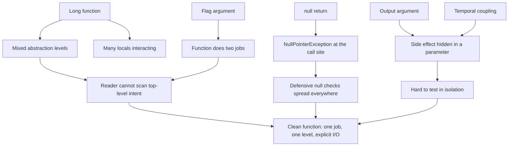

# Functions — Practice Tasks

> Twelve refactoring drills that turn the rules from the [chapter README](../README.md) into muscle memory. Each task gives you a scenario, a function that violates one clean-function principle, and a precise instruction. Work the refactor yourself first; the collapsible solution shows the cleaned code **and** the reasoning behind every move. Languages alternate between Go, Java, and Python on purpose — the principles are language-independent; the idioms are not.

---

## Table of Contents

1. [Extract a long function into named steps](#task-1--extract-a-long-function-go--easy) (Go, easy)
2. [Remove a flag argument by splitting the function](#task-2--remove-a-flag-argument-java--easy) (Java, easy)
3. [Replace an output argument with a return value](#task-3--replace-an-output-argument-with-a-return-value-python--easy) (Python, easy)
4. [Eliminate temporal coupling](#task-4--eliminate-temporal-coupling-java--medium) (Java, medium)
5. [Lift mixed levels of abstraction](#task-5--lift-mixed-levels-of-abstraction-python--medium) (Python, medium)
6. [Replace a null return with an empty collection](#task-6--replace-a-null-return-with-an-empty-collection-go--medium) (Go, medium)
7. [Replace a null return with Optional](#task-7--replace-a-null-return-with-optional-java--medium) (Java, medium)
8. [Introduce a parameter object](#task-8--introduce-a-parameter-object-python--medium) (Python, medium)
9. [Separate command from query](#task-9--separate-command-from-query-java--medium) (Java, medium)
10. [Make a hidden side effect explicit and isolated](#task-10--make-a-hidden-side-effect-explicit-and-isolated-go--hard) (Go, hard)
11. [Replace a boolean-returning failure path with a Result type](#task-11--replace-a-boolean-failure-path-with-a-result-type-go--hard) (Go, hard)
12. [Full audit: many smells at once](#task-12--full-function-audit-python--hard) (Python, hard)

---

## How to Use

1. **Read the smelly code and the instruction.** Name the principle being violated out loud before you touch anything — naming the smell is half the skill.
2. **Refactor on paper or in an editor first.** Do not peek. The point is to train the move, not to read a solution.
3. **Open the solution.** Compare structure, not character-for-character text. If your version reads as cleanly and preserves behaviour, you passed.
4. **Read the reasoning.** Every solution explains *why* the move helps — that "why" is what transfers to your own code.
5. **Re-run the behaviour in your head.** Clean refactoring never changes observable behaviour. If outputs could differ, it is a rewrite, not a refactor.

The dependency between the smells is roughly:



---

## Task 1 — Extract a long function (Go, easy)

**Scenario:** A signup handler grew over six months. The top-level function is 40 lines and reads as one undifferentiated wall. A new engineer cannot tell where validation ends and persistence begins.

**Instruction:** Extract the implicit phases into named functions so the top-level function reads as a table of contents. Keep behaviour identical.

```go
func RegisterUser(db *sql.DB, form SignupForm) (*User, error) {
	// validate
	if form.Email == "" {
		return nil, errors.New("email required")
	}
	if !strings.Contains(form.Email, "@") {
		return nil, errors.New("email invalid")
	}
	if len(form.Password) < 8 {
		return nil, errors.New("password too short")
	}

	// normalize
	email := strings.ToLower(strings.TrimSpace(form.Email))
	name := strings.TrimSpace(form.Name)
	if name == "" {
		name = strings.Split(email, "@")[0]
	}

	// hash password
	hash, err := bcrypt.GenerateFromPassword([]byte(form.Password), bcrypt.DefaultCost)
	if err != nil {
		return nil, fmt.Errorf("hashing password: %w", err)
	}

	// persist
	user := &User{Email: email, Name: name, PasswordHash: string(hash)}
	res, err := db.Exec(
		"INSERT INTO users (email, name, password_hash) VALUES (?, ?, ?)",
		user.Email, user.Name, user.PasswordHash,
	)
	if err != nil {
		return nil, fmt.Errorf("inserting user: %w", err)
	}
	id, _ := res.LastInsertId()
	user.ID = id
	return user, nil
}
```

<details>
<summary>Solution</summary>

```go
func RegisterUser(db *sql.DB, form SignupForm) (*User, error) {
	if err := validateSignup(form); err != nil {
		return nil, err
	}
	user, err := buildUser(form)
	if err != nil {
		return nil, err
	}
	if err := insertUser(db, user); err != nil {
		return nil, err
	}
	return user, nil
}

func validateSignup(form SignupForm) error {
	switch {
	case form.Email == "":
		return errors.New("email required")
	case !strings.Contains(form.Email, "@"):
		return errors.New("email invalid")
	case len(form.Password) < 8:
		return errors.New("password too short")
	default:
		return nil
	}
}

func buildUser(form SignupForm) (*User, error) {
	email := strings.ToLower(strings.TrimSpace(form.Email))
	name := strings.TrimSpace(form.Name)
	if name == "" {
		name = strings.Split(email, "@")[0]
	}
	hash, err := bcrypt.GenerateFromPassword([]byte(form.Password), bcrypt.DefaultCost)
	if err != nil {
		return nil, fmt.Errorf("hashing password: %w", err)
	}
	return &User{Email: email, Name: name, PasswordHash: string(hash)}, nil
}

func insertUser(db *sql.DB, user *User) error {
	res, err := db.Exec(
		"INSERT INTO users (email, name, password_hash) VALUES (?, ?, ?)",
		user.Email, user.Name, user.PasswordHash,
	)
	if err != nil {
		return fmt.Errorf("inserting user: %w", err)
	}
	id, _ := res.LastInsertId()
	user.ID = id
	return nil
}
```

**Reasoning.** The `// validate`, `// normalize`, `// hash`, `// persist` comments were a confession: the function had four jobs and the author knew it. Each comment block becomes a function whose name replaces the comment. The top-level `RegisterUser` now reads as a four-step recipe — anyone can grasp the flow in five seconds without parsing the body. Behaviour is identical because we only moved code, not logic. Note that `validateSignup` collapsed an if-ladder into a `switch true`, which signals "these are mutually exclusive checks against one input" more clearly than four `if`s that each `return`.

</details>

---

## Task 2 — Remove a flag argument (Java, easy)

**Scenario:** Reviewers keep stumbling on `notify(user, true)` and `notify(user, false)` in pull requests. Nobody can recall what `true` means without opening the method.

**Instruction:** A boolean parameter that selects between two behaviours means the function is really two functions wearing a trench coat. Split it.

```java
class Notifier {
    void notify(User user, boolean urgent) {
        Message message = buildMessage(user);
        if (urgent) {
            message.setChannel(Channel.SMS);
            message.setPriority(Priority.HIGH);
            smsGateway.send(message);
        } else {
            message.setChannel(Channel.EMAIL);
            message.setPriority(Priority.NORMAL);
            emailGateway.send(message);
        }
    }
}

// Call sites:
// notifier.notify(user, true);
// notifier.notify(user, false);
```

<details>
<summary>Solution</summary>

```java
class Notifier {
    void notifyUrgent(User user) {
        Message message = buildMessage(user);
        message.setChannel(Channel.SMS);
        message.setPriority(Priority.HIGH);
        smsGateway.send(message);
    }

    void notifyRoutine(User user) {
        Message message = buildMessage(user);
        message.setChannel(Channel.EMAIL);
        message.setPriority(Priority.NORMAL);
        emailGateway.send(message);
    }
}

// Call sites — now self-documenting:
// notifier.notifyUrgent(user);
// notifier.notifyRoutine(user);
```

**Reasoning.** A flag argument forces every reader to mentally execute the `if (urgent)` branch to understand a call. `notify(user, true)` carries zero meaning at the call site; `notifyUrgent(user)` carries all of it. The boolean was a switch that chose between two non-overlapping code paths — the textbook sign that two functions are hiding inside one. After the split, each method does exactly one thing, the channel/priority pairs are no longer interleaved, and there is no branching at all. The shared `buildMessage(user)` setup stays factored out, so the split costs no duplication of real logic. If a third notification mode appears later, you add a method instead of growing a parameter into an enum that still needs an internal `switch`.

</details>

---

## Task 3 — Replace an output argument with a return value (Python, easy)

**Scenario:** A function mutates a list passed in by the caller and returns `None`. Call sites read `enrich(results)` and then keep using `results`, which silently changed. New readers assume `enrich` is a no-op because they ignore its (nonexistent) return.

**Instruction:** Output arguments hide the function's real effect. Make the function take an input and return a fresh value instead.

```python
def enrich(records):
    for record in records:
        record["full_name"] = f"{record['first']} {record['last']}"
        record["initials"] = record["first"][0] + record["last"][0]
    # mutates the caller's list; returns None

# Call site:
# rows = load_rows()
# enrich(rows)          # easy to misread as having no effect
# render(rows)
```

<details>
<summary>Solution</summary>

```python
from dataclasses import dataclass, replace

@dataclass(frozen=True)
class Record:
    first: str
    last: str
    full_name: str = ""
    initials: str = ""

def enrich(record: Record) -> Record:
    return replace(
        record,
        full_name=f"{record.first} {record.last}",
        initials=record.first[0] + record.last[0],
    )

# Call site — the data flow is now visible:
# rows = load_rows()
# enriched = [enrich(r) for r in rows]
# render(enriched)
```

If the codebase is dictionary-based and you cannot introduce a type yet, the minimal fix is still a return:

```python
def enrich(record: dict) -> dict:
    return {
        **record,
        "full_name": f"{record['first']} {record['last']}",
        "initials": record["first"][0] + record["last"][0],
    }

# enriched = [enrich(r) for r in rows]
```

**Reasoning.** "Things happen *to* arguments" is harder to reason about than "the function takes an input and produces an output." The original `enrich` had an invisible contract: it edited the list you handed it. The reader of `enrich(rows)` has no signal that `rows` is now different — the call looks dead. Returning a new value makes the data flow explicit (`enriched = enrich(...)`), removes the aliasing hazard where two variables point at the same mutated list, and as a bonus makes the function pure and trivially testable. Frozen dataclasses with `replace` push this all the way: the input is provably untouched.

</details>

---

## Task 4 — Eliminate temporal coupling (Java, medium)

**Scenario:** A `ReportBuilder` requires callers to invoke `open()`, then `addSection()` any number of times, then `close()` — in that exact order. Forgetting `open()` throws an NPE three calls later; forgetting `close()` silently writes a truncated file. The ordering rule lives only in a Confluence page.

**Instruction:** The class lets you call methods in an order that is invalid. Redesign the API so the correct sequence is the *only* sequence the type system allows.

```java
class ReportBuilder {
    private Writer writer;       // null until open()
    private boolean closed;

    void open(String path) throws IOException {
        this.writer = new FileWriter(path);
        writer.write("<report>");
    }

    void addSection(String title, String body) throws IOException {
        writer.write("<section><h>" + title + "</h>" + body + "</section>");
    }

    void close() throws IOException {
        writer.write("</report>");
        writer.close();
        closed = true;
    }
}

// Required call order — enforced only by hope:
// b.open("out.xml");
// b.addSection("Intro", "...");
// b.close();
```

<details>
<summary>Solution</summary>

```java
class Report {
    private final List<Section> sections;

    private Report(List<Section> sections) {
        this.sections = sections;
    }

    // Construction collects everything first; nothing is half-built.
    static Report of(Section... sections) {
        return new Report(List.of(sections));
    }

    // A single call does the whole open -> write -> close lifecycle.
    void writeTo(Path path) throws IOException {
        try (Writer writer = Files.newBufferedWriter(path)) {
            writer.write("<report>");
            for (Section s : sections) {
                writer.write("<section><h>" + s.title() + "</h>" + s.body() + "</section>");
            }
            writer.write("</report>");
        }
    }
}

record Section(String title, String body) {}

// Usage — impossible to call out of order, impossible to forget close():
// Report.of(
//     new Section("Intro", "..."),
//     new Section("Results", "...")
// ).writeTo(Path.of("out.xml"));
```

**Reasoning.** Temporal coupling is when method A *must* run before method B but nothing enforces it. The original design exposed three public methods whose only valid permutation was `open → addSection* → close`; every other permutation was a latent bug. The fix removes the sequencing problem by removing the sequence: gather all sections up front (in the constructor / factory), then perform the entire `open → write → close` lifecycle inside one method that owns the resource via try-with-resources. There is no way to "forget `close()`" because the caller never opens anything, and no way to "call `addSection` before `open`" because those steps no longer exist as separate public calls. When a multi-step protocol is genuinely required, the alternative is a builder that returns a *different type* at each stage (a "type-state" builder) so that, e.g., `addSection` is only reachable on the value returned by `open`.

</details>

---

## Task 5 — Lift mixed levels of abstraction (Python, medium)

**Scenario:** A `checkout` function alternates between high-level business intent ("apply loyalty discount") and low-level mechanics (string formatting, dictionary key juggling, byte writing). Reading it feels like a plane that keeps changing altitude.

**Instruction:** Apply the Single Level of Abstraction Principle: every statement in a function should sit at the same conceptual level. Push the mechanics down into helpers so the top function tells the story.

```python
def checkout(cart, customer):
    total = 0
    for item in cart["items"]:
        total += item["price"] * item["qty"]

    if customer["tier"] == "gold":
        total = total - (total * 0.1)

    # write receipt bytes to disk
    lines = []
    lines.append("RECEIPT".center(32))
    lines.append("-" * 32)
    for item in cart["items"]:
        name = item["name"][:20].ljust(20)
        amount = f"${item['price'] * item['qty']:.2f}".rjust(11)
        lines.append(name + amount)
    lines.append("-" * 32)
    lines.append("TOTAL".ljust(20) + f"${total:.2f}".rjust(11))
    with open(f"receipts/{cart['id']}.txt", "wb") as f:
        f.write("\n".join(lines).encode("utf-8"))

    return total
```

<details>
<summary>Solution</summary>

```python
def checkout(cart, customer):
    subtotal = compute_subtotal(cart)
    total = apply_loyalty_discount(subtotal, customer)
    write_receipt(cart, total)
    return total


def compute_subtotal(cart):
    return sum(item["price"] * item["qty"] for item in cart["items"])


def apply_loyalty_discount(subtotal, customer):
    if customer["tier"] == "gold":
        return subtotal * 0.9
    return subtotal


def write_receipt(cart, total):
    text = render_receipt(cart, total)
    path = f"receipts/{cart['id']}.txt"
    with open(path, "wb") as f:
        f.write(text.encode("utf-8"))


def render_receipt(cart, total):
    lines = ["RECEIPT".center(32), "-" * 32]
    lines += [render_line(item) for item in cart["items"]]
    lines += ["-" * 32, "TOTAL".ljust(20) + money(total).rjust(11)]
    return "\n".join(lines)


def render_line(item):
    name = item["name"][:20].ljust(20)
    return name + money(item["price"] * item["qty"]).rjust(11)


def money(value):
    return f"${value:.2f}"
```

**Reasoning.** The original `checkout` mixed three altitudes: business policy (loyalty discount), domain arithmetic (subtotal), and presentation/IO mechanics (`ljust`, `rjust`, byte encoding, file paths). When abstraction levels are interleaved, the reader has to constantly recalibrate, and you cannot scan the function for *what it does* without also absorbing *how it does it*. After the refactor, `checkout` contains only verbs at one level: compute, apply discount, write. Each lower-level concern lives in a helper named for its intent, and the formatting details (`money`, `render_line`) sink to the bottom where they belong. A useful heuristic: a clean function should be readable as a paragraph of prose at a single level — if one line says "charge the customer" and the next says "increment a byte offset," you have an altitude problem.

</details>

---

## Task 6 — Replace a null return with an empty collection (Go, medium)

**Scenario:** `FindOverdueInvoices` returns `nil` when there are no overdue invoices. Half the call sites forget to nil-check before ranging — which happens to be safe in Go for `range`, but the same pattern returns `nil` maps elsewhere and panics on write. The team wants one consistent rule: collection-returning functions never return nil.

**Instruction:** Make the function return an empty (non-nil) slice in the "nothing found" case, so callers can use the result unconditionally.

```go
func FindOverdueInvoices(invoices []Invoice, now time.Time) []Invoice {
	var overdue []Invoice
	for _, inv := range invoices {
		if inv.DueDate.Before(now) && !inv.Paid {
			overdue = append(overdue, inv)
		}
	}
	if len(overdue) == 0 {
		return nil // forces callers to wonder: nil or empty?
	}
	return overdue
}

// Call site that breaks the team's rule:
// result := FindOverdueInvoices(all, now)
// if result == nil {            // defensive noise repeated everywhere
//     return
// }
// for _, inv := range result { ... }
```

<details>
<summary>Solution</summary>

```go
func FindOverdueInvoices(invoices []Invoice, now time.Time) []Invoice {
	overdue := make([]Invoice, 0, len(invoices)) // non-nil, right-sized
	for _, inv := range invoices {
		if inv.DueDate.Before(now) && !inv.Paid {
			overdue = append(overdue, inv)
		}
	}
	return overdue
}

// Call site — no nil check, no special case:
// for _, inv := range FindOverdueInvoices(all, now) {
//     remind(inv)
// }
```

**Reasoning.** "No results" is not an error and not a special case — it is the empty set, and the empty set is a perfectly good value. Returning `nil` forces every caller to answer a question the function should have answered: *is this nil or empty, and do I have to guard?* By initialising with `make([]T, 0, ...)` and removing the `len == 0` branch, the function always returns a usable slice. Callers drop their nil checks; the code that handles "zero overdue invoices" and "five overdue invoices" becomes the same code. This is the collection-typed cousin of the broader rule "don't return null" — for a slice or map or list, the null-object is simply the empty one. (The pre-sized `cap` is a small bonus that avoids reallocations during `append`.)

</details>

---

## Task 7 — Replace a null return with Optional (Java, medium)

**Scenario:** `findByEmail` returns `null` when no user matches. A NullPointerException in production traced back to a caller that chained `findByEmail(email).getName()` without checking. The author's intent — "this might not find anything" — was invisible in the signature.

**Instruction:** A reference result that can legitimately be absent should say so in its type. Replace the nullable return with `Optional<User>` and update a representative call site to use it idiomatically.

```java
class UserRepository {
    User findByEmail(String email) {
        for (User u : users) {
            if (u.getEmail().equals(email)) {
                return u;
            }
        }
        return null; // signature lies: it claims to always return a User
    }
}

// Call site that exploded:
// String name = repo.findByEmail(email).getName(); // NPE when absent
```

<details>
<summary>Solution</summary>

```java
import java.util.Optional;

class UserRepository {
    Optional<User> findByEmail(String email) {
        return users.stream()
            .filter(u -> u.getEmail().equals(email))
            .findFirst();
    }
}

// Call sites must now acknowledge absence — the compiler enforces it:

// Provide a default:
// String name = repo.findByEmail(email)
//     .map(User::getName)
//     .orElse("Unknown");

// Or branch explicitly:
// repo.findByEmail(email).ifPresentOrElse(
//     this::sendWelcomeBack,
//     () -> log.warn("No user for {}", email)
// );

// Or escalate to an error when absence is genuinely exceptional:
// User user = repo.findByEmail(email)
//     .orElseThrow(() -> new UserNotFoundException(email));
```

**Reasoning.** `User findByEmail(...)` promises a `User` and then breaks that promise with `null`. The type system is supposed to document contracts; a nullable return turns it into a liar and pushes the "might be absent" knowledge into the reader's memory, where it gets forgotten exactly once before a 2 a.m. page. `Optional<User>` moves "maybe absent" into the signature where the compiler can police it: you cannot call `.getName()` on an `Optional`, so the chained-NPE bug becomes impossible to write. The three call-site forms above show the spectrum — supply a default, branch on presence, or convert to an exception when absence really is exceptional. The key shift is that *the function's signature now tells the truth about its result.* (Note: use `Optional` for return values, not fields or parameters — that is its designed niche.)

</details>

---

## Task 8 — Introduce a parameter object (Python, medium)

**Scenario:** A reporting function takes nine positional parameters. Call sites are unreadable (`build_report(d1, d2, True, False, None, "csv", 50, True, tz)`), and the same `(start, end)` date pair travels together through five other functions — a data clump.

**Instruction:** Group the parameters that belong together into cohesive objects. Identify the data clump first, then bundle the remaining options.

```python
def build_report(
    start_date,
    end_date,
    include_refunds,
    include_pending,
    customer_id,
    output_format,
    page_size,
    send_email,
    timezone,
):
    ...

# Call site:
# build_report(d1, d2, True, False, None, "csv", 50, True, "UTC")
```

<details>
<summary>Solution</summary>

```python
from dataclasses import dataclass
from datetime import date
from enum import Enum
from typing import Optional


class OutputFormat(Enum):
    CSV = "csv"
    PDF = "pdf"
    JSON = "json"


@dataclass(frozen=True)
class DateRange:
    start: date
    end: date

    def __post_init__(self):
        if self.end < self.start:
            raise ValueError("end date precedes start date")


@dataclass(frozen=True)
class ReportFilters:
    include_refunds: bool = False
    include_pending: bool = False
    customer_id: Optional[str] = None


@dataclass(frozen=True)
class ReportOptions:
    output_format: OutputFormat = OutputFormat.CSV
    page_size: int = 50
    send_email: bool = False
    timezone: str = "UTC"


def build_report(
    period: DateRange,
    filters: ReportFilters = ReportFilters(),
    options: ReportOptions = ReportOptions(),
):
    ...

# Call site — self-documenting and order-independent:
# build_report(
#     period=DateRange(d1, d2),
#     filters=ReportFilters(include_refunds=True),
#     options=ReportOptions(output_format=OutputFormat.CSV, send_email=True),
# )
```

**Reasoning.** Nine positional parameters force the reader to count commas and remember an arbitrary order; `True, False, None` at a call site is pure noise. The first win is spotting the **data clump**: `start_date` and `end_date` always travel together and have an invariant (`end >= start`), so they become a `DateRange` that can validate itself and host date helpers later. The remaining parameters split by cohesion — *what data to include* (`ReportFilters`) versus *how to deliver it* (`ReportOptions`). The grouped version is order-independent at the call site, gives every option a sensible default, replaces the stringly-typed `output_format` with an enum, and centralises the date invariant. A good test for whether a parameter object is justified: if the same group of parameters appears in more than one signature, it is a clump and wants its own type.

</details>

---

## Task 9 — Separate command from query (Java, medium)

**Scenario:** `pop()` both mutates the stack (removes the top) and returns a value. Worse, `tryReserve()` returns a boolean *and* performs the reservation, so a caller that logs `if (reserve(seat))` accidentally double-books when the log line is evaluated twice during debugging. The team wants to honour Command-Query Separation: a method either does something or answers something, never both.

**Instruction:** Split the offending method so that querying has no side effects and commanding returns nothing observable beyond success/failure where unavoidable.

```java
class SeatMap {
    private final Set<Seat> reserved = new HashSet<>();

    // Command AND query tangled together:
    boolean reserve(Seat seat) {
        if (reserved.contains(seat)) {
            return false;          // query: was it available?
        }
        reserved.add(seat);        // command: reserve it
        return true;
    }
}

// Dangerous call site:
// if (reserve(seat)) { ... }    // calling it again to "check" re-reserves
```

<details>
<summary>Solution</summary>

```java
class SeatMap {
    private final Set<Seat> reserved = new HashSet<>();

    // Query: pure, idempotent, side-effect free.
    boolean isAvailable(Seat seat) {
        return !reserved.contains(seat);
    }

    // Command: performs the mutation, returns nothing.
    // Guards its own precondition so it cannot silently corrupt state.
    void reserve(Seat seat) {
        if (reserved.contains(seat)) {
            throw new SeatAlreadyReservedException(seat);
        }
        reserved.add(seat);
    }
}

// Call site — query first, then command, each doing exactly one thing:
// if (seatMap.isAvailable(seat)) {
//     seatMap.reserve(seat);
// }
```

**Reasoning.** Command-Query Separation says asking a question should never change the answer. The original `reserve` was both a question ("is the seat free?") and a command ("take it"), so the method could not be called twice safely, could not be used in a log line, and made the call site ambiguous about intent. Splitting it yields `isAvailable` (a pure query you can call freely, in assertions, in logs, in tests) and `reserve` (a command that mutates and returns void). The command guards its precondition with an exception rather than a boolean so that misuse fails loudly instead of returning `false` that a caller might ignore. When concurrency is in play, the "check then act" at the call site needs a lock or an atomic compare-and-set — but that is a separate concern, and CQS makes the race *visible* rather than burying it inside one overloaded method.

</details>

---

## Task 10 — Make a hidden side effect explicit and isolated (Go, hard)

**Scenario:** `ValidatePassword` looks like a pure predicate — it takes a user and a password and returns whether they match. But buried inside, it also initialises the user's session, mutates a package-level cache, and writes an audit log. A teammate called it inside a read-only health check and accidentally created thousands of sessions.

**Instruction:** A function's name promises "validate"; its body does four things, three of them surprising. Separate the pure decision from the side effects, and make the effects explicit at the call site.

```go
var sessionCache = map[string]*Session{} // package-level mutable state

func ValidatePassword(u *User, password string) bool {
	if bcrypt.CompareHashAndPassword([]byte(u.PasswordHash), []byte(password)) != nil {
		return false
	}
	// surprise #1: creates a session as a side effect
	session := newSession(u.ID)
	// surprise #2: mutates global cache
	sessionCache[session.ID] = session
	// surprise #3: writes to the audit log
	auditLog.Write("login", u.ID, time.Now())
	u.LastLogin = time.Now() // surprise #4: mutates the argument
	return true
}
```

<details>
<summary>Solution</summary>

```go
// Pure decision: no mutation, no I/O, trivially testable.
func PasswordMatches(u *User, password string) bool {
	return bcrypt.CompareHashAndPassword([]byte(u.PasswordHash), []byte(password)) == nil
}

// The effectful operation is now named for what it actually does,
// and its dependencies are explicit parameters rather than globals.
func (s *AuthService) Login(u *User, password string) (*Session, error) {
	if !PasswordMatches(u, password) {
		return nil, ErrInvalidCredentials
	}
	session := newSession(u.ID)
	s.sessions.Put(session)          // injected store, not a global map
	s.audit.Record("login", u.ID, s.clock.Now())
	u.LastLogin = s.clock.Now()
	return session, nil
}

// Call sites can now choose their intent:
//   PasswordMatches(u, pw)        // check only, zero side effects
//   authService.Login(u, pw)      // check AND establish a session, explicitly
```

**Reasoning.** The original function violated the principle that a name is a contract: `ValidatePassword` advertises a pure boolean check, but its body started sessions, mutated global state, wrote logs, and edited the argument. Anyone reading a call to it would reasonably assume it was safe to invoke anywhere — and be wrong. The refactor draws a hard line between *deciding* and *acting*. `PasswordMatches` is a pure function: same inputs, same output, no observable effect, so it can be used freely in a health check, a test, or an assertion. `Login` keeps the effects but (a) names itself honestly, (b) returns the `Session` it creates instead of stashing it in a hidden global, and (c) receives its collaborators (`sessions`, `audit`, `clock`) as injected dependencies rather than reaching for package-level state. Now the effects are *explicit* (you see them in the return type and the receiver's fields) and *isolated* (concentrated in one method whose name warns you). Pushing side effects to the edges and keeping the core pure is the single highest-leverage habit for testability.

</details>

---

## Task 11 — Replace a boolean failure path with a Result type (Go, hard)

**Scenario:** `ParseConfig` returns `(Config, bool)` where the bool means "did it work." When it returns `false`, the caller has no idea *why* — was the file missing, the YAML malformed, or a required key absent? Errors are swallowed into a single bit, and call sites print a useless "config failed" message.

**Instruction:** Replace the success-boolean with an explicit error result so failures carry meaning. Then show the idiomatic call site. (This is the "don't collapse failure into a boolean" sibling of "don't return null.")

```go
func ParseConfig(path string) (Config, bool) {
	data, err := os.ReadFile(path)
	if err != nil {
		return Config{}, false // why? lost.
	}
	var cfg Config
	if err := yaml.Unmarshal(data, &cfg); err != nil {
		return Config{}, false // why? lost.
	}
	if cfg.Port == 0 {
		return Config{}, false // why? lost.
	}
	return cfg, true
}

// Call site:
// cfg, ok := ParseConfig("app.yaml")
// if !ok {
//     log.Fatal("config failed") // useless diagnostic
// }
```

<details>
<summary>Solution</summary>

```go
func ParseConfig(path string) (Config, error) {
	data, err := os.ReadFile(path)
	if err != nil {
		return Config{}, fmt.Errorf("reading config %q: %w", path, err)
	}

	var cfg Config
	if err := yaml.Unmarshal(data, &cfg); err != nil {
		return Config{}, fmt.Errorf("parsing config %q: %w", path, err)
	}

	if err := cfg.validate(); err != nil {
		return Config{}, fmt.Errorf("invalid config %q: %w", path, err)
	}

	return cfg, nil
}

func (c Config) validate() error {
	if c.Port == 0 {
		return errors.New("port is required")
	}
	if c.Port < 0 || c.Port > 65535 {
		return fmt.Errorf("port out of range: %d", c.Port)
	}
	return nil
}

// Call site — the failure now explains itself, and errors compose:
// cfg, err := ParseConfig("app.yaml")
// if err != nil {
//     log.Fatalf("startup: %v", err)
//     // -> startup: invalid config "app.yaml": port is required
// }
```

**Reasoning.** A boolean return collapses every distinct failure mode into a single undifferentiated bit, then deletes the information the caller needs to react or even to log usefully. The `(Config, error)` shape — Go's idiom for a fallible operation — preserves *which* failure occurred. Wrapping with `%w` builds a chain (`startup: invalid config "app.yaml": port is required`) so the message reads from the caller's context down to the root cause, and `errors.Is` / `errors.As` still let callers branch on specific causes. Extracting `validate()` keeps `ParseConfig` at one abstraction level (read, parse, validate) and gives the missing-key and out-of-range checks a home. The general principle: a function should report failure in a form that carries enough information for the caller to handle it — a bare `false` (like a bare `null`) almost never does.

</details>

---

## Task 12 — Full function audit (Python, hard)

**Scenario:** Below is one function carrying nearly every smell in this chapter at once. This is the boss level: you must name each violation and produce a clean rewrite.

**Instruction:** First, list every clean-function principle this code violates. Then rewrite it. The function is supposed to "process an order": it currently validates, mutates its arguments, talks to two services, mixes abstraction levels, hides side effects, uses a flag argument, and returns `None` on failure.

```python
def process(order, cart, send_confirmation, results):
    # validate
    if not order:
        return None
    if not cart["items"]:
        return None

    # compute total inline (low-level, mixed with policy)
    total = 0
    for i in cart["items"]:
        line = i["price"] * i["qty"]
        if i.get("category") == "book":
            line = line * 0.95
        total += line
    if order["tier"] == "gold":
        total = total * 0.9

    # hidden side effect: mutates the argument
    order["total"] = total
    order["status"] = "PROCESSED"

    # flag argument controls a whole branch
    if send_confirmation:
        email_service.send(order["email"], f"Your total is ${total:.2f}")

    # output argument: stuffs into caller's list, returns None
    results.append({"order_id": order["id"], "total": total})
    payment_gateway.charge(order["email"], total)  # another hidden effect
    return None
```

<details>
<summary>Solution</summary>

**The violations, named:**

| Principle violated | Where | Symptom |
|---|---|---|
| Returning `null`/`None` for failure | `return None` (×3) | Caller cannot tell success from failure; no reason given. |
| Output argument | `results.append(...)` | Function mutates a list it was handed instead of returning. |
| Hidden side effects | `order["total"] = ...`, `order["status"] = ...` | Mutates its argument invisibly. |
| Hidden side effects (I/O) | `email_service.send`, `payment_gateway.charge` | A "process" function silently sends email and charges money. |
| Flag argument | `send_confirmation` | Boolean selects between two behaviours. |
| Mixed abstraction levels | total loop next to business policy | Low-level arithmetic interleaved with discount policy. |
| Command/query confusion | function both computes (query) and charges (command) | One function decides *and* acts. |
| Doing more than one thing | the whole function | Validate + price + persist + notify + charge + collect. |

**The clean rewrite:**

```python
from dataclasses import dataclass
from decimal import Decimal
from typing import Iterable


class OrderError(Exception):
    """Raised when an order cannot be processed."""


@dataclass(frozen=True)
class LineItem:
    price: Decimal
    qty: int
    category: str = ""


@dataclass(frozen=True)
class Cart:
    items: list[LineItem]


@dataclass(frozen=True)
class PricedOrder:
    order_id: str
    total: Decimal


# --- Pure pricing core: no I/O, no mutation, trivially testable ---

def price_cart(cart: Cart, tier: str) -> Decimal:
    subtotal = sum(_line_total(item) for item in cart.items)
    return _apply_tier_discount(subtotal, tier)


def _line_total(item: LineItem) -> Decimal:
    total = item.price * item.qty
    return total * Decimal("0.95") if item.category == "book" else total


def _apply_tier_discount(subtotal: Decimal, tier: str) -> Decimal:
    return subtotal * Decimal("0.9") if tier == "gold" else subtotal


def validate(order: dict, cart: Cart) -> None:
    if not order:
        raise OrderError("order is missing")
    if not cart.items:
        raise OrderError("cart has no items")


# --- Effectful orchestration: each effect explicit, named, and isolated ---

class OrderProcessor:
    def __init__(self, payments, emails):
        self.payments = payments
        self.emails = emails

    def process(self, order: dict, cart: Cart) -> PricedOrder:
        validate(order, cart)
        total = price_cart(cart, order["tier"])
        self.payments.charge(order["email"], total)
        return PricedOrder(order_id=order["id"], total=total)

    def confirm(self, order: dict, priced: PricedOrder) -> None:
        self.emails.send(order["email"], f"Your total is ${priced.total:.2f}")


# --- Call site: flag gone, return value real, effects visible ---
# processor = OrderProcessor(payment_gateway, email_service)
# priced = processor.process(order, cart)       # returns a value or raises
# results.append(priced)                         # caller owns its own list
# if should_confirm:
#     processor.confirm(order, priced)           # separate, explicit step
```

**Reasoning.** Every fix maps to one principle:

- **`None` → exception / value.** Failure now raises `OrderError` with a reason; success returns a `PricedOrder`. The caller can no longer confuse the two, and the function's signature stops lying.
- **Output argument → return value.** `results.append` moves to the *caller*; `process` returns the priced order and lets the caller own its collection. Data flow is visible.
- **Hidden mutation → immutable result.** Instead of editing `order["total"]` in place, we return a frozen `PricedOrder`. No aliasing surprises.
- **Hidden I/O → explicit, isolated, injected.** Charging and emailing live in `OrderProcessor` methods with injected `payments`/`emails` collaborators, so they are testable and obviously effectful. The pure pricing core (`price_cart` and friends) has zero I/O.
- **Flag argument → split call.** `send_confirmation` is gone; confirmation is a separate `confirm` method the caller invokes when it wants to. The decision lives at the call site, where the context is.
- **Mixed levels → single level per function.** `process` reads as validate → price → charge → return; the arithmetic and discount policy sink into named helpers.
- **Command/query → separated.** Pure queries (`price_cart`) are split from commands (`charge`, `confirm`).

The shape of the result is the lesson: a thin effectful shell (`OrderProcessor`) wrapping a pure functional core (`price_cart`). That is the structure clean functions naturally converge toward.

</details>

---

## Self-Assessment

Rate yourself honestly on each. If you cannot do a row from memory, redo the matching task.

| # | Skill | Can you do it without looking? |
|---|---|---|
| 1 | Extract a long function so the top level reads as named steps | ☐ |
| 2 | Spot a flag argument and split it into two named functions | ☐ |
| 3 | Convert an output-argument mutation into a return value | ☐ |
| 4 | Redesign an API so an invalid call order becomes impossible | ☐ |
| 5 | Recognise mixed abstraction levels and lift the mechanics down | ☐ |
| 6 | Return an empty collection instead of nil/null | ☐ |
| 7 | Replace a nullable reference return with Optional and use it idiomatically | ☐ |
| 8 | Identify a data clump and introduce a parameter object | ☐ |
| 9 | Separate a command from a query (CQS) | ☐ |
| 10 | Make a hidden side effect explicit and push it to the edge | ☐ |
| 11 | Replace a boolean failure flag with a Result/error that carries meaning | ☐ |
| 12 | Audit a function for every smell at once and rewrite it clean | ☐ |

**Scoring.** 10–12 confident: you have internalised clean-function design — apply it in code review. 6–9: solid foundation; drill the rows you missed. Below 6: re-read the [chapter README](../README.md), then redo every task in order.

---

## Related Topics

- [Functions — chapter README](README.md) — the positive rules these tasks invert.
- [junior.md](junior.md) — beginner-level definitions of each anti-pattern.
- [find-bug.md](find-bug.md) — buggy snippets where function smells hide a real defect.
- [optimize.md](optimize.md) — performance-flavoured function refactors.
- [Meaningful Names](../01-meaningful-names/README.md) — clean functions start with names that reveal intent.
- [Error Handling](../06-error-handling/README.md) — the home of the "don't return null / collapse errors into a bool" rules (Tasks 6, 7, 11).
- [Refactoring — Code Smells](../../refactoring/README.md) — Long Method, Long Parameter List, and friends, catalogued and cross-referenced.
- [Functional Programming](../../functional-programming/README.md) — pure core / effectful shell (Tasks 10, 12) taken to its logical end.

---

> **Next:** Apply these moves to your own codebase. Open the last function you wrote, run it against the [Self-Assessment](#self-assessment) checklist, and refactor the first violation you find. The cheapest time to clean a function is the moment you are already reading it.
