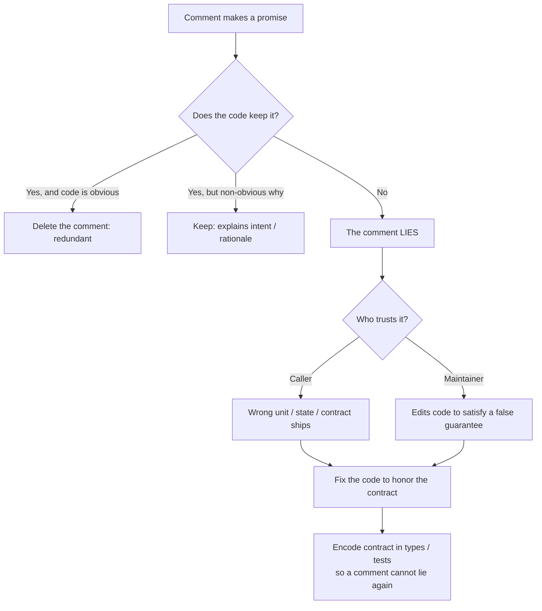
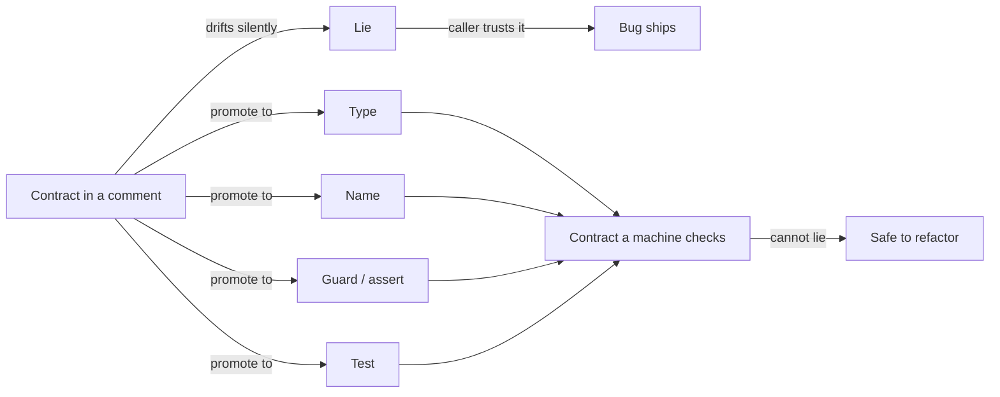

# Comments — Find the Bug

> 12 snippets where a **comment lies** and the code does something else. The reader trusts the comment, the compiler trusts the code, and the gap between them ships a real bug. Find the lie, then fix the truth.

---

## Table of Contents

1. [How to Use](#how-to-use)
2. [The Core Failure Mode](#the-core-failure-mode)
3. [Snippet 1 — "Returns seconds" but returns milliseconds (Go)](#snippet-1--returns-seconds-but-returns-milliseconds-go)
4. [Snippet 2 — "Thread-safe" on code that isn't (Java)](#snippet-2--thread-safe-on-code-that-isnt-java)
5. [Snippet 3 — Stale `@param` after a signature change (Java)](#snippet-3--stale-param-after-a-signature-change-java)
6. [Snippet 4 — Commented-out validation that was load-bearing (Python)](#snippet-4--commented-out-validation-that-was-load-bearing-python)
7. [Snippet 5 — `// TODO: handle null` that NPEs (Java)](#snippet-5--todo-handle-null-that-npes-java)
8. [Snippet 6 — Comment hides an off-by-one (Python)](#snippet-6--comment-hides-an-off-by-one-python)
9. [Snippet 7 — Doc promises an exception no longer thrown (Java)](#snippet-7--doc-promises-an-exception-no-longer-thrown-java)
10. [Snippet 8 — "Inclusive" range comment, exclusive code (Go)](#snippet-8--inclusive-range-comment-exclusive-code-go)
11. [Snippet 9 — "Idempotent" comment on a non-idempotent handler (Python)](#snippet-9--idempotent-comment-on-a-non-idempotent-handler-python)
12. [Snippet 10 — Comment claims a unit the constant contradicts (Go)](#snippet-10--comment-claims-a-unit-the-constant-contradicts-go)
13. [Snippet 11 — "Already validated upstream" lie (Java)](#snippet-11--already-validated-upstream-lie-java)
14. [Snippet 12 — "Sorted ascending" docstring, descending code (Python)](#snippet-12--sorted-ascending-docstring-descending-code-python)
15. [Snippet 13 — "Caller owns the lock" comment nobody reads (Go)](#snippet-13--caller-owns-the-lock-comment-nobody-reads-go)
16. [Scorecard](#scorecard)
17. [Related Topics](#related-topics)

---

## How to Use

Each snippet shows code where a comment makes a promise the code breaks. Read the comment first — exactly as a tired engineer at 2 a.m. would: trusting it. Then read the code. The bug lives in the gap.

1. Read the comment. Note what it promises (a unit, a guarantee, a contract).
2. Read the code. Decide what it actually does.
3. Predict what breaks when a caller trusts the comment instead of the code.
4. Open the answer. Confirm the comment-vs-reality mismatch and the fix.

The fix is rarely "edit the comment to match." A lying comment usually marks a place where the *contract itself* drifted. The right fix makes the code enforce the contract (types, asserts, tests) so a comment can never lie again — or deletes the comment because the code now says it.



---

## The Core Failure Mode

A comment is unverified prose sitting next to verified code. The compiler reads the code; the human reads the comment. When they disagree, the human is wrong — but the human is the one writing the next caller. Three ways the lie does damage:

- **Wrong unit / shape.** "Returns seconds" leads the caller to multiply by 1000 again.
- **False guarantee.** "Thread-safe" leads the caller to skip the lock; data races.
- **Phantom contract.** "Throws on invalid input" leads the caller to skip the null check; NPE.

Every snippet below is one of these three. The tell is always: *the comment is a claim no test backs up.*

---

## Snippet 1 — "Returns seconds" but returns milliseconds (Go)

**Difficulty:** Easy

```go
// SessionAge returns the age of the session in seconds.
func (s *Session) SessionAge() int64 {
	return time.Since(s.CreatedAt).Milliseconds()
}

// Caller: expire sessions older than 30 minutes.
const maxSessionSeconds = 30 * 60 // 1800

func (s *Session) IsExpired() bool {
	return s.SessionAge() > maxSessionSeconds
}
```

**What's wrong?**

<details><summary>Answer</summary>

The doc comment says **seconds**; the body returns `Milliseconds()`. The caller `IsExpired` trusts the comment and compares against `1800` (interpreted as seconds).

A session is "older than 1800" almost immediately — `1800 ms = 1.8 s`. So `IsExpired()` returns `true` after **1.8 seconds**, not 30 minutes. Every user is logged out within two seconds.

The comment was probably correct once; the body was changed from `.Seconds()` (which returns `float64`) to `.Milliseconds()` (which returns `int64`) to avoid a float, and nobody updated the prose. The signature `int64` even *looks* more correct for milliseconds, which hides it further.

**Fix — make the unit part of the name and the type, so the comment is unnecessary and a mismatch is unsayable:**

```go
func (s *Session) Age() time.Duration {
	return time.Since(s.CreatedAt)
}

const maxSessionAge = 30 * time.Minute

func (s *Session) IsExpired() bool {
	return s.Age() > maxSessionAge
}
```

`time.Duration` carries its own unit. There is no number to misread and no comment to lie. If you must return a raw integer, encode the unit in the name: `AgeMillis() int64`.
</details>

---

## Snippet 2 — "Thread-safe" on code that isn't (Java)

**Difficulty:** Medium

```java
/**
 * A thread-safe hit counter.
 * All methods may be called concurrently from any number of threads.
 */
public class HitCounter {
    private final Map<String, Long> hits = new HashMap<>();

    public void record(String key) {
        hits.merge(key, 1L, Long::sum);
    }

    public long count(String key) {
        return hits.getOrDefault(key, 0L);
    }
}
```

**What's wrong?**

<details><summary>Answer</summary>

The Javadoc declares the class **thread-safe** and explicitly invites concurrent calls. The implementation uses a plain `HashMap` with **no synchronization**. It is not thread-safe at all.

Two threads calling `record` concurrently can corrupt the `HashMap` internals: lost updates (both read the same count, both write `n+1`), and — historically — `HashMap` resize under concurrent writes could spin into an infinite loop pinning a CPU at 100%. The caller, reading "thread-safe, all methods may be called concurrently," shares one instance across a thread pool and skips any external lock. The corruption is intermittent and load-dependent, so it passes every test and fails in production under traffic.

The "thread-safe" claim is the most dangerous kind of lying comment: it actively instructs the caller to *remove* the safety they would otherwise have added.

**Fix — make the code actually honor the guarantee the comment makes:**

```java
/** A thread-safe hit counter. All methods may be called concurrently. */
public class HitCounter {
    private final ConcurrentHashMap<String, LongAdder> hits = new ConcurrentHashMap<>();

    public void record(String key) {
        hits.computeIfAbsent(key, k -> new LongAdder()).increment();
    }

    public long count(String key) {
        LongAdder adder = hits.get(key);
        return adder == null ? 0L : adder.sum();
    }
}
```

Now the comment is true. `ConcurrentHashMap` plus `LongAdder` make concurrent `record` correct and contention-friendly. If you ever *can't* make it thread-safe, the honest comment is the fix: `/** NOT thread-safe; callers must synchronize externally. */`
</details>

---

## Snippet 3 — Stale `@param` after a signature change (Java)

**Difficulty:** Medium

```java
/**
 * Charges a card.
 *
 * @param amountCents the amount to charge, in cents
 * @param currency    ISO-4217 currency code
 * @return the gateway transaction id
 */
public String charge(BigDecimal amountDollars, String currency) {
    // gateway API wants cents as an integer
    long cents = amountDollars.movePointRight(2).longValueExact();
    return gateway.submit(cents, currency);
}

// Caller, written from the Javadoc hover:
String txn = payments.charge(new BigDecimal("1999"), "USD"); // "amount in cents"
```

**What's wrong?**

<details><summary>Answer</summary>

The signature was changed from `amountCents` to `amountDollars` (the parameter is now dollars, and the body multiplies by 100 to get cents). But the `@param` line still says **"the amount to charge, in cents."**

A caller who reads the Javadoc — the canonical, IDE-surfaced source of truth — passes `1999` believing it means **$19.99 (1999 cents)**. The body computes `1999 → movePointRight(2) → 199900 cents = $1,999.00`. The customer is charged **100× too much**.

This is the classic doc-comment rot: the *prose* contract and the *code* contract diverged at a refactor. Javadoc is especially treacherous because IDEs show it on hover at the call site, so the lie is delivered exactly when the caller is making the decision.

**Fix — regenerate the doc from the real signature, and remove the ambiguous unit by typing the money:**

```java
/**
 * Charges a card.
 *
 * @param amount the amount to charge (a Money value carrying its own currency and scale)
 * @return the gateway transaction id
 */
public String charge(Money amount) {
    return gateway.submit(amount.toMinorUnits(), amount.currencyCode());
}

// Caller — no unit to guess:
String txn = payments.charge(Money.of("19.99", "USD"));
```

A `Money` type that knows its own minor-unit conversion makes the `@param` unit redundant; there's nothing left to misdocument. At minimum, keep the parameter name and the `@param` in lockstep, and add a test asserting `charge(dollars("19.99"))` submits `1999` cents.
</details>

---

## Snippet 4 — Commented-out validation that was load-bearing (Python)

**Difficulty:** Easy

```python
def transfer(account, amount):
    # Temporarily disabled for the load test on 04-12, re-enable after:
    # if amount <= 0:
    #     raise ValueError("amount must be positive")
    # if amount > account.balance:
    #     raise InsufficientFunds(account.id, amount)

    account.balance -= amount
    ledger.record(account.id, -amount)
    return account.balance
```

**What's wrong?**

<details><summary>Answer</summary>

The two guards that enforce the core invariants — **positive amount** and **sufficient balance** — were commented out "temporarily for a load test" and never re-enabled. The comment even admits it ("re-enable after"), but a comment is not a calendar; nobody came back.

With the guards gone:
- `transfer(account, -50)` *adds* $50 to the balance (subtracting a negative) and records a phantom credit.
- `transfer(account, 1_000_000)` on a $10 account drives the balance to `-999990` with no error — a free overdraft.

The commented-out code is worse than absent code: it looks like the validation *exists* (a reviewer skimming sees four lines about validation) while doing nothing. It also rots — if `InsufficientFunds`'s constructor signature changes, the dead comment won't, so even re-enabling it later may not run.

**Fix — restore the validation, delete the commentary, and make "disable for load test" a config flag, never a code edit:**

```python
def transfer(account, amount):
    if amount <= 0:
        raise ValueError("amount must be positive")
    if amount > account.balance:
        raise InsufficientFunds(account.id, amount)

    account.balance -= amount
    ledger.record(account.id, -amount)
    return account.balance
```

If a load test genuinely needs to skip a check, that belongs behind a feature flag or a separate fixture — something testable and revertible — not a block of `#`-prefixed source that silently ships to production.
</details>

---

## Snippet 5 — `// TODO: handle null` that NPEs (Java)

**Difficulty:** Easy

```java
public String formatGreeting(User user) {
    // TODO: handle null user (e.g. anonymous sessions) before launch
    return "Welcome back, " + user.getDisplayName() + "!";
}

// In the new anonymous-checkout flow:
String banner = formatGreeting(session.getUser()); // getUser() returns null for guests
```

**What's wrong?**

<details><summary>Answer</summary>

The `// TODO: handle null user` was a note-to-self that never got done. Then a new code path — anonymous checkout — started passing `null` (guest sessions have no user). `user.getDisplayName()` throws `NullPointerException`, crashing the checkout banner for every guest.

The TODO is a lie of omission: it documents a *known gap* as if acknowledging it were the same as fixing it. Worse, it provides false comfort during review — "the null case is on the radar" — so reviewers don't push back. A TODO with no ticket, no owner, and no test is just a bug with a polite label.

**Fix — implement the case the TODO described, and lock it with a test so the gap can't reopen:**

```java
public String formatGreeting(User user) {
    if (user == null) {
        return "Welcome!";
    }
    return "Welcome back, " + user.getDisplayName() + "!";
}
```

```java
@Test
void greetsAnonymousUsers() {
    assertEquals("Welcome!", formatGreeting(null));
}
```

If the work genuinely can't be done now, the honest artifact is a tracked ticket referenced by id (`// TODO(JIRA-1234): ...`) *plus* a guard that fails safe (throw a clear domain error, or return a default) — never an unguarded dereference sitting under a promise.
</details>

---

## Snippet 6 — Comment hides an off-by-one (Python)

**Difficulty:** Medium

```python
def last_n_days(events, n):
    """Return the most recent n calendar days of events, including today."""
    today = date.today()
    cutoff = today - timedelta(days=n)
    # keep events strictly after the cutoff -> exactly n days including today
    return [e for e in events if e.date > cutoff]
```

**What's wrong?**

<details><summary>Answer</summary>

The docstring and the inline comment both confidently claim the filter yields **exactly n days including today**. Check `n = 1`:

- `cutoff = today - 1 day` = yesterday.
- `e.date > cutoff` keeps everything **strictly after yesterday** — that is, today *and every future date*.

For "1 day including today" you want only today. Instead you get today plus all future-dated events. The count is off by one on the lower bound too: for `n` days "including today," the inclusive set is `today, today-1, ..., today-(n-1)`, which needs `cutoff = today - (n-1)` with a `>=` test — not `today - n` with `>`.

With `n = 7`, the code keeps `today-6` through `today` **plus** every future event — that's 7 past days but an unbounded future tail, so well over the promised 7 "days" of data. The comment asserts correctness so loudly ("exactly n days including today") that reviewers trust the prose and never count the boundaries themselves.

**Fix — make the boundary match the stated contract, and prove it with the boundary case the comment claimed:**

```python
def last_n_days(events, n):
    """Return events from the last n calendar days, including today."""
    today = date.today()
    cutoff = today - timedelta(days=n - 1)   # n days inclusive of today
    return [e for e in events if cutoff <= e.date <= today]
```

```python
def test_n_equals_1_is_just_today():
    today = date.today()
    events = [E(today), E(today - timedelta(days=1)), E(today + timedelta(days=1))]
    assert last_n_days(events, 1) == [E(today)]
```

The fix also clamps the upper bound (`<= today`), excluding the future-dated events the original silently let through. A comment claiming a precise boundary is exactly where you should add a boundary test — the prose is a hypothesis, the test is the proof.
</details>

---

## Snippet 7 — Doc promises an exception no longer thrown (Java)

**Difficulty:** Medium

```java
/**
 * Looks up a product by SKU.
 *
 * @param sku the product SKU
 * @return the product
 * @throws ProductNotFoundException if no product matches the SKU
 */
public Product findBySku(String sku) {
    return cache.getOrDefault(sku, null); // fast path, added in the cache refactor
}

// Caller relies on the documented exception for control flow:
public Money priceFor(String sku) {
    try {
        return findBySku(sku).getPrice();
    } catch (ProductNotFoundException e) {
        return Money.ZERO; // unknown SKU -> treat as "not for sale"
    }
}
```

**What's wrong?**

<details><summary>Answer</summary>

The Javadoc promises `@throws ProductNotFoundException` for an unknown SKU. After a cache refactor, the body now returns `cache.getOrDefault(sku, null)` — for a missing SKU it returns **`null`**, and never throws.

The caller built control flow on the documented exception: the `catch` block was the "unknown SKU" path. Since the exception never fires, an unknown SKU returns `null`, and `findBySku(sku).getPrice()` throws **`NullPointerException`** instead — bypassing the carefully written fallback. The documented contract was the caller's API; breaking it silently rerouted every "unknown product" case into a crash.

This is a phantom contract: the doc describes the *old* behavior the caller still depends on. The compiler never checks `@throws`, so the lie compiles cleanly.

**Fix — make "absent" un-ignorable by typing it, so there is no exception to document and no `null` to forget:**

```java
/**
 * Looks up a product by SKU.
 *
 * @return the product, or empty if no product matches
 */
public Optional<Product> findBySku(String sku) {
    return Optional.ofNullable(cache.get(sku));
}

public Money priceFor(String sku) {
    return findBySku(sku)
        .map(Product::getPrice)
        .orElse(Money.ZERO);
}
```

`Optional` turns "absent" into a value the compiler forces the caller to handle. If you must keep the throwing contract, then *throw* — and add a test: `assertThrows(ProductNotFoundException.class, () -> findBySku("nope"))`.
</details>

---

## Snippet 8 — "Inclusive" range comment, exclusive code (Go)

**Difficulty:** Hard

```go
// PageItems returns the items on the given 1-based page.
// The returned slice covers indices [start, end] INCLUSIVE on both ends.
func PageItems(items []Item, page, size int) []Item {
	start := (page - 1) * size
	end := start + size // half-open: items[start:end] excludes index `end`
	if end > len(items) {
		end = len(items)
	}
	return items[start:end]
}

// Caller computes how many items it just received, trusting "inclusive":
func ReceivedCount(page []Item) int {
	// inclusive range of length (end - start + 1)... but page came from a slice
	return len(page) + 1
}
```

**What's wrong?**

<details><summary>Answer</summary>

The comment says the returned range is **`[start, end]` inclusive on both ends**. The code returns a Go slice `items[start:end]`, which is **half-open** — it includes `start` and excludes `end`. So `PageItems` returns exactly `size` elements (the correct, intended behavior).

The lie is in the comment, and a caller who believes it gets burned. `ReceivedCount` reasons: "an inclusive `[start, end]` range has `end - start + 1` elements, so the slice I got is one short of the true count" — and adds 1. But the slice already has the right length. `ReceivedCount` now reports **one too many** items on every page, which corrupts pagination metadata: "Showing 21 of 100" when only 20 were returned, an empty extra "page 6" the UI offers but that returns nothing.

The comment using `[start, end]` notation (mathematically inclusive) directly contradicts the `items[start:end]` slice (exclusive `end`). The two notations look identical at a glance, which is exactly why the lie survives review.

**Fix — state the convention the language actually uses, and don't make callers re-derive lengths:**

```go
// PageItems returns the items on the given 1-based page (up to `size` items).
func PageItems(items []Item, page, size int) []Item {
	start := (page - 1) * size
	if start > len(items) {
		return nil
	}
	end := min(start+size, len(items))
	return items[start:end]
}

// Caller: the slice already knows its length.
func ReceivedCount(page []Item) int {
	return len(page)
}
```

Go slices are half-open by definition; the comment should never claim otherwise. The honest fix deletes the misleading `[start, end]` notation and lets `len(page)` be the single source of truth for the count.
</details>

---

## Snippet 9 — "Idempotent" comment on a non-idempotent handler (Python)

**Difficulty:** Hard

```python
class PaymentWebhook:
    """
    Handles 'payment.succeeded' webhooks.

    This handler is idempotent: the payment provider may deliver the same
    event multiple times, and re-processing it is safe and has no side effects.
    """

    def handle(self, event):
        order = self.orders.get(event["order_id"])
        order.status = "PAID"
        self.wallet.credit(order.merchant_id, event["amount"])   # add funds
        self.emailer.send_receipt(order.customer_email, order)   # email customer
        return {"ok": True}
```

**What's wrong?**

<details><summary>Answer</summary>

The docstring promises the handler is **idempotent** — re-delivering the same event is "safe and has no side effects." The body is the opposite. Payment providers (Stripe, PayPal, etc.) explicitly warn that webhooks may be delivered **more than once**, so duplicate delivery is expected, not hypothetical.

On a second delivery of the same `payment.succeeded` event:
- `wallet.credit(...)` runs again — the merchant is **paid twice** for one payment.
- `send_receipt(...)` runs again — the customer gets a **duplicate receipt** (support tickets, distrust).

Setting `status = "PAID"` a second time is harmless, which is the only "idempotent"-looking line — and probably why someone wrote the comment. But the money movement and the email are not idempotent at all. An on-call engineer reading "idempotent: re-processing is safe" will confidently **replay the dead-letter queue** to recover from an outage and double-credit every merchant in it.

The comment doesn't just describe wrong behavior; it's an instruction that makes a reasonable operator cause financial loss.

**Fix — make the handler actually idempotent by de-duplicating on the event id, so the comment becomes true:**

```python
class PaymentWebhook:
    """Handles 'payment.succeeded' webhooks. Idempotent: duplicate event ids are ignored."""

    def handle(self, event):
        event_id = event["id"]
        if not self.processed_events.add_if_absent(event_id):   # atomic claim
            return {"ok": True, "duplicate": True}

        order = self.orders.get(event["order_id"])
        order.status = "PAID"
        self.wallet.credit(order.merchant_id, event["amount"])
        self.emailer.send_receipt(order.customer_email, order)
        return {"ok": True}
```

`add_if_absent` (a unique constraint on the event id, or `SETNX` in Redis) makes a second delivery a no-op. Now the docstring's promise is enforced by code, and replaying the queue is genuinely safe.
</details>

---

## Snippet 10 — Comment claims a unit the constant contradicts (Go)

**Difficulty:** Easy

```go
// rateLimitWindow is the sliding-window length in seconds.
const rateLimitWindow = 60 * time.Second

func (l *Limiter) Allow(key string) bool {
	// reject if more than maxHits requests in the last `rateLimitWindow` seconds
	count := l.store.CountSince(key, time.Now().Add(-rateLimitWindow))
	return count < l.maxHits
}

// Elsewhere, a metrics exporter reads the "seconds" the comment promised:
func (l *Limiter) WindowSeconds() int64 {
	return int64(rateLimitWindow) // "it's in seconds per the comment"
}
```

**What's wrong?**

<details><summary>Answer</summary>

The comment says `rateLimitWindow` is **"in seconds."** The value is `60 * time.Second`, whose underlying type is `time.Duration` measured in **nanoseconds**. So `rateLimitWindow == 60_000_000_000`, not `60`.

The `Allow` method is correct — `time.Now().Add(-rateLimitWindow)` subtracts a real 60-second duration. But `WindowSeconds()` trusts the comment, casts the `Duration` straight to `int64`, and returns **60000000000**. The metrics dashboard now shows a rate-limit window of "60 billion seconds" (about 1,900 years). Any alert or autoscaling rule keyed off that value misfires.

The lie is the word "seconds" attached to a `time.Duration`. `Duration`'s zero-cost abstraction is precisely that you *never* think in raw nanoseconds — but a comment that says "seconds" invites someone to read the raw integer as if it were seconds.

**Fix — never describe a `Duration` with a unit word; convert explicitly when you need a scalar:**

```go
const rateLimitWindow = 60 * time.Second // a Duration; do not read its raw integer

func (l *Limiter) WindowSeconds() int64 {
	return int64(rateLimitWindow.Seconds())
}
```

`rateLimitWindow.Seconds()` returns `60` as the comment intended. The general rule: a `time.Duration` carries its own unit, so the only correct comment about it is one that *doesn't* restate a unit the type already owns.
</details>

---

## Snippet 11 — "Already validated upstream" lie (Java)

**Difficulty:** Medium

```java
public class CouponService {

    public Discount apply(String couponCode, Cart cart) {
        // couponCode is already validated and trimmed by the controller layer,
        // so we can use it directly without re-checking.
        Coupon coupon = coupons.findByCode(couponCode);
        return new Discount(coupon.getPercentOff(), cart.subtotal());
    }
}

// A new gRPC entry point added later calls the service directly:
public DiscountResponse rpcApply(DiscountRequest req) {
    Discount d = couponService.apply(req.getCode(), buildCart(req));
    return toResponse(d);
}
```

**What's wrong?**

<details><summary>Answer</summary>

The comment asserts the input is **"already validated and trimmed by the controller layer."** That was true when the *only* caller was the REST controller. The comment encodes an assumption about the **call graph**, not about the code — and call graphs change.

A new gRPC entry point now calls `apply` directly, skipping the controller entirely. `req.getCode()` can be `null`, blank, padded with whitespace, or simply unknown. `coupons.findByCode(couponCode)` returns `null` for an unknown code, and `coupon.getPercentOff()` throws **`NullPointerException`** — or worse, a `"  SAVE10  "` with stray spaces silently fails to match a real coupon, so a valid customer gets no discount and no error.

A comment can describe what *this* code does; it cannot enforce what *other* code did. "Validated upstream" is a guarantee no compiler checks and no new caller will read before wiring in.

**Fix — validate at the trust boundary of this method; defense in depth costs almost nothing and removes the assumption:**

```java
public Discount apply(String couponCode, Cart cart) {
    String code = Objects.requireNonNull(couponCode, "couponCode").trim();
    if (code.isEmpty()) {
        throw new IllegalArgumentException("couponCode is blank");
    }
    Coupon coupon = coupons.findByCode(code)
        .orElseThrow(() -> new CouponNotFoundException(code));
    return new Discount(coupon.getPercentOff(), cart.subtotal());
}
```

Now every caller — REST, gRPC, a future batch job — is safe, and the method's contract lives in the code instead of in a comment about who happens to call it today.
</details>

---

## Snippet 12 — "Sorted ascending" docstring, descending code (Python)

**Difficulty:** Medium

```python
def top_scores(scores):
    """
    Return scores sorted in ascending order (lowest first).
    """
    return sorted(scores, reverse=True)


def median(scores):
    sorted_scores = top_scores(scores)
    n = len(sorted_scores)
    # the list is ascending, so the lower half is the front
    lower_half = sorted_scores[: n // 2]
    return lower_half[-1] if lower_half else None
```

**What's wrong?**

<details><summary>Answer</summary>

The docstring of `top_scores` promises **ascending (lowest first)**. The body sorts with `reverse=True` — **descending (highest first)**. The function name (`top_scores`) even hints at descending, so the body is probably the intended behavior and the docstring is the lie.

`median` trusts the docstring. It comments "the list is ascending, so the lower half is the front," takes `sorted_scores[: n // 2]`, and returns its last element as a rough median. But the list is actually descending, so the "front" is the **highest** scores. For `[10, 50, 90, 95, 99]`, `top_scores` returns `[99, 95, 90, 50, 10]`; `lower_half = [99, 95]`; the function returns `95` and calls it a median. The real median is `90`. Every downstream report skews high.

This is a two-comment failure: the docstring lies about the sort direction, and the inline comment faithfully repeats the lie one function over, propagating the wrong mental model. The reader never sees the `reverse=True` because two comments told them not to look.

**Fix — make the docstring tell the truth, and let names and the standard library carry the contract instead of prose:**

```python
def scores_high_to_low(scores):
    """Return scores sorted in descending order (highest first)."""
    return sorted(scores, reverse=True)


def median(scores):
    ordered = sorted(scores)           # ascending, locally and unambiguously
    n = len(ordered)
    if n == 0:
        return None
    mid = n // 2
    return ordered[mid] if n % 2 else (ordered[mid - 1] + ordered[mid]) / 2
```

Renaming `top_scores` to `scores_high_to_low` puts the direction in the call site, so no docstring is needed to know it. And `median` sorts its own data ascending rather than inheriting a fragile assumption about another function's order — the safest contract is the one you don't depend on.
</details>

---

## Snippet 13 — "Caller owns the lock" comment nobody reads (Go)

**Difficulty:** Hard

```go
type Cache struct {
	mu      sync.Mutex
	entries map[string]string
}

// evict removes the oldest entry.
// NOTE: caller must hold c.mu before calling evict.
func (c *Cache) evict() {
	for k := range c.entries {
		delete(c.entries, k)
		return
	}
}

func (c *Cache) Set(key, val string) {
	c.mu.Lock()
	defer c.mu.Unlock()
	if len(c.entries) >= maxEntries {
		c.evict()
	}
	c.entries[key] = val
}

// Added later by someone who read evict's doc as "evict handles its own safety":
func (c *Cache) Trim() {
	for len(c.entries) > softLimit {
		c.evict() // no lock held here
	}
}
```

**What's wrong?**

<details><summary>Answer</summary>

`evict`'s comment states the locking contract correctly: **"caller must hold `c.mu`."** `Set` honors it (it locks, then calls `evict`). The bug is that the contract lives **only in a comment**, and the new `Trim` method violates it: `Trim` iterates and calls `evict` **without holding `c.mu`**.

That produces two real failures:
- **Data race / corruption.** `Trim` reads `len(c.entries)` and `evict` mutates the map with no lock, concurrently with a locked `Set` on another goroutine. Concurrent map read+write in Go is a fatal `fatal error: concurrent map read and map write` that crashes the whole process — and `go test -race` flags it, but only if a test exercises both paths together.
- **The lock that *is* held is the wrong one.** Even single-threaded, `Trim` calling `evict` while a future maintainer adds locking inside `Trim` could deadlock (re-locking a non-reentrant `sync.Mutex`).

The comment isn't false — it accurately states the precondition. But a precondition that only a comment enforces is a loaded gun: the next caller reads "evict removes the oldest entry," skims past the NOTE, and wires it up unlocked.

**Fix — make the locking discipline structural, not advisory. Split the unlocked core from the locked public method:**

```go
// evictLocked removes the oldest entry. The "Locked" suffix encodes the precondition
// in the name, and it is unexported so only same-package, lock-holding code can call it.
func (c *Cache) evictLocked() {
	for k := range c.entries {
		delete(c.entries, k)
		return
	}
}

func (c *Cache) Set(key, val string) {
	c.mu.Lock()
	defer c.mu.Unlock()
	if len(c.entries) >= maxEntries {
		c.evictLocked()
	}
	c.entries[key] = val
}

func (c *Cache) Trim() {
	c.mu.Lock()
	defer c.mu.Unlock()
	for len(c.entries) > softLimit {
		c.evictLocked()
	}
}
```

The `Locked` naming convention (used throughout the Go standard library, e.g. `addLocked`) turns the comment's promise into a signal every caller sees at the call site. Combined with `go test -race` in CI, the locking contract is now enforced by tooling instead of by hoping the next engineer reads the NOTE.
</details>

---

## Scorecard

Tally one point per snippet where you identified the comment-vs-reality mismatch **and** named the real-world failure (wrong charge, double credit, crash, skewed metric) before opening the answer.

| Score | Level | What it means |
|------:|-------|---------------|
| 12–13 | Staff | You instinctively distrust prose and verify against the code. You'd catch these in review. |
| 9–11  | Senior | Strong radar for lying comments; occasionally trust a confident docstring too far. |
| 6–8   | Mid | You spot blatant lies (commented-out code, stale units) but miss the subtle contract drifts (idempotency, locking). |
| 3–5   | Junior | You read comments as truth. Practice reading code first, comments second. |
| 0–2   | Beginner | Start with the rule: a comment is a hypothesis, the code is the evidence. |

The deeper lesson across all 13: **a comment is the weakest place to store a contract.** Every fix moved the guarantee somewhere a machine can check it — a type (`time.Duration`, `Money`, `Optional`), a name (`evictLocked`, `AgeMillis`, `scores_high_to_low`), a guard, or a test. When you find a lying comment, don't just correct the prose; ask why the contract was ever entrusted to prose, and move it where it can't lie.



---

## Related Topics

- [junior.md](junior.md) — what makes a comment good vs. noise; the categories of comment to avoid.
- [tasks.md](tasks.md) — hands-on exercises: delete redundant comments, rewrite lying ones, promote contracts into code.
- [Comments chapter README](../README.md) — the positive rules this find-bug set inverts.
- [Anti-Patterns](../../anti-patterns/README.md) — broader catalog of code-level smells, including comment smells in context.
- [Refactoring](../../refactoring/README.md) — Extract Method, Rename, and Introduce Parameter Object: the moves that turn a lying comment into self-documenting code.
