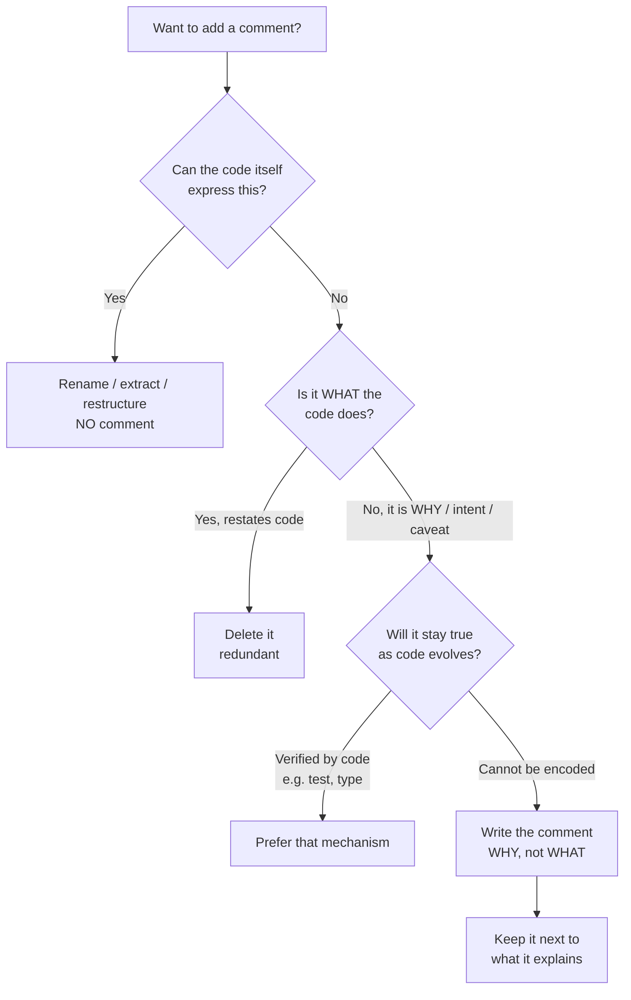

# Comments — Interview Questions

> 50+ questions across all skill levels (Junior → Staff). The unifying tension: a comment is the only part of your source that the compiler never checks, so every comment is a promise the codebase cannot enforce. Good engineers know which promises are worth making. Use this as self-review or interview prep.

---

## Table of Contents

- [Junior (15 questions)](#junior-15-questions)
- [Mid (15 questions)](#mid-15-questions)
- [Senior (12 questions)](#senior-12-questions)
- [Staff (12 questions)](#staff-12-questions)
- [Rapid-Fire](#rapid-fire)
- [Summary](#summary)
- [Further Reading](#further-reading)
- [Related Topics](#related-topics)

---

## The decision at the center of every question



---

## Junior (15 questions)

### Q1. What is a code comment?

<details><summary>Answer</summary>

Text in source that the compiler/interpreter ignores. It exists purely for human readers. Because it is never executed and never type-checked, nothing forces it to stay correct — which is the root of every comment pitfall.
</details>

### Q2. What is the single most important rule about comments?

<details><summary>Answer</summary>

Explain **why**, not **what**. The code already says *what* it does; a reader can see `i++`. What the code cannot say is *why* — the business rule, the workaround, the constraint, the thing you decided *not* to do. Comments earn their keep by capturing intent that the code cannot.
</details>

### Q3. Why is `// increment i` above `i++` bad?

<details><summary>Answer</summary>

It is a **redundant comment**: it restates the code in English, adding zero information. Worse, it is a maintenance liability — if someone changes `i++` to `i += 2`, the comment silently lies. A comment that can rot but adds nothing is pure cost.
</details>

### Q4. What is "self-documenting code"?

<details><summary>Answer</summary>

Code whose names and structure make intent clear without prose. `if (employee.isEligibleForBonus())` needs no comment; `if (e.salary > 50000 && e.tenure > 2)` does. The first choice is to make the code clearer; a comment is the fallback when you cannot.
</details>

### Q5. What is commented-out code and why delete it?

<details><summary>Answer</summary>

Lines of real code disabled with `//` or `/* */` and left in the file. Delete it, always. It rots (it no longer compiles against current APIs), it confuses readers ("is this important? why is it here?"), and it is unnecessary — **version control already keeps every line you ever wrote**. `git log -p` recovers it instantly.
</details>

### Q6. What is a TODO comment, and is it acceptable?

<details><summary>Answer</summary>

A marker for work to be done later: `// TODO: handle empty list`. Acceptable in moderation. It is a known, searchable convention, and most IDEs surface them. The danger is that TODOs accumulate forever and become archaeology. Discipline: link to a tracked issue, or treat a TODO with no owner/ticket as a smell.
</details>

### Q7. What is the difference between TODO and FIXME?

<details><summary>Answer</summary>

Convention, not enforced: **TODO** = something not yet done (a feature, a follow-up). **FIXME** = something that is *wrong* or fragile and needs repair. FIXME implies a known defect; TODO implies missing work. Many teams add HACK, XXX, NOTE — agree on the vocabulary so search is reliable.
</details>

### Q8. What is a doc-comment (docstring / Javadoc)?

<details><summary>Answer</summary>

A structured comment attached to a public API element — function, class, module — written in a tool-readable format (`/** */` Javadoc, `"""..."""` Python docstring, `///` Go/Rust). It documents the contract: parameters, return value, errors, side effects. Tools generate reference docs and IDE tooltips from it.
</details>

### Q9. When is a comment clearly justified?

<details><summary>Answer</summary>

When the information cannot live in the code:
- **Why** a non-obvious approach was chosen.
- A **warning** of consequences (`// not thread-safe`).
- A **workaround** for an external bug, ideally with a link.
- A **legal/license** header.
- The **public contract** of an API others depend on.
- Clarifying a genuinely opaque regex, bit-twiddle, or algorithm.
</details>

### Q10. What is a misleading comment?

<details><summary>Answer</summary>

A comment that contradicts the code — usually because the code changed and the comment did not. It is worse than no comment: a reader who trusts it is actively misled into a bug. This is *comment rot* in its most dangerous form.
</details>

### Q11. Why does a comment "rot"?

<details><summary>Answer</summary>

Code is edited; the comment beside it is not. Nothing — no compiler, no test — fails when a comment goes stale. Over time the comment drifts from the truth. The longer a comment lives, the more likely it lies. This is the core argument against comments that *could* have been code.
</details>

### Q12. What is a journal/changelog comment?

<details><summary>Answer</summary>

A running log of edits inside the file: `// 2023-04-01: fixed null bug - Alice`. Obsolete. `git blame` and `git log` track *who changed what, when* with far more precision and never go stale. Delete journal comments; let version control do its job.
</details>

### Q13. What is an attribution comment (`// added by Bob`)?

<details><summary>Answer</summary>

A comment crediting an author. Noise. `git blame` knows the author of every line authoritatively. Attribution comments only create the illusion of ownership and clutter the file. Remove them.
</details>

### Q14. What is a closing-brace comment (`} // end if`)?

<details><summary>Answer</summary>

A label on a closing brace to mark which block it ends. It signals a deeper problem: the block is too long or too nested to read. The cure is not the comment — it is to **extract the block into a well-named function** so its boundary is obvious.
</details>

### Q15. Should every function have a comment?

<details><summary>Answer</summary>

No. A short, well-named function (`isValidEmail(s)`) needs none. Reserve doc-comments for **public** API surface where the contract matters to outside callers. Forcing a comment on every private helper produces redundant noise and trains readers to ignore comments entirely.
</details>

---

## Mid (15 questions)

### Q16. "Are comments always bad?" Defend your answer.

<details><summary>Answer</summary>

No. *Redundant* comments that restate code are bad. *Intent-bearing* comments are valuable and irreplaceable. The nuance: a comment is a *failure to express intent in code* — but some intent genuinely cannot be expressed in code (why you chose approach A over B, an external constraint, a warning). For that residue, comments are the right tool, not a failure.

> **What the interviewer is checking:** whether you can hold a nuanced position instead of parroting "good code needs no comments." Absolutism here is a junior tell.
</details>

### Q17. Compare the Martin and Ousterhout positions on comments.

<details><summary>Answer</summary>

- **Robert C. Martin (*Clean Code*):** "Every comment represents a failure to express yourself in code." Comments are at best a necessary evil; strive to make code so clear that comments become unnecessary. Most comments are excuses for bad code.
- **John Ousterhout (*A Philosophy of Software Design*):** Comments are essential because they capture information that *cannot* be expressed in code — design rationale, abstraction-level intent, "what" at a level higher than the implementation. He argues code can *never* be fully self-documenting; the absence of comments is itself a design defect.

The reconciliation: both agree redundant comments are bad. They disagree on whether the *ideal* codebase has near-zero comments (Martin) or a deliberate, curated set of high-value comments (Ousterhout). In practice, Ousterhout's view scales better to large, long-lived systems where rationale must outlive the original authors.

> **What the interviewer is checking:** that you know this is a genuine, unresolved debate among respected authorities, and that you have a reasoned stance rather than a dogma.
</details>

### Q18. Give a concrete example of a comment that *cannot* be replaced by code.

<details><summary>Answer</summary>

```java
// Stripe rounds half-up; we must match their rounding or reconciliation
// breaks. Do NOT change to HALF_EVEN without updating the finance team.
amount.setScale(2, RoundingMode.HALF_UP);
```

The *what* (`HALF_UP`) is in the code. The *why* (external system parity, business consequence, who to consult) lives nowhere else and could not be encoded as a name or a type. That is a comment doing irreplaceable work.
</details>

### Q19. How do you handle a workaround for a known external bug?

<details><summary>Answer</summary>

Comment it with a **link to the upstream issue** and a **revisit condition**:

```go
// Workaround for golang/go#12345: TLS handshake hangs on macOS < 11.
// Remove once we drop support for those OS versions.
conn.SetDeadline(time.Now().Add(5 * time.Second))
```

The link makes the comment verifiable and self-expiring — anyone can check whether the upstream bug is fixed.
</details>

### Q20. What is a legal/license header and where does it go?

<details><summary>Answer</summary>

A copyright or license notice at the **top of each source file**, often required by the project's license (Apache, GPL) or company policy. It is the canonical legitimate use of a "boilerplate" comment. Keep it minimal — usually one line plus a pointer to the full LICENSE file — and have tooling enforce/insert it (e.g., `addlicense`, Checkstyle) so humans never hand-maintain it.
</details>

### Q21. How should a good doc-comment for a public function be structured?

<details><summary>Answer</summary>

State the **contract**, not the implementation:
- One-line summary of *what it does* from the caller's perspective.
- Each parameter's meaning and constraints.
- Return value, including edge cases (empty? null?).
- Exceptions/errors thrown and when.
- Side effects, thread-safety, and performance caveats if non-obvious.

It should let a caller use the function correctly **without reading the body**. Avoid describing the algorithm — that belongs inside the body if anywhere.
</details>

### Q22. Why is commented-out code specifically worse than a journal comment?

<details><summary>Answer</summary>

A journal comment is merely useless noise. Commented-out code is *actively dangerous*: a reader may un-comment it assuming it still works, but it was written against an old API/schema and will misbehave. It also breaks searches ("why does this string appear twice?") and pollutes diffs. Both should go; commented-out code is the higher priority.
</details>

### Q23. How do you stop comments from rotting?

<details><summary>Answer</summary>

- **Minimize** them — fewer comments, fewer things to rot.
- Keep each comment **adjacent** to exactly what it explains, so editing the code puts the comment in your eyeline.
- Prefer mechanisms the compiler/tests *do* check: types, asserts, named constants, tests-as-documentation.
- Treat stale comments as bugs in **code review**.
- Avoid duplicating facts across multiple comments (one fact, one home).
</details>

### Q24. A teammate writes `// returns true if valid` over `boolean isValid()`. What do you say?

<details><summary>Answer</summary>

Redundant — the signature already says it. Suggest deleting the comment. If there is a *non-obvious* notion of "valid" (which fields, which rules), capture *that* instead: `// "valid" = non-empty and passes Luhn check`. Otherwise the comment is pure noise that will rot the moment `isValid` gains a nuance.
</details>

### Q25. When is a comment better than extracting a function?

<details><summary>Answer</summary>

When the explanation is about **why**, not **what**. Extracting a function with a good name captures the *what* beautifully — `applyBlackFridayDiscount()`. But it cannot capture *"we discount 12% not 15% because legal capped it in 2022."* Extraction handles structure; comments handle rationale. They are complementary, not substitutes.
</details>

### Q26. Should comments be written in full sentences? Why does style matter?

<details><summary>Answer</summary>

Yes — a comment is prose, and sloppy prose erodes trust in *all* the file's comments. Be concise but grammatical. A terse cryptic comment (`// fix later magic`) is barely better than none. Treat comment quality like code quality; it is reviewed and maintained the same way.
</details>

### Q27. How do TODOs become technical debt, and how do you manage them?

<details><summary>Answer</summary>

Unowned TODOs accumulate until nobody knows which are real. Manage them by:
- Requiring a **ticket reference**: `// TODO(JIRA-123): ...`.
- Periodically **grepping** the codebase (`rg 'TODO|FIXME'`) and triaging.
- A lint/CI gate that **fails** on bare TODOs without an owner or ticket.
- Converting genuinely actionable TODOs into backlog items and deleting the comment.
</details>

### Q28. What is the relationship between comments and naming?

<details><summary>Answer</summary>

They trade off. A bad name *forces* a clarifying comment; a good name *removes the need* for one. The first move when you reach for a comment is to ask whether a rename or extraction would make it unnecessary. See [Meaningful Names](../01-meaningful-names/README.md): comments are often a band-aid over a naming wound.
</details>

### Q29. Is a comment that explains a complex regex justified?

<details><summary>Answer</summary>

Yes — regexes are write-once, read-never. A comment stating *intent* and *an example match* is high value:

```python
# Matches ISO-8601 dates: 2024-01-31. Does NOT validate day-of-month range.
DATE_RE = re.compile(r"\d{4}-\d{2}-\d{2}")
```

Even better in many languages: use verbose/extended regex mode with inline comments, or build the pattern from named sub-parts.
</details>

### Q30. How does this topic connect to anti-patterns generally?

<details><summary>Answer</summary>

Most "bad comment" categories are anti-patterns: redundant comments, journal comments, attribution comments, commented-out code, closing-brace comments. They share one cause — using comments to compensate for something that should be solved elsewhere (better code, version control, the type system). See [Anti-Patterns](../../anti-patterns/README.md).
</details>

---

## Senior (12 questions)

### Q31. Design a team comment policy. What goes in it?

<details><summary>Answer</summary>

- **Default to none**: prefer expressive code; comment only the irreducible *why*.
- **Banned**: commented-out code, journal/attribution comments, redundant restatements, closing-brace labels.
- **Required**: license headers (tool-enforced), doc-comments on all *public* API, links on workaround comments.
- **TODO discipline**: must carry an owner/ticket; CI gate enforces.
- **Review rule**: stale or misleading comments are treated as defects and block merge.
- **Doc-comment standard**: agreed format (Javadoc/godoc/docstring) with required sections.

> **What the interviewer is checking:** can you turn a philosophy into enforceable, automatable rules rather than vibes.
</details>

### Q32. Where does Ousterhout say comments should be written, and why does timing matter?

<details><summary>Answer</summary>

He argues for **comments-first / comments-as-design**: write the interface comment *before* the implementation. Doing so forces you to articulate the abstraction; if the comment is hard to write, the abstraction is probably wrong. Writing comments last turns them into an afterthought that rots immediately. Timing converts comments from documentation into a *design tool*.
</details>

### Q33. A 5,000-line file is dense with closing-brace comments. What does that tell you, and what do you do?

<details><summary>Answer</summary>

It tells you the real smell is **deep nesting and oversized functions** — the comments are a symptom. The fix is structural: extract methods, apply guard clauses to flatten nesting, split the class. The brace comments disappear as a *side effect* of fixing the actual problem. Treating the comment as the target would be addressing the symptom.
</details>

### Q34. How do you encode intent in a way that *cannot* rot, instead of a comment?

<details><summary>Answer</summary>

Push the fact into something the toolchain verifies:
- A **named constant** instead of a magic number + comment.
- A **type / value object** (`PositiveInt`, `Email`) instead of `// must be > 0`.
- An **assertion** instead of `// invariant: list is sorted`.
- A **test** named after the rule instead of a comment describing the rule.
- A **richer signature** (return `Optional`) instead of `// may return null`.

Each converts an unenforced promise into an enforced one. The residual — pure rationale — is what stays a comment.
</details>

### Q35. Critique: "We require a Javadoc on every method, public and private."

<details><summary>Answer</summary>

Counterproductive. Mandatory docs on private helpers and trivial getters produce redundant comments that rot and train reviewers to skim past *all* comments — including the valuable ones on the public API. Doc-comments earn their cost only where there is an external contract. Require them on public/exported surface; let private code be self-documenting. The policy optimizes a metric (coverage) at the expense of the goal (clarity).
</details>

### Q36. How do you review comments in a pull request?

<details><summary>Answer</summary>

- Flag every comment that restates the code → request deletion or a rename.
- Verify each *why* comment is actually true against the diff.
- Reject commented-out code, journal/attribution comments.
- Check that workaround comments link to an issue and a removal condition.
- Confirm public API changes update their doc-comments (a changed signature with a stale Javadoc is a bug).
- Ask: "could a name or type replace this?" before accepting any comment.
</details>

### Q37. What's the argument that *too few* comments is also a defect?

<details><summary>Answer</summary>

Ousterhout's central claim. Code shows the *how* but rarely the *why* and never the cross-cutting design intent. A reader landing on a clever-but-correct line with no rationale cannot tell whether it is load-bearing or accidental, and may "simplify" it into a bug. The absence of a needed comment is invisible until it causes harm — which makes under-commenting *more* dangerous than over-commenting in subtle systems.
</details>

### Q38. Self-documenting code is the goal — name a case where it is genuinely *not enough*.

<details><summary>Answer</summary>

Code can express *what* and *how* but not:
- **Why this and not the obvious alternative** (perf measurement, vendor quirk).
- **What you deliberately did not do** ("not caching here on purpose; values change per request").
- **External constraints** (regulatory rounding, protocol byte order, an upstream bug).
- **Non-local consequences** ("changing this order breaks the migration in module X").

No identifier can carry these. Names make the code self-documenting at the *implementation* level; they cannot document *decisions*.
</details>

### Q39. How do comments relate to API stability and deprecation?

<details><summary>Answer</summary>

Doc-comments are part of the public contract. Use language deprecation mechanisms (`@Deprecated`, `// Deprecated:` godoc convention, `@deprecated` JSDoc) so tooling *warns callers*, then a comment explains the replacement and timeline:

```go
// Deprecated: use NewClientV2. This will be removed in v3.0 (Q3 2026).
func NewClient() *Client { ... }
```

This is a comment that the toolchain partially enforces — the best kind.
</details>

### Q40. Generated code and comments — what's the rule?

<details><summary>Answer</summary>

Generated files should carry a machine-readable header (`// Code generated by protoc. DO NOT EDIT.`) so humans don't hand-edit them and tools can skip them in review/lint. This is one place where a boilerplate comment is mandatory and high value — it changes how every other tool and human treats the file.
</details>

### Q41. How do you migrate a legacy file drowning in bad comments without risk?

<details><summary>Answer</summary>

Don't do it as a giant scrub. Apply the **Boy Scout rule**: each time you touch a region for a real change, delete the dead/journal/attribution comments and fix the misleading ones in *that* region, in the same PR. This keeps diffs reviewable, ties cleanup to context you already understand, and avoids a massive, risky, review-fatiguing comment-only PR.
</details>

### Q42. Comments as documentation vs. external docs (wiki, ADRs) — where does each belong?

<details><summary>Answer</summary>

- **In-code comments**: facts tightly coupled to specific lines — the *why* of *this* code. They live next to what they describe and travel with it.
- **Doc-comments**: per-API contracts, consumed by tooling.
- **ADRs / external docs**: cross-cutting architectural decisions that span many files and outlive any single function.

Rule of thumb: the closer the fact is to a specific line, the closer to that line it should live. Put architectural rationale in ADRs and *link* to it from code; put line-specific rationale inline.
</details>

---

## Staff (12 questions)

### Q43. Resolve the Martin–Ousterhout debate as a principle your org can act on.

<details><summary>Answer</summary>

Frame it as: **a comment is justified iff it carries information that (a) a competent reader needs and (b) cannot be encoded in checkable artifacts (names, types, tests, asserts).** That single test dissolves the apparent conflict:
- It produces Martin's outcome for redundant/what comments (they fail (b) — encode them) — so most comments vanish.
- It produces Ousterhout's outcome for rationale/intent (passes both — keep them) — so the high-value comments stay.

The debate is really about *defaults and discipline*, not principle. Operationalize the test in your review checklist and lint rules, and both camps are satisfied.

> **What the interviewer is checking:** that you can synthesize two authorities into one decidable rule, not just recite both. This is the staff-level move — turning philosophy into policy.
</details>

### Q44. Design lint rules / CI gates for comment hygiene. What can and can't be automated?

<details><summary>Answer</summary>

**Automatable:**
- Reject blocks of commented-out code (heuristic linters: `eslint no-commented-out-code`-style, `golangci-lint`, Checkstyle).
- Fail on bare `TODO`/`FIXME` without an owner/ticket regex.
- Enforce license headers (`addlicense`, `license-maven-plugin`).
- Require doc-comments on exported symbols (`golint`/`revive`, `pydocstyle`, Checkstyle Javadoc).
- Flag `DO NOT EDIT` generated files and exclude from review.

**Not automatable** (needs human review):
- Whether a *why* comment is **true**.
- Whether a comment is **redundant** vs **clarifying**.
- Whether intent should be a comment or a rename.

Automate the mechanical 80%; reserve human review for the semantic 20%.
</details>

### Q45. A staff engineer bans all comments to "force better code." Critique.

<details><summary>Answer</summary>

Overcorrection that destroys value. It eliminates redundant comments (good) but also the irreplaceable ones — rationale, warnings, workaround links, external constraints — which *cannot* be expressed as code. The predictable result: future engineers re-derive the same painful lessons because the why was deleted, and "clever" load-bearing lines get naively refactored into bugs. The policy optimizes a proxy (comment count = 0) against the real goal (long-term comprehensibility). The correct policy bans *categories* (commented-out code, journal/attribution, redundant), not comments wholesale.
</details>

### Q46. How do comments interact with long-lived systems where original authors are gone?

<details><summary>Answer</summary>

This is where Ousterhout's argument is strongest. In a 10-year codebase, the *why* lives only in three places: the original author's head (gone), the commit/PR history (often shallow, "fix bug"), and in-code comments. The comment is frequently the *only durable record* of a hard-won decision. For such systems the cost of a rotted comment is real but the cost of a *missing* rationale comment is often higher — you pay it as a regression. Staff engineers bias toward capturing rationale and toward processes (review, ADR links) that keep it true.
</details>

### Q47. What's the failure mode of relying on git history instead of comments for *why*?

<details><summary>Answer</summary>

Git captures *why a change was made* (in commit messages/PRs) but is poor at *why the current code is the way it is*:
- `git blame` points at the *last* edit, which may be a trivial reformat that buried the real rationale several commits deep.
- Squash-merges and rebases collapse history; the explanatory commit can vanish.
- Nobody reads commit history while reading code; the *why* must be discoverable *at the line*.

So git is the right home for *change* rationale but not a substitute for a *line-local* invariant or constraint comment. Use both: link a comment to a PR for depth, keep the essential why inline.
</details>

### Q48. How do you measure whether comments help or hurt, beyond opinion?

<details><summary>Answer</summary>

Hard to measure directly; use proxies:
- **Rotted-comment incidents**: count bugs/PR-comments traced to a misleading comment. Rising → comments hurting.
- **Onboarding time / "why is this here?" questions** in code review and chat — high counts in a region signal *missing* rationale comments.
- **Doc-comment coverage of public API** as a floor (not a ceiling) metric.
- **Comment churn vs code churn** in hotspots — comments that never change next to code that changes a lot are likely stale.

The honest answer is that no single metric is sufficient; combine signals and trust review judgment.
</details>

### Q49. Doc-comments as a source of truth: pros, cons, and how to keep them honest.

<details><summary>Answer</summary>

Tools (Javadoc, godoc, Sphinx, TypeDoc) generate public docs *from* comments — making them the contract of record. Pro: docs live next to code, version together, surface in IDEs. Con: they can drift from behavior with nothing failing. Keep them honest with **doctests** (Python `doctest`, Go `Example` functions that are *compiled and run as tests*, Rust `cargo test` on doc examples). These turn doc-comments into executable, verified artifacts — eliminating the rot for the part that matters most: usage examples.
</details>

### Q50. When is a *comment* the right deprecation/migration mechanism vs. tooling?

<details><summary>Answer</summary>

Tooling (`@Deprecated`, lint warnings, compiler flags) should carry the *enforcement* — it nags every caller automatically and cannot be ignored at scale. The comment carries the *human payload* tooling can't: the migration path, the timeline, the rationale, and the exceptions. Use both: the annotation to be loud and machine-checked, the comment to be helpful. A migration that relies on a comment *alone* will be missed because nobody is forced to read it.
</details>

### Q51. How does comment philosophy change across paradigms (OO vs FP vs systems code)?

<details><summary>Answer</summary>

- **OO/application code**: most intent can be encoded in names/types; comments concentrate on the residual *why* and public contracts.
- **Functional code**: types carry far more meaning (an expressive type *is* documentation), so fewer comments are needed for *what*; but dense point-free or algebraic code often needs a *why/example* comment for the next human.
- **Systems / low-level code**: hardware quirks, memory ordering, protocol byte layouts, and performance hacks cannot be named away — comment density is *legitimately higher* and the Martin "zero comments" ideal is least applicable.

Staff insight: the right comment density is **domain-dependent**, not a universal constant.
</details>

### Q52. Final trick: "Good code is self-documenting, so we don't need comments." Steelman then rebut.

<details><summary>Answer</summary>

**Steelman:** Names, small functions, and types can express *what* and *how* with no prose; every comment that merely restates code is waste and a rot risk; striving for self-documenting code raises the bar on naming and structure, which is healthy.

**Rebuttal:** Self-documenting code documents the *implementation*, never the *decision*. It cannot record why you chose A over B, what you deliberately omitted, an external constraint, a warning, or a non-local consequence. No identifier can carry rationale. So the maxim is right about *what* comments and wrong as an absolute: the goal is not zero comments, it is zero *redundant* comments and a curated set of irreplaceable *why* comments. Treating the slogan as a total ban deletes exactly the information future maintainers will most need.

> **What the interviewer is checking:** intellectual honesty (you can argue the other side) plus a precise, bounded rebuttal — not a slogan war.
</details>

---

## Rapid-Fire

| Question | Answer |
|---|---|
| WHY or WHAT? | **WHY.** Code shows what. |
| Commented-out code? | **Delete.** Git remembers. |
| Journal comment? | Delete — use `git log`. |
| Attribution comment? | Delete — use `git blame`. |
| Closing-brace comment? | Symptom — extract the block instead. |
| Every function a docstring? | No — public API only. |
| Are comments always bad? | No — redundant ones are. |
| Worst kind of comment? | Misleading (contradicts code). |
| Best legitimate boilerplate comment? | License header / `DO NOT EDIT`. |
| TODO without a ticket? | A smell — add owner/issue. |
| Comment vs rename? | Try the rename first. |
| Comment vs type/assert? | Prefer the checkable mechanism. |
| Martin's line? | "A comment is a failure to express in code." |
| Ousterhout's line? | Comments capture what code cannot. |
| Where do why-comments live? | Adjacent to the line they explain. |
| How to keep doc examples honest? | Doctests / runnable `Example` tests. |

---

## Summary

The whole topic reduces to one decidable rule: **comment only the information a reader needs that cannot be encoded in a checkable artifact** (name, type, test, assertion, signature). Apply it and the famous Martin–Ousterhout debate dissolves — redundant *what* comments vanish (they fail the "uncheckable" half) and irreplaceable *why* comments stay (they pass it).

Everything else is corollary: delete commented-out code and journal/attribution comments (version control does that job better); reserve doc-comments for public API and keep them honest with doctests; treat misleading comments as bugs; let tooling enforce license headers, TODO discipline, and deprecation, while humans review for truth and redundancy. Self-documenting code is the right *default*, not an absolute — it documents the implementation but never the decision, and in long-lived systems the in-code rationale is often the only surviving record of why the code is the way it is.

---

## Further Reading

- Robert C. Martin — *Clean Code*, Chapter 4 ("Comments").
- John Ousterhout — *A Philosophy of Software Design*, Chapters 13–16 (comments as a design tool).
- Martin Fowler — *Refactoring* (comments as a smell pointing at extractable code).
- Go: *Effective Go* and `godoc` conventions; Go `Example` test functions.
- Python: PEP 257 (docstring conventions) and the `doctest` module.

---

## Related Topics

- [Comments — chapter overview](README.md)
- [Junior: Comments](junior.md)
- [Professional: Comments](professional.md)
- [Clean Code — overview](../README.md)
- [Meaningful Names](../01-meaningful-names/README.md) — a good name removes the need for a comment
- [Anti-Patterns](../../anti-patterns/README.md) — most bad-comment categories are anti-patterns
