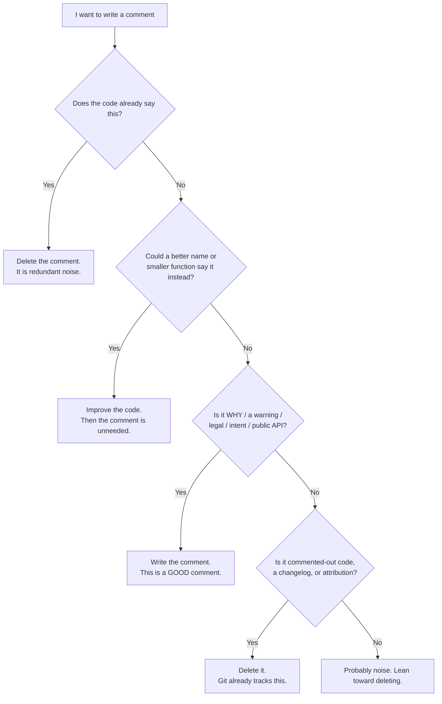

# Comments — Junior Level

> **Level:** Junior — "What's the rule? Show me a clean example."
> **Source:** *Clean Code* (Robert C. Martin), Chapter 4 — Comments.

---

## Table of Contents

1. [The one idea to remember](#the-one-idea-to-remember)
2. [Real-world analogy](#real-world-analogy)
3. [Good comments vs. bad comments at a glance](#good-comments-vs-bad-comments-at-a-glance)
4. [The decision: should I write this comment?](#the-decision-should-i-write-this-comment)
5. [Good comment — Legal / license headers](#good-comment--legal--license-headers)
6. [Good comment — Explaining intent (WHY, not WHAT)](#good-comment--explaining-intent-why-not-what)
7. [Good comment — Clarifying an opaque return value](#good-comment--clarifying-an-opaque-return-value)
8. [Good comment — Warning of consequences](#good-comment--warning-of-consequences)
9. [Good comment — Amplifying importance](#good-comment--amplifying-importance)
10. [Good comment — TODO](#good-comment--todo)
11. [Good comment — Public-API documentation](#good-comment--public-api-documentation)
12. [Bad comment — Redundant comments](#bad-comment--redundant-comments)
13. [Bad comment — Commented-out code](#bad-comment--commented-out-code)
14. [Bad comment — Journal comments](#bad-comment--journal-comments)
15. [Bad comment — Attribution comments](#bad-comment--attribution-comments)
16. [Bad comment — Closing-brace comments](#bad-comment--closing-brace-comments)
17. [Bad comment — Misleading or outdated comments](#bad-comment--misleading-or-outdated-comments)
18. [The master move — delete the comment by improving the code](#the-master-move--delete-the-comment-by-improving-the-code)
19. [Common Mistakes](#common-mistakes)
20. [Test Yourself](#test-yourself)
21. [Cheat Sheet](#cheat-sheet)
22. [Summary](#summary)
23. [Further Reading](#further-reading)
24. [Related Topics](#related-topics)

---

## The one idea to remember

> **Every comment is a small failure to express yourself in code.**

That sounds harsh, so read it carefully: it does **not** mean "never write comments." It means that *before* you write a comment, you should ask whether a better name, a smaller function, or a clearer structure would make the comment unnecessary. Code that says what it does needs no narrator.

But some comments are genuinely good — they say things code *cannot* say. Code can express *what* it does; it struggles to express *why* it does it, *what would break* if you changed it, or *what the law requires* you to keep at the top of the file. Those are the comments worth writing.

So this chapter has two jobs:

1. Teach you the handful of comments that are **good** — write these freely.
2. Teach you the comments that are **bad** — delete these on sight, usually by improving the code instead.

The trap is that comments lie. Code is checked by the compiler and the tests; comments are checked by nobody. The moment the code changes and the comment doesn't, the comment becomes a confident, authoritative liar sitting right next to the truth. A wrong comment is worse than no comment.

---

## Real-world analogy

### The sticky note on the broken machine

Imagine a coffee machine in an office. Two kinds of notes get stuck to it.

**Bad note:** *"This is a coffee machine. Press the button to make coffee."* Useless — anyone can see that. It adds nothing, it takes up space, and when the machine is replaced with a newer model, the note stays, now describing buttons that no longer exist.

**Good note:** *"The hot-water tap leaks if you fill past the MAX line — stop at MAX or you'll flood the counter."* That's gold. You cannot learn it by looking at the machine. It warns you of a consequence, it explains a *why*, and it saves the next person from a mess.

Good comments are the second kind. They tell you what the surface of the thing cannot. Bad comments are the first kind: they restate the obvious, and they rot.

---

## Good comments vs. bad comments at a glance

| Good comments (write these) | Bad comments (delete these) |
|---|---|
| Legal / license headers | Redundant (`// increment i` above `i++`) |
| Explanation of **intent** (the *why*) | Commented-out code |
| Clarification of an opaque library return | Journal / changelog comments |
| Warning of consequences | Attribution (`// added by Bob`) |
| Amplifying importance of something subtle | Closing-brace comments (`} // end if`) |
| `TODO` markers | Misleading / outdated comments |
| Public-API docs (Javadoc / docstring / godoc) | Mumbling, noise, "position markers" |

The dividing line is simple: **a good comment says something the code cannot.** A bad comment says something the code *already says*, says it badly, or says something that is no longer true.

---

## The decision: should I write this comment?



The flow has one bias built in: **when in doubt, prefer fixing the code over adding a comment.** A comment is the tool of last resort, used only when code genuinely cannot carry the meaning.

---

## Good comment — Legal / license headers

Many companies and open-source projects require a copyright or license header at the top of every source file. You can't express "this file is licensed under Apache 2.0" in code — it's a legal statement, not logic. Keep it short; link to the full text rather than pasting hundreds of lines.

**Go**

```go
// Copyright 2026 Acme Corp. All rights reserved.
// Use of this source code is governed by an MIT license
// that can be found in the LICENSE file.

package billing
```

**Java**

```java
/*
 * Copyright (c) 2026 Acme Corp.
 * Licensed under the Apache License, Version 2.0.
 * See LICENSE in the project root for full text.
 */
package com.acme.billing;
```

**Python**

```python
# Copyright 2026 Acme Corp.
# SPDX-License-Identifier: MIT
```

> **Tip:** Prefer a one-line `SPDX-License-Identifier` over a wall of legal text. It's machine-readable and tools can verify it.

---

## Good comment — Explaining intent (WHY, not WHAT)

This is the single most valuable comment you will ever write. The code shows *what* it does. It cannot show *why* you chose to do it that way — the business reason, the bug it works around, the surprising constraint. That reasoning lives only in your head until you write it down.

**Bad (explains WHAT — the code already says this):**

```go
// loop over users and send each one an email
for _, u := range users {
    sendEmail(u)
}
```

**Good (explains WHY — code could never say this):**

```go
// Send sequentially, not concurrently: the email provider rate-limits us to
// 10 req/s per account and returns 429s in bursts that we can't retry cleanly.
for _, u := range users {
    sendEmail(u)
}
```

**Java**

```java
// Sort descending so the highest bid wins ties — required by the auction rules
// in contract §4.2, not just a UI preference.
bids.sort(Comparator.comparingInt(Bid::amount).reversed());
```

**Python**

```python
# We retry exactly 3 times because the payment gateway's idempotency window is
# 30 seconds and each attempt + backoff fits inside it. More retries risk a
# double charge.
for attempt in range(3):
    ...
```

> **Rule of thumb:** if a future reader could reasonably ask *"why is it done this way?"* and the answer isn't obvious from the code, that's exactly when an intent comment earns its keep.

---

## Good comment — Clarifying an opaque return value

Sometimes you call a library or system function whose return value is cryptic and you can't change it. A short comment that decodes the magic value is helpful — it protects readers from re-deriving it. (Even better, wrap the call in a well-named function, but the comment is a legitimate first step.)

**Go**

```go
n, err := conn.Read(buf)
// Read returns n == 0 with err == io.EOF when the peer closed the connection
// cleanly; that's expected here, not an error.
if err == io.EOF {
    return nil
}
```

**Java**

```java
int result = collator.compare(a, b);
// Collator.compare returns <0, 0, or >0 — NOT -1/0/1. Don't switch on exact -1.
return result < 0;
```

**Python**

```python
status = subprocess.run(cmd).returncode
# 0 means success; 130 specifically means the child was killed by Ctrl-C (SIGINT).
if status == 130:
    raise KeyboardInterrupt
```

> **Warning:** this comment is only good when you *cannot* improve the code. If the value is yours, give it a named constant (`const exitInterrupted = 130`) instead of a comment.

---

## Good comment — Warning of consequences

Some code is a landmine: it works, but changing it the obvious way will break something non-obvious. Warn the next person — including future you.

**Go**

```go
// WARNING: this test mutates the global rand seed. Do not run it in parallel
// (no t.Parallel()) or other tests will get nondeterministic values.
func TestShuffleDeterminism(t *testing.T) {
    ...
}
```

**Java**

```java
// WARNING: SimpleDateFormat is NOT thread-safe. Do not promote this to a
// shared static field — it will silently corrupt dates under concurrency.
SimpleDateFormat fmt = new SimpleDateFormat("yyyy-MM-dd");
```

**Python**

```python
# Don't sort this list in place. It's shared with the cache layer, which
# assumes insertion order. Sort a copy instead: sorted(items).
```

A warning comment is good precisely because the danger is *invisible* in the code. The compiler won't catch it; only a human reading the warning will.

---

## Good comment — Amplifying importance

Occasionally a line looks trivial and a careless reader (or a "cleanup" commit) might delete it, not realizing it's load-bearing. A comment can amplify its importance.

**Java**

```java
String listItemContent = match.group(1);
// The trim is important. The upstream parser leaves a trailing tab that breaks
// the downstream CSV export if it survives. Do not remove.
return listItemContent.trim();
```

**Go**

```go
// .Lock() before reading too: this map is also written by the background
// flusher. A read without the lock is a data race even though it "looks safe".
mu.Lock()
defer mu.Unlock()
return cache[key]
```

The point is to stop someone from "simplifying" away something that looks redundant but isn't.

---

## Good comment — TODO

A `TODO` is an honest note that something is unfinished or could be better. It's good *as long as it stays short-lived and explains itself.* Most editors and CI tools can list every `TODO`, so they don't get lost.

```go
// TODO(bakhodir): replace this linear scan with the indexed lookup once the
// new index ships (ETA Q3). Fine for <1k rows, too slow beyond that.
```

```java
// TODO: handle the timezone edge case for users in UTC+13 (see TICKET-482).
```

```python
# TODO: this assumes the file fits in memory. Stream it once files exceed ~100MB.
```

**Good TODO checklist:**

- Says *what* is missing and ideally *why* it's deferred.
- References a ticket or owner so it can be tracked, not orphaned.
- Is **not** an excuse to commit broken code that should be fixed now.

> **Watch out:** a `TODO` that has been in the codebase for two years isn't a comment, it's a tombstone. Periodically grep for `TODO` and either do them or delete them.

---

## Good comment — Public-API documentation

When you publish a function, class, or package that *other people* will call, doc comments are good and expected. The reader of a public API often can't (or shouldn't have to) read its body. Each language has a standard format and a tool that turns these into browsable docs.

- **Go:** doc comments (godoc) — a plain comment immediately above the declaration, starting with the identifier's name.
- **Java:** Javadoc — `/** ... */` with `@param`, `@return`, `@throws`.
- **Python:** docstrings — a triple-quoted string as the first statement.

**Go**

```go
// ParseDuration parses a duration string such as "300ms" or "1.5h".
// Valid units are "ns", "us", "ms", "s", "m", "h". It returns an error if the
// string is empty or contains an unknown unit.
func ParseDuration(s string) (time.Duration, error) {
    ...
}
```

**Java**

```java
/**
 * Transfers money between two accounts atomically.
 *
 * @param from   the account to debit; must have sufficient balance
 * @param to     the account to credit
 * @param amount a positive amount in minor units (cents)
 * @return the resulting transaction record
 * @throws InsufficientFundsException if {@code from} cannot cover {@code amount}
 */
public Transaction transfer(AccountId from, AccountId to, long amount) {
    ...
}
```

**Python**

```python
def transfer(from_acct: AccountId, to_acct: AccountId, amount: int) -> Transaction:
    """Transfer money between two accounts atomically.

    Args:
        from_acct: Account to debit; must have sufficient balance.
        to_acct: Account to credit.
        amount: Positive amount in minor units (cents).

    Returns:
        The resulting transaction record.

    Raises:
        InsufficientFundsError: If `from_acct` cannot cover `amount`.
    """
    ...
```

> **Scope note:** document **public** API surfaces. Private helpers usually don't need doc comments — if a private function needs a paragraph to explain it, that's a hint to rename or split it instead. Deeper treatment of API docs lives in [../../documentation/README.md](../../documentation/README.md).

---

## Bad comment — Redundant comments

A redundant comment restates exactly what the code already says. It adds reading time, adds a thing to maintain, and adds nothing else. This is the most common bad comment by far.

**Go**

```go
// set name to the user's name
name := user.Name

i++ // increment i

// return the result
return result
```

**Java**

```java
// constructor
public Account() { }

// this is the getter for balance
public long getBalance() {
    return balance; // return balance
}
```

**Python**

```python
# loop through items
for item in items:
    total += item.price  # add the price to total
```

Every one of these comments parrots the code. Delete them all. The code is already the clearest possible statement of *what* it does.

---

## Bad comment — Commented-out code

Commented-out code is among the worst offenders. The next reader is afraid to delete it — *"maybe it's important, maybe someone needs it"* — so it sits there, rotting, forever. It makes the file longer, confuses search results, and slowly drifts out of sync with the live code around it.

**Bad**

```python
def charge(card, amount):
    # old logic, keeping just in case:
    # if amount > 1000:
    #     require_manual_review(card)
    # legacy_gateway.charge(card, amount)
    return gateway.charge(card, amount)
```

**Good**

```python
def charge(card, amount):
    return gateway.charge(card, amount)
```

**Delete it.** Your version control system already remembers every line you ever wrote. If you truly need the old logic back, `git log` and `git blame` will hand it to you instantly. There is no reason to embalm dead code in a comment.

> **The killer argument:** the entire purpose of Git is to remember deleted code. Commented-out code is a second, worse version-control system living inside your source file.

---

## Bad comment — Journal comments

A journal (or changelog) comment is a running history of edits pasted into the source file. Decades ago, before good version control, people did this. Today it's pure noise — Git records every change, with author, date, and message, far more reliably than a hand-maintained list.

**Bad**

```java
/*
 * Changes:
 * 2023-04-01: Alice - initial version
 * 2023-05-12: Bob - fixed null pointer
 * 2023-09-03: Carol - added retry logic
 * 2024-01-20: Bob - refactored, removed retry logic
 */
public class PaymentProcessor { ... }
```

**Good**

```java
public class PaymentProcessor { ... }
```

The history belongs in `git log`, where it's accurate, searchable, and never falls out of date. A handwritten journal always does.

---

## Bad comment — Attribution comments

Attribution comments tag code with who wrote or changed it (`// added by Bob`, `// hack by Dave 2021`). Like journal comments, they duplicate what `git blame` tells you precisely and automatically — and they're often wrong after the next refactor moves the line.

**Bad**

```go
func discount(total float64) float64 {
    // added by Bob
    if total > 100 {
        return total * 0.9 // tweaked by Sarah - was 0.95
    }
    return total
}
```

**Good**

```go
func discount(total float64) float64 {
    if total > 100 {
        return total * 0.9
    }
    return total
}
```

`git blame` answers "who wrote this line and when" for *every* line, for free, forever. Hand-written attribution just rots.

---

## Bad comment — Closing-brace comments

When a block gets so long you feel the urge to label its closing brace (`} // end for`, `} // end if`), the comment isn't the problem — the *length* is. The honest fix is to shorten the block, usually by extracting a function.

**Bad (Java)**

```java
public void process() {
    for (Order o : orders) {
        if (o.isValid()) {
            // ... 40 lines ...
        } // end if
    } // end for
} // end process
```

**Good (Java) — extract the body, the braces become obvious**

```java
public void process() {
    for (Order o : orders) {
        processIfValid(o);
    }
}

private void processIfValid(Order o) {
    if (!o.isValid()) {
        return;
    }
    // ... now this fits on a screen, no brace label needed ...
}
```

If your blocks are short, you can always see which brace closes which block — no label required. The need for a closing-brace comment is a smell pointing at a [Long Method](../../refactoring/README.md).

---

## Bad comment — Misleading or outdated comments

The most dangerous comment is one that is simply *wrong*. It once described the code accurately; then the code changed and the comment didn't. Now it confidently states something false, right next to the code that contradicts it. Readers trust comments, so a wrong one actively leads them astray.

**Bad — comment says one thing, code does another**

```python
def get_timeout():
    # default timeout is 30 seconds
    return 60  # someone changed this and forgot the comment
```

**Bad — describes behavior that no longer exists**

```java
// Returns null if the user is not found.
public User findUser(String id) {
    return repo.findById(id)
               .orElseThrow(() -> new UserNotFoundException(id)); // now throws!
}
```

A caller who reads `// Returns null` will write `if (user == null)` and that branch will never run — instead an exception will blow up somewhere they didn't expect. The wrong comment caused the bug.

**Good — keep comments and code in sync, or delete the comment:**

```java
/** @throws UserNotFoundException if no user has the given id */
public User findUser(String id) {
    return repo.findById(id)
               .orElseThrow(() -> new UserNotFoundException(id));
}
```

> **Rule:** when you change code, change its comments in the *same commit*. A comment you don't update is a comment you should delete.

---

## The master move — delete the comment by improving the code

Most bad comments — and even many that look necessary — disappear the moment you improve the code. The technique is: read the comment, then make the code say what the comment says, then delete the comment.

**Go**

```go
// Before: a comment explaining an obscure condition
// check if the user is eligible: active, verified, and not banned
if u.Status == "active" && u.Verified && !u.Banned {
    grantAccess(u)
}

// After: the code says it itself — no comment needed
if u.isEligible() {
    grantAccess(u)
}

func (u User) isEligible() bool {
    return u.Status == "active" && u.Verified && !u.Banned
}
```

**Java**

```java
// Before
// magic number 86400 = seconds in a day
long expiry = now + 86400;

// After — the name replaces the comment
static final long SECONDS_PER_DAY = 86_400;
long expiry = now + SECONDS_PER_DAY;
```

**Python**

```python
# Before
# t is the temperature in celsius converted to fahrenheit
t = c * 9 / 5 + 32

# After — the name carries the meaning
fahrenheit = celsius * 9 / 5 + 32
```

This is the heart of the chapter. A comment that explains *what* the code does is almost always a missed opportunity to name a variable, extract a function, or define a constant. Reach for the code fix first; keep the comment only when the meaning genuinely can't live in the code (the *why*, the warning, the legal text, the public-API contract).

---

## Common Mistakes

1. **Treating "more comments" as "better code."** A high comment count often signals unclear code that needed narration. Aim for code so clear it needs few comments — then the comments you *do* write stand out as important.

2. **Commenting *what* instead of *why*.** `// add 1 to count` is noise; `// +1 to count the header row that the parser skips` is gold. If the comment paraphrases the code, delete it. If it explains a reason, keep it.

3. **Leaving commented-out code "just in case."** Git is the "just in case." Delete it.

4. **Letting comments rot.** Changing code without updating its comment creates a liar. Update or delete the comment in the same change.

5. **Hand-maintaining history or authorship in comments.** `git log` and `git blame` do this perfectly and automatically. Don't duplicate them.

6. **Labeling closing braces or writing banner comments** (`//============ SECTION ============`). These are bandages over functions that are too long. Extract instead.

7. **Over-documenting private helpers.** A three-line private function rarely needs a docstring. If it does, the function name is probably wrong.

8. **Writing a comment to apologize for bad code** (`// sorry, this is ugly`). Don't apologize — fix it, or write a `TODO` with a plan.

---

## Test Yourself

**1. Why is "every comment is a failure to express yourself in code" not the same as "never write comments"?**

<details><summary>Answer</summary>

It's a *bias*, not a ban. The idea is to reach for clearer code (better names, smaller functions, named constants) *before* reaching for a comment, because code is verified by the compiler and tests while comments are verified by nobody. But some things — *why* a choice was made, warnings, legal headers, public-API contracts — genuinely cannot be expressed in code. Those comments are good and you should write them.

</details>

**2. Classify each as GOOD or BAD: (a) `i++ // increment i`, (b) `// retry 3x: gateway idempotency window is 30s, more risks double-charge`, (c) `// added by Bob`, (d) a Javadoc on a public method.**

<details><summary>Answer</summary>

- (a) **BAD** — redundant; the code already says it.
- (b) **GOOD** — explains *why* (intent), which code can't say.
- (c) **BAD** — attribution; `git blame` does this.
- (d) **GOOD** — public-API documentation.

</details>

**3. A coworker keeps a block of old logic commented out "in case we need it." What do you tell them?**

<details><summary>Answer</summary>

Delete it. Version control already remembers every deleted line — `git log` / `git blame` can restore it instantly. Commented-out code rots, clutters search results, lengthens the file, and makes the next reader afraid to touch it. There is no scenario where keeping it beats deleting it, because the safety net (Git) already exists.

</details>

**4. You find this. What's wrong, and what's the fix?**
```python
def get_timeout():
    # default timeout is 30 seconds
    return 60
```

<details><summary>Answer</summary>

The comment is **outdated/misleading** — it says 30 but the code returns 60. A misleading comment is worse than none because readers trust it and act on the wrong number. Fix: update the comment to match (or, better, replace the magic number with a named constant like `DEFAULT_TIMEOUT_SECONDS = 60` so no comment is needed) and keep code and comments in sync in the same commit.

</details>

**5. Rewrite this so the comment becomes unnecessary:**
```go
// check if user is active, verified, and not banned
if u.Status == "active" && u.Verified && !u.Banned {
    grantAccess(u)
}
```

<details><summary>Answer</summary>

Extract the condition into a well-named method and delete the comment:

```go
if u.isEligible() {
    grantAccess(u)
}

func (u User) isEligible() bool {
    return u.Status == "active" && u.Verified && !u.Banned
}
```

The method name `isEligible` now carries the meaning the comment used to carry — and unlike the comment, the compiler keeps it honest.

</details>

**6. When is a `TODO` a good comment, and when is it a problem?**

<details><summary>Answer</summary>

It's **good** when it's short-lived, explains what's missing and why it's deferred, and references a ticket or owner so it can be tracked. It's a **problem** when it's an excuse to commit broken code that should be fixed now, or when it lingers for years until it's just a tombstone nobody acts on. Periodically grep for `TODO` and either do them or delete them.

</details>

---

## Cheat Sheet

| Situation | Do this |
|---|---|
| The comment restates the code | Delete it |
| You want to explain *why* | Write an intent comment — this is the best kind |
| You want to explain *what* | Improve the code (rename, extract, named constant) instead |
| Old logic you "might need" | Delete it; Git remembers |
| Edit history / changelog in a file | Delete it; `git log` does this |
| `// added by Bob` | Delete it; `git blame` does this |
| `} // end if` | Shorten the block (extract a function) |
| Comment contradicts the code | Fix or delete it — *now*, same commit |
| Dangerous, non-obvious code | Write a WARNING comment |
| Cryptic library return value | Comment it (or wrap it in a named function) |
| Publishing a public function/class | Write doc comments (godoc / Javadoc / docstring) |
| Legal requirement | Short license header; link to full text |

> **One-line test:** *If the comment says something the code already says, delete it. If it says something the code can't say, keep it.*

---

## Summary

- A comment is a tool of **last resort**: prefer clearer code over a comment whenever possible, because code is checked by the compiler and comments are checked by nobody.
- **Good comments** say what code can't: legal headers, **intent (why)**, warnings of consequences, clarification of opaque returns, amplification of importance, tracked `TODO`s, and public-API docs (godoc / Javadoc / docstrings).
- **Bad comments** restate the code or duplicate version control: redundant comments, commented-out code, journal/changelog comments, attribution, closing-brace labels, and — most dangerous — **outdated comments that lie**.
- The **master move** is to delete a comment by improving the code: extract a function, rename a variable, define a named constant.
- Whenever you change code, change its comments **in the same commit** — an unmaintained comment is a future liar; delete it rather than let it rot.

---

## Further Reading

- *Clean Code* (Robert C. Martin), **Chapter 4 — Comments**. The source of every rule on this page.
- *The Pragmatic Programmer* (Hunt & Thomas) — "Good-Enough Software" and the DRY principle as it applies to comments duplicating code.
- *A Philosophy of Software Design* (John Ousterhout), Chapters 12–16 — a thoughtful, sometimes contrarian, take arguing that good comments are more valuable than Clean Code implies. Read it alongside this chapter to form your own balance.
- [Go Doc Comments](https://go.dev/doc/comment) — the official godoc convention.
- [Javadoc Tool overview](https://docs.oracle.com/javase/8/docs/technotes/tools/windows/javadoc.html) and [PEP 257 — Docstring Conventions](https://peps.python.org/pep-0257/).

---

## Related Topics

- [middle.md](middle.md) — comments in real codebases: documentation that scales, when WHY-comments earn their keep, comment debt.
- [senior.md](senior.md) — comments as a design signal, API documentation strategy, and team-level conventions.
- [Chapter README](../README.md) — the full scope of the Comments chapter.
- [Meaningful Names](../01-meaningful-names/README.md) — the first line of defense: a good name removes the need for a comment.
- [Documentation and ADRs](../../documentation/README.md) — where larger, durable documentation (beyond inline comments) belongs.
- [Refactoring](../../refactoring/README.md) — Extract Method and Rename are how you "delete a comment by improving the code."
- [Anti-Patterns](../../anti-patterns/README.md) — commented-out code, journal comments, and friends as recognized anti-patterns.
