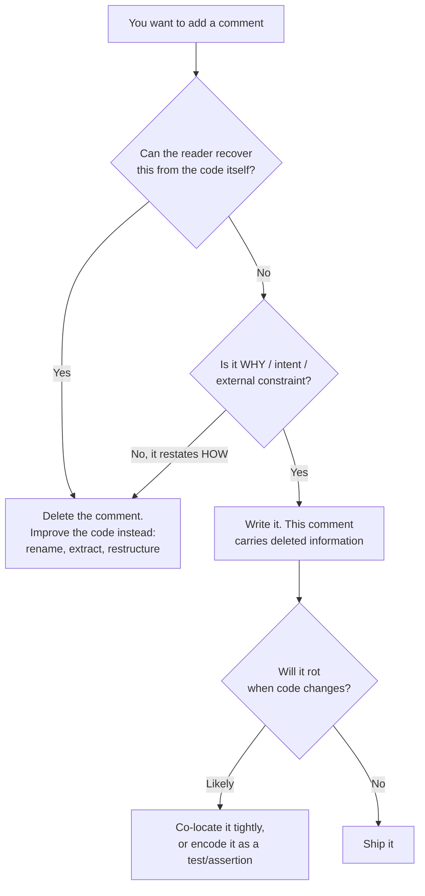

# Comments — Middle Level

> Focus: "Why?" and "When does the rule bend?" — the junior rule is "prefer code over comments," but real codebases have comments that genuinely earn their keep. This level is about telling those apart, and about keeping the good ones alive.

---

## Table of Contents

1. [The one job a comment can do that code cannot](#the-one-job-a-comment-can-do-that-code-cannot)
2. [Comments that earn their keep](#comments-that-earn-their-keep)
3. [Doc-comments for public APIs vs. internal noise](#doc-comments-for-public-apis-vs-internal-noise)
4. [Intent vs. mechanics: the line that decides everything](#intent-vs-mechanics-the-line-that-decides-everything)
5. [Comment rot and how to prevent it](#comment-rot-and-how-to-prevent-it)
6. [TODO / FIXME hygiene and tracking](#todo--fixme-hygiene-and-tracking)
7. [Comments and code review](#comments-and-code-review)
8. [Go vs. Java vs. Python: the doc-comment cultures](#go-vs-java-vs-python-the-doc-comment-cultures)
9. [Common Mistakes](#common-mistakes)
10. [Test Yourself](#test-yourself)
11. [Cheat Sheet](#cheat-sheet)
12. [Summary](#summary)
13. [Further Reading](#further-reading)
14. [Related Topics](#related-topics)

---

## The one job a comment can do that code cannot

Code answers **what** and **how**. A reader can always recover those from the source — the function name, the control flow, the types. What the source **cannot** recover is the information that was *deleted* on the way in:

- The option you rejected and why.
- The constraint imposed from outside the code (a regulation, an upstream bug, a hardware quirk).
- The reason a "wrong-looking" line is actually correct.

That deleted information is the only thing a comment is uniquely qualified to carry. Every durable comment-writing rule descends from this single observation:



The junior takeaway was "fewer comments." The middle takeaway is sharper: **a good comment is one that survives the deletion test** — remove it, and a competent reader can no longer reconstruct the missing fact from the code alone.

---

## Comments that earn their keep

These are the categories where a comment is not a code smell but a genuine asset. In review, *defend* these; in writing, *invest* in these.

### 1. Non-obvious WHY

The code is correct but looks wrong, or chose one path where several were plausible.

```go
// We sort by ID before hashing so two servers computing the same
// fingerprint from the same set always agree. Iteration order over a
// Go map is randomized, so hashing in map order would produce
// different fingerprints on different nodes for identical data.
sort.Slice(records, func(i, j int) bool { return records[i].ID < records[j].ID })
```

Delete that comment and the next maintainer "simplifies" away the sort, reintroducing a nondeterminism bug that only shows up across nodes. The comment earns its keep.

### 2. Regulatory / security rationale

The constraint comes from outside the codebase, so it can never live *in* the code.

```python
# PCI-DSS 3.4: card numbers must never be logged in full, even at DEBUG.
# Mask all but the last four before this value can reach any log sink.
masked = "*" * (len(pan) - 4) + pan[-4:]
```

```java
// Constant-time comparison required: a fast-fail equals() leaks the
// HMAC byte-by-byte via timing. Do NOT replace with Arrays.equals().
return MessageDigest.isEqual(expected, actual);
```

A reviewer who doesn't know the rule will happily "optimize" `MessageDigest.isEqual` into `Arrays.equals`. The comment is the only guardrail.

### 3. Performance-hack explanation

A deliberately unidiomatic line that exists because the obvious version was measured to be too slow.

```go
// Reuse the buffer across iterations: profiling showed 40% of CPU in
// this hot path was bytes.Buffer allocation (see BenchmarkEncode).
buf.Reset()
```

Pair the comment with a *reproducible benchmark name* so the next person can re-measure before reverting.

### 4. Workaround for an upstream bug — **with a link**

```python
# Workaround for https://github.com/foo/bar/issues/4821 (open as of v2.3.1):
# the client double-encodes '+' in query params. Decode once here.
# Remove this when the fix lands and we bump past the patched release.
value = value.replace("%2B", "+")
```

The link is mandatory. A workaround comment with no tracking reference becomes permanent debt that nobody dares remove because nobody knows if the upstream bug was ever fixed.

> **The shared trait:** every comment above explains something the code *cannot* say about itself — an external constraint, a rejected alternative, a measurement. That is the signature of a comment worth keeping.

---

## Doc-comments for public APIs vs. internal noise

There are two populations of comments and they obey opposite economics.

| | Public API doc-comment | Internal implementation comment |
|---|---|---|
| **Audience** | Callers who never read your source | The next maintainer of *this* file |
| **Contract** | Yes — it's part of the API surface | No — purely advisory |
| **Tooling** | Rendered (godoc, Javadoc, Sphinx) | Never rendered |
| **Default stance** | Write one for every exported symbol | Write one only when code can't speak |
| **Cost of omission** | Caller guesses, gets it wrong | Maintainer reads the code, fine |
| **Cost of staleness** | Published lie — worst kind | Local lie, caught in review |

The same sentence is a great comment in one column and noise in the other:

```go
// Package ratelimit provides a token-bucket limiter safe for concurrent use.  // GOOD: package doc
```

```go
i++ // increment i   // NOISE: restates mechanics for nobody
```

A public doc-comment is a **promise to strangers**. Document the contract: what it returns, what it accepts, what it does on error, what it guarantees (thread-safety, nil behavior, idempotency). Do **not** document the implementation — that's not part of the contract and it rots the moment you refactor internals.

An internal comment is a **note to a colleague who has the code open**. They can see the mechanics. Only tell them what they can't see.

---

## Intent vs. mechanics: the line that decides everything

This is the distinction that separates a senior comment from a junior one.

**Narrating mechanics** describes what the next line literally does. The reader already gets this for free:

```python
# loop through users and add active ones to the result list
for user in users:
    if user.active:
        result.append(user)
```

**Explaining intent** describes the *goal* or *constraint* the mechanics serve — something the mechanics don't reveal:

```python
# Active-only: the billing run must skip suspended accounts, or we
# double-charge customers during the grace period (incident #2291).
for user in users:
    if user.active:
        result.append(user)
```

The first comment dies the instant you refactor the loop into a comprehension. The second survives any rewrite of the loop, because it's anchored to *why the filter exists*, not *how it's coded*. Rule of thumb: **if renaming a variable or swapping a loop for a comprehension would make your comment wrong, your comment was describing mechanics.**

---

## Comment rot and how to prevent it

A comment is the only part of a program the compiler never checks. So it drifts: the code changes, the comment doesn't, and now the comment is an active lie. A *wrong* comment is worse than no comment, because the reader trusts it over the code.

Three forces cause rot, with a specific defense for each:

### 1. Distance — co-locate

The further a comment sits from the code it describes, the less likely it gets updated together.

```go
// BAD — top-of-function comment listing every step; each step drifts independently
// 1. validate input  2. check quota  3. write record  4. emit event
func handle(r Req) error { /* ... 60 lines ... */ }
```

Put each note *immediately above* the single line or block it explains. A comment touching its code gets seen — and revised — in the same diff.

### 2. Duplication — keep it DRY with the code

If a comment repeats a fact already encoded in the code (a constant, a type, an enum value), the two will diverge.

```python
# BAD: timeout is 30 seconds  <- drifts when the constant changes
TIMEOUT = 30

# GOOD: name carries the fact; comment carries the *reason*
# Upstream gateway drops idle connections at 45s; stay safely under it.
TIMEOUT_SECONDS = 30
```

Never restate a value in prose. Encode the *fact* in code, the *reason* in the comment.

### 3. No verification — encode as executable when you can

The strongest anti-rot move is to turn the comment into something the machine checks:

- A comment asserting an invariant becomes an `assert` / a precondition check.
- A comment explaining an edge case becomes a named test that fails if the case regresses.
- A comment describing a type's shape becomes an actual type / dataclass / struct.

```python
# WEAK: prose, never checked
# prices are always non-negative

# STRONG: executable, fails the build if violated
assert price >= 0, "price must be non-negative"
```

Executable knowledge cannot rot silently — the test suite catches the drift. Prefer it whenever the fact is checkable.

---

## TODO / FIXME hygiene and tracking

`TODO` comments are how good intentions become permanent litter. Every mature codebase has thousand-line audits of `TODO`s nobody can date, attribute, or act on. The fix is a *convention plus a tracker link*, enforced in CI.

A disciplined marker carries four things — **who, what, why, and where it's tracked**:

```go
// TODO(asmith, JIRA-4821): replace this linear scan with the new index
// once it ships in v3.2. Acceptable for now: < 500 rows in prod.
```

```python
# FIXME(JIRA-5102): race between cache eviction and refresh under load.
# Repro in test_cache_race; gated behind a feature flag for now.
```

Conventions worth adopting:

- **`TODO`** = deferred improvement, not a defect. **`FIXME`** = a known defect or hazard. Don't blur them.
- **Always link a tracker issue.** An untracked TODO is a wish, not a plan.
- **Date or version it** so staleness is visible.
- **Enforce in CI:** fail the build on a bare `TODO` with no `(owner, ticket)`. Go's `staticcheck`, Python's `flake8-todos`, and most linters can match the pattern.
- **Never let `XXX`, `HACK`, or a lone `FIXME` block a merge silently** — make the linter surface them in review.

> **Trade-off:** a hard CI gate on TODO format catches rot but adds friction. A pragmatic middle ground: *warn* in review for new bare markers, *fail* only on `FIXME`/`HACK` (the hazard markers), and run a weekly scheduled report of all markers older than N days.

---

## Comments and code review

Comments are part of the diff, so they're part of the review — but reviewers systematically under-scrutinize them because they're "just text." Three review behaviors separate strong teams:

1. **Review the comment against the code it sits on.** The single most valuable comment review is "this comment no longer matches the code two lines below." Catching one stale comment in review prevents a future production lie.

2. **Push back on mechanics comments, defend WHY comments.** When you see `// increment counter`, ask the author to delete it (or rename so the code says it). When you see a bare workaround with no link, ask for the issue URL. When you see a genuine WHY comment, *thank them* — that knowledge would otherwise be lost.

3. **Prefer "rename it" over "comment it."** If a reviewer needs a comment to understand a variable, the better outcome is usually a better name, not an explanatory comment. A review comment of "can we rename `d` to `daysUntilRenewal`?" beats "can you add a comment explaining `d`?"

A subtle one: the **PR description and commit message** are comments too — and they're the *right* place for journal/attribution information (who, when, why this change). That's exactly the content that does **not** belong in a source comment, because version control already tracks it with far better tooling.

---

## Go vs. Java vs. Python: the doc-comment cultures

The three ecosystems have genuinely different conventions. Writing Java-style doc-comments in Go marks you as an outsider, and vice versa.

### Go — godoc

- **Doc-comments are plain sentences directly above the declaration**, with **no tags**. No `@param`, no `@return`.
- **Start with the symbol's name**: `// Encode writes ...` — `go doc` and pkg.go.dev rely on this convention.
- Package docs go above `package x`, conventionally in a `doc.go` file for large packages.
- Culture: **terse**. Idiomatic Go documents the contract in one or two sentences and lets clear names carry the rest.

```go
// Encode serializes v as length-prefixed binary and writes it to w.
// It returns the number of bytes written and any write error.
// Encode is safe for concurrent use by multiple goroutines.
func Encode(w io.Writer, v Value) (int, error) { /* ... */ }
```

### Java — Javadoc

- **Structured tags**: `@param`, `@return`, `@throws`, `@since`, `@deprecated`, with `{@link}` and `{@code}` inline.
- Generates a full HTML site; tooling and IDEs surface tags on hover and at call sites.
- Culture: **thorough**. Every public method documents each parameter, the return, and every checked exception.

```java
/**
 * Serializes the value as length-prefixed binary.
 *
 * @param out   the sink to write to; must not be {@code null}
 * @param value the value to encode
 * @return the number of bytes written
 * @throws IOException if the underlying stream fails
 * @since 2.1
 */
public int encode(OutputStream out, Value value) throws IOException { /* ... */ }
```

### Python — docstrings (+ Sphinx)

- **Docstrings are first-class objects** (`func.__doc__`), readable at runtime, used by `help()`, IDEs, and doctests.
- **Sphinx** renders them; teams standardize on a style — **reStructuredText** (`:param:`), **Google style**, or **NumPy style**.
- Type information increasingly lives in **type hints**, not the docstring — so the docstring documents *behavior*, the signature documents *types* (DRY: don't repeat the type in both).

```python
def encode(out: BinaryIO, value: Value) -> int:
    """Serialize the value as length-prefixed binary.

    Args:
        out: An open binary stream to write to.
        value: The value to encode.

    Returns:
        The number of bytes written.

    Raises:
        OSError: If the underlying stream fails.
    """
```

| Aspect | Go | Java | Python |
|---|---|---|---|
| Tool | `go doc` / pkg.go.dev | Javadoc | Sphinx / `help()` |
| Tags | None | `@param @return @throws` | `:param:` / Google / NumPy |
| Types in doc | In the signature | In the doc tags | In type hints, not docstring |
| Convention | Start with symbol name | Full structured block | Triple-quoted, summary first |
| Runtime access | No | No | Yes (`__doc__`) |
| Culture | Terse | Thorough | Behavior-focused |

> **Cross-language rule:** document the **public contract** in the ecosystem's native style, and document **internal WHY** as plain inline comments everywhere. Don't put Javadoc tags on a private Java helper, and don't write a paragraph docstring for a one-line private Python function.

---

## Common Mistakes

- **Treating "fewer comments" as "no comments."** The junior rule overcorrects into deleting genuine WHY comments. The goal is *signal*, not silence.
- **Documenting the implementation in a public doc-comment.** Callers don't care *how*; they care about the contract. Implementation details in a doc-comment rot on the next refactor and leak internals.
- **Workaround comments with no link.** "Hack for a bug in the lib" — which bug? Is it fixed? Without a tracker URL the comment is undeletable forever.
- **Restating a value in prose** (`# timeout is 30`). The moment the constant changes, the comment lies. Put the fact in code, the reason in the comment.
- **Top-of-function step lists.** They drift step by step. Co-locate each note with its line.
- **Journal / attribution comments in source** (`// 2024-03 fixed by Bob`). Git blame does this better and never goes stale. Put it in the commit message.
- **Untracked, unowned TODOs.** A `// TODO: fix later` with no owner and no ticket is noise that accumulates for years.
- **Commented-out code.** Delete it — version control remembers. Commented-out blocks are the purest form of rot: never run, never tested, and they confuse every reader.
- **Reviewing code but skimming its comments.** A stale comment merged today is a production lie tomorrow.

---

## Test Yourself

1. **You find a line: `time.Sleep(100 * time.Millisecond) // wait`. Keep, fix, or delete the comment?**

<details><summary>Answer</summary>

Fix it — but the fix is to make it a *WHY* comment, because the sleep itself is suspicious. `// wait` narrates mechanics (the reader already sees `Sleep`). The real question is *why 100ms?* If it's "the upstream webhook needs ~50ms to commit before we can read it back; 100ms gives margin (see #3312)," write that. If there's no defensible reason, the smell is the sleep, not the comment — replace polling/sleeping with a proper wait condition.

</details>

2. **A public method's Javadoc says `@return the user, or null if not found`, but the code now throws `NotFoundException`. How bad is this?**

<details><summary>Answer</summary>

This is the worst class of comment: a stale **public contract**. It's published, callers code against it (writing `if (u == null)`), and their null-check now sits in front of an exception that bypasses it — a guaranteed production failure. Public doc-comment staleness ranks far above internal-comment staleness precisely because it's a contract strangers depend on. Fix the doc and the changelog in the same PR, and consider it a breaking change.

</details>

3. **A teammate adds `// added by Priya, 2024-05-12` above a function. Good or bad?**

<details><summary>Answer</summary>

Bad — it's a journal/attribution comment. `git blame` and `git log` already record authorship and date with perfect accuracy, and they never go stale or get copied when the function is moved. This belongs in the commit message, not the source. (Note the distinction: who-changed-what is *exactly* the content that belongs in version control rather than a comment.)

</details>

4. **When is a comment that restates the code actually justified?**

<details><summary>Answer</summary>

Almost never for *internal* code — restating mechanics is the canonical noise comment. The one legitimate exception is a *public doc-comment* that necessarily echoes the signature for the rendered docs (Javadoc `@param`, Python `Args:`), because the caller reading generated docs can't see your code. Even then, keep it DRY: don't repeat the *type* in both the signature and the doc when the tooling already shows it.

</details>

5. **Your linter flags 400 existing `TODO`s with no ticket. Do you fail the build?**

<details><summary>Answer</summary>

Not retroactively — that would block all work on day one. Grandfather the existing 400 (baseline file / ignore list) and fail only on *new* untracked markers going forward. Separately, schedule a cleanup: triage the backlog into "convert to tracked issue," "still relevant, link it," or "dead, delete it." Enforcement applies to new debt; the backlog gets a managed paydown, not a hard gate.

</details>

6. **A reviewer asks you to "add a comment explaining what `tmp` does." Best response?**

<details><summary>Answer</summary>

Push back toward a rename. If a variable needs a comment to be understood, the variable is misnamed. `tmp` becoming `pendingRefunds` removes the need for the comment entirely and the name travels with every future use, where a comment might not. Reserve comments for facts a name *can't* carry (a WHY, an external constraint) — not for compensating for a weak name.

</details>

7. **Why is "co-locate the comment" a stronger anti-rot rule than "write better comments"?**

<details><summary>Answer</summary>

Because rot is a function of *diff visibility*, not writing quality. A perfectly written comment at the top of a 60-line function won't be seen when someone edits line 45, so it drifts. A mediocre comment directly above the line it describes shows up in the same diff hunk and gets updated reflexively. Proximity changes the *probability* of maintenance; prose quality only changes the value *if* it's maintained.

</details>

8. **Is a one-line summary docstring on every private Python helper good hygiene?**

<details><summary>Answer</summary>

No — that's the Java-thorough culture misapplied to Python internals. A private one-liner whose name and signature already say everything (`def _to_cents(dollars: Decimal) -> int`) needs no docstring; a summary like `"""Convert dollars to cents."""` is pure restatement. Reserve docstrings for *public* API (where callers read rendered docs) and for *any* function whose behavior has a non-obvious WHY. Mechanical coverage of every helper is noise, not diligence.

</details>

---

## Cheat Sheet

| Situation | Do this |
|---|---|
| About to write a comment | Apply the deletion test: can the reader recover it from code? If yes, fix the code instead. |
| Non-obvious WHY / rejected alternative | Write it — this is the comment's core job. |
| Regulatory / security constraint | Write it; name the rule (PCI-DSS X.Y, GDPR Art. Z). |
| Performance hack | Explain it + reference a reproducible benchmark. |
| Workaround | Write it **with a tracker/issue link** and a removal condition. |
| Public exported symbol | Doc-comment the *contract* in the ecosystem's native style. |
| Private one-line helper | Usually no comment; let the name speak. |
| Want to restate a value/type | Don't — encode the fact in code, the reason in the comment. |
| Comment far from its code | Move it directly above the line/block it explains. |
| Fact is checkable | Encode it as an assert or a named test, not prose. |
| Deferred work | `TODO(owner, TICKET): why` — never bare. |
| Known defect/hazard | `FIXME(owner, TICKET): what's wrong` — distinct from TODO. |
| Who/when changed | Commit message, not source comment. |
| Old code "just in case" | Delete it; git remembers. |

---

## Summary

The junior rule was "prefer code over comments." The middle rule is **a comment must carry information that was deleted on the way into the code** — a WHY, an external constraint, a measurement, a rejected alternative. Apply the *deletion test*: if removing the comment doesn't lose anything a competent reader couldn't reconstruct from the code, delete it and improve the code instead.

Two populations of comments obey opposite economics: **public doc-comments** are promises to strangers (document the contract, in the ecosystem's native style — terse godoc, structured Javadoc, behavior-focused Python docstrings), while **internal comments** are notes to a colleague with the code open (only say what the code can't). The permanent enemy is **rot**, because comments are the one thing the compiler never checks; defeat it by co-locating tightly, keeping facts DRY with the code, and promoting checkable facts into asserts and tests. Keep `TODO`/`FIXME` markers owned, ticketed, and CI-enforced, and route who/when/why-changed metadata to version control where it belongs.

---

## Further Reading

- Robert C. Martin, *Clean Code* — Chapter 4, "Comments" (good vs. bad comment taxonomy).
- *The Pragmatic Programmer* — "Good-Enough Software" and the DRY principle as applied to documentation.
- [Effective Go — Commentary](https://go.dev/doc/effective_go#commentary) — the godoc convention.
- [Oracle: How to Write Doc Comments for Javadoc](https://www.oracle.com/technical-resources/articles/java/javadoc-tool.html).
- [PEP 257 — Docstring Conventions](https://peps.python.org/pep-0257/) and [Sphinx documentation](https://www.sphinx-doc.org/).

---

## Related Topics

- [`junior.md`](junior.md) — the baseline rules: what a bad comment looks like and the clean alternative.
- [`senior.md`](senior.md) — comments as architecture: ADRs, doc generation in CI, doc-comment linting, organization-wide conventions.
- [Comments — chapter README](../README.md) — the positive rules and the anti-pattern catalog.
- [Meaningful Names](../01-meaningful-names/README.md) — the first line of defense: a good name removes the need for a comment.
- [Documentation and ADRs](../../documentation/README.md) — where the big WHYs live when they outgrow a source comment.
- [Code Reviews](../17-code-reviews/README.md) — reviewing comments against code, and routing journal info to commit messages.
- [Refactoring](../../refactoring/README.md) — "replace comment with a well-named extraction" is a core refactoring move.
