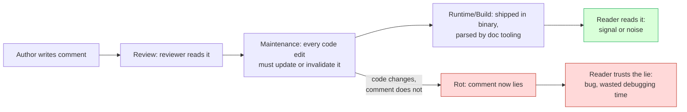
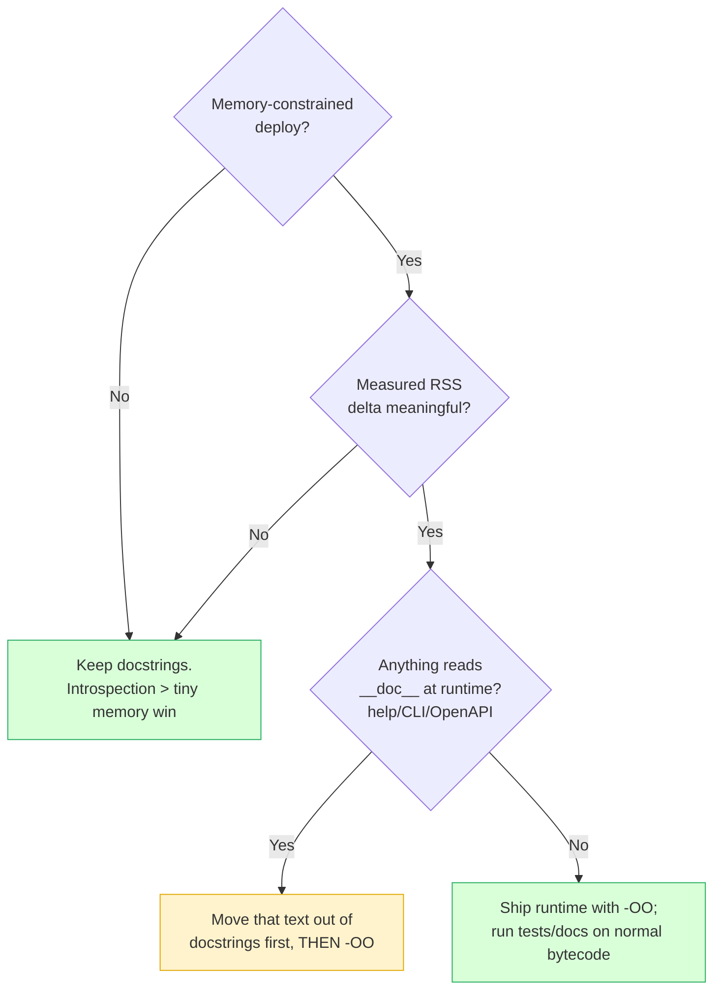

# Comments — Optimize & Reconcile

> The clean-code rules tell you which comments are *good*. This file asks the harder question: what does each comment **cost** over its lifetime, and is that cost worth paying? A comment is not free — it is a second source of truth that must be read on every review, maintained on every code change, shipped in every binary, and trusted on every read. Optimizing comments means maximizing **signal-to-noise** and minimizing **maintenance cost**, plus a handful of real runtime and build-time angles (Python `-OO` docstring stripping, doc-generation build time, executable examples that cannot rot). Each scenario: the situation, the cost/benefit ledger, the principled resolution. Languages: Go, Java, Python.

---

## Table of Contents

1. [Which comments pay rent, which rot fastest](#scenario-1--which-comments-pay-rent-which-rot-fastest)
2. [The redundant comment tax on review throughput](#scenario-2--the-redundant-comment-tax-on-review-throughput)
3. [Two sources of truth: keeping comments DRY with code](#scenario-3--two-sources-of-truth-keeping-comments-dry-with-code)
4. [Executable examples beat prose because they cannot rot](#scenario-4--executable-examples-beat-prose-because-they-cannot-rot)
5. [Python `-OO`: docstrings, memory, and import size](#scenario-5--python--oo-docstrings-memory-and-import-size)
6. [Doc-generation build cost in CI](#scenario-6--doc-generation-build-cost-in-ci)
7. [Generated docs from schemas / OpenAPI as single source of truth](#scenario-7--generated-docs-from-schemas--openapi-as-single-source-of-truth)
8. [The cost of over-documenting trivial code](#scenario-8--the-cost-of-over-documenting-trivial-code)
9. [Comment density vs review throughput](#scenario-9--comment-density-vs-review-throughput)
10. [The misleading comment is worse than no comment](#scenario-10--the-misleading-comment-is-worse-than-no-comment)
11. [Journal & attribution comments vs version control](#scenario-11--journal--attribution-comments-vs-version-control)
12. [Doc-comment lint as a build gate: cost vs payoff](#scenario-12--doc-comment-lint-as-a-build-gate-cost-vs-payoff)
13. [The `// TODO` that becomes a permanent fixture](#scenario-13--the--todo-that-becomes-a-permanent-fixture)
14. [License headers, generated banners, and binary bloat](#scenario-14--license-headers-generated-banners-and-binary-bloat)

- [Rules of Thumb](#rules-of-thumb)
- [Related Topics](#related-topics)

---

## The comment lifecycle cost model

Before the scenarios, fix a mental model. A comment is read and paid for at four distinct stages. Optimizing comments means knowing **where** the cost lands.



The expensive paths are red. A comment that rots (E → F) has **negative** value: it costs more than the absence of any comment, because a reader trusts it and is led astray. The whole discipline below is about steering comments toward the green path (D → G) and away from red.

---

### Scenario 1 — Which comments pay rent, which rot fastest

**Situation.** A 40k-line Go service has ~3,000 comments. A new lead wants to "improve documentation." The naive move is to add more comments everywhere. The optimizing move is to ask: which existing comments earn their keep, and which are liabilities?

Sort comments by **rot rate** (how fast they drift from the code) against **value** (what a reader loses without them):

| Comment kind | Rot rate | Value | Verdict |
|---|---|---|---|
| *Why* this code exists / why a non-obvious choice was made | Low | High | **Pays rent** — keep |
| Public API contract (godoc / Javadoc on exported symbols) | Medium | High | Keep, but pin with executable examples |
| Warning of a non-obvious consequence (`// not thread-safe`) | Low | High | **Pays rent** — keep |
| Restating *what* the next line does | High | Negative | Delete |
| Inline step-by-step narration of an algorithm | High | Low | Replace with named helpers |
| Magic-number / regex explanation | Low | High | Keep |

<details><summary>Resolution</summary>

The cost/benefit pivot is **decoupling from code mechanics**. A comment that explains *why* references intent, which changes rarely. A comment that explains *what* mirrors the code line-by-line, so it must change every time the code changes — and it won't, because nothing fails when it goes stale.

```go
// ROT-PRONE — restates the mechanics, must change with every edit, nothing enforces it
// Loop over users and skip inactive ones, then send each an email
for _, u := range users {
    if !u.Active {
        continue
    }
    send(u)
}

// PAYS RENT — explains a non-obvious WHY; survives refactors of the loop body
// We must email inactive users too for legal dunning notices, EXCEPT those
// who exported their data under GDPR Art. 17 (right to erasure).
for _, u := range users {
    if u.ErasureRequested {
        continue
    }
    send(u)
}
```

Audit rule: for every comment, ask "if I edited the adjacent code and forgot to update this comment, would a test fail or a reviewer notice?" If no, the comment is rot-prone and should either be deleted or converted into something self-enforcing (a test, a name, an executable example). Don't add comments; *triage* them.

</details>

---

### Scenario 2 — The redundant comment tax on review throughput

**Situation.** A team mandates "comment every function." Pull requests now carry one comment per method. A reviewer reviewing a 600-line diff reads twice the text: the code *and* its English paraphrase. Review latency climbs; defect-catch rate per minute drops.

**The cost.** Reviewer attention is the scarcest resource in the lifecycle. Redundant comments don't just waste author time — they **dilute reviewer attention across noise**, so the one comment that actually matters (the subtle concurrency note) is read with the same fatigue as fifty `// getter for name`.

<details><summary>Resolution</summary>

Comments compete with code for the reviewer's finite attention budget. A redundant comment has a *negative* return: it adds reading cost with zero information.

```java
// NOISE — reviewer reads this AND the code; it carries nothing the signature lacks
/**
 * Gets the name.
 * @return the name
 */
public String getName() { return name; }
```

Delete it. `getName()` returning `name` is fully self-documenting. Reserve doc-comments for symbols where the contract is *not* derivable from the signature:

```java
/**
 * Returns the user's display name, falling back to the email local-part
 * if no name was set. Never null; returns "" only for the system account.
 */
public String displayName() { ... }
```

The optimizing metric is **information per word**. Measure it crudely: scan a PR and count comments that restate the signature/code versus comments that add a constraint, a unit, a caveat, or a *why*. A healthy ratio skews hard toward the latter. A "comment everything" policy guarantees the opposite and quietly taxes every future review.

</details>

---

### Scenario 3 — Two sources of truth: keeping comments DRY with code

**Situation.** A retry helper documents its backoff schedule in a comment, and also implements it in code. Six months later someone tunes the code. The comment now describes the old schedule. Two sources of truth diverged — the classic comment rot.

```python
def fetch(url):
    # Retries up to 3 times with 1s, 2s, 4s backoff
    for attempt in range(5):              # someone changed 3 -> 5
        try:
            return _get(url)
        except TransientError:
            time.sleep(0.5 * 2 ** attempt)  # ...and changed the base to 0.5s
```

The comment is now a confident lie. A reader sizing a timeout budget upstream will plan for 7s of retries and actually get ~15.5s.

<details><summary>Resolution</summary>

Apply DRY to documentation: **one source of truth**. Either the comment describes intent (which doesn't duplicate the code), or the value the comment described should *come from* the code.

```python
RETRY_ATTEMPTS = 5
BACKOFF_BASE_S = 0.5

def fetch(url):
    # Exponential backoff; total worst-case delay = BACKOFF_BASE_S * (2**ATTEMPTS - 1).
    # Intent: ride out transient blips without hammering a struggling upstream.
    for attempt in range(RETRY_ATTEMPTS):
        try:
            return _get(url)
        except TransientError:
            time.sleep(BACKOFF_BASE_S * 2 ** attempt)
```

Now the *numbers* live in named constants (single source of truth), and the comment carries only the irreducible *why* and a formula that stays valid regardless of the constant's value. If you genuinely need the schedule documented for downstream consumers, **generate it** rather than hand-copy it:

```python
def backoff_schedule() -> list[float]:
    """The actual delays, derived from the same constants the code uses."""
    return [BACKOFF_BASE_S * 2 ** i for i in range(RETRY_ATTEMPTS)]
```

A doc test or a `__doc__` builder can interpolate `backoff_schedule()` so the documentation literally cannot disagree with the implementation. The principle: when a fact appears in both prose and code, eliminate one copy — usually by making the prose reference the code, not restate it.

</details>

---

### Scenario 4 — Executable examples beat prose because they cannot rot

**Situation.** A `ParseDuration` function has a beautiful doc comment with usage examples. The function's behavior changes (now rejects negative durations). The prose examples still show `ParseDuration("-5m")` succeeding. Prose has no compiler; it rots silently.

**The cost/benefit.** Prose examples are cheap to write and expensive to maintain (they rot invisibly). Executable examples cost slightly more to write but are **maintained by the build** — when the code changes, they fail, forcing an update. The maintenance cost moves from "human discipline" (unreliable) to "CI gate" (reliable).

<details><summary>Resolution</summary>

Prefer the language's executable-example mechanism over prose whenever the example asserts behavior.

**Go** — `Example` functions in `_test.go` files double as godoc examples *and* run under `go test`:

```go
func ExampleParseDuration() {
    d, _ := ParseDuration("90m")
    fmt.Println(d)
    // Output: 1h30m0s
}
```

If `ParseDuration` changes its output format, the `// Output:` comparison fails the build. The example shown in godoc is, by construction, correct.

**Python** — `doctest` runs the examples embedded in docstrings:

```python
def parse_duration(s: str) -> int:
    """Parse '90m' into seconds. Rejects negatives.

    >>> parse_duration("90m")
    5400
    >>> parse_duration("-5m")
    Traceback (most recent call last):
        ...
    ValueError: duration must be non-negative
    """
```

Run with `python -m doctest module.py -v` or wire it into pytest via `--doctest-modules`. The negative-duration example is now an executable assertion; the day someone re-allows negatives, the docstring fails.

**Java** — no built-in doctest, but `{@snippet}` (JDK 18+) can reference a real test method so the snippet is compiled:

```java
/**
 * {@snippet class = DurationExamples region = "parse90m"}
 */
```

The reconciliation: prose explains *why* (cannot be executed, low rot anyway); examples demonstrate *what* (high rot if prose, zero rot if executable). Push every behavior-asserting example into the test-backed mechanism, and let prose carry only intent.

</details>

---

### Scenario 5 — Python `-OO`: docstrings, memory, and import size

**Situation.** A Python service runs on memory-constrained edge devices (256 MB containers, embedded gateways). Startup imports a large dependency tree with verbose docstrings (NumPy-style, hundreds of lines per function). Someone proposes running with `python -OO` to strip docstrings and reclaim memory. Is the tradeoff worth it?

**The mechanism.** `python -O` strips `assert` statements and sets `__debug__ = False`. `python -OO` additionally **removes docstrings** from the compiled bytecode, producing `.pyc` files (cached as `*.opt-2.pyc`) that omit every `__doc__` string. Each module's docstrings are simply not loaded into memory.

<details><summary>Resolution</summary>

Weigh the gain against what breaks:

**What you gain** — docstrings are stored as string objects in `__doc__` for every module, class, and function. In docstring-heavy libraries the savings are real but usually modest (single-digit MB for a typical service; can matter on a 256 MB box or when forking many workers, where every worker pays the same docstring memory).

```bash
# Compare .pyc sizes with and without docstring stripping
python   -m compileall mypkg/          # normal .pyc
python -OO -m compileall mypkg/        # *.opt-2.pyc, docstrings stripped
du -sh mypkg/__pycache__/*.pyc mypkg/__pycache__/*.opt-2.pyc
```

**What you lose / what breaks** — anything that reads `__doc__` at runtime:

```python
# These all break or degrade under -OO:
help(obj)                      # prints "No documentation found"
inspect.getdoc(fn)             # returns None
click / argparse / FastAPI     # CLI help text and OpenAPI descriptions
                               #   sourced from docstrings disappear
doctest                        # finds no tests (docstrings are gone)
pydantic Field(description=)   # fine (not a docstring) — but model docstrings vanish
```

The principled resolution:

1. **Never run tests or generate docs under `-OO`.** Doctests vanish; `help()` lies. Keep `-OO` strictly for the production runtime image, with the doc/test pipeline running on normal bytecode.
2. **Decouple user-facing text from docstrings** if you ship `-OO`. A CLI that derives `--help` from docstrings will go silent; move that text to explicit `help=` arguments so it survives stripping.
3. **Measure before committing.** Profile actual RSS with and without `-OO` (`/usr/bin/time -v python app.py` on Linux, or `tracemalloc` for in-process accounting). If the delta is under a few MB and you have headroom, the lost introspection is rarely worth it. The win shows up mainly in many-worker forking deployments or genuinely tiny containers.



This is the one place where comments/docs have a direct, measurable runtime cost — and even here, the answer is "measure, then strip only the production runtime, never the toolchain."

</details>

---

### Scenario 6 — Doc-generation build cost in CI

**Situation.** A monorepo's CI runs full API-doc generation (Sphinx for Python, `javadoc` for Java, `go doc`/`pkgsite` for Go) on **every** commit. Doc generation now takes 4 minutes of a 9-minute pipeline. Engineers wait on docs they rarely read mid-PR.

**The cost.** Doc generation is CPU- and IO-heavy: it parses every source file, resolves cross-references, renders HTML, and often runs the doc examples. Running it on every commit pays this cost continuously for a benefit consumed occasionally (docs are usually read at release time or by external consumers).

<details><summary>Resolution</summary>

Match the cadence of doc generation to the cadence of doc *consumption*, and cache aggressively.

1. **Don't full-build docs on every commit.** Run doc generation on tags/releases and on `main` merges, not on every push to every feature branch:

```yaml
# Only build & publish docs when it matters
build-docs:
  if: github.ref == 'refs/heads/main' || startsWith(github.ref, 'refs/tags/')
  steps:
    - run: sphinx-build -b html docs/ docs/_build  # or: javadoc / go doc
```

2. **On PRs, validate cheaply instead of building fully.** You want to catch *broken* docs early without paying for full HTML rendering. Run the fast checks only:

```bash
# Python: nitpicky link/reference check is far cheaper than full HTML render on huge trees
sphinx-build -b dummy -n -q docs/ /tmp/docs-check   # parse + ref-check, no HTML
# Go: cheap — examples run as part of normal `go test ./...` anyway
# Java: -Xdoclint:all surfaces malformed Javadoc during the normal compile, no site build
```

3. **Cache the renderer's intermediate state.** Sphinx's `_build/.doctrees` and incremental mode skip unchanged pages; Javadoc has no incremental mode, so scope it to changed modules in a multi-module build.

The reconciliation: doc *correctness* (do examples pass? are references valid?) is cheap and should gate every PR — fold it into the test/compile step that already runs. Doc *publication* (rendering the website) is expensive and should run only when docs are actually shipped. Don't conflate the two and pay publication cost on every push.

</details>

---

### Scenario 7 — Generated docs from schemas / OpenAPI as single source of truth

**Situation.** An HTTP API documents each endpoint twice: once as a hand-written Markdown reference, once as comments on the handler. Both drift from the actual request/response shapes. Clients integrate against the docs and hit 400s because the real payload changed.

**The cost/benefit.** Hand-written API docs are three sources of truth (Markdown, code comments, actual behavior) that must be manually reconciled — an O(N) maintenance burden that humans lose. Schema-generated docs collapse this to **one** source: the schema *is* the contract, the code validates against it, and the docs render from it.

<details><summary>Resolution</summary>

Make the schema the single source of truth and generate everything downstream from it.

**Python (FastAPI)** — the Pydantic model and type hints *are* the schema; OpenAPI and the docs page are generated, so they cannot drift from validation:

```python
class CreateOrder(BaseModel):
    sku: str = Field(description="Catalog SKU, format 'AB-1234'")
    qty: int = Field(gt=0, description="Units to order; must be positive")

@app.post("/orders")
def create_order(body: CreateOrder) -> OrderCreated:
    ...
# /docs (Swagger UI) and /openapi.json are derived from the same model
# that enforces validation. The description on `qty` is the ONLY place it lives.
```

**Go** — keep the OpenAPI spec as the source and generate types from it, so the doc and the struct can't disagree:

```go
//go:generate oapi-codegen -package api -generate types,server openapi.yaml -o api.gen.go
```

The handler signature is generated from `openapi.yaml`; the docs render from `openapi.yaml`; one file, no drift.

**Java (Spring + springdoc)** — annotate the DTO once; `springdoc-openapi` emits the OpenAPI JSON and Swagger UI from the same annotations Bean Validation enforces:

```java
public record CreateOrder(
    @Schema(description = "Catalog SKU, format 'AB-1234'") @NotBlank String sku,
    @Schema(description = "Units to order; must be positive") @Positive int qty
) {}
```

The optimization is structural: replace N hand-maintained copies with one generator. The comment/doc that *describes* a field now lives exactly where the code that *validates* it lives, and the public docs are a build artifact. This is DRY applied across the code/docs boundary — the most leveraged comment optimization available, because it eliminates an entire class of rot rather than fighting it case by case.

</details>

---

### Scenario 8 — The cost of over-documenting trivial code

**Situation.** A style guide demands a full Javadoc block on every method, including trivial accessors and obvious helpers. The codebase swells: a 200-line class becomes 450 lines, half of it doc boilerplate that restates signatures. Every refactor now also edits boilerplate; reviewers skim past doc blocks and miss the rare one that matters.

**The cost.** Over-documentation has three compounding costs: (1) **write cost** for zero-information prose, (2) **maintenance cost** as boilerplate must track signature changes, and (3) **attention erosion** — when 90% of doc blocks are noise, readers stop reading all of them, including the 10% that carry real contracts.

<details><summary>Resolution</summary>

Document at the **boundary of surprise**, not uniformly. The optimizing question is: "would a competent reader be surprised or harmed without this comment?"

```java
// OVER-DOCUMENTED — 6 lines of boilerplate for zero information
/**
 * Sets the active flag.
 * @param active the active flag to set
 */
public void setActive(boolean active) { this.active = active; }

// RIGHT-SIZED — no doc on the trivial setter; full doc only where surprise lives
public void setActive(boolean active) { this.active = active; }

/**
 * Deactivates the account and revokes all live sessions. This is irreversible
 * via the public API; reactivation requires an admin override. Emits an
 * AccountDeactivated event that downstream billing consumes synchronously.
 */
public void deactivate() { ... }
```

Operationalize it with **lint scope**, not a blanket mandate:

- **Java**: `-Xdoclint:all` warns about *malformed* Javadoc but does not force you to write Javadoc on everything. Don't add a "Javadoc required on all public members" check; require it only where the contract isn't self-evident (and accept that this is a judgment call reviewers make, not a robot).
- **Python**: tools like `pydocstyle`/`ruff`'s docstring rules can be scoped to public modules/classes only (`D1xx` selectively), skipping trivial `__init__` and dunder methods.
- **Go**: `golint`/`revive` flag missing comments on *exported* identifiers — which is the correct boundary (the public API surface), not every function.

The principle from clean code holds at the cost level too: the ideal comment density is not "maximum," it is "every comment earns its place." A policy that mandates uniform documentation guarantees that most comments do not.

</details>

---

### Scenario 9 — Comment density vs review throughput

**Situation.** Two teams ship comparable features. Team A writes terse code with sparse, high-value comments. Team B writes "self-documenting" prose-heavy code. Team A's PRs review faster *and* catch more defects per review-hour. Leadership wants to know whether to mandate more comments to "help reviewers."

**The cost/benefit.** Reviewer throughput is bounded by *lines read*, not lines of logic. Every comment a reviewer reads is a line not spent scrutinizing logic. Comments help review throughput **only** when they let the reviewer skip understanding something they'd otherwise have to reverse-engineer (a non-obvious *why*, an external constraint). Comments that paraphrase visible code strictly reduce throughput.

<details><summary>Resolution</summary>

Optimize for **comments that let a reviewer go faster**, not comments that exist for their own sake.

A reviewer reading this:

```go
// We cap the batch at 500 because the downstream Stripe API rejects
// arrays longer than that with a 413, and their limit is undocumented.
const maxBatch = 500
```

...can accept `maxBatch = 500` *without investigating it* — the comment answered the only question they'd have asked. That comment **buys** review throughput.

A reviewer reading this:

```go
// set max batch to 500
const maxBatch = 500
```

...gains nothing and still has to wonder "why 500?". The comment cost a line and bought nothing.

Heuristic for a reviewer-throughput audit: a comment is throughput-positive if removing it would force the reviewer to ask a question. If the reviewer would never ask the question (because the code answers it), the comment is throughput-negative. The reconciliation with clean code: "self-documenting code" doesn't mean *no* comments — it means the code carries the *what* so the comments are free to carry the *why*, which is exactly the information a reviewer can't derive and most needs.

</details>

---

### Scenario 10 — The misleading comment is worse than no comment

**Situation.** A function comment says `// returns null if not found`. The code was changed to throw `NotFoundException`. A caller, trusting the comment, writes `if (result == null)` — dead code that never fires — and never handles the exception. Production crashes.

**The cost.** This is the most expensive failure mode in the entire lifecycle. A *missing* comment costs the reader some investigation time. A *wrong* comment costs a bug, plus the debugging time to discover the comment lied, plus the erosion of trust in *every other comment* in the codebase (once burned, readers stop trusting comments — which destroys the value of the good ones).

<details><summary>Resolution</summary>

Make behavior-claims **self-enforcing** so the comment cannot outlive its truth.

```java
// FRAGILE — prose claim, no enforcement, silently rots
// Returns null if the user is not found.
public User find(String id) {
    return repo.findById(id).orElseThrow(NotFoundException::new);  // comment now lies
}
```

Replace the prose claim with a test that *is* the documentation and fails when the behavior changes:

```java
@Test
void find_throwsWhenMissing() {
    assertThrows(NotFoundException.class, () -> service.find("nope"));
}
```

And let the type carry the contract where the language allows it:

```java
// The signature itself documents nullability — no prose to rot
public Optional<User> find(String id) { ... }
```

The reconciliation: of all comment categories, **behavior claims** rot the most dangerously, because readers act on them. Move every behavior claim out of prose and into something the compiler or test suite verifies — types (`Optional`, Go's explicit error returns, Python type hints + mypy), tests, and executable examples. Reserve prose for the genuinely unverifiable (intent, external constraints, history of a decision), which by its nature doesn't rot the same way. A comment you cannot enforce is a comment you cannot trust, and an untrustworthy comment is a net liability.

</details>

---

### Scenario 11 — Journal & attribution comments vs version control

**Situation.** Files accumulate change-log comments: `// 2021-03: added retry, -Alice`, `// 2022-08: fixed NPE, -Bob`. A new dev reads 30 lines of stale history before reaching the actual logic. The "history" duplicates what `git log` and `git blame` already store — better, searchable, and never stale.

**The cost.** Journal/attribution comments are pure duplication of version-control metadata, with strictly worse properties: they're unsearchable across files, they're never pruned (so they grow unboundedly), they push real code below the fold, and they go stale (an entry can describe code that was later reverted).

<details><summary>Resolution</summary>

Delete them; the data lives in git, losslessly and queryably.

```python
# DELETE ALL OF THIS — git already has it, better:
# 2021-03-14: added retry logic - alice
# 2021-06-02: bumped timeout to 30s - bob
# 2022-08-19: fixed race condition in close() - carol
def fetch(url): ...
```

The information these comments *try* to provide is recovered far more powerfully from version control:

```bash
git log --follow -p path/to/file.py      # full history of this file, with diffs
git blame path/to/file.py                # who last touched each line, and in which commit
git log -S "timeout"                     # every commit that added/removed the string "timeout"
```

The one legitimate kernel inside a journal comment — *why* a change was made — belongs in the **commit message**, where it's permanently linked to the exact diff it explains and to the issue tracker:

```
fix(http): widen retry to cover 429s

Stripe started returning 429 under our burst load; the old retry only
caught 5xx, so rate-limit responses fell through as hard failures.
Closes #4821.
```

The reconciliation: this is DRY across the comment/VCS boundary. History and attribution have a system of record — git — that is purpose-built, searchable, and self-maintaining. Duplicating it in comments creates a second, worse, unmaintained copy. Optimize by deleting the copy and investing in good commit messages instead.

</details>

---

### Scenario 12 — Doc-comment lint as a build gate: cost vs payoff

**Situation.** A team considers failing the build on any missing or malformed doc comment, to force documentation discipline. The question is whether the gate's cost (slower builds, friction, gaming) pays for the consistency it buys.

**The cost/benefit.** A doc-lint gate is cheap to run but has a behavioral cost: under a "comment required" gate, engineers satisfy the *letter* (a doc block exists) without the *spirit* (it carries information), producing exactly the redundant-comment noise of Scenario 2 — now mandated by CI.

<details><summary>Resolution</summary>

Gate on **malformed** docs and **public-surface** coverage, never on "every symbol must have prose."

What's worth gating (low cost, high payoff, ungameable):

```bash
# Java — fail on BROKEN Javadoc (bad @param, dead @link), folds into compile, near-zero cost
javac -Xdoclint:all,-missing ...   # check syntax/links, do NOT require presence everywhere

# Go — vet checks that doc examples compile and // Output: matches; runs with normal tests
go test ./...                       # Example funcs are verified for free

# Python — fail on docstrings whose stated args don't match the signature
#   (darglint / ruff DAR rules) — a real-correctness check, not a presence check
```

What's *not* worth gating (high friction, easily gamed): "public method must have a docstring." This produces `"""Sets the name."""` boilerplate to appease the linter. If you want coverage on the public API specifically, scope it to *exported* symbols only (Go's `revive` exported rule, Python `pydocstyle` `D1` on public modules) and treat it as a warning that informs review, not a hard gate.

The principled split: **enforce correctness, suggest coverage**. Correctness (links resolve, `@param` names match, examples pass) is objective, cheap, and impossible to game — gate on it hard. Coverage (does a doc exist) is gameable and only valuable when the doc is actually informative, which a linter cannot measure — so surface it, but let human reviewers judge whether a given symbol needs prose. A gate that mandates presence optimizes for the wrong variable and manufactures noise.

</details>

---

### Scenario 13 — The `// TODO` that becomes a permanent fixture

**Situation.** The codebase has 340 `// TODO` and `// FIXME` comments, the oldest from four years ago. Nobody knows which are live and which are archaeology. New `TODO`s are added faster than old ones are resolved. The signal ("this needs work") is buried in noise ("this needed work, once, maybe, who knows").

**The cost.** An unbounded `TODO` backlog in comments is a tracker with no triage, no owner, and no expiry. Each one costs a reader a moment of "is this still relevant?" and the aggregate cost of an untrusted marker class is that nobody acts on *any* of them — including the urgent ones.

<details><summary>Resolution</summary>

Give every `TODO` an owner and a link, and gate the unactionable ones out.

```go
// WEAK — anonymous, dateless, will live forever
// TODO: handle pagination

// STRONG — links to a tracked, ownable, closable item
// TODO(#5821): handle pagination once the cursor API lands (blocked on platform team)
```

Then enforce a lightweight policy in CI so the backlog can't rot:

```bash
# Fail the build on bare TODOs that lack an issue reference, forcing them into the tracker
grep -rEn 'TODO|FIXME' --include='*.go' . \
  | grep -vE 'TODO\(#[0-9]+\)' \
  && { echo "Bare TODO found — link an issue: TODO(#123)"; exit 1; }
```

For Go specifically, `staticcheck`/`go vet` recognizes the canonical `// TODO(name):` form. The deeper move is to recognize that a `TODO` is **deferred work pretending to be a comment**. Real deferred work belongs in the issue tracker, which has assignment, prioritization, and closure. A `TODO` comment is acceptable only as a *pointer* to that tracked item (so a reader at the code site sees it), never as the sole record. The reconciliation: comments are a poor work-tracking system (no triage, no expiry, file-local); use them to *reference* the real one, and gate out the orphans so the marker class stays trustworthy.

</details>

---

### Scenario 14 — License headers, generated banners, and binary bloat

**Situation.** Every source file opens with a 20-line license header. A generated-code file carries a 5-line `// Code generated by X; DO NOT EDIT.` banner repeated across 400 files. Someone worries this bloats the shipped binary and slows compilation.

**The cost/benefit.** Comments are stripped at compile time in Go, Java, and (mostly) compiled-Python bytecode — so license headers cost **zero** binary size and effectively zero compile time. The real cost is human: 20 lines of boilerplate above every file pushes code below the fold and trains readers to scroll past the top of files (where, occasionally, a *real* file-level doc comment lives).

<details><summary>Resolution</summary>

Separate the two concerns: **legal/tooling banners** (necessary, machine-relevant) from **human documentation** (the thing readers should actually see at the top).

1. **Binary size is a non-issue.** Comments do not survive compilation:

```bash
# Go: comments are gone after compilation; license headers add nothing to the binary
go build -o app . && ls -la app    # size is unaffected by header comments

# Java: comments are stripped to .class; only @Retention(RUNTIME) annotations survive,
#       and Javadoc is never in the bytecode at all
```

   So never strip license headers "for size" — there's nothing to gain.

2. **`DO NOT EDIT` banners are load-bearing for tooling**, not humans: linters, code review, and codegen tools key off the exact `// Code generated .* DO NOT EDIT\.` regex (Go's tooling treats matching files specially — e.g. excluding them from some checks). Keep them verbatim; don't "tidy" them.

3. **The human cost is solved by placement, not deletion.** Keep the license header (legal requirement) but ensure the *file's own* doc comment — the package/module overview a reader actually wants — is distinct and prominent:

```go
// Copyright 2026 Acme Corp. SPDX-License-Identifier: Apache-2.0   <- legal, terse, one line where possible

// Package billing reconciles Stripe webhooks against the local ledger    <- the doc readers want
// and is the single source of truth for invoice state transitions.
package billing
```

   Prefer the single-line SPDX identifier over a 20-line verbatim license block where your legal team permits it — it satisfies the legal requirement with one line instead of pushing real documentation 20 lines down.

The reconciliation: the runtime/build cost of comments is essentially nil (they're stripped), so optimize purely for the **human** reading cost — keep mandatory banners minimal and unambiguous, and never let them crowd out the file's actual documentation.

</details>

---

## Rules of Thumb

- **Comments compete with code for the reader's attention budget.** Every comment must buy more attention than it spends. Redundant comments run at a loss.
- **A wrong comment is worse than no comment.** Missing docs cost investigation time; lying docs cost bugs *plus* the erosion of trust in every other comment.
- **Triage comments by rot rate × value.** *Why*-comments and external-constraint warnings are low-rot/high-value (keep). *What*-comments mirroring the code are high-rot/negative-value (delete).
- **Make behavior claims self-enforcing.** Push every "returns null if…", "retries 3 times", "thread-safe" claim into a type, a test, or an executable example so it fails the build when it goes stale.
- **Apply DRY across the code/docs boundary.** When a fact lives in both prose and code, eliminate one copy — usually by generating docs from the schema/OpenAPI/constants rather than hand-copying.
- **Executable examples beat prose examples** wherever an example asserts behavior: Go `Example` funcs, Python `doctest`, Java `{@snippet}`. They're maintained by CI, not by human discipline.
- **`python -OO` strips docstrings — measure before using it.** Worth it only for genuinely memory-constrained or many-worker deploys, and only after moving any `__doc__`-derived user text (CLI help, OpenAPI descriptions) out of docstrings. Never run tests/doc-gen under `-OO`.
- **Separate doc *correctness* from doc *publication* in CI.** Validate links/examples cheaply on every PR (it folds into compile/test); render and publish the doc site only on releases.
- **Gate on malformed docs, not missing docs.** Correctness checks (links resolve, `@param` matches, examples pass) are cheap and ungameable; presence mandates manufacture boilerplate noise.
- **Don't journal in source.** History, attribution, and dates belong in `git log`/`git blame` and commit messages — searchable, self-maintaining, never crowding out code.
- **Comments are stripped at compile time** in Go/Java/Python bytecode — they cost ~0 binary size. Optimize comments for the human reader, never for the binary.
- **A `TODO` is a pointer, not a tracker.** Link it to an issue (`TODO(#123)`) and gate out the orphans, or it becomes permanent archaeology.

---

## Related Topics

- [find-bug.md](find-bug.md) — comment-related defects: outdated comments that contradict the code, misleading docs, and the bugs they cause.
- [professional.md](professional.md) — interview-grade Q&A on commenting discipline across all levels.
- [Chapter README](../README.md) — the positive rules: which comments to write and how.
- [../../functional-programming/README.md](../../functional-programming/README.md) — pure functions and types-as-documentation reduce the need for prose comments; the strongest "comment" is often a type signature.
- [../../refactoring/README.md](../../refactoring/README.md) — Extract Method/Variable replace explanatory comments with self-documenting names, eliminating rot at the source.
