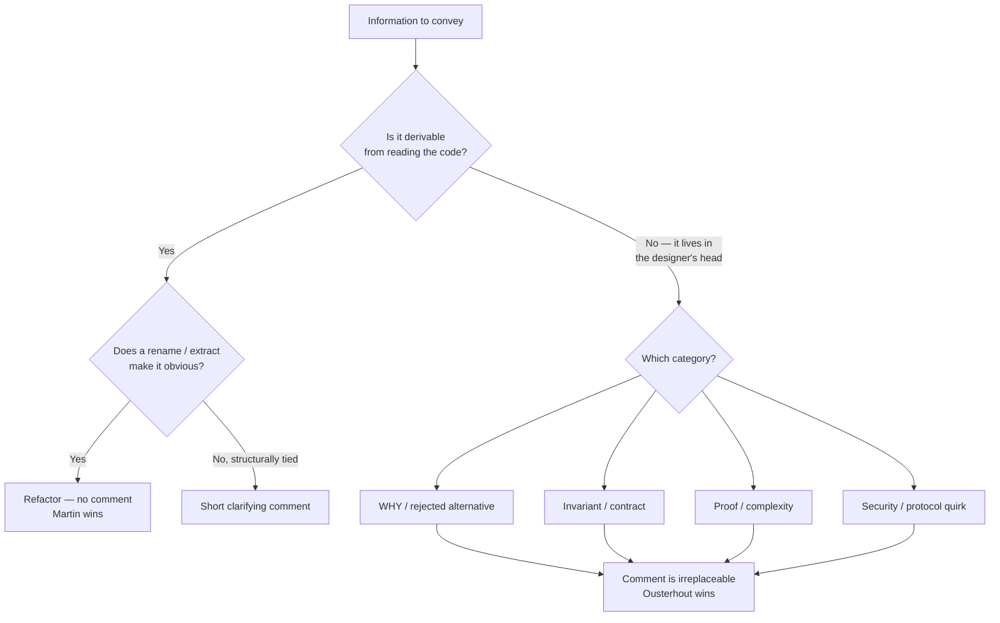

# Comments — Professional Level

> Focus: the deep end and the exceptions to *"comments are a failure."* Where comments are **irreplaceable** — non-local invariants, complexity proofs, why-not rationale, security and protocol quirks, formal contracts — and the Ousterhout counter-position that directly challenges Martin's comment-minimalism. Evidence over dogma.

---

## Table of Contents

1. [The two doctrines: Martin vs. Ousterhout](#the-two-doctrines-martin-vs-ousterhout)
2. [Comments the code physically cannot express](#comments-the-code-physically-cannot-express)
3. [Non-local invariants and protocol contracts](#non-local-invariants-and-protocol-contracts)
4. [Why-not comments: rejected alternatives](#why-not-comments-rejected-alternatives)
5. [Complexity proofs and correctness arguments](#complexity-proofs-and-correctness-arguments)
6. [Security and cryptography rationale](#security-and-cryptography-rationale)
7. [Hardware, protocol, and standards quirks](#hardware-protocol-and-standards-quirks)
8. [Doc-comments as the API contract](#doc-comments-as-the-api-contract)
9. [Literate programming and comment-driven design](#literate-programming-and-comment-driven-design)
10. [Empirical research on comments and maintenance](#empirical-research-on-comments-and-maintenance)
11. [Case study: removing a comment causes a future defect](#case-study-removing-a-comment-causes-a-future-defect)
12. [Common Mistakes](#common-mistakes)
13. [Test Yourself](#test-yourself)
14. [Cheat Sheet](#cheat-sheet)
15. [Summary](#summary)
16. [Further Reading](#further-reading)
17. [Related Topics](#related-topics)

---

## The two doctrines: Martin vs. Ousterhout

Two of the most-cited books on code quality reach **opposite conclusions** about comments. A senior engineer must understand both and know when each applies.

**Robert C. Martin (*Clean Code*, 2008):**

> "The proper use of comments is to compensate for our failure to express ourselves in code. Note that I used the word *failure*. I meant it. Comments are always failures."

Martin's position is *comment-minimalism*: every comment is a missed opportunity to rename a variable, extract a method, or restructure logic. Comments rot because they are not executed and not tested; the compiler never checks them. His remedy is almost always "make the code clearer instead."

**John Ousterhout (*A Philosophy of Software Design*, 2018, ch. 13):**

> "Comments should describe things that aren't obvious from the code."
>
> "The overall idea behind comments is to capture information that was in the mind of the designer but couldn't be represented in the code."

Ousterhout's position is a direct, evidence-based pushback. His central claim: **code is fundamentally incapable of expressing certain categories of information** — *why* a thing is done, what *abstraction* a method presents, what invariants hold across module boundaries, what was deliberately *not* done. "In-code expression" cannot replace these because the information is not, and never was, in the code.

The two are not symmetric opinions; they partition different territory:

| | Martin | Ousterhout |
|---|---|---|
| What a comment restates ("the what") | Always a failure — fix the code | Agrees — redundant comments are noise |
| Why the code exists ("the why") | Mostly silent; treats as edge case | The *primary* legitimate use of comments |
| Abstraction / interface contract | "Self-documenting code" | Comments **define** the abstraction; code alone underspecifies it |
| Default stance | Delete the comment, improve the code | Write the comment the code can't replace |

The synthesis most senior teams adopt: **Martin is right about the *what*; Ousterhout is right about the *why* and the *contract*.** Redundant comments are a real smell (see [`../00-criticisms.md`](../00-criticisms.md) and the chapter [`README.md`](README.md)). But the conclusion "comments are always failures" is too strong — it conflates the failure mode (restating code) with the entire practice, and it ignores the irreducible categories below.



---

## Comments the code physically cannot express

The decisive question is not "could the code be clearer?" but **"is this information present in the code at all?"** Four categories are *not* recoverable by any refactor, because they describe knowledge external to the program text.

1. **Intent / why.** The code shows *what* happens. It cannot show why *this* approach was chosen over the obvious alternative, what business rule motivates it, or what bug it fixes.
2. **Non-local invariants.** A field's legal range, or a relationship between two objects in different files, is enforced by convention across the codebase — no single expression states it.
3. **Negative knowledge ("why-not").** Code records decisions taken. It cannot record decisions *rejected* — the cheaper-looking path that is actually wrong.
4. **External constraints.** RFC clauses, CPU errata, vendor bugs, regulatory requirements. These originate outside the source tree.

Ousterhout calls failing here the *"comments should be at a different level of detail than the code"* rule: a good comment is **either more abstract** (the precise interface contract) **or captures information not in the code** (the why). A comment that operates at the *same* level as the code — paraphrasing it — is Martin's "failure," and both authors agree it should die.

---

## Non-local invariants and protocol contracts

The most underrated legitimate comment documents an **invariant the type system cannot encode**. When a guarantee spans methods, fields, or files, no single line of code asserts it — so the maintainer who edits one side has no way to know the other side depends on it.

```go
// invariant: entries is sorted by expiresAt ascending, and head() is always
// the soonest-to-expire entry. evict() and the background sweeper both rely
// on this; if you insert out of order, the sweeper will leak expired keys
// silently (no panic, no test failure until prod). Use insertSorted, never append.
type ttlQueue struct {
    mu      sync.Mutex
    entries []entry // sorted by expiresAt; see invariant above
}
```

Remove that comment and the next engineer "optimizes" `insertSorted` into `append` — the code still compiles, tests pass (because no test exercises out-of-order insertion under sweep), and the leak ships. The comment is the *only* artifact that links the data layout to the two distant consumers. This is precisely the case where Martin's "extract a method" does not help: there is no method to extract; the invariant is a cross-cutting property.

Java's `@GuardedBy` (JSR-305 / Error Prone) is a structured form of the same idea — a machine-checkable lock invariant:

```java
public final class Account {
    private final Object lock = new Object();

    @GuardedBy("lock")               // checked by Error Prone at build time
    private long balanceCents;       // INVARIANT: never negative; debit() enforces

    void debit(long cents) {
        synchronized (lock) {
            if (cents > balanceCents) throw new InsufficientFunds();
            balanceCents -= cents;   // safe: invariant + guard
        }
    }
}
```

Prefer machine-checkable annotations where they exist (`@GuardedBy`, `@NonNull`, Go's `//go:build` constraints, Python's `typing.Final`). When no annotation can express the property, the comment is the contract.

---

## Why-not comments: rejected alternatives

A *why-not* comment records the road not taken. It is the single highest-value comment category because it stops the next engineer from "fixing" something into a regression — what Chesterton's Fence describes: do not remove a fence until you know why it was put up.

```python
# We poll every 5s instead of using the vendor's webhook (the obvious choice).
# Their webhook drops events during their nightly maintenance window without
# any redelivery (confirmed: support ticket #48211, 2025-03). Polling is the
# only path that survives that window. Do NOT switch to webhooks until they
# ship at-least-once delivery — verify on their changelog first.
POLL_INTERVAL = timedelta(seconds=5)
```

Nothing in the code can express "we evaluated webhooks and they are broken in a way that costs us money." That knowledge is *negative* — the absence of the webhook call is invisible. Without the comment, the rejected alternative looks like an oversight, and a well-meaning refactor reintroduces the bug. Git history *theoretically* holds this, but `git blame` on a line that was never written returns nothing; you cannot blame the road not taken.

Compare to a journal comment (`// 2025-03: tried webhooks`) — which the [`README.md`](README.md) anti-patterns rightly reject — the why-not comment is durable design rationale, not a changelog entry. The distinction: a journal records *when something happened*; a why-not records *why the current shape is correct and the alternative is not*.

---

## Complexity proofs and correctness arguments

Non-obvious algorithms need a comment carrying the **proof of correctness or the complexity argument**, because the code shows the steps but never the reasoning that the steps are *sufficient*.

```go
// Boyer–Moore majority vote. Correctness: if an element appears > n/2 times,
// pairing each non-majority element with a distinct majority element cancels
// at most (n - count(maj)) < count(maj) votes, so `candidate` survives with
// count > 0. This is why a SECOND pass to verify is required only when a
// majority is NOT guaranteed — here the caller guarantees one, so we skip it.
// Time O(n), space O(1).
func majority(nums []int) int {
    candidate, votes := 0, 0
    for _, n := range nums {
        if votes == 0 {
            candidate = n
        }
        if n == candidate {
            votes++
        } else {
            votes--
        }
    }
    return candidate
}
```

A maintainer who does not know the cancellation argument will "add safety" with a verification pass — wasting O(n) and signaling the algorithm is not understood, or worse, will doubt the single-pass version and rewrite it incorrectly. The proof comment is load-bearing: it is the only place the *why this terminates correctly* lives. This is irreducibly outside the code; you cannot rename your way to a proof.

The same applies to numerical stability ("subtract the max before `exp` to avoid overflow — softmax is shift-invariant"), bit-twiddling tricks, and any code whose correctness is non-obvious to a competent reader.

---

## Security and cryptography rationale

Security code is where comment-minimalism is actively dangerous. The correct implementation often looks *wrong* — slower, more convoluted, or redundant — and a reviewer or maintainer who "cleans it up" introduces a vulnerability.

```python
import hmac

def verify_token(provided: str, expected: str) -> bool:
    # SECURITY: hmac.compare_digest is constant-time. Do NOT replace with
    # `provided == expected`. String == short-circuits on the first mismatched
    # byte, leaking timing info that lets an attacker recover the token byte by
    # byte (a few thousand requests per byte). This is a CWE-208 timing channel.
    return hmac.compare_digest(provided, expected)
```

```go
// SECURITY: bcrypt cost is 12, NOT the library default. Cost 10 is ~65ms on
// our hardware; 12 is ~250ms. We accept the latency to stay ahead of GPU
// cracking economics (OWASP password storage guidance, 2024). Lower this only
// with security sign-off; raising it past 13 risks login-time DoS at peak QPS.
const bcryptCost = 12
```

Here the comment encodes a *threat model and a cost/benefit decision* — knowledge that is by definition not in the source. Removing the `== is not constant-time` comment is an invitation for the next refactor to introduce a timing oracle that no functional test will ever catch. For the deeper treatment, the underlying cryptographic primitives (constant-time comparison, password hashing) are covered elsewhere; the point for *this* chapter is that the **rationale must live next to the code** because the code looks indistinguishable from a less-secure version.

---

## Hardware, protocol, and standards quirks

When code exists to work around something *external* — a CPU erratum, a vendor bug, an RFC clause, a wire-format constraint — the workaround looks arbitrary without a citation. The comment is a pointer into the external world.

```java
// HTTP/1.1 (RFC 9112 §9.6): a server MAY close a persistent connection at any
// time. A request sent on a connection the server is closing yields a stale
// connection IOException that is NOT a real failure. We retry idempotent
// requests exactly ONCE on this specific exception. See also: Apache HttpClient
// "NoHttpResponseException" — same root cause. Do not widen the retry; non-
// idempotent requests must not auto-retry (risk of double-charge).
private boolean isStaleConnection(IOException e) { ... }
```

```go
// Workaround for Linux epoll edge-trigger semantics: after EAGAIN we MUST
// drain the socket fully or epoll will not re-notify (man epoll(7), "Edge-
// triggered"). Removing this loop causes silent stalls under load that do not
// reproduce in tests (which use level-triggered behavior via the netpoller).
for {
    n, err := conn.Read(buf)
    ...
}
```

The defining feature: a reader with full command of the language still cannot infer *why* the code is shaped this way, because the cause is in a spec or a chip, not in the program. A bare RFC section number plus a one-line summary is worth more than any amount of "self-documenting" restructuring.

---

## Doc-comments as the API contract

For any code consumed by others — a library, a service interface, a shared module — the doc-comment **is the abstraction**. Ousterhout's strongest claim is that the interface comment lets a caller use the unit *without reading its body*; the code alone is an underspecification because it conflates accidental behavior with the guaranteed contract.

Each ecosystem has a first-class tool that makes doc-comments machine-consumable, which is why they are not "just comments":

**Go** — `godoc`. A doc comment is a complete sentence starting with the identifier name; it becomes the package's published API surface.

```go
// Fetch retrieves the user by id. It returns ErrNotFound if no such user
// exists, and a wrapped network error otherwise. Fetch is safe for concurrent
// use. The returned User is a copy; mutating it does not affect storage.
func (s *Store) Fetch(ctx context.Context, id UserID) (User, error) { ... }
```

**Java** — Javadoc. `@param`, `@return`, `@throws` are *part of the contract*, and the documented exceptions are as binding as the signature.

```java
/**
 * Transfers {@code cents} from {@code from} to {@code to} atomically.
 *
 * @param cents amount in cents; must be positive
 * @return the new balance of {@code from}
 * @throws InsufficientFundsException if {@code from} lacks {@code cents}
 * @throws IllegalArgumentException if {@code cents <= 0}
 * @implNote acquires both account locks in account-id order to avoid deadlock
 */
public long transfer(Account from, Account to, long cents) { ... }
```

Note `@implNote` vs `@apiNote`: Java's Javadoc formally separates *contract* (binding on callers) from *implementation note* (advice that may change). That separation is exactly Ousterhout's "interface vs. implementation comment" distinction, baked into the tooling.

**Python** — docstrings, surfaced by `help()`, IDEs, and Sphinx. The docstring is queryable at runtime via `obj.__doc__`, and doctests make examples *executable* — the rare comment the compiler does check:

```python
def clamp(x: float, lo: float, hi: float) -> float:
    """Constrain x to [lo, hi].

    >>> clamp(5, 0, 10)
    5
    >>> clamp(-3, 0, 10)
    0

    Raises ValueError if lo > hi.
    """
```

Doctests close the classic objection — "comments aren't tested, so they rot." A doctest *is* tested by `pytest --doctest-modules`; an outdated example fails CI. This is the strongest available counter to Martin's "comments are not maintained" argument: tooling can maintain them.

---

## Literate programming and comment-driven design

**Literate programming** (Donald Knuth, 1984) inverts the relationship entirely: a program is a *document written for humans* that happens to contain extractable code. Knuth's `WEB`/`CWEB` systems let you write prose in arbitrary order, with code fragments woven in; a `tangle` step extracts compilable source, a `weave` step produces typeset documentation.

> "Let us change our traditional attitude to the construction of programs: Instead of imagining that our main task is to instruct a *computer* what to do, let us concentrate rather on explaining to *human beings* what we want a computer to do." — Knuth, *Literate Programming* (1984)

Pure literate programming never went mainstream, but its descendants are everywhere: Jupyter notebooks, R Markdown, Go's *example functions* (`func ExampleFetch()` runs as a test *and* renders in godoc), and Rust's doctests. The durable lesson is that **explanation and code are co-equal artifacts**, not code with explanation bolted on.

**Comment-driven design (CDD)** is the practical, lightweight version: write the doc-comment / interface contract *first*, before the body. Writing the contract forces you to decide what the abstraction *is* before you are anchored by an implementation. If the comment is hard to write — vague, full of "and also," riddled with exceptions — the abstraction is wrong, and you have learned that for the price of a sentence rather than a day of code. This is the same discipline as test-first development, applied to the human-facing contract.

---

## Empirical research on comments and maintenance

The Martin-vs-Ousterhout debate is largely settled by *opinion and experience*; the empirical literature is thinner but real, and a senior engineer should cite evidence rather than dogma.

- **Comment density correlates weakly, not strongly, with quality.** Studies of large OSS corpora find that *high* comment density is not a reliable signal of maintainability; what matters is the *kind* of comment. (Aman et al.; and the broad survey in *A Large-Scale Study on the Usage of Java's Concurrent Programming Constructs* and follow-ons consistently find density alone is a poor proxy.)
- **Outdated comments are a measurable hazard.** Tan et al., *"/* iComment: Bugs or Bad Comments? */"* (SOSP 2007) mined Linux/Mozilla and showed comment–code inconsistencies are real bugs and detectable automatically. The same group's *aComment* and *@tComment* extended this to lock and null-pointer contracts. Conclusion: outdated comments do *not* merely confuse — they cause defects, which is the empirical core of Martin's worry.
- **Developers rely on comments to build mental models.** Eye-tracking and program-comprehension studies (e.g., work by Maletic, Rilling, and the ICPC community) show developers read comments early in comprehension tasks and use them to decide *where* to read code in depth. This supports Ousterhout: comments at the *interface* level accelerate comprehension disproportionately to their length.
- **The actionable synthesis:** the evidence does not vindicate either extreme. It vindicates a *typed* view — restating comments are worthless-to-harmful (Martin), interface/why/invariant comments measurably aid comprehension and catch bugs (Ousterhout). Optimize the *ratio*, not the *count*.

---

## Case study: removing a comment causes a future defect

A real, reconstructable failure mode that proves comments are not "always" removable.

**Original code (correct):**

```java
// Order matters: applyTax must run AFTER applyDiscount. Tax is computed on the
// post-discount subtotal per US sales-tax rules (the discount reduces the
// taxable base). Swapping these overcharges tax — a compliance issue, not just
// a rounding bug. Verified against the finance team's spec, doc FIN-114.
total = applyTax(applyDiscount(subtotal));
```

**A "cleanup" PR** removes the comment ("self-evident from the names") and, six months later, a refactor reorders the pipeline for "readability":

```java
// after refactor — looks cleaner, is WRONG:
var taxed = applyTax(subtotal);
total = applyDiscount(taxed);   // tax now computed on pre-discount base
```

Every unit test still passes — the tests assert each function in isolation, and no test pins the *ordering* against the finance spec (because the engineer didn't know one existed). The bug is a **systematic overcharge** that surfaces in an audit, not a stack trace. The comment was the only artifact encoding the ordering constraint and its legal basis; deleting it deleted the team's institutional memory.

**Lessons:**

1. The function names (`applyTax`, `applyDiscount`) were genuinely clear — Martin's "make the code self-documenting" was *satisfied* and still insufficient. The missing information (ordering, legal basis) was never expressible in names.
2. The right defense is *both*: keep the rationale comment **and** add a test that pins the order (`assertTaxComputedOnDiscountedBase`). Comments and tests are complementary contract carriers, not substitutes.
3. "Self-evident from the names" is the most dangerous justification for deleting a comment. If the information were in the names, the comment would be redundant; the fact that the deletion *enabled* a regression proves it was not.

---

## Common Mistakes

- **Treating "comments are failures" as a literal rule.** Deleting why/invariant/proof comments because a style guide quotes Martin out of context. The quote targets *restating* comments; it does not license deleting design rationale.
- **Writing the *what* and calling it a *why*.** `// loop over users` is a what. `// users must be processed oldest-first so retries preserve causal order` is a why. Only the second earns its place.
- **Letting comments and code drift.** The legitimate version of Martin's critique. Mitigate with executable comments (doctests, Go examples) and machine-checked annotations (`@GuardedBy`, `@NonNull`) wherever the property allows.
- **Putting rationale in commit messages instead of code.** `git blame` cannot surface the road not taken, and squash-merges bury the message. Durable *why-not* and invariant rationale belongs in the source, next to the code it governs.
- **Over-documenting trivial internals while under-documenting interfaces.** Effort should flow to the *interface* doc-comment (the contract many callers depend on), not to private helpers whose readers can see the body.
- **Citing "security" or "performance" with no evidence.** `// fast` is noise. `// constant-time to avoid CWE-208 timing oracle` is a contract. A rationale comment without a *reason* is just an assertion.
- **Deleting a comment because the code is "clean now."** The case study's exact failure. Before deleting, ask Chesterton's question: *why was this here?* If you cannot answer, you may not delete it.

---

## Test Yourself

**1. Reconcile Martin's "comments are always failures" with Ousterhout's "comments capture what code can't." Are they contradictory?**

<details><summary>Answer</summary>

They partition different territory rather than contradict. Martin targets comments that *restate code* (the "what") — those are failures, fixable by clearer code. Ousterhout targets information that was *never in the code* (the "why," the abstraction contract, cross-module invariants) — that cannot be refactored into existence. The synthesis: Martin is right about the *what*; Ousterhout is right about the *why* and the *interface contract*. The error is reading Martin's slogan as covering *all* comments when it was aimed at redundant ones.
</details>

**2. Name four categories of information that no refactor can move into the code. Why are they irreducible?**

<details><summary>Answer</summary>

(1) **Intent / why** — the chosen approach over alternatives; (2) **non-local invariants** — relationships spanning files/methods that no single expression states; (3) **why-not / rejected alternatives** — negative knowledge, invisible because the rejected code was never written; (4) **external constraints** — RFCs, CPU errata, vendor bugs, regulations. All are irreducible because the information originates *outside the program text* — in a person's reasoning or an external spec — so there is nothing in the code to rename or extract.
</details>

**3. Why is a *why-not* comment more valuable than a *what* comment, and how does it differ from a journal comment?**

<details><summary>Answer</summary>

A why-not comment prevents the next engineer from "fixing" the code into a regression by reintroducing a rejected alternative (Chesterton's Fence). The rejected path is invisible — `git blame` returns nothing for code never written — so the comment is the only record. It differs from a journal comment (`// 2025-03: tried X`, an anti-pattern) in being *durable design rationale* — *why the current shape is correct and the alternative is wrong* — rather than a timestamped changelog entry that git already tracks.
</details>

**4. The Boyer–Moore comment carries a correctness proof. Why can this not be expressed as clearer code?**

<details><summary>Answer</summary>

The code expresses the *steps*; the proof expresses *why the steps are sufficient* (the vote-cancellation argument and the termination condition). That reasoning is a mathematical argument about the algorithm, not a fact about any line. No rename or extraction produces a proof — at best you get clearer steps whose correctness is still non-obvious. Without the proof comment, a maintainer adds a redundant verification pass or rewrites the algorithm incorrectly.
</details>

**5. How do doctests and Go example functions answer Martin's "comments aren't maintained, so they rot"?**

<details><summary>Answer</summary>

They make the comment *executable and tested*. A Python doctest runs under `pytest --doctest-modules`; a Go `func ExampleX()` runs under `go test` and renders in godoc. An outdated example fails CI, so the comment cannot silently rot — the build maintains it. This converts the strongest practical objection (no compiler check) into a solved problem for the example portion of documentation. Machine-checked annotations (`@GuardedBy`, `@NonNull`) do the same for invariants.
</details>

**6. A reviewer wants to replace `hmac.compare_digest(a, b)` with `a == b` "for readability." What do you say, and what does this reveal about comment-minimalism?**

<details><summary>Answer</summary>

Reject it: `==` short-circuits on the first mismatched byte, leaking timing that lets an attacker recover the token byte-by-byte (CWE-208 timing oracle). The constant-time version is *correct precisely because it looks redundant*. This reveals the limit of comment-minimalism in security code: the secure implementation is visually indistinguishable from an insecure one, so the rationale *must* live in a comment. Deleting it invites a refactor that introduces a vulnerability no functional test will catch.
</details>

**7. In the tax/discount case study, the function names were clear, yet removing the comment caused a defect. What general principle does this establish?**

<details><summary>Answer</summary>

That "self-documenting code" satisfies Martin's bar yet can still be *insufficient*. The missing information — ordering constraint and its legal basis (FIN-114) — was never expressible in names. The principle: clear names address the *what*; they cannot carry cross-step constraints or external rationale. The correct defense is *both* a rationale comment *and* a test pinning the order — complementary contract carriers. "Self-evident from the names" is the most dangerous justification for deletion, because if the info were in the names the comment would be redundant — and here the deletion enabled a regression, proving it was not.
</details>

**8. When should a comment be a machine-checked annotation instead of prose, and when is prose unavoidable?**

<details><summary>Answer</summary>

Use an annotation whenever the property is expressible and a checker exists: `@GuardedBy` for lock invariants (Error Prone), `@NonNull`/`@Nullable` for nullability, `typing.Final`, Go build constraints. Annotations are verified at build time, so they cannot rot. Prose is unavoidable when no formal vocabulary captures the property — a why-not decision, a multi-object invariant no annotation models, an RFC/erratum citation, a correctness proof, a threat-model rationale. Rule of thumb: machine-check what you can; comment what you can't.
</details>

---

## Cheat Sheet

| Situation | Comment? | Form |
|---|---|---|
| Restates what the code does | No | Refactor — rename/extract (Martin) |
| *Why* this approach was chosen | Yes | Short rationale, next to the code |
| Rejected alternative ("why-not") | Yes | Cite the reason it's wrong + how to verify |
| Invariant across methods/files | Yes | State it; prefer `@GuardedBy`/`@NonNull` if checkable |
| Correctness proof / complexity | Yes | The argument, not the steps |
| Security-critical, looks "wrong" | Yes (mandatory) | Threat model + CWE/OWASP citation |
| Hardware/protocol/spec workaround | Yes | RFC §/erratum + one-line summary |
| Public API surface | Yes | Doc-comment as contract (godoc/Javadoc/docstring) |
| Example of intended use | Yes | Executable: doctest / Go example |
| Changelog ("fixed by X on date") | No | Git already tracks this |

**Decision heuristic:** *Is this information present in the code at all?* If yes → consider refactoring instead. If no (it lives in a head or a spec) → the comment is irreplaceable. Then: *can a checker verify it?* If yes → annotate; if no → write durable prose.

---

## Summary

- The field's two canonical texts disagree: Martin calls comments "always failures"; Ousterhout says good comments "capture information that couldn't be represented in the code." They are not symmetric — they describe *different categories*.
- Martin is right about the **what** (restating comments are a smell); Ousterhout is right about the **why** and the **interface contract** (information that was never in the code and never can be).
- Four categories are irreducible: **intent/why, non-local invariants, rejected alternatives (why-not), external constraints**. No refactor can move these into the code because they originate outside the program text.
- **Why-not comments** are the highest-value category — they prevent regressions by recording the road not taken, which `git blame` structurally cannot surface.
- Security, cryptography, and protocol-workaround code is where comment-minimalism is *dangerous*: the correct code often looks wrong, and the rationale is the only thing standing between a maintainer and a vulnerability.
- **Doc-comments are the API contract**, made machine-consumable by godoc/Javadoc/Sphinx; **doctests and Go examples** make comments executable and tested, defusing the "comments rot" objection.
- **Literate programming** (Knuth) and **comment-driven design** treat explanation and code as co-equal artifacts; writing the contract first surfaces broken abstractions cheaply.
- The empirical evidence supports a *typed* view, not either extreme: comment density alone is a weak quality signal, outdated comments demonstrably cause bugs (iComment), and interface comments measurably accelerate comprehension.
- Prefer machine-checked annotations where the property allows; reserve prose for what no checker can verify. Optimize the **ratio**, not the **count**.

---

## Further Reading

- John Ousterhout — *A Philosophy of Software Design* (2nd ed., 2021), ch. 13 "Comments Should Describe Things That Aren't Obvious from the Code" and ch. 15 "Write Comments First." The definitive counter-position.
- Robert C. Martin — *Clean Code* (2008), ch. 4 "Comments." Read it as a critique of *redundant* comments, not of all comments.
- Donald E. Knuth — *Literate Programming* (1984), *The Computer Journal*; and the collected essays (CSLI, 1992).
- Lin Tan et al. — *"/* iComment: Bugs or Bad Comments? */"* (SOSP 2007); follow-ons *aComment* and *@tComment* on lock and null contracts.
- Effective Go — [Commentary](https://go.dev/doc/effective_go#commentary) and the `go doc` conventions.
- Oracle — *How to Write Doc Comments for the Javadoc Tool*; JEP on `@apiNote`/`@implNote`/`@implSpec`.
- OWASP — *Password Storage Cheat Sheet* and *Cryptographic Storage Cheat Sheet* (for the rationale-comment examples).

---

## Related Topics

- [`senior.md`](senior.md) — applying comment discipline in review and team standards.
- [`interview.md`](interview.md) — comment questions and the Martin/Ousterhout debate in interviews.
- [`README.md`](README.md) — the chapter's positive rules and anti-patterns.
- [`../00-criticisms.md`](../00-criticisms.md) — section-level criticisms of Clean Code's comment doctrine.
- [`../22-abstraction-and-information-hiding/README.md`](../22-abstraction-and-information-hiding/README.md) — why the interface doc-comment *is* the abstraction.
- [`../../functional-programming/README.md`](../../functional-programming/README.md) — how purity and types reduce (but never eliminate) the need for rationale comments.
