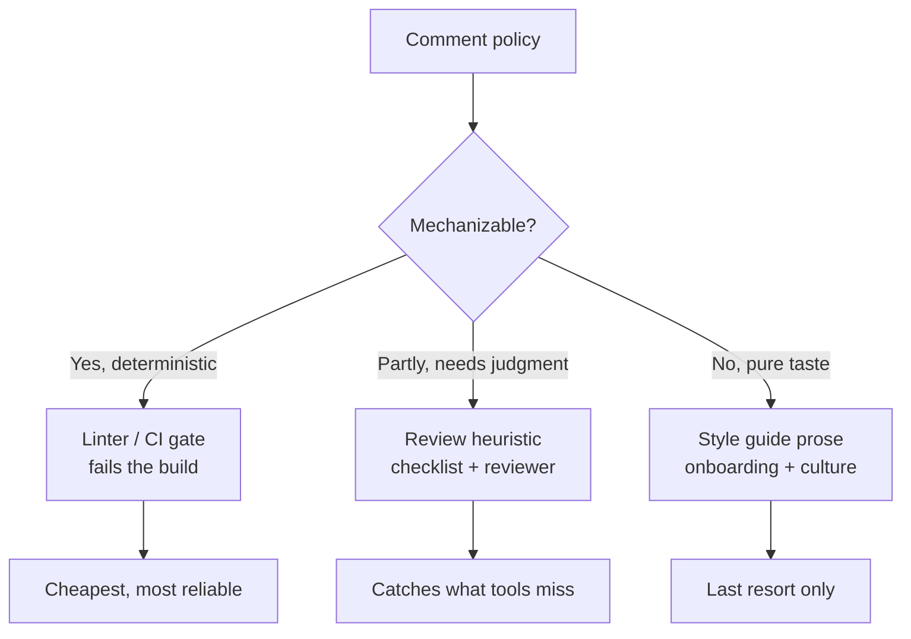
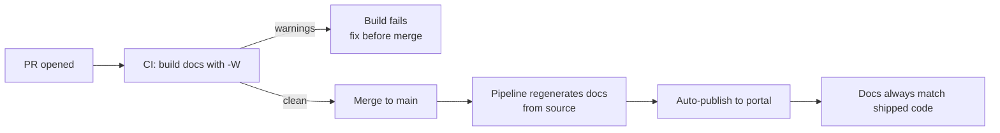

# Comments — Senior Level

> Focus: "How do I enforce comment quality across a team?" — doc-comment standards, the tooling that mechanizes them, generated docs that stay honest, CI gates against comment rot, license-header automation, and the ADR-vs-comment boundary. System-scale, repeatable, lint-enforced.

---

## Table of Contents

1. [The shift from personal habit to team policy](#the-shift-from-personal-habit-to-team-policy)
2. [Doc-comment standards per language](#doc-comment-standards-per-language)
3. [Tooling that mechanizes the standard](#tooling-that-mechanizes-the-standard)
4. [Linting away the anti-patterns](#linting-away-the-anti-patterns)
5. [Generated API docs and keeping them honest](#generated-api-docs-and-keeping-them-honest)
6. [Executable comments: doctests and runnable examples](#executable-comments-doctests-and-runnable-examples)
7. [License and copyright header automation](#license-and-copyright-header-automation)
8. [The ADR vs in-code comment boundary](#the-adr-vs-in-code-comment-boundary)
9. [Review heuristics for comments at scale](#review-heuristics-for-comments-at-scale)
10. [Preventing comment rot in CI](#preventing-comment-rot-in-ci)
11. [Common Mistakes](#common-mistakes)
12. [Test Yourself](#test-yourself)
13. [Cheat Sheet](#cheat-sheet)
14. [Summary](#summary)
15. [Further Reading](#further-reading)
16. [Related Topics](#related-topics)

---

## The shift from personal habit to team policy

At the junior and middle levels, "write good comments" is a habit you cultivate. At team scale it becomes a **policy you enforce with tools**, because:

- A team of 15 has 15 different intuitions about what deserves a comment. Intuition does not scale; a linter rule does.
- "Be tasteful" is unreviewable. "Every exported symbol has a doc comment, checked by `revive: exported`" is reviewable and fails the build.
- Comment rot is a *systemic* failure mode — the comment was true when written and drifted as the code changed. You cannot fix systemic problems with individual diligence; you need mechanisms.

The senior job is to move every defensible comment rule from "we ask reviewers to remember this" to one of three enforcement tiers:



Push rules **down and left** toward the linter wherever possible. A rule that lives only in a reviewer's head is a rule that fails the day that reviewer is on vacation.

---

## Doc-comment standards per language

A team standard answers three questions for every language: **which symbols must be documented**, **what format the doc comment takes**, and **which tool renders and validates it**.

### Go — godoc / pkg.go.dev

Go's convention *is* the standard: a doc comment is a complete sentence beginning with the symbol's name, placed immediately above the declaration with no blank line.

```go
// Package billing computes invoices and applies tax rules per jurisdiction.
// It is safe for concurrent use; all exported functions are stateless.
package billing

// Charge bills the customer for amount in the smallest currency unit
// (cents for USD). It returns ErrInsufficientFunds if the card declines.
// Charge is idempotent within idempotencyKey for 24 hours.
func Charge(ctx context.Context, customerID string, amount int64, idempotencyKey string) error {
```

Team rules worth enforcing:
- **Every exported symbol** has a doc comment starting with its name (`revive`'s `exported` rule, see below).
- Use `// Deprecated:` as the first line of a paragraph — `gopls`, `staticcheck`, and pkg.go.dev all recognize this exact prefix and flag callers.
- Runnable examples (`func ExampleCharge()`) appear inline in generated docs and run under `go test` — covered below.

### Java — Javadoc + doclint

Javadoc validates structure when you compile docs with `-Xdoclint`. Make it part of the build, not a manual chore.

```java
/**
 * Bills the customer for the given amount.
 *
 * <p>Idempotent within {@code idempotencyKey} for 24 hours; a repeat call
 * with the same key returns the original result without re-charging.
 *
 * @param customerId     opaque customer identifier; must be non-null
 * @param amountMinor    amount in the smallest currency unit (cents)
 * @param idempotencyKey de-duplication key, unique per logical charge
 * @return the settled {@link Charge}
 * @throws InsufficientFundsException if the card declines
 * @throws NullPointerException       if {@code customerId} is null
 * @since 4.2
 */
public Charge charge(String customerId, long amountMinor, String idempotencyKey) {
```

Maven configuration that fails the build on doclint violations (missing `@param`, broken `{@link}`, malformed HTML):

```xml
<plugin>
  <groupId>org.apache.maven.plugins</groupId>
  <artifactId>maven-javadoc-plugin</artifactId>
  <version>3.6.3</version>
  <configuration>
    <doclint>all,-missing</doclint>  <!-- validate syntax; tune -missing per maturity -->
    <failOnError>true</failOnError>
    <failOnWarnings>true</failOnWarnings>
  </configuration>
  <executions>
    <execution>
      <id>doclint</id>
      <phase>verify</phase>
      <goals><goal>javadoc</goal></goals>
    </execution>
  </executions>
</plugin>
```

Start with `-missing` (don't require docs everywhere yet) while you backfill, then graduate to `all`.

### Python — docstring conventions + pydocstyle / darglint

Pick **one** docstring style and enforce it; the two mainstream choices are Google style and NumPy style (Sphinx napoleon renders both).

```python
def charge(customer_id: str, amount_minor: int, idempotency_key: str) -> Charge:
    """Bill the customer for the given amount.

    Idempotent within ``idempotency_key`` for 24 hours: a repeat call with
    the same key returns the original result without re-charging.

    Args:
        customer_id: Opaque customer identifier.
        amount_minor: Amount in the smallest currency unit (cents).
        idempotency_key: De-duplication key, unique per logical charge.

    Returns:
        The settled :class:`Charge`.

    Raises:
        InsufficientFundsError: If the card declines.
    """
```

Two complementary linters:
- **pydocstyle** (or ruff's `D` rules) checks the docstring *exists and is well-formed* per a convention.
- **darglint** checks the docstring *matches the signature* — every parameter documented, no phantom params, documented `Raises` actually raised. This is the tool that catches drift between the signature and the prose.

```toml
# pyproject.toml — ruff handles pydocstyle's D-rules natively
[tool.ruff.lint]
select = ["D"]              # pydocstyle
[tool.ruff.lint.pydocstyle]
convention = "google"      # or "numpy"
```

```ini
# setup.cfg — darglint: strict signature/docstring agreement
[darglint]
docstring_style = google
strictness = full
```

### Sphinx — the rendering layer

For Python, Sphinx with `autodoc` + `napoleon` turns the docstrings above into HTML/PDF. The honesty mechanism is **`-W` (warnings as errors)** plus the link checker:

```bash
sphinx-build -b html -W --keep-going docs/ docs/_build/html   # fail on any warning
sphinx-build -b linkcheck docs/ docs/_build/linkcheck         # fail on dead links
```

`-W` turns "undocumented parameter" and "broken cross-reference" into build failures, which is the whole point — a doc that builds clean is a doc whose references are real.

---

## Tooling that mechanizes the standard

| Concern | Go | Java | Python |
|---|---|---|---|
| Require doc on exported symbols | `revive: exported`, `golint` (legacy) | `-Xdoclint:all` / Checkstyle `MissingJavadocMethod` | ruff `D` rules / pydocstyle |
| Validate doc structure | `gofmt` (comment formatting) | doclint syntax checks | pydocstyle |
| Signature ↔ doc agreement | — (manual / examples) | doclint `@param` checks | **darglint** |
| Render to site | `go doc`, pkg.go.dev | `maven-javadoc-plugin` | Sphinx autodoc + napoleon |
| Detect deprecation | `staticcheck SA1019` | `@Deprecated` + javac | `Deprecated` warnings / `deprecated` decorator |
| Flag dead links in docs | — | doclint `{@link}` | `sphinx-build -b linkcheck` |

The pattern across all three: **the standard is a config file in the repo, not a wiki page.** When the standard is a `.golangci.yml`, a `checkstyle.xml`, or a `pyproject.toml`, it travels with the code, versions with the code, and runs in CI without anyone remembering to.

---

## Linting away the anti-patterns

The README lists the comment anti-patterns to avoid. Most of them are mechanically detectable. Wire them into the linter so they never reach review.

### Commented-out code

Dead code in comments is the highest-value automated catch — git already remembers the deleted code, so a commented-out block is pure noise that rots.

**Go — golangci-lint** does not detect commented-out code directly; the practical approach is `gofmt` to keep comments clean plus a CI grep backstop (below).

**Java — Checkstyle** has no first-class "commented-out code" rule; the practical tool is the IDE inspection "Commented out code" plus a CI grep.

**Python / JS — ruff** ships `ERA001` (eradicate), which flags commented-out Python code specifically:

```toml
[tool.ruff.lint]
select = ["ERA"]   # ERA001: found commented-out code
```

ESLint's analog for JS/TS is the community `eslint-plugin-no-commented-out-code` plugin or a grep gate.

### TODO / FIXME without a ticket

A bare `// TODO: fix this` is a promise no one will keep. The team rule: **every TODO references a tracker issue.** This is enforceable everywhere.

**Go — golangci-lint `godox`** flags TODO/FIXME/HACK markers. Combine with a regex gate (below) to require a ticket reference:

```yaml
# .golangci.yml
linters:
  enable:
    - godox
linters-settings:
  godox:
    keywords: [TODO, FIXME, HACK, BUG, OPTIMIZE]
```

**Java — Checkstyle `TodoComment`** with a format that *permits* TODOs only when followed by a ticket key:

```xml
<!-- checkstyle.xml: fail on TODO that is NOT followed by a JIRA-style key -->
<module name="RegexpSinglelineJava">
  <property name="format"
            value="(TODO|FIXME)(?!.*[A-Z]+-[0-9]+)"/>
  <property name="message"
            value="TODO/FIXME must reference a ticket, e.g. TODO(PROJ-123): ..."/>
  <property name="ignoreComments" value="false"/>
</module>
```

**JS/TS — ESLint `no-warning-comments`** flags TODO/FIXME entirely (use as a "must be tracked" signal):

```js
// eslint.config.js
export default [{
  rules: {
    "no-warning-comments": ["error", {
      terms: ["todo", "fixme", "hack"],
      location: "anywhere",
    }],
  },
}];
```

ESLint's `no-warning-comments` can't itself parse "has a ticket", so pair it with a CI regex (next section) that allows `TODO(PROJ-123)` and rejects bare `TODO`.

### Journal / attribution / closing-brace comments

These (`// 2023-04-01 fixed by Alice`, `// added by Bob`, `} // end if`) are git's job, blame's job, and the brace's job respectively. They are hard to lint *precisely* but easy to catch with a repo-wide regex gate run in CI — see [Preventing comment rot in CI](#preventing-comment-rot-in-ci).

---

## Generated API docs and keeping them honest

Generated docs (godoc/pkg.go.dev, Javadoc sites, Sphinx/Read the Docs) have one failure mode that matters: **they look authoritative even when they're wrong.** A published doc site that disagrees with the code is worse than no site, because readers trust it.

Three mechanisms keep generated docs honest:

1. **Build docs in CI with warnings-as-errors.** `sphinx-build -W`, `maven-javadoc-plugin failOnWarnings`, and a `go vet`/`go doc` smoke check. If docs don't build clean, the PR is red. This catches broken cross-references, undocumented new parameters, and malformed markup the moment they're introduced.

2. **Generate from the source of truth, never by hand.** Docs that are *derived* from the code (autodoc reading docstrings, Javadoc reading annotations) drift far less than hand-written API pages, because changing the signature forces a doc rebuild that fails if the doc wasn't updated. Hand-maintained API tables are a comment-rot factory.

3. **Publish on merge, not on a human's schedule.** Wire `gh-pages`/Read the Docs/internal portal publishing into the merge pipeline. A doc site updated manually "when we remember" is always stale; a site that redeploys on every merge to `main` is structurally current.



For OpenAPI/gRPC, the same principle: the `.proto` / `openapi.yaml` is the source, the doc site is generated, and a CI step (e.g. `buf lint`, `spectral lint`) fails on schema drift. The schema comment becomes the doc — there is no second copy to rot.

---

## Executable comments: doctests and runnable examples

The strongest defense against comment rot is making the comment **execute**. A wrong example fails CI.

### Go — example functions

`func Example...()` lives in `_test.go`, runs under `go test`, *and* renders in godoc. If the documented output drifts, the test fails:

```go
func ExampleCharge() {
    err := Charge(context.Background(), "cus_123", 1099, "key-1")
    fmt.Println(err)
    // Output:
    // <nil>
}
```

The `// Output:` comment is checked against stdout. This is documentation that cannot lie.

### Python — doctest

Docstring examples run under `doctest` / pytest's `--doctest-modules`:

```python
def to_minor(dollars: float) -> int:
    """Convert dollars to cents.

    >>> to_minor(10.99)
    1099
    >>> to_minor(0)
    0
    """
    return round(dollars * 100)
```

```bash
pytest --doctest-modules        # runs every docstring example as a test
```

### Java — Snippets (JDK 18+ `@snippet`)

Modern Javadoc's `{@snippet}` can reference real, compiled source regions so the example can't drift from compilable code:

```java
/**
 * {@snippet file="ChargeExample.java" region="basic"}
 */
```

`ChargeExample.java` is a real, compiled test file; the `// @start region="basic"` / `// @end` markers select the shown lines. The snippet compiles in CI, so a documented example that stops compiling breaks the build.

> **Principle:** an example that runs in CI is the only kind of example you can trust six months later. Prefer executable examples over prose examples for anything load-bearing.

---

## License and copyright header automation

At scale, every source file needs a license/copyright header, and no human should type or maintain them. Automate insertion *and* verification.

### Go — `addlicense`

```bash
# Insert/verify Apache-2.0 headers across the tree
go run github.com/google/addlicense@latest \
  -l apache -c "Acme, Inc." -y 2026 \
  -check ./...        # -check fails CI if any file lacks a header
```

### Java / polyglot — `license-maven-plugin`

```xml
<plugin>
  <groupId>com.mycila</groupId>
  <artifactId>license-maven-plugin</artifactId>
  <version>4.5</version>
  <configuration>
    <licenseSets>
      <licenseSet>
        <header>config/license-header.txt</header>
        <includes><include>src/**/*.java</include></includes>
      </licenseSet>
    </licenseSets>
    <properties><owner>Acme, Inc.</owner><year>2026</year></properties>
  </configuration>
  <executions>
    <execution>
      <id>check-license</id>
      <phase>verify</phase>
      <goals><goal>check</goal></goals>   <!-- 'format' to insert; 'check' to gate -->
    </execution>
  </executions>
</plugin>
```

### Python / any — pre-commit hook

```yaml
# .pre-commit-config.yaml
repos:
  - repo: https://github.com/Lucas-C/pre-commit-hooks
    rev: v1.5.5
    hooks:
      - id: insert-license
        files: \.py$
        args: [--license-filepath, config/license-header.txt, --comment-style, "#"]
```

The rule: **`format`/`insert` locally, `check` in CI.** Contributors never hand-edit headers; CI guarantees none are missing. The year and owner come from config, not from each developer's keyboard — which also kills the "attribution comment" anti-pattern at the file level.

---

## The ADR vs in-code comment boundary

The single most common comment-quality failure at the senior level is putting **decision history** into code comments. Code comments answer "what does this do / what must the reader know to use or change it safely." Architecture Decision Records answer "**why** did we choose this, what alternatives did we reject, and what trade-offs did we accept."

| Belongs in a code comment | Belongs in an ADR |
|---|---|
| A non-obvious invariant the next editor must preserve | Why we chose Postgres over DynamoDB |
| A warning about a subtle ordering dependency | The migration plan and its rollback story |
| A link to the ADR/ticket that explains the *why* | The full list of rejected alternatives and their cons |
| Units, idempotency window, concurrency safety | Org/cost/compliance constraints behind the choice |
| A workaround and the upstream bug it tracks | The decision's status (proposed/accepted/superseded) |

The clean pattern is a **one-line code comment that points to the ADR**, not a paragraph of rationale inline:

```go
// Retries use full jitter, not exponential-only; see ADR-0042 for the
// thundering-herd analysis that ruled out fixed backoff.
backoff := fullJitter(base, attempt)
```

This gives you the best of both: the code stays terse, the rationale lives in a versioned document that survives refactors (the comment would have been deleted when the function moved; the ADR persists). It also fixes journal comments — "why we changed this in 2023" is an ADR or a git/PR record, never an inline note.

> **Boundary test:** if a comment would still be true and useful after the surrounding function is rewritten, it might belong in an ADR or package doc, not glued to a specific line.

See the dedicated chapter [`../24-documentation-and-adrs/README.md`](../24-documentation-and-adrs/README.md) for ADR templates and lifecycle.

---

## Review heuristics for comments at scale

The reviewer's prime directive for any comment: **"Should this be deleted, or should the code be improved instead?"** Most comments a reviewer sees are a symptom of code that isn't clear enough. See [`../17-code-reviews/README.md`](../17-code-reviews/README.md) for the broader review process this slots into.

A practical reviewer checklist:

- **Redundant comment** (`// increment i` over `i++`) → request deletion.
- **Comment explaining *what* the code does** → ask: can a rename or extraction make the code say it? Prefer the code change.
- **Comment explaining *why*** (non-obvious rationale, an invariant, a workaround) → keep and improve; this is the comment worth having.
- **Commented-out code** → delete; git has it. (Linter should have caught it; flag the gap.)
- **TODO without a ticket** → block until it references a tracker issue.
- **Comment that disagrees with the code** → the most dangerous case; the comment is actively misleading. Fix or delete, never leave.
- **Closing-brace / journal / attribution comment** → delete; the brace, git history, and blame cover these.
- **A doc comment that restates the signature** (`@param id the id`) → request real content or removal; empty docs are worse than none because they pass the "has a doc" check while saying nothing.

Codify this as a PR-template checklist item and as linter rules wherever the rule is deterministic. The judgment calls ("improve the code instead?") stay with the reviewer; everything deterministic moves to CI.

---

## Preventing comment rot in CI

Comment rot is the comment that was true when written and silently drifted. You can't prevent drift by asking people to be careful; you build mechanisms that make drift fail loudly.

**1. A repo-wide regex gate** for the anti-patterns linters miss (run as a CI job and a pre-commit hook):

```bash
#!/usr/bin/env bash
# scripts/comment-gate.sh — fail on bare TODOs and journal/attribution comments
set -euo pipefail

fail=0

# TODO/FIXME must reference a ticket like PROJ-123
if git grep -nE '(TODO|FIXME)' -- '*.go' '*.java' '*.py' \
     | grep -vE '[A-Z]+-[0-9]+' >/tmp/bare_todos; then
  echo "Bare TODO/FIXME without a ticket reference:"; cat /tmp/bare_todos; fail=1
fi

# Journal / attribution comments: '// 2024-01-01 ...' or 'added by Name'
if git grep -nEi '(//|#|\*).*((added|fixed|changed) by |[0-9]{4}-[0-9]{2}-[0-9]{2})' \
     -- '*.go' '*.java' '*.py' >/tmp/journal; then
  echo "Journal/attribution comment (use git history / ADRs instead):"; cat /tmp/journal; fail=1
fi

exit $fail
```

**2. Make examples executable** so a wrong example is a failing test: `go test`, `pytest --doctest-modules`, Javadoc `@snippet` compilation. (See above — this is the strongest anti-rot mechanism.)

**3. Build docs with warnings-as-errors** so an undocumented new parameter or a dead `{@link}` fails the PR: `sphinx-build -W`, javadoc `failOnWarnings`, `darglint --strictness full`.

**4. Baseline for legacy code.** Introducing `revive: exported` or pydocstyle to a million-line repo yields thousands of violations on day one. Don't fail the whole build — adopt a baseline (save current violations, fail only on *new* ones or on changes to violation-bearing lines). golangci-lint, ruff, and Checkstyle (via suppression/baseline files) all support this. New code gets full enforcement; legacy is fixed as it's touched.

**5. Pre-commit as the first line.** Most of the above (license check, ruff `ERA`/`D`, the regex gate) belong in `.pre-commit-config.yaml` so the fastest checks fail on the developer's machine before CI even starts.

The compounding effect: each mechanism removes a class of rot permanently. Once executable examples are mandatory, *no* example can silently go stale. Once `-W` is on, *no* doc cross-reference can dangle. Mechanisms beat vigilance because mechanisms don't take vacations.

---

## Common Mistakes

- **Mandating a doc comment on every symbol from day one on a legacy repo.** Produces thousands of empty `@param id the id` docs written to satisfy the linter — the "has a doc" check passes while the docs say nothing. Use a baseline and require *meaningful* docs only on new/changed code.
- **Putting decision rationale in code comments instead of an ADR.** The rationale gets deleted on the next refactor; the decision is lost. Link to the ADR from one line; keep the *why* in the versioned document.
- **Treating the generated doc site as authoritative but updating it manually.** A stale "official" doc is worse than none. Generate from source and publish on merge.
- **Allowing bare TODOs because "we'll track them later."** They're never tracked. Require a ticket reference, enforced by `godox` + a regex gate or `no-warning-comments`.
- **Hand-writing license headers.** They drift in wording and year, and some files miss them entirely. Automate insert + CI check (`addlicense -check`, `license-maven-plugin check`).
- **Prose examples in docstrings that no test exercises.** They rot the instant the API changes. Make examples executable (doctest, Example funcs, `@snippet`).
- **A `no-warning-comments` ESLint rule with no escape hatch for tracked work.** Pair the "no bare TODO" rule with an allowed `TODO(PROJ-123)` pattern, or developers route around the linter by not writing the TODO at all.
- **Confusing doc *coverage* (% symbols documented) with doc *quality*.** 100% coverage of empty docs is meaningless. Measure darglint/doclint *agreement* failures, not just presence.

---

## Test Yourself

1. **Your team wants "every TODO must reference a ticket." Which tools enforce the two halves of that rule, and why can't one tool do it alone?**

<details><summary>Answer</summary>

The rule has two parts: (a) *flag* TODO/FIXME markers, and (b) *verify* each one references a ticket. Marker-detection tools — golangci-lint `godox`, Checkstyle `TodoComment`, ESLint `no-warning-comments` — handle (a) but mostly can't parse "has a valid ticket key." So you pair them with a regex gate (e.g. `grep -vE '[A-Z]+-[0-9]+'`, or Checkstyle `RegexpSinglelineJava` with a negative lookahead) that fails on a TODO *not* followed by a `PROJ-123`-style key. The marker linter ensures TODOs are visible; the regex enforces the ticket. Run both in CI and pre-commit.
</details>

2. **A reviewer sees a 6-line comment explaining why a function exists, the alternatives the author rejected, and a date. What do you do with it?**

<details><summary>Answer</summary>

Split it. The "why we chose this over alternatives" is an ADR — move it to the documentation-and-ADRs chapter and leave a one-line code comment linking to the ADR. The date/journal portion is git history; delete it. Any genuine *invariant the next editor must preserve* stays as a terse code comment. The test: rationale that would survive a rewrite of the function belongs in an ADR; a warning glued to a specific line stays in the code.
</details>

3. **Introducing `revive: exported` to a 900k-line Go repo yields 4,000 violations. The build goes red. What's the move?**

<details><summary>Answer</summary>

Adopt a baseline. Don't fail on the existing 4,000 — you'll never merge anything and the team will disable the linter. Configure golangci-lint to fail only on *new* violations and on changes to violation-bearing lines (new-from-rev / baseline mode). New code is fully enforced; legacy gets documented as files are touched. The violation count shrinks naturally without a big-bang doc-writing project.
</details>

4. **The published doc site shows a parameter that was renamed three sprints ago. How do you make this class of bug impossible, not just fix this instance?**

<details><summary>Answer</summary>

Stop treating the doc site as a separate artifact. (1) Generate docs from source (autodoc/Javadoc/godoc) so a renamed parameter forces a doc regeneration. (2) Build docs in CI with warnings-as-errors (`sphinx-build -W`, `failOnWarnings`) plus signature/doc agreement (`darglint`, doclint `@param` checks) so a mismatch fails the PR. (3) Publish on merge, not manually, so the live site is never behind `main`. The instance is a symptom; the cure is making drift a build failure.
</details>

5. **Why is an empty `@param id the id` worse than no doc comment at all, even though it raises your "documented %" metric?**

<details><summary>Answer</summary>

It satisfies presence checks (doclint `-missing`, pydocstyle "exists") while conveying zero information, so it *hides* the gap: the symbol now looks documented to both tooling and readers, removing the signal that real documentation is needed. It also inflates the coverage metric, encouraging more empty docs. This is why you measure *agreement* (darglint/doclint mismatches) over presence, and require meaningful content on new code rather than a blanket "every symbol must have a doc" on legacy.
</details>

6. **A teammate argues doctests are "just more tests to maintain" and wants prose examples instead. Counter-argument?**

<details><summary>Answer</summary>

Prose examples are *also* maintained — but maintained by hope, not by CI. A doctest/Example func is the same example with a verifier attached: when the API changes, the doctest fails and someone must update it, whereas a prose example silently rots into a lie that misleads every reader until someone notices. The marginal cost of making an example executable is near zero (it's the same example); the marginal value is that it can never become wrong undetected. Reserve prose for conceptual narrative; make load-bearing examples executable.
</details>

---

## Cheat Sheet

| Goal | Go | Java | Python |
|---|---|---|---|
| Require doc on exported API | `revive: exported` | Checkstyle `MissingJavadocMethod`, `-Xdoclint:all` | ruff `D` / pydocstyle |
| Doc ↔ signature agreement | examples | doclint `@param` | **darglint** `strictness=full` |
| Render doc site | pkg.go.dev / `go doc` | `maven-javadoc-plugin` | Sphinx autodoc + napoleon |
| Fail build on doc warnings | `go vet` | `failOnWarnings=true` | `sphinx-build -W` |
| Flag commented-out code | grep gate | IDE inspection + grep | ruff `ERA001` |
| TODO must have ticket | `godox` + regex | `TodoComment` / regex | regex gate |
| Executable example | `func Example…()` + `// Output:` | `{@snippet}` (JDK 18+) | `>>>` doctest |
| License header check | `addlicense -check` | `license-maven-plugin check` | `insert-license` hook |
| Dead-link check | — | doclint `{@link}` | `sphinx-build -b linkcheck` |
| Legacy onboarding | golangci-lint baseline | Checkstyle suppressions | ruff baseline |

**Enforcement tiering, in one line:** deterministic rule → linter/CI; needs judgment → review checklist; pure taste → style guide. Push every rule as far toward the linter as it will go.

**The four anti-rot pillars:** generate docs from source · build docs with `-W` · make examples executable · baseline the legacy backlog.

---

## Summary

At senior scale, comment quality stops being a matter of individual taste and becomes a matter of **mechanism design**. The job is to encode the chapter's rules into config that travels with the code: doc-comment standards enforced by `revive`/doclint/pydocstyle, signature-agreement enforced by darglint, anti-patterns (commented-out code, untracked TODOs, journal/attribution comments) caught by ruff `ERA`, `godox`, Checkstyle, and a repo-wide regex gate. Generated API docs stay honest only when they are derived from source, built in CI with warnings-as-errors, and published on merge — never hand-maintained. The most durable comments are the ones that execute: Go example functions, Python doctests, and Java `@snippet`s turn documentation into tests that fail when they lie. Decision rationale belongs in ADRs, not glued to code lines; a one-line comment links the two. License headers are generated and CI-checked, never typed. For legacy codebases, a baseline lets you enforce on new code without drowning in old violations. Across all of it, the governing principle is the same: **mechanisms beat vigilance, because mechanisms don't take vacations.**

---

## Further Reading

- Robert C. Martin, *Clean Code*, Chapter 4 ("Comments") — the canonical taxonomy of good vs. bad comments this chapter operationalizes.
- *Effective Java* (Joshua Bloch), Item 56 — "Write doc comments for all exposed API elements"; the Javadoc discipline behind the doclint config.
- Go Blog, "Godoc: documenting Go code" and "Go Doc Comments" — the conventions `revive: exported` enforces.
- PEP 257 — Docstring Conventions; the baseline pydocstyle/ruff `D` rules check against.
- darglint, ruff (pydocstyle rules), golangci-lint (`godox`), and `maven-javadoc-plugin` documentation — the canonical configuration references for the tools above.
- Michael Nygard, "Documenting Architecture Decisions" (2011) — the original ADR essay defining the comment/ADR boundary.

---

## Related Topics

- [junior.md](junior.md) — what a good comment is and the basic anti-patterns to avoid.
- [middle.md](middle.md) — writing doc comments, "why not what," and self-documenting code.
- [professional.md](professional.md) — comment style on a single codebase, IDE/doc tooling for one project.
- [Chapter README](../README.md) — the positive comment rules this level enforces.
- [Code Reviews](../17-code-reviews/README.md) — the review process the comment heuristics plug into.
- [Documentation and ADRs](../24-documentation-and-adrs/README.md) — where decision rationale lives instead of code comments.
- [Refactoring](../../refactoring/README.md) — "delete the comment, improve the code" is a refactoring move.
- [Anti-Patterns](../../anti-patterns/README.md) — comment smells as recognized anti-patterns.
