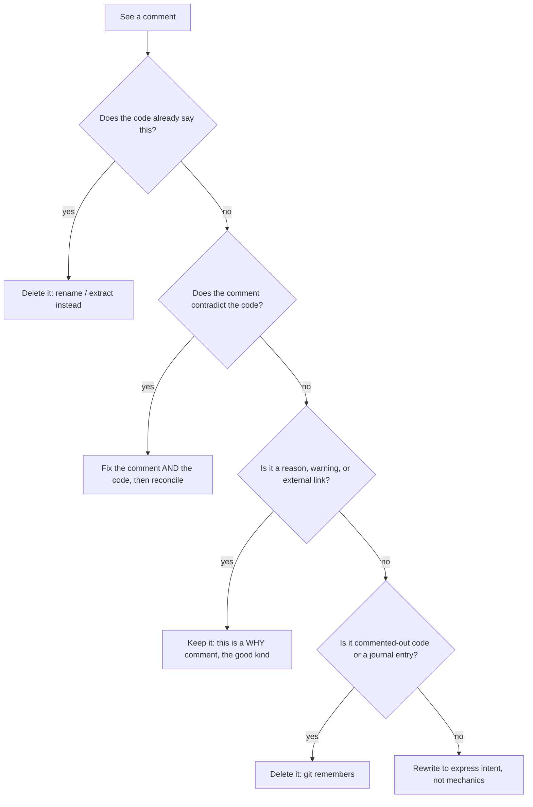

# Comments — Practice Tasks

> Twelve "fix the comments" exercises. Every comment you keep should pay rent: it must say something the code cannot. Each task gives you a scenario, a snippet whose comments are pulling their weight badly, and an instruction. Work the fix in your head (or your editor) before opening the solution. Languages rotate between Go, Java, and Python on purpose — comment smells look the same in every syntax.

---

## Table of Contents

1. [Task 1 — Delete the redundant comment by improving the name (Java)](#task-1--delete-the-redundant-comment-by-improving-the-name-java)
2. [Task 2 — Remove commented-out code (Python)](#task-2--remove-commented-out-code-python)
3. [Task 3 — Replace a journal/attribution comment with VCS (Go)](#task-3--replace-a-journalattribution-comment-with-vcs-go)
4. [Task 4 — Delete the closing-brace comment by extracting a function (Java)](#task-4--delete-the-closing-brace-comment-by-extracting-a-function-java)
5. [Task 5 — Convert a WHAT comment into a WHY comment (Go)](#task-5--convert-a-what-comment-into-a-why-comment-go)
6. [Task 6 — Fix the misleading, outdated comment that contradicts the code (Python)](#task-6--fix-the-misleading-outdated-comment-that-contradicts-the-code-python)
7. [Task 7 — Write a proper doc-comment for a public API (Go)](#task-7--write-a-proper-doc-comment-for-a-public-api-go)
8. [Task 8 — Turn an opaque comment into a clarifying one with a link (Java)](#task-8--turn-an-opaque-comment-into-a-clarifying-one-with-a-link-java)
9. [Task 9 — Replace a section-banner comment with extracted functions (Python)](#task-9--replace-a-section-banner-comment-with-extracted-functions-python)
10. [Task 10 — Promote intent: the comment apologizes for the code (Java)](#task-10--promote-intent-the-comment-apologizes-for-the-code-java)
11. [Task 11 — Encode an invariant the comment merely asserts (Go)](#task-11--encode-an-invariant-the-comment-merely-asserts-go)
12. [Task 12 — Comment audit (Python — open-ended)](#task-12--comment-audit-python--open-ended)

---

## How to Use

- Read the snippet and decide **what each comment is for** before you touch it. Most comments fall into one of three buckets: *redundant* (says what the code already says), *misleading* (says something the code does not do), or *load-bearing* (says something the code genuinely cannot — a reason, a warning, a link).
- Try the fix yourself, then expand the `<details>` block. Compare your reasoning to the solution's, not just your diff.
- The default move in this chapter is **delete or replace**, not "write a better comment." A comment you can erase by renaming a variable or extracting a function is a comment that was never worth maintaining.
- Difficulty climbs from *Easy* (mechanical deletions) to *Hard* (audits and invariants encoded in types). Do them in order the first time.

The decision you are practicing on every task:



---

## Task 1 — Delete the redundant comment by improving the name (Java)

**Difficulty:** Easy

**Scenario:** A teammate sprinkled "helpful" comments above lines that already explain themselves. Each comment is a second copy of the code in English — and a second thing to keep in sync.

```java
public class CartPricing {
    public BigDecimal total(List<Item> items) {
        // the running total
        BigDecimal t = BigDecimal.ZERO;
        // loop over every item
        for (Item i : items) {
            // multiply price by quantity
            BigDecimal lt = i.getPrice().multiply(BigDecimal.valueOf(i.getQty()));
            // add to the running total
            t = t.add(lt);
        }
        // return the total
        return t;
    }
}
```

**Instruction:** Remove every comment. The code must remain at least as readable — achieve that by improving the names, not by adding new comments.

<details>
<summary>Solution</summary>

```java
public class CartPricing {
    public BigDecimal total(List<Item> items) {
        BigDecimal runningTotal = BigDecimal.ZERO;
        for (Item item : items) {
            BigDecimal lineTotal = item.getPrice().multiply(BigDecimal.valueOf(item.getQty()));
            runningTotal = runningTotal.add(lineTotal);
        }
        return runningTotal;
    }
}
```

**Reasoning.** Every comment here was *redundant* — it restated the line below it. Redundant comments are worse than no comment because they double the maintenance surface: rename `t` and the comment "the running total" silently survives, and now you have two sources of truth. The fix is to fold the comment's information into the name. `t` → `runningTotal`, `lt` → `lineTotal`, `i` → `item`. The loop and the `multiply`/`add` calls are self-evident to any reader who knows the language; commenting them insults the reader and rots on the next edit. Rule of thumb: *if a comment translates code into English one-for-one, delete it and let the names do the translating.*

</details>

---

## Task 2 — Remove commented-out code (Python)

**Difficulty:** Easy

**Scenario:** During a refactor someone "kept the old version just in case." Three months later nobody knows whether the dead block is the safe fallback or a known-bad attempt.

```python
def normalize_phone(raw: str) -> str:
    # old implementation — keep for reference
    # digits = "".join(c for c in raw if c.isdigit())
    # if len(digits) == 10:
    #     return "+1" + digits
    # return digits

    digits = "".join(ch for ch in raw if ch.isdigit())
    if len(digits) == 10:
        return "+1" + digits
    if len(digits) == 11 and digits.startswith("1"):
        return "+" + digits
    raise ValueError(f"cannot normalize phone: {raw!r}")
```

**Instruction:** Decide what to do with the commented-out block and apply it. Justify the call.

<details>
<summary>Solution</summary>

```python
def normalize_phone(raw: str) -> str:
    digits = "".join(ch for ch in raw if ch.isdigit())
    if len(digits) == 10:
        return "+1" + digits
    if len(digits) == 11 and digits.startswith("1"):
        return "+" + digits
    raise ValueError(f"cannot normalize phone: {raw!r}")
```

**Reasoning.** Delete it. Commented-out code is the single most reliable source of distrust in a codebase. A reader cannot tell whether it is (a) a rollback path you must keep, (b) a half-finished idea, or (c) abandoned cruft — so they leave it, and it accretes. The "keep for reference" justification is exactly what version control exists to satisfy: the old implementation is one `git log -p` or `git blame` away, permanently, with the commit message and date that explain *why* it changed. Source files are for the code that runs. If you truly need to resurrect the old logic, you will recover it from history with full context, not from a stale comment that has been silently diverging from the live version (note the live version already grew an 11-digit branch the dead copy never got).

</details>

---

## Task 3 — Replace a journal/attribution comment with VCS (Go)

**Difficulty:** Easy

**Scenario:** This file has grown a changelog at the top and an "added by" tag on a function. The code is being maintained by hand-rolling what `git` already records perfectly.

```go
// Package invoicing computes invoice totals.
//
// Changelog:
//   2023-04-01 Alice: initial version
//   2023-06-12 Bob: fixed rounding bug (issue #214)
//   2024-01-09 Alice: added EU VAT handling
//   2024-03-22 Carol: refactored discount logic
package invoicing

// added by Bob, 2023-06-12
// reviewed by Alice
func applyRounding(amount Cents) Cents {
    return (amount + 50) / 100 * 100
}
```

**Instruction:** Remove the journal and attribution comments. Keep anything that is still genuinely useful, and say where the deleted information now lives.

<details>
<summary>Solution</summary>

```go
// Package invoicing computes invoice totals.
package invoicing

// applyRounding rounds amount to the nearest whole currency unit
// (banker-style half-up at the 50-cent boundary).
func applyRounding(amount Cents) Cents {
    return (amount + 50) / 100 * 100
}
```

**Reasoning.** Two distinct smells, one fix: *git*.

- **Journal comment** (the changelog). Every line of it is reproduced — more accurately — by `git log`, which records the exact commit, diff, author, timestamp, and message. A hand-maintained changelog is always behind reality because nobody updates it on the small commits, so it becomes a misleading partial history. Delete it; the package doc-comment should describe *what the package is*, not its biography.
- **Attribution comment** ("added by Bob / reviewed by Alice"). Ownership and review history live in `git blame` and the pull-request record, which cannot lie or fall out of date. An inline author tag creates fake ownership: when Carol edits Bob's function, does she update the tag? She won't, and now it is wrong.

What I *added* is the only thing git could not supply: a doc-comment that explains the rounding rule the expression encodes, so the reader does not have to reverse-engineer `(amount + 50) / 100 * 100`. That is the WHY/intent layer — see [Task 5](#task-5--convert-a-what-comment-into-a-why-comment-go).

</details>

---

## Task 4 — Delete the closing-brace comment by extracting a function (Java)

**Difficulty:** Medium

**Scenario:** The nesting got deep enough that someone annotated each closing brace so they could tell which block was ending. The comments are a symptom; the disease is depth.

```java
public void process(List<Order> orders) {
    for (Order order : orders) {
        if (order.isValid()) {
            for (LineItem item : order.getItems()) {
                if (item.isInStock()) {
                    if (item.getQty() > 0) {
                        reserve(item);
                    } // end if qty > 0
                } // end if in stock
            } // end for items
        } // end if valid
    } // end for orders
}
```

**Instruction:** Get rid of the `// end ...` comments. Do **not** do it by simply deleting them — remove the *reason* they were written.

<details>
<summary>Solution</summary>

```java
public void process(List<Order> orders) {
    orders.stream()
          .filter(Order::isValid)
          .forEach(this::reserveAvailableItems);
}

private void reserveAvailableItems(Order order) {
    for (LineItem item : order.getItems()) {
        if (isReservable(item)) {
            reserve(item);
        }
    }
}

private boolean isReservable(LineItem item) {
    return item.isInStock() && item.getQty() > 0;
}
```

**Reasoning.** Closing-brace comments are a *deodorant* for the smell of excessive nesting, not a cure. The honest signal "I can no longer tell which `}` matches which `{`" means the block is too deep to read, and the right response is to flatten it. Extracting `reserveAvailableItems` and the `isReservable` predicate collapses five levels of nesting into bodies short enough that no brace needs a label. The braces now line up at a glance, the two extracted names document what each former block *was for* (which the `// end if valid` comment never did — it told you a block ended, not what it meant), and the top-level method reads as a sentence. If you ever genuinely need to mark a brace, the function is too long.

</details>

---

## Task 5 — Convert a WHAT comment into a WHY comment (Go)

**Difficulty:** Medium

**Scenario:** The comment describes the mechanics the reader can already see, while the genuinely surprising part — *why this exact value* — goes unexplained. Six months later someone will "clean up" the magic number and break production.

```go
func retryDelay(attempt int) time.Duration {
    // multiply 100ms by 2 to the power of attempt, capped at 30 seconds
    backoff := 100 * time.Millisecond * (1 << attempt)
    if backoff > 30*time.Second {
        backoff = 30 * time.Second
    }
    return backoff
}
```

**Instruction:** Rewrite the comment so it explains something the code does *not* already say. Delete what is redundant.

<details>
<summary>Solution</summary>

```go
func retryDelay(attempt int) time.Duration {
    const (
        base = 100 * time.Millisecond
        // The upstream payment gateway closes idle connections at 30s,
        // so capping here keeps us inside one connection lifecycle and
        // avoids a reconnect storm under sustained failure (see INC-4821).
        cap = 30 * time.Second
    )
    backoff := base * (1 << attempt)
    if backoff > cap {
        backoff = cap
    }
    return backoff
}
```

**Reasoning.** The original comment is a *WHAT* comment: "multiply 100ms by 2^attempt, capped at 30s" is a literal English transcription of the expression below it. It carries zero information a competent reader lacks, and it will drift if the formula changes. The valuable, non-obvious fact is *why 30 seconds* — and that lived nowhere. Replacing the WHAT with a *WHY* comment captures the external constraint (the gateway's idle timeout) and an incident reference so the next engineer knows the cap is load-bearing, not arbitrary. Naming `base` and `cap` as constants also lets the names absorb the rest of the old comment's WHAT content. Good comments answer questions the code raises but cannot answer itself: *why this number, why this order, why not the obvious alternative.*

</details>

---

## Task 6 — Fix the misleading, outdated comment that contradicts the code (Python)

**Difficulty:** Medium

**Scenario:** The function was changed but its comment was not. The comment now actively lies, which is worse than no comment: a reader who trusts it will make a wrong decision.

```python
def is_eligible(user) -> bool:
    # Returns True only for users over 18 with a verified email.
    if user.age < 21:
        return False
    if not user.email_verified:
        return False
    if user.country in BLOCKED_COUNTRIES:
        return False
    return True
```

**Instruction:** The comment and the code disagree on two points (the age threshold and the country check). Resolve the contradiction. State your assumption about which one is correct, and make the comment and code agree.

<details>
<summary>Solution</summary>

Assume the **code** is the source of truth (it is what actually shipped and what tests exercise), and that the age bump to 21 and the country block were deliberate. Then the comment must be corrected — or, better, removed because good names plus a docstring make it unnecessary:

```python
def is_eligible(user) -> bool:
    """Eligibility gate. See policy POL-2024-07 for the rules below."""
    if user.age < MIN_AGE:               # 21: raised from 18 for regulatory reasons
        return False
    if not user.email_verified:
        return False
    if user.country in BLOCKED_COUNTRIES:
        return False
    return True
```

**Reasoning.** An outdated comment is a *misleading* comment, and misleading comments are the most expensive kind: they cost a reader their trust in *every* comment in the file. Here the comment claimed "over 18" while the code requires 21, and omitted the country block entirely — a reader reviewing a bug report about a blocked user would be sent down the wrong path. The discipline is twofold: (1) when code and comment conflict, treat the **code as truth** unless you have evidence the change was a mistake, then fix the comment in the *same* commit; (2) prefer to eliminate the comment's burden — naming the threshold `MIN_AGE` and pointing the docstring at the authoritative policy document means the inline prose can no longer drift away from the logic, because there is barely any prose left to drift. A comment you do not have to maintain cannot become a lie.

</details>

---

## Task 7 — Write a proper doc-comment for a public API (Go)

**Difficulty:** Medium

**Scenario:** This is an exported function in a library other teams import. It has no doc-comment, so consumers must read its body to learn how to call it — including the parts they cannot see, like the error contract and the concurrency guarantee.

```go
func ParseConfig(r io.Reader) (*Config, error) {
    data, err := io.ReadAll(r)
    if err != nil {
        return nil, fmt.Errorf("read config: %w", err)
    }
    var c Config
    if err := yaml.Unmarshal(data, &c); err != nil {
        return nil, fmt.Errorf("parse config: %w", err)
    }
    if c.Port == 0 {
        c.Port = 8080
    }
    return &c, nil
}
```

**Instruction:** Write a doc-comment that follows Go conventions and tells a caller everything they need to use this without reading the body: what it does, the input contract, the defaults it applies, the error behavior, and any safety notes.

<details>
<summary>Solution</summary>

```go
// ParseConfig reads YAML configuration from r and returns the parsed Config.
//
// It reads r to EOF; the caller retains ownership of r and is responsible for
// closing it. Any field omitted in the YAML keeps its zero value, except Port,
// which defaults to 8080 when unset or zero.
//
// ParseConfig returns an error if r cannot be read or if the bytes are not
// valid YAML for the Config schema; the returned error wraps the underlying
// cause and can be inspected with errors.Is / errors.As. On error the returned
// *Config is nil.
//
// ParseConfig performs no I/O beyond reading r and is safe for concurrent use.
func ParseConfig(r io.Reader) (*Config, error) {
    data, err := io.ReadAll(r)
    if err != nil {
        return nil, fmt.Errorf("read config: %w", err)
    }
    var c Config
    if err := yaml.Unmarshal(data, &c); err != nil {
        return nil, fmt.Errorf("parse config: %w", err)
    }
    if c.Port == 0 {
        c.Port = 8080
    }
    return &c, nil
}
```

**Reasoning.** A public API is the one place comments are not a failure — they are *part of the interface*. A caller of an imported function cannot, and should not have to, read your implementation; the doc-comment is their entire contract. A good one covers the things the signature alone cannot express:

- **What it does**, in one sentence, starting with the function name (Go convention, so `go doc`/pkg.go.dev render it well).
- **Input contract**: it consumes `r` to EOF and does *not* close it — ownership questions cause real leaks when undocumented.
- **Defaults / surprises**: `Port` defaults to 8080. Hidden mutation of the result is exactly what a caller will get wrong.
- **Error behavior**: when it errors, that errors are wrapped (so `errors.Is`/`As` work), and that `*Config` is nil on failure.
- **Concurrency safety**: callers always need to know this and can never infer it from the signature.

Notice none of this duplicates the code — it states the *contract*, which the code merely happens to satisfy today. That is why it earns its keep.

</details>

---

## Task 8 — Turn an opaque comment into a clarifying one with a link (Java)

**Difficulty:** Hard

**Scenario:** The code does something that looks wrong — a deliberate, non-obvious workaround. The existing comment gestures at it without giving the reader anything actionable, so every future maintainer re-investigates from scratch.

```java
// hack, don't remove
list.add(null);
list.addAll(results);
list.remove(0);
```

**Instruction:** Replace this useless comment with a clarifying comment that actually equips the next reader: explain *why* the odd dance is necessary and link to the authoritative source.

<details>
<summary>Solution</summary>

```java
// Work around OpenJDK-8261236: ArrayList.addAll on an empty list with a
// presized backing array throws under -XX:+UseParallelGC on JDK 11.0.2.
// Seeding one element forces the slow-path copy, which is unaffected; we then
// drop the sentinel. Remove once we drop JDK < 11.0.4.
// Repro + analysis: https://bugs.openjdk.org/browse/JDK-8261236
list.add(null);          // sentinel: forces ArrayList onto the safe copy path
list.addAll(results);
list.remove(0);          // drop the sentinel
```

**Reasoning.** "hack, don't remove" is the textbook *opaque* comment: it admits the code is surprising but tells the reader nothing they can act on. It forbids change without enabling judgment, so it freezes the workaround in place forever — even after the bug it dodges is fixed, because nobody dares touch it. A *clarifying* comment converts "trust me" into "here's why," and the four things it must supply are: (1) the **root cause** (the specific JDK bug, by ID); (2) the **mechanism** — why seeding a sentinel changes the behavior — so the reader understands *how* the trick works, not just that it does; (3) an **exit condition** ("remove once we drop JDK < 11.0.4") so the hack is self-deleting rather than immortal; and (4) a **link to the authoritative source** so anyone can verify it independently instead of re-deriving it. The inline tags on the two odd lines then make the sequence legible at the statement level. The code did not change at all — but it went from radioactive to maintainable, which is the entire job of a comment.

</details>

---

## Task 9 — Replace a section-banner comment with extracted functions (Python)

**Difficulty:** Hard

**Scenario:** A long function is organized into phases marked by banner comments. The banners are honest — they name real phases — but a comment that labels a block is usually a function asking to be born.

```python
def onboard_employee(emp, hr_system, payroll, it):
    # ----- validate -----
    if not emp.email:
        raise ValueError("email required")
    if emp.start_date < date.today():
        raise ValueError("start date in the past")

    # ----- create accounts -----
    account = it.create_account(emp.email)
    it.add_to_groups(account, emp.department.default_groups)
    mailbox = it.provision_mailbox(emp.email)

    # ----- enroll in payroll -----
    record = payroll.create_record(emp.ssn, emp.salary)
    payroll.set_tax_withholding(record, emp.tax_form)

    # ----- notify -----
    hr_system.send_welcome(emp.email)
    hr_system.schedule_orientation(emp, emp.start_date)
    return account
```

**Instruction:** Each banner marks a conceptual step. Refactor so the banners become unnecessary, and the top-level function reads as a sequence of named steps.

<details>
<summary>Solution</summary>

```python
def onboard_employee(emp, hr_system, payroll, it):
    validate(emp)
    account = create_accounts(emp, it)
    enroll_in_payroll(emp, payroll)
    notify(emp, hr_system)
    return account


def validate(emp):
    if not emp.email:
        raise ValueError("email required")
    if emp.start_date < date.today():
        raise ValueError("start date in the past")


def create_accounts(emp, it):
    account = it.create_account(emp.email)
    it.add_to_groups(account, emp.department.default_groups)
    it.provision_mailbox(emp.email)
    return account


def enroll_in_payroll(emp, payroll):
    record = payroll.create_record(emp.ssn, emp.salary)
    payroll.set_tax_withholding(record, emp.tax_form)


def notify(emp, hr_system):
    hr_system.send_welcome(emp.email)
    hr_system.schedule_orientation(emp, emp.start_date)
```

**Reasoning.** A banner comment (`# ----- validate -----`) is a confession that the function does several distinct things and you needed signposts to navigate it. The signpost itself is information — so promote it from a comment, which the compiler ignores and which drifts, to a **function name**, which the language enforces and which appears in stack traces. After extraction, `onboard_employee` reads as exactly the four phases the banners named, but now each phase is independently testable, independently reusable, and impossible to mislabel without the name being wrong at the call site too. This is the comment-chapter twin of Extract Method: *when a comment introduces a block, the block usually wants to be a function whose name is that comment.* (Compare the Bloaters chapter's Long Method tasks in [../../refactoring/README.md](../../refactoring/README.md) — same surgery, viewed from the smell side.)

</details>

---

## Task 10 — Promote intent: the comment apologizes for the code (Java)

**Difficulty:** Hard

**Scenario:** The comment is doing emotional labor — apologizing, hedging, warning — instead of the code being clear enough not to need apology. Some of these comments hint at real risk; the others should evaporate once the code is fixed.

```java
public Money convert(Money amount, Currency to) {
    // sorry this is ugly, rates is a global, careful
    double rate = Rates.GLOBAL.get(amount.currency() + "_" + to);
    // this might be null sometimes, not sure when
    double converted = amount.value() * rate;
    // TODO: handle the case where rate is missing (it crashes)
    return new Money(converted, to);
}
```

**Instruction:** Three comments, three different problems. Eliminate each by fixing the code rather than improving the prose. Keep a comment only where one is genuinely warranted.

<details>
<summary>Solution</summary>

```java
public Money convert(Money amount, Currency to) {
    Rate rate = rates.lookup(amount.currency(), to)
        .orElseThrow(() -> new UnknownRateException(amount.currency(), to));
    return amount.times(rate.factor()).withCurrency(to);
}
```

**Reasoning.** Each comment was a *code smell wearing an apology*:

- **"sorry this is ugly, rates is a global, careful"** — an apology comment. The right response is to stop apologizing and remove the global: inject `rates` as a dependency (`this.rates`) so the function is testable and the reader is not warned about a landmine that should not exist. An apology comment is a TODO you dressed up as prose.
- **"this might be null sometimes, not sure when"** — a comment admitting the author does not understand their own code's failure mode. You cannot leave "not sure when" in a money path. Replace the nullable lookup with an `Optional<Rate>` and make the absence explicit and total.
- **"TODO: handle the case where rate is missing (it crashes)"** — a known defect documented instead of fixed. A comment is not a substitute for handling an error you already know about; `orElseThrow` with a typed `UnknownRateException` turns the silent NPE into a deliberate, named failure the caller can catch.

The result needs *no* comment, which is the point: the cleanest comment is the one you deleted by making the code say what the comment was apologizing for. The only situation that would warrant keeping prose here is a genuine WHY — e.g. *why* a particular rounding mode is required by accounting rules — which is information the code cannot carry.

</details>

---

## Task 11 — Encode an invariant the comment merely asserts (Go)

**Difficulty:** Hard

**Scenario:** A comment states a precondition the caller must honor. Comments cannot enforce anything; the compiler and the type system can. Where the rule can be made unrepresentable, a comment is the weakest possible guardrail.

```go
type Percentage struct {
    // Value must always be between 0 and 100. Callers must check before setting.
    Value float64
}

func ApplyDiscount(price Cents, p Percentage) Cents {
    // assumes p.Value is in [0, 100] — undefined behavior otherwise
    return price - Cents(float64(price)*p.Value/100)
}
```

**Instruction:** The comments describe an invariant ("must be between 0 and 100"). Move the invariant from prose into the construction of the type so that an out-of-range `Percentage` cannot exist. Keep a comment only for what the types still cannot express.

<details>
<summary>Solution</summary>

```go
// Percentage is a value in the closed range [0, 100]. The zero value (0%) is
// valid; construct other values with NewPercentage, which is the only way to
// obtain one outside this package — guaranteeing every Percentage is in range.
type Percentage struct {
    value float64 // unexported: cannot be set out of range from outside
}

func NewPercentage(v float64) (Percentage, error) {
    if v < 0 || v > 100 {
        return Percentage{}, fmt.Errorf("percentage out of range [0,100]: %v", v)
    }
    return Percentage{value: v}, nil
}

func (p Percentage) Fraction() float64 { return p.value / 100 }

func ApplyDiscount(price Cents, p Percentage) Cents {
    // No range check needed: a Percentage cannot exist outside [0, 100].
    return price - Cents(float64(price)*p.Fraction())
}
```

**Reasoning.** "Value must always be between 0 and 100. Callers must check before setting" is an invariant *asserted in a comment* — which means it is unenforced, and an unenforced invariant is a future bug, not a guarantee. The chapter's deepest lesson is that the best comment is one you replaced with code that makes the comment's claim *structurally true*. Unexporting `value` and offering only `NewPercentage` as the constructor means an out-of-range `Percentage` is unrepresentable from outside the package; the "callers must check" comment becomes false-by-construction and can be deleted, and the defensive comment in `ApplyDiscount` ("assumes...undefined behavior otherwise") downgrades from a scary warning to a calm statement of a fact the types now enforce. The one comment that *remains* is the one the type system genuinely cannot express: that the zero value is intentionally valid (0%), which a reader could otherwise mistake for an uninitialized bug. Prefer making illegal states unrepresentable over commenting that they are illegal.

</details>

---

## Task 12 — Comment audit (Python — open-ended)

**Difficulty:** Hard

**Scenario:** Below is a realistic snippet carrying every comment smell from this chapter at once. List **each comment**, classify it, and write a one-line fix. This is the exercise that proves you can *see* the smells in the wild.

```python
# CacheManager.py
# created 2022-08-01 by Dana
# modified 2023-05-17 by Eli: added TTL
# modified 2024-02-03 by Dana: thread safety (?)

import threading, time

class CacheManager:
    def __init__(self, ttl):
        self.ttl = ttl          # the ttl
        self.store = {}         # the store
        self.lock = threading.Lock()
        # self.max_size = 1000  # commented out, may re-add later

    def get(self, key):
        # acquire the lock
        with self.lock:
            # check if key in store
            if key in self.store:
                value, ts = self.store[key]
                # if not expired, return it
                if time.time() - ts < self.ttl:
                    return value
            return None

    def set(self, key, value):
        # store the value with a timestamp
        with self.lock:
            self.store[key] = (value, time.time())
            # NOTE: this never evicts, the dict grows forever. don't worry about it for now
        # end set
```

**Instruction:** Produce a table: comment → category → fix. Then state the order in which you'd attack them.

<details>
<summary>Solution</summary>

| Comment | Category | Fix |
|---|---|---|
| `# created ... by Dana` / `# modified ... by Eli` / `# modified ... by Dana` | Journal + attribution | Delete all three; `git log`/`git blame` hold this accurately. |
| `# CacheManager.py` (filename as comment) | Redundant | Delete; the file already has a name. |
| `# the ttl`, `# the store` | Redundant | Delete; `self.ttl` and `self.store` already say it. |
| `# self.max_size = 1000 ...` | Commented-out code | Delete; recover from history if `max_size` is ever wanted. |
| `# acquire the lock` | Redundant | Delete; `with self.lock:` is self-evident. |
| `# check if key in store` | Redundant | Delete; `if key in self.store:` says exactly that. |
| `# if not expired, return it` | Redundant-ish (WHAT) | Delete after extracting an `_is_fresh(ts)` helper whose name carries the meaning. |
| `# store the value with a timestamp` | Redundant | Delete; the line states it. |
| `# NOTE: this never evicts ... don't worry about it for now` | Apology + hidden defect | Don't comment a known bug — fix it (add eviction / `max_size`) or file a tracked issue with a link; the "don't worry" tone is an unowned TODO. |
| `# modified ... thread safety (?)` (the `(?)`) | Misleading / uncertain | The author isn't sure the locking is correct — resolve it with a test, then make the doc-comment state the actual concurrency guarantee. |
| `# end set` | Closing-brace comment | Delete; Python has no braces and the `def` boundary is unambiguous regardless. |

Cleaned result:

```python
import threading
import time


class CacheManager:
    """A thread-safe in-memory cache with per-entry TTL.

    NOTE: entries are evicted lazily on read; there is no size bound yet.
    Tracked in CACHE-112.
    """

    def __init__(self, ttl: float):
        self.ttl = ttl
        self.store: dict = {}
        self.lock = threading.Lock()

    def get(self, key):
        with self.lock:
            entry = self.store.get(key)
            if entry and self._is_fresh(entry):
                return entry[0]
            return None

    def set(self, key, value):
        with self.lock:
            self.store[key] = (value, time.time())

    def _is_fresh(self, entry) -> bool:
        return time.time() - entry[1] < self.ttl
```

**Order of attack:**

1. **Delete the free wins** — journal, attribution, filename, redundant, closing-brace, and commented-out comments. They carry no information and removing them shrinks the surface you must reason about. (Roughly 9 of the 11 vanish here.)
2. **Resolve the misleading one** — the `thread safety (?)`. Write a test that proves the locking is correct, then replace uncertainty with a doc-comment that states the guarantee. Never ship a "(?)".
3. **Address the hidden defect** — the unbounded-growth `NOTE`. Either implement eviction or convert it to a *tracked, linked* WHY comment so the limitation is owned rather than shrugged off.
4. **Promote the one WHAT comment** — turn `# if not expired, return it` into the named `_is_fresh` predicate so the meaning lives in code.

What survives is a single docstring (the API contract) and one tracked limitation note — the only two pieces of prose the code genuinely could not express on its own. Everything else was noise the file is better without.

</details>

---

## Self-Assessment

Rate yourself honestly. You have internalized this chapter when you can answer *yes* to all of these:

- [ ] I delete a comment by improving a **name** or extracting a **function** before I consider rewriting it.
- [ ] I never leave **commented-out code** in a commit — I trust git to remember.
- [ ] I do not write **journal** or **attribution** comments; I let version control own history and ownership.
- [ ] When I see a **WHAT** comment, I either delete it (the code already says it) or upgrade it to a **WHY**.
- [ ] I treat a comment that **contradicts the code** as a priority bug, and I fix code and comment in the same commit.
- [ ] I write real **doc-comments** for public APIs covering contract, defaults, errors, and concurrency.
- [ ] I replace **opaque** "hack, don't remove" notes with a cause, a mechanism, an exit condition, and a **link**.
- [ ] I recognize **banner** and **closing-brace** comments as functions waiting to be extracted.
- [ ] I move **invariants** from prose into types/constructors whenever the language lets me.
- [ ] I keep exactly the comments that say something the code **cannot** — and no others.

Scoring: 9–10 yes → you have the chapter. 6–8 → re-do Tasks 5, 8, and 11. Below 6 → re-read the [chapter README](../README.md) and start over from Task 1.

---

## Related Topics

- [junior.md](junior.md) — the beginner-level walkthrough of each comment anti-pattern.
- [find-bug.md](find-bug.md) — snippets where a comment hides (or causes) a real bug.
- [optimize.md](optimize.md) — turning mediocre comments into load-bearing ones.
- [Chapter README](../README.md) — the positive rules: when a comment *does* earn its place.
- [Refactoring: code smells](../../refactoring/README.md) — Extract Function and Rename underlie most fixes here; the comment smells are the same smells seen from the documentation side.
