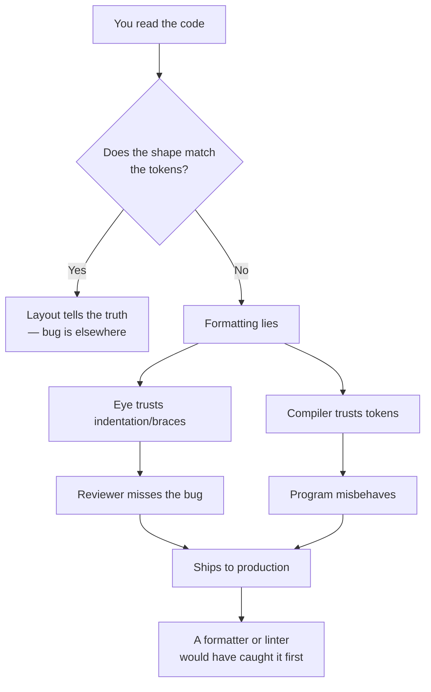
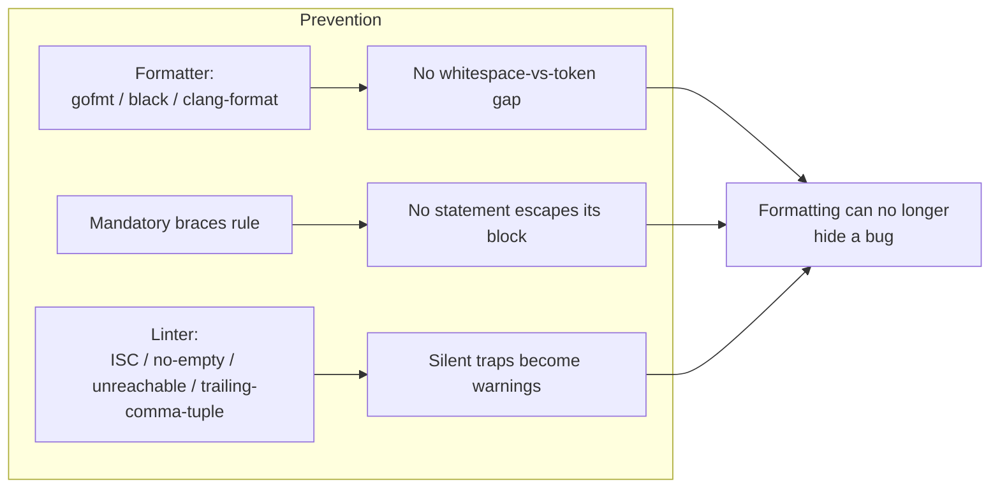

# Formatting — Find the Bug

> 12 snippets where the **formatting** — indentation, brace placement, line breaks, a stray semicolon, a missing comma — lies to the reader about what the code does. The compiler reads tokens; humans read shape. When the two disagree, a real bug lives in the gap. Find it before you read the answer.

---

## Table of Contents

- [How to Use](#how-to-use)
- [Snippet 1 — The duplicated `goto fail` (C-style, the Apple SSL bug)](#snippet-1--the-duplicated-goto-fail-c-style-the-apple-ssl-bug) · `easy`
- [Snippet 2 — A statement that looks inside the `if` (Go)](#snippet-2--a-statement-that-looks-inside-the-if-go) · `easy`
- [Snippet 3 — One line dedented out of the loop (Python)](#snippet-3--one-line-dedented-out-of-the-loop-python) · `medium`
- [Snippet 4 — Dangling else binds to the wrong `if` (Java)](#snippet-4--dangling-else-binds-to-the-wrong-if-java)  · `medium`
- [Snippet 5 — A second statement hiding after a one-line `if` (Java)](#snippet-5--a-second-statement-hiding-after-a-one-line-if-java) · `easy`
- [Snippet 6 — Implicit string concatenation from a missing comma (Python)](#snippet-6--implicit-string-concatenation-from-a-missing-comma-python) · `medium`
- [Snippet 7 — A semicolon ends the loop body early (Java)](#snippet-7--a-semicolon-ends-the-loop-body-early-java) · `easy`
- [Snippet 8 — Macro with no braces swallows one statement (C-style)](#snippet-8--macro-with-no-braces-swallows-one-statement-c-style) · `hard`
- [Snippet 9 — Line continuation glues two strings together (Python)](#snippet-9--line-continuation-glues-two-strings-together-python) · `medium`
- [Snippet 10 — Aligned assignments hide a copy-paste typo (Go)](#snippet-10--aligned-assignments-hide-a-copy-paste-typo-go) · `medium`
- [Snippet 11 — The else-on-its-own-line trap (Python `try/except`)](#snippet-11--the-else-on-its-own-line-trap-python-tryexcept) · `hard`
- [Snippet 12 — Trailing comma turns a value into a tuple (Python)](#snippet-12--trailing-comma-turns-a-value-into-a-tuple-python) · `medium`
- [Scorecard](#scorecard)
- [Related Topics](#related-topics)

---

## How to Use

Each snippet compiles (or runs) without error. That is the trap: the code does something — just not what its layout promises. For every snippet:

1. Read it the way a hurried reviewer would: trust the indentation, skim the braces.
2. Ask "what does this **actually** do, token by token?"
3. State the bug *and* the one-line fix.
4. Note which **automated tool** would have caught it — `gofmt`, `clang-format`, a linter with `curly` / `no-fallthrough` / `flake8`'s `F-codes`, or a compiler warning flag. The recurring lesson: a formatting bug is one a machine should have flagged, and a consistent style would have made impossible.



---

## Snippet 1 — The duplicated `goto fail` (C-style, the Apple SSL bug)

`Difficulty: easy`

The spirit of CVE-2014-1266, the "goto fail" bug that broke TLS certificate verification on Apple platforms in 2014. Reproduced here in Go-flavored pseudocode so the control flow is the star, not the language.

```text
func verifySignature(hashCtx *Context, signedParams *Buffer) error {
    var err error

    if err = sslHashSHA384Update(hashCtx, &clientRandom); err != nil {
        goto fail
    }
    if err = sslHashSHA384Update(hashCtx, &serverRandom); err != nil {
        goto fail
    }
    if err = sslHashSHA384Final(hashCtx, &hashOut); err != nil {
        goto fail
        goto fail
    if err = sslVerifySignedServerKeyExchange(signedParams, &hashOut); err != nil {
        goto fail
    }

fail:
    return err
}
```

**What's wrong?**

<details><summary>Answer</summary>

Look at the third `if`. Its body contains **two** `goto fail` statements, and crucially there is **no brace** around the `if` body, so only the *first* `goto fail` belongs to the `if`. The second `goto fail` is **unconditional** — it runs no matter what the third check returned.

Re-indented to the truth, the code is:

```text
    if err = sslHashSHA384Final(hashCtx, &hashOut); err != nil {
        goto fail
    }
    goto fail   // <-- always jumps to fail, with err == nil

    // unreachable:
    if err = sslVerifySignedServerKeyExchange(signedParams, &hashOut); err != nil {
        goto fail
    }
```

The final, most important check — `sslVerifySignedServerKeyExchange`, the one that actually validates the server's signature — is **never reached**. Control always jumps to `fail`, and at that point `err` is `nil` (the previous step succeeded), so the function returns "success." Every forged certificate verifies as valid. This is a complete bypass of TLS authentication.

**Fix:** delete the duplicated line, and *always* brace your conditional bodies so a stray statement can never silently escape the block:

```text
    if err = sslHashSHA384Final(hashCtx, &hashOut); err != nil {
        goto fail
    }
    if err = sslVerifySignedServerKeyExchange(signedParams, &hashOut); err != nil {
        goto fail
    }
```

**What tooling catches it:** in the original C, `clang -Wunreachable-code` flags the dead `sslVerifySignedServerKeyExchange` block, and `gofmt`/`clang-format` would have re-indented the rogue `goto fail` flush-left against the `if`, making the misalignment scream at any reviewer. A linter rule requiring braces on every `if` body (`curly` in ESLint terms, mandatory braces in `gofmt`'s grammar) makes the bug structurally impossible. The lesson of Snippet 1 is the lesson of the whole chapter: **indentation is a suggestion to humans; braces and tokens are the law. When you let them disagree, you ship a security hole.**

</details>

---

## Snippet 2 — A statement that looks inside the `if` (Go)

`Difficulty: easy`

```go
func withdraw(account *Account, amount int64) error {
    if account.Balance < amount {
        return errors.New("insufficient funds")
    }
    account.Balance -= amount
        logAudit(account.ID, "withdraw", amount)
    return nil
}
```

**What's wrong?**

<details><summary>Answer</summary>

Trick question with a real teaching point. The over-indented `logAudit(...)` line *looks* like it belongs to some block, but Go ignores indentation entirely — it is a plain statement that runs after every withdrawal. The code is **functionally correct**; the formatting is a lie that wastes the reader's attention and invites a future edit to go wrong.

The danger is the next maintainer. Someone sees the indentation, assumes `logAudit` is conditional, and "fixes" the balance check by adding a brace in the wrong place — *now* you have a bug. Misleading whitespace is a bug-in-waiting even when the current behavior is right.

**Fix:** run `gofmt`. It re-indents the line flush with its siblings:

```go
    account.Balance -= amount
    logAudit(account.ID, "withdraw", amount)
```

**What tooling catches it:** `gofmt` (and `go vet`/`gofumpt`) normalize indentation mechanically, which is *why* Go has no indentation-driven bug class — the canonical formatter erases the gap between shape and tokens before code review ever sees it. Any language where formatting is enforced by tooling (Go, Rust with `rustfmt`, anything behind Prettier) eliminates this entire category. The lesson: don't *argue* about whitespace, *automate* it.

</details>

---

## Snippet 3 — One line dedented out of the loop (Python)

`Difficulty: medium`

```python
def total_payroll(employees):
    total = 0
    for emp in employees:
        gross = emp.hours * emp.rate
        bonus = compute_bonus(emp)
        total += gross
    total += bonus
    return total
```

**What's wrong?**

<details><summary>Answer</summary>

In Python, **indentation is the syntax** — there are no braces to disagree with, so a wrong indent is not a style nit, it is a logic change. The line `total += bonus` is dedented one level, so it sits *outside* the `for` loop. It executes exactly **once**, after the loop ends, adding only the **last** employee's `bonus` to the total. Every other employee's bonus is computed (`bonus = compute_bonus(emp)`) and then thrown away on the next iteration.

The intent — visible from `gross` being added per-iteration — is that `bonus` should be added per-iteration too:

```python
    for emp in employees:
        gross = emp.hours * emp.rate
        bonus = compute_bonus(emp)
        total += gross
        total += bonus   # <-- inside the loop
    return total
```

For an empty `employees` list this is even worse: `bonus` is never assigned, so the original code raises `NameError` on `total += bonus` — a latent crash that only fires when there are zero employees.

**What tooling catches it:** this is the hardest class to catch automatically *because the code is syntactically valid* — Python cannot know which indentation you meant. A linter like `pylint`/`ruff` flags the `NameError` path (`used-before-assignment` / `F821` for the empty-list case), and a type checker may warn about `bonus` being possibly-unbound. The durable defense is a test with two or more employees and a test with zero — the loop-vs-after-loop distinction shows up immediately. In indentation-significant languages, **whitespace correctness is unit-test territory, not formatter territory.**

</details>

---

## Snippet 4 — Dangling else binds to the wrong `if` (Java)

`Difficulty: medium`

```java
String classify(int score, boolean isVip) {
    if (isVip)
        if (score > 90)
            return "VIP-PLATINUM";
    else
        return "STANDARD";
    return "VIP-REGULAR";
}
```

**What's wrong?**

<details><summary>Answer</summary>

The `else` is **indented to align with the outer `if (isVip)`**, so the reader is told: "VIPs with a high score are platinum; non-VIPs are standard." But Java's grammar binds an `else` to the **nearest unmatched `if`** — which is the *inner* `if (score > 90)`, regardless of indentation. The real meaning is:

```java
    if (isVip) {
        if (score > 90) {
            return "VIP-PLATINUM";
        } else {
            return "STANDARD";   // <-- a VIP with a low score
        }
    }
    return "VIP-REGULAR";        // <-- reached only by non-VIPs
```

So a **VIP** with a low score is labeled `"STANDARD"`, and a **non-VIP** falls through to `"VIP-REGULAR"`. Both branches are exactly inverted from the indentation's promise. The "dangling else" is one of the oldest formatting traps in C-family languages.

**Fix:** decide the binding explicitly with braces, then format to match:

```java
    if (isVip) {
        return score > 90 ? "VIP-PLATINUM" : "VIP-REGULAR";
    }
    return "STANDARD";
}
```

**What tooling catches it:** `clang-format`/`google-java-format` reindent the `else` under the inner `if`, instantly exposing the contradiction between intent and reality. Checkstyle's `NeedBraces` rule and SpotBugs flag brace-less nested conditionals. The fix and the prevention are the same one habit from Snippet 1: **always brace, so the parser and the eye can never disagree about which `if` an `else` belongs to.**

</details>

---

## Snippet 5 — A second statement hiding after a one-line `if` (Java)

`Difficulty: easy`

```java
void grantAccess(User user, Resource resource) {
    if (user.isAdmin())
        auditLog.record(user, resource);
        resource.unlock();   // intended only for admins
    sendNotification(user);
}
```

**What's wrong?**

<details><summary>Answer</summary>

The braceless `if` governs **only the single statement that immediately follows it** — `auditLog.record(...)`. The next line, `resource.unlock()`, is indented to look like part of the `if` body, but it is an **unconditional** statement. **Every** user unlocks the resource, admin or not. A privilege-escalation bug dressed up as a permission check.

The misleading indentation makes it read as "if admin: log, then unlock." The compiler reads "if admin: log. Then, always: unlock."

**Fix:** brace the body so the grouping is real, not visual:

```java
    if (user.isAdmin()) {
        auditLog.record(user, resource);
        resource.unlock();
    }
    sendNotification(user);
```

**What tooling catches it:** ESLint's `curly`, Checkstyle's `NeedBraces`, and SonarQube's `S121` all forbid brace-less control bodies precisely to kill this bug. Even without a linter, the Python-style mental model — "the colon owns exactly the indented block" — is the *opposite* of how braceless C-family `if`s work, and that mismatch is what trips people. The rule: in any C-family language, **a control statement with two indented lines under it and no braces is always a bug or about to become one.**

</details>

---

## Snippet 6 — Implicit string concatenation from a missing comma (Python)

`Difficulty: medium`

```python
ALLOWED_COMMANDS = [
    "start",
    "stop",
    "restart"
    "status",
    "reload",
]

def is_allowed(cmd):
    return cmd in ALLOWED_COMMANDS
```

**What's wrong?**

<details><summary>Answer</summary>

Look between `"restart"` and `"status"` — there is **no comma**. Python concatenates adjacent string literals at compile time (`"restart" "status"` becomes the single string `"restartstatus"`), so the list is actually:

```python
["start", "stop", "restartstatus", "reload"]
```

There is no `"restart"` and no `"status"` entry. `is_allowed("restart")` and `is_allowed("status")` both return `False`. The list silently has four elements where the formatting promised five, and two valid commands are now rejected. This is a genuine, recurring source of bugs in Python config lists, SQL string builders, and CLI argument tables.

**Fix:** add the missing comma:

```python
    "restart",
    "status",
```

**What tooling catches it:** `flake8`/`ruff` rule **`F811` is the wrong one — the actual one is the implicit-string-concatenation check `ISC001`** (`ruff`'s `flake8-implicit-str-concat`), and `pylint`'s `implicit-str-concat (W1404)`. Enabling that single rule turns this invisible bug into a loud warning. A formatter like `black` will *not* save you here — it happily keeps the concatenation — which is the key insight: **a formatter enforces layout, but only a linter understands that two strings on adjacent lines with no comma is almost never intentional.** Always put a trailing comma after every list element so a forgotten comma can't fuse two lines.

</details>

---

## Snippet 7 — A semicolon ends the loop body early (Java)

`Difficulty: easy`

```java
int countPrimes(int n) {
    int count = 0;
    for (int i = 2; i < n; i++);
    {
        if (isPrime(i)) {
            count++;
        }
    }
    return count;
}
```

**What's wrong?**

<details><summary>Answer</summary>

There is a `;` immediately after the `for(...)` header. That semicolon **is** the loop body — an empty statement. The loop runs to completion doing nothing, then the `{ ... }` block below executes **once** as a plain anonymous block.

But there's a second problem stacked on top: inside that block, `i` is referenced — and `i` was scoped to the `for` loop, so `if (isPrime(i))` won't even compile. If the author had instead declared `i` outside the loop, the code would compile and silently test `isPrime` exactly once on the final value of `i`, returning `0` or `1`. Either way, the trailing semicolon detached the body from the loop.

**Fix:** delete the stray semicolon so the block becomes the loop body:

```java
    for (int i = 2; i < n; i++) {
        if (isPrime(i)) {
            count++;
        }
    }
```

**What tooling catches it:** `javac -Xlint` and IDE inspections flag `for`/`while` with an empty body (`;`) as suspicious; Checkstyle's `EmptyStatement` rule bans it outright, and ESLint's `no-empty` covers the JavaScript equivalent. `clang-format` would place the `{` on the same line as the `for`, making the orphaned semicolon visually obvious. The lesson: **`for (...);` and `while (...);` are almost always typos — let a linter ban the empty statement so the typo can never compile into a no-op loop.**

</details>

---

## Snippet 8 — Macro with no braces swallows one statement (C-style)

`Difficulty: hard`

```text
#define LOG_AND_INC(counter)   logEvent(__func__); counter++

void handleRequest(Request *req) {
    if (req->isValid)
        LOG_AND_INC(validRequests);

    dispatch(req);
}
```

**What's wrong?**

<details><summary>Answer</summary>

The macro `LOG_AND_INC` expands to **two statements** with no enclosing braces. After preprocessing, the `if` reads:

```text
    if (req->isValid)
        logEvent(__func__); validRequests++;

    dispatch(req);
```

The braceless `if` owns only the **first** statement of the expansion, `logEvent(...)`. The `validRequests++` is unconditional — the counter increments for **invalid** requests too, corrupting the metric. If the macro had been written with a comma or used inside a fuller expression, the failure modes get even nastier (the classic `if (x) MACRO; else ...;` produces a hard compile error because the macro's internal semicolon breaks the `else`).

**Fix:** wrap multi-statement macros in the canonical `do { ... } while (0)` idiom, which makes the macro behave as a single braced statement that still requires a trailing semicolon at the call site:

```text
#define LOG_AND_INC(counter)   do { logEvent(__func__); (counter)++; } while (0)
```

**What tooling catches it:** `clang-tidy`'s `bugprone-macro-parentheses` and `cppcoreguidelines` checks flag unparenthesized/unbraced multi-statement macros; `-Wexpansion-to-defined` and careful `-Werror` builds help. But the deepest fix is to **avoid statement-like macros entirely** in favor of `static inline` functions, which carry their own scope and can't leak statements into the caller. When a macro *must* span statements, `do/while(0)` is the only correct wrapper — the formatting of the expansion is invisible at the call site, so the safety has to be baked into the definition.

</details>

---

## Snippet 9 — Line continuation glues two strings together (Python)

`Difficulty: medium`

```python
def build_query(table, where_clause):
    sql = "SELECT * FROM " + table + " " \
          "WHERE " + where_clause
    return sql
```

**What's wrong?**

<details><summary>Answer</summary>

The backslash continues the logical line, so Python sees:

```python
    sql = "SELECT * FROM " + table + " " "WHERE " + where_clause
```

The two adjacent literals `" "` and `"WHERE "` undergo **implicit string concatenation** into `" WHERE "`. That part is fine. The real trap is what's *missing*: the author clearly intended `+ "WHERE "` (string concatenation via `+`), but wrote the second line as a bare literal `"WHERE "` with no `+`. It only works by accident here because adjacent-literal concatenation rescues it. Change the first line to end in a variable instead of a literal —

```python
    sql = "SELECT * FROM " + table \
          "WHERE " + where_clause            # TypeError or silent glue
```

— and you either get a `SyntaxError`/`TypeError`, or, in list/tuple contexts (Snippet 6), a silently fused element. The line-continuation backslash hides the boundary between "deliberate concatenation" and "two literals Python happened to merge."

**Fix:** use parentheses for multi-line expressions (never the fragile backslash) and be explicit with `+`, or better, use a parameterized query:

```python
    sql = (
        "SELECT * FROM " + table + " "
        "WHERE " + where_clause
    )
    # Best: don't build SQL by string concat at all — use parameters.
```

**What tooling catches it:** `flake8`'s `W504`/`W503` cover operator line-break placement, and the `ISC` implicit-concat rules from Snippet 6 catch the silent gluing. `black` rewrites backslash continuations into parenthesized form automatically, which removes the most dangerous mechanism. The lesson: **prefer `(` … `)` over trailing `\` for line continuation — parentheses make the expression's extent unambiguous, while a backslash hides where one string ends and the next begins.** (And string-built SQL is its own security smell — see SQL injection.)

</details>

---

## Snippet 10 — Aligned assignments hide a copy-paste typo (Go)

`Difficulty: medium`

```go
func newRect(width, height float64) Rectangle {
    r := Rectangle{}
    r.Width  = width
    r.Height = height
    r.Area   = width * width
    r.Perim  = 2 * (width + height)
    return r
}
```

**What's wrong?**

<details><summary>Answer</summary>

The columns are beautifully aligned — `Width`, `Height`, `Area`, `Perim` line up, and so do the `=` signs and the right-hand sides. That visual regularity is exactly what hides the bug: `r.Area = width * width` should be `width * height`. The eye reads the *shape* of four parallel assignments and registers "all correct," skating right over the duplicated `width`.

Vertical alignment is a double-edged tool: it makes a column of values scannable, but it also makes a wrong value *blend in* with its correct neighbors. The `Area` of any non-square rectangle is now wrong.

**Fix:**

```go
    r.Area = width * height
```

**What tooling catches it:** nothing purely *formatting*-based catches a semantically-wrong-but-syntactically-valid multiplication — and that's the point. `gofmt` actively *removes* the manual column alignment (Go's formatter aligns struct literals but collapses gratuitous spacing in statements), which is a feature here: less alignment means each line is read on its own merits instead of as part of a too-trustworthy block. The real defenses are a unit test (`newRect(3, 4).Area == 12`) and code review that reads right-hand sides individually. The lesson: **don't over-align. Manual alignment optimizes for "looks tidy" at the cost of "wrong values hide in the column." Let the formatter decide spacing and let tests check arithmetic.**

</details>

---

## Snippet 11 — The else-on-its-own-line trap (Python `try/except`)

`Difficulty: hard`

```python
def load_config(path):
    try:
        with open(path) as f:
            data = parse(f.read())
            validate(data)
            return data
    except FileNotFoundError:
        log.warning("config missing, using defaults")
        return DEFAULTS
    log.info("config loaded from %s", path)
```

**What's wrong?**

<details><summary>Answer</summary>

The `log.info("config loaded ...")` line is **dedented to the function level**, so it sits *after* the entire `try/except`. The author's indentation suggests "log success after loading," but trace the control flow:

- On success, the `try` block hits `return data` — the function exits **before** ever reaching `log.info`.
- On `FileNotFoundError`, the `except` block hits `return DEFAULTS` — again exits before `log.info`.

So `log.info("config loaded ...")` is **dead code**: it executes only if the `try` block *neither returns nor raises*, which never happens here. The "config loaded" message is never logged. Worse, the message claims success but is positioned where it would *also* fire after the defaults path — the indentation tells two contradictory stories and the truth is "neither; it's unreachable."

**Fix:** Python's `try/except` has an `else` clause that runs exactly when the `try` succeeded without exception — use it, and don't `return` from inside `try` if you have post-success work:

```python
    try:
        with open(path) as f:
            data = parse(f.read())
            validate(data)
    except FileNotFoundError:
        log.warning("config missing, using defaults")
        return DEFAULTS
    else:
        log.info("config loaded from %s", path)
        return data
```

**What tooling catches it:** `pylint`/`ruff` report **unreachable code** (`W0101` / `F-series`) when a statement follows a block whose every path returns — this dead `log.info` is exactly that. Coverage tooling flags the line as never-executed in tests. The lesson: **when a line's indentation places it after a try/except where both arms return, it's dead. Python's `try/except/else/finally` exists precisely so success-path code has a real home instead of dangling, unreachable, at the bottom.**

</details>

---

## Snippet 12 — Trailing comma turns a value into a tuple (Python)

`Difficulty: medium`

```python
def get_timeout_seconds(config):
    timeout = config.get("timeout", 30),
    return timeout * 2
```

**What's wrong?**

<details><summary>Answer</summary>

There is a trailing comma after `config.get("timeout", 30)`. In Python, **a trailing comma in an expression context creates a tuple** — `timeout` is now the one-element tuple `(30,)`, not the integer `30`. The formatting looks like a harmless leftover comma (the kind that's *encouraged* inside multi-line collection literals), but here it changes the type.

Then `timeout * 2` does sequence repetition, not arithmetic: `(30,) * 2 == (30, 30)`. The function returns a two-element tuple where the caller expects a number, and the failure surfaces far away — `time.sleep((30, 30))` raises `TypeError`, or a comparison like `if timeout > limit` raises `TypeError: '>' not supported between tuple and int`. The bug's *cause* (a stray comma in `load_config`) and its *symptom* (a type error in `sleep`) are in different files.

**Fix:** delete the trailing comma:

```python
    timeout = config.get("timeout", 30)
    return timeout * 2
```

**What tooling catches it:** `ruff`/`flake8` rule **`F-codes` won't catch it, but `pylint`'s `trailing-comma-tuple (R1707)`** is purpose-built for exactly this — it warns when a statement's value is a tuple created by an accidental trailing comma. A type checker like `mypy` catches the downstream `tuple * int` / `sleep(tuple)` mismatch. The lesson: **a trailing comma is safe *inside* brackets `[...] (...) {...}` and dangerous on a bare assignment — the same character means "tidy list formatting" in one place and "make this a tuple" in another. Enable `trailing-comma-tuple` and let `mypy` guard the boundaries.**

</details>

---

## Scorecard

Tally one point per snippet where you named both the **bug** and the **fix** before opening the answer.

| Score | Verdict |
|------:|---------|
| 11–12 | You read tokens, not indentation. You'd have caught `goto fail` in review. |
| 8–10  | Strong eye. Tighten up on the indentation-is-semantics cases (3, 11) and the silent-concat traps (6, 9). |
| 5–7   | You trust the layout too much. Internalize the rule: braces and tokens are the law; whitespace is a hint that can lie. |
| 0–4   | This chapter just saved you a production incident. Turn on a formatter and a linter today — most of these are one rule away from impossible. |

**The through-line:** every bug here is a place where the code's *shape* and its *meaning* diverged. The fixes cluster into three habits:

1. **Always brace** control bodies (Snippets 1, 4, 5, 8) — so the eye and the parser group statements identically.
2. **Automate formatting** (Snippets 2, 10) — `gofmt`/`clang-format`/`black` erase the human-vs-tokens gap before review.
3. **Lint the silent traps** (Snippets 3, 6, 7, 9, 11, 12) — implicit concat, empty statements, unreachable code, accidental tuples: a machine sees these instantly; a tired human does not.



---

## Related Topics

- [junior.md](junior.md) — the positive formatting rules these snippets violate, explained from scratch.
- [tasks.md](tasks.md) — hands-on exercises: reformat broken snippets and configure a formatter + linter.
- [Formatting chapter README](../README.md) — where this chapter sits in Clean Code.
- [Anti-Patterns](../../anti-patterns/README.md) — formatting anti-patterns (1000-line files, magic whitespace) as recognized smells.
- [Refactoring](../../refactoring/README.md) — how to safely reshape code once you've spotted the bug the layout was hiding.
