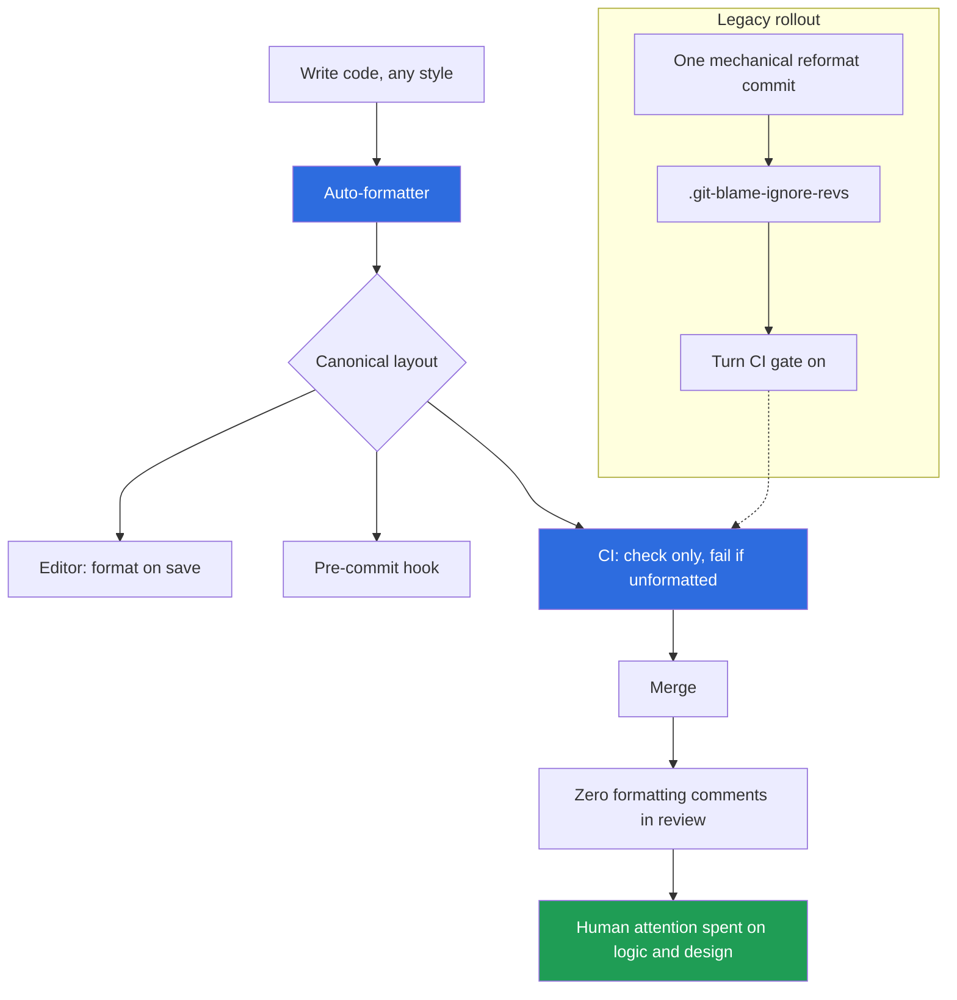

# Formatting — Interview Questions

> 50+ questions across all skill levels (Junior → Staff). Formatting is the cheapest readability lever a team has — and the one most teams waste the most energy arguing about. These questions probe whether you understand the *why* behind formatting rules, and whether you know that the senior answer to almost every formatting debate is "automate it and stop talking about it."

---

## Table of Contents

- [Junior](#junior-15-questions)
- [Mid](#mid-15-questions)
- [Senior](#senior-12-questions)
- [Staff](#staff-10-questions)
- [Rapid-Fire](#rapid-fire)
- [Summary](#summary)
- [Further Reading](#further-reading)
- [Related Topics](#related-topics)

---

## Junior (15 questions)

### J1. What is "formatting" in the Clean Code sense?

<details><summary>Answer</summary>

The visual layout of source code: line length, blank-line placement, indentation, alignment, ordering of declarations, and grouping of related code. It governs how the code *looks*, not what it *does*. Two files with identical behavior can have wildly different readability based on formatting alone.

</details>

### J2. Does formatting change program behavior?

<details><summary>Answer</summary>

Almost never — it's whitespace and ordering. The exceptions prove the rule: significant indentation in Python and YAML, automatic semicolon insertion in JavaScript, and Go's brace-on-same-line rule (a brace on its own line is a compile error). Outside those cases, formatting is purely for humans.

</details>

### J3. What is the "newspaper metaphor"?

<details><summary>Answer</summary>

Robert C. Martin's idea that a source file should read like a newspaper article: the name (headline) tells you what it is about, the top holds high-level concepts (the lede), and detail increases as you scroll down. You should not have to read the whole file to grasp its purpose — the top orients you.

</details>

### J4. What is vertical distance?

<details><summary>Answer</summary>

How far apart related lines of code sit vertically. The principle: concepts that are closely related should be vertically close. A variable should be declared near its first use; a private helper should sit near its caller. Forcing the reader to scroll or jump between distant lines to follow one thought is friction.

</details>

### J5. What does a blank line communicate?

<details><summary>Answer</summary>

A blank line is a soft break — it says *these two groups of lines are separate thoughts*. Blank lines between methods, between the imports block and the code, and between logical paragraphs inside a method all guide the eye. The mistake is sprinkling them randomly until they stop meaning anything.

</details>

### J6. What is a sensible line-length limit?

<details><summary>Answer</summary>

80 to 120 columns is the common range. 80 is the historical default (terminal width); 100 and 120 are popular modern picks because monitors are wider and descriptive names are longer. The exact number matters far less than picking one and enforcing it with a tool so the team stops debating it.

</details>

### J7. Why is horizontal scrolling bad?

<details><summary>Answer</summary>

You cannot read what you cannot see. Lines wider than the editor force horizontal scrolling, hide code in side-by-side diffs and code review, and make terminals and printouts truncate. Keeping lines bounded keeps the whole statement visible at once.

</details>

### J8. Tabs or spaces?

<details><summary>Answer</summary>

Whatever the team's formatter is configured to produce. The honest interview answer is: "I don't care, and neither should the team — pick one, put it in the formatter config, and never discuss it again." Go decides for you (tabs). Python's PEP 8 says spaces. The cost of inconsistency dwarfs the cost of either choice.

</details>

### J9. Why does mixing tabs and spaces cause problems?

<details><summary>Answer</summary>

A tab renders at a variable width (2, 4, 8 columns) depending on each developer's editor. Mixed with spaces, indentation that looks aligned on one machine looks ragged on another. In Python it can change which block a line belongs to, producing `TabError` or a silent logic bug. A formatter normalizes this away.

</details>

### J10. What is an auto-formatter?

<details><summary>Answer</summary>

A tool that parses your code into an abstract syntax tree and re-prints it according to fixed layout rules — `gofmt`, `prettier`, `black`, `rustfmt`, `clang-format`, Spotless. You write code however you like; the formatter rewrites it into the one canonical shape. It runs on save, on commit, or in CI.

</details>

### J11. What is the difference between a formatter and a linter?

<details><summary>Answer</summary>

A formatter rewrites layout (whitespace, line breaks, alignment) and never changes meaning. A linter detects *problems* — unused variables, shadowed names, suspicious patterns — and may or may not auto-fix them. ESLint plus Prettier is the classic split: Prettier owns formatting, ESLint owns correctness. Some tools (Ruff) do both.

</details>

### J12. Where should a variable be declared?

<details><summary>Answer</summary>

As close to its first use as possible, and in the narrowest scope that works. Declaring all variables at the top of a long function (an old C habit) maximizes vertical distance between declaration and use. Declare it where you need it so the reader sees the value and its use together.

</details>

### J13. How should related functions be ordered in a file?

<details><summary>Answer</summary>

Caller above callee — the "stepdown rule." Read top to bottom, you meet a function before the helpers it depends on, so the file reads as a descending sequence of detail. (Languages without forward declarations, like older C, force the inverse; most modern languages do not.)

</details>

### J14. What is "dead" commented-out code and why remove it?

<details><summary>Answer</summary>

Code commented out "in case we need it later." You will not need it — version control already keeps it. Left in, it rots, confuses readers ("is this important?"), and clutters search results. Delete it; `git log` is your safety net.

</details>

### J15. Should formatting be consistent across a single file?

<details><summary>Answer</summary>

Yes — and across the whole repository. The single most important formatting property is *consistency*, not any particular style. A reader who learns the layout of one file can read every file. Inconsistency forces them to re-learn each time, which is exactly the cost a formatter eliminates.

</details>

---

## Mid (15 questions)

### M1. Why do auto-formatters win arguments that humans cannot?

<details><summary>Answer</summary>

Because they remove the subject from the realm of opinion. A formatter makes formatting deterministic and non-negotiable: there is exactly one correct output, the machine produces it, and there is nothing left to debate in review. Human style guides require constant judgment and enforcement; a formatter requires neither. The win is not the chosen style — it is the *end of the discussion*.

</details>

### M2. What does "diff-friendly formatting" mean?

<details><summary>Answer</summary>

A layout that produces minimal, focused diffs when code changes. The key technique is the *trailing comma* in multi-line lists: adding an element touches one line instead of two (no need to add a comma to the previous line). One-argument-per-line for long calls means changing one argument shows as one changed line. The goal: a diff should highlight the semantic change, not formatting noise.

```diff
  items := []string{
      "a",
+     "b",
  }
```

vs. without trailing comma, where adding "b" also edits the "a" line.

</details>

### M3. What is gofmt and why is it culturally significant?

<details><summary>Answer</summary>

`gofmt` is Go's built-in formatter, shipped with the toolchain from day one and applied to the standard library itself. Its significance is cultural: by making one canonical style mandatory and frictionless, Go *eliminated formatting debates from the entire community*. "gofmt'd or it didn't happen." It proved that taking the choice away from developers is a feature, and inspired Prettier, Black, and rustfmt to follow the "no options" philosophy.

</details>

### M4. Why do "opinionated, no-config" formatters exist?

<details><summary>Answer</summary>

Because every configuration option is a future argument. Black calls itself "uncompromising"; Prettier ships with almost no knobs. Removing options removes bikeshedding: nobody can argue about a setting that does not exist. The trade is a small loss of personal preference for a large gain in team friction reduction. This is a deliberate design lesson learned from gofmt.

</details>

### M5. What is `.editorconfig` and what problem does it solve?

<details><summary>Answer</summary>

A simple, editor-agnostic file at the repo root declaring basic whitespace rules — indent style, indent size, line endings, final newline, charset. Most editors read it automatically. It solves the "everyone's editor defaults differ" problem for the lowest-common-denominator settings, *before* a full formatter even runs. It is not a substitute for a formatter; it is the floor.

</details>

### M6. How do you keep formatting out of code review entirely?

<details><summary>Answer</summary>

Run the formatter automatically: a pre-commit hook (or format-on-save) so it never reaches the PR, plus a CI check that fails the build if anything is unformatted. Once both are in place, no human ever comments on formatting in review, because unformatted code cannot merge. Reviewers spend their attention on logic.

</details>

### M7. Should formatting changes go in the same PR as logic changes?

<details><summary>Answer</summary>

No. Mixing them buries the real change in a sea of whitespace diff, making review and `git blame` useless. Land formatting-only changes in a separate, clearly labeled commit/PR ("style: apply prettier, no logic change"). The reviewer can approve it at a glance, and future blame is not polluted. This is one of the most important formatting-discipline rules.

</details>

### M8. How do you roll out a formatter to a large legacy repo?

<details><summary>Answer</summary>

1. Agree on the tool and config (often the default).
2. Run it once over the entire codebase in a single, isolated commit that does *nothing else*.
3. Record that commit's SHA in `.git-blame-ignore-revs` so blame skips it.
4. Add a pre-commit hook and a CI check so new code stays formatted.
5. Communicate the merge window so in-flight branches rebase cleanly.

The one-shot "big bang" beats gradual reformatting because partial adoption produces endless mixed diffs.

</details>

### M9. What is `.git-blame-ignore-revs`?

<details><summary>Answer</summary>

A file listing commit SHAs that `git blame` should skip when attributing lines. You point Git at it with `git config blame.ignoreRevsFile .git-blame-ignore-revs`. Its purpose: a mass-reformatting commit rewrites nearly every line, which would otherwise make every line blame to "applied formatter" and hide the real author. Listing that commit restores meaningful blame, and GitHub honors the file automatically.

</details>

### M10. Why is the bulk-reformat commit kept pure (no logic)?

<details><summary>Answer</summary>

So it can be safely ignored by blame and trivially reviewed. If the reformat commit also changed behavior, you could not list it in `.git-blame-ignore-revs` without hiding a real change, and you could not approve it without reading every line. Purity is what makes the rollout safe.

</details>

### M11. What does a formatter explicitly *not* fix?

<details><summary>Answer</summary>

Meaning. A formatter makes bad code *consistently* laid out — it cannot fix poor names, deep nesting, long functions, duplicated logic, missing abstractions, or wrong design. It pretties the surface. Beautifully formatted spaghetti is still spaghetti. Formatting is necessary but nowhere near sufficient for readable code.

</details>

### M12. How does line length interact with naming and nesting?

<details><summary>Answer</summary>

A line that blows past the limit is often a *symptom*, not a formatting problem: deep nesting eats indentation budget, and verbose names plus chained calls eat width. The fix is usually to extract a method, invert a guard clause to reduce nesting, or introduce a well-named intermediate variable — not to widen the limit. Use the overflow as a design smell detector.

</details>

### M13. What is the "stepdown rule" and how does it shape a file?

<details><summary>Answer</summary>

Each function should be followed by those at the next level of abstraction down, so the file reads as a descending narrative: high-level intent at the top, primitive details at the bottom. It is the file-level expression of the newspaper metaphor and keeps callers vertically near their callees (low vertical distance).

</details>

### M14. When is horizontal alignment a mistake?

<details><summary>Answer</summary>

When you align values into columns by padding with spaces (assignments, struct fields, comments). It looks tidy but: it draws the eye to the wrong axis (values, not names), it breaks the moment one entry grows, and it produces huge diffs when realignment ripples across every line. Most modern formatters refuse to do it for exactly this reason. Let the formatter use single spaces.

</details>

### M15. Why prefer many small files over one giant file, formatting-wise?

<details><summary>Answer</summary>

A 1000-line file defeats the newspaper metaphor: there is no single "front page," related code is separated by vast vertical distance, and navigation becomes scroll-hunting. Splitting along cohesive concepts keeps each file scannable top-to-bottom and keeps related code close. File size is a formatting/structure smell with the same root as Large Class.

</details>

---

## Senior (12 questions)

### S1. Is 80 columns still the right limit in 2025? (trick)

<details><summary>Answer</summary>

**What the interviewer is checking:** whether you treat formatting rules as dogma or as trade-offs.

There is no universal "right" number. 80 came from punch cards and terminal width; it earns its keep for side-by-side diffs, split editor panes, and code projected in meetings. But descriptive names and modern wide monitors make 100 or 120 reasonable. The senior answer: pick a limit the team agrees on, encode it in the formatter, and move on. Defending 80 *or* 120 on principle misses the point — the value is the agreed boundary, not its exact value.

</details>

### S2. A teammate wants to disable the formatter on a file they "feel strongly about." How do you respond?

<details><summary>Answer</summary>

**What the interviewer is checking:** whether you can hold a team-health line against individual preference.

Decline. A formatter only delivers value if it is universal; carve-outs reintroduce the inconsistency it was bought to remove, and one exception invites ten. If the formatter genuinely produces a bad result in a narrow case, the answer is a *scoped, documented* directive (`// gofmt:off`, `// prettier-ignore`) on the specific construct — not opting a whole file out, and not a personal style island.

</details>

### S3. How do you enforce formatting without slowing developers down?

<details><summary>Answer</summary>

Layer it so the feedback is instant and the gate is final:

- **Editor:** format-on-save (instant, zero friction).
- **Pre-commit hook** (e.g., via `pre-commit`, Husky, lefthook): catches anyone whose editor is misconfigured.
- **CI check:** `gofmt -l`, `prettier --check`, `black --check` — the build fails on any unformatted file. This is the source of truth; hooks can be bypassed, CI cannot.

The editor layer means developers rarely *see* the gate, because their code is already formatted before it gets there.

</details>

### S4. Walk through migrating a 2M-line monorepo to a formatter without wrecking blame and open PRs.

<details><summary>Answer</summary>

1. **Decide config once**, prefer defaults, write it down.
2. **Freeze window:** announce a date; ask teams to merge or note in-flight branches.
3. **Single mechanical commit** applies the formatter repo-wide, nothing else.
4. Add its SHA to `.git-blame-ignore-revs`; set `blame.ignoreRevsFile` in repo config and document it for local clones (GitHub honors it automatically).
5. **In-flight branches rebase**; conflicts are mostly whitespace and resolve with "format then re-apply." Provide a script.
6. **CI gate flips on** the same day so the repo can never drift back.

For truly huge repos, consider per-top-level-directory commits (each pure) so blame-ignore and review stay tractable, but each commit stays formatting-only.

</details>

### S5. How do you decide between Prettier-style "zero config" and a tunable formatter?

<details><summary>Answer</summary>

Default to opinionated/zero-config. Every option you expose is a recurring negotiation and a source of inter-repo drift. Reach for a tunable formatter (clang-format, ktlint with overrides) only when the language ecosystem lacks a dominant canonical style, or when you must match a large existing codebase's entrenched layout cheaply. Even then, set the options once, commit the config, and treat it as frozen.

</details>

### S6. What's the relationship between formatting and code review culture?

<details><summary>Answer</summary>

A healthy team has *zero* formatting comments in review, because the machine handles it. Formatting nits in PRs are a smell: they signal missing automation and they crowd out substantive feedback (logic, design, tests). Worse, they create friction and "nit fatigue." Automating formatting is partly a tooling decision and partly a *culture* decision: it declares that human review time is for things only humans can judge.

</details>

### S7. Why can excessive vertical whitespace be as bad as too little?

<details><summary>Answer</summary>

Blank lines are punctuation; over-use destroys their meaning. If every statement is spaced out "for breathing room," nothing groups, the reader scrolls more, less code fits on screen, and the eye loses the paragraph structure that blank lines are supposed to convey. Whitespace should mark *boundaries between thoughts*, not pad every line. Signal requires contrast.

</details>

### S8. How does formatting interact with merge conflicts?

<details><summary>Answer</summary>

Good diff-friendly formatting *reduces* conflicts: one-element-per-line plus trailing commas means two people adding different list entries touch different lines and merge cleanly. Aligned columns and packed multi-statement lines *increase* conflicts because unrelated edits collide on the same line. A consistent formatter also prevents the "my editor reflowed the file" pseudo-conflict entirely.

</details>

### S9. A reviewer blocks a PR over a formatting nit the formatter doesn't catch. What's the systemic fix?

<details><summary>Answer</summary>

**What the interviewer is checking:** whether you fix the process or just the PR.

If it is a recurring nit, encode it: add the rule to the formatter/linter config so the machine enforces it and no human ever has to raise it again. If the tool cannot express it, write it into the style guide so it is a shared standard rather than one reviewer's taste — or decide it is not worth a rule and drop it. Either way, the fix is "make it automatic or make it a documented norm," never "argue it per PR."

</details>

### S10. How do you handle generated code and vendored code with respect to formatting?

<details><summary>Answer</summary>

Exclude it. Generated files (protobuf output, codegen, minified bundles) and third-party vendored code should be ignored by the formatter and the CI check (`.prettierignore`, formatter exclude globs, `// Code generated ... DO NOT EDIT.` markers that `gofmt` and tooling recognize). Reformatting generated code creates churn that the next regeneration undoes, and reformatting vendored code makes upstream updates conflict.

</details>

### S11. What's the argument for the formatter being part of the language toolchain itself (gofmt) vs a third-party tool?

<details><summary>Answer</summary>

Bundling it (gofmt, rustfmt, `cargo fmt`, `dart format`) maximizes adoption: it is there by default, there is one canonical style, and the community converges instantly. Third-party formatters (Prettier, Black) achieve similar effects through ecosystem dominance but require a deliberate install/config step and can fragment (multiple competing tools, version skew). The lesson languages learned from Go: ship the formatter, take away the choice, kill the debate at the source.

</details>

### S12. How do you measure that a formatting rollout succeeded?

<details><summary>Answer</summary>

Leading indicators: zero unformatted files in CI (the check passes), zero formatting comments appearing in code review, and developers no longer asking "what's our indent style?" Lagging indicators: cleaner diffs (less whitespace noise per PR), fewer whitespace-only merge conflicts, and onboarding engineers shipping correctly-formatted code on day one without being told. If people stopped thinking about formatting, it worked.

</details>

---

## Staff (10 questions)

### St1. Formatting is "solved." Why does it still consume engineering time at scale?

<details><summary>Answer</summary>

**What the interviewer is checking:** systems thinking about developer experience across an org.

The per-decision cost is near zero, but at org scale the *coordination* cost is real: tool version skew across hundreds of repos, drift between languages each with its own formatter, monorepo CI cost of formatting checks, polyglot teams enforcing N tools, and the migration of legacy repos. The staff-level work is not choosing tabs vs spaces — it is building the *platform* (shared config, pre-commit framework, CI templates, a single command that formats any repo) so that every team gets the solved-problem benefits without re-solving it.

</details>

### St2. How would you standardize formatting across 300 repos in 6 languages?

<details><summary>Answer</summary>

- One canonical formatter per language, defaults preferred, configs published as a shared package/template so they cannot drift.
- A single bootstrap (`make fmt` / pre-commit config) injected into every repo via a templating tool or repo-creation scaffold.
- CI check standardized in a reusable pipeline template, so a repo *cannot* be created without the gate.
- A scripted migration (mechanical reformat + `.git-blame-ignore-revs` + gate-on) applied repo by repo.
- A dashboard tracking adoption. Treat formatting like any other golden-path platform capability: paved road, opt-out is loud.

</details>

### St3. When is enforcing a single formatting standard org-wide the wrong call?

<details><summary>Answer</summary>

When you would have to fight the language's own canonical style (don't impose 2-space tabs on Go), when a large acquired codebase's reformat cost and blame disruption outweigh the benefit for a stable, rarely-touched component, or when a polyglot org would gain more from "each ecosystem uses its idiomatic default" than from a forced cross-language house style. Uniformity *within* an ecosystem matters; forcing uniformity *across* ecosystems often costs more than it returns.

</details>

### St4. How do you think about the cost/benefit of `.git-blame-ignore-revs` at scale?

<details><summary>Answer</summary>

Benefit: it preserves `git blame` (a core debugging and ownership tool) through mass reformatting, which otherwise destroys attribution for the whole repo. Cost: it must be configured locally (`blame.ignoreRevsFile`) or it only works on platforms that honor it (GitHub does); engineers on the CLI without the config see polluted blame. At scale you bake the `git config` into your repo bootstrap and onboarding so it is set automatically. The cost is small and one-time; the benefit recurs on every future bug investigation.

</details>

### St5. Can formatting tooling create reliability risk?

<details><summary>Answer</summary>

Yes, if naive. A formatter is in the commit/CI critical path: a bad formatter version bump can reformat the world and produce a massive surprise diff, an auto-fixing tool in CI that pushes commits can race or loop, and a formatter that is not pinned causes "works on my machine" diffs between developer and CI versions. Mitigations: pin the formatter version (lockfile/container), make CI *check* not *fix*, and gate formatter upgrades behind a deliberate one-shot reformat commit like any other rollout.

</details>

### St6. What does formatting tell you, indirectly, about an organization's engineering maturity?

<details><summary>Answer</summary>

A lot. Automated, invisible, never-discussed formatting signals teams that have learned to spend human attention only where it is irreplaceable. Persistent formatting debates, style nits in review, and "each senior has their own way" signal missing automation, weak platform investment, and a culture that argues taste instead of encoding decisions. Formatting is a cheap diagnostic for whether a team automates its conventions.

</details>

### St7. How do you future-proof a formatting standard against tool churn?

<details><summary>Answer</summary>

Depend on *categories*, not specific tools: "every repo has a `make fmt` and a `make fmt-check`" abstracts over which formatter sits behind them, so swapping Black for Ruff, or ESLint+Prettier for Biome, is a one-line change in a template, not a 300-repo migration. Pin versions for reproducibility, but keep the interface (the command, the CI step name) stable so the implementation can move underneath.

</details>

### St8. Argue both sides: should auto-fix run in CI and push commits, or just fail the build?

<details><summary>Answer</summary>

**Fail-only (preferred):** CI stays read-only, no surprise commits, no bot-vs-human races, developer's local hook does the fixing. Downside: a developer with a broken local setup gets a red build and must fix locally.

**Auto-fix-and-push:** more convenient, never blocks on a trivial format. Downside: CI mutating the branch is surprising, can loop or race with concurrent pushes, complicates required-status and signed-commit policies, and hides the fact that local tooling is misconfigured.

Staff answer: fail-only in CI, fix in the local hook/editor. Keep the pipeline a verifier, not a mutator.

</details>

### St9. How does formatting relate to the broader principle "encode conventions, don't enforce them by review"?

<details><summary>Answer</summary>

Formatting is the canonical example of a general staff principle: any convention a human has to *remember and police* will erode, but a convention a *machine* enforces is free and permanent. Formatting was the first convention to be fully automated, and it shows the pattern to extend everywhere — lint rules, architecture fitness functions, dependency policies, commit-message linting. The mindset is "turn taste into tooling."

</details>

### St10. A senior engineer says "formatters make all code look the same and erase craftsmanship." Respond.

<details><summary>Answer</summary>

**What the interviewer is checking:** whether you can reframe a values objection without dismissing it.

Acknowledge the kernel of truth — there *is* a craft to layout — then reframe: uniform formatting is a feature, not a loss. Craftsmanship lives in naming, decomposition, abstraction, error handling, and design — things a formatter cannot touch. By taking the *mechanical* layer off the table, the formatter frees that craftsmanship to operate where it matters and frees the team from low-value debate. Wanting your personal layout to survive in shared code is optimizing for self-expression over team readability, which is the wrong trade in a codebase many people maintain.

</details>

---

## Rapid-Fire

| Question | Answer |
|---|---|
| One-word goal of formatting? | Consistency. |
| Tabs or spaces? | Whatever the formatter outputs. |
| 80 or 120 columns? | Pick one, enforce it, stop arguing. |
| Formatting in the same PR as logic? | No — separate, labeled commit. |
| Tool that ended Go's formatting debates? | `gofmt`. |
| File that protects blame after a mass reformat? | `.git-blame-ignore-revs`. |
| Formatter vs linter? | Formatter rewrites layout; linter finds problems. |
| Can a formatter fix bad names? | No — only layout. |
| Best trailing-comma benefit? | Smaller, cleaner diffs. |
| Where should a variable be declared? | Near its first use. |
| Caller above or below callee? | Above (stepdown rule). |
| What does a blank line mean? | Boundary between two thoughts. |
| CI should fix or check formatting? | Check (read-only). |
| Newspaper metaphor in one line? | High-level at the top, detail below. |
| Why opinionated/zero-config formatters? | Every option is a future argument. |
| Editorconfig's job? | Baseline whitespace rules across editors. |
| Right reaction to a recurring format nit in review? | Encode it in the tool. |
| Generated code and formatters? | Exclude it. |
| Excessive blank lines — fine? | No; whitespace must keep contrast to mean anything. |
| 1000-line file — formatting smell? | Yes; split along cohesive concepts. |

---

## Summary



The through-line of every formatting question is the same: **formatting is a solved problem the moment you stop solving it by hand.** Pick a tool (prefer the opinionated, zero-config one — `gofmt` is the model), make it run automatically (editor, hook, CI-as-check), roll it out to legacy code in one pure commit protected by `.git-blame-ignore-revs`, and never let formatting into code review again. The underlying principles — the newspaper metaphor, vertical distance, bounded line length, diff-friendly layout, meaningful blank lines — are *why* a given style is good, but the senior move is to encode them in tooling so no human has to remember or argue them. And always remember the limit: a formatter perfects the surface and touches nothing beneath it. Well-formatted bad code is still bad code.

---

## Further Reading

- Robert C. Martin, *Clean Code*, Chapter 5 ("Formatting").
- Go team, *gofmt* documentation and "Go fmt your code" blog post.
- *Prettier* and *Black* design rationale ("opinionated", "uncompromising").
- Git documentation: `blame.ignoreRevsFile` and `.git-blame-ignore-revs`.
- *EditorConfig* specification.

---

## Related Topics

- [Formatting — Junior](junior.md)
- [Formatting — Professional](professional.md)
- [Clean Code chapter overview](../README.md)
- [Meaningful Names](../01-meaningful-names/README.md)
- [Anti-Patterns](../../anti-patterns/README.md)
- [Refactoring](../../refactoring/README.md)
