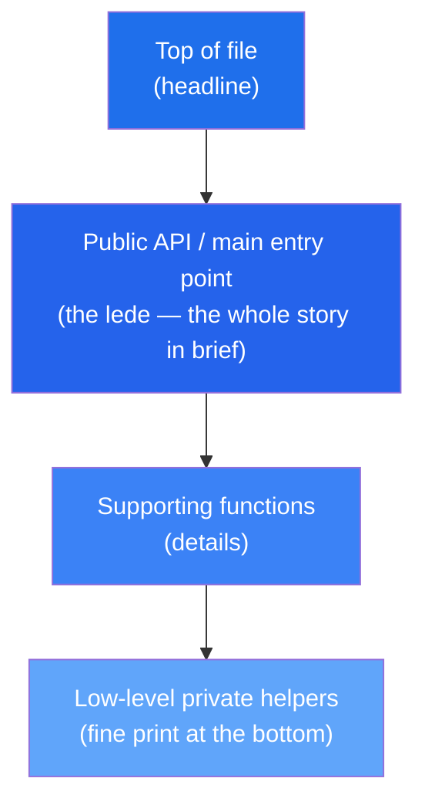
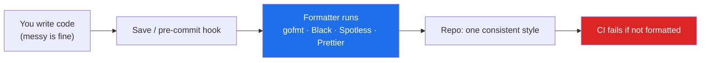

# Formatting — Junior Level

> **Level:** Junior — "What's the rule? Show me a clean example."
> **Source:** Robert C. Martin, *Clean Code*, Chapter 5 — "Formatting."

---

## Table of Contents

1. [Why formatting matters](#why-formatting-matters)
2. [The newspaper metaphor](#the-newspaper-metaphor)
3. [Vertical openness between concepts](#vertical-openness-between-concepts)
4. [Vertical density of related lines](#vertical-density-of-related-lines)
5. [Vertical distance — keep related code close](#vertical-distance--keep-related-code-close)
6. [Declare variables near their use](#declare-variables-near-their-use)
7. [Horizontal formatting — line width](#horizontal-formatting--line-width)
8. [Whitespace around operators](#whitespace-around-operators)
9. [Indentation expresses scope](#indentation-expresses-scope)
10. [No horizontal alignment hacks](#no-horizontal-alignment-hacks)
11. [The big lesson — let a formatter own this](#the-big-lesson--let-a-formatter-own-this)
12. [Common Mistakes](#common-mistakes)
13. [Test Yourself](#test-yourself)
14. [Cheat Sheet](#cheat-sheet)
15. [Summary](#summary)
16. [Further Reading](#further-reading)
17. [Related Topics](#related-topics)

---

## Why formatting matters

Code is read far more often than it is written. The compiler does not care whether your braces line up or your functions are 5 lines or 500 — but the next person to open the file does, and that person is usually you, three months from now.

Formatting is communication. Good formatting makes the structure of a file visible *before* you read a single identifier: where one idea ends and the next begins, which lines belong together, how deep the nesting goes. Bad formatting hides that structure and forces the reader to reconstruct it line by line.

This chapter is about two axes:

| Axis | What it controls | The question it answers |
|---|---|---|
| **Vertical formatting** | Order and spacing of lines top-to-bottom | *In what order do I meet the ideas, and what belongs together?* |
| **Horizontal formatting** | Line width, spacing, indentation left-to-right | *How wide is a line, and how is it spaced?* |

> **Key idea:** You should never hand-format code in a serious project. A formatting *tool* — gofmt, Black, google-java-format, Prettier — owns the mechanical decisions so the team never argues about them. This chapter teaches the rules so you understand *what the tool is doing and why*, not so you do it by hand.

---

## The newspaper metaphor

Think about how you read a newspaper article. The **headline** tells you what it's about. The first paragraph gives you the whole story in broad strokes. As you read down, the details increase. You can stop at any point and still have understood the most important part.

A well-formatted source file reads the same way:

- The **top** holds the most important, highest-level things: the package/module declaration, imports, the primary public function or type.
- As you go **down**, you find the lower-level details: the private helpers, the implementation guts.
- A reader who only wants the gist can read the top and stop.



```go
// Top: the headline — what this file is and what it exposes.
package billing

import "time"

// The lede: the public function a reader cares about first.
func MonthlyTotal(invoices []Invoice, month time.Month) Money {
    total := Money(0)
    for _, inv := range invoices {
        if inv.Month() == month {
            total += inv.Amount
        }
    }
    return total
}

// Details below: a private helper used only by the function above.
func (inv Invoice) Month() time.Month {
    return inv.IssuedAt.Month()
}
```

The caller-before-callee order means that by the time you reach `Month()`, you already know why it exists.

---

## Vertical openness between concepts

A blank line is a visual pause. It tells the reader: *one thought has ended, another begins.* Use blank lines to separate distinct concepts — groups of imports, function definitions, logical phases inside a function.

```python
# Bad — no breathing room; phases run together.
def register_user(name, email):
    if not email:
        raise ValueError("email required")
    user = User(name=name, email=email.lower())
    db.save(user)
    send_welcome_email(user)
    return user
```

```python
# Good — blank lines separate validation, construction, persistence, side effect.
def register_user(name, email):
    if not email:
        raise ValueError("email required")

    user = User(name=name, email=email.lower())
    db.save(user)

    send_welcome_email(user)
    return user
```

The blank lines turn one undifferentiated wall into three readable beats: *check the input, build and store the thing, then notify.*

---

## Vertical density of related lines

The flip side of openness: lines that *are* closely related should sit together with **no** blank line between them. A blank line in the middle of a tight group breaks the visual unit and suggests a separation that isn't there.

```java
// Bad — random blank lines shred a cohesive declaration block.
public class Customer {

    private String id;

    private String name;

    private String email;
}
```

```java
// Good — the fields form one concept; keep them dense.
public class Customer {
    private String id;
    private String name;
    private String email;
}
```

The rule of thumb: **openness between concepts, density within a concept.**

---

## Vertical distance — keep related code close

Concepts that are closely related should be vertically close to each other. If function `B` is called only by function `A`, put `B` right below `A`. Forcing the reader to scroll or jump to a different part of the file to follow the logic adds friction every single time.

```go
// Good — caller and the helper it depends on sit next to each other.
func ProcessOrder(o Order) error {
    if err := validate(o); err != nil {
        return err
    }
    return charge(o)
}

func validate(o Order) error {
    if o.Total <= 0 {
        return errors.New("order total must be positive")
    }
    return nil
}

func charge(o Order) error {
    return paymentGateway.Charge(o.CustomerID, o.Total)
}
```

You read `ProcessOrder`, then immediately meet `validate` and `charge` in the order they were called. No hunting.

---

## Declare variables near their use

A variable should be declared as close as possible to where it is first used — ideally on the line right before, or at the top of the smallest block that needs it. Declaring everything at the top of a long function (a habit left over from old C) means the reader has to scroll back up to remember what `temp` was.

```python
# Bad — declared far from use; reader forgets what 'discount' is by line 12.
def price(order):
    discount = 0
    tax = 0
    shipping = 0
    # ... 8 lines of unrelated logic ...
    if order.coupon == "SAVE10":
        discount = order.subtotal * 0.10
    # ...
    return order.subtotal - discount + tax + shipping
```

```python
# Good — each value appears where it is computed and used.
def price(order):
    subtotal = order.subtotal

    discount = subtotal * 0.10 if order.coupon == "SAVE10" else 0
    tax = subtotal * 0.08
    shipping = 0 if subtotal > 100 else 9.99

    return subtotal - discount + tax + shipping
```

The good version reads as a straight line: nothing is declared before you can see why.

---

## Horizontal formatting — line width

Keep lines short enough to read without horizontal scrolling. The common limit is **100–120 characters**. Lines wider than that force the reader to scroll sideways, break side-by-side diffs in code review, and wrap unpredictably on different screens.

```java
// Bad — one 160-character line; you can't see the end without scrolling.
public Receipt checkout(Cart cart, Customer customer, PaymentMethod method, Address shippingAddress, Coupon coupon, boolean giftWrap) { return process(cart, customer, method, shippingAddress, coupon, giftWrap); }
```

```java
// Good — wrapped under ~100 chars, one argument family per line.
public Receipt checkout(
        Cart cart,
        Customer customer,
        PaymentMethod method,
        Address shippingAddress,
        Coupon coupon,
        boolean giftWrap) {
    return process(cart, customer, method, shippingAddress, coupon, giftWrap);
}
```

> **Note:** A line that is hard to fit under 120 characters is often a hint of a deeper smell — too many parameters, or doing too much on one line. Formatting limits surface design problems.

---

## Whitespace around operators

Surround binary operators and separate arguments with single spaces. Whitespace groups what belongs together and separates what doesn't. No space makes math look like a blob; too much space scatters it.

```python
# Bad — operators jammed together.
total=base*qty+tax-discount
coords=[x,y,z]

# Good — single spaces around operators, after commas.
total = base * qty + tax - discount
coords = [x, y, z]
```

A subtle but useful refinement: tighter spacing can signal tighter binding (factors before terms), though in practice you let the formatter decide and never agonize over it.

```python
# multiplication binds tighter than addition — readable either way,
# but the formatter will pick one consistent style for the whole codebase.
result = a * b + c * d
```

---

## Indentation expresses scope

Indentation is how the reader sees nesting depth — which statements live inside which block. It is not decoration; it is the visible shape of the code's structure. Keep it consistent (one level per scope) and let the formatter pick the unit (tabs vs. spaces, 2 vs. 4).

```go
// The indentation IS the scope. Each level in = one block deeper.
func summarize(orders []Order) map[string]int {
    counts := make(map[string]int)
    for _, o := range orders {
        if o.Shipped {
            counts[o.Region]++
        }
    }
    return counts
}
```

Reading the indentation alone tells you: there's a loop, inside it a condition, inside that one statement. You don't even need to read the identifiers to see the shape.

Never collapse a scope onto one line to "save space":

```go
// Bad — hides the scope; the if-body is invisible at a glance.
for _, o := range orders { if o.Shipped { counts[o.Region]++ } }
```

---

## No horizontal alignment hacks

A tempting trick is to align assignments or struct fields into neat columns with extra spaces. It looks tidy at first — but it is fragile and it hurts. Add one longer name and you must re-space every line in the block, producing a noisy diff that buries the real change. Worse, the alignment draws the eye to the *columns* (the values) instead of the *names*.

```go
// Bad — manual column alignment.
type Config struct {
    Host        string
    Port        int
    Timeout     time.Duration
    EnableDebug bool
}
```

```go
// Good — single space; let the names sit naturally.
type Config struct {
    Host string
    Port int
    Timeout time.Duration
    EnableDebug bool
}
```

```java
// Bad — aligned '=' columns; renaming 'x' to 'xCoordinate' reflows everything.
int    x      = 0;
int    y      = 0;
String label  = "origin";

// Good
int x = 0;
int y = 0;
String label = "origin";
```

> **The deeper point:** if a block of code begs for column alignment to be readable, the block is probably too big or doing too much. Fix the structure, not the spacing. (In Go specifically, `gofmt` *will* align struct-field types — but it does it automatically and consistently, which is the whole point: you never align by hand.)

---

## The big lesson — let a formatter own this

Here is the single most important takeaway of this entire chapter:

**You should not format code by hand. A formatting tool should do it for you, automatically, on every save and in CI.**

Every rule above — line width, blank lines, operator spacing, indentation, alignment — is mechanical. Mechanical decisions are exactly what computers do better than humans and faster than any debate. When a formatter owns formatting:

- There is **one** style for the whole codebase, by definition.
- Code review never wastes a comment on spacing.
- "Tabs vs. spaces" is decided once, by the tool, and is never discussed again.
- New contributors match the house style instantly without reading a style guide.

Each major language has a de-facto standard formatter:

| Language | Formatter | Notes |
|---|---|---|
| **Go** | `gofmt` / `goimports` | Built into the toolchain; *the* canonical style. No options — that's the feature. |
| **Python** | **Black** (+ `isort` for imports) | "Any color you like, as long as it's black." |
| **Java** | **google-java-format** / **Spotless** | Spotless wires it into Gradle/Maven and CI. |
| **JS / TS / etc.** | **Prettier** | The web ecosystem's default. |

```bash
# Go — formats in place; run on save or in a pre-commit hook.
gofmt -w .
goimports -w .

# Python — Black is opinionated and deterministic.
black .
isort .

# Java — via Spotless (Gradle): formats and verifies in CI.
./gradlew spotlessApply   # fix
./gradlew spotlessCheck   # fail the build if unformatted

# JS/TS — Prettier
npx prettier --write .
```



The right team rule is not "everyone please format carefully." It is **"the build fails if the code isn't formatted."** Then nobody has to remember, and nobody has to argue.

---

## Common Mistakes

These are the formatting anti-patterns to recognize and avoid.

### 1000-line files

A file that scrolls for a thousand lines almost always holds more than one concept. The newspaper metaphor breaks — there is no single "story." Split it into focused files, each with one clear responsibility. (This is the **Large Class** smell wearing a formatting costume.)

### Inconsistent style within one team

Three files, three brace styles, two indentation widths. The reader's eye has to re-calibrate on every file. The cure is not a longer style guide — it is a **formatter wired into CI** so consistency is mechanical, not a matter of discipline.

### Commented-out blocks for "visual emphasis"

```python
# Don't do this.
# ============================================
# ===========  IMPORTANT SECTION  ============
# ============================================
def charge_card(): ...
```

ASCII banners and decorative comment walls are noise. They rot, they lie, and they fool no one into reading more carefully. A blank line and a plain `# Charge the card` does the job. Real structure comes from *splitting code*, not from drawing boxes around it.

### Tabs/spaces wars left unresolved by tooling

If half the team uses tabs and half uses spaces, every file becomes a battleground and diffs fill with invisible whitespace churn. This is not a philosophical question to debate forever — it is a setting. Pick one in the formatter config (gofmt picks for you), commit an `.editorconfig`, and move on.

### Horizontal scrolling (lines > 120 chars)

If you have to scroll sideways to read a line, so does every reviewer, and side-by-side diffs become useless. Wrap long lines, or — better — fix the underlying cause (too many arguments, a chained expression doing too much).

### Magic vertical whitespace (everything spaced out)

```java
// Bad — a blank line after EVERY statement destroys grouping.
int subtotal = computeSubtotal(items);

int discount = computeDiscount(subtotal);

int tax = computeTax(subtotal);

return subtotal - discount + tax;
```

When *everything* is spaced out, *nothing* is grouped — the blank line loses all meaning. Blank lines are punctuation; using one after every word is like ending every word with a period. Reserve them for real concept boundaries.

---

## Test Yourself

**1. What does the "newspaper metaphor" tell you about how to order a file?**

<details><summary>Answer</summary>

Most important, highest-level things at the top (the headline and lede): public API, the primary function. Lower-level details below (the fine print): private helpers, implementation guts. A reader should be able to read the top and understand the gist, then descend for detail. Callers go above the callees they use.

</details>

**2. When should two lines have a blank line between them, and when not?**

<details><summary>Answer</summary>

Blank line **between** distinct concepts (vertical openness) — e.g., between a validation phase and a persistence phase, or between two functions. **No** blank line **within** a single cohesive concept (vertical density) — e.g., between fields of the same class or steps of one tight operation. Rule: openness between concepts, density within a concept.

</details>

**3. Where should you declare a local variable?**

<details><summary>Answer</summary>

As close as possible to its first use — ideally the line before it, or at the top of the smallest block that needs it. Declaring all variables at the top of a long function forces the reader to scroll back to recall what each one is.

</details>

**4. Why is manually aligning `=` signs or struct fields into columns a bad idea?**

<details><summary>Answer</summary>

It is fragile and noisy: adding one longer name forces you to re-space the whole block, producing a large diff that buries the real change. It also draws the eye to the values instead of the names. Use a single space and let the formatter handle any alignment (gofmt aligns struct types automatically and consistently — the point is it's never done by hand).

</details>

**5. Your team keeps arguing about tabs vs. spaces and brace placement in code review. What's the real fix?**

<details><summary>Answer</summary>

Stop arguing and stop hand-formatting. Adopt the language's standard formatter (gofmt, Black, google-java-format/Spotless, Prettier), commit its config plus an `.editorconfig`, and wire a check into CI so the build fails on unformatted code. Then style is mechanical, uniform, and never debated again.

</details>

**6. Why might a line that won't fit under 120 characters be a *design* problem, not just a formatting one?**

<details><summary>Answer</summary>

An over-long line often means too many parameters, deeply chained calls, or a single statement doing several things — all design smells. Formatting limits surface these: the inability to fit the line is the symptom; the cure is usually to extract a method, introduce a parameter object, or split the expression, not just to wrap the text.

</details>

---

## Cheat Sheet

| Rule | Do | Don't |
|---|---|---|
| **Newspaper order** | High-level at top, details below; callers above callees | Scatter the entry point in the middle |
| **Vertical openness** | Blank line between concepts | Run distinct phases together |
| **Vertical density** | Keep cohesive lines adjacent | Sprinkle blank lines inside one concept |
| **Vertical distance** | Put related functions close | Make the reader scroll/jump to follow logic |
| **Declare near use** | Variable next to where it's used | Declare everything at the top |
| **Line width** | ~100–120 chars max | Lines that need horizontal scrolling |
| **Operator spacing** | `a * b + c`, `[x, y, z]` | `a*b+c`, `[x,y,z]` |
| **Indentation** | One level per scope, consistent | Collapse scopes onto one line |
| **Alignment** | Single space; let the tool align | Hand-align `=` or field columns |
| **Ownership** | Formatter + CI check own all of the above | Format by hand; argue in review |

**Format-on-save commands:**

```bash
gofmt -w . && goimports -w .     # Go
black . && isort .               # Python
./gradlew spotlessApply          # Java (Spotless)
npx prettier --write .           # JS/TS
```

---

## Summary

- Formatting is **communication**: it makes a file's structure visible before you read the logic.
- **Vertical formatting** controls order and spacing top-to-bottom: the newspaper metaphor (important first), openness between concepts, density within a concept, keeping related code close, and declaring variables near their use.
- **Horizontal formatting** controls each line: keep width to ~100–120 chars, put single spaces around operators and after commas, use indentation to show scope, and never hand-align into columns.
- The anti-patterns — 1000-line files, inconsistent team style, comment-banner "emphasis," unresolved tabs/spaces wars, horizontal scrolling, and blank-line-after-everything — all destroy the structure that good formatting reveals.
- **The one rule that subsumes the rest:** do not format by hand. Adopt your language's standard formatter (gofmt/goimports, Black, google-java-format/Spotless, Prettier) and make a CI check enforce it. Then the style is consistent by construction and never debated.

---

## Further Reading

- Robert C. Martin, *Clean Code* (2008), Chapter 5 — "Formatting."
- [The Go Programming Language Specification & `gofmt` documentation](https://pkg.go.dev/cmd/gofmt)
- [Black — The Uncompromising Python Code Formatter](https://black.readthedocs.io/)
- [google-java-format](https://github.com/google/google-java-format) and [Spotless](https://github.com/diffplug/spotless)
- [Prettier — Opinionated Code Formatter](https://prettier.io/)
- [EditorConfig](https://editorconfig.org/) — share basic whitespace settings across editors.

---

## Related Topics

- [middle.md](middle.md) — formatting at scale: team standards, file/package organization, and wiring formatters into the build.
- [senior.md](senior.md) — formatting as a leadership concern: enforcement strategy, migrating a legacy codebase, and where formatting ends and design begins.
- [Chapter README](../README.md) — the positive formatting rules and the anti-patterns to avoid.
- [Meaningful Names](../01-meaningful-names/README.md) — the other half of readable code; good names plus good formatting are inseparable.
- [Functions](../02-functions/README.md) — small functions make the newspaper metaphor and vertical distance natural.
- [Refactoring](../../refactoring/README.md) — many "formatting" pains are really structural smells (1000-line files, over-wide lines) cured by refactoring.
- [Anti-Patterns](../../anti-patterns/README.md) — the broader catalog of habits to recognize and avoid.
