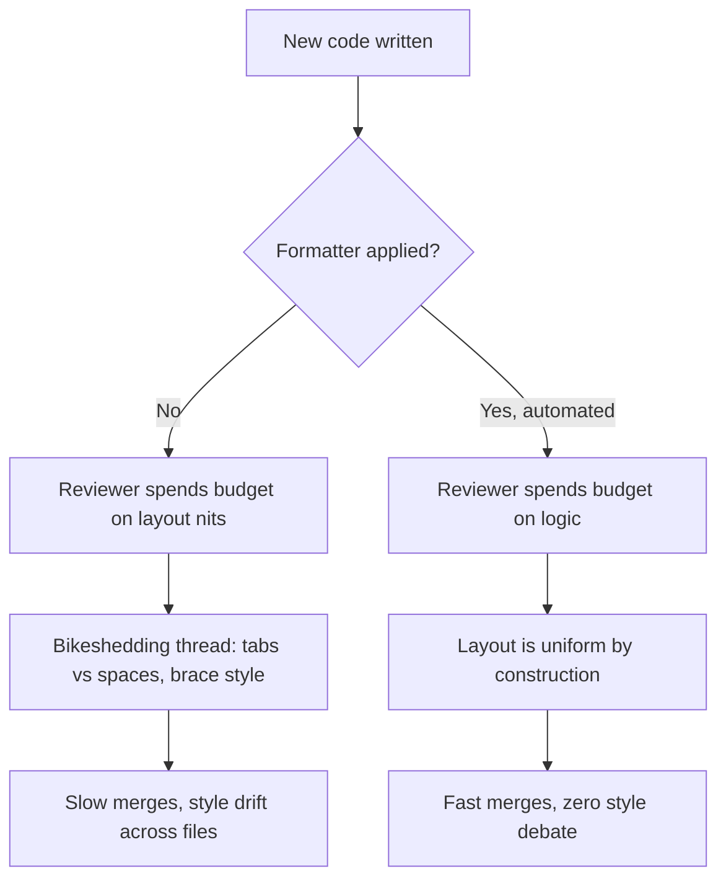
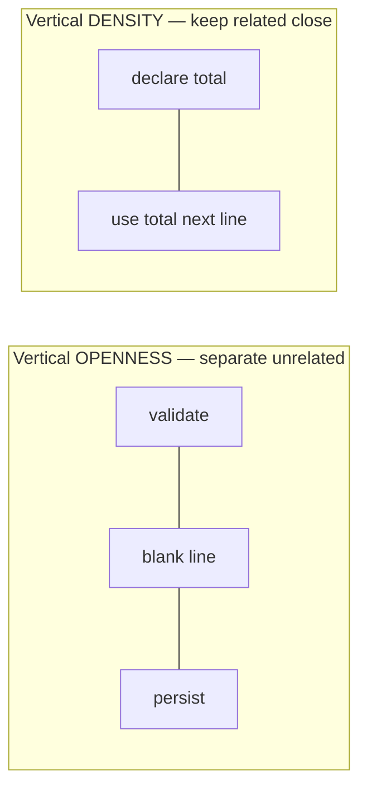
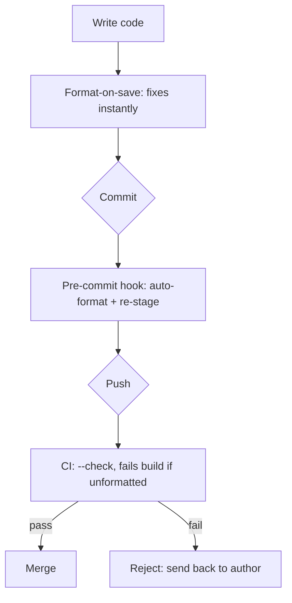

# Formatting — Middle Level

> Focus: "Why?" and "When does it bend?" — the trade-offs behind formatting rules, why consistency beats any single style, and where auto-format ends and human judgment begins.

---

## Table of Contents

1. [Why a team formatter exists (it isn't about the style)](#why-a-team-formatter-exists-it-isnt-about-the-style)
2. [When line-length limits hurt](#when-line-length-limits-hurt)
3. [Vertical distance vs. file organization](#vertical-distance-vs-file-organization)
4. [Formatting for diff-friendliness](#formatting-for-diff-friendliness)
5. [Format-on-save, pre-commit, and CI: where to enforce](#format-on-save-pre-commit-and-ci-where-to-enforce)
6. [Why "format the whole file" commits stay separate from logic](#why-format-the-whole-file-commits-stay-separate-from-logic)
7. [The limits of auto-format](#the-limits-of-auto-format)
8. [Language philosophies: gofmt vs. Java vs. Black](#language-philosophies-gofmt-vs-java-vs-black)
9. [Common Mistakes](#common-mistakes)
10. [Test Yourself](#test-yourself)
11. [Cheat Sheet](#cheat-sheet)
12. [Summary](#summary)
13. [Further Reading](#further-reading)
14. [Related Topics](#related-topics)

---

## Why a team formatter exists (it isn't about the style)

A junior reads "use 4 spaces, brace on the same line, 100-char limit" and thinks the *rules* are the point. They aren't. The point is that **every file looks like every other file**, so a reader's pattern-matching never stalls on layout and can spend its whole budget on logic.

The economically interesting property of a formatter is this: **the specific style barely matters; the agreement matters enormously.** Two teams — one on tabs, one on spaces — both reading clean, uniform code, are equally productive. A third team that argues about it in every code review is slower than both, regardless of which side "wins."

This is why mature teams reach for an *opinionated, automated* formatter and stop discussing it:

- **Bikeshedding has a real cost.** Brace placement is cheap to have an opinion about and impossible to be wrong about, so everyone weighs in. A formatter removes the topic from human discourse entirely. The reviewer who would have written "nit: move this brace" now writes nothing, and the PR merges an hour sooner.
- **The diff stops carrying noise.** When formatting is mechanical, a diff contains only meaning. A reviewer trusts that every changed line is a *decision*, not a stray reflow.
- **Onboarding is instant.** A new hire doesn't learn "how we like our code to look." They run the formatter; the code looks correct by construction.



> **The real value:** a formatter converts an *unbounded human argument* (style) into a *solved mechanical problem* (run the tool). You are not buying "the best style." You are buying the end of the argument.

The corollary: **do not let people opt out per-file or per-preference.** A formatter with exceptions is half a formatter — you still get drift, you still get the argument ("but my file is special"). The discipline is worth more than any one engineer's aesthetic preference.

---

## When line-length limits hurt

A line-length cap (80, 100, 120 — pick one, enforce it) is the most useful single formatting rule: it keeps code readable in side-by-side diffs, on laptops, and in terminal panes. But it is the rule most likely to produce *worse* code when applied dogmatically. Know where it bends.

**1. Long URLs and literal strings.** A 140-character URL in a comment or a test fixture cannot be split without becoming wrong or unreadable. Wrapping it across lines with `+` concatenation makes it un-greppable and easy to corrupt.

```python
# Hard wrap destroys the ability to grep for the URL or click it
DOCS = ("https://example.com/very/long/path/"
        "to/a/specific/anchor#section-4-2")  # now two grep hits, neither matches the full URL
```

Most formatters explicitly **exempt long string literals and comments** from wrapping for this reason. Black, for example, will not break a string literal. The right move is a per-line suppression (`# noqa: E501`) or simply leaving it long.

**2. Table-like data.** Aligned rows of data read as a table; a formatter that reflows them destroys the structure.

```go
var statusNames = map[int]string{
    200: "OK",
    404: "Not Found",
    500: "Internal Server Error",
}
```

If a column pushes one row past the limit, you don't reflow the table — you accept the long line or restructure the data, not the layout.

**3. Deeply generic or nested types.** In Java, C#, TypeScript, and Rust, a single type can be long before any logic appears:

```java
Map<String, List<CompletableFuture<OrderProcessingResult>>> pending = new HashMap<>();
```

Mechanically wrapping generics produces a smear of angle brackets. The better fix is a **type alias** or a domain type (`type PendingOrders = ...`) — which is a *design* improvement, not a formatting one. The line-length limit here is doing its job: it's a smell detector pointing at an unnamed concept.

> **The pattern:** when a line-length limit fights you, ask *why* the line is long. If it's incidental (a URL, a fixture), suppress the rule locally. If it's a long type or a long expression, the limit has found a missing abstraction — fix the design, not the wrap.

---

## Vertical distance vs. file organization

Newspaper metaphor: the most important things at the top, detail below; a reader stops when they have enough. Two principles follow, and they pull in different directions — knowing *when* each wins is the middle-level skill.

**Vertical openness separates concepts.** Blank lines between methods, between a variable's declaration and an unrelated block, between import groups — each blank line says "new thought." Removing them all (the "save vertical space" instinct) makes a wall of text where nothing is grouped.

**Vertical density connects them.** Conversely, things that belong together must *stay* together. A variable should be declared as close as possible to its first use; a helper called by one function should sit just below it (so the reader scrolls down to find detail, never up). Inserting blank lines or unrelated code *between* tightly-coupled lines is as harmful as removing the separating ones.



Here is the tension a formatter *cannot* resolve: it will normalize the *number* of blank lines (one between methods, two at module level — whatever the config says), but it has **no idea which functions are conceptually related**, so it cannot order them. A formatter will happily leave a 1000-line file with functions in random order, each perfectly spaced. The spacing is correct; the *organization* is garbage.

That distinction is the whole point of this section:
- **Spacing** (how many blank lines) → automatable, let the formatter own it.
- **Ordering** (which thing comes before which) → human judgment, the formatter is blind to it.
- **File size** (1000-line file) → human judgment; no formatter will tell you to split a module.

A file with perfect spacing and terrible ordering is *worse* than one with sloppy spacing and a clear top-down flow, because the sloppy-but-organized one can be auto-fixed in one command.

---

## Formatting for diff-friendliness

A surprising amount of "formatting" is really about keeping **version-control diffs clean**. The reader you're optimizing for here isn't just the person reading the file — it's the reviewer reading the *diff*, and the future engineer running `git blame`.

**Trailing commas.** In multi-line lists, arrays, and argument sets, end every line — *including the last* — with a comma:

```python
PERMISSIONS = [
    "read",
    "write",
    "delete",   # <- trailing comma
]
```

Why: adding a fourth permission touches **one line** (the new one). Without the trailing comma, adding an item also edits the previous last line (to append its comma), so the diff shows two changed lines for one logical change, and `git blame` on `"delete"` wrongly points at the commit that added `"audit"`. Go's `gofmt` *enforces* trailing commas in multi-line composite literals for exactly this reason; Black, Prettier, and rustfmt add them automatically.

**One import per line.** Group and sort imports, one per line, never `import a, b, c`:

```go
import (
    "context"
    "fmt"

    "github.com/org/project/internal/order"
)
```

Adding or removing a dependency is then a one-line diff, conflicts are trivial to resolve, and `git blame` attributes each import correctly. Combined imports turn every dependency change into a multi-symbol line edit and a merge-conflict magnet.

**One statement / one declaration per line.** `x := 1; y := 2` on one line means a change to `y` shows up as a change to `x` in blame. Split them.

**Stable ordering.** Sorted imports, sorted enum cases, sorted map keys where order is irrelevant — any *deterministic* order means two engineers adding entries independently produce mergeable diffs instead of conflicts.

> **The mental model:** every formatting choice that makes "add one thing" touch exactly one line is a diff-friendliness win. It compounds: cleaner diffs → faster reviews → more accurate blame → easier debugging six months later.

---

## Format-on-save, pre-commit, and CI: where to enforce

Formatting can be enforced at three layers. They are not alternatives — a healthy team uses all three, defense in depth, because each catches what the previous missed.

| Layer | Mechanism | Catches | Fails when |
|---|---|---|---|
| **Editor** | Format-on-save (IDE / LSP config) | Almost everything, instantly | Engineer's editor isn't configured; CLI commits |
| **Pre-commit** | Git hook (e.g. `pre-commit`, Husky, lefthook) | Anything that slipped past the editor | Hook not installed locally; `--no-verify` used |
| **CI** | Pipeline check (`gofmt -l`, `black --check`, `prettier --check`) | Everything; cannot be bypassed | — (it's the backstop) |

**Format-on-save** is where you *want* the work to happen — it's free, invisible, and the engineer never sees a violation because it never exists. The downside: it depends on each person configuring their tools, so it can't be the only line.

**Pre-commit hooks** are the local safety net. Crucial nuance: a hook that *fails* the commit and makes the human re-run the formatter is annoying; a hook that *auto-formats and re-stages* is delightful. Prefer the latter. But pre-commit hooks are bypassable (`git commit --no-verify`) and only run on machines where they're installed, so they aren't authoritative either.

**CI is the only authoritative layer.** It runs on every push, can't be skipped, and is the same for everyone. The CI check should be the **non-mutating** form (`--check` / `-l`) that *fails the build* if anything is unformatted — it never edits code, it only asserts. This is the source of truth; the other two layers exist to make sure CI is almost never the thing that catches you.



---

## Why "format the whole file" commits stay separate from logic

The first time you adopt a formatter on an old codebase, running it touches thousands of lines across hundreds of files. This *must* be its own commit (or PR), and it must contain **nothing else**.

The reason is reviewability and `git blame` integrity:

- **A mixed commit is unreviewable.** If a PR reformats 400 lines *and* changes 3 lines of logic, the reviewer must hunt for the 3 real changes in a sea of whitespace reflow. They won't. They'll approve it without really reviewing it — which is how bugs ship inside reformat noise.
- **`git blame` gets poisoned.** A pure-reformat commit can be added to `.git-blame-ignore-revs`, so `git blame` skips it and still shows who *actually* wrote each line. A mixed commit can't be ignored without also losing the blame for the real change.
- **Reverting becomes safe.** A pure-format commit can be reverted with zero behavioral risk. A mixed one can't.

The discipline, stated as a rule: **a commit either changes formatting or changes behavior — never both.** When you touch a legacy file for a one-line fix, resist the urge to "tidy up while I'm here." Make the fix; if the file needs reformatting, do it in a separate commit so the fix stays a one-line diff.

```bash
# After the big reformat lands, record it so blame skips it:
git rev-parse HEAD >> .git-blame-ignore-revs
git config blame.ignoreRevsFile .git-blame-ignore-revs
```

> **Why juniors get this wrong:** they see "leave it cleaner than you found it" (Boy Scout Rule) and reformat the whole file inside their bugfix. The Boy Scout Rule is right — but cleanup goes in its *own* commit. The two principles don't conflict once you separate the commits.

---

## The limits of auto-format

A formatter is a layout engine, not a design tool. It is excellent at the mechanical and totally blind to the structural. Knowing the boundary stops you from believing "it passes the formatter" means "it's well-formatted."

**What a formatter owns (let it):**
- Indentation, brace placement, spacing around operators
- Number of blank lines between members
- Line wrapping for over-long lines (mechanically)
- Trailing commas, quote style, import sorting

**What a formatter cannot do (you own):**
- **Vertical ordering.** It will not move a helper to sit below its caller, nor order functions top-down. A file can be perfectly spaced and still read like shuffled cards.
- **Splitting a 1000-line file.** No formatter says "this module does too much." Module decomposition is a design decision.
- **Naming.** Layout doesn't fix `int x` or `doStuff()`.
- **Deciding what's *related*.** It normalizes the *count* of blank lines; it cannot know which two functions belong in the same group.
- **Choosing the right abstraction** when a line is long because of a deeply nested generic — it wraps the symptom; you name the concept.

The trap is **false confidence**: "the formatter passed, so formatting is done." Formatting in the Clean Code sense is *organization* — top-down flow, related things close, unrelated things separated, files that aren't too big. The tool covers the easy 70%. The 30% it can't touch is exactly the part that requires a human, and it's the part that actually determines whether a file is pleasant to read.

> **The honest summary:** run the formatter so you never spend a human thought on spacing — then spend the thoughts you saved on the things it can't do: ordering, grouping, and file size.

---

## Language philosophies: gofmt vs. Java vs. Black

The same goal — uniform code without argument — has produced three distinct philosophies. Understanding them tells you how much agency a team has, and how much it should *want*.

### Go — `gofmt` is non-negotiable

`gofmt` ships with the toolchain, has **zero configuration**, and is culturally mandatory: unformatted Go code is simply not idiomatic, and `go fmt` is run reflexively. Rob Pike's line — *"gofmt's style is no one's favorite, yet gofmt is everyone's favorite"* — is the entire thesis of this chapter in one sentence. There is nothing to argue about because there is no knob to argue over. New Go programmers spend exactly zero minutes on style discussions. This is the strongest possible version of "consistency beats preference."

### Python — Black's "no config" philosophy

Black is the deliberate import of the gofmt idea into a language that historically argued endlessly about layout (PEP 8 is a *guide*, not a tool). Black calls itself "the uncompromising code formatter" and exposes almost no options — famously only line length is configurable, and even that grudgingly. The philosophy is explicit: **removing the choice is the feature.** A team that adopts Black stops having style PRs the same week. (Contrast with Python's older world of `autopep8` + `yapf` + per-project `.flake8` configs, where every repo formatted differently and the argument never ended.)

### Java — configurable, and that's the catch

Java has no single blessed formatter. Google Java Format, Spotless, the Eclipse formatter, IntelliJ's built-in — each is *configurable*, often heavily. Configurability sounds like freedom; in practice it reintroduces the argument at the *config* level ("should the import order be this or that?"). The mature move for a Java team is to deliberately **act like Go**: pick one formatter, adopt a strict shared config (Google's style is a common choice precisely because it's externally defined), commit it to the repo, enforce it in CI — and then *stop touching the config*. The lesson is that Java teams must manufacture the discipline that Go gets for free.

| | Go (`gofmt`) | Python (Black) | Java (Spotless/GJF) |
|---|---|---|---|
| Config knobs | None | ~1 (line length) | Many |
| Ships with toolchain | Yes | No (add dep) | No (add dep) |
| Cultural default | Mandatory | Increasingly default | Team-by-team |
| Risk | None | None | Config bikeshedding |

> **The takeaway across all three:** the *less* a formatter lets you configure, the *less* your team argues. Where the language gives you that for free (Go), take it. Where it doesn't (Java), impose it on yourselves — pick a config once and treat it as immutable.

---

## Common Mistakes

1. **Treating the style choice as the goal.** Debating tabs vs. spaces for an hour. The choice is worthless; the *agreement enforced by a tool* is everything. Flip a coin, configure the tool, move on.

2. **Leaving the tabs/spaces war "for later."** An unresolved formatting question doesn't stay neutral — it produces mixed files where every diff is noise. Resolve it with tooling *immediately*, even arbitrarily.

3. **Mixing reformat and logic in one commit.** The reviewer can't find the real change; `git blame` is poisoned; reverting is unsafe. Always split.

4. **Believing "the formatter passed" means "formatting is done."** The formatter can't order functions, split a 1000-line file, or fix naming. Those are the parts that actually matter for readability.

5. **Applying the line-length limit dogmatically.** Hard-wrapping a URL or a data table makes code worse and un-greppable. Suppress the rule locally for incidental long lines; for long *types*, fix the design instead.

6. **Magic vertical whitespace.** Spacing out every single line "for breathing room" destroys grouping — if everything is separated, nothing is grouped. Blank lines must *mean* "new concept," not be sprinkled uniformly.

7. **Pre-commit hook that only fails (doesn't fix).** Forcing the human to re-run the formatter manually is friction that gets bypassed with `--no-verify`. Make the hook auto-format and re-stage.

8. **CI that auto-commits formatting fixes.** CI should run `--check` and *fail*, not mutate the branch. Mutating CI hides the problem and creates surprise commits the author didn't write.

9. **Commented-out code left as "visual emphasis" or "in case we need it."** Version control already remembers it. Dead commented blocks rot, mislead, and survive search; delete them.

---

## Test Yourself

1. **Your team has spent three standup mentions arguing about 2-space vs. 4-space indentation. What's the senior move?**

<details><summary>Answer</summary>

Stop the argument by removing the decision from humans. Pick *either one arbitrarily* (or adopt whatever the language's default formatter uses), configure an automated formatter with that setting, wire it into CI, and never discuss it again. The specific number is irrelevant; the consistency-by-tool is the entire value. Continuing to debate is pure bikeshedding — the cost of the argument already exceeds any benefit of "winning."
</details>

2. **A line is 130 characters because it's `Map<String, List<Future<Result>>> x = ...`. Your limit is 120. Mechanically wrap it, or something else?**

<details><summary>Answer</summary>

Don't mechanically wrap — the angle-bracket smear that produces is unreadable. The long line is a *smell pointing at a missing abstraction*. Introduce a type alias or domain type (e.g. `type PendingResults = Map<String, List<Future<Result>>>`). The line-length limit did its job: it found an unnamed concept. Fix the design, not the wrap. (Contrast: if the long line were an incidental URL in a comment, you'd suppress the limit locally instead.)
</details>

3. **Why does `gofmt` having zero configuration options make Go teams faster than Java teams on formatting?**

<details><summary>Answer</summary>

Configurability reintroduces the bikeshedding argument at the *config* level. With `gofmt` there is literally no knob to argue over, so Go teams spend zero time on style — it's solved at the language level. Java's formatters are configurable, so teams argue about the config instead of the code. Java teams have to *manufacture* the discipline Go gets for free: pick one config, commit it, and treat it as immutable.
</details>

4. **Why insist on a trailing comma after the last element of a multi-line list?**

<details><summary>Answer</summary>

So that adding a new element touches exactly one line (the new one). Without it, adding an element also edits the previous last line to append its comma — a two-line diff for a one-line change, plus `git blame` wrongly attributing the old last element to the commit that added the new one. Cleaner diffs, accurate blame, fewer merge conflicts. This is why `gofmt` enforces it and Black/Prettier/rustfmt add it automatically.
</details>

5. **You're fixing a one-line bug in a 600-line file that was never run through the formatter. Should you reformat it while you're there?**

<details><summary>Answer</summary>

Yes, reformat it — but in a *separate commit* from the bugfix. The Boy Scout Rule (leave it cleaner) is right; mixing formatting with logic in one commit is wrong. Keep the bugfix as a one-line diff so the reviewer can actually review it, then do the reformat in its own commit and add that commit's hash to `.git-blame-ignore-revs` so blame stays meaningful.
</details>

6. **Your CI formatter check is green on a 1000-line file. Is the file well-formatted in the Clean Code sense?**

<details><summary>Answer</summary>

Not necessarily. The formatter only verifies the mechanical layer — indentation, spacing, wrapping. It cannot detect that the file is too big, that functions are in random order rather than top-down, or that related helpers are scattered. "Formatting passed" is false confidence: the 30% the tool can't touch (ordering, grouping, file size) is exactly the part that determines readability, and it needs a human.
</details>

7. **Should you enforce formatting in the editor, in a pre-commit hook, or in CI?**

<details><summary>Answer</summary>

All three — defense in depth. Format-on-save makes violations never exist (free, instant, but depends on each engineer's config). A pre-commit hook that auto-formats and re-stages is the local net (but is bypassable with `--no-verify`). CI running `--check` is the *only authoritative* layer — non-mutating, unskippable, identical for everyone. The first two exist so CI almost never has to catch you; CI exists so nothing slips through.
</details>

---

## Cheat Sheet

| Situation | Do | Don't |
|---|---|---|
| Team debating style | Configure a formatter, pick any setting, move on | Argue — it's bikeshedding |
| Long URL / data table line | Suppress the line-length rule locally | Hard-wrap it into unreadable / un-greppable pieces |
| Long deeply-generic type | Introduce a type alias / domain type | Mechanically wrap the generics |
| Multi-line list / args | Trailing comma on the last element | Comma only between elements |
| Imports | One per line, sorted, grouped | `import a, b, c` on one line |
| Adopting a formatter on legacy | One pure-reformat commit, add to blame-ignore | Mix reformat into a logic commit |
| Bugfix in unformatted file | Fix in one commit, reformat in a separate one | "Tidy up while I'm here" in the same diff |
| Pre-commit hook | Auto-format and re-stage | Only fail and make the human re-run |
| CI check | `--check` / `-l` that fails the build | Auto-commit formatting fixes from CI |
| Blank lines | One per *concept boundary* | Uniform "breathing room" on every line |
| 1000-line file | Split it (human decision) | Assume the green formatter means it's fine |
| Go | `gofmt`, no config, run reflexively | Configure or skip it |
| Java | Pick one formatter + strict config, freeze it | Keep tweaking the config |
| Python | Black, accept its choices | Maintain per-repo `yapf`/`autopep8` configs |

---

## Summary

- A team formatter's value is **the end of the argument**, not any specific style. Consistency-by-tool > anyone's aesthetic preference.
- The **line-length limit** is the most useful rule and the most often misapplied. It bends for URLs, table-like data, and incidental literals (suppress locally). For long *types*, it's a smell — fix the design.
- Distinguish **spacing** (count of blank lines — automatable) from **ordering** and **file size** (human judgment — the formatter is blind to them).
- Many formatting rules are really **diff-friendliness** rules: trailing commas, one import per line, stable ordering — each makes "add one thing" a one-line diff and keeps `git blame` honest.
- Enforce at three layers: **format-on-save** (free), **pre-commit** (local net, auto-fix + re-stage), **CI `--check`** (authoritative, non-mutating).
- A **reformat commit is always separate from a logic commit** — for reviewability, blame integrity, and safe reverts.
- Auto-format covers the mechanical 70%. It **cannot** order functions, split big files, fix names, or know what's related. That 30% is the part that decides readability.
- Across languages: the **less configurable** the formatter, the less the team argues. Go gets this for free (`gofmt`); Python imported it (Black); Java teams must impose it on themselves.

---

## Further Reading

- *Clean Code* (Robert C. Martin), Chapter 5 — "Formatting": vertical openness, density, distance, and the newspaper metaphor.
- *A Philosophy of Software Design* (John Ousterhout) — on why a green formatter doesn't mean a well-organized module.
- The Go Blog, *"go fmt your code"* — the zero-config philosophy stated by its authors.
- Black documentation — *"The uncompromising code formatter"* and its rationale for minimal configuration.
- `git` documentation — `blame.ignoreRevsFile` and `.git-blame-ignore-revs`.

---

## Related Topics

- [`junior.md`](junior.md) — the baseline formatting rules: indentation, blank lines, line length, the newspaper metaphor.
- [`senior.md`](senior.md) — rolling out a formatter across a large org, monorepo enforcement, and formatting as architectural signal.
- [Chapter README](../README.md) — the positive formatting rules and the anti-patterns this chapter targets.
- [Functions](../02-functions/README.md) — vertical ordering and size interact directly with function decomposition.
- [Comments](../03-comments/README.md) — commented-out code as a formatting anti-pattern, and why version control replaces it.
- [Clean commits and version control](../25-clean-commits-and-version-control/README.md) — keeping reformat and logic commits separate, and diff hygiene.
- [Refactoring](../../refactoring/README.md) — how reformatting fits (and doesn't) into behavior-preserving change.
- Code smells: Bloaters — the 1000-line file and long lines as smells, not just formatting issues.
