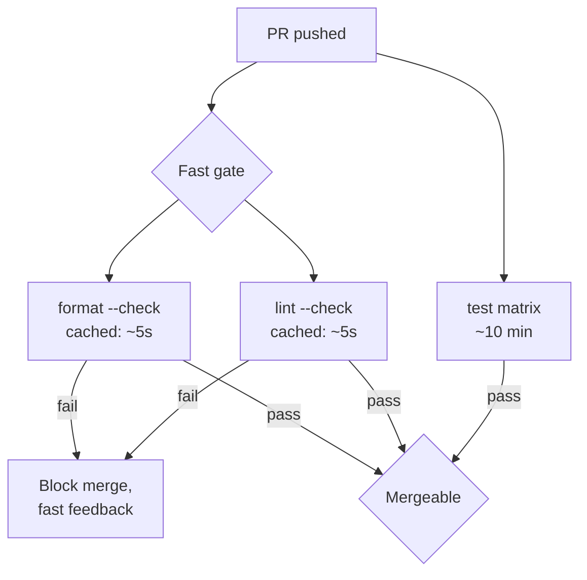
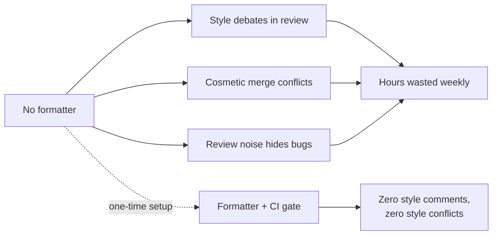

# Formatting — Optimize & Reconcile

> Formatting has near-zero runtime cost — your binary runs identically whether you indent with two spaces or four. The cost lives somewhere else: in human time, in review throughput, in CI minutes, and in editor latency. So "optimize" here means optimizing the team's *time* and the *diff/review process*, with the rare build/tooling angle thrown in. Each scenario below pairs a concrete situation with a cost analysis (real numbers where they exist) and a principled resolution.

---

## Table of Contents

1. [Formatter run time on a huge monorepo](#scenario-1--formatter-run-time-on-a-huge-monorepo)
2. [ruff vs Black — the order-of-magnitude gap](#scenario-2--ruff-vs-black--the-order-of-magnitude-gap)
3. [Prettier caching to skip unchanged files](#scenario-3--prettier-caching-to-skip-unchanged-files)
4. [CI format-check cost and how to cache it](#scenario-4--ci-format-check-cost-and-how-to-cache-it)
5. [The mass-reformat commit that poisons git blame](#scenario-5--the-mass-reformat-commit-that-poisons-git-blame)
6. [Separating format-only commits from logic changes](#scenario-6--separating-format-only-commits-from-logic-changes)
7. [Diff-friendly formatting choices (trailing commas, one-per-line)](#scenario-7--diff-friendly-formatting-choices)
8. [gofmt vs gofumpt — speed and standardization](#scenario-8--gofmt-vs-gofumpt--speed-and-standardization)
9. [Editor format-on-save latency on large files](#scenario-9--editor-format-on-save-latency-on-large-files)
10. [The cost of NOT formatting — bikeshedding and merge conflicts](#scenario-10--the-cost-of-not-formatting)
11. [Incremental formatting in a legacy repo](#scenario-11--incremental-formatting-in-a-legacy-repo)
12. [Pre-commit hook latency vs CI-only enforcement](#scenario-12--pre-commit-hook-latency-vs-ci-only-enforcement)
13. [Line-length wars and review-comment volume](#scenario-13--line-length-wars-and-review-comment-volume)
14. [Formatter version drift across the team](#scenario-14--formatter-version-drift-across-the-team)

---

### Scenario 1 — Formatter run time on a huge monorepo

A 4M-line monorepo runs `prettier --write .` and `black .` over the entire tree on every developer's machine and in a pre-push hook. A full Prettier pass on the JS/TS portion takes ~90s; Black over the Python portion takes ~40s. Developers wait over two minutes for a one-line change, so they start skipping the hook with `--no-verify`.

<details><summary>Resolution</summary>

**Cost analysis.** Formatting is *embarrassingly local*: a file's formatted output depends only on that file (and its config). Re-formatting 200,000 files to change one is pure waste. With ~50 commits/day/developer and ~30 developers, a 2-minute full-tree format costs `50 × 30 × 2 = 3000` developer-minutes/day = ~6 person-days burned daily on formatting files nobody touched. That is the real bill, and it's why people bypass the hook.

**Principled resolution — scope to changed files only.** Feed the formatter the set of files that actually changed:

```bash
# Pre-commit: only staged files, by extension
git diff --cached --name-only --diff-filter=ACM \
  | grep -E '\.(ts|tsx|js|jsx)$' \
  | xargs --no-run-if-empty npx prettier --write

git diff --cached --name-only --diff-filter=ACM \
  | grep -E '\.py$' \
  | xargs --no-run-if-empty black
```

A typical commit touches 3–10 files. Formatting 10 files instead of 200,000 drops the hook from 130s to well under 1s. The full-tree pass still belongs in CI as a safety net (Scenario 4), but it must never sit on the interactive path.

Use a managed runner like `pre-commit` (the framework) or `lint-staged`, which do changed-file scoping for you and pass only the relevant paths:

```jsonc
// package.json
"lint-staged": {
  "*.{ts,tsx,js,jsx}": "prettier --write",
  "*.py": "black"
}
```

**Rule:** the interactive path formats *changes*; CI formats *the world*. Never put a full-tree format on a developer's keystroke-to-commit loop.

</details>

---

### Scenario 2 — ruff vs Black — the order-of-magnitude gap

A Python team's CI lint+format stage takes 3–5 minutes on a large codebase: `black --check`, `isort --check`, and `flake8`. The stage is on the critical path of every PR; with 80 PRs/day and frequent re-runs, the format/lint gate alone is the slowest part of CI feedback.

<details><summary>Resolution</summary>

**Cost analysis.** Black is written in Python and is single-process by default (it parallelizes across files but each file is parsed by a Python tokenizer). On a large repo Black checks at roughly the low-thousands-of-files-per-minute range; layering `isort` and `flake8` on top means three separate full-tree walks, three process startups, three AST builds.

**Resolution — collapse the toolchain onto ruff.** `ruff` (and `ruff format`) is written in Rust and is routinely benchmarked at **10–100× faster than Black/flake8/isort** on equivalent work — formatting and linting tens of thousands of files in well under a second on a warm cache. It replaces Black (format), isort (import sorting), and most of flake8/pyflakes/pycodestyle (lint) in a single tool with one config and one process startup.

```toml
# pyproject.toml
[tool.ruff]
line-length = 88

[tool.ruff.format]
quote-style = "double"   # matches Black's default
```

```bash
ruff format --check .   # was: black --check . + isort --check .
ruff check .            # was: flake8 .
```

`ruff format` is intentionally **Black-compatible** (>99.9% identical output), so the migration is near-zero-churn: run `ruff format` once, commit the (tiny) diff, done. A 3–5 minute stage typically collapses to a few seconds, which removes the format gate from the critical path entirely.

**Caveat / when not to.** If your team depends on flake8 plugins ruff hasn't yet ported, keep flake8 for those specific rules but still move *formatting* and *import sorting* to ruff — that alone removes two full-tree passes. Pin the ruff version (Scenario 14) so its formatting output is stable across the team.

</details>

---

### Scenario 3 — Prettier caching to skip unchanged files

A frontend team scopes Prettier to changed files in the hook (Scenario 1) but still runs `prettier --check .` over the full tree in CI for safety. That full check is 70–90s and runs on every push, even when the push only touched a markdown file.

<details><summary>Resolution</summary>

**Cost analysis.** The full check re-parses every file every run. But Prettier's output for a file is a pure function of `(file contents, prettier version, resolved config)`. If none of those changed since the last successful check, the result is guaranteed identical — re-checking is wasted work.

**Resolution — enable Prettier's built-in cache.** Since Prettier 2.7, `--cache` stores per-file metadata (content hash + version + options) and skips files whose inputs are unchanged:

```bash
prettier --check --cache --cache-location=.prettiercache .
```

On a warm cache where one file changed, the second run drops from ~80s to a few seconds — Prettier only re-formats the single dirty file and short-circuits the rest. The trick is **persisting `.prettiercache` across CI runs** via the CI cache keyed on the lockfile and prettier config:

```yaml
# GitHub Actions
- uses: actions/cache@v4
  with:
    path: .prettiercache
    key: prettier-${{ hashFiles('package-lock.json', '.prettierrc*') }}
```

**Cache-invalidation discipline.** Bump the cache key when the Prettier version or config changes (the `hashFiles` glob above does this automatically). Use `--cache-strategy content` (hash-based) rather than `metadata` (mtime-based) in CI, because fresh checkouts reset mtimes and would invalidate a metadata cache every time. The same pattern applies to ESLint (`--cache`) and ruff (it caches automatically under `.ruff_cache/`).

</details>

---

### Scenario 4 — CI format-check cost and how to cache it

CI runs format checks as a blocking gate. Each PR re-runs the full format/lint suite from a cold environment: install toolchain (npm/pip), then check. Cold installs dominate — the actual checking is fast but the setup is 60–120s every time.

<details><summary>Resolution</summary>

**Cost analysis.** The check itself is cheap (especially with ruff/cached Prettier); the *environment* is expensive. With 80 PRs/day × ~3 runs each × 90s of cold setup ≈ 6 CI-hours/day spent installing toolchains just to run a formatter.

**Resolution — three layers, cheapest first.**

1. **Cache the toolchain install.** Key the dependency cache on the lockfile so re-runs reuse `node_modules` / the pip wheel cache.
2. **Cache the formatter's own work** (`.prettiercache`, `.ruff_cache`) as in Scenario 3.
3. **Run format checks in their own fast job, in parallel with tests** — a format failure should surface in seconds, not block behind a 10-minute test matrix.



**The key insight:** format checks are *fast feedback* and should fail *fast and cheap*. Splitting them into a dedicated parallel job means a developer who forgot to format learns in ~10s, not after a 10-minute test run completes. Use `--check` (report-only, non-zero exit on diff) in CI, never `--write` — CI should *verify*, not silently mutate the tree.

</details>

---

### Scenario 5 — The mass-reformat commit that poisons git blame

A team finally adopts a formatter and lands one giant commit reformatting all 4,000 files. The build is green and the code is now consistent — but `git blame` on every line now points to "Apply formatter (#1234)" instead of the commit that actually wrote the logic. Tracing *why* a line exists now requires manual archaeology.

<details><summary>Resolution</summary>

**Cost analysis.** `git blame` is one of the highest-leverage debugging tools — it answers "what change introduced this line, and what was the reasoning?" A whitespace-only reformat rewrites the blame attribution for *every line in the repo* to a commit that contains zero semantic intent. The cost is paid forever, every time anyone blames a line, often during an incident when time is most expensive.

**Resolution — `.git-blame-ignore-revs`.** Git (2.23+) lets you list "uninteresting" commits that `blame` should skip, attributing the line to the commit *before* the reformat instead.

```bash
# Make the mass reformat in one isolated commit, capture its SHA
git commit -am "style: apply ruff format across repo"
git rev-parse HEAD   # e.g. a1b2c3d...

# Record it
echo "a1b2c3d4e5f6..." >> .git-blame-ignore-revs
git config blame.ignoreRevsFile .git-blame-ignore-revs   # local
```

Add the file to the repo and document the config so every clone benefits; GitHub and GitLab both honor `.git-blame-ignore-revs` automatically in their blame UI. Each entry should be a comment-annotated, **pure-formatting** commit:

```
# .git-blame-ignore-revs
# Migrate to ruff format (2026-06-01)
a1b2c3d4e5f6a7b8c9d0e1f2a3b4c5d6e7f8a9b0
# isort -> ruff import ordering (2026-06-03)
b2c3d4e5...
```

**The non-negotiable precondition:** the ignored commit must be *formatting-only*. If you mix logic into it, you can't ignore it (you'd hide real authorship), which is exactly why Scenario 6 matters.

</details>

---

### Scenario 6 — Separating format-only commits from logic changes

A developer changes one function and, because format-on-save reformatted the whole file, the PR diff shows 180 changed lines — 6 of logic, 174 of reformatting. The reviewer cannot see the actual change, review takes 4× longer, and the commit can't be added to `.git-blame-ignore-revs` because it isn't pure formatting.

<details><summary>Resolution</summary>

**Cost analysis.** Review time scales with *apparent* diff size, not logical diff size. A 6-line change buried in 180 lines forces the reviewer to diff-the-diff in their head. Worse, the formatting noise hides real bugs in the 6 lines. And it pollutes blame (Scenario 5). The root cause is a *file that wasn't already formatted* meeting *format-on-save*.

**Resolution — never let formatting and logic ride in the same commit.**

1. **Prevent the situation:** once a repo is fully formatted (and CI enforces it), format-on-save produces *zero* incidental changes — there's nothing to reformat. This is the strongest reason to do the one-time mass reformat: it makes every subsequent diff pure-logic.
2. **When migrating a not-yet-formatted file,** split into two commits in the same PR:
   ```bash
   git add -p          # stage ONLY the logic lines
   git commit -m "fix: correct rounding in tax calc"
   git add -u          # stage the remaining format-only lines
   git commit -m "style: reformat tax.py"   # blame-ignorable
   ```
3. **Reviewer tooling:** reviewers can hide whitespace with `git diff -w` / GitHub's `?w=1` query param, but that's a band-aid — it doesn't fix blame, and `-w` hides *real* whitespace-significant changes too.

**Principle:** one commit = one kind of change. A reviewer should be able to read a diff and know "this is logic" or "this is mechanical." Mixing the two taxes every reviewer for the life of the line.

</details>

---

### Scenario 7 — Diff-friendly formatting choices

Two formatting styles are functionally identical but produce wildly different diffs when a list grows. A team using no trailing comma and packing arguments onto shared lines sees adding one enum value light up 3 lines in the diff; the team next door sees exactly 1 added line.

<details><summary>Resolution</summary>

**Cost analysis.** Consider adding `PENDING` to an enum.

```python
# Packed, no trailing comma — adding PENDING touches 2 lines
States = (ACTIVE, CLOSED)
States = (ACTIVE, CLOSED, PENDING)
#                ^^^^^^^^ line modified  ^^^^^^^ + content

# One-per-line WITH trailing comma — adding PENDING touches exactly 1 line
States = (
    ACTIVE,
    CLOSED,
+   PENDING,
)
```

The packed version modifies the `CLOSED` line (to append `, PENDING`), creating a spurious "changed" line that pollutes blame on `CLOSED` and increases merge-conflict surface. The one-per-line-with-trailing-comma version adds exactly one line and never touches existing lines.

**Resolution — choose the diff-minimizing convention and let the formatter enforce it.**

- **Trailing commas** ("magic trailing comma" in Black/ruff/Prettier): when present, the formatter keeps the collection exploded one-per-line. This makes every element add/remove a single-line diff and removes the "did the last line get a comma?" merge conflict entirely. Go's `gofmt` and Rust's `rustfmt` enforce trailing commas in multiline literals by default for this exact reason.
- **One import per line** rather than `import {a, b, c}` — adding `d` is a one-line add, not a modify.

```jsonc
// .prettierrc
{ "trailingComma": "all" }
```

These are not aesthetic preferences; they are *measurable* reductions in diff size, blame churn, and merge-conflict frequency. Pick them once, encode them in config, stop debating.

</details>

---

### Scenario 8 — gofmt vs gofumpt — speed and standardization

A Go team argues about whether to use plain `gofmt` (ships with the toolchain) or `gofumpt` (a stricter superset). Some worry the stricter tool is slower or will create a noisy migration diff.

<details><summary>Resolution</summary>

**Cost analysis.** This is mostly a *non-debate*, and recognizing that saves the hours. `gofmt` is the canonical Go formatter — it's deterministic, has no configuration (zero bikeshedding by design), and is extremely fast: it formats the entire standard library in well under a second because it's compiled Go operating directly on the AST. `gofumpt` is a strict superset: every `gofumpt`-formatted file is also `gofmt`-clean, it adds a handful of extra rules (e.g., no blank line after `{`, grouped declarations), and it's built on the same fast machinery — the speed difference is negligible.

**Resolution.**
- Speed is a red herring; both are sub-second on any normal repo. Decide on *strictness*, not performance.
- `gofmt` is the floor — it is non-negotiable in any Go codebase and is enforced by `go vet`/CI conventions universally. There is *nothing to debate* about gofmt; Go deliberately removed style configurability so teams can't bikeshed it.
- `gofumpt` is a reasonable opt-in if the team wants the extra consistency. Migrate with one pure-formatting commit, add its SHA to `.git-blame-ignore-revs` (Scenario 5), and wire `gofumpt -l -d` into CI as the check.

```bash
gofumpt -l .        # list files that need formatting (CI: should be empty)
gofumpt -w ./...    # one-time migration write
```

The meta-lesson: Go's culture is the gold standard for *eliminating* formatting cost — one canonical, config-free, fast formatter means the team spends zero time on the topic. Other ecosystems (Black, ruff format, Prettier with minimal config) are deliberately copying that "one true style" philosophy.

</details>

---

### Scenario 9 — Editor format-on-save latency on large files

A developer opens a 12,000-line generated file (or a fat config), edits two lines, and saves. Format-on-save reformats the *entire* file synchronously; the editor freezes for 300–800ms on every save, and the resulting diff is enormous because the generated file was never formatter-clean.

<details><summary>Resolution</summary>

**Cost analysis.** Most formatters operate on the whole file, not a range — even a one-character edit triggers a full reparse and reprint. On a 12k-line file with a Python-based formatter, that can be hundreds of milliseconds of synchronous freeze on the UI thread, multiplied by every save (developers save reflexively). And it explodes the diff (Scenario 6) for any file that wasn't already clean.

**Resolution — scope and exclude.**

1. **Exclude generated and vendored files from formatting entirely.** They aren't human-edited and shouldn't be reviewed line-by-line:
   ```
   # .prettierignore
   **/*.generated.ts
   dist/
   vendor/
   ```
   ```toml
   # ruff
   [tool.ruff]
   extend-exclude = ["*_pb2.py", "migrations/"]
   ```
2. **Prefer range formatting** for genuinely large hand-edited files — many editors support "format selection / modified ranges only," and tools like `clang-format`/`dprint` support `--lines`/range mode, which is O(edit) instead of O(file).
3. **Use a fast formatter.** `dprint` and `ruff format` (both Rust) reformat large files in single-digit milliseconds; the freeze disappears. If format-on-save latency is the complaint, switching from a Python/JS-based formatter to a Rust one is often the whole fix.
4. **Break up genuinely oversized hand-written files** — a 12k-line *source* file is a code-smell (the chapter's "1000-line files" anti-pattern); see [find-bug.md](find-bug.md). Format latency is the symptom telling you the file is too big.

</details>

---

### Scenario 10 — The cost of NOT formatting

A team has no formatter. PRs accumulate review comments like "use 2 spaces here," "align these," "blank line above." Two senior engineers spend 20 minutes in a thread arguing tabs vs spaces. Meanwhile, two branches each restyled the same file differently and now merge with constant conflicts.

<details><summary>Resolution</summary>

**Cost analysis — formatting's cost is highest when you *don't* automate it.**

- **Bikeshedding.** Style debates are infinitely accessible (everyone has an opinion, no expertise required), so they expand to fill review time. A single tabs-vs-spaces thread can burn an hour of two senior engineers' time — pure waste, because the outcome doesn't affect the running program at all.
- **Review noise.** Style nitpicks crowd out substantive comments; reviewers fatigue and start rubber-stamping the parts that matter. Human review attention is the scarcest resource on the team and style comments squander it.
- **Merge conflicts from style drift.** Two developers reformatting the same region differently produces conflicts that are *purely cosmetic* — there's no real disagreement, just two inconsistent styles colliding. These conflicts are pure overhead: time spent resolving a "conflict" with no semantic content.

**Resolution — automate it to zero.** Adopt a single formatter with minimal/zero config (gofmt, ruff format, Prettier, rustfmt), enforce it in CI, run it on changed files in the hook. The economics are overwhelming: a one-time setup of an hour plus a one-time mass-reformat commit eliminates *all three* recurring costs permanently. After that, the correct number of review comments about formatting is **zero** — if a style comment ever appears in review, it means the formatter config is missing a rule, not that a human should police it.



This is the single highest-ROI move in the whole chapter: trade a one-time cost for the permanent elimination of a recurring tax.

</details>

---

### Scenario 11 — Incremental formatting in a legacy repo

A 10-year-old, 1.5M-line repo has never been formatted. The team wants consistency but is terrified of a single all-files reformat: it would create an unreviewable PR, conflict with every open branch, and poison blame across the entire history.

<details><summary>Resolution</summary>

**Cost analysis.** Two failure modes bracket the decision. **Big-bang reformat** creates one massive PR that conflicts with every in-flight branch (forcing dozens of painful rebases) and rewrites blame everywhere at once. **Never formatting** leaves the recurring costs of Scenario 10 in place forever. The right answer threads between them.

**Resolution — choose based on repo activity, and exploit the blame-ignore escape hatch.**

**Option A — big-bang, done right (preferred when feasible).** A full reformat is actually the cleanest long-term state *if* you:
1. Coordinate a quiet window; ask open PRs to merge or rebase first.
2. Land it as one pure-formatting commit and add its SHA to `.git-blame-ignore-revs` (Scenario 5) so blame is preserved.
3. Turn on the CI gate the same day so the repo stays clean.

The "blame is destroyed" fear is *fully mitigated* by `.git-blame-ignore-revs` — that file exists precisely to make big-bang reformats safe. The merge-conflict fear is the real constraint.

**Option B — incremental "format-on-touch" (preferred for very active repos).** Format only files that a PR already modifies, enforced by checking changed files rather than the whole tree:

```bash
# CI: fail only if files CHANGED in this PR aren't formatted
git diff --name-only origin/main... \
  | grep -E '\.py$' \
  | xargs --no-run-if-empty ruff format --check
```

Consistency spreads organically as files are touched, with zero big-bang conflict risk and no blame poisoning (each file's reformat rides with a real change — though see Scenario 6 on splitting those commits). The downside: full consistency takes months/years, and untouched files stay unformatted.

**Decision rule:** very active repo with many long-lived branches → Option B. Repo where you can get a quiet window → Option A with `.git-blame-ignore-revs`. Either way, the new CI gate ensures you never regress.

</details>

---

### Scenario 12 — Pre-commit hook latency vs CI-only enforcement

A team puts the full lint+format suite in a pre-commit hook for fast feedback. Each commit now takes 8–15s. Developers commit constantly during work and the latency is maddening; many disable the hook with `--no-verify`, defeating the purpose.

<details><summary>Resolution</summary>

**Cost analysis.** A pre-commit hook sits on the *most frequent* developer action — commits happen dozens of times a day, often as work-in-progress checkpoints. Anything over ~1–2s there is felt as friction and gets bypassed. A bypassed hook is worse than no hook: it gives false confidence and the enforcement now depends on individual discipline.

**Resolution — tier the checks by cost and frequency.**

| Stage | What runs | Budget | Rationale |
|---|---|---|---|
| **Pre-commit** | format changed files only (fast, auto-fixing) | < 1s | Cheap, frequent, fixes in place |
| **Pre-push** | lint changed files | < 5s | Less frequent than commit |
| **CI** | full-tree `--check`, all rules | minutes OK | The authoritative gate |

- The pre-commit hook should **format and auto-fix** (`ruff format`, `prettier --write` on staged files), not *check-and-reject*. Auto-fixing is invisible and fast; rejecting forces a re-edit loop.
- Heavy or slow checks (type-checking, full lint, security scans) belong in CI where latency doesn't sit on the developer's keystroke loop.
- **CI is the source of truth.** The hook is a convenience to keep most diffs clean; CI is what actually blocks merge. This means a bypassed hook isn't catastrophic — CI still catches it.

The principle: put work where its latency is *amortized*. A 90s full check is fine in CI (parallel to tests) and intolerable on every commit. Match check cost to action frequency.

</details>

---

### Scenario 13 — Line-length wars and review-comment volume

A team has no agreed max line length. Some write 200-char lines requiring horizontal scrolling in review; others wrap at 60. Reviewers leave comments about line length; authors disagree; threads multiply.

<details><summary>Resolution</summary>

**Cost analysis.** Side-by-side diff views (GitHub, GitLab, most editors) show roughly 80–120 chars per pane before wrapping or horizontal scroll. A 200-char line either wraps unreadably or forces horizontal scrolling, which makes reviewers *miss* the right-hand side of lines — a genuine correctness risk, not just aesthetics. And the per-line-length debate is itself bikeshedding (Scenario 10).

**Resolution — set one number in config and let the formatter wrap.**

- Pick a max (Black/ruff default 88, Prettier default 80, Go has no limit but gofmt's tab-alignment keeps lines reasonable, common house styles use 100 or 120). The *exact* number matters far less than picking one and enforcing it mechanically.
- Encode it once:
  ```toml
  [tool.ruff]
  line-length = 100
  ```
  ```jsonc
  // .prettierrc
  { "printWidth": 100 }
  ```
- The formatter now wraps long lines automatically and rejects over-length lines in CI. The number of human review comments about line length drops to zero.

**Why ≤ 120 specifically helps throughput:** it guarantees lines fit in a split-diff pane without horizontal scroll, so reviewers see whole lines and don't miss right-edge code. This is the "horizontal scrolling" anti-pattern from the chapter README — see [find-bug.md](find-bug.md). The reconciliation: clean formatting (readable line length) *is* the throughput optimization here, because it's what makes reviews fast and accurate.

</details>

---

### Scenario 14 — Formatter version drift across the team

Developer A has Prettier 3.1 locally; Developer B has 3.3. The two versions format the same file slightly differently. Every PR that touches a shared file shows phantom reformatting diffs, and CI (running yet another version) sometimes disagrees with both, creating "passes locally, fails CI" confusion.

<details><summary>Resolution</summary>

**Cost analysis.** Formatter output is only deterministic *for a fixed version + config*. Across versions, formatters change defaults and wrapping heuristics between releases. If three machines run three versions, you get three "correct" formattings that fight each other — every save produces churn, blame gets polluted by version-flip-flopping, and CI becomes non-reproducible relative to local runs. This silently re-introduces all the costs the formatter was supposed to remove.

**Resolution — pin the version, and pin it in one place.**

- **JS/TS:** Prettier is a `devDependency` in `package.json` with an exact version, locked by `package-lock.json`. Everyone runs the same `npx prettier` (the project-local one), and CI runs it too. No global installs.
- **Python:** pin `ruff`/`black` in the dev dependency group / `requirements-dev.txt` / the `pre-commit` framework's `rev:` field (which pins the tool's git ref):
  ```yaml
  # .pre-commit-config.yaml
  - repo: https://github.com/astral-sh/ruff-pre-commit
    rev: v0.5.0          # exact, not a floating tag
    hooks: [{id: ruff-format}]
  ```
- **Go:** `gofmt` ships with the toolchain, so pin the Go version (`go.mod` `go 1.22`, CI uses the matching toolchain). For `gofumpt`, pin it as a tool dependency.

Upgrading the formatter then becomes a *deliberate, single* event: bump the pinned version, run a one-shot reformat, land it as a pure-formatting commit, and add it to `.git-blame-ignore-revs`. The drift disappears because there is exactly one version in play, everywhere.

**Principle:** a formatter only delivers determinism if its version is pinned and shared. An unpinned formatter is a non-deterministic formatter, which is worse than none.

</details>

---

## Rules of Thumb

- **Interactive path formats changes; CI formats the world.** Never put a full-tree format on a developer's commit keystroke. Scope hooks to changed/staged files.
- **Format checks are fast feedback — fail fast and cheap.** Run them in a dedicated parallel CI job, not behind a 10-minute test matrix.
- **Cache aggressively.** `.prettiercache`, `.ruff_cache`, and the dependency install cache turn minutes into seconds; key the cache on lockfile + formatter config.
- **Prefer the fast formatter.** ruff format / dprint / gofmt (Rust/Go, sub-millisecond-per-file) over Python/JS-based tools when latency or CI time is the complaint. ruff is 10–100× Black on equivalent work and Black-compatible.
- **One commit = one kind of change.** Never mix formatting and logic in the same commit — it bloats review, hides bugs, and blocks blame-ignore.
- **`.git-blame-ignore-revs` makes mass reformats safe.** A pure-formatting commit + an entry in that file preserves blame forever; GitHub/GitLab honor it automatically.
- **Choose diff-minimizing conventions.** Trailing commas + one-element-per-line shrink diffs, blame churn, and merge conflicts measurably.
- **Pin the formatter version everywhere.** Unpinned = non-deterministic = phantom diffs and "works locally, fails CI."
- **Exclude generated/vendored files.** They aren't human-edited; formatting them only adds latency and diff noise.
- **The cost of NOT formatting dwarfs the cost of formatting.** Bikeshedding, review noise, and cosmetic merge conflicts are recurring; setup is one-time. Automate to zero.
- **Pick a line length ≤ 120** so lines fit a split-diff pane without horizontal scroll — readability is the throughput win.
- **Don't optimize formatter speed before measuring.** Profile the CI stage; usually the win is changed-file scoping or caching, not the formatter itself.

---

## Related Topics

- [find-bug.md](find-bug.md) — formatting anti-patterns (1000-line files, horizontal scrolling, style drift) and how they hide defects.
- [professional.md](professional.md) — senior-level judgment on formatting standards and team conventions.
- [Chapter README](../README.md) — the positive formatting rules this file reconciles against throughput.
- [Clean commits & version control](../25-clean-commits-and-version-control/README.md) — separating format-only commits, `.git-blame-ignore-revs`, and keeping history reviewable.
- [Refactoring](../../refactoring/README.md) — when a file's format-on-save latency is really telling you the file is too large to maintain.
