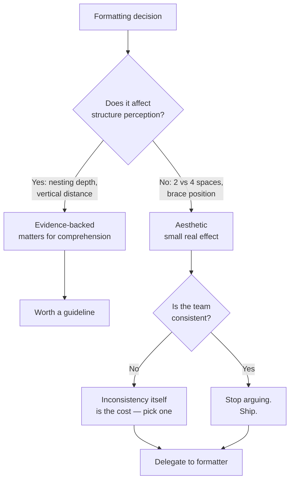
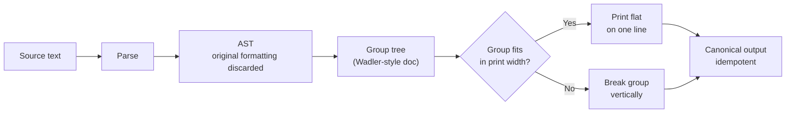

# Formatting — Professional Level

> Focus: the deep end — what readability research actually says about indentation, line length, and whitespace; how a deterministic formatter rewires team dynamics and version-control internals; structural (AST-based) vs line-based formatting; and the hard limits of what any formatter can do.

---

## Table of Contents

1. [The readability evidence base](#the-readability-evidence-base)
2. [Line length: the 50–75 vs 80–120 split](#line-length-the-5075-vs-80120-split)
3. [The typographic case for 2 vs 4 spaces](#the-typographic-case-for-2-vs-4-spaces)
4. [Deterministic formatters change team dynamics](#deterministic-formatters-change-team-dynamics)
5. [AST-based vs line-based formatting](#ast-based-vs-line-based-formatting)
6. [Formatting and version-control internals](#formatting-and-version-control-internals)
7. [Generated, vendored, and large-literal code](#generated-vendored-and-large-literal-code)
8. [The limits of formatters](#the-limits-of-formatters)
9. [Common Mistakes](#common-mistakes)
10. [Test Yourself](#test-yourself)
11. [Cheat Sheet](#cheat-sheet)
12. [Summary](#summary)
13. [Further Reading](#further-reading)
14. [Related Topics](#related-topics)

---

## The readability evidence base

Most formatting arguments are aesthetic preferences dressed as engineering. The literature that exists is thinner and more nuanced than either side of a tabs-vs-spaces thread admits, so it pays to know what was actually measured.

**Indentation and comprehension.** The foundational study is Miara, Musselman, Navarro & Shneiderman, *"Program Indentation and Comprehensibility"* (CACM, 1983). They tested indentation levels of 0, 2, 4, and 6 spaces on comprehension scores. The result that gets quoted — "2 to 4 spaces is best" — is real, but the more important finding is the *shape* of the curve: comprehension rose from 0 to 2–4 spaces and then **fell** at 6. Over-indentation hurt as much as under-indentation. The mechanism is plausible: deep indentation pushes code off the right edge and forces horizontal eye travel, while zero indentation removes the block-structure cue the eye uses to chunk nesting.

**Eye-tracking on source code.** Busjahn et al., *"Eye Movements in Code Reading: Relaxing the Linear Order"* (ICPC 2015), showed that programmers do **not** read code like prose (left-to-right, top-to-bottom). Novices read more linearly; experts jump — they scan signatures, follow data flow, and revisit. The practical consequence for formatting: vertical alignment of related items and consistent visual landmarks (a closing brace always in the same column relative to its opener) matter more than left-to-right line beauty, because experts navigate by *shape*.

**Beacons and chunking.** Crosby & Stelovsky's work on program reading, and the broader "beacons" literature (Wiedenbeck, 1986), establish that experienced readers recognize stereotyped structures as units. Consistent formatting makes a `for` loop *look* like every other `for` loop, so it registers as one chunk instead of being parsed line by line. This is the empirical core of why consistency beats local cleverness: it lets the reader spend cognitive budget on semantics, not on re-deriving structure.

**Working memory is the binding constraint.** The mechanism underneath all of these results is the limited capacity of working memory — the classic "7 ± 2" chunks (Miller, 1956), revised downward to ~4 chunks for novel material (Cowan, 2001). Every cognitive cycle a reader spends *parsing layout* — figuring out where a block ends, whether two lines belong together, what the inconsistent indent on line 40 means — is a cycle not spent on the logic. Consistent formatting is valuable precisely because it converts layout from something that must be *parsed* into something that is *recognized* (a beacon), freeing chunks for the actual problem. This is why the same formatting that helps a reader new to the file helps the original author six months later: both are working-memory-bound on unfamiliar material.

**The honest caveat.** These studies are small, dated, and mostly used languages (Pascal, early C) and screens unlike today's. There is no rigorous modern RCT proving 4 spaces beats 2 for comprehension on a 4K monitor. The defensible position is therefore: *the difference between any reasonable choice and inconsistency is large and well-supported; the difference between two reasonable choices is small and not well-supported.* That asymmetry is the entire justification for handing the decision to a tool.



---

## Line length: the 50–75 vs 80–120 split

The "80 columns" convention is an artifact: the IBM punched card had 80 columns, the VT100 terminal had 80, and the limit ossified into style guides. But it accidentally lands near a typographically defensible range — for the *wrong* medium.

**Prose ideal: ~50–75 characters.** Typographers converge on roughly 45–75 characters per line for body prose, with ~66 as a frequent target (Bringhurst, *The Elements of Typographic Style*). The reason is **saccade and return-sweep economy**: lines too long make the eye lose its place on the return sweep to the next line; lines too short force too many sweeps and break rhythm. This is measured for continuous prose read linearly.

**Code is not prose.** Two facts break the prose number for source code:

1. Code is read non-linearly (see eye-tracking above), so return-sweep cost is less dominant — readers jump, they do not sweep.
2. Code carries unavoidable horizontal information: `repository.findByCustomerIdAndStatus(customerId, ACTIVE)` is one indivisible thought. Forcing it under 66 characters produces awkward wraps that *add* cognitive load.

This is why code conventions land in the **80–120** band: PEP 8 nominally 79 (with a 72 limit for comments/docstrings, the one place code *is* prose-like), Go's community ~100, Google's Java style 100, the Linux kernel moved from 80 to "prefer 80, hard limit higher." The band reflects a compromise: wide enough for a real method call, narrow enough for side-by-side diffs and split editor panes.

**The diff argument is the strongest one.** A hard cap near 100 is not about reading the file — it is about reading the *diff*. Three-way merge tools and side-by-side review panes each get roughly half the screen. A 200-character line either wraps (destroying the column alignment reviewers rely on) or scrolls (hiding the right half of a change). The cap is a constraint on the *review* medium, not the editing medium.

```python
# PEP 8: 79 cols for code, 72 for prose-like comments/docstrings.
# A genuinely long, indivisible call — wrapping it is the lesser evil:
result = (
    repository
    .find_by_customer_and_status(customer_id, status=Status.ACTIVE)
    .order_by("-created_at")
)
```

```go
// Go: gofmt does NOT enforce a line length at all.
// The community norm (~100) is social, not tool-imposed —
// gofmt will leave a 300-char line untouched. This is deliberate:
// see "the limits of formatters" below.
err := svc.Process(ctx, req.CustomerID, req.Status, req.Region, opts)
```

---

## The typographic case for 2 vs 4 spaces

Indentation width trades two competing goods.

**4 spaces (or a tab rendered as 4):** maximizes the *block-structure signal*. Miara et al.'s curve peaks here — deeper visual separation between nesting levels makes block boundaries obvious at a glance. Cost: each level eats horizontal budget, so deeply nested code hits the line-length wall sooner.

**2 spaces:** preserves horizontal budget, which matters for languages that nest heavily (JSX, deeply chained builders, Go's error-handling staircases) and for the side-by-side diff constraint above. Cost: the structure signal is weaker; at 2 spaces, level 5 and level 6 are easy to confuse.

The deepest argument is that **indentation width is really a proxy for a nesting-depth limit**. If 4-space indentation makes your code fall off the screen, the formatter is telling you the *code* is too deeply nested — the fix is to extract a function (reducing depth), not to shrink the indent to 2. In this sense the 2-vs-4 debate is downstream of a real design metric: cyclomatic/cognitive nesting. A formatter that picks 4 spaces effectively raises an early warning on over-nesting; one that picks 2 suppresses that warning. This is a genuine engineering trade-off hiding inside an aesthetic one.

**Tabs as the principled answer — and why it lost.** Tabs separate *semantics* (one level of indentation) from *rendering* (how wide a level looks), letting each reader choose width. This is the accessibility-correct choice: it is the only option that lets a low-vision developer render indentation at 8 and a laptop user at 2 *from the same bytes*. Go endorses tabs for exactly this reason (`gofmt` uses tabs). It lost the broader war because tabs mixed with spaces for *alignment* (not indentation) render inconsistently, and most teams never enforced the indent-with-tabs/align-with-spaces discipline tooling requires. The pragmatic resolution: pick one, let the formatter enforce it, and never think about it again.

```java
// Google Java Style: 2-space indent, 100-col limit.
// 4 levels of nesting at 4 spaces would consume 16 cols before
// the first token — 2 spaces buys headroom but weakens the signal.
if (order.isValid()) {
  for (LineItem item : order.items()) {
    if (item.isTaxable()) {
      total = total.add(item.taxedAmount());
    }
  }
}
```

---

## Deterministic formatters change team dynamics

A *deterministic* formatter — one output for one input, no options — is a social technology, not just a code tool.

**Go's `gofmt` as a cultural decision.** Rob Pike: *"gofmt's style is no one's favorite, yet gofmt is everyone's favorite."* The genius of `gofmt` is that it ships with the language, has **almost no configuration**, and runs by default. There is no `.gofmt.rc` debate because there is no `.gofmt.rc`. The effect on team dynamics is profound:

- **It ends the bikeshed permanently.** You cannot argue about brace placement with a tool that has no flag for it. The decision is removed from human discretion, so it stops consuming social capital in code review.
- **It de-personalizes diffs.** Because every committed file is `gofmt`-clean, a diff never contains "I prefer it this way" noise. Reviewers see only semantic change.
- **It standardizes the *ecosystem*, not just the team.** Any Go file from any author reads the same way, which lowers the cost of reading unfamiliar code — the single largest activity in software maintenance.

This is "a foolish consistency is the hobgoblin of little minds" (Emerson, quoted *against* itself in PEP 8) turned on its head. PEP 8 invokes Emerson to grant exceptions for readability; `gofmt`'s philosophy is that the *consistency itself is the readability win*, and the marginal aesthetic loss on any one construct is dwarfed by the ecosystem-wide gain. Both can be right because they optimize different things: PEP 8 optimizes the single file; `gofmt` optimizes the corpus.

**Configurability is a liability, not a feature.** Prettier deliberately ships with very few options for the same reason — every option is a future argument and a source of cross-repo inconsistency. The cost of a formatter option is not the line in the config file; it is the meetings, the review comments, and the divergence between repositories that the option licenses.

**The migration cost is one-time and front-loadable.** Adopting a formatter on a legacy codebase produces one enormous "reformat everything" diff that destroys `git blame`. The standard mitigation is a single mechanical commit recorded in `.git-blame-ignore-revs` (supported by GitHub and `git blame --ignore-revs-file`), so blame skips the reformat and points at the real authoring commit. Do the reformat as its own PR, touching nothing else, so it is reviewable as "no semantic change."

```bash
# One-time legacy adoption, contained so blame survives.
git checkout -b chore/format-all
gofmt -w ./...                      # or: black . / prettier --write .
git commit -am "chore: gofmt entire tree (no behavior change)"
REV=$(git rev-parse HEAD)
echo "$REV" >> .git-blame-ignore-revs
git config blame.ignoreRevsFile .git-blame-ignore-revs   # GitHub honors it too
```

**It re-frames the review conversation.** Once layout is non-negotiable and machine-enforced, code review can no longer *be* about layout — and that is the point. Reviewers stop leaving "nit: spacing" comments (which research on review effectiveness flags as low-value noise that crowds out defect-finding) and spend their limited attention on logic, naming, and design. The formatter is, in effect, a filter that strips the cheapest category of review comment out of existence before a human ever reads the diff.

---

## AST-based vs line-based formatting

How a formatter *works* determines what it can guarantee.

**Line-based / regex-ish tools** (older `indent`, many lint-fixers, `clang-format` in some modes) operate on the text stream. They are fast and editable but fragile: they can be confused by macros, unusual constructs, or anything that does not parse cleanly, and they generally cannot *re-flow* code, only nudge it.

**AST-based tools** (`gofmt`, Prettier, Black, `rustfmt`) parse the source into an abstract syntax tree, **throw away the original formatting entirely**, and pretty-print the tree from scratch. The consequences are the whole point:

1. **Idempotence and convergence.** `format(format(x)) == format(x)`. Because output derives from the tree, not the input text, all inputs with the same AST converge to one canonical string. This is what makes the output *deterministic* and the diff *minimal*.
2. **It cannot produce invalid code.** The output is generated from a valid tree, so it always parses (assuming the input did).
3. **It ignores your manual alignment.** This frustrates newcomers: you carefully line up `=` signs, and Black/`gofmt` collapses them, because the tree has no node for "the human aligned these." `gofmt` is a partial exception — it *does* perform tabular alignment of adjacent struct fields and `const` blocks, because Go's grammar makes that alignment a recognizable, reconstructable pattern.

```python
# Black collapses manual alignment — the AST has no "aligned" node.
# You wrote:
x        = 1
foo      = 2
# Black emits:
x = 1
foo = 2
```

**Prettier's wrapping algorithm.** Prettier (and Wadler/Leijen-style pretty-printers generally — Philip Wadler, *"A Prettier Printer,"* 1999) model the document as a tree of "groups" that are printed flat if they fit within the print width and broken vertically if they do not. This is why changing one argument can re-flow an entire call: the group either fits or it does not, atomically. Understanding this prevents the common confusion of "why did my unrelated line move" — it did not move; its *group* crossed the width boundary.

**Indent-with-tabs, align-with-spaces.** The one alignment rule that survives an AST formatter is the *elastic tabstop* discipline Go follows: **tabs for indentation, spaces for alignment.** Indentation is structural (it is in the tree as nesting depth), so a tab renders it at any width the reader chooses. Alignment within a line (lining up struct-field types, comment columns) is presentational, so spaces fix it regardless of tab width. Mixing the two — tabs for alignment — is what produced the historical "looks fine on my editor, garbage on yours" bug, because a tab's *rendered* width is reader-dependent. `gofmt` enforces exactly this split, which is why a `gofmt`'d file looks aligned at any tab-width setting.

**Idempotence is a testable contract.** Because AST formatters guarantee `format(format(x)) == format(x)`, you can assert it in CI: run the formatter twice and diff. A non-idempotent result is a formatter bug or a plugin conflict (common when two tools — e.g. an ESLint formatting rule and Prettier — both claim authority over layout and fight). The professional rule is *one tool owns layout*; running a linter's formatting rules alongside a formatter is a configuration smell (`eslint-config-prettier` exists precisely to disable the overlap).



---

## Formatting and version-control internals

Formatting choices interact directly with the **diff and merge algorithms** Git runs. This is where formatting stops being aesthetic and becomes operational.

**How `git diff` works.** Git's default diff is Myers' algorithm (Eugene Myers, *"An O(ND) Difference Algorithm and Its Variations,"* 1986), operating on *lines* as atomic units. Two formatting facts follow:

- **One token per line shrinks diffs and merge conflicts.** If a function-call argument list, an import list, or an array literal has one element per line, adding element N+1 changes exactly one line and conflicts only with another change to that same line. Pack them onto one line and any change to the list rewrites the whole line, conflicting with every other change to it. This is the operational argument for vertical lists in append-heavy structures (dependency lists, enums, route tables).
- **Trailing commas are a merge-conflict reducer.** Without a trailing comma, appending an item requires editing the *previous* line (to add its comma) *and* adding the new line. Two developers each appending an item both edit the old last line → conflict. With a trailing comma, each appends a pure-addition line and the previous line is untouched → no conflict. This is why `gofmt` *mandates* trailing commas in multi-line composite literals, Black adds the "magic trailing comma," and Prettier defaults to `trailingComma: "all"`. It is a VCS optimization masquerading as a style rule.

```go
// gofmt mandates the trailing comma on the last element of a
// multi-line literal. Appending "audit" touches ONLY a new line —
// no edit to the "metrics" line, so concurrent appends don't conflict.
plugins := []string{
    "auth",
    "metrics",
    "audit",   // <- pure addition; previous line untouched
}
```

**Diff algorithm choice matters for moved code.** Git's `--diff-algorithm=histogram` (and `patience`) produce more human-meaningful hunks than Myers when blocks move, because they anchor on rarely-occurring lines first. Setting `diff.algorithm = histogram` in `.gitconfig` is a low-cost win that interacts with formatting: clean, consistently-formatted code gives the algorithm stable anchor lines.

**Whitespace-only churn is poison.** A diff that mixes a real change with a formatter sweep is unreviewable — the reviewer cannot find the semantic change in the noise. Two defenses: (1) never commit a formatter change together with a logic change; (2) configure CI to reject files that are not formatter-clean (`gofmt -l`, `black --check`, `prettier --check`) so churn never enters the history in the first place. `git diff -w` (ignore whitespace) is a *reading* aid, not a fix — the noise is still committed.

**EOL and final-newline normalization.** A missing trailing newline or CRLF/LF mismatch produces phantom diffs on every checkout across OSes. `.gitattributes` with `* text=auto eof=lf` and a formatter that enforces a final newline (POSIX defines a "line" as ending in `\n`; many tools warn on its absence) eliminate a whole class of cross-platform diff noise.

---

## Generated, vendored, and large-literal code

Not all code should be formatted by your formatter, and pretending otherwise creates churn and false review signal.

**Generated code.** Protobuf stubs, ORM models, OpenAPI clients, parser output. Rules:

- Mark it. Go's convention is the exact regexp `^// Code generated .* DO NOT EDIT\.$` on the first lines; tooling (`gofmt`, `go vet`, IDEs) recognizes it. GitHub uses `linguist-generated` in `.gitattributes` to collapse it in diffs and exclude it from language stats.
- Do not hand-format it; let the generator own the bytes. If the generator's output is not formatter-clean, run the formatter *as a build step in the generator*, not as a manual edit, or you reintroduce churn on every regeneration.

**Vendored / third-party code.** Code under `vendor/`, `node_modules/`, or a `third_party/` tree must be excluded from your formatter and linters (`.prettierignore`, `.eslintignore`, formatter excludes, `linguist-vendored`). Reformatting vendored code destroys the ability to diff it cleanly against upstream and bloats every dependency-bump PR with reformatting noise — defeating the entire reason to vendor.

**Large data literals.** A 5,000-line lookup table, an embedded fixture, or a generated enum is data, not code, and AST formatters handle it badly — Prettier will dutifully one-element-per-line a 10,000-entry array and produce a 10,000-line file that is slow to parse, slow to diff, and pointless to review. Options: move it to a real data file (`.json`, `.csv`, `//go:embed`), exclude the file from the formatter, or use a formatter pragma (`// prettier-ignore`, `# fmt: off` / `# fmt: on` for Black, `//gofmt:ignore` is *not* a thing — Go's answer is to not put large literals in `.go` files and to `go:embed` instead).

```python
# Black: disable formatting for a hand-tuned matrix/table.
# fmt: off
ROTATION = [
    1, 0, 0,
    0, 1, 0,
    0, 0, 1,
]
# fmt: on
```

---

## The limits of formatters

A formatter operates on the AST. Everything a formatter *cannot* see is a thing it cannot fix — and these are precisely the formatting concerns that matter most for comprehension.

**It cannot impose conceptual ordering.** A formatter will happily print methods in any order you wrote them. It has no notion that the public API should come before private helpers, or that a function should sit near the one it calls (the "step-down rule," Martin, *Clean Code*, ch. 5). *Newspaper structure* — high-level first, details below — is a semantic decision the author makes; no tool reorders members by abstraction level, because "abstraction level" is not in the grammar.

**It cannot fix vertical distance.** "Variables should be declared close to their use; related functions should be vertically close" (*Clean Code*) is about *meaning*, not syntax. A formatter cannot know that two functions are conceptually related, so it cannot move them together. It can normalize the *amount* of blank lines (one between methods, two between top-level declarations in PEP 8) but not *where* the conceptual seams belong.

**It cannot judge whitespace as meaning.** Magic vertical whitespace — blank lines sprinkled for "breathing room" with no semantic boundary — is a smell a formatter will preserve, because a blank line is syntactically valid anywhere. The author must use blank lines as *paragraph breaks* separating coherent thoughts; a formatter only caps runs (Black/`gofmt` collapse 3+ blank lines to 1–2). Conversely, removing *all* blank lines (one dense wall) is equally bad and equally invisible to the formatter.

**It cannot break a too-long line meaningfully.** A formatter breaks at the syntactic point that fits the width, not at the conceptual seam. `a.b().c().d().e()` broken by Prettier breaks where it must, which may or may not be where a human would break to expose the pipeline's stages. When the mechanical break obscures intent, the real fix is a refactor (extract intermediate variables), which the formatter cannot suggest.

**A worked example of the limit.** Consider this `gofmt`-clean, `prettier`-clean function — every mechanical rule satisfied, yet badly formatted:

```go
// Passes gofmt. Still poorly formatted — the formatter is blind to all of it.
func handler(w http.ResponseWriter, r *http.Request) {
	logger.Info("entering handler")           // diagnostic, not a paragraph break

	id := r.URL.Query().Get("id")
	helper()                                   // defined 200 lines below — step-down violated

	if id == "" {
		http.Error(w, "missing id", 400); return
	}

	user, err := db.Find(id)                   // 'user' declared far from its only use below
	logger.Info("queried db")

	render(w, user, err)
}
```

The blank lines mark nothing (they are reflex "breathing room"), `helper` is called before it is defined far below (step-down rule broken), and `user` is declared distant from its single use. `gofmt` normalized the indentation and would cap excess blank lines — and is otherwise silent, because none of these defects are expressible in the grammar. Fixing them is a human edit, and arguably a refactor.

The synthesis: **a formatter eliminates the formatting decisions that do not matter so that humans can spend attention on the ones that do.** It buys back the cognitive budget previously spent on brace placement and spends it on member ordering, vertical proximity, and meaningful whitespace — none of which it can do for you. Treating "the formatter passes" as "the formatting is good" is the central professional error here.

---

## Common Mistakes

- **Treating formatter-clean as well-formatted.** CI green on `prettier --check` says nothing about member ordering, vertical proximity, or whether blank lines mark real boundaries. The formatter handles the trivial layer; the author owns the semantic layer.
- **Committing a reformat together with logic.** Produces an unreviewable diff. Always isolate mechanical reformats into their own commit and record it in `.git-blame-ignore-revs`.
- **Adding formatter options to "win" a style argument.** Every option is a permanent future argument and a vector for cross-repo divergence. Prefer a tool with no knobs (`gofmt`, Black) precisely because it removes the discretion.
- **One-element-per-line on a 10,000-row data literal.** This is data, not code — move it to a data file or `go:embed` and exclude it from the formatter.
- **Reformatting vendored or generated code.** Destroys upstream diffability and floods dependency-bump PRs with noise. Exclude it and mark it (`linguist-vendored`, `DO NOT EDIT`).
- **Packing append-heavy lists onto one line.** Defeats Git's line-based diff and manufactures merge conflicts. Use vertical lists plus a trailing comma for anything that grows.
- **Mistaking 2-vs-4 spaces for the real problem.** If 4-space indent runs off the screen, the code is too deeply nested. Extract a function; do not shrink the indent.
- **Using `git diff -w` as a fix.** It hides whitespace noise while *reading* but the noise is still committed. Fix it at the gate with `--check` in CI.

---

## Test Yourself

1. The 1983 Miara study is cited as "use 2–4 spaces." What is the *more important* finding people omit, and what does it imply about indentation width?

<details><summary>Answer</summary>

The comprehension curve was non-monotonic: it rose from 0 to 2–4 spaces and **fell at 6**. Over-indentation hurt comprehension as much as under-indentation. The implication is that indentation width is bounded on *both* sides — and that if a wide indent (4+) pushes your code off the right edge, the real signal is that the code is too deeply nested, not that the indent is wrong. The fix is to reduce nesting (extract a function), not to shrink the indent.

</details>

2. Typographers recommend ~66 characters per line for prose, yet code conventions sit at 80–120. Why is the prose number wrong for code?

<details><summary>Answer</summary>

Two reasons. (1) The prose number optimizes the *return sweep* in linear reading; eye-tracking studies (Busjahn et al., 2015) show programmers read code non-linearly — they jump rather than sweep — so return-sweep cost is far less dominant. (2) Code carries indivisible horizontal units (a qualified method call with arguments) that cannot be wrapped under 66 chars without adding awkward breaks. The 80–120 band is mostly driven by the *diff/review* medium — side-by-side panes and three-way merges each get ~half the screen — not by the reading-the-file medium.

</details>

3. Why does `gofmt` *mandate* a trailing comma in multi-line composite literals? Frame it in terms of the diff algorithm.

<details><summary>Answer</summary>

Git diffs lines (Myers' algorithm). Without a trailing comma, appending an element forces editing the previous line to add its comma, so two developers appending concurrently both edit that line → merge conflict. With the trailing comma, each new element is a pure line addition and the previous line is untouched → no conflict and a minimal diff. It is a version-control optimization expressed as a formatting rule. (The same logic drives Black's "magic trailing comma" and Prettier's `trailingComma: "all"`.)

</details>

4. A teammate asks why Black "destroyed" their carefully aligned `=` signs. Explain in terms of how AST formatters work.

<details><summary>Answer</summary>

AST-based formatters parse the source into a tree, **discard the original text formatting**, and pretty-print the tree from scratch. The tree has no node representing "the human aligned these equals signs," so that information is gone before printing begins. The output is therefore canonical and idempotent (`format(format(x)) == format(x)`) but cannot honor manual alignment. `gofmt` is a partial exception: it realigns adjacent struct fields/`const` blocks because Go's grammar makes that a reconstructable pattern.

</details>

5. Your CI passes `prettier --check`, yet a reviewer says "the formatting is bad." Both can be true — how?

<details><summary>Answer</summary>

A formatter operates only on what is in the AST, so it cannot fix the semantic formatting concerns: conceptual member ordering (public API before private helpers, step-down rule), vertical proximity (related functions near each other; variables near their use), or meaningful blank-line placement (paragraph breaks vs random "breathing room"). `prettier --check` verifies the mechanical layer is canonical; the reviewer is objecting to the semantic layer the author still owns. "Formatter passes" ≠ "well-formatted."

</details>

6. You adopt `gofmt`/Black on a 10-year-old repo. What is the one-time cost, and how do you contain it?

<details><summary>Answer</summary>

The cost is one massive reformat diff that overwrites `git blame` for nearly every line. Contain it by: (1) doing the reformat as a single isolated commit that touches *nothing* semantic, so it is trivially reviewable as "no behavior change"; (2) recording that commit's hash in `.git-blame-ignore-revs` and configuring `git blame --ignore-revs-file` (GitHub honors this automatically). Blame then skips the reformat and attributes lines to their real authoring commit.

</details>

7. Why is a configurable formatter often *worse* than an opinionated one with no options, even though configurability sounds strictly more flexible?

<details><summary>Answer</summary>

Every option is a permanent future argument and a vector for divergence between repositories. The cost of an option is not the config line — it is the recurring code-review debates it licenses and the loss of cross-repo/ecosystem uniformity that makes unfamiliar code cheap to read. `gofmt` and Black are deliberately near-optionless so the decision is *removed from human discretion entirely*: you cannot bikeshed brace placement with a tool that has no flag for it. The flexibility is the liability.

</details>

8. A 6,000-line generated protobuf file shows up in code-review reformatted and re-indented. Two things went wrong — name them.

<details><summary>Answer</summary>

(1) The generated file was not excluded from the formatter/linter, so the tool rewrote it; (2) it was not marked as generated (Go's `// Code generated ... DO NOT EDIT.` header, or `linguist-generated` in `.gitattributes`), so review tooling did not collapse it and humans wasted attention on it. Fixes: exclude generated trees from formatting, run any needed formatting *inside the generator step* so it is stable across regenerations, and mark the files so diff viewers and language stats ignore them.

</details>

---

## Cheat Sheet

| Concern | Professional position | Tool/setting |
|---|---|---|
| Indent width | Pick one; if 4 overflows, the code is over-nested | `gofmt` (tabs), Black (4), Google Java (2) |
| Line length | 80–120 band; driven by the *diff* medium, not reading | PEP 8 79/72, Prettier `printWidth` 80–100 |
| Tabs vs spaces | Tabs are the accessibility-correct choice; spaces won socially — just be consistent | `.editorconfig`, formatter enforces |
| Trailing commas | Mandatory on multi-line lists — reduces merge conflicts | `gofmt` (forced), Black magic comma, Prettier `"all"` |
| Append-heavy lists | One element per line for clean line-based diffs | n/a — author discipline |
| Reformat a legacy repo | Isolated mechanical commit + `.git-blame-ignore-revs` | `git blame --ignore-revs-file` |
| Generated code | Exclude + mark; format inside the generator | `linguist-generated`, `DO NOT EDIT` header |
| Vendored code | Exclude from formatter and lint | `.prettierignore`, `linguist-vendored` |
| Huge data literals | Move to data file / `go:embed`; or pragma-ignore | `# fmt: off`, `// prettier-ignore` |
| Cross-platform EOL | Normalize to LF + final newline | `.gitattributes` `* text=auto eol=lf` |
| Diff readability | Prefer histogram over Myers for moved blocks | `git config diff.algorithm histogram` |
| Whitespace churn | Block at the gate, never `-w` after the fact | `gofmt -l`, `black --check`, `prettier --check` in CI |

**What the formatter CANNOT do (you own these):** conceptual member ordering · vertical proximity of related code · meaningful blank-line paragraphing · breaking a long line at the conceptual seam (often a refactor, not a wrap).

---

## Summary

Formatting at the professional level splits cleanly into two layers. The **mechanical layer** — indent width, brace position, line wrapping, trailing commas, blank-line caps — has small, weakly-supported comprehension effects between any two reasonable choices, but a large, well-supported cost when it is *inconsistent*. That asymmetry is the entire argument for a deterministic, near-optionless, AST-based formatter: it removes the decision from human discretion (`gofmt`'s cultural masterstroke), produces idempotent canonical output, and interacts with Git's line-based diff/merge internals to minimize conflict noise (trailing commas, vertical lists, EOL normalization). Run it at the CI gate, isolate reformats with `.git-blame-ignore-revs`, and exclude generated/vendored/large-literal code that the tool handles badly.

The **semantic layer** — conceptual ordering, vertical proximity, meaningful whitespace, breaking lines at conceptual seams — is exactly what the formatter cannot touch, because none of it lives in the AST. This is the professional's real formatting work, and the central mistake is mistaking a green `--check` for good formatting. The formatter buys back the attention you used to spend on braces; spend it on the layout decisions that carry meaning.

---

## Further Reading

- Miara, Musselman, Navarro, Shneiderman — *"Program Indentation and Comprehensibility,"* Communications of the ACM, 1983. The empirical basis for the 2–4 space recommendation and the non-monotonic curve.
- Busjahn et al. — *"Eye Movements in Code Reading: Relaxing the Linear Order,"* ICPC 2015. Programmers read code non-linearly; experts navigate by structure.
- Philip Wadler — *"A Prettier Printer,"* 1999. The algebra behind group-based pretty-printers (Prettier, Black's wrapping model).
- Eugene W. Myers — *"An O(ND) Difference Algorithm and Its Variations,"* Algorithmica, 1986. Git's default diff algorithm; the reason line-based formatting choices affect diffs.
- Robert C. Martin — *Clean Code*, Chapter 5 ("Formatting"). Newspaper metaphor, vertical density/openness, the step-down rule — the semantic layer.
- Robert Bringhurst — *The Elements of Typographic Style.* The 45–75 character measure for prose and why.
- PEP 8 — *Style Guide for Python Code.* The 79/72 limits and the "foolish consistency" exception clause.
- The Go Blog — *"go fmt your code"* and Rob Pike's "gofmt's style is no one's favorite" talk. The cultural case for a no-options formatter.
- Prettier documentation — *"Option Philosophy"* and *"Rationale."* Why a formatter ships with deliberately few options.
- Git documentation — `git blame --ignore-revs-file`, `.gitattributes` (`linguist-generated`, `text`, `eol`), `diff.algorithm`.

---

## Related Topics

- [senior.md](senior.md) — team-level conventions, `.editorconfig`, pre-commit hooks, and rolling out a formatter.
- [interview.md](interview.md) — formatting questions and how to discuss them at depth.
- [Chapter README](../README.md) — the positive formatting rules and anti-patterns this chapter covers.
- [Cognitive Load](../20-cognitive-load/README.md) — why consistent layout frees working memory for semantics.
- [Clean Commits and Version Control](../25-clean-commits-and-version-control/README.md) — isolating reformats, blame hygiene, and reviewable diffs.
- [Refactoring](../../refactoring/README.md) — the real fix when a formatter's mechanical line-break or nesting depth signals a design problem.
