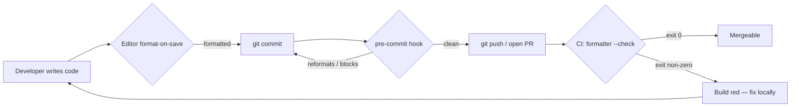
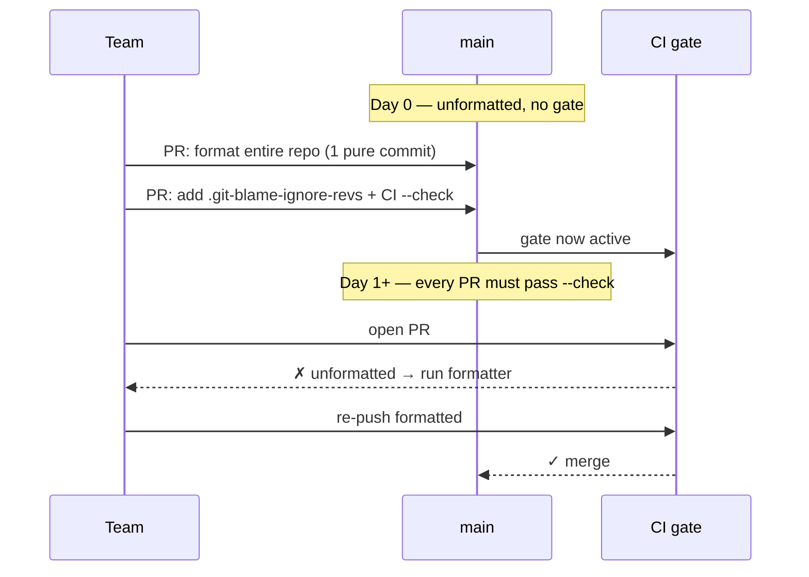
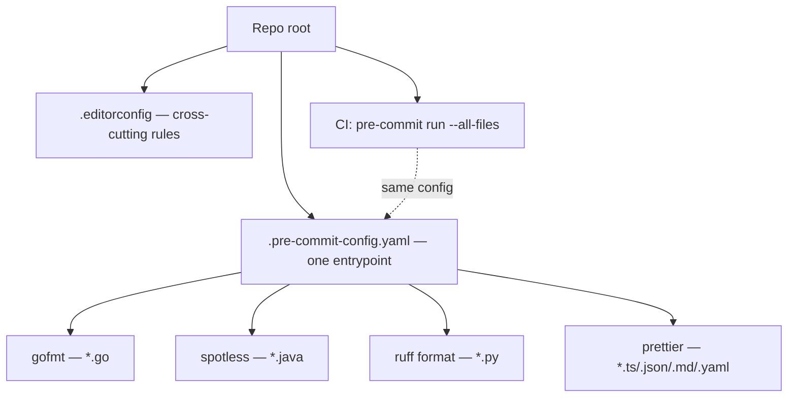

# Formatting — Senior Level

> Focus: "How does a team stop arguing about formatting forever?" — enforced formatters in CI, the one-commit repo reformat, `.git-blame-ignore-revs`, pre-commit hooks, EditorConfig, polyglot monorepos, and introducing a formatter to a legacy codebase without a 50k-line diff blocking everyone.

---

## Table of Contents

1. [The senior reframe: formatting is a tooling problem, not a taste problem](#the-senior-reframe-formatting-is-a-tooling-problem-not-a-taste-problem)
2. [The enforcement ladder: editor → hook → CI](#the-enforcement-ladder-editor--hook--ci)
3. [EditorConfig: the cross-tool baseline](#editorconfig-the-cross-tool-baseline)
4. [Per-language formatters and their `--check` modes](#per-language-formatters-and-their---check-modes)
5. [The pre-commit framework](#the-pre-commit-framework)
6. [CI gates that fail on unformatted code](#ci-gates-that-fail-on-unformatted-code)
7. [The big-bang reformat: one commit + `.git-blame-ignore-revs`](#the-big-bang-reformat-one-commit--git-blame-ignore-revs)
8. [Introducing a formatter to a legacy codebase incrementally](#introducing-a-formatter-to-a-legacy-codebase-incrementally)
9. [Preventing format churn in code review](#preventing-format-churn-in-code-review)
10. [Polyglot monorepos: one root, many formatters](#polyglot-monorepos-one-root-many-formatters)
11. [Style guide docs vs. tool defaults](#style-guide-docs-vs-tool-defaults)
12. [Common Mistakes](#common-mistakes)
13. [Test Yourself](#test-yourself)
14. [Cheat Sheet](#cheat-sheet)
15. [Summary](#summary)
16. [Further Reading](#further-reading)
17. [Related Topics](#related-topics)

---

## The senior reframe: formatting is a tooling problem, not a taste problem

At junior level, formatting is "where do the braces go." At senior level, formatting is an **organizational cost-control problem**. Every minute a reviewer spends on indentation is a minute not spent on correctness. Every "fix lint" round-trip is latency on the critical path of shipping.

The senior goal is to make formatting **invisible**:

- No human ever decides spacing in a PR.
- The diff in a review contains *only* semantic changes.
- A new hire's first commit is byte-identical in style to a ten-year veteran's.
- The CI status check is the single source of truth — not a senior engineer's opinion.

You get there by removing formatting from the space of human decisions entirely. The tool decides; humans review meaning. Anything a formatter *can* enforce, a human *should not* enforce.



The three gates are **defense in depth**. Editor format-on-save catches 95% silently. The pre-commit hook catches the developer who disabled it. CI catches the developer who skipped the hook with `--no-verify`. CI is the only gate you cannot bypass, so CI is authoritative — but the earlier gates exist so CI almost never has to say no.

---

## The enforcement ladder: editor → hook → CI

| Gate | Bypassable? | Latency | Purpose |
|---|---|---|---|
| **EditorConfig + format-on-save** | Yes (per-developer setting) | Instant | Catch everything silently before it's even saved |
| **pre-commit hook** | Yes (`git commit --no-verify`) | ~seconds | Last local line of defense; can auto-fix |
| **CI `--check`** | No | ~minutes | Authoritative; blocks merge |

The rule of thumb: **fix as early as possible, enforce as late as necessary**. Auto-fixing in the editor and the hook is convenient. CI must only *check*, never *fix* — a CI job that pushes auto-formatted commits back to a branch creates surprising history and race conditions. CI's job is to say "this is wrong, here's the command to fix it," then stop.

A good CI failure message tells the developer exactly what to run:

```
✗ gofmt found 3 unformatted files.
  Run: gofmt -w ./... && git add -p && git commit --amend
```

---

## EditorConfig: the cross-tool baseline

[EditorConfig](https://editorconfig.org/) is the lowest common denominator: a single `.editorconfig` at the repo root that every major editor (VS Code, IntelliJ, Vim, Emacs, GoLand, PyCharm) reads natively or via plugin. It does **not** replace language formatters — it sets the primitive cross-cutting rules (indentation, line endings, final newline, trailing whitespace) so files are consistent even for file types no formatter covers (Markdown, YAML, Dockerfiles, shell).

```ini
# .editorconfig — repo root
root = true

[*]
charset = utf-8
end_of_line = lf
insert_final_newline = true
trim_trailing_whitespace = true
indent_style = space
indent_size = 4
max_line_length = 100

# Go is canonically tabs — gofmt will fight you otherwise
[*.go]
indent_style = tab
indent_size = 4

[*.{js,ts,jsx,tsx,json,yml,yaml,css,scss,html}]
indent_size = 2

[Makefile]
indent_style = tab  # tabs are syntactically required

[*.md]
trim_trailing_whitespace = false  # two trailing spaces = Markdown hard break
```

Two things seniors get right that juniors miss:

1. **`root = true`** stops EditorConfig from walking up into a parent directory's config (critical in monorepos and in `$HOME`-based dev containers).
2. **Per-language overrides reflect the formatter's own conventions** — Go is tabs (gofmt is non-negotiable), web files are 2 spaces (Prettier default), Makefiles *require* tabs. Fighting the formatter's defaults in EditorConfig produces an infinite tug-of-war on save.

---

## Per-language formatters and their `--check` modes

A formatter that can only *write* files is a local convenience. The `--check` (or `-l`) mode — exit non-zero if any file would change, without modifying anything — is what makes CI enforcement possible.

### Go

`gofmt` ships with the toolchain; there is no style debate in Go by design. `gofumpt` is a stricter superset (it formats things gofmt leaves alone — e.g., grouped `import` blocks, redundant blank lines).

```bash
# Check only — lists files that are NOT formatted; empty output = clean
gofmt -l ./...
# CI gate: fail if the list is non-empty
test -z "$(gofmt -l ./...)" || { gofmt -l ./...; exit 1; }

# gofumpt equivalent
gofumpt -l . ; test -z "$(gofumpt -l .)"

# Write mode (local / hook)
gofmt -w ./...
```

> `gofmt -l` does not have a non-zero exit on findings by itself — it just lists files. The `test -z "$(...)"` idiom converts "non-empty list" into a failing exit code. This is the single most-copied snippet in Go CI configs.

### Java

`google-java-format` (Google style) or **Spotless** (a build-tool plugin that wraps formatters and adds a `check` task). Spotless is the team standard because it integrates with Gradle/Maven and supports multiple languages from one config.

```groovy
// build.gradle
spotless {
    java {
        googleJavaFormat('1.22.0')   // pin the version — see "format churn" below
        removeUnusedImports()
        trimTrailingWhitespace()
        endWithNewline()
    }
}
```

```bash
./gradlew spotlessCheck   # CI gate — fails the build if unformatted
./gradlew spotlessApply   # local — rewrites files
```

### Python

`black` (opinionated, near-zero config) or `ruff format` (a Rust reimplementation of Black, ~30× faster, now the de-facto choice for new projects). Both support `--check` and `--diff`.

```bash
black --check --diff .       # CI: exit 1 if any file would change, show the diff
black .                      # local: rewrite

ruff format --check .        # CI
ruff format .                # local
```

```toml
# pyproject.toml — single source of config for black AND ruff
[tool.black]
line-length = 100
target-version = ["py311"]

[tool.ruff]
line-length = 100
target-version = "py311"
```

### JS / TS / JSON / YAML / Markdown / CSS

`prettier` covers everything the other formatters don't.

```bash
npx prettier --check .       # CI
npx prettier --write .       # local
```

```json
// .prettierrc.json
{ "printWidth": 100, "tabWidth": 2, "singleQuote": true, "trailingComma": "all" }
```

| Language | Formatter | Check flag | Write flag | Config file |
|---|---|---|---|---|
| Go | `gofmt` / `gofumpt` | `-l` (list) | `-w` | — (none) |
| Java | `google-java-format` / Spotless | `spotlessCheck` | `spotlessApply` | `build.gradle` / `pom.xml` |
| Python | `black` / `ruff format` | `--check` | (no flag) | `pyproject.toml` |
| JS/TS/web | `prettier` | `--check` | `--write` | `.prettierrc` |

---

## The pre-commit framework

[`pre-commit`](https://pre-commit.com/) is a language-agnostic git-hook manager (despite the Python name, it runs hooks for any language). One `.pre-commit-config.yaml` declares every formatter; the framework installs isolated tool environments so developers don't need each tool on their PATH.

```yaml
# .pre-commit-config.yaml
repos:
  - repo: https://github.com/pre-commit/pre-commit-hooks
    rev: v4.6.0
    hooks:
      - id: trailing-whitespace
      - id: end-of-file-fixer
      - id: check-merge-conflict
      - id: mixed-line-ending
        args: [--fix=lf]

  - repo: https://github.com/astral-sh/ruff-pre-commit
    rev: v0.5.0
    hooks:
      - id: ruff-format          # Python

  - repo: https://github.com/pre-commit/mirrors-prettier
    rev: v3.1.0
    hooks:
      - id: prettier             # JS/TS/JSON/YAML/MD/CSS

  - repo: local
    hooks:
      - id: gofmt
        name: gofmt
        entry: gofmt -w
        language: system
        types: [go]
      - id: spotless
        name: spotless
        entry: ./gradlew spotlessApply
        language: system
        types: [java]
        pass_filenames: false
```

```bash
pre-commit install                 # wire it into .git/hooks (each dev runs once)
pre-commit run --all-files         # run against the whole repo (use in CI too)
```

Senior notes:

- **Pin `rev:` to exact tags**, never a branch. A floating `rev` means two developers running the same hook on the same code can produce different output — that *is* format churn.
- **Run the same `.pre-commit-config.yaml` in CI** (`pre-commit run --all-files`). The local hook and the CI gate then use byte-identical tool versions — there is no "passes locally, fails in CI" class of bug.
- Hooks run **only on staged/changed files by default**, which is what makes them fast enough to not be skipped.

---

## CI gates that fail on unformatted code

A minimal, polyglot GitHub Actions workflow that checks (never fixes):

```yaml
# .github/workflows/format.yml
name: format-check
on: [pull_request]

jobs:
  format:
    runs-on: ubuntu-latest
    steps:
      - uses: actions/checkout@v4

      - name: Go
        run: |
          test -z "$(gofmt -l ./...)" || { echo "Run: gofmt -w ./..."; gofmt -l ./...; exit 1; }

      - name: Python
        run: pipx run ruff format --check .

      - name: Web / config files
        run: npx --yes prettier --check .

      - name: Java
        run: ./gradlew spotlessCheck

      # Or, equivalently, the single source of truth:
      - name: pre-commit (all files)
        uses: pre-commit/action@v3.0.1
```

The cleanest setup uses **only** the `pre-commit/action` step so the CI config and the local config can never diverge. The explicit per-language steps above are shown for teams that haven't adopted pre-commit yet.

> **Never let CI auto-commit formatting.** A workflow with write permissions that runs `prettier --write` and pushes back creates: (1) commits authored by a bot, (2) a push that races the developer's next push, (3) a `.git-blame-ignore-revs` churn nightmare. CI checks; humans fix.

---

## The big-bang reformat: one commit + `.git-blame-ignore-revs`

The first time you adopt a formatter on an existing repo, running `--write` touches thousands of files. The objection is always the same: **"this destroys `git blame`."** It does — unless you use Git's blame-ignore mechanism.

### The procedure

```bash
# 1. Reformat the ENTIRE repo in a single, isolated commit.
#    Do nothing else in this commit — no logic, no renames.
git checkout -b chore/format-entire-repo
gofmt -w ./...
ruff format .
npx prettier --write .
./gradlew spotlessApply
git add -A
git commit -m "style: format entire repo with gofmt/ruff/prettier/spotless

Pure mechanical reformat. No behavior change.
Add this commit's SHA to .git-blame-ignore-revs."

# 2. Capture the SHA and record it.
git rev-parse HEAD     # e.g. a1b2c3d4...
```

Create (or append to) `.git-blame-ignore-revs` at the repo root:

```
# .git-blame-ignore-revs
# Whole-repo formatter adoption (gofmt + ruff + prettier + spotless)
a1b2c3d4e5f6a7b8c9d0e1f2a3b4c5d6e7f8a9b0
```

Then tell Git to use it permanently:

```bash
git config blame.ignoreRevsFile .git-blame-ignore-revs
```

Now `git blame` skips straight through the reformat commit to the line's *real* last author. GitHub and GitLab read `.git-blame-ignore-revs` automatically in their blame UIs — no per-user config needed for the web view.

### Rules that make the big-bang work

- **The reformat commit must be pure.** Zero logic changes. If a reviewer sees one behavioral line in a 40k-line style diff, the trust in "mechanical" evaporates and the blame-ignore strategy is undermined.
- **Merge it when the branch is quiet** (Friday EOD, freeze window). Every open PR will now have a giant conflict; rebase them by reformatting *their* branch and taking the formatted result. Communicate the timing to the whole team.
- **Land the CI `--check` gate in the *same* PR or immediately after**, so the repo can never regress out of formatted state. A reformat without an enforcement gate decays back to inconsistency within weeks.



---

## Introducing a formatter to a legacy codebase incrementally

The big-bang reformat is correct for most repos, but sometimes it's politically or operationally impossible: hundreds of in-flight feature branches, a compliance freeze, or a team that won't accept the risk of a 50k-line diff at once. The alternative is **format-on-touch**.

### Strategy 1 — format only changed files (`pre-commit` does this natively)

Because `pre-commit` runs hooks only on staged files, simply *installing* it means new and modified files get formatted while untouched legacy files stay as-is. The repo converges to formatted over months as files are naturally edited. No big diff, no freeze.

The catch: CI cannot run `--check` on the whole repo (it would fail on untouched legacy files). Instead, check only the diff:

```yaml
# Check formatting on changed files only (legacy-friendly gate)
- name: format changed files
  run: |
    git fetch origin "${{ github.base_ref }}" --depth=1
    CHANGED=$(git diff --name-only --diff-filter=ACMR "origin/${{ github.base_ref }}"...HEAD)
    echo "$CHANGED" | grep '\.py$'  | xargs -r ruff format --check
    echo "$CHANGED" | grep '\.go$'  | xargs -r gofmt -l | (! grep .)
    echo "$CHANGED" | grep -E '\.(ts|js|json|md|ya?ml)$' | xargs -r npx prettier --check
```

### Strategy 2 — directory-by-directory

Format and gate one module/package at a time. Add each cleaned directory to the CI `--check` scope as it's done. The enforced surface grows; the "don't make it worse" rule covers everything else. This suits monorepos where teams own distinct directories and can adopt on their own schedule.

> The "don't make it worse" gate (check only the diff, not the whole tree) is the legacy analog of a linter baseline: you stop the bleeding immediately, then heal the backlog as a side effect of normal work — without a single blocking mega-diff.

---

## Preventing format churn in code review

**Format churn** is the recurring re-formatting of the same lines because two developers' tools disagree. It pollutes diffs, breaks `git blame`, and creates phantom merge conflicts. Causes and cures:

| Cause of churn | Cure |
|---|---|
| Different formatter **versions** between developers / CI | Pin the exact version (`gofumpt@vX`, `googleJavaFormat('1.22.0')`, `ruff` rev pinned, `prettier` in `devDependencies` not global) |
| Different config (one dev has a stray `.prettierrc`) | Single config at repo root; `root = true`; commit configs, never `.gitignore` them |
| Editor's built-in formatter ≠ the project's | Configure the editor to use the **project's** formatter; commit `.vscode/settings.json` with `editor.defaultFormatter` and `formatOnSave` |
| Reformat mixed into a feature PR | Policy: formatting changes go in **separate, clearly-labeled commits** (`style:`), never interleaved with logic |
| Auto-fix in CI pushing commits | Don't. CI checks only. |

Commit a project-pinned editor config so a fresh clone is correct on first save:

```json
// .vscode/settings.json (committed)
{
  "editor.formatOnSave": true,
  "[python]": { "editor.defaultFormatter": "charliermarsh.ruff" },
  "[go]":     { "editor.defaultFormatter": "golang.go" },
  "[javascript]": { "editor.defaultFormatter": "esbenp.prettier-vscode" },
  "go.formatTool": "gofumpt"
}
```

The single most effective review rule: **a PR diff should never contain a formatting change on a line the author did not semantically touch.** If it does, the author's tooling is misconfigured — fix the tooling, don't merge the churn.

---

## Polyglot monorepos: one root, many formatters

A monorepo with Go services, a Java platform, Python data pipelines, and a TypeScript frontend cannot use one formatter — but it can use **one orchestration layer** so the developer experience is uniform.



Principles:

- **One `.editorconfig` at the root** with per-glob overrides handles the primitives for every language and every config file.
- **One `pre-commit` entrypoint** routes files to the right formatter by `types:`/glob. Developers run one command (`pre-commit run`) regardless of which language they touched.
- **CI runs the identical `pre-commit` config.** The local and CI tool versions are pinned in the same file, so divergence is structurally impossible.
- For **build-tool–native ecosystems** (Gradle/Bazel), wire Spotless/`buildifier`/etc. into the build graph so `bazel test //...` or `./gradlew check` includes the format check — no separate CI step to forget.
- **Scope checks by changed path** in large monorepos so a one-line Python change doesn't trigger a full TypeScript format scan (use path filters / affected-targets tooling like Nx, Turborepo, or Bazel query).

---

## Style guide docs vs. tool defaults

There are two tiers of "style," and seniors keep them strictly separate:

| Tier | Examples | Where it lives | Enforced by |
|---|---|---|---|
| **Mechanical formatting** | Indentation, line length, brace placement, import order, blank lines | The **formatter config** (none for Go) | The formatter — automatically, in CI |
| **Semantic conventions** | Naming, package layout, error-handling idioms, when to comment, API shape | A **prose style guide** | Humans, in review (+ linters where possible) |

The principle: **anything a formatter can decide should never appear in a prose style guide.** A style guide that says "use 4 spaces" is dead text — the formatter already guarantees it, and the moment they disagree the guide is wrong. Style guides should only cover what tools *cannot* mechanically enforce.

The canonical references for the human tier:

- **Go:** Effective Go + Google Go Style Guide. Formatting is entirely `gofmt`'s job; the guides cover naming, errors, and package design.
- **Java:** Google Java Style Guide — `google-java-format` enforces the mechanical half; the doc covers the rest.
- **Python:** PEP 8 is the historical baseline, but `black`/`ruff format` *are* the enforcement of PEP 8's formatting rules; the prose value of PEP 8 today is its naming and idiom guidance, not whitespace.

The senior move when a team debates a tool default (e.g., "Black's 88-char line is too short"): **decide once, write it in the config, and never discuss it again.** The config is the style guide for everything mechanical. Adopt the tool's default unless you have a concrete, repo-specific reason — divergence from defaults costs onboarding friction and pulls you off the well-trodden path of community tooling.

---

## Common Mistakes

- **Adopting a formatter without an enforcement gate.** The repo reformats once, then decays back to inconsistency in weeks. The formatter and the CI `--check` must land together.
- **Letting CI auto-format and push.** Creates bot commits, push races, and unstable history. CI checks; humans fix.
- **Floating tool versions.** Unpinned `gofumpt`/`prettier`/`black` versions across developers *are* format churn. Pin everything.
- **Mixing the big reformat with logic changes.** One semantic line in a 40k-line style commit destroys the "purely mechanical" trust that `.git-blame-ignore-revs` depends on.
- **Skipping `.git-blame-ignore-revs`.** A big-bang reformat without it does break blame — and that's the objection that kills the whole initiative.
- **Putting mechanical rules in a prose style guide.** "Use 4 spaces" in a doc is stale the moment it disagrees with the formatter. Docs cover only what tools can't.
- **Fighting the formatter in EditorConfig.** Setting `indent_style = space` for Go guarantees an infinite save-time tug-of-war with gofmt.
- **Whole-repo `--check` in CI on a half-migrated legacy codebase.** It fails on untouched files. Check the diff, not the tree, until the migration completes.
- **Not committing the editor config.** A fresh clone should format correctly on the first save; ship `.vscode/settings.json` (or equivalent).

---

## Test Yourself

1. **Why must CI only *check* formatting, never auto-fix and push?**

<details><summary>Answer</summary>
An auto-fixing CI job needs write permission to the branch, produces commits authored by a bot, and races the developer's next push (the developer pushes, CI pushes a format fix, the developer's local branch is now behind and the next push conflicts). It also muddies `.git-blame-ignore-revs` with scattered machine commits. CI's job is to be the unbypassable authority that says "wrong, run this command." Fixing happens locally in the editor and the pre-commit hook.
</details>

2. **A developer reports "it passes on my machine but fails in CI." The only difference is formatting. What's the root cause and the fix?**

<details><summary>Answer</summary>
Version drift: the developer's formatter is a different version than CI's, and the two produce different output. Fix by pinning the exact version everywhere — pre-commit `rev:` tags, `prettier` in `devDependencies` (not a global install), a pinned `googleJavaFormat('x.y.z')`, a pinned `gofumpt`. The cleanest structural fix is to run the *same* `.pre-commit-config.yaml` both locally and in CI, so the versions cannot differ.
</details>

3. **You run `gofmt -l ./...` in CI and the build stays green even though files are unformatted. Why?**

<details><summary>Answer</summary>
`gofmt -l` only *lists* unformatted files; it exits 0 regardless of findings. You must convert the non-empty list into a failing exit: `test -z "$(gofmt -l ./...)"`. This is the canonical Go CI idiom — `-l` alone never fails the build.
</details>

4. **Your team wants to adopt a formatter but there are 80 open feature branches and a 50k-line reformat would conflict with all of them. What do you do?**

<details><summary>Answer</summary>
Use format-on-touch instead of big-bang. Install `pre-commit` so only changed files get formatted, and gate CI on the *diff* (changed files) rather than the whole tree. The repo converges to formatted over months as files are naturally edited, with zero blocking mega-diff and no mass branch conflicts. Optionally do the big-bang later during a freeze window once branches drain.
</details>

5. **What does `.git-blame-ignore-revs` actually do, and what must be true of the commits listed in it?**

<details><summary>Answer</summary>
It lists commit SHAs that `git blame` (and GitHub/GitLab blame UIs) should skip, attributing each line to the *previous* real author instead of the reformat commit. The commits listed must be **purely mechanical** — no logic changes — because blame will permanently hide them. Activate locally with `git config blame.ignoreRevsFile .git-blame-ignore-revs`; the web UIs read it automatically.
</details>

6. **A reviewer sees formatting changes on lines the PR author didn't semantically touch. What's the diagnosis?**

<details><summary>Answer</summary>
The author's local tooling is misconfigured or version-drifted — their editor/hook is reformatting lines to a style different from the repo's pinned formatter (or they have a stray local config). The cure is to fix the tooling (pin versions, use the project formatter, commit the editor config), not to merge the churn. A clean PR diff contains only semantically-touched lines.
</details>

7. **Why keep EditorConfig at all when you already run language formatters in CI?**

<details><summary>Answer</summary>
Language formatters don't cover every file type — Markdown, YAML, Dockerfiles, shell scripts, `.gitignore`, plain text. EditorConfig sets the cross-cutting primitives (line endings, final newline, trailing whitespace, indentation) for *everything*, and works in every editor before a formatter even runs. It's the universal floor; the language formatters are the ceiling for the files they understand.
</details>

---

## Cheat Sheet

```bash
# ── CHECK (CI — never modifies, exits non-zero on findings) ──
gofmt -l ./... ; test -z "$(gofmt -l ./...)"   # Go (list + fail idiom)
gofumpt -l .   ; test -z "$(gofumpt -l .)"     # Go (stricter)
./gradlew spotlessCheck                         # Java
black --check --diff .                          # Python (Black)
ruff format --check .                           # Python (ruff, fast)
npx prettier --check .                          # JS/TS/JSON/YAML/MD/CSS
pre-commit run --all-files                      # everything, one command

# ── WRITE (local / hook — modifies files) ──
gofmt -w ./...   ;  gofumpt -w .
./gradlew spotlessApply
black .          ;  ruff format .
npx prettier --write .

# ── BIG-BANG REFORMAT ──
git checkout -b chore/format-entire-repo
gofmt -w ./... && ruff format . && npx prettier --write . && ./gradlew spotlessApply
git commit -am "style: format entire repo (mechanical, no behavior change)"
git rev-parse HEAD                       # → add this SHA to .git-blame-ignore-revs
git config blame.ignoreRevsFile .git-blame-ignore-revs

# ── PRE-COMMIT SETUP ──
pre-commit install                       # each dev, once
pre-commit autoupdate                    # bump pinned hook versions deliberately
```

| Decision | Default answer |
|---|---|
| Big-bang vs. format-on-touch | Big-bang + `.git-blame-ignore-revs` unless branches/freeze make it impossible |
| CI: check or fix? | **Check only.** Always. |
| Tool versions | Pin exactly, everywhere, including CI |
| Diverge from formatter defaults? | No, unless a concrete repo-specific reason |
| Mechanical rules in style-guide doc? | No — config is the source of truth |
| Single config location | Repo root; `root = true`; committed, never gitignored |

---

## Summary

At team scale, formatting stops being about taste and becomes about **removing a class of human decisions entirely**. You build defense in depth — EditorConfig + format-on-save (silent), a pinned `pre-commit` hook (local last line), and a CI `--check` gate (unbypassable authority) — using the *same pinned tool versions* at every layer so "passes locally, fails in CI" cannot happen. You introduce the formatter either with a **single pure-mechanical big-bang commit plus `.git-blame-ignore-revs`** (the default) or with **format-on-touch** gating only the diff (for legacy repos that can't take the mega-diff). You land the enforcement gate *with* the reformat so the repo can't regress. You keep mechanical style in the formatter config and reserve prose style guides for what tools genuinely can't enforce. In a polyglot monorepo, one EditorConfig and one `pre-commit` entrypoint give every developer a uniform experience over many formatters. The end state: PR diffs contain only meaning, and no engineer ever spends a review comment on whitespace again.

---

## Further Reading

- [EditorConfig](https://editorconfig.org/) — cross-editor baseline spec
- [pre-commit](https://pre-commit.com/) — language-agnostic git-hook framework
- [Git docs: `blame.ignoreRevsFile`](https://git-scm.com/docs/git-blame#Documentation/git-blame.txt---ignore-revs-fileltfilegt)
- [`gofumpt`](https://github.com/mvdan/gofumpt) — stricter gofmt superset
- [Spotless](https://github.com/diffplug/spotless) — Gradle/Maven multi-language format plugin
- [`google-java-format`](https://github.com/google/google-java-format) and the [Google Java Style Guide](https://google.github.io/styleguide/javaguide.html)
- [Black](https://black.readthedocs.io/) and [Ruff formatter](https://docs.astral.sh/ruff/formatter/)
- [Prettier](https://prettier.io/) — opinionated multi-language formatter
- [Google Style Guides](https://google.github.io/styleguide/) — the human-tier reference set

---

## Related Topics

- [junior.md](junior.md) — what formatting is and the basic rules
- [middle.md](middle.md) — configuring your own formatter and editor
- [professional.md](professional.md) — authoring custom rules and contributing upstream
- [Formatting chapter README](../README.md) — the positive rules and anti-patterns
- [Code Reviews](../17-code-reviews/README.md) — keeping format churn out of review diffs
- [Clean Commits & Version Control](../25-clean-commits-and-version-control/README.md) — the pure-reformat commit and `.git-blame-ignore-revs`
- [Refactoring](../../refactoring/README.md) — formatting as the safe, behavior-preserving baseline before structural change
