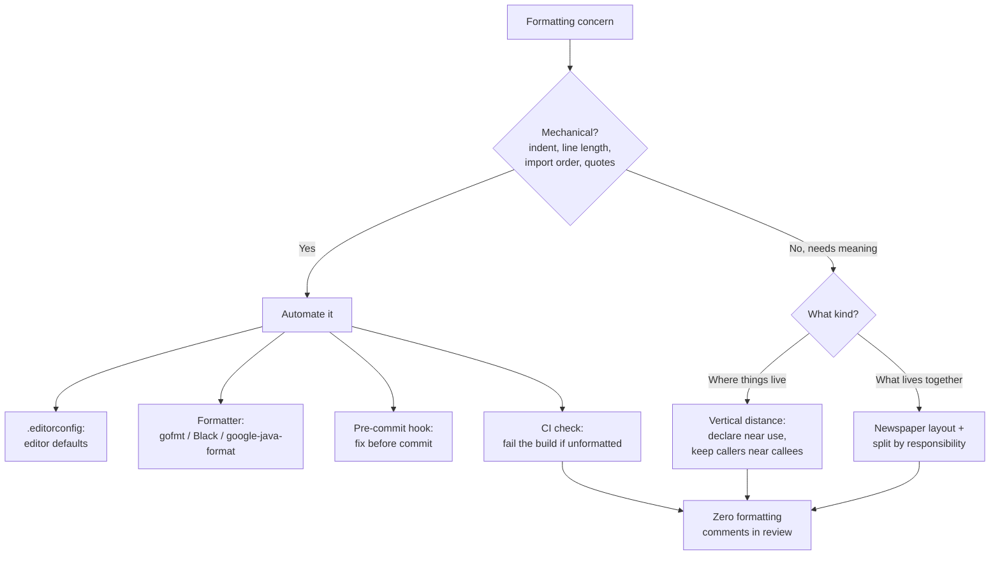
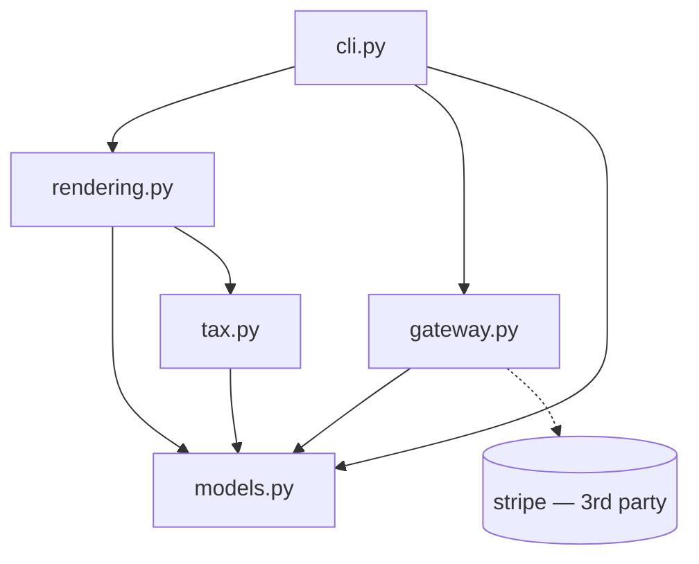
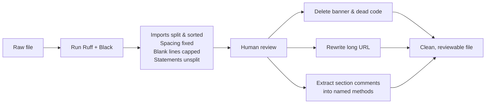

# Formatting — Practice Tasks

> 12 hands-on exercises on code formatting and the tooling that enforces it. Each task gives a scenario, a poorly-formatted snippet or a tooling situation (Go / Java / Python — varied), an instruction, then a collapsible solution with the fixed code or config and the reasoning behind it. Difficulty climbs from "reformat this paragraph" to "migrate a 200k-line repo without poisoning `git blame`."

---

## Table of Contents

1. [Task 1 — Vertical distance: move declarations to first use (Java) · Easy](#task-1--vertical-distance-move-declarations-to-first-use-java)
2. [Task 2 — Keep related functions adjacent (Python) · Easy](#task-2--keep-related-functions-adjacent-python)
3. [Task 3 — Break an over-long line idiomatically (Go) · Easy](#task-3--break-an-over-long-line-idiomatically-go)
4. [Task 4 — Remove magic vertical whitespace (Python) · Easy](#task-4--remove-magic-vertical-whitespace-python)
5. [Task 5 — Fix import ordering and grouping (Go) · Medium](#task-5--fix-import-ordering-and-grouping-go)
6. [Task 6 — Write an `.editorconfig` for a polyglot repo (Tooling) · Medium](#task-6--write-an-editorconfig-for-a-polyglot-repo-tooling)
7. [Task 7 — Add a pre-commit format hook (Tooling) · Medium](#task-7--add-a-pre-commit-format-hook-tooling)
8. [Task 8 — Configure a CI format check (Tooling) · Medium](#task-8--configure-a-ci-format-check-tooling)
9. [Task 9 — Newspaper layout: order a file top-down (Java) · Medium](#task-9--newspaper-layout-order-a-file-top-down-java)
10. [Task 10 — Split a 1000-line file by responsibility (Python) · Hard](#task-10--split-a-1000-line-file-by-responsibility-python)
11. [Task 11 — Repo-wide format migration with `.git-blame-ignore-revs` (Tooling) · Hard](#task-11--repo-wide-format-migration-with-git-blame-ignore-revs-tooling)
12. [Task 12 — Formatting audit: name every smell and its fix (Open-ended) · Hard](#task-12--formatting-audit-name-every-smell-and-its-fix-open-ended)

---

## How to Use

Formatting is the one quality dimension you should almost never argue about and almost always automate. These tasks split into two kinds:

- **Reformatting tasks** train your eye to see distance, density, and ordering — the things a formatter *cannot* fix because they require understanding meaning (where to declare a variable, which functions belong together, how to break a file apart).
- **Tooling tasks** train you to make the machine enforce the mechanical rules (indentation, line length, import order) so no human ever reviews them again.

For each task: read the scenario, try it yourself in an editor before opening the solution, then compare. For tooling tasks, actually run the tool — a config that "looks right" but fails to install is worthless. The decision flow below is the mental model the whole chapter builds toward.



---

## Task 1 — Vertical distance: move declarations to first use (Java)

**Difficulty:** Easy

**Scenario:** A teammate declares every local variable in a C89-style block at the top of the method, then uses them dozens of lines later. You have to scroll up to remember a variable's type and initial value every time you read it.

```java
public Report buildReport(List<Order> orders) {
    BigDecimal total;
    int count;
    Map<String, BigDecimal> byRegion;
    Report report;
    String header;

    header = "Quarterly Sales";

    count = orders.size();

    total = BigDecimal.ZERO;
    for (Order o : orders) {
        total = total.add(o.amount());
    }

    byRegion = new HashMap<>();
    for (Order o : orders) {
        byRegion.merge(o.region(), o.amount(), BigDecimal::add);
    }

    report = new Report(header, count, total, byRegion);
    return report;
}
```

**Instruction:** Reformat so each variable is declared at the point it is first assigned, with `final` where the value never changes. Do not change behavior.

<details><summary>Solution</summary>

```java
public Report buildReport(List<Order> orders) {
    final String header = "Quarterly Sales";
    final int count = orders.size();

    BigDecimal total = BigDecimal.ZERO;
    for (Order o : orders) {
        total = total.add(o.amount());
    }

    final Map<String, BigDecimal> byRegion = new HashMap<>();
    for (Order o : orders) {
        byRegion.merge(o.region(), o.amount(), BigDecimal::add);
    }

    return new Report(header, count, total, byRegion);
}
```

**Reasoning:** A variable's declaration is documentation about its scope and lifetime. When you declare it at first use, the reader sees the type, the initial value, and the first use in one glance — no scrolling, no holding five uninitialized names in working memory. The vertical distance between declaration and use should be as small as the language allows. `final` on the two genuinely-constant locals tells the reader "this never changes," shrinking the mental model further. The temporary `report` variable was inlined: it was assigned once and immediately returned, so it added a line without adding meaning.

</details>

---

## Task 2 — Keep related functions adjacent (Python)

**Difficulty:** Easy

**Scenario:** In a module, a public function calls two helpers, but the helpers were dropped at the top of the file in alphabetical order. To understand `publish`, you read it, jump up 90 lines to `_render`, jump up again to `_compress`, then come back down. The conceptual unit is scattered.

```python
# top of module

def _compress(data: bytes) -> bytes:
    return gzip.compress(data, compresslevel=6)


def _render(post: Post) -> bytes:
    html = TEMPLATE.format(title=post.title, body=post.body)
    return html.encode("utf-8")


# ... 90 unrelated lines ...


def publish(post: Post, bucket: Bucket) -> str:
    rendered = _render(post)
    payload = _compress(rendered)
    key = f"posts/{post.slug}.html.gz"
    bucket.put(key, payload)
    return key
```

**Instruction:** Reorder so the caller and its private helpers form one contiguous block, caller first.

<details><summary>Solution</summary>

```python
def publish(post: Post, bucket: Bucket) -> str:
    rendered = _render(post)
    payload = _compress(rendered)
    key = f"posts/{post.slug}.html.gz"
    bucket.put(key, payload)
    return key


def _render(post: Post) -> bytes:
    html = TEMPLATE.format(title=post.title, body=post.body)
    return html.encode("utf-8")


def _compress(data: bytes) -> bytes:
    return gzip.compress(data, compresslevel=6)


# ... unrelated functions live below, in their own groups ...
```

**Reasoning:** Functions that call each other should be vertically close, and the caller should appear *before* the callee — this is the "newspaper" reading order. Conceptual affinity drives ordering, not alphabetization (that is what your editor's symbol search is for). A reader who lands on `publish` can keep reading downward and meet `_render` and `_compress` in the order they are invoked, never needing to scroll up. Alphabetical ordering optimizes for a lookup pattern that tooling already solves, at the cost of the linear-reading pattern that humans actually use.

</details>

---

## Task 3 — Break an over-long line idiomatically (Go)

**Difficulty:** Easy

**Scenario:** A line in a Go file is 180 characters wide. It forces horizontal scrolling in side-by-side diffs and code review. `gofmt` does not wrap it for you (Go has no line-length rule), so you must break it by hand — and there is a right and a wrong way.

```go
result, err := client.Do(ctx, &Request{Method: "POST", URL: endpoint, Body: payload, Headers: map[string]string{"Authorization": "Bearer " + token, "Content-Type": "application/json"}, Timeout: 30 * time.Second})
```

**Instruction:** Break this into a readable form that `gofmt` keeps stable (running `gofmt` must not re-flow it). Vary nothing about behavior.

<details><summary>Solution</summary>

```go
req := &Request{
    Method: "POST",
    URL:    endpoint,
    Body:   payload,
    Headers: map[string]string{
        "Authorization": "Bearer " + token,
        "Content-Type":  "application/json",
    },
    Timeout: 30 * time.Second,
}

result, err := client.Do(ctx, req)
```

**Reasoning:** The fix is not "insert backslashes until it fits" — it is to give the composite literal vertical structure. A trailing comma after the last field in a multi-line composite literal is required by `gofmt` and is what makes the layout *stable*: `gofmt` will keep each field on its own line instead of collapsing them back. Extracting the `Request` into its own variable also separates construction (building the request) from the call (sending it), so each line states one idea. Because Go is column-aligned by `gofmt`, the field names line up automatically once they are on separate lines. The general rule: when a line is too long, look for a structure inside it (a literal, an argument list, a chain) and explode *that*, rather than wrapping mid-expression.

</details>

---

## Task 4 — Remove magic vertical whitespace (Python)

**Difficulty:** Easy

**Scenario:** A colleague has read somewhere that "code needs room to breathe" and inserted blank lines between nearly every statement, including inside tightly-coupled sequences. The function is now 40 lines tall but does the work of 15.

```python
def normalize_user(raw):

    user = {}

    user["id"] = raw["id"]

    user["email"] = raw["email"].strip().lower()


    first = raw.get("first_name", "").strip()

    last = raw.get("last_name", "").strip()

    user["name"] = f"{first} {last}".strip()


    user["active"] = bool(raw.get("active", True))


    return user
```

**Instruction:** Use blank lines deliberately — to separate *groups* of related statements — and remove the rest.

<details><summary>Solution</summary>

```python
def normalize_user(raw):
    user = {
        "id": raw["id"],
        "email": raw["email"].strip().lower(),
    }

    first = raw.get("first_name", "").strip()
    last = raw.get("last_name", "").strip()
    user["name"] = f"{first} {last}".strip()

    user["active"] = bool(raw.get("active", True))
    return user
```

**Reasoning:** Blank lines are punctuation, not decoration. A blank line says "a new thought starts here." When every statement is separated by a blank line, the separators carry no information — the reader cannot tell which statements form a group because *everything* is spaced apart equally. Here there are exactly three thoughts: build the core identity, derive the display name, set the flag and return. One blank line between each makes that structure visible. The identity fields were also merged into a single dict literal because they are one assignment, not three. Inside a coherent group there should be *no* blank lines; between groups there should be exactly one.

</details>

---

## Task 5 — Fix import ordering and grouping (Go)

**Difficulty:** Medium

**Scenario:** A Go file has imports in a single jumbled block — standard library, third-party, and internal packages all mixed, some unused, the order arbitrary. `goimports` exists precisely to fix this, but you should also understand the convention it enforces.

```go
import (
    "github.com/acme/shop/internal/cart"
    "fmt"
    "encoding/json"
    "github.com/redis/go-redis/v9"
    "github.com/acme/shop/internal/catalog"
    "context"
    "strings"
)
```

**Instruction:** Reorganize into the idiomatic three-group form. State the command that does this automatically.

<details><summary>Solution</summary>

```go
import (
    "context"
    "encoding/json"
    "fmt"
    "strings"

    "github.com/redis/go-redis/v9"

    "github.com/acme/shop/internal/cart"
    "github.com/acme/shop/internal/catalog"
)
```

Run it automatically with:

```bash
# Format imports for the whole module, grouping local packages last.
goimports -local github.com/acme/shop -w ./...
```

**Reasoning:** The Go community convention (enforced by `goimports`) is three alphabetically-sorted groups separated by blank lines: standard library, then third-party, then your own module's packages. The grouping encodes dependency layering — a reader instantly sees "this file pulls in one external dependency (Redis) and two of our own packages." The `-local` flag tells `goimports` which prefix is "ours" so internal packages sort into the third group instead of mixing with third-party ones. `goimports` also *removes unused imports and adds missing ones*, so it does more than `gofmt`; this is why most Go shops run `goimports` in their format step rather than `gofmt` alone. Doing this by hand is fine to learn the rule, but in practice you never touch import blocks manually — the tool owns them.

</details>

---

## Task 6 — Write an `.editorconfig` for a polyglot repo (Tooling)

**Difficulty:** Medium

**Scenario:** A repository contains Go, Python, JavaScript, Makefiles, and YAML. Contributors use VS Code, GoLand, Vim, and Neovim. Pull requests keep arriving with mixed tabs/spaces and trailing whitespace because everyone's editor defaults differ. You want every editor to agree on the basics *before* a formatter ever runs.

**Instruction:** Write a `.editorconfig` at the repo root that sets sane, language-aware defaults. Explain why this is the first line of defense, not the last.

<details><summary>Solution</summary>

`.editorconfig`:

```ini
# EditorConfig is the single source of truth for editor defaults.
# Docs: https://editorconfig.org
root = true

[*]
charset = utf-8
end_of_line = lf
insert_final_newline = true
trim_trailing_whitespace = true
indent_style = space
indent_size = 4

# Go uses tabs by convention (gofmt enforces this).
[*.go]
indent_style = tab

# Makefiles REQUIRE real tabs for recipe lines.
[Makefile]
indent_style = tab

[*.{js,jsx,ts,tsx,json,yml,yaml}]
indent_size = 2

# Markdown: trailing whitespace can be a hard line break, so don't strip it.
[*.md]
trim_trailing_whitespace = false
```

**Reasoning:** `.editorconfig` is honored natively by most editors (and via a plugin in the rest), so it normalizes the mechanical settings — charset, line endings, indentation, final newline, trailing whitespace — *at the moment the developer types*, before any commit. That is why it is the first line of defense: it prevents the noise from entering the working tree at all. Three details matter here. (1) Go is set to tabs because `gofmt` mandates tabs; an editor inserting spaces would just be undone by the formatter and create churn. (2) Makefile recipes are tab-significant in the *language* — spaces there cause `make` to fail, so this is a correctness rule, not a style one. (3) Markdown disables trailing-whitespace trimming because two trailing spaces are a hard line break in Markdown. `.editorconfig` does **not** replace a formatter: it covers indentation and whitespace, but it cannot reorder imports, wrap long lines, or normalize quote style. It is the floor; the formatter and CI check are the walls.

</details>

---

## Task 7 — Add a pre-commit format hook (Tooling)

**Difficulty:** Medium

**Scenario:** Even with `.editorconfig`, unformatted Python keeps landing on `main` because not everyone runs the formatter before committing. You want commits to be auto-formatted (or rejected) locally, so the CI format check almost never fails.

**Instruction:** Configure the [`pre-commit`](https://pre-commit.com) framework to run Black and Ruff on every commit. Provide the config and the install commands.

<details><summary>Solution</summary>

`.pre-commit-config.yaml`:

```yaml
# Run hooks against staged files on every `git commit`.
# Install once with:  pre-commit install
repos:
  - repo: https://github.com/psf/black
    rev: 24.4.2
    hooks:
      - id: black

  - repo: https://github.com/astral-sh/ruff-pre-commit
    rev: v0.4.4
    hooks:
      # Lint and auto-fix what is safe (includes import sorting).
      - id: ruff
        args: [--fix]
      # Ruff's formatter — keep it after the linter.
      - id: ruff-format

  - repo: https://github.com/pre-commit/pre-commit-hooks
    rev: v4.6.0
    hooks:
      - id: trailing-whitespace
      - id: end-of-file-fixer
      - id: check-merge-conflict
```

Set it up:

```bash
pip install pre-commit
pre-commit install            # installs the git hook into .git/hooks/pre-commit
pre-commit run --all-files    # format the whole repo once, right now
```

**Reasoning:** `pre-commit install` writes a git hook that runs the configured tools against *staged* files before the commit is created. If a hook rewrites a file (Black reformatting, Ruff `--fix`), the commit aborts and you re-stage — so unformatted code physically cannot be committed. Pinning each hook to an exact `rev` is critical: it means every contributor runs the *same* formatter version, which avoids the "works on my machine, reformatted on yours" thrash where two Black versions disagree. Ordering matters too — run the linter's autofix before the formatter so the formatter has the final say on layout. The hook is a fast local gate; it does not *replace* the CI check (a contributor can `git commit --no-verify` to bypass it), which is why Task 8 still exists. The two layers together mean the CI check is a backstop that almost never actually fires.

</details>

---

## Task 8 — Configure a CI format check (Tooling)

**Difficulty:** Medium

**Scenario:** Local hooks can be skipped with `--no-verify`. You need an authoritative gate: the build fails if any file is not formatted, with no exceptions and no human judgment involved. This is for a Go service on GitHub Actions.

**Instruction:** Write a GitHub Actions job that fails when code is not `gofmt`-clean, printing exactly which files are wrong. Do **not** auto-fix in CI — only verify.

<details><summary>Solution</summary>

`.github/workflows/format.yml`:

```yaml
name: format
on: [push, pull_request]

jobs:
  gofmt:
    runs-on: ubuntu-latest
    steps:
      - uses: actions/checkout@v4

      - uses: actions/setup-go@v5
        with:
          go-version: "1.22"

      - name: Check formatting
        run: |
          # gofmt -l lists files that are NOT formatted. Empty output == clean.
          unformatted="$(gofmt -l .)"
          if [ -n "$unformatted" ]; then
            echo "These files are not gofmt-clean:"
            echo "$unformatted"
            echo "Run: gofmt -w ."
            exit 1
          fi
```

**Reasoning:** `gofmt -l` prints the *names* of files that differ from formatted output and prints nothing when everything is clean. The shell guard turns "non-empty list" into a non-zero exit code, which fails the job. The job deliberately does **not** run `gofmt -w` to fix files: CI should *verify*, never mutate the contributor's branch — auto-committing from CI surprises people, fights with their local state, and hides the problem instead of teaching them to run the formatter. The error message tells the contributor exactly how to fix it (`gofmt -w .`), turning a red build into a one-command remedy. This is the authoritative gate: because it runs on the server and cannot be bypassed with `--no-verify`, "is the code formatted?" stops being a question anyone asks in code review. Reviewers spend their attention on logic, not whitespace.

</details>

---

## Task 9 — Newspaper layout: order a file top-down (Java)

**Difficulty:** Medium

**Scenario:** A small class compiles fine but reads backwards: low-level helpers are at the top and the public entry point is buried at the bottom. A new reader has to scroll to the end to find where the story even begins.

```java
class CsvExporter {

    private String escape(String field) {
        if (field.contains(",") || field.contains("\"")) {
            return "\"" + field.replace("\"", "\"\"") + "\"";
        }
        return field;
    }

    private String row(Record r) {
        return String.join(",", escape(r.name()), escape(r.email()));
    }

    private String header() {
        return "name,email";
    }

    public String export(List<Record> records) {
        StringBuilder sb = new StringBuilder(header()).append("\n");
        for (Record r : records) {
            sb.append(row(r)).append("\n");
        }
        return sb.toString();
    }
}
```

**Instruction:** Reorder the methods into newspaper layout — the high-level public method first, then helpers in the order they are called, most detailed last.

<details><summary>Solution</summary>

```java
class CsvExporter {

    public String export(List<Record> records) {
        StringBuilder sb = new StringBuilder(header()).append("\n");
        for (Record r : records) {
            sb.append(row(r)).append("\n");
        }
        return sb.toString();
    }

    private String header() {
        return "name,email";
    }

    private String row(Record r) {
        return String.join(",", escape(r.name()), escape(r.email()));
    }

    private String escape(String field) {
        if (field.contains(",") || field.contains("\"")) {
            return "\"" + field.replace("\"", "\"\"") + "\"";
        }
        return field;
    }
}
```

**Reasoning:** A source file should read like a newspaper article: the headline and the gist at the top, details increasing as you descend. `export` is the headline — it tells you the file produces a header plus one row per record. Reading downward, you meet `header`, then `row`, then the lowest-level detail `escape`, in exactly the order `export` invokes them. The reader who only needs the high-level "what" stops after the first method; the reader who needs the "how" of escaping keeps scrolling to the bottom. Function call depth maps to vertical position. This ordering is a pure formatting change — no behavior, no signatures, no logic moved — yet it changes the file from "decode bottom-up" to "read top-down."

</details>

---

## Task 10 — Split a 1000-line file by responsibility (Python)

**Difficulty:** Hard

**Scenario:** `billing.py` has grown to ~1000 lines. It contains data models, tax-rate lookups, invoice rendering, a Stripe gateway client, and a CLI entry point — five unrelated reasons to change, all in one file. Every merge conflicts; every reader is lost. You need to split it by responsibility into a package.

Current shape (abridged):

```python
# billing.py  (~1000 lines)

import dataclasses, datetime, decimal, json, sys
import stripe   # third-party

# --- data models (~120 lines) ---
@dataclasses.dataclass
class LineItem: ...
@dataclasses.dataclass
class Invoice: ...

# --- tax tables and lookup (~200 lines) ---
US_STATE_RATES = { ... }
def tax_rate_for(state: str) -> decimal.Decimal: ...

# --- rendering to HTML/PDF (~250 lines) ---
def render_invoice_html(inv: Invoice) -> str: ...
def render_invoice_pdf(inv: Invoice, path: str) -> None: ...

# --- payment gateway (~300 lines) ---
def charge(invoice: Invoice, token: str) -> str: ...
def refund(charge_id: str, amount) -> None: ...

# --- CLI (~130 lines) ---
def main(argv): ...
if __name__ == "__main__":
    main(sys.argv)
```

**Instruction:** Propose the target package layout and show the resulting import graph. State the principle that decides where each thing lands, and one concrete pitfall to avoid during the split.

<details><summary>Solution</summary>

Target layout — turn the module into a package, one file per reason-to-change:

```
billing/
├── __init__.py        # re-exports the public API: Invoice, LineItem, charge, ...
├── models.py          # LineItem, Invoice          (data, no behavior dependencies)
├── tax.py             # US_STATE_RATES, tax_rate_for
├── rendering.py       # render_invoice_html, render_invoice_pdf
├── gateway.py         # charge, refund  (wraps stripe)
└── cli.py             # main(argv); the only file that imports sys/argparse
```

Resulting import graph (arrows = "imports / depends on"):



`__init__.py` keeps the public surface stable so callers don't break:

```python
from .models import Invoice, LineItem
from .tax import tax_rate_for
from .rendering import render_invoice_html, render_invoice_pdf
from .gateway import charge, refund

__all__ = [
    "Invoice", "LineItem", "tax_rate_for",
    "render_invoice_html", "render_invoice_pdf", "charge", "refund",
]
```

**Reasoning:** The deciding principle is the Single Responsibility Principle applied at file granularity: each file should have exactly one reason to change. Tax rates change when legislation changes; the gateway changes when Stripe's SDK changes; rendering changes when the invoice template changes — these are independent forces, so they belong in independent files. The import graph stays acyclic with `models.py` at the bottom (pure data, depends on nothing internal) and `cli.py` at the top (the composition root, depends on everything). When you see arrows only flowing *downward* toward `models`, you know the layering is clean. **The pitfall to avoid:** breaking the public import path. Code elsewhere does `from billing import charge`; if you just shatter the module, every one of those imports breaks at once. Re-exporting the public names from `__init__.py` keeps `from billing import charge` working unchanged, so the split is internal-only and callers never notice. Do the move with `git mv` where possible and split in small commits so `git blame` and review stay legible. See also [`../../refactoring/README.md`](../../refactoring/README.md) for the mechanics of Extract Class / Move Method that underpin this split.

</details>

---

## Task 11 — Repo-wide format migration with `.git-blame-ignore-revs` (Tooling)

**Difficulty:** Hard

**Scenario:** A 200k-line Python repo has never had a formatter. You're introducing Black. Running `black .` will touch nearly every file in one giant commit — which would make that commit the "last author" of every line in `git blame`, destroying the history that tells you *why* code exists. You must do the migration without poisoning blame.

**Instruction:** Lay out the full migration: the formatting commit, the `.git-blame-ignore-revs` file, the git config that wires it up, and the CI/hook safeguards that keep the repo formatted afterward.

<details><summary>Solution</summary>

**Step 1 — Make a single, isolated, formatting-only commit.** Nothing but formatting in it.

```bash
git switch -c chore/format-with-black
black .
git add -A
git commit -m "style: format entire repo with Black (no behavior change)"
```

**Step 2 — Record that commit's SHA so blame can skip it.** Create `.git-blame-ignore-revs` at the repo root:

```
# Revisions that only reformatted code — ignored by `git blame`.
# Add an entry for every future bulk-format commit, newest at the bottom.
#
# style: format entire repo with Black
a1b2c3d4e5f6a7b8c9d0e1f2a3b4c5d6e7f8a9b0
```

**Step 3 — Wire it into git locally and tell contributors to do the same.**

```bash
git config blame.ignoreRevsFile .git-blame-ignore-revs
```

GitHub, GitLab, and Bitbucket read `.git-blame-ignore-revs` automatically in their web blame views, so once the file is committed, blame is fixed for everyone on the platform; the `git config` line fixes local `git blame` for each developer.

**Step 4 — Keep it formatted from now on.** Add the pre-commit hook (Task 7) and the CI check (Task 8, Black variant):

```yaml
# .github/workflows/format.yml  (excerpt)
      - name: Check formatting
        run: black --check --diff .
```

**Reasoning:** A bulk reformatting commit is unavoidable noise — but it is *pure* noise, and the goal is to make tooling treat it as such. The cardinal rule is **keep the format commit free of any logic change**: if you reformat *and* fix a bug in the same commit, no one can ignore that commit in blame without losing the bug's history, and the diff is unreviewable. With the formatting isolated, `.git-blame-ignore-revs` lists its SHA, and `git blame` (and the major hosting providers) skips straight past it to the commit that last *meaningfully* touched each line — so `git blame` still answers "why is this line here?" correctly. `blame.ignoreRevsFile` is the local config that activates the file; committing the file makes the web UIs honor it without any per-user setup. Finally, the migration only pays off if the repo stays formatted, so the same commit (or its PR) lands the pre-commit hook and the `black --check` CI gate. `--check --diff` makes CI verify without mutating, printing the exact diff a contributor needs to apply — the verify-don't-fix discipline from Task 8.

</details>

---

## Task 12 — Formatting audit: name every smell and its fix (Open-ended)

**Difficulty:** Hard

**Scenario:** Below is a real-looking Python file fragment. List **every formatting smell** you can find and write a one-line fix for each. This rehearses reading code for layout the way you'd read it in review.

```python
import os, sys, json
from .models import Invoice
import requests


#==============================================================
#                        INVOICE  SERVICE
#==============================================================
class InvoiceService:
    def __init__(self,db,cache,mailer,logger,retries,timeout,base_url):
        self.db=db; self.cache=cache; self.mailer=mailer
        self.logger=logger; self.retries=retries
        self.timeout=timeout; self.base_url=base_url

    def send(self, invoice):
        # ----- validate -----
        if not invoice: return

        # ----- build -----
        url = self.base_url + "/invoices/" + str(invoice.id) + "/send?notify=true&format=pdf&copy_to_billing=true&include_history=false"


        # ----- send -----

        r = requests.post(url, timeout=self.timeout)


        return r.status_code
    # def old_send(self, invoice):
    #     url = self.base_url + "/v1/send"
    #     return requests.post(url).status_code
```

**Instruction:** Produce a table of smell → location → fix, then state which fixes a formatter does automatically and which require a human.

<details><summary>Solution</summary>

| Smell | Location | Fix |
|---|---|---|
| Multiple imports on one line | `import os, sys, json` | One import per line; let `ruff`/`isort` sort and group them (stdlib, third-party, local). |
| Import ordering / grouping wrong | top block | `requests` (third-party) should sit between stdlib and local `.models`, with blank-line groups. |
| Excess blank lines | 3 lines before the banner, 3 after `requests.post` | Collapse to a single blank line between groups; Black caps module-level gaps at 2 and in-function gaps at 1. |
| ASCII-art banner comment | `#====` block | Delete it; the `class InvoiceService:` line already names the section. Banners rot and add nothing. |
| Magic whitespace in name | `INVOICE  SERVICE` (double space) | Irrelevant once the banner is deleted; never encode emphasis in whitespace. |
| Missing spaces around operators / after commas | `def __init__(self,db,cache,...)`, `self.db=db` | `db, cache, ...` and `self.db = db`; Black inserts the spaces. |
| Multiple statements per line with `;` | `self.db=db; self.cache=cache; ...` | One statement per line; Black splits them. |
| Compound statement on one line | `if not invoice: return` | Put `return` on its own indented line; Black expands it. |
| Over-long URL line (>120 chars) | the `url = ...` concatenation | Build the query with `urllib.parse.urlencode`/`params=` and an f-string; human decides the idiom. |
| Section comments substituting for functions | `# ----- validate/build/send -----` | Extract `_validate`, `_build_url`, `_post` methods; the method names replace the comments. |
| Commented-out dead code | `# def old_send...` | Delete it; git history is the archive. |

Which the **formatter** fixes automatically (Black + Ruff): one-import-per-line is Ruff, import grouping/sorting is Ruff/isort, excess blank lines, operator/comma spacing, `;`-split statements, and `if x: return` expansion are all Black. Which require a **human**: deleting the banner and the commented-out `old_send` (a formatter won't delete comments), rewriting the long URL into `urlencode`/`params`, and extracting the `# ----- ... -----` sections into named methods (that is refactoring, which changes structure, not just layout).



**Reasoning:** The audit makes the chapter's central split concrete. Roughly two-thirds of these smells are mechanical and vanish the instant a formatter runs — which is exactly why you should never *spend review attention* on them; automate them away with the hook and CI gate from Tasks 7–8. The remaining third — dead comments, an awkward long line, comment-as-section-header — require human judgment because they involve *meaning and structure*, not layout. A formatter will happily keep your dead code beautifully indented forever. Recognizing which bucket each smell falls into is the skill: it tells you whether the answer is "configure a tool" or "actually think." For the structural extractions, see [`../../refactoring/README.md`](../../refactoring/README.md).

</details>

---

## Self-Assessment

Rate yourself on each. You have mastered this chapter when you can answer **yes** to all of them:

- [ ] **Task 1–2:** Can you spot a variable declared far from its use, or a helper marooned away from its caller, and explain *why* the distance hurts a reader?
- [ ] **Task 3:** Given an over-long line, do you instinctively look for the structure *inside* it to explode, rather than wrapping mid-expression?
- [ ] **Task 4:** Can you articulate that a blank line is punctuation — "a new thought" — and that uniform spacing carries zero information?
- [ ] **Task 5:** Do you know the three-group import convention and the one command that enforces it for your language?
- [ ] **Task 6:** Can you write an `.editorconfig` from memory, including the Go-tabs and Makefile-tabs special cases, and explain why it is the floor and not the whole solution?
- [ ] **Task 7:** Can you set up a pinned pre-commit hook and explain why pinning the version prevents cross-machine thrash?
- [ ] **Task 8:** Can you write a CI check that *verifies without mutating*, and explain why CI must never auto-fix?
- [ ] **Task 9:** Do you order a file top-down (newspaper layout), public entry point first, details descending?
- [ ] **Task 10:** Given a 1000-line file, can you name the responsibilities, draw the acyclic import graph, and split it without breaking the public import path?
- [ ] **Task 11:** Can you run a repo-wide format migration that keeps `git blame` meaningful via an isolated commit and `.git-blame-ignore-revs`?
- [ ] **Task 12:** Can you look at any file and instantly sort its formatting issues into "the tool fixes this" vs "a human must decide"?

If any box is unchecked, revisit that task and try it in a real editor and a real repo — formatting is muscle memory, not trivia.

---

## Related Topics

- [`README.md`](../README.md) — the positive formatting rules this chapter's tasks exercise.
- [`junior.md`](junior.md) — beginner-level definitions of vertical and horizontal formatting.
- [`find-bug.md`](find-bug.md) — snippets where bad formatting hides a real defect.
- [`optimize.md`](optimize.md) — tightening formatting and layout on working code.
- [`../../refactoring/README.md`](../../refactoring/README.md) — Extract Method / Extract Class / Move Method, the structural moves behind Tasks 9–12.
