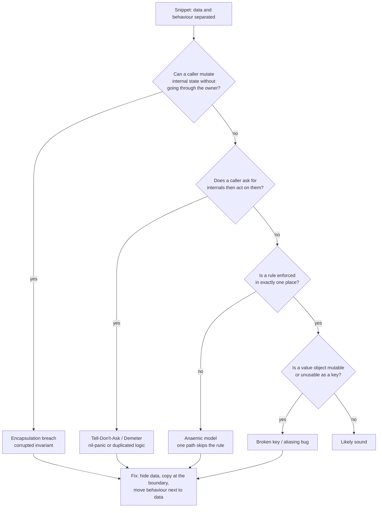

# Objects & Data Structures — Find the Bug

> 12 snippets where poor object/data design — leaked internals, Demeter chains, anaemic models, mutable value objects, type switches — produces a *real* bug, not just an ugly smell. Find the bug first; then notice that the design flaw is what made it possible. The fix is almost always structural: move behaviour next to data, hide the data, or make illegal states unrepresentable.

The recurring theme of this chapter: **a smell is a warning, but here the smell already detonated.** Each snippet ships a defect to production. Train yourself to see the design flaw *as* the bug, not as a separate code-review nicety.

---

## Table of Contents

1. [Snippet 1 — Returning the internal slice (Go)](#snippet-1--returning-the-internal-slice-go)
2. [Snippet 2 — Demeter chain nil-panic (Go)](#snippet-2--demeter-chain-nil-panic-go)
3. [Snippet 3 — Tell-Don't-Ask: two callers, two answers (Java)](#snippet-3--tell-dont-ask-two-callers-two-answers-java)
4. [Snippet 4 — Anaemic model skips validation on one path (Python)](#snippet-4--anaemic-model-skips-validation-on-one-path-python)
5. [Snippet 5 — Mutable value object breaks as a map key (Java)](#snippet-5--mutable-value-object-breaks-as-a-map-key-java)
6. [Snippet 6 — Type switch silently no-ops for a new subtype (Go)](#snippet-6--type-switch-silently-no-ops-for-a-new-subtype-go)
7. [Snippet 7 — Forgotten defensive copy aliases shared state (Python)](#snippet-7--forgotten-defensive-copy-aliases-shared-state-python)
8. [Snippet 8 — Getter exposes mutable internal map (Java)](#snippet-8--getter-exposes-mutable-internal-map-java)
9. [Snippet 9 — Hybrid object: half data, half behaviour (Python)](#snippet-9--hybrid-object-half-data-half-behaviour-python)
10. [Snippet 10 — Demeter setter writes through a shared object (Java)](#snippet-10--demeter-setter-writes-through-a-shared-object-java)
11. [Snippet 11 — Value equality without a usable map key (Go)](#snippet-11--value-equality-without-a-usable-map-key-go)
12. [Snippet 12 — Anaemic model lets an invariant drift (Java)](#snippet-12--anaemic-model-lets-an-invariant-drift-java)

---

## How to Use

For each snippet:

1. Read the code and the call site. **Do not scroll to the answer yet.**
2. Ask the three diagnostic questions for this chapter:
   - *Who owns this data, and can a caller reach in and change it behind the owner's back?*
   - *If I ask an object for a piece of its guts and then act on it, what happens when those guts are missing, shared, or stale?*
   - *Is a rule (validation, derivation, invariant) enforced in exactly one place, or copied across call sites?*
3. State the **design flaw**, the **concrete bug it causes**, and the **fix** in one sentence each.
4. Open the answer and compare.

Difficulty is marked ★ (warm-up) to ★★★ (subtle; senior reviewers miss it under time pressure).



---

### Snippet 1 — Returning the internal slice (Go)

**Difficulty: ★**

```go
package cart

type Cart struct {
    items []LineItem
}

func NewCart() *Cart {
    return &Cart{items: []LineItem{}}
}

func (c *Cart) Add(item LineItem) {
    c.items = append(c.items, item)
}

// Items returns the cart's line items.
func (c *Cart) Items() []LineItem {
    return c.items
}
```

```go
// Caller — a "read-only" reporting function:
func logCart(c *Cart) {
    items := c.Items()
    // Sort a copy for display... or so the author thinks.
    sort.Slice(items, func(i, j int) bool {
        return items[i].Price.Less(items[j].Price)
    })
    for _, it := range items {
        log.Printf("%s x%d", it.SKU, it.Qty)
    }
}
```

**What's wrong?**

<details><summary>Answer</summary>

**Design flaw:** `Items()` returns the *same backing slice* the `Cart` stores. In Go a slice is a header (pointer, len, cap) — returning it hands the caller a window onto the cart's private array. Encapsulation is breached even though `items` is unexported.

**Concrete bug:** `sort.Slice` sorts **in place**. The "read-only" `logCart` reorders the cart's own line items. Any code that later relies on insertion order — "the promotion applies to the first item," or an audit log that expects chronological order — now sees a price-sorted cart. A function with no apparent side effect has one. That is the worst kind of bug to track down.

It gets worse with `append`. If a caller does `items := c.Items(); items = append(items, x)` and the slice still has spare capacity, the append writes into the cart's backing array, corrupting a slot the cart never authorized. If capacity is exhausted, append reallocates and the caller's change is *invisible* to the cart. Identical call, two different behaviours depending on `cap` — nondeterministic from the caller's point of view.

**Fix:** return a defensive copy. The cart owns its items; readers get a snapshot.

```go
func (c *Cart) Items() []LineItem {
    out := make([]LineItem, len(c.items))
    copy(out, c.items)
    return out
}
```

Better still, don't expose the collection at all — expose the *operations* callers actually need (`Total()`, `Count()`, `ForEach(fn)`), following Tell-Don't-Ask. If a caller only wants to log, give it `func (c *Cart) Describe() string` and never leak the slice.
</details>

---

### Snippet 2 — Demeter chain nil-panic (Go)

**Difficulty: ★★**

```go
type Order struct {
    Customer *Customer
}

type Customer struct {
    Account *Account
}

type Account struct {
    BillingAddress *Address
}

type Address struct {
    Country string
}

func taxRate(o *Order) float64 {
    country := o.Customer.Account.BillingAddress.Country
    switch country {
    case "US":
        return 0.0
    case "DE", "FR", "IT":
        return 0.19
    default:
        return 0.10
    }
}
```

```go
// Guest checkout: no account yet, billing collected later.
guestOrder := &Order{
    Customer: &Customer{Account: nil},
}
rate := taxRate(guestOrder) // boom
```

**What's wrong?**

<details><summary>Answer</summary>

**Design flaw:** the train wreck `o.Customer.Account.BillingAddress.Country` asks four objects deep for one fact. `taxRate` knows the entire object graph and assumes every link is non-nil. This is a Law of Demeter violation: the function couples to `Order`, `Customer`, `Account`, *and* `Address` even though it only wants a country code.

**Concrete bug:** a guest order has `Account == nil`. Dereferencing `o.Customer.Account.BillingAddress` panics with `invalid memory address or nil pointer dereference` at runtime. The chain has *three* nilable hops (`Customer`, `Account`, `BillingAddress`) and the code guards none of them. Every new caller is a new place this can crash.

**Fix:** push the decision down to where the data lives, so there's exactly one place that handles "no billing country yet." Give the aggregate a method that answers the *question* rather than exposing the *next link*.

```go
func (o *Order) BillingCountry() (string, bool) {
    if o.Customer == nil ||
        o.Customer.Account == nil ||
        o.Customer.Account.BillingAddress == nil {
        return "", false
    }
    return o.Customer.Account.BillingAddress.Country, true
}

func taxRate(o *Order) float64 {
    country, ok := o.BillingCountry()
    if !ok {
        return defaultRate // explicit policy, no panic
    }
    return rateFor(country)
}
```

The nil-handling now lives in one method instead of being re-derived (and forgotten) at every call site. The smell — the chain — *was* the bug: each `.` was an unchecked nil hop.
</details>

---

### Snippet 3 — Tell-Don't-Ask: two callers, two answers (Java)

**Difficulty: ★★★**

```java
public class ShoppingCart {
    private final List<LineItem> items = new ArrayList<>();
    private BigDecimal discountRate = BigDecimal.ZERO; // e.g. 0.10 = 10% off

    public List<LineItem> getItems() { return items; }
    public BigDecimal getDiscountRate() { return discountRate; }
    public void setDiscountRate(BigDecimal r) { this.discountRate = r; }
}
```

```java
// Caller A — the checkout screen, computes the order total:
BigDecimal subtotal = BigDecimal.ZERO;
for (LineItem item : cart.getItems()) {
    subtotal = subtotal.add(item.getPrice().multiply(BigDecimal.valueOf(item.getQty())));
}
BigDecimal total = subtotal.subtract(subtotal.multiply(cart.getDiscountRate()));
// total = subtotal * (1 - rate), with HALF_UP rounding applied once at the end

// Caller B — the invoice PDF generator (written by a different team):
BigDecimal sum = BigDecimal.ZERO;
for (LineItem item : cart.getItems()) {
    BigDecimal line = item.getPrice().multiply(BigDecimal.valueOf(item.getQty()));
    line = line.subtract(line.multiply(cart.getDiscountRate())); // discount each line
    sum = sum.add(line.setScale(2, RoundingMode.HALF_UP));       // round per line
}
// sum = Σ round(linePrice * (1 - rate))
```

**What's wrong?**

<details><summary>Answer</summary>

**Design flaw:** `ShoppingCart` is anaemic. It exposes its data (`getItems`, `getDiscountRate`) and lets *every caller* compute the derived value "total after discount" itself. The class never owns the one piece of logic that matters most about it. This is a textbook **Ask** instead of **Tell**.

**Concrete bug:** the two callers compute *different totals* for the same cart. Caller A applies the discount to the subtotal and rounds **once** at the end. Caller B applies the discount **per line** and rounds **per line**. With per-line rounding, the sum of rounded lines does not equal the rounded sum — they diverge by up to a cent per line. On a 40-line wholesale invoice that is routinely a 10-to-30-cent mismatch.

The visible symptom: the checkout screen charges the customer one amount, and the PDF invoice they download shows a *different* amount. Finance reconciliation fails; support tickets pile up; nobody can reproduce it because it depends on how many lines round in which direction. This is a real, recurring class of production bug, and its root cause is purely that the total was computed in two places.

**Fix:** Tell-Don't-Ask. The cart owns its total. There is exactly one definition.

```java
public class ShoppingCart {
    private final List<LineItem> items = new ArrayList<>();
    private BigDecimal discountRate = BigDecimal.ZERO;

    public Money total() {
        BigDecimal subtotal = items.stream()
            .map(i -> i.getPrice().multiply(BigDecimal.valueOf(i.getQty())))
            .reduce(BigDecimal.ZERO, BigDecimal::add);
        BigDecimal discounted = subtotal.multiply(BigDecimal.ONE.subtract(discountRate));
        return Money.of(discounted.setScale(2, RoundingMode.HALF_UP)); // rounded once, here
    }
}
```

Both callers now call `cart.total()`. They *cannot* disagree, because there is nothing left to reimplement. The duplicated derivation — invited by the getters — was the bug.
</details>

---

### Snippet 4 — Anaemic model skips validation on one path (Python)

**Difficulty: ★★**

```python
class User:
    def __init__(self, email: str, age: int):
        self.email = email
        self.age = age


def register_user(email: str, age: int) -> User:
    if "@" not in email:
        raise ValueError("invalid email")
    if age < 13:
        raise ValueError("must be 13 or older")
    user = User(email, age)
    db.insert(user)
    return user


def import_users_from_csv(path: str) -> list[User]:
    users = []
    for row in csv.DictReader(open(path)):
        user = User(row["email"], int(row["age"]))  # bulk path
        db.insert(user)
        users.append(user)
    return users
```

**What's wrong?**

<details><summary>Answer</summary>

**Design flaw:** `User` is an anaemic data holder — its `__init__` accepts *any* string and *any* int. The validation rules ("email must contain @", "age >= 13") live **outside** the object, in `register_user`. Because the rules are not part of the object, they have to be re-applied on every path that creates a user. There are now two creation paths, and only one of them validates.

**Concrete bug:** `import_users_from_csv` constructs `User` objects directly, bypassing every rule. A CSV with `age = 9` or `email = "not-an-email"` is inserted straight into the database. The COPPA-style age gate that legal asked for is silently defeated by the bulk-import feature. The system now holds invalid records that the rest of the code assumes can never exist. This is the defining failure of the anaemic model: the moment validation lives beside the data instead of inside it, someone eventually constructs the object without the validation, and the compiler/interpreter won't stop them.

**Fix:** make invalid objects unconstructable. The rules move *into* the type; there is no way to get a `User` that violates them.

```python
class User:
    def __init__(self, email: str, age: int):
        if "@" not in email:
            raise ValueError("invalid email")
        if age < 13:
            raise ValueError("must be 13 or older")
        self.email = email
        self.age = age


def register_user(email: str, age: int) -> User:
    user = User(email, age)   # validated by construction
    db.insert(user)
    return user


def import_users_from_csv(path: str) -> list[User]:
    users = []
    for row in csv.DictReader(open(path)):
        user = User(row["email"], int(row["age"]))  # same rules, automatically
        db.insert(user)
        users.append(user)
    return users
```

Now the bulk path *cannot* skip validation — there is no longer a separate place where validation lives to be skipped. A malformed CSV row raises instead of corrupting the table.
</details>

---

### Snippet 5 — Mutable value object breaks as a map key (Java)

**Difficulty: ★★★**

```java
public final class Coordinate {
    public int x;
    public int y;

    public Coordinate(int x, int y) { this.x = x; this.y = y; }

    @Override public boolean equals(Object o) {
        if (!(o instanceof Coordinate c)) return false;
        return x == c.x && y == c.y;
    }
    @Override public int hashCode() { return Objects.hash(x, y); }
}
```

```java
// Game board: each occupied cell maps to the unit standing on it.
Map<Coordinate, Unit> board = new HashMap<>();

Coordinate pos = new Coordinate(2, 3);
board.put(pos, knight);

// Later, the unit moves. We update its position object in place:
pos.x = 5;
pos.y = 7;

Unit u = board.get(new Coordinate(5, 7)); // expecting the knight
System.out.println(u); // null
```

**What's wrong?**

<details><summary>Answer</summary>

**Design flaw:** `Coordinate` claims to be a value object — it overrides `equals` and `hashCode` based on its fields — but its fields are **public and mutable**. A value object's whole contract is that it *is* its value; if the value can change after creation, it is not a value, it is a variable wearing a value's clothes.

**Concrete bug:** `HashMap` places a key in a bucket chosen by `hashCode()` *at insertion time*. When the code mutates `pos.x = 5; pos.y = 7`, the object that lives inside the map now reports a *different* `hashCode()` than the bucket it physically sits in. The map is corrupted:

- `board.get(new Coordinate(5, 7))` hashes to the (5,7) bucket, finds nothing, returns `null` — even though the knight is "there."
- `board.get(new Coordinate(2, 3))` hashes to the (2,3) bucket, finds the stored entry, but `equals` now fails (the stored key reads (5,7)), so also `null`.

The knight has become **unreachable** — present in the map but findable by no key. Memory leaks (the entry can never be removed by key), phantom collisions, and `containsKey` lying all follow. This bug is notorious precisely because it produces no exception; the map just quietly returns the wrong thing.

**Fix:** make value objects immutable. No setters, no public fields, all `final`.

```java
public final class Coordinate {
    private final int x;
    private final int y;

    public Coordinate(int x, int y) { this.x = x; this.y = y; }

    public int x() { return x; }
    public int y() { return y; }

    public Coordinate movedTo(int nx, int ny) { return new Coordinate(nx, ny); } // returns a NEW value

    @Override public boolean equals(Object o) { /* as before */ }
    @Override public int hashCode() { return Objects.hash(x, y); }
}
```

A "move" produces a *new* `Coordinate`; you re-key the map explicitly (`board.remove(old); board.put(neww, unit)`). The key inside the map can never silently change identity. In modern Java this is exactly what `record Coordinate(int x, int y) {}` gives you for free.
</details>

---

### Snippet 6 — Type switch silently no-ops for a new subtype (Go)

**Difficulty: ★★**

```go
type Shape interface{ Area() float64 }

type Circle struct{ R float64 }
func (c Circle) Area() float64 { return math.Pi * c.R * c.R }

type Rectangle struct{ W, H float64 }
func (r Rectangle) Area() float64 { return r.W * r.H }

type Triangle struct{ Base, Height float64 } // added in v2
func (t Triangle) Area() float64 { return 0.5 * t.Base * t.Height }

// Rendering uses a type switch instead of a method on Shape.
func describe(s Shape) string {
    switch v := s.(type) {
    case Circle:
        return fmt.Sprintf("circle r=%.1f", v.R)
    case Rectangle:
        return fmt.Sprintf("rect %.1fx%.1f", v.W, v.H)
    }
    return ""
}
```

```go
shapes := []Shape{Circle{2}, Rectangle{3, 4}, Triangle{6, 2}}
for _, s := range shapes {
    fmt.Printf("%s -> area %.1f\n", describe(s), s.Area())
}
// circle r=2.0 -> area 12.6
// rect 3.0x4.0 -> area 12.0
//  -> area 6.0      <-- the triangle has no description
```

**What's wrong?**

<details><summary>Answer</summary>

**Design flaw:** `describe` switches on the concrete type instead of dispatching through the interface. The `Shape` abstraction already gives polymorphism via `Area()`, but description was implemented as an external type switch. Every time a new `Shape` is added, this switch — and every other switch like it scattered across the codebase — must be updated by hand. The compiler does not require it.

**Concrete bug:** `Triangle` was added in v2 with a valid `Area()`, so it computes areas correctly and looks fully integrated. But `describe` has no `case Triangle`, so it falls through to `return ""`. The triangle renders as a blank label in the UI: `" -> area 6.0"`. No panic, no error, no compile failure — just a silently missing description that QA may not catch and that grows as more switches go stale. This is the Open/Closed principle failing in practice: adding a type *should not* require editing existing code, but the type switch forces it.

**Fix:** put the behaviour on the interface. Each type describes itself; adding a type forces you to implement the method, and the compiler enforces it.

```go
type Shape interface {
    Area() float64
    Describe() string
}

func (c Circle) Describe() string    { return fmt.Sprintf("circle r=%.1f", c.R) }
func (r Rectangle) Describe() string { return fmt.Sprintf("rect %.1fx%.1f", r.W, r.H) }
func (t Triangle) Describe() string  { return fmt.Sprintf("triangle b=%.1f h=%.1f", t.Base, t.Height) }
```

Now `Triangle{}` would not satisfy `Shape` until `Describe()` exists — the omission becomes a *compile error* instead of a blank label in production. If a type switch is genuinely unavoidable (e.g., serialization at a boundary), add a `default:` that panics or logs loudly, so a forgotten case is never silent.
</details>

---

### Snippet 7 — Forgotten defensive copy aliases shared state (Python)

**Difficulty: ★★**

```python
DEFAULT_PERMISSIONS = ["read"]


class Document:
    def __init__(self, title: str, permissions: list[str] | None = None):
        self.title = title
        self.permissions = permissions if permissions is not None else DEFAULT_PERMISSIONS

    def grant(self, perm: str) -> None:
        self.permissions.append(perm)
```

```python
readme = Document("README")          # uses default permissions
secret = Document("secret-keys")     # uses default permissions

secret.grant("write")                # only the secret doc should get write

print(readme.permissions)   # ['read', 'write']   <-- ?!
print(secret.permissions)   # ['read', 'write']
```

**What's wrong?**

<details><summary>Answer</summary>

**Design flaw:** the constructor stores the caller-supplied (or default) list *by reference* with no defensive copy. Two distinct documents end up sharing one underlying list object — the module-level `DEFAULT_PERMISSIONS`. The object does not own its own data; it aliases someone else's.

**Concrete bug:** `secret.grant("write")` appends to the shared `DEFAULT_PERMISSIONS` list. Because `readme` points at the *same* list, `readme` silently gains `"write"` too — and so does every future `Document` created without explicit permissions, because the mutated `DEFAULT_PERMISSIONS` is now `["read", "write"]`. A permission granted on one document leaks to unrelated documents and to the global default. In a real system this is a security incident: a write grant on one file silently authorizes writes everywhere.

(Related Python footgun: even without the module-level default, the classic mutable-default-argument `permissions=[]` would create *one* list shared across all calls, with the same outcome.) The aliasing turned a local operation into a global one: mutating one object's "private" data altered another object's state.

**Fix:** copy on the way in, and don't share a mutable default. The document owns its own list.

```python
class Document:
    def __init__(self, title: str, permissions: list[str] | None = None):
        self.title = title
        # copy: never alias the caller's list or a shared default
        self.permissions = list(permissions) if permissions is not None else ["read"]

    def grant(self, perm: str) -> None:
        self.permissions.append(perm)
```

Now each `Document` has an independent list. `secret.grant("write")` touches only `secret`. The defensive copy at the boundary is the entire fix — the missing `list(...)` was the bug.
</details>

---

### Snippet 8 — Getter exposes mutable internal map (Java)

**Difficulty: ★★**

```java
public class Inventory {
    private final Map<String, Integer> stock = new HashMap<>();

    public void receive(String sku, int qty) {
        stock.merge(sku, qty, Integer::sum);
    }

    public Map<String, Integer> getStock() {
        return stock; // hand out the live map
    }

    public boolean inStock(String sku) {
        return stock.getOrDefault(sku, 0) > 0;
    }
}
```

```java
// Caller — a reporting module that wants "only items we currently hold":
Map<String, Integer> snapshot = inventory.getStock();
snapshot.entrySet().removeIf(e -> e.getValue() == 0); // drop sold-out SKUs for the report

// Meanwhile, elsewhere:
boolean canSell = inventory.inStock("SKU-123");
```

**What's wrong?**

<details><summary>Answer</summary>

**Design flaw:** `getStock()` returns the live internal `HashMap`, not a copy or an unmodifiable view. The getter exposes the object's mutable internals wholesale — a getter-for-every-field reflex applied to a collection. Encapsulation is nominal only; `private` protects the *field reference*, not the *object it points to*.

**Concrete bug:** the reporting module calls `removeIf` to clean up *its* view, but it is operating on the inventory's *actual* stock map. Any SKU that momentarily hit zero (a sold-out item that is about to be restocked, or that another thread is mid-update on) is **permanently deleted from inventory**. After the report runs, `inStock("SKU-123")` returns the wrong answer for those SKUs, and historical zero-quantity records — which the business may need for "out of stock" analytics — are gone. The reporting code believed it was read-only.

**Fix:** never hand out the live collection. Return an unmodifiable view (cheap, no copy) or a defensive copy, depending on whether the caller may keep observing live updates.

```java
public Map<String, Integer> getStock() {
    return Collections.unmodifiableMap(stock); // view: caller's removeIf throws immediately
}
```

If callers must be able to freely mutate their own copy:

```java
public Map<String, Integer> stockSnapshot() {
    return new HashMap<>(stock); // independent copy
}
```

Best of all, follow Tell-Don't-Ask and expose intent-revealing queries (`availableSkus()`, `quantityOf(sku)`) so the raw map never escapes. With the unmodifiable view, the reporting module's `removeIf` throws `UnsupportedOperationException` at the call site — the bug surfaces in *its* code, immediately, instead of silently corrupting inventory.
</details>

---

### Snippet 9 — Hybrid object: half data, half behaviour (Python)

**Difficulty: ★★★**

```python
class Temperature:
    """A value object for temperature in Celsius."""
    def __init__(self, celsius: float):
        self.celsius = celsius

    def to_fahrenheit(self) -> float:
        return self.celsius * 9 / 5 + 32

    def is_freezing(self) -> bool:
        return self.celsius <= 0


def calibrate(sensors: list[Temperature], offset: float) -> None:
    for t in sensors:
        t.celsius += offset  # field is public; adjust each reading
```

```python
readings = [Temperature(20.0), Temperature(-1.0), Temperature(4.0)]
freezing_before = [t for t in readings if t.is_freezing()]   # [-1.0]

# A calibration pass runs (e.g. the probe reads 2 degrees low):
calibrate(readings, 2.0)

# A cached alert that captured the freezing readings earlier:
for t in freezing_before:
    alert(f"FREEZING at {t.to_fahrenheit():.0f}F")   # now reports 1.0C as freezing
```

**What's wrong?**

<details><summary>Answer</summary>

**Design flaw:** `Temperature` is a **hybrid** — it has the methods of a value object (`to_fahrenheit`, `is_freezing`, a docstring calling itself a value object) but a public, mutable `celsius` field that `calibrate` writes to directly. It is neither a clean data structure nor a proper object: behaviour and a leaky public field coexist, and external code reaches past the methods to poke the field.

**Concrete bug:** `freezing_before` is a list of references to the *same* `Temperature` objects in `readings`. `calibrate` mutates those objects in place. The `-1.0` reading that was captured as "freezing" becomes `1.0` after calibration — and because `freezing_before` holds the same objects, the cached alert list silently re-reads the *new* value. The alert fires with `to_fahrenheit() == 33.8F`, i.e. it now reports a non-freezing temperature as a freezing alert, or (depending on timing) drops a genuinely freezing reading. The snapshot the alerting logic thought it had taken was never a snapshot at all, because the value object was mutable.

This is the same family of failure as Snippet 5: a "value" that mutates breaks every consumer that assumed the value was stable. The hybrid design — value semantics promised, mutable field delivered — is what allowed `calibrate` to invalidate a captured snapshot from a distance.

**Fix:** make it a true immutable value object; calibration returns *new* values rather than mutating shared ones.

```python
from dataclasses import dataclass

@dataclass(frozen=True)
class Temperature:
    celsius: float

    def to_fahrenheit(self) -> float:
        return self.celsius * 9 / 5 + 32

    def is_freezing(self) -> bool:
        return self.celsius <= 0

    def calibrated(self, offset: float) -> "Temperature":
        return Temperature(self.celsius + offset)   # new value, original untouched


def calibrate(sensors: list[Temperature], offset: float) -> list[Temperature]:
    return [t.calibrated(offset) for t in sensors]
```

`frozen=True` makes `t.celsius += offset` raise `FrozenInstanceError` immediately. The captured `freezing_before` list now references the *original* objects, which can never change — the snapshot is real. Calibration produces a fresh list, and callers decide what to do with it.
</details>

---

### Snippet 10 — Demeter setter writes through a shared object (Java)

**Difficulty: ★★★**

```java
public class Employee {
    private Address address;
    public Address getAddress() { return address; }
    public void setAddress(Address a) { this.address = a; }
}

public class Address {
    private String city;
    public String getCity() { return city; }
    public void setCity(String c) { this.city = c; }
}
```

```java
// HR onboards two employees who happen to share an office address.
Address office = new Address();
office.setCity("Boston");

Employee alice = new Employee();
Employee bob   = new Employee();
alice.setAddress(office);
bob.setAddress(office);

// Bob relocates. The UI does a Demeter reach-through:
bob.getAddress().setCity("Denver");

System.out.println(alice.getAddress().getCity()); // "Denver" ?!
```

**What's wrong?**

<details><summary>Answer</summary>

**Design flaw:** two problems compound. First, `Address` is a mutable object passed around by reference, and `Employee.setAddress` stores the caller's object directly (no defensive copy). Second, the update is done as a train wreck: `bob.getAddress().setCity(...)`. The caller reaches *through* Bob into a shared `Address` and mutates it. `Employee` has no say over changes to its own address.

**Concrete bug:** Alice and Bob were assigned the *same* `Address` instance. `bob.getAddress().setCity("Denver")` mutates that single shared object, so **Alice's city changes to Denver too**, even though no code ever touched Alice. A relocation for one employee silently relocates an unrelated colleague. Payroll mails Alice's tax forms to Denver. The aliasing was invisible at the call site because the Demeter chain hides which object is actually being mutated.

**Fix:** treat `Address` as an immutable value, copy on the boundary, and tell `Employee` to change *its* address rather than reaching through it.

```java
public final class Address {
    private final String city;
    public Address(String city) { this.city = city; }
    public String city() { return city; }
    public Address withCity(String c) { return new Address(c); } // new value
}

public class Employee {
    private Address address;
    public Address address() { return address; }      // safe: Address is immutable
    public void relocateTo(String city) {             // Tell, don't reach through
        this.address = this.address.withCity(city);
    }
}
```

Now `bob.relocateTo("Denver")` reassigns *Bob's* field to a brand-new immutable `Address`. Alice still references the original `Boston` value, which can never be mutated. Sharing is safe because the shared thing is immutable, and the Demeter reach-through is gone.
</details>

---

### Snippet 11 — Value equality without a usable map key (Go)

**Difficulty: ★★**

```go
type Money struct {
    Amount   int64  // minor units, e.g. cents
    Currency string
    tags     []string // arbitrary annotations attached by callers
}

// Used as a map key to aggregate totals by money "value".
func aggregate(payments []Money) map[Money]int {
    counts := make(map[Money]int)
    for _, p := range payments {
        counts[p]++
    }
    return counts
}
```

```go
a := Money{Amount: 500, Currency: "USD", tags: []string{"web"}}
b := Money{Amount: 500, Currency: "USD", tags: []string{"web"}}
fmt.Println(aggregate([]Money{a, b}))
```

**What's wrong?**

<details><summary>Answer</summary>

**Design flaw:** `Money` is intended as a value type keyed by its *monetary value* (amount + currency), but it carries a `tags []string` slice. In Go a struct used as a map key must be comparable, and **a struct containing a slice is not comparable** — slices have no defined equality. The type's identity (what makes two `Money` "equal") was never deliberately defined; an incidental field broke it.

**Concrete bug:** this does not even compile — `invalid map key type Money` / `Money is not comparable` — but the *design* version of this bug bites at runtime in languages without that guardrail (Java/Python), where the same `Money` with a mutable or identity-compared field silently produces a key that never matches another "equal" `Money`. `a` and `b` represent the same 500 USD payment, yet they would land in separate buckets (or fail to key at all), so `aggregate` reports two entries of count 1 instead of one entry of count 2. Totals are wrong, and "group by value" silently degrades to "group by object." The root cause is the same in every language: the value type's notion of equality includes a field that should not participate in identity.

**Fix:** separate the *identity* of the value from incidental metadata. Keep the value object minimal and comparable; carry tags in a wrapper or alongside.

```go
type Money struct {
    Amount   int64
    Currency string
} // pure value: comparable, valid map key, two equal Moneys are interchangeable

type TaggedPayment struct {
    Money Money
    Tags  []string
}

func aggregate(payments []TaggedPayment) map[Money]int {
    counts := make(map[Money]int)
    for _, p := range payments {
        counts[p.Money]++ // keyed strictly by value
    }
    return counts
}
```

Now `Money{500, "USD"}` keys correctly, two equal values collapse to one bucket, and tags ride along without polluting identity. The lesson generalizes: a value object must define equality over *exactly* the fields that constitute its value — no more (incidental metadata) and no less (missing currency would merge USD and EUR).
</details>

---

### Snippet 12 — Anaemic model lets an invariant drift (Java)

**Difficulty: ★★★**

```java
public class Order {
    public List<LineItem> lines = new ArrayList<>();
    public BigDecimal totalCents = BigDecimal.ZERO; // cached running total
    public OrderStatus status = OrderStatus.OPEN;
}

public class OrderService {
    public void addLine(Order o, LineItem line) {
        o.lines.add(line);
        o.totalCents = o.totalCents.add(line.subtotal());
    }
}
```

```java
// Caller A — correct path:
orderService.addLine(order, new LineItem("SKU-1", 2, cents(300)));

// Caller B — a CSV importer, written later, that doesn't know about OrderService:
order.lines.add(new LineItem("SKU-2", 5, cents(200))); // forgot to update totalCents

// Caller C — a "fix-up" job that cancels a line directly:
order.lines.remove(0); // totalCents not adjusted either

BigDecimal charged = order.totalCents; // used to charge the customer
```

**What's wrong?**

<details><summary>Answer</summary>

**Design flaw:** `Order` is anaemic with public fields, and it carries a *derived* field — `totalCents` — that must stay in sync with `lines`. The invariant "`totalCents == sum(lines.subtotal())`" is not owned by `Order`; it is enforced only by `OrderService.addLine`. Because the fields are public, any code can mutate `lines` without touching `totalCents`. A cached aggregate plus public mutability is a guaranteed consistency bug waiting for its second caller.

**Concrete bug:** Caller B appends a line directly and forgets to update `totalCents`; Caller C removes a line and also forgets. After both, `order.lines` and `order.totalCents` disagree. The cached total is now lower than the real line sum (B's line was never added) and also stale relative to the removed line. `charged = order.totalCents` **undercharges the customer** — revenue is lost on every imported or fixed-up order, and reconciliation between line items and the charged amount fails. Nothing throws; the number is simply wrong, and it is wrong in the direction nobody audits (too low).

**Fix:** make the invariant impossible to violate. Hide the data, force mutation through methods that maintain the cache — or, simplest, derive the total on demand so there is no cache to drift.

```java
public class Order {
    private final List<LineItem> lines = new ArrayList<>();
    private OrderStatus status = OrderStatus.OPEN;

    public void addLine(LineItem line) {
        requireOpen();
        lines.add(line);            // single entry point; nothing to forget
    }

    public void removeLine(LineItem line) {
        requireOpen();
        lines.remove(line);
    }

    public Money total() {          // derived, always consistent
        return lines.stream()
            .map(LineItem::subtotal)
            .reduce(Money.ZERO, Money::add);
    }

    public List<LineItem> lines() {
        return List.copyOf(lines);  // read-only view, no leaking the live list
    }

    private void requireOpen() {
        if (status != OrderStatus.OPEN) throw new IllegalStateException("order is " + status);
    }
}
```

With `lines` private and the total *derived*, the importer and the fix-up job *must* call `addLine`/`removeLine`; there is no public field to mutate behind the order's back, and there is no cached total to fall out of sync. The invariant holds by construction. (If the total must be cached for performance, keep `lines` private and recompute the cache inside every mutator — the privacy is what makes that safe.)
</details>

---

## Scorecard

Score one point per snippet where you named the **design flaw**, the **concrete bug**, *and* a structural **fix** before opening the answer. Naming only "this is ugly" scores zero — the point of this chapter is that the design flaw and the bug are the same thing.

| Snippet | Design flaw | Concrete bug |
| --- | --- | --- |
| 1 | Internal slice returned (no copy) | "Read-only" sort mutates cart order |
| 2 | Demeter chain over nilable links | Guest order panics on nil account |
| 3 | Anaemic cart; total derived by callers | Checkout and invoice totals diverge by rounding |
| 4 | Validation outside the object | Bulk import inserts under-age / invalid users |
| 5 | Mutable value object as map key | Knight becomes unreachable in the map |
| 6 | Type switch instead of polymorphism | New subtype renders a blank description |
| 7 | Forgotten defensive copy / shared default | Grant on one doc leaks to all docs |
| 8 | Getter leaks live mutable map | Report cleanup permanently deletes stock |
| 9 | Hybrid: value methods + public field | Calibration invalidates a captured snapshot |
| 10 | Shared mutable Address + Demeter setter | Relocating Bob relocates Alice |
| 11 | Value type identity includes wrong field | "Group by value" fails / won't compile |
| 12 | Anaemic order + cached derived field | Direct line edits undercharge the customer |

| Score | Verdict |
| --- | --- |
| 11–12 | You see encapsulation as a correctness property, not a style preference. Senior-level. |
| 8–10 | Strong. Re-examine the ones you missed; they likely involved aliasing or a stale derived value — the two subtlest categories. |
| 5–7 | Solid foundation. Drill Tell-Don't-Ask (3, 8, 12) and immutability (5, 9, 10) — those are where most production data bugs actually live. |
| 0–4 | Re-read [junior.md](junior.md) and [tasks.md](tasks.md), then return. Focus on the single question: *can a caller change this object's state without the object knowing?* |

Common pattern across all twelve: **the bug is reachable only because data and the rules about that data live in different places.** Move the rule next to the data (or hide the data behind operations) and the bug becomes unrepresentable.

---

## Related Topics

- [junior.md](junior.md) — the beginner-level definitions of encapsulation, value objects, Tell-Don't-Ask, and the Law of Demeter that these bugs violate.
- [tasks.md](tasks.md) — hands-on exercises to refactor anaemic models and leaky getters into well-encapsulated objects.
- [Chapter README](../README.md) — the positive rules this file inverts: hide data, expose behaviour, keep value objects immutable.
- [../../anti-patterns/README.md](../../anti-patterns/README.md) — broader catalogue of design anti-patterns (the train wreck, primitive obsession, and feature envy all recur here).
- [../../refactoring/README.md](../../refactoring/README.md) — the mechanical refactorings (Encapsulate Field, Encapsulate Collection, Replace Conditional with Polymorphism, Replace Data Value with Object) that turn each fix above into safe, step-by-step transformations.
