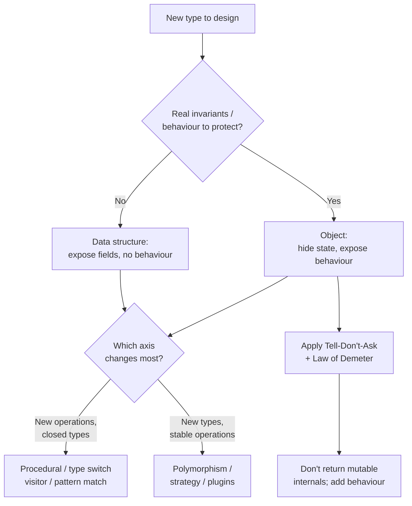

# Objects & Data Structures — Interview Questions

> 50+ questions across four tiers (Junior → Mid → Senior → Staff). Each harder question notes **what the interviewer is really checking**. Use as self-review or interview prep. The recurring theme: *objects and data structures are opposites, not synonyms* — and most design confusion comes from treating one like the other.

---

## Table of Contents

- [Junior (16 questions)](#junior-16-questions)
- [Mid (15 questions)](#mid-15-questions)
- [Senior (13 questions)](#senior-13-questions)
- [Staff (10 questions)](#staff-10-questions)
- [Rapid-Fire](#rapid-fire)
- [Summary](#summary)
- [Further Reading](#further-reading)
- [Related Topics](#related-topics)

---

## Junior (16 questions)

### J1. What is the difference between an object and a data structure?

<details><summary>Answer</summary>

An **object** hides its data behind behaviour — it exposes operations, not fields. A **data structure** exposes its data and has (almost) no behaviour. They are opposites: an object says *what it can do*; a data structure says *what it holds*.

```java
// Object — behaviour, no exposed data
interface Account { void deposit(Money m); Money balance(); }

// Data structure — exposed data, no behaviour
record AccountDTO(String id, long balanceCents) {}
```

</details>

### J2. What is the "data/object anti-symmetry"?

<details><summary>Answer</summary>

Robert Martin's observation: objects and data structures are mirror images.

- **Procedural code** (operations over data structures) makes it easy to **add new functions** without touching the data structures, but hard to **add new data types** (every function must change).
- **Object-oriented code** makes it easy to **add new types** without touching existing code, but hard to **add new operations** (every type must change).

Neither is universally better. Choose the axis along which you expect change.

</details>

### J3. State the Law of Demeter informally.

<details><summary>Answer</summary>

"Only talk to your immediate friends." A method should call methods on: itself, its parameters, objects it creates, and its own direct fields — *not* on objects returned by those calls. The folk version: "use only one dot."

</details>

### J4. What is a "train wreck"?

<details><summary>Answer</summary>

A chain of accessors that walks an object graph: `order.getCustomer().getAddress().getCity().getName()`. It couples the caller to the entire structure between the two ends. The fix is usually to ask the nearest object to do the work: `order.shippingCityName()`.

</details>

### J5. What is Tell, Don't Ask?

<details><summary>Answer</summary>

Instead of asking an object for its data and acting on it, *tell* the object what to do and let it act on its own data.

```java
// Ask
if (account.getBalance() >= amount) account.setBalance(account.getBalance() - amount);

// Tell
account.withdraw(amount);
```

Keeps decisions next to the data they depend on.

</details>

### J6. What is an anaemic domain model?

<details><summary>Answer</summary>

A "domain" model whose classes are bags of getters and setters with no business behaviour. All the logic lives in separate "service" classes that reach into the data. Martin Fowler calls it an anti-pattern because it has the *cost* of OO (mapping, classes) without the *benefit* (encapsulated behaviour).

</details>

### J7. What is a DTO?

<details><summary>Answer</summary>

A **Data Transfer Object** — a class with public fields (or trivial accessors) and no behaviour, used to move data across a boundary: API request/response, database row, message payload. DTOs are *meant* to be data structures. The anaemic-model critique does **not** apply to them.

</details>

### J8. Are getters and setters always bad? *(trick)*

<details><summary>Answer</summary>

No. On a **data structure / DTO**, accessors are exactly right — that *is* its job. The smell is reflexively generating a getter and setter for **every field of a domain object**, which leaks internal state and invites Ask-then-act code. The question is not "getter: yes/no" but "is this thing supposed to be an object or a data structure?"

</details>

### J9. What is encapsulation?

<details><summary>Answer</summary>

Hiding the representation of state so that callers depend on *behaviour*, not on internal layout. It lets you change the internals (a field's type, a cached value, a different algorithm) without breaking callers.

</details>

### J10. What is a value object?

<details><summary>Answer</summary>

A small immutable type defined entirely by its values, with equality by value rather than identity: `Money`, `Email`, `Coordinate`, `DateRange`. Two value objects with equal contents are interchangeable. They carry related behaviour (`money.add(other)`) and validate themselves on construction.

</details>

### J11. Why is returning a mutable internal collection from a getter risky?

<details><summary>Answer</summary>

The caller can mutate your internals behind your back: `order.getItems().clear()` empties the order without going through any validation. You have leaked encapsulation. Return an unmodifiable view or a copy instead.

</details>

### J12. What is polymorphism, and why prefer it over a type switch?

<details><summary>Answer</summary>

Polymorphism lets different types respond to the same call in their own way. Preferring it over `switch(type)` means new types slot in by adding a class, not by editing every switch statement scattered through the code (which is error-prone and violates Open/Closed).

</details>

### J13. Give a real Tell-Don't-Ask example with money.

<details><summary>Answer</summary>

```java
// Ask: caller knows about cents and rounding
total.setCents(total.getCents() + line.getCents());

// Tell: Money owns its arithmetic
total = total.plus(line.amount());
```

</details>

### J14. Is `record`/`struct` an object or a data structure?

<details><summary>Answer</summary>

By default a **data structure**: it exposes its fields. It *can* host behaviour and become a value object (a Java `record` with methods, a Go struct with methods). The classification depends on whether the public surface is data or behaviour, not on the keyword.

</details>

### J15. What does "one dot good, two dots bad" get wrong? *(trick)*

<details><summary>Answer</summary>

It counts dots instead of relationships. `stream.filter(...).map(...).collect(...)` has many dots but never violates Demeter — each call returns *the same kind of thing* (a Stream/Builder), not a deeper layer of someone else's internals. Demeter is about not navigating *foreign object graphs*, not about dot count.

</details>

### J16. What is a hybrid (half-object, half-data structure)?

<details><summary>Answer</summary>

A class that exposes public data *and* has significant behaviour — a struct with one or two business methods bolted on. It is the worst of both worlds: callers reach into the data *and* call methods, so it is hard to change along either axis. Pick a side.

</details>

---

## Mid (15 questions)

### M1. Give the precise Law of Demeter and contrast it with the folk version.

<details><summary>Answer</summary>

**Precise (the "function" form):** a method `m` of object `O` may invoke methods only on:
1. `O` itself,
2. `m`'s parameters,
3. objects `m` creates,
4. `O`'s direct component (field) objects,
5. (in some statements) global/singleton objects.

**Folk version:** "use only one dot." The folk version is a memory aid, not the law. It produces false positives (fluent APIs, builders, streams) and false negatives (`a.b.c` where each is a field — technically allowed, still possibly bad design). Interviewers asking this want to hear that Demeter is about *coupling to structure*, not about syntax.

**What the interviewer is really checking:** whether you parrot "one dot" or understand the underlying coupling argument.

</details>

### M2. Does method chaining always violate the Law of Demeter? *(trick)*

<details><summary>Answer</summary>

No. Two cases must be separated:

- **Builder/fluent self-return** (`builder.a().b().c()`): each call returns the *same* object (or a sibling builder). No graph navigation → no violation.
- **Train wreck** (`a.getB().getC().getD()`): each call returns a *different, foreign* object one layer deeper. That couples you to the whole chain → violation.

The dots look identical; the relationship is the discriminator.

</details>

### M3. When is an anaemic model perfectly fine? *(trick)*

<details><summary>Answer</summary>

When there is no real domain behaviour to encapsulate:

- **CRUD-heavy apps** where the "logic" is validation + persistence.
- **DTOs / API edges / wire formats** — these are data structures by design.
- **Read models / projections** in CQRS — query-side shapes are deliberately behaviourless.
- **Very small services** where a rich model is over-engineering.

The anti-pattern is calling something a *domain model* and putting business rules elsewhere. If it is honestly a data structure, anaemic is correct.

**What the interviewer is really checking:** dogma vs. judgement. The right answer is "it depends on whether real invariants exist."

</details>

### M4. How does encapsulation differ across Go, Java, and Python?

<details><summary>Answer</summary>

| | Java | Go | Python |
|---|---|---|---|
| Mechanism | `private`/`protected` keywords | Capitalization (exported vs. unexported), package-scoped | Convention (`_name`), name-mangling (`__name`) |
| Enforced by | Compiler | Compiler (package boundary) | Nothing — "consenting adults" |
| Unit of privacy | Class | Package | Module / class (soft) |

Go's privacy is at the **package**, not the type — types in the same package see each other's unexported fields. Python has no true privacy; `_` signals intent and `__` triggers name mangling, but both are bypassable.

</details>

### M5. How do you fix a train wreck — and when should you not?

<details><summary>Answer</summary>

Fix by **Tell, Don't Ask** / **Hide Delegate**: add a method on the nearest object that does the work, so the caller stops navigating the graph.

```java
// before
city = order.getCustomer().getAddress().getCity();
// after
city = order.shippingCity();
```

**When not to:** if the chain walks a *data structure* (a DTO, a parsed JSON tree, a config map), navigation is the point — there is nothing to encapsulate. Demeter governs *objects*, not data structures.

</details>

### M6. What is the cost of "expose-then-act" code?

<details><summary>Answer</summary>

Logic that depends on an object's data ends up *outside* that object, scattered across callers. When the rule changes, you must find and edit every caller. Worse, callers can violate invariants the object can't defend. Tell-Don't-Ask centralizes the rule with the data so there is one place to change.

</details>

### M7. How do you safely expose a collection that lives inside an object?

<details><summary>Answer</summary>

Pick one, in rough order of preference:

1. **Don't expose it** — add behaviour (`order.addItem`, `order.totalItems`).
2. **Unmodifiable view** — `Collections.unmodifiableList(items)` (Java), returning a copy of the slice header is *not* enough in Go.
3. **Defensive copy** — return a fresh copy; mutations don't propagate.
4. **Immutable type** — store an immutable list so sharing is safe.

```go
// Go: returning the slice shares the backing array — caller can mutate.
func (o *Order) Items() []Item { return append([]Item(nil), o.items...) } // copy
```

</details>

### M8. Polymorphism vs. type-switch: when is a switch actually better?

<details><summary>Answer</summary>

Prefer polymorphism when **types change often** and operations are stable. Prefer a switch when **operations change often** and the type set is small, closed, and stable (the anti-symmetry again). A switch in *one* place over a sealed/closed set is fine and often clearer than scattering behaviour across many tiny classes. The smell is the *same* switch duplicated in many places.

</details>

### M9. What makes a good value object?

<details><summary>Answer</summary>

- **Immutable** — no setters; "changes" return new instances.
- **Self-validating** — invalid states are unconstructable (a `Percentage` rejects 200).
- **Value equality** — `equals`/`__eq__`/comparable by contents.
- **Behaviour-rich** — related operations live on it (`range.overlaps(other)`).
- **Small and focused** — one concept.

</details>

### M10. How do DTOs and domain objects coexist?

<details><summary>Answer</summary>

Keep them separate and map between them at the boundary. DTOs are shaped for the wire/DB and may change for serialization reasons; domain objects are shaped for behaviour and invariants. Coupling them ("just serialize the entity") leaks persistence/transport concerns into the domain and forces the domain to expose fields it shouldn't.

</details>

### M11. Why does Active Record blur the object/data-structure line?

<details><summary>Answer</summary>

Active Record makes a class be *both* a data structure (mirrors a table's columns, exposes them) *and* an object (has `save`, validations, behaviour). That hybrid is convenient for small apps but couples domain behaviour to the table schema; as logic grows it pushes teams toward Data Mapper / separate domain models.

</details>

### M12. How would you refactor an anaemic model that has real logic in services?

<details><summary>Answer</summary>

1. Find a service method that reads several getters of one entity and computes a decision.
2. **Move Method** that logic onto the entity; pass collaborators as parameters.
3. Replace the getters it used with the new behaviour; make those getters private if possible.
4. Repeat. Introduce **value objects** for primitive clusters (`Money`, `Email`) as you go.

The service shrinks to orchestration; the entity gains its invariants.

</details>

### M13. Is `obj.field.method()` always a Demeter violation?

<details><summary>Answer</summary>

It is *allowed* by the precise law if `field` is a direct component of `obj` (rule 4). But it can still be poor design if `field` is really someone else's internal that `obj` happens to hold. The law permits it; cohesion/coupling judgement decides if it's wise.

</details>

### M14. What is "Hide Delegate" and how does it relate to Demeter?

<details><summary>Answer</summary>

Refactoring: when callers do `a.getB().doSomething()`, add `a.doSomething()` that delegates internally. The caller stops knowing about `B`. It directly enforces Demeter and reduces coupling — at the cost of `A` growing more methods (the "middle man" risk if overdone).

</details>

### M15. How do you decide object vs. data structure for a new type?

<details><summary>Answer</summary>

Ask: *does this thing have invariants/behaviour to protect?*

- Yes → **object**: hide fields, expose operations, Tell-Don't-Ask.
- No, it just carries values across a boundary → **data structure**: public/accessible fields, no behaviour.

Then ask which axis of change you expect (new types vs. new operations) to confirm the procedural-vs-OO trade-off.

</details>

---

## Senior (13 questions)

### S1. Reconcile "Tell, Don't Ask" with functional / immutable styles.

<details><summary>Answer</summary>

Tell-Don't-Ask is about *not pulling data out to decide elsewhere*; it doesn't require mutation. In FP you "tell" by sending the value through a function that owns the rule and **returns a new value**: `account.withdraw(m)` returns a new `Account` rather than mutating. The principle survives; the mechanism is a pure transformation instead of an in-place state change. Pattern matching over an algebraic data type is the FP world's deliberate "type switch" — and is idiomatic there precisely because operations change more than the closed type set.

**What the interviewer is really checking:** that you see the principle beneath the OO phrasing, not just memorized OO mantras.

</details>

### S2. When does aggressive Demeter compliance backfire?

<details><summary>Answer</summary>

Blindly adding delegation methods to satisfy "one dot" creates **Middle Man** smells and **wrapper bloat**: `Order` grows `customerCity()`, `customerZip()`, `customerCountry()` — it now re-exports the customer's entire surface. You traded structural coupling for a fat, low-cohesion interface. The cure is to move the *behaviour that needed those fields* onto the right object, not to proxy every accessor.

</details>

### S3. How do you encapsulate when the language has no real privacy (Python, JS pre-`#`)?

<details><summary>Answer</summary>

You encapsulate by **contract and design**, not enforcement:

- Convention (`_private`) plus a documented public API; linters/`__all__` to police imports.
- `@property` to expose computed/read-only views without exposing the field.
- Freeze where possible (`@dataclass(frozen=True)`, `types.MappingProxyType` for read-only dict views).
- In JS, `#private` fields (truly private) or closures.

The point: privacy is a *design intention* the language helps express to varying degrees, not a security boundary.

</details>

### S4. Critique: "We made every entity rich, now everything is slow / over-engineered."

<details><summary>Answer</summary>

Rich models are right where invariants live, but not everywhere:

- **Read models, reports, exports, wire DTOs** should stay anaemic — forcing behaviour onto them adds mapping cost and ceremony for nothing.
- A 3-field config that never has rules doesn't need a value object with five methods.

Maturity is matching the design to the presence of real domain logic. "Rich everywhere" is as dogmatic as "anaemic everywhere."

</details>

### S5. How do value objects interact with ORMs and persistence?

<details><summary>Answer</summary>

Value objects don't have identity, so they map as **embedded/component** values (JPA `@Embeddable`, EF owned types) or are serialized into a column. Pitfalls: ORMs often need a no-arg constructor or mutable fields, which fights immutability; equality must be by value not by `@Id`; and lazy loading + value equality can surprise. Strategy: keep the persistence shape as a separate data structure and map to/from the value object, or use the ORM's component support carefully.

</details>

### S6. Returning a mutable collection: walk through the leak and three fixes with their costs.

<details><summary>Answer</summary>

**Leak:** `getItems()` returns the live list; a caller mutates it; invariants (total, max size) silently break.

| Fix | Cost | Caveat |
|---|---|---|
| Unmodifiable view | O(1), throws on mutation | underlying list still changes if owner mutates it |
| Defensive copy | O(n) per call | wasteful if callers only read |
| Immutable collection | O(1) to share | needs copy-on-write for owner edits |
| Don't expose; add behaviour | design effort | best — but more methods |

The senior answer leads with "why am I returning the collection at all?"

</details>

### S7. How does the anti-symmetry guide architecture, not just classes?

<details><summary>Answer</summary>

The same trade-off scales up:

- **Visitor pattern** is procedural-in-OO-clothing: easy to add operations (new visitors), hard to add types (every visitor changes). Use it when the type set is stable and operations grow.
- **Plugin/strategy architectures** optimize for new types.
- **Event-sourced read models** are data structures you add new projections (operations) to freely.

Choosing a pattern is choosing which axis is cheap to extend.

</details>

### S8. "Open the object to testing" — how do you test behaviour without exposing state?

<details><summary>Answer</summary>

Test through the **public behaviour and observable outcomes**, not internal fields. If you feel forced to add a getter "just for the test," that's a signal the behaviour assertion is misplaced — assert on what the object *does* (return values, emitted events, interactions with collaborators) rather than what it *holds*. State-leaking getters added for tests are how anaemic models creep back in.

</details>

### S9. How do you handle a type switch that must stay (closed set, frequent new operations)?

<details><summary>Answer</summary>

Embrace it deliberately: use a **sealed hierarchy / sum type** and exhaustive pattern matching so the compiler flags every switch when a case is added. This gives the procedural side's strength (add operations freely) while keeping safety. Java sealed classes + switch patterns, Kotlin `when` over sealed, Rust `enum` + `match`, Go's type switch over a small interface set. The key is *exhaustiveness checking* and a *single, closed* type set.

</details>

### S10. What is the relationship between encapsulation and the Open/Closed Principle?

<details><summary>Answer</summary>

Encapsulation hides what varies; OCP says be open to extension, closed to modification. Polymorphism enabled by encapsulation lets you add a new subtype (extension) without editing existing behaviour (no modification). A type switch over exposed data is the opposite: every new type forces edits, violating OCP — unless the set is genuinely closed.

</details>

### S11. How do DTOs cause "excessive data exposure," and how do you prevent it?

<details><summary>Answer</summary>

Auto-serializing a domain entity as the API response leaks internal fields (password hashes, internal flags, ownership). The fix is an explicit **response DTO** shaped to the API contract — never reflect the entity directly. This is both a clean-code and a security concern (mass assignment on the way in, over-exposure on the way out).

</details>

### S12. A teammate says "value objects are over-engineering; just use strings." Respond.

<details><summary>Answer</summary>

Strings accept any garbage (`""`, malformed email), carry no behaviour, and let you swap `transfer(from, to)` arguments at compile time. A value object validates once at the boundary, centralizes behaviour, and makes illegal states unconstructable. Cost is allocation, largely elided by escape analysis (Java/Go) or `value class` erasure (Kotlin); real but small in Python. For *identifiers and money*, the safety nearly always wins; for a one-off label string, the teammate may be right.

</details>

### S13. How do immutability and Tell-Don't-Ask reduce concurrency bugs?

<details><summary>Answer</summary>

Immutable value objects are inherently thread-safe — no shared mutable state to race on. Tell-Don't-Ask keeps state transitions inside the object, so synchronization (if any) lives in one place rather than smeared across callers doing read-modify-write on exposed fields. Exposed mutable collections, by contrast, are a classic data race waiting to happen.

</details>

---

## Staff (10 questions)

### St1. Lead a team split between "rich domain model" and "anaemic + services" camps. How do you decide per-bounded-context?

<details><summary>Answer</summary>

Decide by **where the invariants and rate of change live**, not by ideology:

- Contexts with **rich, frequently changing business rules** (pricing, eligibility, scheduling) → rich models; behaviour next to data.
- Contexts that are **integration/CRUD/reporting** → anaemic data structures + thin services are simpler and honest.
- Make the choice *explicit per context* and document the reasoning, so the codebase isn't a random mix.

**What the interviewer is really checking:** can you turn a religious debate into a contextual engineering decision with criteria.

</details>

### St2. How do you enforce object/data-structure discipline at scale (fitness functions, lints)?

<details><summary>Answer</summary>

- **ArchUnit / dependency rules:** domain package must not depend on web/persistence; DTOs confined to boundary packages.
- **Lints:** ban returning mutable collection types from public domain methods; flag setters on `@Entity`/aggregate classes.
- **Serialization boundaries:** forbid `@JsonProperty` on domain entities (force DTOs).
- **Review heuristics:** any new getter on an aggregate needs justification.

These keep the boundary from eroding as the team grows.

</details>

### St3. Project Valhalla / Kotlin value classes — how do they change the value-object cost argument?

<details><summary>Answer</summary>

Historically the objection to value objects was allocation. Kotlin `@JvmInline value class` is **erased to its underlying type** at the JVM level (zero runtime cost in the common path; boxes only in generic/nullable/interface contexts). Java's Valhalla **value/primitive classes** are flat, identity-free, laid out inline — removing overhead even when escape analysis fails. Net effect: the "too expensive" argument against `Email`/`Money` value types largely disappears on the JVM, strengthening the case for typed primitives.

</details>

### St4. How does the data/object anti-symmetry inform microservice boundaries?

<details><summary>Answer</summary>

Services exchange **data structures** (events, DTOs, schemas) over the wire — there is no behaviour transfer across the boundary. Inside, each service may hold rich **objects**. Confusing the two leaks domain objects into contracts, making every internal refactor a breaking API change. Staff-level move: treat the contract as a versioned data structure (anti-symmetry: easy to add consumers/operations) and keep behaviour encapsulated *within* each service.

</details>

### St5. When is exposing internal state the correct, deliberate choice at architectural scale?

<details><summary>Answer</summary>

- **Event sourcing / CQRS read models** — projections are intentionally behaviourless data shaped for queries.
- **Data pipelines / analytics** — records flow through transformations; encapsulation would obstruct.
- **Public schemas / OpenAPI / protobuf** — the data *is* the contract.

The staff insight: encapsulation is a tool for protecting *invariants*; where there are none (read paths, transport, analytics), exposing data is right, and forcing objects is over-engineering.

</details>

### St6. How do you migrate a large anaemic codebase to richer models without a big-bang rewrite?

<details><summary>Answer</summary>

Strangler-style, behaviour by behaviour:

1. Identify a high-churn service method that orchestrates an entity's getters.
2. Move that behaviour onto the entity (or a new value object) behind the existing service signature.
3. Add characterization tests first if coverage is thin.
4. Make the migrated fields private; repeat for the next hotspot.
5. Prioritize by **change frequency × bug density**, not by class size.

Never freeze the system to "fix the model"; evolve it under tests.

</details>

### St7. Encapsulation across a polyglot stack (Go services + Java + Python) — how do you keep contracts honest?

<details><summary>Answer</summary>

The shared contract lives in **schema** (protobuf/Avro/JSON Schema), which is a data structure by definition and language-neutral. Each language enforces *internal* encapsulation its own way (Go package boundaries, Java access modifiers, Python convention + typing). Generate DTOs from the schema; never hand-share entity classes. The encapsulation guarantee is per-service; the contract guarantee is the schema's compatibility rules.

</details>

### St8. Critique Tell-Don't-Ask in a system with heavy cross-aggregate decisions.

<details><summary>Answer</summary>

Tell-Don't-Ask works cleanly *within* an aggregate. When a decision needs data from **several aggregates**, forcing one to "tell" the others creates god-objects and tight coupling. The staff answer: lift such decisions into a **domain service** or **policy** object that *coordinates*, querying each aggregate's behaviour (not raw fields) and telling them the outcome. So you preserve "ask the object, don't reach into its state" while not pretending all logic fits inside one entity.

</details>

### St9. How do you measure whether your domain objects are truly encapsulated?

<details><summary>Answer</summary>

Proxies, not a single metric:

- **Accessor ratio:** count of public getters/setters vs. behavioural methods on aggregates (high getter ratio → drifting anaemic).
- **Feature envy detection:** static analysis for methods that call another object's getters more than their own.
- **Train-wreck lints:** count chained foreign-graph accesses.
- **Change coupling:** do entity changes force edits across many service files? (Sign logic lives outside the object.)

Trend these over time rather than chasing an absolute number.

</details>

### St10. Defend a deliberately anaemic, exposed-data design in a design review.

<details><summary>Answer</summary>

"This is a transport/read context, not a domain context. There are no invariants to protect — the data crosses a boundary and is consumed by N readers we don't control. A data structure here optimizes the axis we expect to change (new consumers/projections), per the data/object anti-symmetry. Adding behaviour would create mapping cost and coupling for zero invariant protection. The rich model lives in the *pricing* context, where the rules actually are." This shows the choice is contextual and principled, not lazy.

</details>

---

## Rapid-Fire

| Prompt | Answer |
|---|---|
| Object exposes…? | Behaviour |
| Data structure exposes…? | Data |
| One-line Demeter | Don't navigate foreign object graphs |
| Folk Demeter's flaw | Counts dots, not relationships |
| Fluent chain violates Demeter? | No — same object returned |
| Tell-Don't-Ask in one phrase | Decisions next to their data |
| Anaemic model always bad? | No — fine for DTOs/read models |
| Getters always bad? | No — correct on data structures |
| Value object equality | By value, not identity |
| Returning live collection | Leaks encapsulation; copy/view/behaviour |
| Type switch over polymorphism when? | Closed type set, growing operations |
| Go privacy unit | Package, not type |
| Python privacy | Convention; `__` mangles; no enforcement |
| Anti-symmetry: OO eases…? | Adding types; harder to add operations |
| Anti-symmetry: procedural eases…? | Adding operations; harder to add types |
| Hybrid object/data structure | Worst of both — pick a side |
| DTO at API edge: anaemic OK? | Yes, by design |
| Visitor pattern axis | Easy new operations, hard new types |

---

## Summary

Objects and data structures are **opposites**: objects hide data and expose behaviour; data structures expose data and have none. Almost every question in this set reduces to *"which one is this supposed to be?"* — getters, anaemic models, and DTOs are all "wrong" when the thing should have been an object, and all "right" when it should have been a data structure.

The supporting principles serve that distinction. **Tell, Don't Ask** and the **Law of Demeter** keep decisions and navigation from leaking out of objects — but both govern *objects*, not data structures, and both have folk versions (one-dot, no-getters) that mislead when applied mechanically. **Value objects** make small concepts safe and behavioural; **immutability** makes them concurrency-friendly. The **data/object anti-symmetry** is the deepest idea: it explains *why* there's no universally right answer and turns the choice into "which axis of change do I expect," scaling from a single class up to microservice contracts. Staff-level judgement is matching the design to the presence of real invariants — and defending an exposed, anaemic data structure exactly where there are none.



---

## Further Reading

- Robert C. Martin, *Clean Code*, Ch. 6 — "Objects and Data Structures" (data/object anti-symmetry, Demeter).
- Martin Fowler, "AnemicDomainModel" — martinfowler.com/bliki/AnemicDomainModel.html
- Eric Evans, *Domain-Driven Design* — value objects, entities, aggregates.
- Andrew Hunt & David Thomas, *The Pragmatic Programmer* — Law of Demeter, decoupling.
- David Bock, "The Paperboy, the Wallet, and the Law of Demeter."

---

## Related Topics

- [Objects & Data Structures — overview](README.md)
- [Junior-level notes](junior.md)
- [Professional-level notes](professional.md)
- [Chapter README](../README.md)
- [Classes (clean-code chapter)](../09-classes/README.md)
- [Anti-Patterns (code-craft)](../../anti-patterns/README.md)
- [Refactoring — code smells (code-craft)](../../refactoring/README.md)
