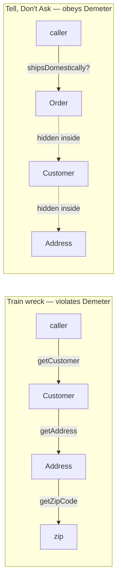
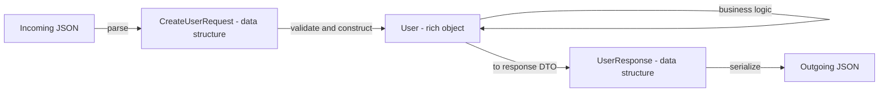

# Objects & Data Structures — Junior Level

> **Level:** Junior — "What's the rule? Show me a clean example."
> **Source:** Robert C. Martin, *Clean Code*, Chapter 6 — "Objects and Data Structures."

---

## Table of Contents

1. [The one idea behind this chapter](#the-one-idea-behind-this-chapter)
2. [Real-world analogy](#real-world-analogy)
3. [Rule 1 — Objects hide data and expose behavior](#rule-1--objects-hide-data-and-expose-behavior)
4. [Rule 2 — Data structures expose data and have no behavior (and that's fine)](#rule-2--data-structures-expose-data-and-have-no-behavior-and-thats-fine)
5. [Rule 3 — Pick one deliberately (the anti-symmetry)](#rule-3--pick-one-deliberately-the-anti-symmetry)
6. [Rule 4 — Tell, Don't Ask](#rule-4--tell-dont-ask)
7. [Rule 5 — The Law of Demeter ("only talk to your friends")](#rule-5--the-law-of-demeter-only-talk-to-your-friends)
8. [Rule 6 — DTOs: when a raw data bag is correct](#rule-6--dtos-when-a-raw-data-bag-is-correct)
9. [Common Mistakes](#common-mistakes)
10. [Test Yourself](#test-yourself)
11. [Cheat Sheet](#cheat-sheet)
12. [Summary](#summary)
13. [Further Reading](#further-reading)
14. [Related Topics](#related-topics)

---

## The one idea behind this chapter

There are two opposite ways to package data, and most messy code comes from mixing them up without noticing.

| | **Object** | **Data structure** |
|---|---|---|
| Exposes | behavior (methods) | data (fields) |
| Hides | its data | nothing |
| You interact by | **telling it to do work** | **reading and writing its fields** |
| Example | `account.withdraw(50)` | `Point{X, Y}`, a JSON row |

These are mirror images. An object is a thing you *command* — it owns its data and decides how to act on it. A data structure is a thing you *inspect* — it's a bag of values with no opinions. Both are correct. The mistake is the muddy middle: a "thing" that exposes all its data through getters **and** carries behavior, so callers can never tell whether to command it or read it.

> **The rule for juniors:** decide whether each type is an object or a data structure, then commit. Objects get methods and private fields. Data structures get public fields and (almost) no methods.

---

## Real-world analogy

### A vending machine vs. a fruit basket

A **vending machine** is an object. You don't open it, count the cans, do the math, and adjust the inventory yourself. You *tell it*: "I want B4, here's my money." It validates the coins, checks stock, drops the can, and returns your change. Its internals — the coin counter, the motor map, the stock table — are hidden behind a slot and a keypad. You command it; it decides.

A **fruit basket** is a data structure. It makes no decisions. You look inside, see three apples and a banana, and *you* decide what to do. The basket has no `eat()` method and no opinion about ripeness. It just holds fruit where you can see it.

Now imagine a basket that *sometimes* makes decisions — it hides half the fruit behind a flap, exposes the rest, and has one `pickBestApple()` method bolted on but no way to actually see the apples. That confusing thing is a **hybrid**, and it's the central anti-pattern of this chapter. Don't build it.

---

## Rule 1 — Objects hide data and expose behavior

An object's fields are private. Callers don't read them and act on them; they ask the object to act. This is **encapsulation**: the object is the only code that touches its own data, so all the rules about that data live in one place.

### Dirty — fields exposed, logic outside

```java
// Java — anaemic: BankAccount is just a data bag with a behavior method bolted on
class BankAccount {
    public double balance;   // anyone can read or write it
}

// Withdrawal logic lives OUTSIDE the account, scattered across callers:
if (account.balance >= amount) {
    account.balance -= amount;      // one caller does it this way
} else {
    throw new InsufficientFundsException();
}
// ...and somewhere else, another caller forgets the check entirely:
account.balance -= amount;          // overdraft bug, silently allowed
```

The "can I withdraw?" rule isn't owned by anyone. Every caller re-implements it, and one of them gets it wrong.

### Clean — the object owns its data and its rules

```java
// Java — BankAccount decides; nobody can reach its balance
class BankAccount {
    private double balance;

    public void withdraw(double amount) {
        if (amount <= 0) throw new IllegalArgumentException("amount must be positive");
        if (amount > balance) throw new InsufficientFundsException();
        balance -= amount;
    }

    public double balance() { return balance; }   // read-only view, no setter
}

account.withdraw(amount);   // one rule, one place, impossible to bypass
```

```python
# Python — a private-by-convention field and a behavior method
class BankAccount:
    def __init__(self, balance: float = 0.0) -> None:
        self._balance = balance          # leading underscore = "internal"

    def withdraw(self, amount: float) -> None:
        if amount <= 0:
            raise ValueError("amount must be positive")
        if amount > self._balance:
            raise InsufficientFundsError()
        self._balance -= amount

    @property
    def balance(self) -> float:          # read-only: a getter with no setter
        return self._balance

account.withdraw(amount)
```

```go
// Go — unexported field (lowercase) is package-private; method exposes behavior
type BankAccount struct {
    balance float64 // lowercase: cannot be touched outside this package
}

func (a *BankAccount) Withdraw(amount float64) error {
    if amount <= 0 {
        return errors.New("amount must be positive")
    }
    if amount > a.balance {
        return ErrInsufficientFunds
    }
    a.balance -= amount
    return nil
}

func (a *BankAccount) Balance() float64 { return a.balance } // read-only accessor
```

Notice the clean version has **no setter** for `balance`. The only way the balance changes is through a method that enforces the rules. That's the point of an object.

---

## Rule 2 — Data structures expose data and have no behavior (and that's fine)

The opposite choice is equally valid. Some types are *just data*: a point, a parsed config row, a JSON payload, a coordinate. These should expose their fields plainly. Wrapping a pure data structure in getters and setters adds noise and hides nothing — the data is meant to be seen.

### A point is a data structure

```java
// Java — a record: all fields public and read-only, zero ceremony
record Point(double x, double y) {}

// Geometry that uses points lives elsewhere — points don't compute, they hold:
double distance(Point a, Point b) {
    return Math.hypot(a.x() - b.x(), a.y() - b.y());
}
```

```python
# Python — a dataclass: a transparent bundle of fields
import math
from dataclasses import dataclass

@dataclass
class Point:
    x: float
    y: float

def distance(a: Point, b: Point) -> float:
    return math.hypot(a.x - b.x, a.y - b.y)
```

```go
// Go — a plain struct with exported fields is the idiomatic data structure
type Point struct {
    X, Y float64
}

func Distance(a, b Point) float64 {
    return math.Hypot(a.X-b.X, a.Y-b.Y)
}
```

There's nothing wrong here. A `Point` has no invariant to protect — any pair of floats is a valid point — so hiding the fields would buy nothing and cost clarity. **Data structures are not a code smell.** Forcing behavior onto them is.

---

## Rule 3 — Pick one deliberately (the anti-symmetry)

Here is the trap. Objects and data structures are *opposites*, so a design choice that helps one hurts the other:

- **Adding a new data type** (e.g. a new shape) is easy with objects (write one new class, nothing else changes) but hard with a data structure + switch (you must edit every switch).
- **Adding a new operation** (e.g. a new way to render shapes) is easy with a data structure + switch (one new function) but hard with objects (you must edit every class).

You can't have both at once. So you must **choose based on what's likely to change**, and then commit. The hybrid — half object, half data structure — gets the disadvantages of both and the advantages of neither.

### Dirty — visitor-style switching on type instead of polymorphism

```java
// Java — area() must switch on every shape; adding a Triangle means editing this
double area(Shape s) {
    switch (s.kind) {                       // <-- type code on a data bag
        case CIRCLE:    return Math.PI * s.radius * s.radius;
        case RECTANGLE: return s.width * s.height;
        default:        throw new IllegalArgumentException();
    }
}
// And perimeter() switches again. And describe() switches again. Three switches
// to keep in sync; forget one when you add a shape and you ship a bug.
```

### Clean — objects with polymorphism (when shape *types* will grow)

```java
// Java — each shape owns its own behavior; adding Triangle adds ONE class
interface Shape {
    double area();
    double perimeter();
}

record Circle(double radius) implements Shape {
    public double area()      { return Math.PI * radius * radius; }
    public double perimeter() { return 2 * Math.PI * radius; }
}

record Rectangle(double width, double height) implements Shape {
    public double area()      { return width * height; }
    public double perimeter() { return 2 * (width + height); }
}

double total = shapes.stream().mapToDouble(Shape::area).sum(); // no switch anywhere
```

```python
# Python — polymorphism via a common protocol; each shape carries its own logic
import math
from dataclasses import dataclass
from typing import Protocol

class Shape(Protocol):
    def area(self) -> float: ...

@dataclass
class Circle:
    radius: float
    def area(self) -> float:
        return math.pi * self.radius ** 2

@dataclass
class Rectangle:
    width: float
    height: float
    def area(self) -> float:
        return self.width * self.height

total = sum(shape.area() for shape in shapes)   # no isinstance() ladder
```

```go
// Go — an interface is the polymorphism tool; no embedded type tag, no switch
type Shape interface {
    Area() float64
}

type Circle struct{ Radius float64 }
func (c Circle) Area() float64 { return math.Pi * c.Radius * c.Radius }

type Rectangle struct{ Width, Height float64 }
func (r Rectangle) Area() float64 { return r.Width * r.Height }

func TotalArea(shapes []Shape) float64 {
    var total float64
    for _, s := range shapes {
        total += s.Area() // dynamic dispatch, no type switch
    }
    return total
}
```

> **When to keep the switch:** if the set of *shapes* is frozen but the set of *operations* keeps growing (area, perimeter, render, serialize, validate...), the data-structure-plus-function approach is actually the better fit — one new function per operation, no class edits. That is a deliberate choice, not the accidental hybrid. Make it on purpose.

---

## Rule 4 — Tell, Don't Ask

**Tell an object to do work; don't pull its data out and decide for it.** When you find yourself asking an object for its internals and then making a decision based on them, that decision usually belongs *inside* the object.

### Dirty — ask for the data, decide outside

```java
// Java — the caller interrogates the cart, then computes. The cart is anaemic.
double total = 0;
for (Item item : cart.getItems()) {                 // ask for the list
    total += item.getPrice() * item.getQuantity();  // do the math out here
}
if (cart.getCustomer().getTier().equals("GOLD")) {  // ask, then branch
    total *= 0.9;
}
```

### Clean — tell the cart to compute its own total

```java
// Java — the cart owns its items and its pricing rules
class Cart {
    private final List<Item> items;
    private final Customer customer;

    public Money total() {
        Money sum = items.stream()
            .map(Item::subtotal)            // each item knows its own subtotal
            .reduce(Money.ZERO, Money::plus);
        return customer.applyDiscount(sum); // the customer knows its own discount
    }
}

Money total = cart.total();   // tell, don't ask
```

```python
# Python — same shift: the cart computes; the caller just asks for the answer
class Cart:
    def __init__(self, items: list["Item"], customer: "Customer") -> None:
        self._items = items
        self._customer = customer

    def total(self) -> "Money":
        running = sum((item.subtotal() for item in self._items), Money.ZERO)
        return self._customer.apply_discount(running)

total = cart.total()
```

```go
// Go — behavior lives on the type that owns the data
type Cart struct {
    items    []Item
    customer Customer
}

func (c Cart) Total() Money {
    sum := Money{}
    for _, item := range c.items {
        sum = sum.Plus(item.Subtotal())
    }
    return c.customer.ApplyDiscount(sum)
}

total := cart.Total()
```

The clean version moved both the loop and the discount rule *into* the cart. Now there is exactly one place that knows how a cart total is computed. Tell-Don't-Ask is the everyday habit that produces real objects instead of anaemic data bags.

> **Not a law, a heuristic.** It's fine to *ask* a data structure for its fields — that's what data structures are for. Tell-Don't-Ask applies when you're talking to an **object** that should own a decision.

---

## Rule 5 — The Law of Demeter ("only talk to your friends")

The Law of Demeter says a method should only call methods on:

1. **itself**,
2. its own **fields**,
3. its **parameters**, and
4. objects it **creates** locally.

It should **not** reach through one object to get a second object and call a method on *that*. The smell is the **train wreck**: `a.getB().getC().getD().doIt()` — a long chain of dots where each call digs one level deeper into someone else's internals.

### Dirty — train wreck

```java
// Java — reaching through three objects to find a zip code
String zip = order.getCustomer().getAddress().getZipCode();

// And worse, deciding based on the dug-out value:
if (order.getCustomer().getAddress().getCountry().equals("US")) {
    applyDomesticShipping(order);
}
```

Every dot is a coupling. This code now breaks if `Customer` changes how it stores its address, if `Address` renames `getCountry`, or if any link in the chain returns `null`. The caller knows the entire object graph three levels deep.

### Clean — ask your immediate friend to answer

```java
// Java — Order answers questions about itself; the chain is hidden inside it
class Order {
    private final Customer customer;

    public boolean shipsDomestically() {
        return customer.isInCountry("US");   // talk only to Customer
    }
}

class Customer {
    private final Address address;
    public boolean isInCountry(String code) {
        return address.hasCountry(code);     // Customer talks only to Address
    }
}

if (order.shipsDomestically()) {             // caller talks only to Order
    applyDomesticShipping(order);
}
```

```python
# Python — each level answers for itself; no reaching through
class Order:
    def __init__(self, customer: "Customer") -> None:
        self._customer = customer

    def ships_domestically(self) -> bool:
        return self._customer.is_in_country("US")

class Customer:
    def __init__(self, address: "Address") -> None:
        self._address = address

    def is_in_country(self, code: str) -> bool:
        return self._address.has_country(code)

if order.ships_domestically():
    apply_domestic_shipping(order)
```

```go
// Go — one short hop per type; the chain is encapsulated
func (o Order) ShipsDomestically() bool {
    return o.customer.IsInCountry("US")
}

func (c Customer) IsInCountry(code string) bool {
    return c.address.HasCountry(code)
}

if order.ShipsDomestically() {
    applyDomesticShipping(order)
}
```

> **Chains on data structures are OK.** `point.position.x` is fine — a data structure has no behavior to hide, so reading through it isn't a Demeter violation. The law is about not depending on the *internal object structure* of things that are supposed to hide it. Method chaining on a **fluent builder** (`builder.title("x").format(PDF).build()`) is also fine — each call returns the same object, so it's not a train wreck.



---

## Rule 6 — DTOs: when a raw data bag is correct

A **DTO (Data Transfer Object)** is a deliberate data structure: public fields, no behavior. It is the *right* tool at the **boundaries** of your system — where data is serialized, sent over a wire, read from a database, or parsed from JSON. At a boundary you are not modeling a domain object that protects invariants; you are moving a snapshot of data from one place to another.

```java
// Java — a DTO mirroring an incoming JSON request. Public, dumb, on purpose.
public record CreateUserRequest(
    String email,
    String displayName,
    int    age
) {}   // no methods: it exists only to carry data across the HTTP boundary
```

```python
# Python — a DTO for an API payload; transparent by design
from dataclasses import dataclass

@dataclass
class CreateUserRequest:
    email: str
    display_name: str
    age: int
```

```go
// Go — struct tags map fields to JSON; this is a textbook data structure
type CreateUserRequest struct {
    Email       string `json:"email"`
    DisplayName string `json:"display_name"`
    Age         int    `json:"age"`
}
```

The key discipline: **a DTO stays at the boundary.** You parse the `CreateUserRequest` and then build a real `User` *object* (with validation and behavior) for use inside your domain. Don't let the dumb data bag leak into the core of your application and become the thing you attach business rules to — that's how you grow an anaemic domain model.



---

## Common Mistakes

| Mistake | Why it hurts | Fix |
|---|---|---|
| **Anaemic domain model** — domain classes with only getters/setters and no behavior | Business rules scatter across every caller; no single source of truth | Move the rules *into* the class (Tell, Don't Ask). See [Rule 4](#rule-4--tell-dont-ask). |
| **Train wreck** — `a.getB().getC().getD().doIt()` | Caller couples to three levels of internal structure; fragile to any change | Add a method on the immediate friend. See [Rule 5](#rule-5--the-law-of-demeter-only-talk-to-your-friends). |
| **Hybrid** — a "thing" that exposes all its data *and* has behavior | Half-object, half-data-structure; gets the downsides of both | Decide: object (hide data) or data structure (no behavior). Commit. |
| **Getter/setter for every field** | Leaks internal state; the object can't protect any invariant — it's a data bag in disguise | Only expose what callers truly need; prefer behavior methods over raw setters. |
| **Returning a public mutable collection** | Callers can mutate your internals behind your back, breaking your invariants | Return a copy, an unmodifiable view, or expose `add`/`remove` methods. See below. |
| **Switching on a type code** instead of polymorphism | Every new type means editing every switch; one missed edit is a bug | Use an interface + per-type methods *when types grow*. See [Rule 3](#rule-3--pick-one-deliberately-the-anti-symmetry). |

### The "leaky collection" mistake in code

```java
// Dirty — caller can corrupt the order's internal list:
class Order {
    private final List<Item> items = new ArrayList<>();
    public List<Item> getItems() { return items; }   // <-- hands out the real list
}
order.getItems().clear();   // oops: the order's items are gone, no rule stopped it

// Clean — hand out a read-only view, expose intent-revealing mutators:
class Order {
    private final List<Item> items = new ArrayList<>();
    public List<Item> items() { return Collections.unmodifiableList(items); }
    public void addItem(Item item) {
        if (items.size() >= 100) throw new IllegalStateException("cart full");
        items.add(item);
    }
}
```

```go
// Go — return a copy so callers can't mutate the backing array:
func (o *Order) Items() []Item {
    out := make([]Item, len(o.items))
    copy(out, o.items)
    return out
}
```

---

## Test Yourself

1. **What's the one-sentence difference between an object and a data structure?**

<details><summary>Answer</summary>

An object **hides its data and exposes behavior** (you command it); a data structure **exposes its data and has no meaningful behavior** (you read and act on it). They are mirror images, and you should pick one deliberately for each type.
</details>

2. **Is this a Law of Demeter violation? `total += order.getCustomer().getDiscount().rate();`**

<details><summary>Answer</summary>

Yes — it's a train wreck. The caller reaches through `Order` to `Customer` to `Discount`. Fix it by telling the object: give `Order` (or `Customer`) a method like `order.discountedTotal()` so the caller talks only to its immediate friend. (Exception: if `Discount` is a pure data structure, `getDiscount().rate()` reading a field is acceptable — the law targets reaching through *objects* that hide structure.)
</details>

3. **A teammate adds a `calculateInterest()` method to your `AccountDTO`, which currently has only public fields and JSON tags. Good idea?**

<details><summary>Answer</summary>

No. A DTO is a deliberate data structure that lives at the boundary (serialization, transport). Bolting behavior onto it creates a hybrid and starts pulling business logic toward the wire format. Put `calculateInterest()` on a real `Account` *object* in the domain; keep `AccountDTO` dumb.
</details>

4. **You see `if (user.getRole().equals("ADMIN")) { ... }` repeated in 12 files. Which rule is being violated, and what's the fix?**

<details><summary>Answer</summary>

Tell-Don't-Ask. Every caller asks the user for its role string and decides for itself what an admin may do. Replace the asks with a behavior method: `user.canEdit(resource)` or `user.isAdmin()`. The authorization rule then lives in one place inside `User`, and the 12 call sites stop depending on the literal string `"ADMIN"`.
</details>

5. **Why is "a getter and setter for every private field" barely better than making the fields public?**

<details><summary>Answer</summary>

Because it leaks the same internal state — just through method calls. Any caller can read and overwrite every field, so the object can't enforce any invariant. It looks encapsulated but behaves like a data bag (the anaemic domain model). Real encapsulation means exposing *behavior* and only the few accessors callers genuinely need.
</details>

6. **When is switching on a type code (`switch (shape.kind)`) the right design rather than a smell?**

<details><summary>Answer</summary>

When the set of *types* is stable but the set of *operations* keeps growing. With a fixed handful of shapes and many operations (area, render, serialize, validate...), one new function per operation beats editing every class. Polymorphism wins the opposite case: stable operations, growing types. Choose based on which axis changes — just choose on purpose.
</details>

---

## Cheat Sheet

| Situation | Do this |
|---|---|
| Modeling a domain concept with rules (Account, Order, Cart) | **Object**: private fields, behavior methods, no blanket setters |
| Moving data across a boundary (HTTP, DB row, JSON, queue) | **Data structure / DTO**: public fields, no behavior |
| About to write `a.getB().getC().doIt()` | Stop — add a method on `a` that does it (Law of Demeter) |
| About to read an object's data and branch on it | Stop — tell the object to make the decision (Tell, Don't Ask) |
| Adding a new *type* often, operations are stable | **Polymorphism** — interface + one class per type |
| Adding a new *operation* often, types are stable | **Data structure + functions** — switch is acceptable here |
| Returning an internal `List`/slice/map | Return a copy or read-only view, or expose `add`/`remove` |
| A class is half getters-and-setters, half behavior | Decide which it is and refactor toward that — kill the hybrid |

**The five-second test for any type you write:** *"Do I command this, or do I read it?"* If both, you have a hybrid — split it.

---

## Summary

- **Objects** hide their data and expose **behavior**. You *command* them. Fields are private; rules live inside.
- **Data structures** expose their data and have **no meaningful behavior**. You *read* them. This is correct and idiomatic — DTOs at boundaries are the prime example.
- They are an **anti-symmetry**: the design that makes adding *types* easy makes adding *operations* hard, and vice versa. Pick one deliberately based on what changes; never build the **hybrid**.
- **Tell, Don't Ask:** push the decision into the object that owns the data instead of pulling the data out to decide for it. This is the daily habit that prevents an **anaemic domain model**.
- **Law of Demeter:** only talk to your immediate friends. No `a.getB().getC().doIt()` train wrecks — give your friend a method that answers the question.
- Watch for the classic leaks: getter/setter for every field, and returning your internal mutable collection.

---

## Further Reading

- Robert C. Martin, *Clean Code*, Chapter 6 — "Objects and Data Structures" (the source of this chapter).
- Martin Fowler, ["AnemicDomainModel"](https://martinfowler.com/bliki/AnemicDomainModel.html) — why data-only domain classes are an anti-pattern.
- Martin Fowler, ["GetterEradicator"](https://martinfowler.com/bliki/GetterEradicator.html) — Tell-Don't-Ask in practice.
- The Pragmatic Programmer, Hunt & Thomas — original phrasing of the Law of Demeter.

---

## Related Topics

- [middle.md](middle.md) — the same rules under real-world pressure: where the boundary between object and DTO actually sits, ORM entities, and when "pragmatic" hybrids are tolerated.
- [senior.md](senior.md) — architectural consequences: rich vs. anaemic domain models, DDD value objects, and Demeter at the module/service level.
- [Chapter README](../README.md) — the positive rules this junior file teaches against the anti-patterns.
- [Classes](../09-classes/README.md) — how cohesive, single-responsibility classes embody "objects hide data."
- [Error Handling](../06-error-handling/README.md) — objects that own their invariants reject bad input at the source.
- [Refactoring](../../refactoring/README.md) — mechanical recipes (Encapsulate Field, Hide Delegate, Move Method) that fix these smells.
- [Design Patterns](../../design-patterns/README.md) — Strategy and Visitor are the disciplined forms of "switch vs. polymorphism."
- [Anti-Patterns](../../anti-patterns/README.md) — the anaemic domain model and train wreck cataloged among broader hazards.
