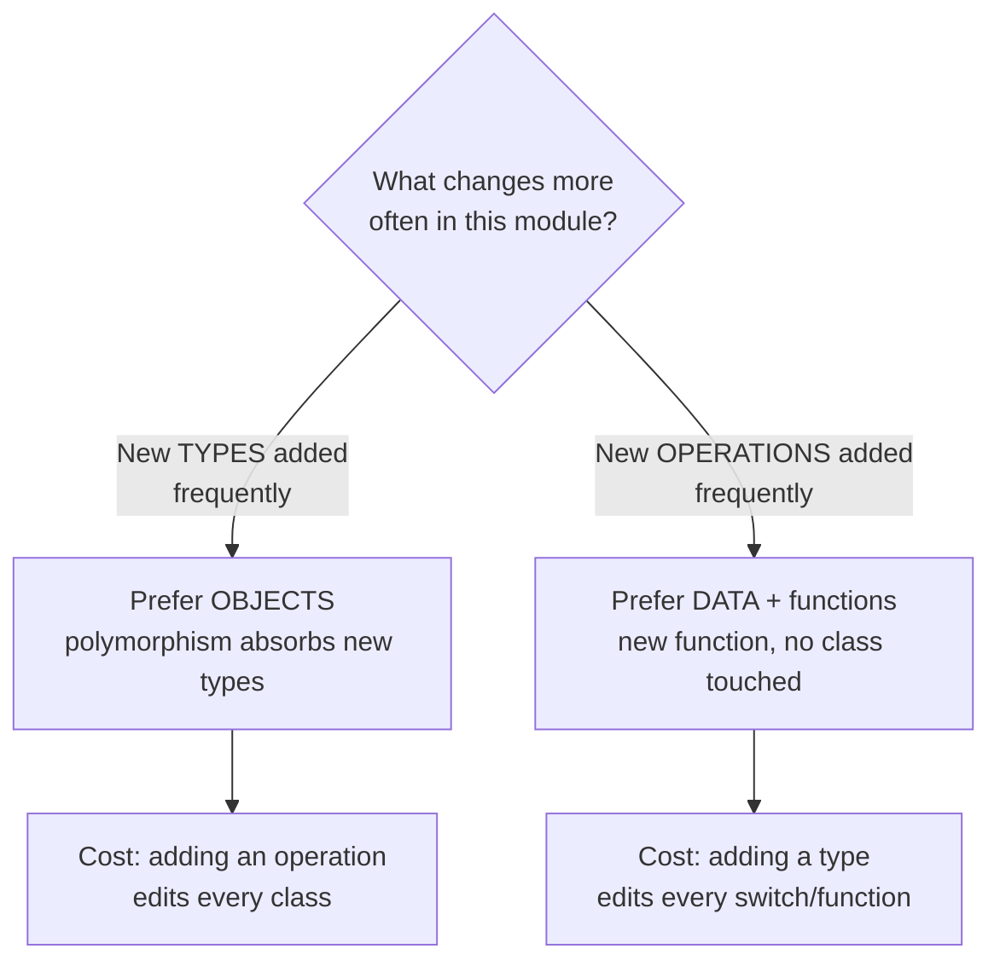

# Objects & Data Structures — Middle Level

> Focus: "Why?" and "When does it bend?" — Clean Code's OO rules are defaults, not laws. This file is about the trade-offs: when the anaemic model is correct, when chaining is fine, when getters earn their keep, and how Go's lack of inheritance changes every answer.

---

## Table of Contents

1. [The object/data anti-symmetry — the rule underneath the rules](#the-objectdata-anti-symmetry--the-rule-underneath-the-rules)
2. [When the anaemic domain model is the RIGHT call](#when-the-anaemic-domain-model-is-the-right-call)
3. [Law of Demeter — coupling to structure, not counting dots](#law-of-demeter--coupling-to-structure-not-counting-dots)
4. [Tell-Don't-Ask vs. legitimate query needs](#tell-dont-ask-vs-legitimate-query-needs)
5. [When getters and setters are justified](#when-getters-and-setters-are-justified)
6. [Returning internal collections: copy vs. view vs. expose](#returning-internal-collections-copy-vs-view-vs-expose)
7. [Go has no inheritance — and that reshapes the answer](#go-has-no-inheritance--and-that-reshapes-the-answer)
8. [Common Mistakes](#common-mistakes)
9. [Test Yourself](#test-yourself)
10. [Cheat Sheet](#cheat-sheet)
11. [Summary](#summary)
12. [Further Reading](#further-reading)
13. [Related Topics](#related-topics)

---

## The object/data anti-symmetry — the rule underneath the rules

Most of this chapter's advice collapses into one observation from *Clean Code*: **objects and data structures are opposites, and the costs of each are mirror images.**

- An **object** hides its data behind behaviour. You ask it to *do* things.
- A **data structure** exposes its data and has no meaningful behaviour. You *read* its fields and act on them elsewhere.

The anti-symmetry is the key insight:

| | Add a new **operation** | Add a new **type** |
|---|---|---|
| **Objects (polymorphism)** | Hard — touch every class | Easy — add one class |
| **Data structures + functions** | Easy — add one function | Hard — touch every function |



This table is *why* Clean Code's rules exist — and *why they bend*. "Make everything an object with behaviour" optimizes for the left column. But a huge amount of real software lives in the right column: you have a stable set of types (`Order`, `LineItem`, `Customer`) and you keep adding operations (export to CSV, compute tax, render PDF, sync to warehouse). For that shape, **data structures plus free functions are the better design** — and Clean Code's OO-first framing actively fights you.

The mistake juniors make is treating "anaemic model = bad" as an axiom. The middle-level skill is asking *which column am I in?* before deciding.

---

## When the anaemic domain model is the RIGHT call

The "anaemic domain model" — data classes with getters/setters and zero behaviour — is listed as an anti-pattern (Martin Fowler named it pejoratively). But there are at least five contexts where it's not a smell at all; it's the correct shape.

### 1. DTOs and wire types

A type that *is* the serialized form of an API request, a Kafka message, or a database row is a data structure by definition. Putting behaviour on it couples your wire format to your logic and breaks the moment the two need to evolve independently.

```go
// Correct anaemic DTO — this is the wire contract, nothing more.
type CreateOrderRequest struct {
    CustomerID string     `json:"customer_id"`
    Items      []LineItem `json:"items"`
    Coupon     *string    `json:"coupon,omitempty"`
}
```

Behaviour (validation, pricing) belongs in a service that *consumes* the DTO, not on the DTO. Trying to make this "rich" produces a type that's simultaneously a serialization format and a domain entity — two jobs, guaranteed to conflict.

### 2. Functional-core / data-oriented design

In the functional-core, imperative-shell style, the core is **immutable data + pure functions**. There is no behaviour on the data *by design* — separating data from the functions that transform it is the entire point, because it makes the core trivially testable and composable.

```python
# Functional core: data is dumb, functions are pure. This is not anaemic-as-smell.
@dataclass(frozen=True)
class Cart:
    items: tuple[Item, ...]

def total(cart: Cart) -> Money:          # free function, not a method
    return sum((i.price for i in cart.items), Money.zero())

def with_item(cart: Cart, item: Item) -> Cart:
    return Cart(items=cart.items + (item,))
```

Data-oriented design (games, high-performance systems) goes further: it separates data by *access pattern* (struct-of-arrays) for cache efficiency. Behaviour-on-data would destroy the memory layout that makes it fast.

### 3. ORM entities at the boundary

An ORM entity is often a persistence concern wearing a domain costume. Hibernate/JPA, GORM, and SQLAlchemy all need a no-arg constructor, mutable fields, and getters to hydrate rows. You can layer real behaviour on top, but the *persistence shape* is unavoidably a data structure. Fighting the framework here loses.

### 4. The DDD escape hatch

Even in Domain-Driven Design, value objects carry behaviour but **read models / projections are deliberately anaemic**. A CQRS read model is a denormalized data structure shaped for one query. Putting domain logic there is the mistake.

### 5. Cross-process / cross-language boundaries

A protobuf or Avro message generates anaemic structs in every language. That's correct — the schema is the contract; behaviour is per-language and lives elsewhere.

> **The honest distinction:** the anaemic model is a *smell* when a type is **supposed to be your domain object** (the thing that enforces business invariants) but has been reduced to a bag of getters/setters, leaking every decision into "service" classes. It is **not a smell** when the type's *job* is to be data — at a boundary, in a functional core, or as a wire/storage format. Clean Code conflates these because it assumes everything in the domain should be an OO object. Reality has more shapes.

---

## Law of Demeter — coupling to structure, not counting dots

The Law of Demeter (LoD) is the most misunderstood rule in this chapter. Juniors learn it as "no more than one dot." That's wrong, and it leads people to write worse code to satisfy a dot-counter.

**What LoD actually says:** a method should only call methods on (1) itself, (2) its parameters, (3) objects it creates, and (4) its direct fields. The real principle is: **don't couple to the *internal structure* of objects you reach through.** The "train wreck" is bad because each `.getX()` hard-codes a navigation path through someone else's object graph — change that graph and every caller breaks.

```java
// Train wreck — couples the caller to the entire path Order→Customer→Address→ZipCode.
String zip = order.getCustomer().getAddress().getZipCode();
// If Customer stops owning Address directly, this line breaks. So does every line like it.
```

```java
// Tell, don't navigate. The caller knows ONE thing: "an order can ship to a zip."
String zip = order.shippingZipCode();   // Order decides how to find it internally.
```

### Where the "count the dots" rule is flat wrong

The dot count is a *proxy*, and a leaky one. LoD is about **coupling to structure**, not the number of method calls. Two cases where many dots are perfectly fine:

**Fluent builders / DSLs.** Each call returns a *new configured value of the same builder* — you are not navigating into a foreign object graph; you're talking to the same object repeatedly.

```java
HttpRequest req = HttpRequest.newBuilder()
    .uri(uri)
    .header("Accept", "application/json")
    .timeout(Duration.ofSeconds(10))
    .GET()
    .build();   // five "dots" — zero Demeter violation
```

**Stream / collection pipelines.** Each stage returns a `Stream` you own and created. You aren't reaching through someone else's structure.

```java
List<String> names = customers.stream()
    .filter(Customer::isActive)
    .map(Customer::name)
    .sorted()
    .toList();   // this is not a train wreck
```

The discriminator is simple: **am I navigating a graph of *different* foreign objects, or am I sending messages to *one* object (or a stream/builder I created)?** The former couples me to structure; the latter does not. A fluent chain has many dots and zero coupling-to-structure; `a.getB().getC()` has fewer dots and total coupling-to-structure.

### When pragmatic chaining wins anyway

Sometimes a short navigation is genuinely the clearest code and the intermediate types are stable, public data structures (e.g., a config tree, an AST, a JSON model you own). Wrapping every step in a delegating method (`order.customerAddressZipCode()`) can produce a "middle-man" explosion — dozens of pass-through methods that exist only to satisfy LoD. That's its own smell (Message Chains traded for Middle Man). Judgement call: hide navigation through *volatile* structure; allow navigation through *stable* data structures.

> Rule of thumb: LoD applies to **objects** (which hide structure), not to **data structures** (whose structure is the public contract). Chaining through a data structure is fine — that's what it's for.

---

## Tell-Don't-Ask vs. legitimate query needs

Tell-Don't-Ask says: don't pull an object's data out, make a decision, and push the result back — *tell* the object to do the thing.

```java
// Ask: caller pulls state, decides, pushes back. Logic that belongs in Account leaks out.
if (account.getBalance() >= amount) {
    account.setBalance(account.getBalance() - amount);
}

// Tell: the object owns the rule and the invariant.
account.withdraw(amount);   // throws / returns Result on insufficient funds
```

This keeps the invariant (`balance >= 0`) in one place. Good default.

### When Tell-Don't-Ask bends

Tell-Don't-Ask optimizes for **commands** (state changes). It does *not* mean "objects may never answer questions." Plenty of code legitimately needs to **query**:

- **CQRS read side / reporting / projections.** A read model exists to be queried. Forcing a `tell` here is nonsensical — you want the data out.
- **Rendering and serialization.** A view layer must read fields to draw them. The object can't "render itself" without knowing about the UI framework, which is worse coupling.
- **Aggregation across objects.** Computing the total of a cart needs each item's price. You can put `total()` on the cart, but the cart still has to *read* each item's price — query is unavoidable, just located well.
- **Specification / policy objects.** Sometimes the *decision* legitimately lives outside the object (a pricing policy, a fraud rule) and needs to inspect several objects. Pushing that decision into one entity creates Feature Envy in reverse.

The real heuristic: **co-locate the decision with the data it acts on, and the invariant with the state it protects.** Tell-Don't-Ask is a *consequence* of that, not the goal. When the decision genuinely belongs to a separate policy, querying is correct. When the decision is "should this object change its own state?", asking is the leak.

---

## When getters and setters are justified

The chapter warns that blanket getters/setters turn an object into a public-fields data structure with extra ceremony. True for *domain objects*. But getters/setters are not universally evil — context decides.

### Getters/setters are justified when:

1. **The type is a data structure on purpose** (DTO, value object, config) — see the anaemic section. A read-only getter on a value object is just field access.
2. **A framework demands them.** JavaBeans, JPA, Jackson, JSF, GORM, SQLAlchemy, serialization, and mocking libraries often reflectively require accessor conventions. You don't get a vote.
3. **Serialization round-trips.** To deserialize you must be able to *set* fields; to serialize you must be able to *read* them.
4. **Value objects expose components.** `Money.amount()`, `Coordinate.latitude()` — these are legitimate reads of immutable data, not state leaks.

### The thing to actually avoid

The smell is not "this class has a getter." The smell is **a setter that lets any caller break an invariant**:

```java
// Leaks control of the invariant: anyone can set a negative balance.
account.setBalance(-9999);
```

Prefer construction-time validation plus immutability, or intention-revealing mutators (`deposit`, `withdraw`) over raw setters. And prefer **read-only access** (getter without setter) by default — most "I need a setter" turns out to be "I need a new immutable value." This is the bridge into the [immutability](../14-immutability/README.md) chapter.

| Member | Domain object | Value object | DTO / wire type | ORM entity |
|---|---|---|---|---|
| Getter | Only if needed | Yes (reads immutable data) | Yes | Yes (framework) |
| Setter | Almost never — use mutators | No (immutable) | Yes | Yes (framework) |

---

## Returning internal collections: copy vs. view vs. expose

A classic state-leak: a method hands back the *live* internal collection, and a caller mutates it behind the object's back.

```java
class Team {
    private final List<Player> players = new ArrayList<>();

    // LEAK: caller can do team.getPlayers().clear() and wreck the invariant.
    public List<Player> getPlayers() { return players; }
}
```

There are three correct responses, with different costs:

### 1. Defensive copy — safest, most expensive

```java
public List<Player> getPlayers() {
    return new ArrayList<>(players);   // caller gets a snapshot; mutations don't propagate
}
```

Fully decoupled. Cost: O(n) allocation per call. The caller *can* mutate their copy (harmless), but won't see later changes. Right for small collections or when callers expect a snapshot.

### 2. Unmodifiable view — cheap, read-only, but a live window

```java
public List<Player> getPlayers() {
    return Collections.unmodifiableList(players);   // O(1) wrapper; mutation throws
}
```

No copy. Caller cannot mutate. But it's a *view*: if the team changes later, the caller's reference reflects it (and can throw `ConcurrentModificationException` mid-iteration). Right for large collections read immediately.

### 3. Don't expose at all — Tell-Don't-Ask

```java
public int size()              { return players.size(); }
public boolean has(Player p)   { return players.contains(p); }
public void add(Player p)      { /* enforce roster limits here */ players.add(p); }
```

Often the *best* answer: callers didn't want the list, they wanted to ask a question or perform an operation. Expose those, keep the collection private.

**Cross-language note.** Go has no `unmodifiable` wrapper and slices are mutable views by default; returning a slice exposes the backing array, so copy (`append([]T(nil), s...)`) or return only what's needed. Python's `tuple` (immutable) or returning a generator is the idiomatic "view." An immutable collection (see [immutability](../14-immutability/README.md)) makes the whole question disappear.

---

## Go has no inheritance — and that reshapes the answer

Clean Code is written from a Java/C# worldview where polymorphism means *class inheritance*. Go has **no inheritance** — only structs, interfaces, and embedding. This changes the guidance in concrete ways.

### 1. "Hybrid" structs are normal, not a smell

In OO languages, a struct with one or two methods bolted on is the "Hybrid" anti-pattern (half data, half object). In Go, attaching a couple of methods to a data struct is *idiomatic* — `time.Time`, `bytes.Buffer`, and most stdlib types are exactly this. Go doesn't share Clean Code's anxiety about the data/object boundary because there's no inheritance hierarchy to corrupt.

### 2. Polymorphism is structural, via interfaces

The object/data anti-symmetry still holds, but you get polymorphism through **small interfaces satisfied implicitly**, not base classes:

```go
type Shape interface {
    Area() float64
}

type Circle struct{ R float64 }
func (c Circle) Area() float64 { return math.Pi * c.R * c.R }

type Rect struct{ W, H float64 }
func (r Rect) Area() float64 { return r.W * r.H }

// Add a new TYPE: define a struct + Area(). No base class, no edits elsewhere.
// Add a new OPERATION across all shapes: that's where Go pushes you toward a free
// function with a type switch — the "data + functions" column of the table.
```

### 3. The type-switch is sometimes correct in Go

Clean Code says "switching on type = missing polymorphism." In Go, a `switch v := x.(type)` is a *deliberate, idiomatic* tool when you're firmly in the data-structures-plus-functions column — e.g., walking an AST, handling a closed set of message types. Go's lack of inheritance means there isn't always a polymorphic alternative, and the type switch is honest about adding an operation over a stable type set.

```go
func describe(s Shape) string {
    switch v := s.(type) {        // fine when the type set is closed and stable
    case Circle:
        return fmt.Sprintf("circle r=%v", v.R)
    case Rect:
        return fmt.Sprintf("rect %vx%v", v.W, v.H)
    default:
        return "unknown shape"
    }
}
```

The smell returns only when the *same* switch is duplicated across many functions — then you've recreated the "add a type = edit everywhere" cost and should move to interface methods.

### 4. No private-by-default getter ceremony

Go capitalization (exported vs. unexported) handles encapsulation. There's no JavaBeans convention; idiomatic Go exposes a field directly or writes a method only when behaviour is needed. The "getter for every field" smell is rarer because the language doesn't push you toward it.

> **Takeaway:** the anti-symmetry table is universal; the *mechanics* of "prefer objects" are Java-specific. In Go, "prefer objects" means "define an interface where you need polymorphism," and "prefer data structures" is the comfortable default the language already nudges you toward.

---

## Common Mistakes

- **Treating "anaemic = bad" as an axiom.** DTOs, wire types, ORM entities, functional cores, and read models are *supposed* to be data. The smell is only an *intended* domain object reduced to getters/setters.
- **Counting dots instead of analysing coupling.** `builder.a().b().c()` and `stream.filter().map().toList()` have many dots and zero Demeter violation. `order.getCustomer().getAddress()` has fewer dots and total coupling-to-structure.
- **Curing Message Chains with Middle Man.** Adding a delegating pass-through method for *every* navigation step just trades one smell for another. Hide navigation through volatile structure; leave stable data structures alone.
- **Reading Tell-Don't-Ask as "never query."** Read models, rendering, serialization, and aggregation legitimately need to read state. Co-locate the *decision* with its data; querying is fine when the decision lives elsewhere by design.
- **Banning all getters/setters.** The real target is a setter that lets callers break an invariant. Read-only getters on value objects and framework-required accessors are fine.
- **Returning the live internal collection.** `return players;` hands out mutation rights to your internals. Copy, wrap unmodifiable, or don't expose it.
- **Porting Java OO advice verbatim to Go.** Hybrids and type switches that are smells in Java are idiomatic in Go because there is no inheritance.

---

## Test Yourself

1. **A teammate flags your `OrderDTO` (15 fields, getters/setters, no methods) as an "anaemic domain model." Are they right?**

<details><summary>Answer</summary>

Almost certainly not. A DTO's *job* is to be data — it's a wire/transfer shape, not your domain entity. The anaemic-model smell applies only when a type that's *meant* to enforce business invariants has been hollowed out into getters/setters. If `OrderDTO` is consumed by a service that contains the logic, this is correct design. The fix, if any, is naming clarity (`...DTO`/`...Request`) so nobody mistakes it for the domain object.

</details>

2. **`config.server().tls().certificate().path()` — four chained calls. Law of Demeter violation?**

<details><summary>Answer</summary>

It depends on what those types are, not on the dot count. If `server`, `tls`, and `certificate` are **stable public data structures** (a config tree you own), this is fine — you're navigating a data structure, which is its purpose. If they're **objects that hide structure** and this path is hard-coded across many call sites, it's a coupling-to-structure violation: a refactor of the config layout breaks every caller. LoD is about coupling to structure, not call count.

</details>

3. **Why isn't a Java Stream pipeline (`.filter().map().sorted().toList()`) a train wreck despite five chained calls?**

<details><summary>Answer</summary>

Because each call returns a `Stream` *you created and own*, not a different foreign object you're reaching through. The train wreck is bad because it hard-codes a path through *someone else's object graph*; the stream chain talks to one pipeline you constructed. No coupling-to-structure, no violation.

</details>

4. **Tell-Don't-Ask says don't pull state out and decide. But your reporting service needs every order's total to build a CSV. Violation?**

<details><summary>Answer</summary>

No. Reporting is a read/query concern; querying state to render or aggregate it is legitimate. Tell-Don't-Ask targets the case where a *decision that mutates state* leaks out of the object — `if (acct.getBalance() >= x) acct.setBalance(...)`. Reading totals to build a report changes nothing and belongs in a read-side service. Co-locate `total()` on the order/cart if you like, but the service still reads it, and that's fine.

</details>

5. **You need to return a 500k-element internal list from a hot method called thousands of times per second. Copy or unmodifiable view?**

<details><summary>Answer</summary>

Unmodifiable view (`Collections.unmodifiableList`) — O(1), no per-call allocation, and still blocks caller mutation. The defensive copy would allocate 500k elements per call and dominate the cost. Accept the trade-off that the view is *live*: document that callers must consume it immediately and not hold it across mutations. If callers need a stable snapshot, you're back to copying — or better, switch to an immutable collection so reads are free and safe.

</details>

6. **In Go, you have a `Money` struct with `Add` and `Currency` methods. A reviewer calls it a "Hybrid" anti-pattern. Right?**

<details><summary>Answer</summary>

No. The Hybrid smell (half data, half object) comes from the Java/C# world where it signals a confused class straddling an inheritance hierarchy. In Go, a struct with a handful of methods is the idiomatic norm — that's exactly what `time.Time` and `bytes.Buffer` are. `Money` with arithmetic methods is a textbook value object, not a smell. Go's lack of inheritance removes the original reason the Hybrid was considered dangerous.

</details>

---

## Cheat Sheet

| Question | Default | When it bends |
|---|---|---|
| Object or data structure? | Object (hide data) | Data structure when adding *operations* over a stable type set, or at a boundary |
| Anaemic model? | Smell for domain objects | Correct for DTOs, wire types, ORM entities, functional cores, read models |
| Chained calls? | Suspect a train wreck | Fine for builders, streams, and stable data-structure navigation — coupling to *structure* is the real test |
| Tell or Ask? | Tell (commands) | Ask for queries: reporting, rendering, serialization, aggregation, external policies |
| Getter/setter? | Avoid blanket accessors | Justified for data types, frameworks, serialization, value-object reads |
| Setter exposing a field? | Almost never | Use validating construction + mutators (`deposit`, not `setBalance`) |
| Return internal collection? | Don't — expose operations | Copy (small/snapshot) or unmodifiable view (large/read-now) if you must |
| Type switch? | Smell in Java (missing polymorphism) | Idiomatic in Go for a closed, stable type set — until duplicated across functions |

---

## Summary

- The whole chapter rests on **one anti-symmetry**: objects make new *types* cheap and new *operations* expensive; data structures plus functions do the reverse. Pick the shape that matches what changes.
- The **anaemic domain model is a smell only for types meant to be domain objects.** For DTOs, wire/storage formats, ORM entities, functional cores, and read models, dumb data is the *correct* design — Clean Code's OO bias overstates the rule.
- The **Law of Demeter is about coupling to structure, not dot-counting.** Fluent builders and stream pipelines chain freely; navigating a volatile object graph is the real violation. Don't trade Message Chains for a Middle Man.
- **Tell-Don't-Ask governs commands, not queries.** Reporting, rendering, serialization, and cross-object policies legitimately read state. Co-locate the *decision* with its data.
- **Getters/setters are context-dependent.** The target is a setter that breaks an invariant — not accessors on data types or framework-required conventions.
- **Returning internals** is a copy-vs-view-vs-don't-expose trade-off driven by collection size, call frequency, and whether callers need a snapshot.
- **Go has no inheritance**, so Hybrids and type switches that are smells in Java are idiomatic in Go; polymorphism comes from small implicit interfaces.

---

## Further Reading

- *Clean Code* (Robert C. Martin), Ch. 6 — "Objects and Data Structures" (the source of these rules and their OO bias).
- Martin Fowler, "AnemicDomainModel" and "Tell Don't Ask" (bliki) — the original critiques, plus the nuance that's usually dropped.
- *Domain-Driven Design* (Eric Evans) — value objects, entities, and where rich behaviour belongs (and where read models stay thin).
- "Object-Oriented Programming Is Bad" / data-oriented design talks (Mike Acton, Casey Muratori) — the strongest case for the right-hand column of the anti-symmetry table.
- *Effective Java* (Joshua Bloch), Items on minimizing mutability and defensive copies — the canonical treatment of returning internal collections.

---

## Related Topics

- [junior.md](junior.md) — the rules themselves: what objects vs. data structures are, the train wreck, Tell-Don't-Ask, state leaks.
- [senior.md](senior.md) — architectural scale: bounded contexts, hexagonal/ports-and-adapters, when to split objects from data across module boundaries.
- [Chapter README](../README.md) — the positive rules and the full anti-pattern list.
- [Classes](../09-classes/README.md) — cohesion, SRP, and class-level structure that decides where behaviour lands.
- [Immutability](../14-immutability/README.md) — immutable value objects and collections that dissolve the copy-vs-view question.
- [Design Patterns](../../design-patterns/README.md) — Builder (fluent chains), Visitor (the type-switch alternative), Value Object.
- [Functional Programming](../../functional-programming/README.md) — the functional-core/data-oriented model that legitimizes "anaemic" data plus pure functions.
