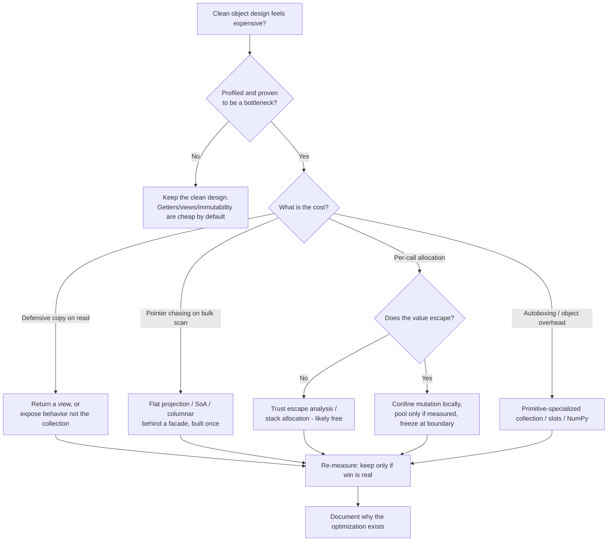

# Objects & Data Structures — Optimize & Reconcile

> Clean object design and machine sympathy are usually allies, not enemies. Encapsulation, immutability, and "Tell, Don't Ask" make code easier to reason about *and* give the compiler more freedom to optimize. But there is a real boundary — defensive copies, deep object graphs, autoboxing, per-call allocation — where a clean abstraction has a measurable cost on a hot path. This file walks that boundary scenario by scenario. The rule throughout: **stay clean by default; flatten, expose, or trust only with a number that justifies it.** Every scenario gives a concrete cost, a way to measure it, and a principled resolution. Go, Java, and Python.

---

## Table of Contents

1. [Defensive copy of a collection on every getter](#scenario-1--defensive-copy-of-a-collection-on-every-getter)
2. [Deep object graph vs flat data on a hot path (cache locality)](#scenario-2--deep-object-graph-vs-flat-data-on-a-hot-path-cache-locality)
3. [Array-of-structs vs struct-of-arrays (Data-Oriented Design)](#scenario-3--array-of-structs-vs-struct-of-arrays-data-oriented-design)
4. [Getter overhead and JIT inlining (Java)](#scenario-4--getter-overhead-and-jit-inlining-java)
5. [Property vs attribute access cost (Python)](#scenario-5--property-vs-attribute-access-cost-python)
6. [Method-call cost and pointer indirection (Go)](#scenario-6--method-call-cost-and-pointer-indirection-go)
7. [Value-object allocation and autoboxing (Java)](#scenario-7--value-object-allocation-and-autoboxing-java)
8. [Escape analysis and stack allocation (Go)](#scenario-8--escape-analysis-and-stack-allocation-go)
9. [Per-object overhead of millions of small objects (Python)](#scenario-9--per-object-overhead-of-millions-of-small-objects-python)
10. [When an anaemic data structure is the right call](#scenario-10--when-an-anaemic-data-structure-is-the-right-call)
11. [Immutability vs in-place mutation cost](#scenario-11--immutability-vs-in-place-mutation-cost)
12. [Unmodifiable view vs copy vs trusting the caller](#scenario-12--unmodifiable-view-vs-copy-vs-trusting-the-caller)
13. [Law of Demeter chains and repeated dereference](#scenario-13--law-of-demeter-chains-and-repeated-dereference)
14. [Hybrid object that blocks a layout optimization](#scenario-14--hybrid-object-that-blocks-a-layout-optimization)

- [Rules of Thumb](#rules-of-thumb)
- [Decision Flow](#decision-flow)
- [Related Topics](#related-topics)

---

### Scenario 1 — Defensive copy of a collection on every getter

**Scenario.** A clean `Order` encapsulates its lines and refuses to leak the live list. The textbook move is a defensive copy:

```java
class Order {
    private final List<OrderLine> lines = new ArrayList<>();
    public List<OrderLine> getLines() { return new ArrayList<>(lines); } // copy on read
}
```

A pricing engine reads `getLines()` thousands of times per request:

```java
for (Order order : batch) {           // 5,000 orders
    for (int pass = 0; pass < 4; pass++) {      // tax, discount, shipping, total
        for (OrderLine l : order.getLines()) { ... }  // copies the list every pass
    }
}
```

**Measurement / reasoning.** Each `new ArrayList<>(lines)` allocates a backing array and copies references. With 5,000 orders × 4 passes × an average 20-line list, that is 20,000 list allocations and 400,000 reference copies per batch — pure garbage. On a JMH microbenchmark the copying getter typically runs **3–6×** slower than a view-returning getter for read-heavy loops, and the allocation rate shows up immediately in `async-profiler -e alloc` or a JFR `Allocation` event.

<details><summary>Resolution</summary>

The defensive copy protects an invariant: callers must not mutate the order's lines. A copy is not the only way to protect it.

1. **Return an unmodifiable view** — O(1), no allocation:

   ```java
   public List<OrderLine> getLines() { return Collections.unmodifiableList(lines); }
   ```

   The wrapper is a thin object; reads pass straight through. Mutation attempts throw `UnsupportedOperationException`. This keeps the read path allocation-free while preserving the invariant.

2. **Don't expose the collection at all** (Tell, Don't Ask) — the cleanest and the fastest:

   ```java
   public BigDecimal totalTaxable() {
       return lines.stream().filter(OrderLine::isTaxable)
                   .map(OrderLine::amount).reduce(BigDecimal.ZERO, BigDecimal::add);
   }
   ```

   No view, no copy, and the caller can't iterate badly.

**Principled resolution.** Default to *not exposing the collection*. When you must expose it, return a view, not a copy. Copy only when the caller legitimately needs an independent snapshot it will mutate — and then make that the explicit method name (`copyOfLines()`), so the cost is visible at the call site.
</details>

---

### Scenario 2 — Deep object graph vs flat data on a hot path (cache locality)

**Scenario.** A clean domain model nests objects to mirror the business:

```go
type Order struct {
    Customer *Customer
    Address  *Address
    Pricing  *Pricing
    Lines    []*OrderLine   // each line is a heap pointer
}
type OrderLine struct{ Product *Product; Qty int; UnitPrice float64 }
```

A nightly job sums revenue across 10 million lines: `for each order { for each line { total += line.Qty * line.UnitPrice } }`.

**Measurement / reasoning.** Each `*OrderLine` is a separate heap allocation, scattered across memory. Following the pointer chases a cache line that is almost never resident — a last-level-cache miss costs roughly **100–300 cycles**, versus ~4 cycles for an L1 hit. With 10M independent pointer dereferences, the loop is bound by memory latency, not arithmetic. A flat `[]OrderLine` (values, not pointers) keeps lines contiguous; the prefetcher streams the next cache line while the CPU works on the current one. Benchmarks of pointer-chasing vs contiguous iteration over millions of elements routinely show **5–10×** differences.

<details><summary>Resolution</summary>

Distinguish the *domain model you reason about* from the *data layout you iterate over in bulk*.

- For ordinary request handling (a few orders), the deep graph is fine. Pointer chasing on dozens of objects is invisible.
- For the bulk aggregation, project the field you need into a flat slice once, then iterate that:

  ```go
  // Build once at load time; iterate hot.
  type LineFact struct{ Qty int; UnitPrice float64 } // 16 bytes, no pointers
  facts := make([]LineFact, 0, totalLines)
  for _, o := range orders {
      for _, l := range o.Lines { facts = append(facts, LineFact{l.Qty, l.UnitPrice}) }
  }
  var total float64
  for i := range facts { total += float64(facts[i].Qty) * facts[i].UnitPrice }
  ```

Storing `[]OrderLine` instead of `[]*OrderLine` is itself a large win — values are contiguous, no per-element heap object.

**Principled resolution.** Keep the rich graph for behavior and clarity. Introduce a flat, pointer-free projection *only* for the measured hot loop, build it once, and document why it exists. Do not flatten the whole domain on speculation — you trade clarity for a win you may never collect.
</details>

---

### Scenario 3 — Array-of-structs vs struct-of-arrays (Data-Oriented Design)

**Scenario.** A particle/physics step, an analytics scan, or any "touch one field of millions of records" loop. The natural OO layout is array-of-structs (AoS):

```java
class Particle { double x, y, z, vx, vy, vz; long id; boolean alive; } // ~64 bytes
Particle[] particles = new Particle[10_000_000];
// Hot loop only reads x and vx:
for (Particle p : particles) p.x += p.vx * dt;
```

**Measurement / reasoning.** Each cache line is 64 bytes. The loop touches only `x` and `vx` (16 bytes) but drags the entire 64-byte object (plus, in Java, a 12–16 byte object header and a pointer dereference per element) into cache. **75% of every loaded cache line is wasted.** Struct-of-arrays (SoA) stores each field in its own contiguous array, so a scan of `x[]` and `vx[]` uses 100% of every cache line and vectorizes cleanly:

```java
double[] x = new double[N], vx = new double[N];   // SoA
for (int i = 0; i < N; i++) x[i] += vx[i] * dt;
```

Bandwidth-bound SoA loops commonly run **2–4×** faster and auto-vectorize where the AoS version cannot.

<details><summary>Resolution</summary>

SoA is the canonical Data-Oriented Design transform, but it shreds encapsulation: there is no `Particle` object to pass around, validate, or attach behavior to. That cost is real.

- Keep an AoS `Particle` API for everything that manipulates *one* particle (spawn, collide, serialize) — readable and safe.
- Use SoA arrays *only inside* the measured bulk-update kernel, behind a façade:

  ```java
  final class ParticleSystem {       // SoA internally, object-ish API outside
      private final double[] x, y, z, vx, vy, vz;
      void step(double dt) { for (int i = 0; i < n; i++) x[i] += vx[i]*dt; /* ... */ }
      Particle snapshot(int i) { return new Particle(x[i], y[i], z[i], ...); }
  }
  ```

In Go, the same idea: prefer `[]Particle` over `[]*Particle`, and split into parallel slices only when a profile says the kernel is memory-bound. In Python, NumPy *is* SoA — `np.ndarray` columns are contiguous; reach for it instead of a list of objects whenever you iterate over millions of records.

**Principled resolution.** AoS for clarity and single-item logic; SoA confined to a profiled, bandwidth-bound kernel and hidden behind a clean façade. The encapsulation lives at the system boundary; the layout optimization lives inside one well-commented box.
</details>

---

### Scenario 4 — Getter overhead and JIT inlining (Java)

**Scenario.** A reviewer worries that getters cost a method call in a tight loop and proposes making fields package-private to access them directly:

```java
final class Point { private final int x, y; int x() { return x; } int y() { return y; } }
long sum = 0;
for (Point p : points) sum += p.x() + p.y();   // 200M calls
```

**Measurement / reasoning.** On HotSpot, a trivial getter like `x()` is **inlined by C2 to a field load** once the method becomes hot (the call site has crossed the compilation threshold and the type is stable/monomorphic). After inlining, `p.x()` and direct field access compile to the *identical* machine code — a single field load. A JMH benchmark shows **zero measurable difference**; the getter is free. Inlining can be confirmed with `-XX:+UnlockDiagnosticVMOptions -XX:+PrintInlining`.

The getter only stops being free when the call site is **megamorphic** (the JIT sees 3+ concrete implementations through an interface), or with inlining disabled, or below the warm-up threshold.

<details><summary>Resolution</summary>

Do nothing. Keep the getters; do not expose fields to "save" a call that does not exist after JIT compilation. Breaking encapsulation here buys nothing and forfeits the invariant that `Point` is immutable.

If a profile ever shows a getter *not* inlining, the cause is almost always polymorphism, not the getter itself:

- Mark the class `final` (helps the JIT prove monomorphism).
- If an interface call is genuinely megamorphic in a hot loop, that is a design issue (too many implementations on one hot path), not a reason to delete getters.

**Principled resolution.** In Java, trivial accessors are free on hot paths — measure before believing otherwise. Encapsulation costs nothing here; keep it.
</details>

---

### Scenario 5 — Property vs attribute access cost (Python)

**Scenario.** A clean `Celsius` wraps a stored value behind a `@property` so the field stays validated:

```python
class Reading:
    def __init__(self, c): self._c = c
    @property
    def celsius(self): return self._c
```

A loop processes 50 million readings: `total = sum(r.celsius for r in readings)`.

**Measurement / reasoning.** Unlike Java, CPython does **not** inline. A `@property` access invokes the descriptor protocol: a `__get__` call and a Python-level function call. A plain attribute access (`r._c`) is a single dict lookup. Microbenchmarks put `@property` access at roughly **4–6×** the cost of a bare attribute (on the order of ~50 ns vs ~10 ns per access in CPython 3.11). At 50M iterations that is seconds of pure overhead.

`__slots__` changes the picture for *attribute* access (slot access is a C-level array index, faster and far smaller than a `__dict__` entry) but does not make a `@property` cheaper.

<details><summary>Resolution</summary>

1. **Don't pay for a property that does nothing.** If `celsius` only returns `self._c` with no validation or computation, expose a plain attribute named `celsius`. A property earns its cost only when it validates, computes, or lazily caches. "A property in case I need logic later" is speculative — add it when the logic arrives (Python lets you swap an attribute for a property without changing call sites).

2. **For the hot aggregate, bypass per-object access entirely.** If you are summing 50M readings, you are in NumPy/array territory:

   ```python
   import numpy as np
   celsius = np.fromiter((r._c for r in readings), dtype=np.float64)
   total = celsius.sum()        # vectorized C loop, no per-element Python call
   ```

3. **Add `__slots__`** to the class regardless — it cuts per-instance memory and speeds plain attribute access.

**Principled resolution.** Use `@property` for real encapsulation logic, not as reflexive ceremony. On a genuinely hot scan, the right answer is rarely "tune the property" — it is "stop touching one Python object at a time" and move the column into a NumPy array.
</details>

---

### Scenario 6 — Method-call cost and pointer indirection (Go)

**Scenario.** A clean Go design exposes behavior through an interface and small accessor methods:

```go
type Priced interface{ Price() float64 }
func total(items []Priced) float64 {
    var t float64
    for _, it := range items { t += it.Price() }   // interface dispatch per element
    return t
}
```

**Measurement / reasoning.** Go does not have a JIT; the compiler inlines aggressively at build time but **cannot inline a call through an interface** — `it.Price()` is an indirect call via the itab, which also defeats inlining of `Price`'s body and acts as an optimization barrier. A concrete `[]Concrete` with a value-receiver method that fits the inliner's budget gets inlined to a field load. The interface version pays an indirect-call cost (a handful of cycles plus a branch-predictor and inlining penalty) on every element. Confirm inlining decisions with `go build -gcflags='-m'`.

<details><summary>Resolution</summary>

- Interface dispatch is cheap in absolute terms; for ordinary code it is irrelevant and the polymorphism is worth it. Keep it.
- For a measured hot loop over a homogeneous collection, iterate over the concrete type so the method inlines:

  ```go
  func totalConcrete(items []LineItem) float64 {
      var t float64
      for i := range items { t += items[i].Price() } // Price() inlines to field math
      return t
  }
  ```

  Using `items[i]` rather than `for _, it := range` also avoids copying each struct into the loop variable when the struct is large.

- Value receivers vs pointer receivers: a value receiver copies the struct on each call. For a large struct in a hot loop, a pointer receiver avoids the copy — but a pointer receiver can push the value to the heap (see Scenario 8). Measure both with a benchmark.

**Principled resolution.** Keep interfaces for genuine polymorphism. Specialize to a concrete type only inside a profiled hot loop, and let `-gcflags='-m'` confirm the call actually inlined before you claim a win.
</details>

---

### Scenario 7 — Value-object allocation and autoboxing (Java)

**Scenario.** A clean design models money and quantities as value objects and stores keyed sums in a generic map:

```java
record Money(long minorUnits) {}
Map<CustomerId, Long> totals = new HashMap<>();   // boxed Long
for (Order o : orders) {                          // 10M orders
    totals.merge(o.customer(), o.amount(), Long::sum); // autoboxes long -> Long
}
```

**Measurement / reasoning.** `Map<K, Long>` cannot store a primitive; every `long` is boxed into a `Long` object (16 bytes + header) on insert/merge. The cache `Long.valueOf` maintains only covers −128..127, so business amounts box freshly every time. Ten million merges generate millions of short-lived `Long` objects — measurable GC pressure visible in JFR allocation profiling and as elevated minor-GC frequency. Autoboxing in arithmetic-heavy generic collections is one of the most common silent allocation sources in Java.

<details><summary>Resolution</summary>

- The `Money` *record* itself is cheap and often does not escape; HotSpot escape analysis can scalar-replace a non-escaping record so it never hits the heap. Records are not the problem here — the boxed `Long` value type in the map is.
- Eliminate boxing with a primitive-specialized map (e.g. Eclipse Collections `ObjectLongHashMap`, or fastutil `Object2LongOpenHashMap`):

  ```java
  Object2LongOpenHashMap<CustomerId> totals = new Object2LongOpenHashMap<>();
  for (Order o : orders) totals.addTo(o.customer(), o.amount()); // no boxing
  ```

- Verify escape analysis with `-XX:+PrintEscapeAnalysis` (diagnostic VM options); verify allocation with JFR or `async-profiler -e alloc`.

**Principled resolution.** Value objects (records) are clean *and* cheap when they don't escape — keep them. The real cost is generic collections forcing autoboxing of primitives; reach for a primitive-specialized collection on the proven hot path rather than abandoning the value-object design.
</details>

---

### Scenario 8 — Escape analysis and stack allocation (Go)

**Scenario.** A small immutable value object is returned by a constructor function on a hot path:

```go
type Vec struct{ X, Y, Z float64 }
func Add(a, b Vec) Vec { return Vec{a.X + b.X, a.Y + b.Y, a.Z + b.Z} }

func NewVec(x, y, z float64) *Vec { return &Vec{x, y, z} } // returns a pointer
func step() { v := NewVec(1, 2, 3); use(v) }               // 1M/sec
```

**Measurement / reasoning.** Go's escape analysis decides at compile time whether a value can stay on the stack. A `Vec` *value* passed and returned by value (`Add`) never escapes — zero allocation. But `NewVec` returns `*Vec`; because the pointer leaves the function, the compiler must **heap-allocate** the `Vec`. Each call is one heap allocation plus future GC work. `go build -gcflags='-m'` prints `&Vec{...} escapes to heap`. A benchmark with `-benchmem` shows the allocs/op directly.

<details><summary>Resolution</summary>

- Prefer **value semantics** for small immutable types. Return `Vec`, not `*Vec`; pass `Vec`, not `*Vec`. Small structs (a few words) are cheaper to copy than to allocate and chase:

  ```go
  func NewVec(x, y, z float64) Vec { return Vec{x, y, z} } // stays on stack at call sites
  ```

- A pointer is justified when the struct is large (copying dominates) or must be shared/mutated. Otherwise pointers *cost* you here by forcing heap escape.
- Always confirm with `go test -bench . -benchmem` and `-gcflags='-m'`; intuition about escape is unreliable.

**Principled resolution.** Clean Go and fast Go agree: small immutable value objects passed by value stay on the stack and cost nothing. Reach for a pointer only with a size/sharing reason — and verify it didn't silently move the value to the heap.
</details>

---

### Scenario 9 — Per-object overhead of millions of small objects (Python)

**Scenario.** A clean model represents each event as a small class instance:

```python
class Event:
    def __init__(self, ts, code, value):
        self.ts, self.code, self.value = ts, code, value
events = [Event(ts, c, v) for ts, c, v in raw]   # 10M events
```

**Measurement / reasoning.** A default Python object carries a per-instance `__dict__`. A bare `Event` with three fields costs roughly **150–200+ bytes** (object header + a dict). Ten million of them is on the order of **1.5–2 GB** — often an outright OOM. The `__dict__` also makes attribute access a hash lookup. This is the dominant cost of "rich object per row" at scale in CPython.

<details><summary>Resolution</summary>

Match the structure to the access pattern.

1. **`__slots__`** removes the per-instance dict; fields live in a fixed C array. Memory per instance drops to roughly **50–70 bytes** (often a 2–3× reduction) and attribute access speeds up:

   ```python
   class Event:
       __slots__ = ("ts", "code", "value")
       def __init__(self, ts, code, value):
           self.ts, self.code, self.value = ts, code, value
   ```

2. **Columnar / NumPy** when you scan rather than navigate object-by-object — store `ts`, `code`, `value` as three arrays. Memory collapses to the raw data size and scans run in C.

3. **`@dataclass(frozen=True, slots=True)`** (3.10+) gives you a clean immutable value object *and* the slots saving in one declaration.

**Principled resolution.** A rich object per row is clean but, in CPython, expensive at scale. Add `__slots__` essentially for free; switch to a columnar layout when you are scanning millions of rows rather than manipulating individual ones. Let the access pattern, not aesthetics, pick the layout.
</details>

---

### Scenario 10 — When an anaemic data structure is the right call

**Scenario.** "Anaemic domain model" — a struct with data and no behavior — is an anti-pattern in this chapter. But a serializer, a JSON request body, and a hot-loop record are all legitimately anaemic. A DTO crossing the wire:

```go
type PriceTick struct{ Symbol string; Bid, Ask float64; Ts int64 } // pure data, no methods
```

**Measurement / reasoning.** A DTO/record/struct has a precise reason to be anaemic: it is a *boundary representation*, not a domain entity. Attaching behavior to it (validation, derived fields computed in getters) couples the wire format to logic and, on a hot ingest path that decodes millions of ticks, adds work to every record. The anti-pattern is an anaemic *domain* object — one that *should* own behavior but pushes it into service classes. A DTO has no behavior to own.

<details><summary>Resolution</summary>

Separate the two roles explicitly:

- **Data structures** (DTOs, records, wire/DB rows, hot-loop facts) are properly anaemic. Make them plain, flat, and behavior-free. Java `record`, Go plain struct, Python `@dataclass(slots=True)`. This is fast and correct.
- **Domain objects** own behavior and protect invariants. Keep them rich.
- Convert at the boundary: parse the anaemic DTO into a validated domain object once, on the way in. (Parse, Don't Validate.)

Per *Clean Code* and *Refactoring*, the rule is "data structures *or* objects, not hybrids" — being deliberately anaemic for a data structure is correct; the smell is the *hybrid* and the misplaced-behavior domain anaemia.

**Principled resolution.** Anaemic is the *right* design for a data-transfer/record type, especially on a hot path. Reserve rich behavior for domain objects. The mistake is mixing the two — not having a behavior-free struct where a behavior-free struct belongs.
</details>

---

### Scenario 11 — Immutability vs in-place mutation cost

**Scenario.** An immutable value object returns a new instance on every "change", which is clean and thread-safe. A simulation updates a position 60 times/sec for 100k entities:

```java
record Position(double x, double y) {
    Position moved(double dx, double dy) { return new Position(x + dx, y + dy); } // new object
}
```

**Measurement / reasoning.** 100k entities × 60 Hz = 6M `Position` allocations per second. Even with cheap young-gen allocation and escape analysis, sustained churn raises minor-GC frequency and can hurt tail latency. In Python, immutable rebuild plus per-object overhead is far worse. In Go, a value-type `Position` returned by value does *not* allocate (Scenario 8), so the same pattern is free there. The cost of immutability is language-specific: it is "a young-gen allocation" in Java, "near zero" for small Go value types, and "a new heavy object" in CPython.

<details><summary>Resolution</summary>

- **Default to immutability.** It eliminates whole classes of aliasing and concurrency bugs, and for the common case the allocation is cheap and short-lived. Don't trade that safety away on speculation.
- **Bulk hot loops** that dominate a profile may justify mutation *inside a confined region*. Use a mutable buffer locally and freeze on exit, or — in Java — let escape analysis scalar-replace the temporary `Position` (it often does when the object doesn't escape; verify, don't assume).
- In Go, keep the immutable value-returning style — it is already allocation-free for small structs.
- In Python, prefer a NumPy array of positions for 100k×60 Hz updates; per-object immutability does not scale to that volume.

**Principled resolution.** Immutability is the default for correctness and is cheap in most cases. Permit localized, encapsulated mutation only where a profiler shows allocation churn is the bottleneck, and keep the mutable window as small as possible so the immutable guarantee holds at the API boundary.
</details>

---

### Scenario 12 — Unmodifiable view vs copy vs trusting the caller

**Scenario.** Three ways to expose internal collection state, each with a different cost/safety trade-off:

```java
List<T> getA() { return new ArrayList<>(items); }            // (1) defensive copy
List<T> getB() { return Collections.unmodifiableList(items); }// (2) view
List<T> getC() { return items; }                              // (3) trust the caller
```

**Measurement / reasoning.** (1) is O(n) and allocates on every call — safe against both mutation *and* later structural change of the source. (2) is O(1) and allocation-free but is a *live* view: if the source mutates later, the view reflects it, and the caller cannot mutate it. (3) is O(1) and free but leaks the live, mutable list — any caller can corrupt the invariant. The right choice depends on the threat, not on a blanket rule.

<details><summary>Resolution</summary>

Decide by what the caller is allowed to do and how often:

- **Caller reads, frequently, must not mutate:** unmodifiable **view** (2). Free reads, invariant preserved. This is the default.
- **Caller needs a stable snapshot it will keep while the source changes (or will mutate its own copy):** **copy** (1) — and name the method so the cost is explicit (`linesSnapshot()`).
- **Caller is internal/trusted and the type is package-private:** trusting (3) is acceptable *only* inside a module boundary you control; never across a public API.
- **Best of all:** don't expose the collection — expose the operations (Tell, Don't Ask), which removes the question entirely.

```java
public Stream<T> items() { return items.stream(); }  // read access, no mutation, no copy
public int size() { return items.size(); }
```

**Principled resolution.** View by default; copy only when the caller genuinely needs an independent snapshot (and make that explicit); trust only within a controlled boundary. The cleanest design exposes behavior, not the container, sidestepping the copy-vs-view cost altogether.
</details>

---

### Scenario 13 — Law of Demeter chains and repeated dereference

**Scenario.** A "train wreck" both violates the Law of Demeter and re-walks the same pointer chain repeatedly:

```python
def shipping_cost(order):
    if order.customer.address.country.code == "US": base = 5
    else: base = 20
    return base * order.customer.address.zone.multiplier   # walks customer.address again
```

**Measurement / reasoning.** Each `.` is an attribute lookup; `order.customer.address` is dereferenced multiple times. In CPython every hop is a dict/`__getattr__` lookup (~tens of ns each), and the chain is computed twice. The clean fix and the fast fix coincide: stop reaching through the graph. The Demeter violation is also a *coupling* smell — `shipping_cost` knows the entire shape of `order` four levels deep.

<details><summary>Resolution</summary>

1. **Bind the intermediate once** — removes the repeated walk:

   ```python
   def shipping_cost(order):
       addr = order.customer.address
       base = 5 if addr.country.code == "US" else 20
       return base * addr.zone.multiplier
   ```

2. **Better — Tell, Don't Ask.** Move the calculation to the object that owns the data, so the caller never walks the chain:

   ```python
   class Address:
       def shipping_base(self): return 5 if self.country.code == "US" else 20
   def shipping_cost(order):
       addr = order.customer.address
       return addr.shipping_base() * addr.zone.multiplier
   ```

The second form decouples the caller from the graph shape *and* localizes the dereferences. In Java/Go the dereferences are nearly free individually, but the coupling cost of the train wreck is identical, and a long chain through interfaces can also block inlining.

**Principled resolution.** Don't micro-optimize a Demeter chain by caching dereferences and calling it done — that treats the symptom. Push the behavior onto the owning object (Tell, Don't Ask); you remove the coupling, the repeated walk, and the smell in one move.
</details>

---

### Scenario 14 — Hybrid object that blocks a layout optimization

**Scenario.** A struct that is *mostly* data picks up a couple of bolted-on methods and a lazily-computed cached field — a hybrid:

```go
type Row struct {
    A, B, C float64
    cached  *float64    // lazily computed, mutates the struct
    mu      sync.Mutex  // guards the cache
}
func (r *Row) Derived() float64 { /* lock, compute-once, store in r.cached */ }
```

A bulk analytics pass scans 50M `Row`s reading only `A` and `B`.

**Measurement / reasoning.** The hybrid bloats the struct (`cached` pointer + `sync.Mutex` ≈ extra 16+ bytes), worsening cache density for the scan (Scenario 3), and forces every `Row` to be addressable/pointer-shared because `Derived()` mutates through a pointer receiver — which can push `Row` to the heap (Scenario 8) and blocks treating `[]Row` as flat value data. The mixed concern (data + lazy-cache behavior + locking) is exactly the hybrid the chapter warns against, and here it has a measurable layout cost.

<details><summary>Resolution</summary>

Split the data from the derived behavior:

```go
type Row struct{ A, B, C float64 }              // pure, flat, cache-dense, 24 bytes

// Derived computation lives elsewhere; cache it in a separate map/array keyed by index.
func derive(rows []Row) []float64 {
    out := make([]float64, len(rows))
    for i := range rows { out[i] = rows[i].A*rows[i].B + rows[i].C }
    return out
}
```

`Row` becomes a clean data structure (Scenario 10): flat, contiguous, value-copyable, no lock. The scan over `A`/`B` is dense. Derived values are computed in a separate column when needed, batch-style, with no per-row locking.

**Principled resolution.** The hybrid is both a design smell and a layout pessimization. Separating the pure data structure from the derived/cached behavior restores cache density and value semantics *and* satisfies the "data structures or objects, not both" rule — the clean fix is the fast fix.
</details>

---

## Rules of Thumb

- **Clean is the default; flatten only with a number.** Encapsulation, immutability, and small accessors are usually free or near-free. Break them only with a profile that quantifies the win.
- **Return a view, not a copy.** Defensive copies on read are the most common self-inflicted allocation cost. Use `Collections.unmodifiableList`, a read-only slice convention, or — better — don't expose the collection at all.
- **Tell, Don't Ask removes the cost question.** If the caller never gets the container, there is no copy-vs-view-vs-trust trade-off and no Demeter chain to walk.
- **Getters are free where it matters (Java).** HotSpot inlines trivial accessors to field loads on hot, monomorphic call sites. Don't expose fields to "save" a call that the JIT already erased. Properties in Python are *not* free — use them for real logic, not ceremony.
- **Match layout to access pattern.** Navigate individual objects → rich graph. Scan millions of records on one field → flat/SoA/columnar (NumPy in Python, `[]T` not `[]*T` in Go, parallel arrays in Java) — behind a façade.
- **Prefer value semantics for small immutable types.** Java records and Go value structs often avoid the heap entirely (scalar replacement / stack allocation). Verify with `-XX:+PrintEscapeAnalysis` or `go build -gcflags='-m'`.
- **Watch autoboxing and per-object overhead.** Java generic collections box primitives — use primitive-specialized maps on hot paths. CPython objects cost 150+ bytes each — add `__slots__`, or go columnar at millions-of-rows scale.
- **Anaemic is correct for data structures.** DTOs, records, and hot-loop facts *should* be behavior-free. The smell is the hybrid and the anaemic *domain* object — not a deliberately plain data type.
- **Measure, don't guess.** JMH + JFR + async-profiler (Java); `go test -bench -benchmem` + `pprof` + `-gcflags='-m'` (Go); `timeit` + `tracemalloc` + a profiler (Python). Intuition about allocation, inlining, and escape is routinely wrong.

## Decision Flow



## Related Topics

- [find-bug.md](find-bug.md) — spot the encapsulation and data/object-hybrid defects this file optimizes around.
- [professional.md](professional.md) — production judgment on when rich domain objects vs flat data structures are appropriate.
- [Chapter README](../README.md) — the positive rules for objects and data structures.
- [Immutability](../14-immutability/README.md) — the correctness case behind Scenario 11's immutability-vs-mutation trade-off.
- [Functional Programming](../../functional-programming/README.md) — immutable values and data-as-data, the broader paradigm behind anaemic data structures done right.
