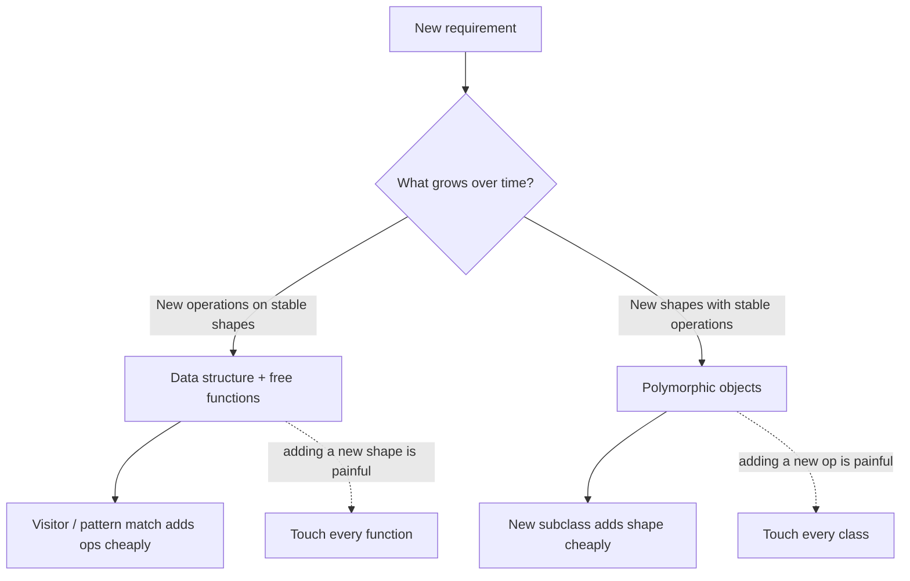
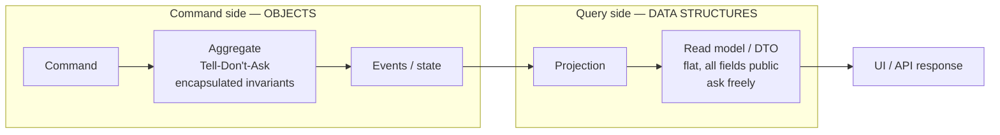

# Objects & Data Structures — Professional Level

> Focus: the deep end and the exceptions. Where Clean Code's object-bias is *wrong* — Data-Oriented Design, cache layout, value semantics, the real Law of Demeter, Tell-Don't-Ask vs. CQRS read models, encapsulation in languages without privacy, and the measurable cost of defensive copying. Cite sources. Know when the data structure beats the object.

---

## Table of Contents

1. [The data/object asymmetry — what Clean Code actually claims](#the-dataobject-asymmetry--what-clean-code-actually-claims)
2. [Data-Oriented Design — when exposing data is faster and clearer](#data-oriented-design--when-exposing-data-is-faster-and-clearer)
3. [Memory layout: objects-with-behavior vs. flat data](#memory-layout-objects-with-behavior-vs-flat-data)
4. [The Law of Demeter — Lieberherr's real definition vs. the folk version](#the-law-of-demeter--lieberherrs-real-definition-vs-the-folk-version)
5. [Tell-Don't-Ask and its limits: CQRS and read models](#tell-dont-ask-and-its-limits-cqrs-and-read-models)
6. [Encapsulation without privacy: Go and Python](#encapsulation-without-privacy-go-and-python)
7. [Value objects, equality, and immutability](#value-objects-equality-and-immutability)
8. [Serialization as a forcing function for data structures](#serialization-as-a-forcing-function-for-data-structures)
9. [The cost of defensive copying](#the-cost-of-defensive-copying)
10. [A case where the data structure beats the object](#a-case-where-the-data-structure-beats-the-object)
11. [Common Mistakes](#common-mistakes)
12. [Test Yourself](#test-yourself)
13. [Cheat Sheet](#cheat-sheet)
14. [Summary](#summary)
15. [Further Reading](#further-reading)
16. [Related Topics](#related-topics)

---

## The data/object asymmetry — what Clean Code actually claims

Most engineers misquote *Clean Code* Chapter 6. Robert Martin's actual thesis is a **duality**, not "always use objects":

> "Objects hide their data behind abstractions and expose functions that operate on that data. Data structures expose their data and have no meaningful functions." — Martin, *Clean Code* (2008), Ch. 6

> "Objects and data structures are virtual opposites." — *ibid.*

He then states the consequence precisely, naming it the **anti-symmetry**:

> "Procedural code makes it easy to add new functions without changing the existing data structures. OO code makes it easy to add new classes without changing existing functions. The complement is also true: procedural code makes it hard to add new data structures because all the functions must change. OO code makes it hard to add new functions because all the classes must change."

This is the **Expression Problem** (Wadler, 1998) restated. The chapter's own conclusion is the one most readers skip:

> "Mature programmers know that the idea that everything is an object is a myth. Sometimes you really do want simple data structures with procedures operating on them."

So the professional question is never "object or data structure?" in the abstract. It is: **does this axis of change add operations, or add representations?** If operations grow (you keep adding new things to *do* with a fixed set of shapes), prefer data + functions. If representations grow (you keep adding new *shapes* with a fixed set of operations), prefer polymorphic objects. Pattern-matching languages (Rust `enum` + `match`, Scala sealed traits, Java sealed interfaces + switch) let you choose per call site instead of per type.



---

## Data-Oriented Design — when exposing data is faster and clearer

Mike Acton's CppCon 2014 talk *"Data-Oriented Design and C++"* is the canonical broadside against object-oriented data hiding for performance code. His three lies of OO, paraphrased:

1. **Software is a platform** — false; the hardware is the platform, and hardware is a data-transformation machine.
2. **Code should be designed around the model of the world** — false; this couples your memory layout to a human mental model, not to access patterns.
3. **Code is more important than data** — false; *"The purpose of all programs, and all parts of those programs, is to transform data from one form to another."*

DOD's prescriptive core: **organize memory by how it is accessed, not by conceptual ownership.** The flagship transformation is **Array of Structs → Struct of Arrays (AoS → SoA).**

```go
// AoS — the "object" instinct. One Particle owns all its fields.
type Particle struct {
    X, Y, Z    float32 // position
    VX, VY, VZ float32 // velocity
    R, G, B, A uint8    // color
    Mass       float32
    Lifetime   float32
}
particles := make([]Particle, 1_000_000)

// A physics tick only needs position + velocity. But each Particle is ~44 bytes,
// so iterating positions drags color and mass through cache uselessly.
func integrate(ps []Particle, dt float32) {
    for i := range ps {
        ps[i].X += ps[i].VX * dt
        ps[i].Y += ps[i].VY * dt
        ps[i].Z += ps[i].VZ * dt
    }
}
```

```go
// SoA — "expose the data". Hot fields are contiguous; cold fields don't pollute cache.
type Particles struct {
    X, Y, Z    []float32
    VX, VY, VZ []float32
    R, G, B, A []uint8
    Mass       []float32
    Lifetime   []float32
}

func (p *Particles) Integrate(dt float32) {
    for i := range p.X {
        p.X[i] += p.VX[i] * dt
        p.Y[i] += p.VY[i] * dt
        p.Z[i] += p.VZ[i] * dt
    }
}
```

The SoA loop touches only the six float32 slices that the transform reads/writes. Every cache line it loads is 100% useful. The AoS loop wastes ~60% of each 64-byte line on color/mass it never reads. On a 1M-particle workload this is routinely a **3–10× difference** in wall-clock time — not from a better algorithm, but from respecting the cache. Clean Code's "expose your data and have no methods" is *exactly right* here, and "hide your data behind behavior" is a measurable mistake.

This is not a niche concern. The same principle drives **columnar databases** (Parquet, Arrow, ClickHouse), **ECS game architectures** (Unity DOTS, Bevy), and **dataframe libraries** (pandas, Polars). All of them expose flat, typed columns precisely because the access pattern is "one field across many rows," not "all fields of one row."

---

## Memory layout: objects-with-behavior vs. flat data

The cost of "objects with behavior" is rarely the methods — methods are inlined (see [the Bloaters professional notes](../../refactoring/01-code-smells/01-bloaters/professional.md)). The cost is **indirection and header overhead**.

### Heap of pointers vs. contiguous values

In Java, `List<Order>` is an array of *references*. Each `Order` lives at an arbitrary heap address with a 12–16-byte object header (mark word + class pointer; compressed oops on by default below the 32 GB heap threshold). Iterating the list is a **pointer-chase**: load reference → dereference to random address → cache miss. A C `Order[]` or Go `[]Order` (of value type, not `[]*Order`) is contiguous — the prefetcher predicts the stride and stays ahead of you.

| Representation | Layout | Iteration cost |
|---|---|---|
| Java `Order[]` (objects) | array of pointers → scattered heap | pointer-chase, ~1 cache miss/element |
| Go `[]Order` (value structs) | contiguous values | streamed, prefetcher-friendly |
| Go `[]*Order` (pointers) | array of pointers → scattered heap | pointer-chase (same as Java) |
| C `struct Order[]` | contiguous values | streamed |
| Java with Valhalla `value class` | flattened in arrays (target) | streamed (when it ships) |

The Go lesson is sharp: `[]Order` and `[]*Order` look almost identical in source but have opposite memory behavior. Choosing the value slice is a *data-structure* decision that the object mindset actively discourages ("share by reference, encapsulate identity").

### Verify, don't guess

```bash
# Java — actual object header + field offsets
java -jar jol-cli.jar internals com.example.Order

# Go — does this value escape to the heap (forced pointer-chase) or stay on the stack/contiguous?
go build -gcflags='-m' ./...

# Linux — measure the actual cache-miss rate of the two layouts
perf stat -e cache-misses,cache-references ./bench
```

### Python is a special case

In CPython *everything* is a boxed `PyObject` on the heap — even an `int`. A `list` of objects is always a pointer-chase, and a class instance carries a `__dict__` unless you declare `__slots__`. The DOD escape hatch in Python is to **not** use objects at all for bulk numeric data: use NumPy/Polars, which store flat C buffers behind a thin object. The "object" is a handle; the data is a contiguous array. That is SoA dressed as Python.

---

## The Law of Demeter — Lieberherr's real definition vs. the folk version

Almost everyone states the Law of Demeter (LoD) wrong. The folk version — **"only one dot per line"** — is a syntactic heuristic that is both too strict and too loose. The real definition, from Karl Lieberherr and Ian Holland, *"Assuring Good Style for Object-Oriented Programs"* (IEEE Software, 1989), is about **whom a method may talk to**, not about dots.

> **LoD (object form):** A method `M` of an object `O` may only invoke the methods of the following kinds of objects:
> 1. `O` itself;
> 2. `M`'s parameters;
> 3. any objects created/instantiated within `M`;
> 4. `O`'s direct component objects (its fields);
> 5. a global variable accessible by `O`.

Why "one dot" is wrong both ways:

- **Too loose:** `this.repo.save(...)` is one dot but may still violate LoD if `repo` was not a direct component, parameter, or local — the *count* of dots is irrelevant.
- **Too strict:** a **fluent builder** `new Request().method("GET").url(u).header(h).build()` chains many dots but never violates LoD, because each call returns the *same* object (`this`) — you are talking to one collaborator, not navigating a structure. Likewise a Java Stream pipeline `list.stream().filter(p).map(f).collect(c)` is fine. The "Law" targets **structure navigation** (`a.getB().getC().getD()`), where each `get` returns a *different* class you now depend on.

The deeper point Lieberherr makes is that LoD reduces **coupling to the shape of the object graph.** `order.getCustomer().getAddress().getZip()` hard-codes three structural assumptions; if `Customer` stops owning an `Address` directly, the caller breaks. The cure is **Tell, Don't Ask** — push the operation to where the data lives: `order.shippingZip()`.

```java
// Train wreck — violates LoD, couples caller to Customer AND Address internals.
String zip = order.getCustomer().getAddress().getZip();

// LoD-respecting — Order exposes the answer, not the path.
String zip = order.shippingZip();
```

```python
# Folk "one dot" passes this, but it's still a navigation across three classes:
total = order.invoice.summary.grand_total   # LoD violation in spirit

# Better: the operation lives with the data it needs.
total = order.grand_total()
```

**The exception that matters:** LoD applies to **objects**, not **data structures**. *Clean Code* is explicit: a data structure that exposes public fields is *supposed* to be navigated — `point.x`, `address.zip` — and chaining accessors on a pure data holder is **not** a Demeter violation. Applying LoD to DTOs, config records, or AST nodes is cargo-culting. Know which side of the object/data divide you are on before invoking the Law.

---

## Tell-Don't-Ask and its limits: CQRS and read models

**Tell-Don't-Ask** (Pragmatic Programmers; Alec Sharp, 1997) says: don't pull state out of an object to make a decision and push it back — tell the object to make the decision. It is the behavioral sibling of encapsulation, and it is correct for the **command** side of a system, where invariants must be enforced atomically.

```java
// Ask — the logic lives outside, the object is a dumb bag, the invariant is unguarded.
if (account.getBalance() >= amount) {
    account.setBalance(account.getBalance() - amount);
}

// Tell — the object enforces its own invariant; no caller can corrupt it.
account.withdraw(amount); // throws InsufficientFunds if it can't
```

But Tell-Don't-Ask **breaks down for reads.** The whole point of a query is to *ask*. Forcing every read through behavior produces bloated aggregates that expose dozens of `getXForDisplay()` methods purely to feed a UI. This is where **CQRS** (Command Query Responsibility Segregation — Greg Young, building on Bertrand Meyer's Command-Query Separation) resolves the tension:

- **Command side:** rich domain **objects**. Tell-Don't-Ask, encapsulated invariants, no getters that leak state. You *tell* the aggregate to do something.
- **Query side:** flat **read models / DTOs**. Pure **data structures**, all fields exposed, built for the view. You *ask* freely. No behavior, no invariants — they are projections, often denormalized, sometimes a raw SQL `SELECT` straight into a record.



The professional insight: **Tell-Don't-Ask and "expose your data" are not in conflict — they govern different sides of the same system.** Anyone who applies Tell-Don't-Ask to a read model has misread the principle; anyone who exposes setters on an aggregate has misread encapsulation. CQRS makes the boundary explicit, which is why Martin's object/data duality and Young's CQRS are the same idea wearing different hats.

---

## Encapsulation without privacy: Go and Python

Encapsulation is a *design* property — controlling who can break an invariant — not a *language keyword*. Two mainstream languages enforce it without `private`.

### Go — package-level encapsulation

Go has no `private`/`public` keyword. Visibility is **identifier capitalization**, scoped to the **package**, not the type. A lowercase field is invisible outside its package; uppercase is exported. The unit of encapsulation is therefore the **package**, and the idiom is the **unexported struct + exported constructor**.

```go
package money

// Money's field is unexported: no code outside package `money` can read or
// write `cents` directly. The invariant (non-negative, integer cents) is safe.
type Money struct {
    cents int64
}

func New(dollars int64, cents int64) (Money, error) {
    if cents < 0 || cents > 99 {
        return Money{}, fmt.Errorf("cents out of range: %d", cents)
    }
    return Money{cents: dollars*100 + cents}, nil
}

func (m Money) Cents() int64 { return m.cents } // controlled read, no setter
```

Subtleties professionals must know:
- **Same-package code sees everything.** Encapsulation in Go protects you from *other* packages, not from yourself. Keep packages cohesive and small or the boundary is meaningless.
- The **zero value** is always reachable: `Money{}` (0 cents) bypasses your constructor. Design so the zero value is either valid or obviously-uninitialized; you cannot forbid it.
- `reflect` + `unsafe` can still read unexported fields. Encapsulation is a *compile-time* contract, not a security boundary.

### Python — convention-only privacy

Python has **no enforcement at all**. There are only conventions:
- `_name` — "internal, don't touch" (honored by linters and humans, not the runtime).
- `__name` — **name mangling** (`__x` in class `C` becomes `_C__x`). This is *not* privacy; it exists to avoid accidental override collisions in subclasses. `obj._C__x` reads it fine.

```python
class Account:
    def __init__(self, balance: int) -> None:
        self.__balance = balance  # mangled to _Account__balance, not truly private

    def withdraw(self, amount: int) -> None:
        if amount > self.__balance:
            raise ValueError("insufficient funds")
        self.__balance -= amount

a = Account(100)
a._Account__balance = -999   # the runtime lets you. Nothing stops it.
```

The Pythonic stance (PEP 8): *"We're all consenting adults here."* Encapsulation in Python is a **social contract reinforced by tooling**, not a guarantee. The practical cures:
- `@dataclass(frozen=True)` to make accidental mutation raise `FrozenInstanceError`.
- `@property` for computed/validated access without a public attribute.
- Type checkers (mypy/pyright) flag access to `_underscore` members across module boundaries.

**Cross-language takeaway:** the encapsulation *boundary* differs (Java: class; Go: package; Python: nothing but convention). The *design discipline* — expose behavior, guard invariants, don't leak mutable internals — is identical and is your responsibility regardless of what the compiler enforces.

---

## Value objects, equality, and immutability

A **value object** (Evans, *Domain-Driven Design*, 2003) has no identity — two instances with the same attributes are interchangeable. `Money(5, "USD")` *is* every other `Money(5, "USD")`. This demands **structural equality** and, almost always, **immutability**.

The professional traps cluster around equality and mutability:

| Language | Idiom | Equality | Mutable trap |
|---|---|---|---|
| Java | `record Money(long cents, Currency ccy) {}` | auto `equals`/`hashCode` by components | a `record` field of a mutable type (`List`, `Date`) is still mutable; record only freezes the *reference* |
| Go | `struct{cents int64; ccy Currency}` | `==` works **only if all fields are comparable** (no slices/maps/funcs); else write `Equal()` | structs are copied by value — accidental copy of a "shared" object |
| Python | `@dataclass(frozen=True)` | auto `__eq__`/`__hash__` | `frozen=True` blocks attribute *rebinding*, not mutation of a mutable field's contents |

Three rules that separate professionals from juniors here:

1. **`equals` and `hashCode` (or `__eq__`/`__hash__`) must move together.** A value object used as a map key with `equals` overridden but `hashCode` not is a silent data-loss bug — the JVM is allowed to lose your entries. Java `record`s and Python frozen dataclasses generate both consistently; that is the main reason to prefer them over hand-rolled classes.

2. **Immutability is what makes value equality safe.** If a value object is mutable and used as a hash key, mutating it after insertion strands the entry (its bucket no longer matches its hashcode). Value objects that key maps **must** be immutable. See [the immutability chapter](../14-immutability/README.md).

3. **Go's `==` is a footgun across versions.** Adding a slice field to a previously-comparable struct turns `a == b` from a compile-time-valid operation into a *compile error* — a breaking change to every caller. For public value types, define an explicit `Equal(other) bool` method up front so the contract doesn't depend on field types.

```go
type Money struct {
    cents int64
    ccy   string
}
// Explicit Equal future-proofs against adding non-comparable fields later.
func (m Money) Equal(o Money) bool { return m.cents == o.cents && m.ccy == o.ccy }
```

---

## Serialization as a forcing function for data structures

Serialization is where the object/data divide stops being philosophical. **You cannot serialize behavior — only state.** The moment data must cross a boundary (network, disk, queue), it must become a pure data structure: a flat, named set of fields with no methods, no invariants the wire format can express, and no encapsulation.

This is why mature systems keep **wire types separate from domain types**:

```go
// Domain object — encapsulated, behavior-rich, invariants guarded.
type Account struct {
    balance Money         // unexported
}
func (a *Account) Withdraw(m Money) error { /* invariant logic */ }

// Wire/DTO — pure data structure. Public fields, tags, no behavior.
type AccountDTO struct {
    Balance int64  `json:"balance_cents"`
    Ccy     string `json:"currency"`
}
```

Why not serialize the domain object directly? Because doing so **welds your persisted/wire format to your internal representation** — the worst kind of coupling. Rename a private field and you break every stored record and every API client. The DTO is a deliberate, versioned data structure; the domain object evolves independently behind a mapping layer.

Cross-language manifestations of the same forcing function:
- **Java:** `Serializable` is a known anti-pattern for domain objects (no schema, `serialVersionUID` fragility, security holes via deserialization gadgets — CVE-laden). Use explicit DTOs + Jackson/protobuf. `transient` exists precisely because *some object state must not be serialized* — a tell that objects and serializable data are different things.
- **Go:** `encoding/json` serializes only **exported** fields. Your carefully unexported, encapsulated fields **silently vanish** from JSON. This is the language reminding you that the encapsulated object and the wire structure are not the same type.
- **Python:** `pickle` serializes the object graph including code references — convenient and dangerous (arbitrary code execution on load). `dataclasses.asdict()` / Pydantic models flatten to pure data, which is the safe, explicit path.

> **Principle:** every serialization boundary is a place where an object must be projected to a data structure. Make that projection explicit (a DTO), versioned, and tested with round-trip property tests. See [property-based round-trip testing](../../functional-programming/README.md) for `decode(encode(x)) == x` invariants.

---

## The cost of defensive copying

*Effective Java* (Bloch, Item 50) mandates: *"make defensive copies of mutable parameters and return values"* so callers cannot mutate your internals through an aliased reference. This is correct and important — and it is **not free.**

```java
public final class Period {
    private final Date start, end;

    public Period(Date start, Date end) {
        // Copy on the way IN — caller can't mutate our state via their reference.
        this.start = new Date(start.getTime());
        this.end   = new Date(end.getTime());
        if (this.start.compareTo(this.end) > 0) throw new IllegalArgumentException();
    }
    public Date start() { return new Date(start.getTime()); } // copy on the way OUT
}
```

The cost ledger:
- **Allocation + GC pressure:** two `Date` allocations per construction, one per accessor call. In a hot loop reading `start()` a million times, that is a million short-lived objects.
- **Why Bloch still says do it:** the *correctness* failure (a caller mutating your internal `Date` and silently violating your `start <= end` invariant) is far more expensive than the GC. Defensive copying trades cheap, measurable CPU for expensive, hard-to-debug aliasing bugs.

The professional move is to **eliminate the cost rather than skip the protection:**
1. **Use immutable types and the copy disappears.** `java.time.Instant`/`LocalDate` are immutable — no defensive copy needed, share the reference freely. This is *the* reason the JDK replaced `Date`. Same in Go (`time.Time` is an immutable value), Python (`datetime` is immutable).
2. **Value semantics for free copies.** Go structs and C++ values are *copied on assignment* by the language — the "defensive copy" is the default and the compiler often elides it. A Go method returning a `Money` value hands back a copy with zero programmer effort and frequently zero cost (stack-allocated, not escaped — verify with `gcflags='-m'`).
3. **Copy-on-write / persistent structures** for collections, so the common read path shares structure and only writes pay (see immutability chapter).

```go
// Go: value semantics make the "defensive copy" the default, often free.
func (a Account) Balance() Money { return a.balance } // returns a copy; caller can't alias
```

> **Rule:** defensive copying is the *symptom of mutable types*. The cure is immutability, which makes the copy unnecessary. Reach for `final`/`frozen`/value types first; reach for the manual copy only when you are stuck with a mutable type you don't control.

---

## A case where the data structure beats the object

A concrete, measurable case: **aggregating telemetry samples**. Requirement: ingest 10M `(timestamp, sensor_id, value)` samples and compute per-sensor sums.

**The object instinct** — a `Sample` class with a `value()` method, held in a `List<Sample>`:

```java
final class Sample {                 // 16-byte header + 3 fields, heap-allocated
    private final long ts;
    private final int sensorId;
    private final double value;
    Sample(long ts, int s, double v) { this.ts = ts; this.sensorId = s; this.value = v; }
    double value() { return value; }
    int sensorId() { return sensorId; }
}
List<Sample> samples; // array of POINTERS to scattered heap objects
```

Iterating `samples` to sum by sensor is a **pointer-chase**: every element is a cache miss because the `Sample` objects are scattered across the heap, and each carries a header + a `ts` field the aggregation never reads.

**The data-structure version** — parallel primitive arrays (SoA), no `Sample` type at all:

```java
long[]   ts;        // touched only if you actually need time
int[]    sensorId;  // contiguous
double[] value;     // contiguous

double[] sums = new double[numSensors];
for (int i = 0; i < value.length; i++) {
    sums[sensorId[i]] += value[i];   // streams sensorId[] and value[]; ts[] never loaded
}
```

Why it wins, measurably:
- **No 10M object headers** (saves ~160 MB of pure overhead at 16 bytes each).
- **Contiguous, prefetcher-friendly** access — the CPU streams `sensorId` and `value`; the aggregation never touches `ts`, so it never enters cache.
- **Vectorizable:** the JIT (and `jdk.incubator.vector`/auto-vectorization) can SIMD the flat-array loop; it cannot vectorize a pointer-chase over polymorphic objects.

Typical result on commodity hardware: the SoA version runs **5–10× faster** and allocates ~zero, while the object version spends much of its time stalled on cache misses and pressures the GC with 10M dead objects. This is *Clean Code's own advice* — "sometimes you really do want simple data structures with procedures operating on them" — and the DOD literature quantifying why.

The decision rule: **when the access pattern is "one or two fields across many records," the data structure wins; when it is "many operations on one rich record with invariants," the object wins.** Telemetry aggregation, columnar analytics, particle systems, and matrix math are all firmly in data-structure territory, and forcing objects onto them is a performance bug disguised as good design.

---

## Common Mistakes

1. **Citing the "one dot" Law of Demeter.** It is not Lieberherr's law. Fluent builders and Stream pipelines chain many dots and are fine; a single `a.getB()` that returns a foreign class can still violate it. The law is about *structure navigation across classes*, not dot count — and it does **not** apply to data structures with public fields.

2. **Applying Tell-Don't-Ask to read paths.** Forcing every query through behavior breeds aggregates with dozens of `getXForView()` methods. Reads belong in flat read models (CQRS query side); only commands belong in encapsulated objects.

3. **Serializing domain objects directly.** Welds your wire/persistence format to internal representation. Java `Serializable` on domain types adds deserialization-gadget security holes. Use explicit, versioned DTOs and a mapping layer.

4. **Assuming `private`/lowercase means "secure."** Go `unsafe`/`reflect` and Python name-mangling both bypass it. Encapsulation is a compile-time/social contract, not a security boundary.

5. **Overriding `equals` without `hashCode` (or `__eq__` without `__hash__`).** Silent map data loss. Prefer `record`/frozen dataclass which generate both, and never use a mutable object as a hash key.

6. **Skipping defensive copies to "save allocations" while keeping mutable types.** You traded a cheap CPU cost for an expensive aliasing bug. The real fix is immutability (`Instant` over `Date`), which removes the copy *and* the cost.

7. **Forcing objects onto bulk numeric/columnar data.** A `List<Point>` of heap objects for a million points is a pointer-chase. SoA / NumPy / Arrow exist because the data structure is correct here, not the object.

8. **Treating `[]T` and `[]*T` in Go (or value vs. reference collections generally) as interchangeable.** They have opposite memory-layout and cache behavior; the choice is a real data-structure decision.

---

## Test Yourself

<details>
<summary>1. A reviewer flags <code>request.method("GET").url(u).header(h).build()</code> as a Law of Demeter violation ("too many dots"). Are they right?</summary>

No. Each call returns the *same* builder object (`this`), so the code talks to exactly one collaborator — that is permitted by Lieberherr's rule (calling methods of `M`'s own locals/components). LoD targets *structure navigation* like `a.getB().getC().getD()`, where each call hops to a *different* class whose shape you now depend on. Dot count is not the metric; the number of distinct foreign types you couple to is.
</details>

<details>
<summary>2. Why is "expose all your data, no methods" the <em>correct</em> design for a particle system, when Clean Code generally argues the opposite?</summary>

Because the access pattern is "one or two fields across a million records." Struct-of-Arrays exposes flat `[]float32` columns so the physics loop streams only position/velocity through cache, wasting no cache line on color/mass. An object-per-particle layout is a pointer-chase with per-object headers and ~60% wasted cache. Clean Code itself says "sometimes you really do want simple data structures with procedures operating on them" — this is that case (Acton, DOD).
</details>

<details>
<summary>3. You add a <code>[]string</code> tags field to a Go value-object struct that callers compared with <code>==</code>. What breaks, and how should you have designed it?</summary>

Slices are not comparable, so adding the field turns `a == b` into a *compile error* at every call site — a breaking change. The fix you should have made up front: define an explicit `func (x T) Equal(o T) bool` method, so the equality contract is decoupled from whether the fields happen to be comparable. Public value types should never rely on `==` directly.
</details>

<details>
<summary>4. Your domain <code>Account</code> has unexported Go fields and serializes to JSON with empty values. Why, and what's the fix?</summary>

`encoding/json` only marshals *exported* (capitalized) fields; your encapsulated lowercase fields are invisible to it, so they serialize as zero values. This is the language signaling that the encapsulated object and the wire structure are different types. Fix: a separate exported DTO with `json:` tags plus an explicit mapping function — never the domain object on the wire.
</details>

<details>
<summary>5. Bloch's defensive-copying rule causes 1M allocations/sec in a hot accessor. Do you remove the copy?</summary>

No — removing it reintroduces an aliasing bug where callers mutate your internal state and violate invariants, which is far costlier to debug than GC. Remove the *cost* instead by switching the field to an immutable type (`Instant`/`LocalDate` instead of `Date`): immutable values need no defensive copy, so the allocation disappears *and* the protection remains. Defensive copying is the symptom of a mutable type.
</details>

<details>
<summary>6. Where does Tell-Don't-Ask stop applying, and what principle resolves the tension?</summary>

It stops applying on the *read/query* side. Queries are inherently "ask" operations; forcing them through behavior bloats aggregates with view-specific getters. CQRS resolves it: encapsulated objects (Tell-Don't-Ask, guarded invariants) on the command side; flat, fully-exposed read models / DTOs (ask freely) on the query side. Martin's object/data duality and Young's CQRS are the same idea.
</details>

<details>
<summary>7. In Python, you write <code>self.__balance</code> expecting it to be private. A test mutates <code>obj._Account__balance = -1</code>. Bug in the language?</summary>

No. `__balance` is *name mangling*, not privacy — it exists to avoid attribute collisions across subclasses, and it predictably rewrites to `_Account__balance`, which is fully accessible. Python has no runtime privacy ("we're all consenting adults"). Enforce invariants with `@dataclass(frozen=True)`, `@property` validation, and type-checker rules on `_`-prefixed access — and accept that encapsulation in Python is a social/tooling contract.
</details>

---

## Cheat Sheet

| Decision | Choose data structure when… | Choose object when… |
|---|---|---|
| Axis of change | new **operations** on stable shapes | new **shapes** with stable operations |
| Access pattern | one/few fields across many records (SoA) | many operations on one rich record |
| Invariants | none / enforced elsewhere | must be guarded atomically |
| Side of CQRS | query / read model | command / aggregate |
| At a boundary | serialization, wire, persistence (DTO) | in-process domain logic |

| Concept | The trap | The professional move |
|---|---|---|
| Law of Demeter | "one dot per line" | Lieberherr: limit *distinct foreign types*, not dots; N/A to data structures |
| Tell-Don't-Ask | applying it to reads | objects for commands, read models for queries (CQRS) |
| Encapsulation | "private = secure" | compile-time/social contract; Go=package, Python=convention |
| Value equality | `equals` without `hashCode` | `record` / frozen dataclass; never mutate a hash key |
| Defensive copy | skipping it to save allocs | use immutable types so the copy is unneeded |
| Serialization | marshal the domain object | explicit versioned DTO + round-trip property test |
| Bulk numeric data | `List<Point>` of heap objects | SoA / NumPy / Arrow columnar layout |

Verification commands: `java -jar jol-cli.jar internals <Class>` (layout) · `go build -gcflags='-m'` (escape) · `perf stat -e cache-misses` (locality).

---

## Summary

*Clean Code* Chapter 6 is a **duality**, not a mandate to use objects everywhere — its own conclusion acknowledges that "sometimes you really do want simple data structures with procedures operating on them." The professional skill is knowing which side you are on: objects hide data and grow by adding shapes; data structures expose data and grow by adding operations (the Expression Problem). Data-Oriented Design (Acton) shows that for bulk, field-oriented access — particle systems, telemetry, columnar analytics — exposing flat data (SoA) is *measurably faster and clearer* than objects-with-behavior, because of cache locality and the elimination of pointer-chasing and object headers. The Law of Demeter is Lieberherr's rule about limiting coupling to foreign *types*, not a dot-counting heuristic, and it explicitly does not govern data structures. Tell-Don't-Ask is correct for commands and wrong for reads; CQRS makes that boundary explicit. Encapsulation is a design discipline independent of language enforcement (Go's package boundary, Python's pure convention). Value objects demand consistent equality and immutability; defensive copying is the symptom of mutable types, curable by immutability rather than by abandoning the protection. And every serialization boundary forces an object to project down to a pure data structure — make that projection an explicit, versioned DTO.

---

## Further Reading

- Robert C. Martin, *Clean Code* (2008), Ch. 6 "Objects and Data Structures" — the data/object anti-symmetry and its closing caveat.
- Mike Acton, *"Data-Oriented Design and C++"*, CppCon 2014 — the canonical case for exposing data; the three "lies" of OO.
- Richard Fabian, *Data-Oriented Design* (dataorienteddesign.com/dodbook) — book-length treatment of SoA, cache layout, existence-based processing.
- Karl Lieberherr & Ian Holland, *"Assuring Good Style for Object-Oriented Programs"*, IEEE Software (1989) — the actual Law of Demeter.
- Eric Evans, *Domain-Driven Design* (2003) — value objects vs. entities; identity-free equality.
- Greg Young, *CQRS Documents* (2010) — separating command objects from query read models.
- Joshua Bloch, *Effective Java* (3rd ed.), Items 17 (minimize mutability) & 50 (defensive copies).
- Bertrand Meyer, *Object-Oriented Software Construction* (2nd ed.) — Command-Query Separation, the root of Tell-Don't-Ask and CQRS.
- Philip Wadler, *"The Expression Problem"* (1998) — the formal frame for the object/data trade-off.
- *Effective Go* — "Names" (capitalization-based visibility); PEP 8 — naming conventions and `_`/`__` semantics.

---

## Related Topics

- [senior.md](senior.md) — applied object/data design, anti-patterns, and refactoring recipes for this chapter.
- [interview.md](interview.md) — Q&A across all levels for this chapter.
- [Chapter README](../README.md) — the positive rules of Objects & Data Structures.
- [Immutability](../14-immutability/README.md) — why value objects must be immutable; copy-on-write and persistent structures.
- [Abstraction and Information Hiding](../22-abstraction-and-information-hiding/README.md) — encapsulation as deep-module design, not keyword usage.
- [Functional Programming](../../functional-programming/README.md) — functional core / imperative shell, algebraic data types, and round-trip serialization invariants.
- [Design Patterns](../../design-patterns/README.md) — Visitor (operations over a fixed type hierarchy) as the data-side answer to the Expression Problem.
- [Bloaters — Professional](../../refactoring/01-code-smells/01-bloaters/professional.md) — JIT inlining, escape analysis, and the runtime cost of value objects.
