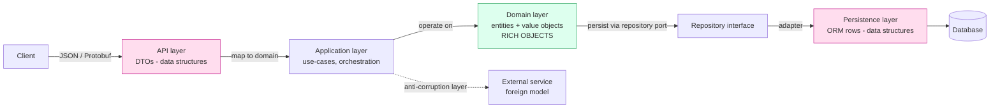
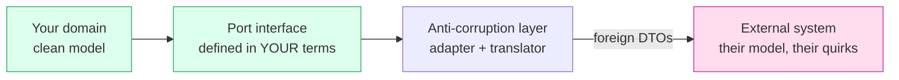

# Objects & Data Structures — Senior Level

> Focus: "Where does the object/data boundary live across a *system*?" — designing the layers, enforcing them in review and CI, resisting ORM pressure toward anaemic models, and mapping between DTOs and domain objects without leaking either way.

---

## Table of Contents

1. [The object/data duality at system scale](#the-objectdata-duality-at-system-scale)
2. [Where each kind lives: a layered map](#where-each-kind-lives-a-layered-map)
3. [DDD value objects and entities as the domain default](#ddd-value-objects-and-entities-as-the-domain-default)
4. [Aggregates: the unit of encapsulation](#aggregates-the-unit-of-encapsulation)
5. [Mapping DTO ↔ domain without leaking](#mapping-dto--domain-without-leaking)
6. [Anti-corruption layers at the seams](#anti-corruption-layers-at-the-seams)
7. [How ORMs pressure you toward anaemic models — and how to resist](#how-orms-pressure-you-toward-anaemic-models--and-how-to-resist)
8. [Encapsulation conventions for a team](#encapsulation-conventions-for-a-team)
9. [Enforcing the boundary in CI and review](#enforcing-the-boundary-in-ci-and-review)
10. [Common Mistakes](#common-mistakes)
11. [Test Yourself](#test-yourself)
12. [Cheat Sheet](#cheat-sheet)
13. [Summary](#summary)
14. [Further Reading](#further-reading)
15. [Related Topics](#related-topics)

---

## The object/data duality at system scale

The junior framing is: *objects hide data behind behaviour; data structures expose data and have no behaviour.* That dichotomy is correct, but at team scale the real skill is knowing **which one each layer is allowed to be**, and policing the transitions.

A single concept — say, an `Order` — legitimately exists in three different shapes simultaneously:

| Shape | Lives at | Nature | Mutability |
|---|---|---|---|
| `OrderRequest` / `OrderResponse` (DTO) | HTTP / gRPC boundary | data structure (public fields, no logic) | typically immutable after construction |
| `Order` (domain entity / aggregate) | domain layer | object (private state, rich behaviour) | mutates only through intention-revealing methods |
| `OrderRow` / `OrderEntity` (persistence) | DB / ORM boundary | data structure shaped by the schema | mutated by the ORM |

These are *not* the same type, and conflating them is the single most expensive mistake a team makes here. The moment the JSON-serialized DTO **is** the domain object, you have coupled your wire format to your business rules: you can no longer change one without breaking the other, and your domain class sprouts `@JsonProperty`, `@Column`, and `@NotNull` annotations that belong to three different concerns.

> **Senior heuristic:** if a class has annotations from your web framework *and* your ORM *and* your domain invariants, it is doing three jobs and will resist every change. Split it.

The tension is real because splitting costs mapping code. Juniors avoid the split to avoid the mapping; seniors accept the mapping because it buys *independent evolvability* of the wire contract, the domain, and the schema.

---

## Where each kind lives: a layered map



The rule the diagram encodes:

- **Behaviour-free data structures at the edges** (API, persistence, external integrations). They are allowed to be dumb bags of public fields because their only job is transport and serialization.
- **Rich objects in the middle** (domain). They are allowed to enforce invariants because nothing serializes them directly.
- **Mapping happens at the layer boundary, never inside a layer.** The application layer is where DTO becomes domain; the persistence adapter is where domain becomes row. The domain layer never imports a DTO type and never imports an ORM type.

The dependency rule (from Clean Architecture) reinforces this: dependencies point **inward**, toward the domain. The domain has no knowledge of HTTP, JSON, SQL, or any framework. If `package domain` imports `package web` or `package persistence`, the layering is already broken — and that is something you can assert in CI (see [below](#enforcing-the-boundary-in-ci-and-review)).

---

## DDD value objects and entities as the domain default

Inside the domain layer, the team default should be **value objects**, falling back to **entities** only when identity genuinely matters.

| | Value Object | Entity |
|---|---|---|
| Identity | none — equality by *value* | stable identity — equality by *ID* |
| Mutability | immutable (replace, don't mutate) | mutates over its lifecycle |
| Examples | `Money`, `EmailAddress`, `DateRange`, `Quantity` | `Order`, `Customer`, `Account` |
| Lifecycle | created, used, discarded | created, tracked, persisted |

Value objects are where Primitive Obsession goes to die. A `Money` is not a `BigDecimal`; an `EmailAddress` is not a `String`. Encapsulating the primitive buys validation-at-construction (you can never hold an invalid `EmailAddress`), behaviour (`money.add(other)` rejects currency mismatch), and self-documenting signatures (`transfer(Money, Account)` instead of `transfer(BigDecimal, String)`).

**Java** — immutable value object via `record` (validation in the compact constructor):

```java
public record Money(BigDecimal amount, Currency currency) {
    public Money {                                   // compact constructor: validate on every construction
        Objects.requireNonNull(amount, "amount");
        Objects.requireNonNull(currency, "currency");
        if (amount.scale() > currency.getDefaultFractionDigits())
            throw new IllegalArgumentException("scale exceeds currency precision");
    }

    public Money add(Money other) {
        if (!currency.equals(other.currency))
            throw new IllegalArgumentException("currency mismatch: " + currency + " vs " + other.currency);
        return new Money(amount.add(other.amount), currency);   // returns a NEW instance — immutable
    }

    public boolean isNegative() { return amount.signum() < 0; }
}
```

**Go** — no inheritance, so a value object is a small struct with an unexported field and a constructor that validates. Immutability is by convention (return new values, never expose a pointer to mutate):

```go
package money

import "fmt"

type Money struct {
	cents    int64  // unexported: callers cannot construct an invalid Money
	currency string
}

func New(cents int64, currency string) (Money, error) {
	if currency == "" {
		return Money{}, fmt.Errorf("currency required")
	}
	return Money{cents: cents, currency: currency}, nil
}

// Add returns a new Money; the receiver is a value, so it cannot be mutated.
func (m Money) Add(o Money) (Money, error) {
	if m.currency != o.currency {
		return Money{}, fmt.Errorf("currency mismatch: %s vs %s", m.currency, o.currency)
	}
	return Money{cents: m.cents + o.cents, currency: m.currency}, nil
}

func (m Money) IsNegative() bool { return m.cents < 0 }
```

**Python** — `@dataclass(frozen=True)` gives immutability, value equality, and `__hash__` for free; validate in `__post_init__`:

```python
from dataclasses import dataclass

@dataclass(frozen=True)        # frozen -> immutable + hashable + value equality
class Money:
    cents: int
    currency: str

    def __post_init__(self) -> None:
        if not self.currency:
            raise ValueError("currency required")

    def add(self, other: "Money") -> "Money":
        if self.currency != other.currency:
            raise ValueError(f"currency mismatch: {self.currency} vs {other.currency}")
        return Money(self.cents + other.cents, self.currency)   # new instance

    @property
    def is_negative(self) -> bool:
        return self.cents < 0
```

> **Team default to write down:** *new domain types are immutable value objects unless they need tracked identity.* Make the immutable form the path of least resistance (records, frozen dataclasses, value-receiver structs) so the wrong thing is the harder thing to type.

---

## Aggregates: the unit of encapsulation

The most under-applied DDD idea at the senior boundary is the **aggregate**: a cluster of entities and value objects with a single **aggregate root** that is the *only* entry point. The root enforces the invariants that span the cluster.

This is the antidote to anaemic models at *team* scale. An anaemic `Order` with public `setStatus()` and a public `List<OrderLine> lines` invites every service to mutate it however it likes — invariants leak into a dozen call sites. An aggregate root closes that door:

```java
public class Order {                       // aggregate root
    private final OrderId id;
    private OrderStatus status;
    private final List<OrderLine> lines;   // private; never exposed mutably

    public void addLine(ProductId product, Quantity qty, Money unitPrice) {
        if (status != OrderStatus.DRAFT)
            throw new IllegalStateException("cannot add lines to a " + status + " order");
        lines.add(new OrderLine(product, qty, unitPrice));   // invariant enforced HERE, once
    }

    public void submit() {
        if (lines.isEmpty())
            throw new IllegalStateException("cannot submit an empty order");
        this.status = OrderStatus.SUBMITTED;
    }

    public List<OrderLine> lines() {
        return List.copyOf(lines);          // return an immutable copy — callers cannot mutate internal state
    }
}
```

Two senior rules fall out of this:

1. **Reference other aggregates by ID, not by object.** `Order` holds a `CustomerId`, not a `Customer`. This keeps aggregates as the consistency boundary and stops the object graph from sprawling into "load the whole database to read one order."
2. **The transaction boundary is the aggregate boundary.** One use-case modifies one aggregate per transaction. Needing to mutate three aggregates atomically is a signal that either the aggregate borders are wrong or the operation should be eventually consistent (a domain event, not a single transaction).

---

## Mapping DTO ↔ domain without leaking

Mapping is the tax you pay for layer independence. The senior job is to make the tax cheap and to make sure it is paid **at the boundary**, not smeared through the domain.

Principles:

- **One-directional knowledge.** The mapper knows about both the DTO and the domain object. Neither the DTO nor the domain object knows about the mapper, and crucially the domain object knows nothing about the DTO. A `toDomain` method *on* the DTO leaks domain knowledge into the API layer; a `toDto` method *on* the entity leaks wire knowledge into the domain. Put both in a dedicated mapper.
- **Reject invalid input at the DTO→domain edge.** The DTO accepts any syntactically valid JSON; the mapping into value objects is where it either becomes a valid domain object or fails. After mapping, the domain is *always* valid — no defensive checks downstream.
- **Don't auto-map blindly.** Reflection-based mappers (ModelMapper, naive MapStruct configs) that copy fields by name silently couple the two shapes and re-introduce the very leakage you split to avoid. Explicit mapping is verbose but honest.

**Go** — the application layer maps explicitly, turning primitives into validated value objects:

```go
// CreateOrderRequest is a DTO: plain fields, JSON tags, no behaviour.
type CreateOrderRequest struct {
	CustomerID string         `json:"customer_id"`
	Lines      []LineDTO      `json:"lines"`
}
type LineDTO struct {
	ProductID string `json:"product_id"`
	Qty       int    `json:"qty"`
	Cents     int64  `json:"unit_price_cents"`
	Currency  string `json:"currency"`
}

// toDomain lives in the application layer and is the ONLY place primitives become domain types.
func (r CreateOrderRequest) toDomain() (*domain.Order, error) {
	cust, err := domain.NewCustomerID(r.CustomerID)
	if err != nil {
		return nil, fmt.Errorf("customer_id: %w", err)
	}
	order := domain.NewOrder(cust)
	for i, l := range r.Lines {
		price, err := money.New(l.Cents, l.Currency)
		if err != nil {
			return nil, fmt.Errorf("lines[%d].price: %w", i, err)
		}
		if err := order.AddLine(domain.ProductID(l.ProductID), domain.Quantity(l.Qty), price); err != nil {
			return nil, fmt.Errorf("lines[%d]: %w", i, err)
		}
	}
	return order, nil
}
```

**Java** — MapStruct used *explicitly* with custom value-object factories, so mapping still flows through validation rather than blind field copying:

```java
@Mapper(componentModel = "spring")
public interface OrderApiMapper {
    // Domain -> response DTO. Uses an explicit expression so Money becomes a primitive at the edge.
    @Mapping(target = "totalCents", expression = "java(order.total().toCents())")
    @Mapping(target = "currency",   expression = "java(order.total().currency().getCurrencyCode())")
    OrderResponse toResponse(Order order);
}
```

The DTO carries `totalCents` + `currency` as primitives because that is what a wire contract should be; the domain carries `Money` because that is what an invariant-bearing layer needs. The mapper is the only thing that knows both.

---

## Anti-corruption layers at the seams

When you integrate with a system whose model you do not control — a legacy service, a third-party payments API, another team's bounded context — its concepts will not match yours. An **anti-corruption layer (ACL)** is a translation boundary whose job is to stop the foreign model from leaking into your domain.



Concretely, the ACL:

- Exposes a port (interface) phrased entirely in *your* domain vocabulary. The domain depends only on this port.
- The adapter translates: your `Money` → their `{ "amt": "12.30", "ccy": "USD" }`; their cryptic `"STAT": 7` → your `PaymentStatus.SETTLED`.
- It absorbs their quirks — null-vs-empty inconsistencies, weird enum encodings, optional fields that are actually required — so none of it reaches your domain.

Without an ACL, the foreign model's `Customer` (with its 60 fields and its `addr1`/`addr2`/`addr3`) becomes *your* `Customer`, and your domain inherits a model you did not design and cannot change. The ACL is the cost of keeping your model yours. It is the same idea as a DTO mapper, applied to a peer system instead of your own wire format.

---

## How ORMs pressure you toward anaemic models — and how to resist

This is where teams most often slide into anaemic models without noticing, because the framework rewards it.

**The pressure.** JPA/Hibernate, GORM, and SQLAlchemy all want a class that mirrors a table: a no-arg constructor, a mutable field per column, and a getter/setter for each. Their machinery (lazy loading, dirty checking, proxying) is built around mutable, publicly-settable state. So the default tutorial entity is a bag of `@Column` fields with full getter/setter coverage — which is *exactly* an anaemic domain model with a database accent.

| ORM | Pressure toward anaemia | The lever to resist |
|---|---|---|
| **Hibernate/JPA** | Requires no-arg constructor + field access; dirty checking watches mutable fields | Use field access (`@Access(FIELD)`), `protected` no-arg ctor, no public setters, behaviour methods that mutate private fields |
| **GORM (Go)** | Maps struct fields by reflection; nudges you to expose every field as exported | Keep the GORM struct as a *persistence DTO* in the adapter; map to/from a separate rich domain struct |
| **SQLAlchemy** | Declarative mapping binds attributes to columns; examples mutate freely | Imperative/classical mapping or a separate domain object; keep behaviour off the mapped class |

**The two strategies to resist:**

**Strategy A — Rich entity that *is* the mapped class (Java/Python).** Keep the persistence annotations but deny the anaemic shape: no public setters, package-private no-arg constructor for the ORM only, all mutation through behaviour. The class is mapped *and* rich.

```java
@Entity
@Access(AccessType.FIELD)               // Hibernate reads fields directly — no getters needed
public class Account {
    @Id private AccountId id;
    @Embedded private Money balance;     // value object embedded into columns

    protected Account() {}               // for Hibernate ONLY — not part of the public API

    public Account(AccountId id, Money opening) {
        this.id = id;
        this.balance = opening;
    }

    public void withdraw(Money amount) { // behaviour, not setBalance()
        Money next = balance.subtract(amount);
        if (next.isNegative())
            throw new InsufficientFundsException(id);
        this.balance = next;
    }
    // NO public setBalance(). The invariant cannot be bypassed.
}
```

**Strategy B — Separate persistence model + repository mapping (the Go default, and the cleanest for any language).** The ORM struct is a dumb persistence DTO living in the adapter; the domain object is pure. The repository maps between them. This is the most robust against ORM pressure because the framework never touches the domain type at all:

```go
// persistence/order_repo.go  — orderRow is a persistence DTO. GORM owns it.
type orderRow struct {
	ID         string `gorm:"primaryKey"`
	CustomerID string
	Status     string
	// ... columns ...
}

func (r *OrderRepo) Save(o *domain.Order) error {
	row := orderRow{                       // map domain -> row at the adapter boundary
		ID:         o.ID().String(),
		CustomerID: o.CustomerID().String(),
		Status:     string(o.Status()),
	}
	return r.db.Save(&row).Error
}

func (r *OrderRepo) FindByID(id domain.OrderID) (*domain.Order, error) {
	var row orderRow
	if err := r.db.First(&row, "id = ?", id.String()).Error; err != nil {
		return nil, err
	}
	return domain.RehydrateOrder(                  // reconstruct the rich aggregate
		domain.OrderID(row.ID),
		domain.CustomerID(row.CustomerID),
		domain.OrderStatus(row.Status),
	), nil
}
```

The **Repository pattern** is the seam that makes Strategy B possible: the domain depends on a `repository` *interface* (a port) phrased in domain terms, and the ORM-shaped implementation lives behind it. The domain never imports GORM/Hibernate/SQLAlchemy.

> **Senior call:** for small CRUD services, Strategy A (mapped-but-rich) is pragmatic and avoids mapper boilerplate. For a domain with real invariants — money, scheduling, regulated workflows — Strategy B is worth its mapping tax because it keeps the domain a pure object model the ORM can never corrupt.

---

## Encapsulation conventions for a team

Encapsulation in one class is easy; encapsulation *as a team default* requires written conventions and a linter, because the failure mode is a thousand small leaks added by people who never read the original design.

Conventions worth committing to a style guide:

**1. No public mutable collections — return copies or views.** A getter that returns the live `List` is a setter in disguise: `order.getLines().clear()` mutates the aggregate from outside.

```java
// BAD: caller can mutate internal state
public List<OrderLine> getLines() { return lines; }

// GOOD: defensive copy (caller's mutations are theirs alone)
public List<OrderLine> lines() { return List.copyOf(lines); }

// ALSO GOOD: unmodifiable view (cheaper; throws on mutation attempt)
public List<OrderLine> lines() { return Collections.unmodifiableList(lines); }
```

```python
# Python: return a tuple (immutable) or a copy, never the internal list
@property
def lines(self) -> tuple[OrderLine, ...]:
    return tuple(self._lines)
```

```go
// Go: return a copy of the slice header's backing data, not the field
func (o *Order) Lines() []OrderLine {
	out := make([]OrderLine, len(o.lines))
	copy(out, o.lines)
	return out
}
```

**2. Tell, Don't Ask — and lint the Demeter-ish coupling.** A train wreck `a.getB().getC().doIt()` reaches through three objects, coupling the caller to the entire chain's structure. Prefer a method on `a` that does the work. You can flag the *symptom* in CI:

- A regex/AST check for `\.\w+\(\)\.\w+\(\)\.\w+\(\)` (three chained calls) catches most train wrecks; tune for fluent-builder false positives.
- Better: forbid getters returning *domain* types across layer boundaries — a domain object handed to the web layer is a leak regardless of chaining.

**3. Getters are not free.** A getter per field re-exposes the data structure you were trying to hide. The senior review question is not "does this field need a getter?" but "does any *collaborator* need this value, and could a behaviour method serve the need instead?" Generate getters only for what crosses a boundary; expose behaviour, not state, within the domain.

**4. Hybrids are a smell to split.** A struct with public fields *and* one or two behaviour methods is neither a clean data structure nor a clean object — it's a half-encapsulated thing that confuses every reader about which rules apply. Either push it fully toward data (move the behaviour out) or fully toward object (hide the fields).

---

## Enforcing the boundary in CI and review

Conventions decay without enforcement. The senior contribution is to encode the boundary as something a machine checks.

### Architectural fitness functions

**Java — ArchUnit** asserts the dependency rule as a JUnit test that fails the build on drift:

```java
@ArchTest
static final ArchRule domain_is_framework_free =
    noClasses().that().resideInAPackage("..domain..")
        .should().dependOnClassesThat()
        .resideInAnyPackage("..web..", "javax.persistence..", "jakarta.persistence..",
                            "org.springframework..", "com.fasterxml.jackson..");

@ArchTest
static final ArchRule domain_has_no_public_setters =
    noMethods().that().areDeclaredInClassesThat().resideInAPackage("..domain..")
        .should().haveNameMatching("set[A-Z].*").andShould().bePublic();
```

**Go** — package import rules via `depguard` (a golangci-lint linter): forbid the `domain` package from importing `gorm.io/...`, `net/http`, or any DTO package. The build fails if someone wires a framework into the domain.

**Python** — `import-linter` contracts declare layers and forbid the domain layer from importing web/ORM modules.

### Custom checks worth building

- **Anaemic-model detector:** flag a class in `..domain..` whose public methods are *only* getters/setters and whose method count ≈ field count × 2. That shape is a data class masquerading as a domain object.
- **Leaked-collection detector:** flag any public method returning a mutable `List`/`Map`/`Set`/slice directly from a field.
- **DTO-in-domain detector:** flag any `..domain..` type referencing a `*Request`/`*Response`/`*DTO`/`*Row`/`*Entity` type.

### Review heuristics

Reviewers should push back when a PR:

- Adds a `@JsonProperty` / `json:` tag / column annotation to a **domain** class — the layers are merging.
- Adds a public setter to an entity — invariant enforcement is being routed around.
- Returns an internal collection without copying — encapsulation leak.
- Adds a third chained call (`a.getB().getC().doIt()`) — Demeter violation; ask for a method on `a`.
- Introduces a domain class with only getters/setters — anaemic model forming; ask "what behaviour belongs here?"

> Catching these at review is 50× cheaper than after the wire format and the domain have fused and every change touches both.

---

## Common Mistakes

- **One class for all three roles.** A single `Order` annotated for JSON, JPA, and validation. It cannot evolve any one concern without risking the others. Split into DTO / domain / row.
- **Anaemic domain model by ORM default.** Accepting the framework's bag-of-setters entity as "the model." The behaviour ends up in `*Service` classes, the entity is data, and you've rebuilt procedural code with object syntax.
- **Mapping inside the domain.** A `toDto()` on the entity or a `fromRequest()` on the DTO. Knowledge leaks across the boundary you split. Put mapping in a dedicated mapper at the layer edge.
- **Referencing other aggregates by object.** `Order` holding a `Customer` object drags the whole graph into memory and blurs the transaction boundary. Hold a `CustomerId`.
- **Returning live collections.** `return this.lines;` is a public setter wearing a getter's clothes. Return a copy or an unmodifiable view.
- **Mutable value objects.** A `Money` with `setAmount()` defeats the entire point — aliased references mutate under each other. Make value objects immutable; "change" returns a new instance.
- **Blind reflection mapping.** ModelMapper-style auto-mapping silently couples DTO and domain field-for-field, re-creating the leakage you split to prevent.
- **No anti-corruption layer.** Letting a third-party API's model become your domain model. You inherit a design you cannot change and cannot fix.

---

## Test Yourself

**1. A teammate argues that splitting `OrderDTO`, `Order` (domain), and `OrderRow` is "three classes for one thing" and wants to use one annotated class. What's your counter?**

<details><summary>Answer</summary>

The three classes serve three independently-evolving concerns: the wire contract (must stay backward-compatible for clients), the domain invariants (change with business rules), and the DB schema (changes with migrations). Fusing them means a JSON field rename forces a schema migration and risks a domain invariant — they can never move independently. The mapping code is a real cost, but it buys independent evolvability, which is the whole reason layers exist. For a trivial CRUD entity with no invariants, one mapped-but-encapsulated class (Strategy A) is a defensible compromise; for anything with real invariants, the split pays off.

</details>

**2. Hibernate requires a no-arg constructor and field access. Doesn't that force an anaemic model?**

<details><summary>Answer</summary>

No — it forces *accommodations*, not anaemia. Make the no-arg constructor `protected` (for Hibernate only, not the public API), use `@Access(FIELD)` so Hibernate reads private fields directly (no getters needed), and expose behaviour methods (`withdraw`, `submit`) instead of setters. The entity stays rich; you've just satisfied the ORM's reflection needs without opening the invariants to the world. If even that feels contaminated, use a separate persistence model and map in the repository (Strategy B).

</details>

**3. Why reference other aggregates by ID rather than by object reference?**

<details><summary>Answer</summary>

Two reasons. (1) Consistency boundary: an aggregate is the unit of transactional consistency; holding another aggregate as an object invites code to mutate two aggregates in one transaction, which couples their lifecycles and breaks the boundary. (2) Loading: object references encourage eager-loading whole object graphs to read one record. An ID is a lightweight reference you resolve through a repository only when you actually need the other aggregate.

</details>

**4. A getter returns `this.items` (the live list). Name the failure and three fixes.**

<details><summary>Answer</summary>

Failure: the getter is a hidden setter — `obj.getItems().clear()` mutates internal state from outside, bypassing every invariant. Fixes: (1) return a defensive copy (`List.copyOf(items)` / `tuple(self._items)` / copied slice); (2) return an unmodifiable view (`Collections.unmodifiableList`, cheaper but mutations on the original still show through); (3) don't expose the collection at all — provide behaviour methods (`addItem`, `itemCount`) so callers never touch the collection.

</details>

**5. When is a separate persistence model (Strategy B) worth the mapping tax over a mapped-but-rich entity (Strategy A)?**

<details><summary>Answer</summary>

When the domain has genuine invariants worth protecting absolutely — money, scheduling, regulated state machines — and when ORM concerns (lazy-loading proxies, dirty-checking quirks, schema-shaped fields) would otherwise pollute the domain type. Strategy B keeps the domain a pure object model the ORM never touches, at the cost of repository mapping code. For thin CRUD with no real invariants, Strategy A is pragmatic; the mapping tax of B isn't repaid.

</details>

**6. Your linter flags `customer.getAddress().getCity().toUpperCase()` as a Demeter violation. Is the flag always right?**

<details><summary>Answer</summary>

Not always — Demeter applies to *objects*, not *data structures*. If `Address` and `City` are immutable value objects with no behaviour to encapsulate (pure data), walking their fields is fine; that is what data structures are for. The flag is right when `Customer` is a rich object and the chain reaches through it to do work that `Customer` should own (`customer.shippingCityUppercased()` or, better, behaviour that doesn't expose the city at all). So: tune the linter to ignore chains through known value-object packages, and reserve the push-back for chains that walk through *behaviour-bearing* objects.

</details>

**7. The framework tutorial shows an entity with a public setter per column and all logic in a `Service`. A junior copies the pattern everywhere. How do you fix it at team scale — not just in one PR?**

<details><summary>Answer</summary>

One PR won't hold; the default has to change. (1) Write the convention down (immutable value objects, behaviour on entities, no public setters, no leaked collections) in the team style guide with rationale. (2) Encode it: ArchUnit / depguard / import-linter rules that fail the build on `set[A-Z]` public methods in `..domain..`, on framework imports in the domain, and on returned mutable collections. (3) Provide a reference module the team copies from, so the rich pattern is the path of least resistance. (4) Make it a standing review heuristic. Conventions without enforcement decay; enforcement without a written rationale breeds resentment — you need all four.

</details>

---

## Cheat Sheet

| Concern | Senior default |
|---|---|
| Same concept, three layers | Separate DTO (edge) / domain object (middle) / row (persistence); map at boundaries |
| New domain type | Immutable value object unless tracked identity is needed → entity |
| Value object "change" | Return a new instance; never mutate |
| Cross-aggregate reference | By ID, not by object |
| Transaction scope | One aggregate per transaction |
| Returning a collection | Copy or unmodifiable view — never the live field |
| Mapping location | Dedicated mapper at the layer edge; never on DTO or entity |
| Mapping style | Explicit through value-object factories; avoid blind reflection mappers |
| ORM, invariant-light CRUD | Strategy A: mapped-but-rich (protected no-arg ctor, field access, no setters) |
| ORM, invariant-heavy domain | Strategy B: separate persistence model, map in repository |
| Third-party / legacy model | Anti-corruption layer behind a domain-phrased port |
| Domain layer imports | No web, no ORM, no JSON — assert with a fitness function |
| Train wreck through objects | Tell, Don't Ask — add behaviour to the first object |

**Smells to flag in review:** annotation soup on a domain class · public setter on an entity · live collection returned from a getter · `a.getB().getC().doIt()` through objects · domain class that is only getters/setters · mutable value object · DTO/Row type referenced inside the domain.

---

## Summary

At senior scale, "objects vs. data structures" stops being a per-class rule and becomes an **architectural boundary**: data structures at the edges (API, persistence, integrations), rich objects in the middle (domain), and disciplined mapping at every transition. The domain layer is framework-free by construction — it knows nothing of HTTP, JSON, or SQL — and the team enforces that with fitness functions, not goodwill.

The dominant force pulling teams off this path is the ORM, whose reflection machinery rewards anaemic bags of setters. Resist with either a mapped-but-rich entity (no public setters, field access, behaviour over mutation) for simple CRUD, or a separate persistence model mapped behind a repository for domains with real invariants. Make immutable value objects the team default so Primitive Obsession can't take root, model the consistency boundary as aggregates referencing each other by ID, and protect every seam with anti-corruption layers. The mapping code this all requires is not waste — it is the price of letting your wire contract, your domain, and your schema evolve independently, which is the entire reason the layers exist.

---

## Further Reading

- Eric Evans — *Domain-Driven Design* (entities, value objects, aggregates, anti-corruption layers)
- Vaughn Vernon — *Implementing Domain-Driven Design* (aggregate design rules, reference-by-ID)
- Robert C. Martin — *Clean Architecture* (the dependency rule, boundaries)
- Martin Fowler — *Patterns of Enterprise Application Architecture* (Data Mapper, Repository, DTO, Anaemic Domain Model)
- Martin Fowler — "AnemicDomainModel" and "TellDontAsk" (martinfowler.com)
- Scott Wlaschin — *Domain Modeling Made Functional* (making illegal states unrepresentable with value types)

---

## Related Topics

- [junior.md](junior.md) — the object/data dichotomy and basic encapsulation
- [middle.md](middle.md) — value objects, DTOs, and Tell-Don't-Ask in practice
- [professional.md](professional.md) — performance trade-offs of value objects, mapping cost, and serialization
- [Chapter README](../README.md) — the positive rules for objects and data structures
- [Classes](../09-classes/README.md) — class structure, cohesion, and organisation
- [Abstraction & Information Hiding](../22-abstraction-and-information-hiding/README.md) — what to expose and what to conceal
- [Design Patterns](../../design-patterns/README.md) — Repository, Adapter (anti-corruption), Factory, and Value Object patterns
- [Anti-Patterns](../../anti-patterns/README.md) — Anaemic Domain Model, God Object, train wrecks