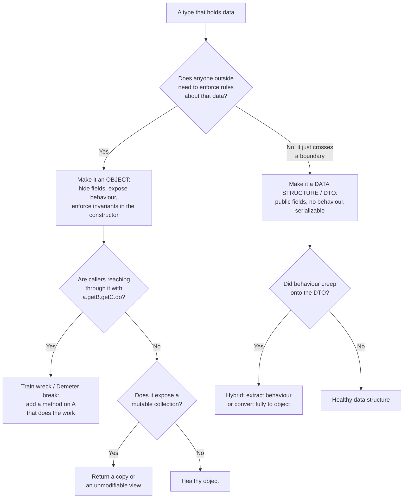
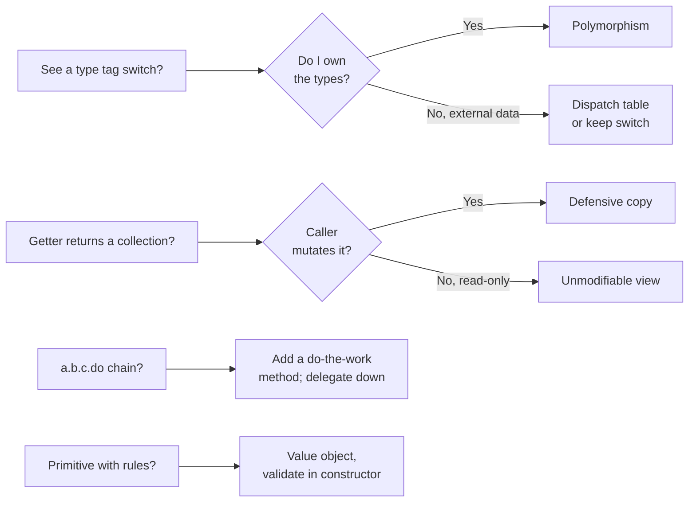

# Objects & Data Structures — Practice Tasks

> Twelve hands-on exercises on the boundary between objects and data structures. Each task gives you a scenario, a piece of smelly code (Go, Java, or Python — the language varies on purpose), and a precise instruction. Every solution is collapsed behind a `<details>` block so you can attempt the fix before reading it. The point is not to memorize a rule but to develop the reflex: *does this code hide its data behind behaviour, or expose its data as a structure?* — and to stop mixing the two.

---

## Table of Contents

1. [Task 1 — Tell, Don't Ask: move behaviour into an anaemic class (Java)](#task-1--tell-dont-ask-move-behaviour-into-an-anaemic-class-java)
2. [Task 2 — Break a train wreck with a method that does the work (Python)](#task-2--break-a-train-wreck-with-a-method-that-does-the-work-python)
3. [Task 3 — Stop returning a public mutable collection (Java)](#task-3--stop-returning-a-public-mutable-collection-java)
4. [Task 4 — Introduce a value object (Go)](#task-4--introduce-a-value-object-go)
5. [Task 5 — Turn a getter/setter bag into an object with invariants (Python)](#task-5--turn-a-gettersetter-bag-into-an-object-with-invariants-python)
6. [Task 6 — Replace a type switch with polymorphism (Java)](#task-6--replace-a-type-switch-with-polymorphism-java)
7. [Task 7 — Decide object-vs-DTO at a boundary and split accordingly (Go)](#task-7--decide-object-vs-dto-at-a-boundary-and-split-accordingly-go)
8. [Task 8 — Convert a hybrid into a pure object (Python)](#task-8--convert-a-hybrid-into-a-pure-object-python)
9. [Task 9 — Demeter chain across module boundaries (Go)](#task-9--demeter-chain-across-module-boundaries-go)
10. [Task 10 — Defensive copy vs. unmodifiable view: pick the right one (Java)](#task-10--defensive-copy-vs-unmodifiable-view-pick-the-right-one-java)
11. [Task 11 — Replace a type switch with a dispatch map, then with a method (Python)](#task-11--replace-a-type-switch-with-a-dispatch-map-then-with-a-method-python)
12. [Task 12 — Full audit: classify and fix every object/data smell (Go)](#task-12--full-audit-classify-and-fix-every-objectdata-smell-go)

---

## How to Use

- **Attempt first, reveal second.** Read the smelly code, write your fix on paper or in an editor, then open the `<details>` block.
- **Behaviour must not change.** Every refactoring here is behaviour-preserving. If you have tests, they must stay green; if you don't, sketch the cases the old code handled before you touch it.
- **Watch the direction of the rule.** The Tell-Don't-Ask and Law-of-Demeter tasks push data *behind* behaviour (make it an object). The DTO and data-structure tasks push behaviour *out* (make it a plain structure). Knowing which way to push is the whole skill — see the [chapter README](../README.md).
- **Difficulty climbs.** Tasks 1–4 are single-smell warm-ups. Tasks 5–9 mix two concerns. Tasks 10–12 ask you to make a judgement call and defend it.

The decision tree below is the lens for the entire set:



---

## Task 1 — Tell, Don't Ask: move behaviour into an anaemic class (Java)

**Difficulty:** Easy

**Scenario.** `BankAccount` is a data class: it has private fields but a getter and setter for every one of them. The withdrawal *logic* lives in the service that calls it. The account cannot protect its own balance — any caller can set it to anything.

```java
class BankAccount {
    private long balanceCents;
    private boolean frozen;

    public long getBalanceCents() { return balanceCents; }
    public void setBalanceCents(long balanceCents) { this.balanceCents = balanceCents; }
    public boolean isFrozen() { return frozen; }
    public void setFrozen(boolean frozen) { this.frozen = frozen; }
}

class PaymentService {
    void withdraw(BankAccount account, long amountCents) {
        if (account.isFrozen()) {
            throw new IllegalStateException("account frozen");
        }
        if (amountCents <= 0) {
            throw new IllegalArgumentException("amount must be positive");
        }
        if (account.getBalanceCents() < amountCents) {
            throw new IllegalStateException("insufficient funds");
        }
        account.setBalanceCents(account.getBalanceCents() - amountCents);
    }
}
```

**Instruction.** Move the withdrawal behaviour *into* `BankAccount`. After the change, no caller should be able to set the balance to an arbitrary value. The service should *tell* the account to withdraw, not *ask* for its balance and mutate it.

<details>
<summary>Solution</summary>

The rule the smell breaks is **Tell, Don't Ask**: a caller that asks an object for its state, makes a decision, and then writes the state back has effectively taken over the object's job. The fix is to give the object the decision.

```java
final class BankAccount {
    private long balanceCents;
    private boolean frozen;

    BankAccount(long openingBalanceCents) {
        if (openingBalanceCents < 0) {
            throw new IllegalArgumentException("opening balance cannot be negative");
        }
        this.balanceCents = openingBalanceCents;
    }

    void withdraw(long amountCents) {
        if (frozen) {
            throw new IllegalStateException("account frozen");
        }
        if (amountCents <= 0) {
            throw new IllegalArgumentException("amount must be positive");
        }
        if (balanceCents < amountCents) {
            throw new IllegalStateException("insufficient funds");
        }
        balanceCents -= amountCents;
    }

    void freeze() { this.frozen = true; }

    // Read-only access remains; the *setter* is gone.
    long balanceCents() { return balanceCents; }
    boolean isFrozen() { return frozen; }
}

class PaymentService {
    void withdraw(BankAccount account, long amountCents) {
        account.withdraw(amountCents);
    }
}
```

**Reasoning.** The invariant "balance is non-negative unless the account itself decides otherwise" now has exactly one guardian: the `BankAccount`. `setBalanceCents` is deleted, so it is impossible for any code anywhere to corrupt the balance. The getter survives because *reading* a value does not threaten the invariant — only writing does. The service shrinks to a one-liner because the policy moved to where the data lives.

</details>

---

## Task 2 — Break a train wreck with a method that does the work (Python)

**Difficulty:** Easy

**Scenario.** A reporting function digs four levels deep into an object graph to format a mailing label. This is a **train wreck** (a.b.c.d chain) and a **Law of Demeter** violation: the function knows the entire shape of `Customer → Address → City → Country`, so any change to that shape breaks the report.

```python
def mailing_label(customer):
    line = customer.profile.address.city.name
    country = customer.profile.address.city.country.iso_code
    postcode = customer.profile.address.postcode
    return f"{line}, {postcode} ({country})"
```

**Instruction.** Eliminate the chain. The caller should ask `customer` for what it needs, not navigate through its internals. Add the smallest set of methods that "do the work" at each level.

<details>
<summary>Solution</summary>

The Law of Demeter says a method should talk only to its immediate collaborators: its own fields, its parameters, and objects it creates — not the friends-of-friends reached by chaining. Each `.` past the first is a coupling to a structure the caller has no business knowing.

```python
class Country:
    def __init__(self, iso_code):
        self._iso_code = iso_code

    def iso_code(self):
        return self._iso_code


class City:
    def __init__(self, name, country):
        self._name = name
        self._country = country

    def name(self):
        return self._name

    def country_code(self):              # does the work, hides Country
        return self._country.iso_code()


class Address:
    def __init__(self, city, postcode):
        self._city = city
        self._postcode = postcode

    def label(self):                     # does the work, hides City
        return f"{self._city.name()}, {self._postcode} ({self._city.country_code()})"


class Customer:
    def __init__(self, address):
        self._address = address

    def mailing_label(self):             # does the work, hides Address
        return self._address.label()


def mailing_label(customer):
    return customer.mailing_label()
```

**Reasoning.** Each method "does the work" rather than "hands out a part." `Customer.mailing_label()` delegates to `Address.label()`, which delegates to `City.country_code()`. Now if `City` swaps `Country` for a `Region` object, only `City` changes — the report, the customer, and the address are untouched. The chain `customer.profile.address.city.country.iso_code` had six dependencies in one expression; the new caller has exactly one.

Note: pushing every layer this way is right when the chain crosses real object boundaries you own. If the chain were over a plain *data structure* (a parsed JSON tree, say) the right move would be the opposite — see [Task 7](#task-7--decide-object-vs-dto-at-a-boundary-and-split-accordingly-go). Demeter is a rule about *objects*, not about navigating data you explicitly chose to model as a structure.

</details>

---

## Task 3 — Stop returning a public mutable collection (Java)

**Difficulty:** Easy

**Scenario.** `ShoppingCart` keeps its line items in a list and hands the *actual* list back from a getter. Callers mutate the cart's internals behind its back, dodging the `addItem` checks entirely.

```java
class ShoppingCart {
    private final List<LineItem> items = new ArrayList<>();

    public void addItem(LineItem item) {
        if (item.quantity() <= 0) {
            throw new IllegalArgumentException("quantity must be positive");
        }
        items.add(item);
    }

    public List<LineItem> getItems() {
        return items;   // hands out the live list
    }
}

// Elsewhere — the validation in addItem is bypassed:
cart.getItems().add(new LineItem("sku-1", -5));
cart.getItems().clear();
```

**Instruction.** Stop leaking the live collection. Decide whether callers need a *snapshot* they can keep or a *read-only view* that reflects later changes, and implement the appropriate one.

<details>
<summary>Solution</summary>

Returning the internal list makes the `items` field effectively public — the `final` keyword only protects the *reference*, not the *contents*. Two correct fixes, with different semantics:

```java
class ShoppingCart {
    private final List<LineItem> items = new ArrayList<>();

    public void addItem(LineItem item) {
        if (item.quantity() <= 0) {
            throw new IllegalArgumentException("quantity must be positive");
        }
        items.add(item);
    }

    // Option A — unmodifiable VIEW: cheap, reflects later adds,
    // throws UnsupportedOperationException on mutation.
    public List<LineItem> items() {
        return Collections.unmodifiableList(items);
    }

    // Option B — defensive COPY: callers get an independent snapshot
    // they may freely mutate without touching the cart.
    public List<LineItem> itemsSnapshot() {
        return new ArrayList<>(items);
    }
}
```

**Reasoning.** Both prevent the bypass; choose by what the caller needs.

- **Unmodifiable view** (`Collections.unmodifiableList`) is O(1) and stays in sync with the cart. Use it when callers only read and you want them to see live updates. The list is read-only, but note the *elements* are not copied — if `LineItem` is mutable, a caller could still mutate an item. Make `LineItem` immutable (a `record`) to close that gap.
- **Defensive copy** is O(n) and detached. Use it when the caller legitimately needs its own list to mutate, or when you must guarantee the returned data never changes under the caller's feet even if the cart does.

The wrong answer is the original: a getter that returns the field. That is not "exposing data," it is exposing your *implementation* — the choice of `ArrayList`, the mutability, and the cart's only protection against bad data all leak through one line.

</details>

---

## Task 4 — Introduce a value object (Go)

**Difficulty:** Easy

**Scenario.** Temperatures flow through the system as bare `float64`s. Nothing records the unit, so a Celsius value gets passed to a function expecting Kelvin, and the bug is silent until something catches fire.

```go
package weather

func AlertIfTooHot(temp float64) bool {
    return temp > 35.0 // 35 what? Celsius? Fahrenheit?
}

func Average(readings []float64) float64 {
    var sum float64
    for _, r := range readings {
        sum += r
    }
    return sum / float64(len(readings))
}
```

**Instruction.** Introduce a `Celsius` value object: an immutable type that carries its unit, validates on creation, and offers the conversions and comparisons the domain needs. Make a mixed-unit mistake a compile error.

<details>
<summary>Solution</summary>

A **value object** is defined by its value, is immutable, and bundles the operations that make sense for that value. Modelling the unit in the type erases an entire class of bug.

```go
package weather

import (
    "errors"
    "fmt"
)

// Celsius is a value object: immutable, self-validating, unit-bearing.
type Celsius struct {
    degrees float64
}

// Absolute zero is the floor; anything below it is physically impossible.
const absoluteZeroC = -273.15

func NewCelsius(degrees float64) (Celsius, error) {
    if degrees < absoluteZeroC {
        return Celsius{}, fmt.Errorf("temperature %.2f°C is below absolute zero", degrees)
    }
    return Celsius{degrees: degrees}, nil
}

func (c Celsius) Degrees() float64    { return c.degrees }
func (c Celsius) Fahrenheit() float64 { return c.degrees*9.0/5.0 + 32.0 }
func (c Celsius) IsHotterThan(other Celsius) bool { return c.degrees > other.degrees }
func (c Celsius) String() string      { return fmt.Sprintf("%.1f°C", c.degrees) }

var ErrNoReadings = errors.New("no readings to average")

func AlertIfTooHot(temp Celsius) bool {
    threshold, _ := NewCelsius(35.0)
    return temp.IsHotterThan(threshold)
}

func Average(readings []Celsius) (Celsius, error) {
    if len(readings) == 0 {
        return Celsius{}, ErrNoReadings
    }
    var sum float64
    for _, r := range readings {
        sum += r.Degrees()
    }
    return NewCelsius(sum / float64(len(readings)))
}
```

**Reasoning.** `Celsius` is now a distinct type, so `AlertIfTooHot(fahrenheitValue)` does not compile — the mixed-unit bug is caught by the type checker, not by an incident. The struct has no setters and the single field is unexported, so a `Celsius` is immutable once built; every operation returns a new value or a plain answer. Validation (`below absolute zero`) lives in the one constructor, so an invalid temperature can never exist. The empty-slice case that the old `Average` divided-by-zero on is now an explicit error. The unit "35 what?" question that opened the task is answered structurally: the `35.0` is wrapped in a `Celsius` at the only place it is created.

</details>

---

## Task 5 — Turn a getter/setter bag into an object with invariants (Python)

**Difficulty:** Medium

**Scenario.** `DateRange` is a bag of two attributes with no rules. Every caller is responsible for checking that `start <= end`, and most forget. The invalid state "end before start" is representable, so it happens.

```python
class DateRange:
    def __init__(self):
        self.start = None
        self.end = None

# Callers everywhere:
r = DateRange()
r.start = date(2026, 6, 10)
r.end = date(2026, 6, 1)        # end before start — nobody checks
duration = (r.end - r.start).days  # negative, silently wrong
```

**Instruction.** Convert this into a proper object whose constructor enforces `start <= end`, that is immutable after construction, and that offers the behaviour callers actually need (duration, containment, overlap) instead of forcing them to do date math by hand.

<details>
<summary>Solution</summary>

The principle is **make illegal states unrepresentable**: if a `DateRange` cannot be constructed with `end < start`, no caller can ever observe one. Behaviour the callers were duplicating moves onto the object.

```python
from dataclasses import dataclass
from datetime import date


@dataclass(frozen=True)
class DateRange:
    start: date
    end: date

    def __post_init__(self):
        if self.end < self.start:
            raise ValueError(f"end {self.end} is before start {self.start}")

    @property
    def days(self) -> int:
        return (self.end - self.start).days

    def contains(self, day: date) -> bool:
        return self.start <= day <= self.end

    def overlaps(self, other: "DateRange") -> bool:
        return self.start <= other.end and other.start <= self.end


# Callers:
r = DateRange(date(2026, 6, 1), date(2026, 6, 10))  # valid
r.days            # 9, computed by the object
r.contains(date(2026, 6, 5))   # True

DateRange(date(2026, 6, 10), date(2026, 6, 1))  # raises ValueError at construction
```

**Reasoning.** `frozen=True` removes the setters, so a range cannot be mutated into an invalid state after the fact. `__post_init__` runs the invariant check exactly once, at the only moment a range comes into being — the bad range from the scenario now throws at line one instead of producing a silently-negative duration deep in a report. The date arithmetic that every caller was repeating (`(end - start).days`, range checks) is now expressed once, named, and tested in one place. The class went from "two public attributes and a hope" to a type that *cannot* be wrong.

</details>

---

## Task 6 — Replace a type switch with polymorphism (Java)

**Difficulty:** Medium

**Scenario.** `AreaCalculator` switches on a `kind` string to compute shape areas. Every new shape forces an edit to this switch — and to the perimeter switch, and the draw switch, and any other switch that grows beside it. This is the classic procedural-vs-OO fork.

```java
class Shape {
    String kind;          // "circle", "rectangle", "triangle"
    double radius;
    double width, height;
    double base, triHeight;
}

class AreaCalculator {
    double area(Shape s) {
        switch (s.kind) {
            case "circle":
                return Math.PI * s.radius * s.radius;
            case "rectangle":
                return s.width * s.height;
            case "triangle":
                return 0.5 * s.base * s.triHeight;
            default:
                throw new IllegalArgumentException("unknown shape: " + s.kind);
        }
    }
}
```

**Instruction.** Replace the type switch with polymorphism. After the change, adding a new shape should mean adding one class and editing nothing else (the Open/Closed Principle).

<details>
<summary>Solution</summary>

A `switch` on a type tag is a sign that the data wants to be objects. Each `case` is a method body looking for a home; the home is a subtype.

```java
sealed interface Shape permits Circle, Rectangle, Triangle {
    double area();
}

record Circle(double radius) implements Shape {
    public double area() { return Math.PI * radius * radius; }
}

record Rectangle(double width, double height) implements Shape {
    public double area() { return width * height; }
}

record Triangle(double base, double height) implements Shape {
    public double area() { return 0.5 * base * height; }
}

// AreaCalculator disappears entirely — the area lives with the shape:
double totalArea(List<Shape> shapes) {
    return shapes.stream().mapToDouble(Shape::area).sum();
}
```

**Reasoning.** Each shape now owns its own area formula, and the irrelevant fields are gone — a `Circle` no longer carries a meaningless `width` and `triHeight`. Adding a `Pentagon` means writing one `record` that implements `Shape`; the existing types and the summation loop do not change. That is the Open/Closed Principle: open for extension (new shapes), closed for modification (no editing the switch).

The original design also had a subtle data bug the switch hid: a `Shape` could be a `"circle"` with a `width` set, an internally contradictory object. The polymorphic version makes that unrepresentable.

**When to keep the switch.** If `Shape` were a *data structure* you do not own — say, parsed from an external API where you cannot add methods — a `switch` (or, in modern Java, a `switch` with pattern matching on the `sealed` type) is the honest choice. Polymorphism is for code where you control the types; pattern-matching is for data you merely receive. Knowing which situation you are in is the actual lesson.

</details>

---

## Task 7 — Decide object-vs-DTO at a boundary and split accordingly (Go)

**Difficulty:** Medium

**Scenario.** A single `User` struct is doing two incompatible jobs. It is the JSON shape sent over the wire (so it needs public fields and tags), *and* it is the domain entity with the password-hashing logic (so it needs invariants and hidden state). The result: the password hash leaks into API responses, and the domain rules sit on a type that anyone can construct field-by-field.

```go
package user

type User struct {
    ID           string `json:"id"`
    Email        string `json:"email"`
    PasswordHash string `json:"password_hash"` // leaks to clients!
    IsAdmin      bool   `json:"is_admin"`
}

func (u *User) SetPassword(plain string) {
    u.PasswordHash = hash(plain) // domain logic on the wire type
}
```

**Instruction.** Split this into two types: a **DTO** that exists only to cross the HTTP boundary (public fields, JSON tags, no behaviour, no secrets) and a domain **object** that owns the invariants and the password logic (unexported fields, constructor, methods). Write the mapping between them.

<details>
<summary>Solution</summary>

The two roles pull in opposite directions. A DTO *wants* to be a transparent data structure — all fields public, no logic, trivially serializable. A domain object *wants* to be opaque — fields hidden, behaviour exposed, invariants enforced. Forcing one struct to be both is why the hash leaked.

```go
package user

// ---- Domain object: opaque, behaviour-rich, owns invariants ----

type User struct {
    id           string
    email        string
    passwordHash string
    isAdmin      bool
}

func NewUser(id, email, plainPassword string) (*User, error) {
    if !validEmail(email) {
        return nil, fmt.Errorf("invalid email: %q", email)
    }
    if len(plainPassword) < 8 {
        return nil, errors.New("password must be at least 8 characters")
    }
    return &User{
        id:           id,
        email:        email,
        passwordHash: hash(plainPassword),
        isAdmin:      false,
    }, nil
}

func (u *User) ID() string    { return u.id }
func (u *User) Email() string { return u.email }
func (u *User) IsAdmin() bool { return u.isAdmin }
func (u *User) CheckPassword(plain string) bool { return verify(u.passwordHash, plain) }

// ---- DTO: transparent, behaviour-free, safe to serialize ----

type UserResponse struct {
    ID      string `json:"id"`
    Email   string `json:"email"`
    IsAdmin bool   `json:"is_admin"`
    // No PasswordHash field exists — it CANNOT leak.
}

// ---- Mapping at the boundary ----

func ToResponse(u *User) UserResponse {
    return UserResponse{
        ID:      u.ID(),
        Email:   u.Email(),
        IsAdmin: u.IsAdmin(),
    }
}
```

**Reasoning.** The secret stops leaking *by construction*: `UserResponse` has no field for the hash, so no amount of serialization can expose it. The domain `User` now has unexported fields and a real constructor — you cannot build one with a blank password or an invalid email, and you cannot reach in and flip `isAdmin`. The mapping function `ToResponse` is the explicit seam where the object becomes data; it is the one place to look when you want to know exactly what the API exposes.

This is the deeper point of the chapter: **objects hide data and expose behaviour; data structures expose data and have no behaviour.** They are opposites. A type that tries to be both ends up bad at both, and usually leaks something it shouldn't.

</details>

---

## Task 8 — Convert a hybrid into a pure object (Python)

**Difficulty:** Medium

**Scenario.** `Money` is a **hybrid**: mostly a public-attribute data structure, but with two behaviour methods bolted on. Callers reach into `amount` and `currency` directly *and* call `.add()`, so the type has no consistent contract. Half the codebase treats it as data, half as an object, and the currency invariant holds only when people remember to check.

```python
class Money:
    def __init__(self, amount, currency):
        self.amount = amount        # public, mutable
        self.currency = currency    # public, mutable

    def add(self, other):           # behaviour bolted onto a data bag
        return Money(self.amount + other.amount, self.currency)

# Callers do both — that is the hybrid:
m = Money(100, "USD")
m.amount += 50                       # treated as data
total = m.add(Money(25, "EUR"))      # treated as object — and silently mixes currencies!
```

**Instruction.** Decide the type's identity — `Money` is a domain concept with rules, so make it a *pure object*. Hide the fields, enforce the same-currency invariant inside `add`, and make it immutable so the data-style mutation (`m.amount += 50`) becomes impossible.

<details>
<summary>Solution</summary>

A hybrid is a type stuck halfway between the two honest designs. The fix is to commit to one. `Money` carries an invariant (you cannot add USD to EUR), which is the signature of an *object*, so we push the data fully behind behaviour.

```python
from dataclasses import dataclass
from decimal import Decimal


@dataclass(frozen=True)
class Money:
    _amount: Decimal
    _currency: str

    def __post_init__(self):
        if self._amount < 0:
            raise ValueError("Money cannot be negative")

    @property
    def amount(self) -> Decimal:
        return self._amount

    @property
    def currency(self) -> str:
        return self._currency

    def add(self, other: "Money") -> "Money":
        if self._currency != other._currency:
            raise ValueError(
                f"cannot add {self._currency} to {other._currency}"
            )
        return Money(self._amount + other._amount, self._currency)


# Callers can no longer mutate, and cannot mix currencies:
m = Money(Decimal(100), "USD")
# m.amount += 50                  -> AttributeError (read-only property, frozen)
total = m.add(Money(Decimal(25), "USD"))     # works
m.add(Money(Decimal(25), "EUR"))             # raises ValueError
```

**Reasoning.** `frozen=True` makes `m.amount += 50` raise instead of silently corrupting state — the data-style usage that defined the hybrid is now impossible, forcing every caller onto the behaviour. The currency check inside `add` catches the USD+EUR bug that the old code returned as a wrong answer. The fields are exposed only through read-only properties, so reads still work but writes cannot. We also swapped `float` for `Decimal`, because money in binary floating point accrues rounding error.

The alternative commitment — making `Money` a *pure data structure* — would be wrong here precisely *because* it has an invariant. Pure data structures are for values with no rules to protect, such as a parsed config row or an API payload. The presence of the same-currency rule is the signal that says "object."

</details>

---

## Task 9 — Demeter chain across module boundaries (Go)

**Difficulty:** Hard

**Scenario.** A handler reaches three objects deep to charge a customer. The chain `order.Customer().Wallet().Charge(...)` couples the HTTP layer to the internal structure of `Order`, `Customer`, *and* `Wallet`. When billing later moves the wallet behind a payment provider, every call site like this one breaks.

```go
package handler

func (h *Handler) Pay(order *Order, amount Money) error {
    wallet := order.Customer().Wallet()
    if wallet.Balance().LessThan(amount) {
        return errors.New("insufficient funds")
    }
    return wallet.Charge(amount)
}
```

**Instruction.** Collapse the chain by pushing the "charge for this order" operation down to where the data lives. The handler should make a single call on `order`. Each layer should expose an operation, not its internals.

<details>
<summary>Solution</summary>

Each `.` in `order.Customer().Wallet().Charge()` is a layer the handler must know intimately. The fix is to give the top object a method that *does the work*, and let it delegate down — every level hides the level below it.

```go
package handler

func (h *Handler) Pay(order *Order, amount Money) error {
    return order.Charge(amount) // one call; handler knows nothing of wallets
}
```

```go
package billing

// Order hides Customer.
func (o *Order) Charge(amount Money) error {
    return o.customer.Charge(amount)
}

// Customer hides Wallet.
func (c *Customer) Charge(amount Money) error {
    return c.wallet.Charge(amount)
}

// Wallet owns the balance rule — the check moves to the data.
func (w *Wallet) Charge(amount Money) error {
    if w.balance.LessThan(amount) {
        return ErrInsufficientFunds
    }
    w.balance = w.balance.Subtract(amount)
    return nil
}
```

**Reasoning.** The insufficient-funds check used to live in the handler, which had to (a) reach the wallet and (b) know how a wallet decides affordability. Both responsibilities now sit on `Wallet`, the only object that owns a balance. The handler depends on one method of `Order`; `Order` depends on one method of `Customer`; `Customer` depends on one method of `Wallet`. This is a delegation chain, not a navigation chain — the crucial difference is that each link is a *behaviour* the layer promises, so the layer below it can change freely.

Now the originally-feared change is cheap: when billing routes payments through an external provider, only `Wallet.Charge` changes. `Customer`, `Order`, and every handler stay exactly as they are, because none of them ever knew there was a wallet at all.

</details>

---

## Task 10 — Defensive copy vs. unmodifiable view: pick the right one (Java)

**Difficulty:** Hard

**Scenario.** `Schedule` exposes its internal `appointments` map and its `slots` list. Two different leaks, and the right fix differs for each. One collection is read for iteration only; the other is handed to a caller who legitimately needs to take it away and mutate its own copy. Picking the wrong protection is either a performance bug or a correctness bug.

```java
class Schedule {
    private final Map<LocalDate, Appointment> appointments = new HashMap<>();
    private final List<TimeSlot> availableSlots = new ArrayList<>();

    public Map<LocalDate, Appointment> getAppointments() {
        return appointments;        // callers iterate this, never mutate
    }

    public List<TimeSlot> getAvailableSlots() {
        return availableSlots;      // callers take this and filter/sort their own copy
    }
}
```

**Instruction.** Fix both leaks, but choose the right tool for each: an **unmodifiable view** for the collection callers only read, and a **defensive copy** for the one callers take and mutate. Justify each choice in one sentence.

<details>
<summary>Solution</summary>

Both getters currently return the live field, so both are leaks. The correct protection is decided by what the caller *does* with the result.

```java
class Schedule {
    private final Map<LocalDate, Appointment> appointments = new HashMap<>();
    private final List<TimeSlot> availableSlots = new ArrayList<>();

    // Read-only iteration -> unmodifiable VIEW.
    // O(1), stays in sync, throws on any mutation attempt.
    public Map<LocalDate, Appointment> appointments() {
        return Collections.unmodifiableMap(appointments);
    }

    // Caller takes ownership to filter/sort its own copy -> defensive COPY.
    // O(n), detached: the caller may mutate freely; the Schedule is unaffected.
    public List<TimeSlot> availableSlots() {
        return new ArrayList<>(availableSlots);
    }
}
```

**Reasoning.**

- `appointments()` returns an **unmodifiable view**: callers only iterate, so a copy would waste an allocation on every call and — worse — would *not* reflect appointments added after the call. The view is O(1), tracks the live map, and throws `UnsupportedOperationException` if anyone tries to mutate it. Correct *and* cheap.
- `availableSlots()` returns a **defensive copy**: callers explicitly take the list to sort and filter it in place. Handing them an unmodifiable view would throw the moment they call `Collections.sort`. They need a detached, mutable list of their own, which is exactly what the copy gives — and the `Schedule`'s own list stays intact.

The meta-skill: "return a copy or a view" is not one rule but a fork. **View** when callers read and you want O(1) plus live updates. **Copy** when callers mutate, or when you must guarantee the snapshot is frozen at the instant of the call. Returning the field itself is wrong in every case, because it leaks the implementation and surrenders every invariant the class was protecting. (If `Appointment`/`TimeSlot` are mutable, even a view or shallow copy lets callers mutate the elements; immutable element types close that last hole — see [Task 4](#task-4--introduce-a-value-object-go).)

</details>

---

## Task 11 — Replace a type switch with a dispatch map, then with a method (Python)

**Difficulty:** Hard

**Scenario.** Notifications are dispatched by switching on a `kind` string. The function violates Open/Closed (every new channel edits it) and conflates *selecting* a behaviour with *performing* it. You will refactor in two steps to feel the difference between a data-driven table and true polymorphism.

```python
def send(notification):
    if notification["kind"] == "email":
        smtp.send(notification["to"], notification["subject"], notification["body"])
    elif notification["kind"] == "sms":
        twilio.message(notification["to"], notification["body"])
    elif notification["kind"] == "push":
        fcm.push(notification["device_token"], notification["body"])
    else:
        raise ValueError(f"unknown kind: {notification['kind']}")
```

**Instruction.** Step 1: replace the `if/elif` chain with a dispatch map (a dict of `kind -> handler`). Step 2: go further — model each notification as a polymorphic object with a `send()` method, and explain when each version is the better design.

<details>
<summary>Solution</summary>

**Step 1 — dispatch map.** The cheapest improvement: turn the branch ladder into a lookup table. The notification stays a plain dict (a data structure), and the handlers live in a registry.

```python
def _send_email(n):
    smtp.send(n["to"], n["subject"], n["body"])

def _send_sms(n):
    twilio.message(n["to"], n["body"])

def _send_push(n):
    fcm.push(n["device_token"], n["body"])

_HANDLERS = {
    "email": _send_email,
    "sms": _send_sms,
    "push": _send_push,
}

def send(notification):
    handler = _HANDLERS.get(notification["kind"])
    if handler is None:
        raise ValueError(f"unknown kind: {notification['kind']}")
    handler(notification)
```

**Step 2 — polymorphism.** When the notification is something *you* model (not raw external data), make it an object that knows how to send itself. The `kind` field disappears — the type *is* the kind.

```python
from abc import ABC, abstractmethod
from dataclasses import dataclass


class Notification(ABC):
    @abstractmethod
    def send(self) -> None: ...


@dataclass(frozen=True)
class EmailNotification(Notification):
    to: str
    subject: str
    body: str

    def send(self) -> None:
        smtp.send(self.to, self.subject, self.body)


@dataclass(frozen=True)
class SmsNotification(Notification):
    to: str
    body: str

    def send(self) -> None:
        twilio.message(self.to, self.body)


@dataclass(frozen=True)
class PushNotification(Notification):
    device_token: str
    body: str

    def send(self) -> None:
        fcm.push(self.device_token, self.body)


def send(notification: Notification) -> None:
    notification.send()
```

**Reasoning.** All three versions remove the original's two flaws (the growing `elif` ladder and the missing-channel crash), but they sit at different points on a spectrum:

- The **dispatch map** is right when the payload genuinely *is* loose data — e.g. it arrived as JSON and the `kind` field is part of the wire contract. Adding a channel means adding one entry to `_HANDLERS`; you never touch `send`. But the dict notification has no type safety: a missing `subject` blows up only at send time.
- The **polymorphic objects** are right when you own the domain. The type system now guarantees an `EmailNotification` *has* a subject; `frozen=True` makes each notification immutable; and `send` shrinks to a single delegating line. Adding a channel means adding a class and editing nothing — the strongest form of Open/Closed.

The deciding question is the chapter's central one: *is this thing data passing through, or an object I model?* Data passing through → keep it a structure, dispatch with a table. A modelled domain concept → make it an object, dispatch with polymorphism.

</details>

---

## Task 12 — Full audit: classify and fix every object/data smell (Go)

**Difficulty:** Hard

**Scenario.** This package is a museum of the chapter's anti-patterns. Find each one, name it, and write the fix. This mirrors a real code-review pass.

```go
package catalog

type Product struct {
    ID       string
    Name     string
    Cents    int64
    Currency string
    Tags     []string
}

// getters/setters for every field (only two shown)
func (p *Product) GetName() string      { return p.Name }
func (p *Product) SetName(n string)     { p.Name = n }
func (p *Product) GetTags() []string    { return p.Tags } // returns the live slice
func (p *Product) SetCents(c int64)     { p.Cents = c }   // no validation

type PriceFormatter struct{}

func (f PriceFormatter) Format(p *Product) string {
    // train wreck + type-tag switching
    switch p.Currency {
    case "USD":
        return fmt.Sprintf("$%.2f", float64(p.Cents)/100)
    case "EUR":
        return fmt.Sprintf("€%.2f", float64(p.Cents)/100)
    default:
        return fmt.Sprintf("%.2f", float64(p.Cents)/100)
    }
}

func Discount(p *Product, store *Store) int64 {
    // Demeter: digs through store to find a rule
    return p.Cents - store.Region().Promo().AmountFor(p.ID)
}
```

**Instruction.** Produce an audit: a table of every smell with its location and fix. Then write the cleaned `Product` and supporting types for the three highest-value fixes (the value object, the leaked slice, and the type switch).

<details>
<summary>Solution</summary>

**Audit.**

| Smell | Location | Fix |
|---|---|---|
| Getter/setter for every field | all the `Get*`/`Set*` methods | Drop the blanket accessors; expose only the few reads callers truly need, and replace setters with intention-revealing methods (`Rename`, `Reprice`) that can enforce rules. |
| Public mutable collection returned | `GetTags()` returns the live `Tags` slice | Return a defensive copy (`append([]string(nil), p.tags...)`) or model `Tags` as an immutable set with `HasTag`/`WithTag`. |
| Setter with no validation | `SetCents` (and the raw `Cents`/`Currency` pair) | Replace the `Cents int64` + `Currency string` pair with a `Money` **value object** that validates and carries its unit. |
| Primitive obsession / data clump | `Cents int64` + `Currency string` | Same `Money` value object — the two fields are one concept. |
| Type-tag switch | `PriceFormatter.Format` switches on `Currency` | Move formatting onto `Money` (or a `Currency` type with a `Format` method); no central switch to edit per currency. |
| Train wreck / Law of Demeter | `store.Region().Promo().AmountFor(p.ID)` in `Discount` | Add `store.PromoAmount(productID)` that does the work; the caller asks the store one question. |
| Anaemic model | `Product` is all data, behaviour lives in `PriceFormatter`/`Discount` | Pull pricing/discount behaviour onto `Product` and `Money` so the data and the rules live together. |

**Cleaned code (three highest-value fixes).**

```go
package catalog

import (
    "errors"
    "fmt"
)

// --- Money: value object replacing (Cents, Currency) ---

type Currency string

const (
    USD Currency = "USD"
    EUR Currency = "EUR"
)

func (c Currency) symbol() string {
    switch c {
    case USD:
        return "$"
    case EUR:
        return "€"
    default:
        return ""
    }
}

type Money struct {
    cents    int64
    currency Currency
}

func NewMoney(cents int64, currency Currency) (Money, error) {
    if cents < 0 {
        return Money{}, errors.New("price cannot be negative")
    }
    return Money{cents: cents, currency: currency}, nil
}

// Formatting lives WITH the data — no central type switch.
func (m Money) Format() string {
    return fmt.Sprintf("%s%.2f", m.currency.symbol(), float64(m.cents)/100)
}

func (m Money) Subtract(other int64) (Money, error) {
    return NewMoney(m.cents-other, m.currency)
}

// --- Product: behaviour back on the data, no leaks, no blanket setters ---

type Product struct {
    id    string
    name  string
    price Money
    tags  []string
}

func NewProduct(id, name string, price Money, tags []string) *Product {
    copied := append([]string(nil), tags...) // own our slice, don't alias the caller's
    return &Product{id: id, name: name, price: price, tags: copied}
}

func (p *Product) ID() string         { return p.id }
func (p *Product) Name() string       { return p.name }
func (p *Product) PriceLabel() string { return p.price.Format() }

// Defensive COPY — callers can never mutate our internal slice.
func (p *Product) Tags() []string {
    return append([]string(nil), p.tags...)
}

func (p *Product) Rename(name string) error {
    if name == "" {
        return errors.New("name cannot be empty")
    }
    p.name = name
    return nil
}
```

**Reasoning.** Three structural changes carry most of the value:

1. **`Money` value object.** It folds the `Cents`/`Currency` data clump into one immutable type, validates non-negativity in its single constructor, and — critically — *hosts the formatting*. The `PriceFormatter` and its per-currency switch are gone; adding a currency means adding one `case` to `symbol()`, co-located with the money it formats.
2. **Defensive copy of `Tags`.** `Tags()` now returns a fresh slice, so a caller doing `p.Tags()[0] = "x"` mutates a throwaway, not the product's state. The constructor likewise copies the incoming slice so the caller cannot alias and later mutate the product's tags from the outside.
3. **No blanket getters/setters.** `SetCents`/`SetName` are replaced by `Rename` (which validates) and by constructing through `NewProduct` and `NewMoney` (which validate). The product exposes only the reads callers need and no setter that can put it into an illegal state.

The remaining audit items — the Demeter chain in `Discount` and the anaemic split between `Product` and its helpers — follow the patterns from [Task 9](#task-9--demeter-chain-across-module-boundaries-go) (add `store.PromoAmount(id)`) and [Task 1](#task-1--tell-dont-ask-move-behaviour-into-an-anaemic-class-java) (move `Discount` onto `Product` as a method on its own price).

</details>

---

## Self-Assessment

You have internalized this chapter when you can answer these without hesitating:

- Given a type, can you state in one sentence whether it should be an **object** (hide data, expose behaviour, enforce invariants) or a **data structure / DTO** (expose data, no behaviour, serializable) — and why a **hybrid** is worse than either?
- When you see `a.getB().getC().doThing()`, can you name the smell (train wreck / Law of Demeter) and add the right "do the work" method instead of widening the chain?
- Can you explain, with the performance and correctness trade-off, when to return an **unmodifiable view** versus a **defensive copy** versus (never) the live field?
- When you meet a `switch`/`if-elif` on a type tag, can you decide between **polymorphism** (you own the types), a **dispatch table** (loose data passing through), and **keeping the switch** (external data you cannot extend)?
- Can you spot a **getter/setter bag** and convert it into a type that enforces its invariants in the constructor and is immutable thereafter?
- Can you introduce a **value object** for a primitive-obsessed field (money, a date range, a coordinate, a unit-bearing measurement) and say which bug the new type makes impossible?

If any answer is fuzzy, redo the matching task without looking at the solution.



---

## Related Topics

- [Chapter README](../README.md) — the positive rules this set inverts (objects hide data, data structures expose it; Tell-Don't-Ask; Law of Demeter).
- [junior.md](junior.md) — junior-level definitions of each anti-pattern with minimal examples.
- [find-bug.md](find-bug.md) — buggy snippets where object/data confusion hides a defect.
- [optimize.md](optimize.md) — performance angle (defensive copies, allocation cost of views vs. snapshots).
- [Refactoring roadmap](../../refactoring/README.md) — the mechanical catalog (Move Method, Replace Type Code with Subclasses, Encapsulate Collection, Hide Delegate) behind these fixes.
