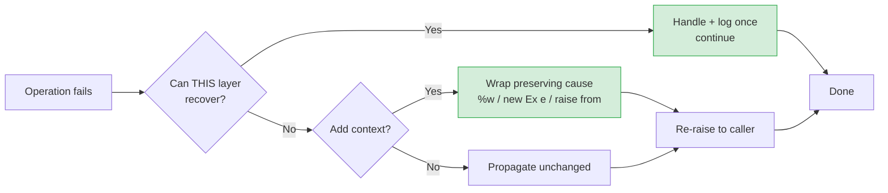

# Error Handling — Find the Bug

> 12 buggy snippets where the defect lives inside the error-handling code itself — a swallowed exception, an ignored `err`, a lost `%w` wrap, a `defer Close()` that drops data. Find the bug first, then read why the *handling* (not the happy path) is what broke production.

---

## Table of Contents

- [How to Use](#how-to-use)
- [Snippet 1 — Swallowed exception commits corrupt data (Java)](#snippet-1--swallowed-exception-commits-corrupt-data-java)
- [Snippet 2 — Ignored `err` then used zero value (Go)](#snippet-2--ignored-err-then-used-zero-value-go)
- [Snippet 3 — `defer f.Close()` loses buffered writes (Go)](#snippet-3--defer-fclose-loses-buffered-writes-go)
- [Snippet 4 — Broad `except` masks a programming bug (Python)](#snippet-4--broad-except-masks-a-programming-bug-python)
- [Snippet 5 — Wrapping with `%v` breaks `errors.Is` (Go)](#snippet-5--wrapping-with-v-breaks-errorsis-go)
- [Snippet 6 — Returning `null` becomes an NPE downstream (Java)](#snippet-6--returning-null-becomes-an-npe-downstream-java)
- [Snippet 7 — Early return inside `try` skips `finally` intent (Java)](#snippet-7--early-return-inside-try-skips-finally-intent-java)
- [Snippet 8 — Resource leak from missing `with` (Python)](#snippet-8--resource-leak-from-missing-with-python)
- [Snippet 9 — Retry loop hammers a non-retryable error (Go)](#snippet-9--retry-loop-hammers-a-non-retryable-error-go)
- [Snippet 10 — Exception in `finally` masks the real one (Java)](#snippet-10--exception-in-finally-masks-the-real-one-java)
- [Snippet 11 — `except` clause ordering shadows the specific handler (Python)](#snippet-11--except-clause-ordering-shadows-the-specific-handler-python)
- [Snippet 12 — Error used before the `err != nil` check (Go)](#snippet-12--error-used-before-the-err--nil-check-go)
- [Scorecard](#scorecard)
- [Related Topics](#related-topics)

---

## How to Use

Each snippet is a small, runnable program with a defect hidden in its error-handling. For each one:

1. Read the code and decide **what's wrong** before expanding the answer.
2. State the *observable symptom* (what a user/operator sees) and the *root cause* (the handling decision that caused it).
3. Open `<details>` to check yourself.

Difficulty is marked 🟢 junior / 🟡 mid / 🔴 senior. The senior ones rarely fail in unit tests — they fail under partial failure, concurrency, or at a scale where "rare" becomes "every minute." Where it helps, here's the mental model for how an error should travel:



The bugs below are all the *missing* arrows: a path that swallows instead of propagating, drops the cause instead of wrapping, or recovers when it cannot.

---

## Snippet 1 — Swallowed exception commits corrupt data (Java)

🟡 mid

```java
public void importUsers(List<RawUser> rows, Connection conn) throws SQLException {
    conn.setAutoCommit(false);
    PreparedStatement ps = conn.prepareStatement(
        "INSERT INTO users (email, age) VALUES (?, ?)");

    for (RawUser row : rows) {
        try {
            ps.setString(1, row.email());
            ps.setInt(2, Integer.parseInt(row.ageText()));  // may throw
            ps.executeUpdate();
        } catch (Exception e) {
            // skip bad rows, keep importing
            log.warn("skipping row: " + row);
        }
    }

    conn.commit();
}
```

**Where is the bug?**

<details><summary>Hint</summary>

Two different kinds of failure are caught by the same `catch`. One of them happens *after* the row was already sent to the database.
</details>

<details><summary>Answer</summary>

**Symptom:** Some imports finish "successfully" but the `users` table ends up with fewer rows than expected — or worse, with rows the operator believes were rejected. Intermittently, the whole batch is committed even though a row failed mid-write.

**Root cause:** `catch (Exception e)` swallows *everything* and then the loop falls through to `conn.commit()`. Two problems compound:

1. **Mixed failure semantics.** `Integer.parseInt` throwing `NumberFormatException` is a clean validation failure — skipping that row is defensible. But `ps.executeUpdate()` can throw `SQLException` (constraint violation, deadlock, connection reset). Swallowing a `SQLException` and continuing means the transaction may already be in an aborted/poisoned state, yet we still call `commit()`.
2. **Commit-after-swallow.** Because every failure is suppressed, control *always* reaches `conn.commit()`. A failure that should have aborted the transaction instead gets committed with whatever partial state exists.

The broad `catch (Exception e)` is the smell; the silent `log.warn` then `commit()` is the bug. It converts "some rows are invalid" and "the database is unhealthy" into the same indistinguishable outcome: a green import.

**Fix:** catch only the validation exception, let infrastructure exceptions propagate and roll back, and track whether any row failed so the caller can decide.

```java
public ImportResult importUsers(List<RawUser> rows, Connection conn) throws SQLException {
    conn.setAutoCommit(false);
    var failures = new ArrayList<RowError>();
    try (PreparedStatement ps = conn.prepareStatement(
            "INSERT INTO users (email, age) VALUES (?, ?)")) {

        for (RawUser row : rows) {
            int age;
            try {
                age = Integer.parseInt(row.ageText());   // validation only
            } catch (NumberFormatException e) {
                failures.add(new RowError(row, "bad age: " + row.ageText()));
                continue;
            }
            ps.setString(1, row.email());
            ps.setInt(2, age);
            ps.executeUpdate();   // SQLException is NOT caught — it propagates
        }
        conn.commit();
        return new ImportResult(rows.size() - failures.size(), failures);
    } catch (SQLException e) {
        conn.rollback();          // infrastructure failure ⇒ abort the whole batch
        throw e;
    }
}
```

Validation errors are collected and reported; infrastructure errors abort and roll back. The two are no longer the same code path.
</details>

---

## Snippet 2 — Ignored `err` then used zero value (Go)

🟢 junior

```go
func loadConfig(path string) Config {
    data, _ := os.ReadFile(path)

    var cfg Config
    json.Unmarshal(data, &cfg)   // err ignored too

    if cfg.MaxConnections == 0 {
        cfg.MaxConnections = 100 // "sensible default"
    }
    return cfg
}
```

**Where is the bug?**

<details><summary>Answer</summary>

**Symptom:** A typo in the config path (or a malformed JSON file) does not crash and does not log anything. The service silently boots with `MaxConnections = 100` and every other field at its zero value (`""`, `0`, `false`, `nil`). Operators spend hours wondering why their config changes "aren't being picked up."

**Root cause:** both errors are discarded.

- `data, _ := os.ReadFile(path)` — if the file is missing, `data` is `nil`, no error surfaces.
- `json.Unmarshal(data, &cfg)` — unmarshalling `nil`/`[]byte("")` leaves `cfg` as the zero `Config`. Its error is also ignored.

Then the code *masks* the failure further: the `MaxConnections == 0` default makes a completely empty config look partially intentional. A wrong-but-plausible default is more dangerous than a crash, because it ships to production silently.

In Go, `val, _ := f()` is the equivalent of an empty `catch {}` — it is the single most common way a zero value flows into logic that assumes a real value.

**Fix:** return the error; let the caller decide whether a missing config is fatal (it almost always is at startup).

```go
func loadConfig(path string) (Config, error) {
    data, err := os.ReadFile(path)
    if err != nil {
        return Config{}, fmt.Errorf("read config %q: %w", path, err)
    }
    var cfg Config
    if err := json.Unmarshal(data, &cfg); err != nil {
        return Config{}, fmt.Errorf("parse config %q: %w", path, err)
    }
    if cfg.MaxConnections == 0 {
        cfg.MaxConnections = 100 // a default is fine once we KNOW the file parsed
    }
    return cfg, nil
}

// caller:
cfg, err := loadConfig(path)
if err != nil {
    log.Fatalf("config: %v", err)   // fail loud, fail at boot
}
```

The default is still applied — but only *after* we have confirmed the file existed and parsed.
</details>

---

## Snippet 3 — `defer f.Close()` loses buffered writes (Go)

🔴 senior

```go
func writeReport(path string, rows []Row) error {
    f, err := os.Create(path)
    if err != nil {
        return err
    }
    defer f.Close()

    w := bufio.NewWriter(f)
    for _, r := range rows {
        if _, err := fmt.Fprintf(w, "%s,%d\n", r.Name, r.Value); err != nil {
            return err
        }
    }
    w.Flush()
    return nil
}
```

**Where is the bug?**

<details><summary>Hint</summary>

There are two writers here: `bufio.Writer` and the file. Which errors are being checked, and which are being thrown away? What happens if the disk fills up?
</details>

<details><summary>Answer</summary>

**Symptom:** On a full disk (or a network filesystem hiccup), `writeReport` returns `nil` — success — but the file on disk is **truncated**: the last buffered chunk never made it. Downstream jobs read a silently incomplete report.

**Root cause:** two ignored errors, both on the close/flush path.

1. **`w.Flush()` error is discarded.** `bufio.Writer` accumulates data in memory; the individual `Fprintf` calls usually succeed against the buffer. The *actual* write to the file happens at `Flush()`. If the disk is full, `Flush()` returns an error — which this code ignores — and the function returns `nil`.
2. **`defer f.Close()` error is discarded.** Even after a successful `Flush`, `Close()` can fail (final fsync on some filesystems, NFS commit). `defer f.Close()` throws that error away. For a writable file, a failed `Close` means the data is not durable.

`defer f.Close()` is correct for *read* handles, where Close errors are uninteresting. For *write* handles it silently drops the most important error in the function.

**Fix:** check `Flush`, and capture the `Close` error via a named return, taking care not to overwrite an earlier, more relevant error.

```go
func writeReport(path string, rows []Row) (err error) {
    f, err := os.Create(path)
    if err != nil {
        return err
    }
    defer func() {
        if cerr := f.Close(); cerr != nil && err == nil {
            err = fmt.Errorf("close %q: %w", path, cerr)
        }
    }()

    w := bufio.NewWriter(f)
    for _, r := range rows {
        if _, err = fmt.Fprintf(w, "%s,%d\n", r.Name, r.Value); err != nil {
            return err
        }
    }
    if err = w.Flush(); err != nil {       // surface the buffered-write failure
        return fmt.Errorf("flush %q: %w", path, err)
    }
    return nil
}
```

Now a full disk produces an error the caller can see, instead of a quietly truncated file.
</details>

---

## Snippet 4 — Broad `except` masks a programming bug (Python)

🟡 mid

```python
def get_user_discount(user, catalog):
    try:
        tier = user.subscription.tier
        rate = catalog.discount_rates[tier]
        return rate
    except Exception:
        # no discount if anything goes wrong
        return 0.0
```

**Where is the bug?**

<details><summary>Answer</summary>

**Symptom:** Premium users intermittently get charged full price. There is no error in the logs, no stack trace, nothing — the bug is invisible. Support tickets pile up; engineering cannot reproduce it because the code "handles all errors."

**Root cause:** `except Exception` catches *programming bugs* alongside the one expected condition.

The author's intent was: "if this user has no subscription tier in the catalog, default to no discount." The legitimate expected failure is a `KeyError` from `catalog.discount_rates[tier]`. But the bare `except Exception` also swallows:

- `AttributeError` — `user.subscription` is `None` because of an unrelated serialization bug, so `.tier` raises. That's a real bug, now hidden.
- `TypeError` — `tier` is unhashable due to a data corruption upstream.
- A typo like `catalog.discount_ratez` would raise `AttributeError` and be silently swallowed, so the function returns `0.0` for *everyone*, forever, with zero signal.

Catching `Exception` turns "this is broken, alert me" into "everything is fine, here's 0.0." The handler is wider than the failure it was written for.

**Fix:** catch only the specific, expected exception, and let everything else crash loudly (so monitoring catches it).

```python
def get_user_discount(user, catalog):
    if user.subscription is None:
        return 0.0                       # explicit, expected business case
    tier = user.subscription.tier
    try:
        return catalog.discount_rates[tier]
    except KeyError:
        # unknown tier is a genuine "no configured discount" case
        log.warning("no discount configured for tier %s", tier)
        return 0.0
```

Now an `AttributeError` from a `None` subscription that *shouldn't* be `None` propagates, gets logged with a stack trace, and pages someone. Only the one anticipated condition (`KeyError` for an unconfigured tier) is handled.
</details>

---

## Snippet 5 — Wrapping with `%v` breaks `errors.Is` (Go)

🔴 senior

```go
var ErrNotFound = errors.New("not found")

func fetchUser(id string) (*User, error) {
    u, err := db.QueryUser(id)   // returns ErrNotFound when missing
    if err != nil {
        return nil, fmt.Errorf("fetchUser %s: %v", id, err)
    }
    return u, nil
}

// caller:
u, err := fetchUser(id)
if errors.Is(err, ErrNotFound) {
    return http.StatusNotFound
}
return http.StatusInternalServerError
```

**Where is the bug?**

<details><summary>Hint</summary>

Look very closely at the format verb in `fmt.Errorf`. What does `errors.Is` need in the chain to return `true`?
</details>

<details><summary>Answer</summary>

**Symptom:** Requesting a user that doesn't exist returns **HTTP 500** instead of **404**. Monitoring shows a spike in 5xx errors and pages on-call, even though nothing is actually broken — the user simply doesn't exist. Alert fatigue and a wrong status code for clients.

**Root cause:** the error is wrapped with `%v` instead of `%w`.

- `%v` formats the error as a *string* and creates a brand-new error with no link to the original. The `ErrNotFound` sentinel is now buried in a flat message — `errors.Is(err, ErrNotFound)` walks the wrap chain via `Unwrap()`, finds nothing, and returns `false`.
- `%w` wraps the error, making it part of the chain so `Unwrap()` returns the original `ErrNotFound`, and `errors.Is` returns `true`.

This is the Go equivalent of `catch (SQLException e) { throw new RuntimeException(e.getMessage()); }` — it preserves the *text* but throws away the *cause*. The string still reads "not found," so it looks correct in logs, which is exactly why it survives code review.

**Fix:** wrap with `%w`.

```go
func fetchUser(id string) (*User, error) {
    u, err := db.QueryUser(id)
    if err != nil {
        return nil, fmt.Errorf("fetchUser %s: %w", id, err)  // %w, not %v
    }
    return u, nil
}
```

Now `errors.Is(err, ErrNotFound)` returns `true` and the handler maps it to 404. (Symmetric rule in Java: `new MyException("...", cause)` not `new MyException(cause.getMessage())`; in Python: `raise MyError(...) from err`.)
</details>

---

## Snippet 6 — Returning `null` becomes an NPE downstream (Java)

🟢 junior

```java
public class UserService {
    public User findByEmail(String email) {
        for (User u : repository.all()) {
            if (u.getEmail().equalsIgnoreCase(email)) {
                return u;
            }
        }
        return null;   // not found
    }
}

// caller, written by a different team:
User user = userService.findByEmail(input);
sendWelcomeEmail(user.getEmail(), user.getName());
```

**Where is the bug?**

<details><summary>Answer</summary>

**Symptom:** When a lookup misses (typo'd email, deleted account), the app throws `NullPointerException` deep inside `sendWelcomeEmail` — far from `findByEmail`, where the actual "not found" decision was made. The stack trace points at the email code, sending the on-call engineer to the wrong place.

**Root cause:** `return null` to signal "absent" pushes a hidden contract onto every caller: *you must remember to null-check.* The compiler does not enforce it. The downstream team didn't know `findByEmail` could return `null`, so they dereferenced it directly. The error surfaces one or more call frames away from its cause — the hallmark of the `null` anti-pattern.

`null` is not a value; it's the absence of a value masquerading as one. It silently satisfies the type checker and then explodes at runtime.

**Fix:** make absence explicit in the type with `Optional` (or throw a typed exception if "not found" is truly exceptional).

```java
public Optional<User> findByEmail(String email) {
    return repository.all().stream()
        .filter(u -> u.getEmail().equalsIgnoreCase(email))
        .findFirst();
}

// caller is now FORCED to handle the empty case:
userService.findByEmail(input).ifPresentOrElse(
    user -> sendWelcomeEmail(user.getEmail(), user.getName()),
    ()   -> log.info("no user for {}; skipping welcome email", input)
);
```

The "not found" case is no longer an invisible landmine — the type system requires the caller to address it. (Go equivalent: return `(value, ok bool)` or `(value, error)`; Python: return `None` but annotate `Optional[User]` and let a checker enforce the guard.)
</details>

---

## Snippet 7 — Early return inside `try` skips `finally` intent (Java)

🟡 mid

```java
public boolean processBatch(List<Job> jobs) {
    lock.acquire();
    try {
        for (Job j : jobs) {
            if (!j.isValid()) {
                return false;            // bail out early
            }
            j.run();
        }
        return true;
    } finally {
        if (allJobsSucceeded(jobs)) {    // only release when everything worked
            lock.release();
        }
    }
}
```

**Where is the bug?**

<details><summary>Hint</summary>

`finally` always runs — that part is fine. The question is what the *condition inside* `finally` does on the early-return path.</details>

<details><summary>Answer</summary>

**Symptom:** After a batch containing one invalid job, the system deadlocks. Every subsequent caller blocks forever trying to `lock.acquire()`. It happens only when a job is invalid — so it never reproduces in the happy-path test suite.

**Root cause:** the `finally` block runs, but its *guard* makes cleanup conditional. On the `return false` path, `allJobsSucceeded(jobs)` is `false`, so `lock.release()` is **skipped** — the lock is leaked. Even worse, if `j.run()` throws, the `finally` runs with `allJobsSucceeded` false and again never releases.

`finally` is for *unconditional* cleanup. The moment you put an `if` around the release that can be false on a failure path, you've recreated the bug `finally` exists to prevent: a resource acquired but not released when something goes wrong.

**Fix:** acquisition and release must be unconditionally paired. Use try-with-resources (or at minimum an unguarded release).

```java
public boolean processBatch(List<Job> jobs) {
    try (Lease lease = lock.acquire()) {   // AutoCloseable releases on ANY exit
        for (Job j : jobs) {
            if (!j.isValid()) {
                return false;
            }
            j.run();
        }
        return true;
    }
}
```

`Lease.close()` releases the lock on *every* exit path — normal return, early return, or exception — with no condition to get wrong. If you cannot use try-with-resources, the `finally` must be an unconditional `lock.release();`.
</details>

---

## Snippet 8 — Resource leak from missing `with` (Python)

🟢 junior

```python
def count_lines(paths):
    counts = {}
    for path in paths:
        f = open(path)
        try:
            counts[path] = sum(1 for _ in f)
        except UnicodeDecodeError:
            counts[path] = -1
            continue          # binary file, skip it
        f.close()
    return counts
```

**Where is the bug?**

<details><summary>Answer</summary>

**Symptom:** Run over a large directory containing a few binary files and the process eventually dies with `OSError: [Errno 24] Too many open files`. The failure scales with the *number of skipped files*, so it only appears in production on big inputs.

**Root cause:** `f.close()` is unreachable on the exception path. When `UnicodeDecodeError` is raised, `continue` jumps to the next loop iteration — *before* `f.close()` runs. Every binary file leaks one file descriptor. The `try` block protects the *read* but the cleanup sits *outside* it, so any non-local exit (here `continue`, but `return`/`raise`/`break` are equally affected) skips it.

This is the Python form of the same mistake as Snippet 7: cleanup is not bound to the resource's lifetime, so a control-flow shortcut bypasses it.

**Fix:** use `with`, which closes the file on *any* exit from the block — including exceptions and `continue`.

```python
def count_lines(paths):
    counts = {}
    for path in paths:
        try:
            with open(path) as f:           # guaranteed close on any exit
                counts[path] = sum(1 for _ in f)
        except UnicodeDecodeError:
            counts[path] = -1               # file already closed by `with`
    return counts
```

The `with` block's `__exit__` runs whether the body completes, raises, or is short-circuited, so no descriptor leaks regardless of how control leaves the block.
</details>

---

## Snippet 9 — Retry loop hammers a non-retryable error (Go)

🔴 senior

```go
func fetchWithRetry(url string) ([]byte, error) {
    var lastErr error
    for attempt := 0; attempt < 5; attempt++ {
        resp, err := http.Get(url)
        if err != nil {
            lastErr = err
            time.Sleep(time.Second)
            continue
        }
        defer resp.Body.Close()

        if resp.StatusCode != http.StatusOK {
            lastErr = fmt.Errorf("status %d", resp.StatusCode)
            time.Sleep(time.Second)
            continue
        }
        return io.ReadAll(resp.Body)
    }
    return nil, lastErr
}
```

**Where is the bug?**

<details><summary>Hint</summary>

Retrying makes sense for *some* failures. Is a `400 Bad Request` or `404 Not Found` one of them? Also: where does `defer` actually run inside a loop?
</details>

<details><summary>Answer</summary>

**Symptom:** A request to a URL that returns `404` (or `401`, `400`) takes 5 seconds and makes 5 identical doomed calls before failing — multiplied across every client, this turns a clean client error into a self-inflicted load spike against the upstream. A second, quieter bug: response bodies are not closed until the function *returns*, not per attempt.

**Root cause:** two errors in the retry logic.

1. **Retrying non-retryable errors.** The loop retries *any* non-200 status. A `4xx` is a client error — the request is malformed or the resource doesn't exist; retrying it will *never* succeed and just wastes 5 attempts and 5 seconds. Only transient failures (`5xx`, timeouts, connection resets, `429`) should be retried. Treating all errors as retryable amplifies load precisely when the upstream may already be struggling.
2. **`defer` inside a loop.** `defer resp.Body.Close()` does not run at the end of each iteration — it runs when `fetchWithRetry` *returns*. Across 5 attempts, up to 5 response bodies stay open simultaneously, leaking connections from the pool.

A retry loop without a retryability classifier is a denial-of-service generator pointed at your own dependencies. Add exponential backoff + jitter and a cap so retries don't synchronize into a thundering herd.

**Fix:** classify the error, close each body promptly, and back off.

```go
func fetchWithRetry(ctx context.Context, url string) ([]byte, error) {
    const maxAttempts = 5
    var lastErr error
    for attempt := 0; attempt < maxAttempts; attempt++ {
        body, retryable, err := tryFetch(ctx, url)
        if err == nil {
            return body, nil
        }
        lastErr = err
        if !retryable {
            return nil, err             // 4xx etc. — fail fast, don't hammer
        }
        backoff := time.Duration(1<<attempt) * 100 * time.Millisecond
        jitter := time.Duration(rand.Int63n(int64(backoff)))
        select {
        case <-time.After(backoff + jitter):
        case <-ctx.Done():
            return nil, ctx.Err()
        }
    }
    return nil, fmt.Errorf("exhausted retries: %w", lastErr)
}

func tryFetch(ctx context.Context, url string) (body []byte, retryable bool, err error) {
    req, _ := http.NewRequestWithContext(ctx, http.MethodGet, url, nil)
    resp, err := http.DefaultClient.Do(req)
    if err != nil {
        return nil, true, err                       // network error: retryable
    }
    defer resp.Body.Close()                          // runs at end of THIS call
    switch {
    case resp.StatusCode == http.StatusOK:
        b, err := io.ReadAll(resp.Body)
        return b, false, err
    case resp.StatusCode >= 500 || resp.StatusCode == http.StatusTooManyRequests:
        return nil, true, fmt.Errorf("status %d", resp.StatusCode)   // retryable
    default:
        return nil, false, fmt.Errorf("status %d", resp.StatusCode)  // 4xx: terminal
    }
}
```

Bodies close per attempt (the `defer` is inside `tryFetch`), `4xx` fails immediately, and backoff with jitter prevents synchronized retries.
</details>

---

## Snippet 10 — Exception in `finally` masks the real one (Java)

🔴 senior

```java
public String readFirstLine(String path) throws IOException {
    BufferedReader reader = new BufferedReader(new FileReader(path));
    try {
        return reader.readLine();   // (A) may throw IOException on a bad read
    } finally {
        reader.close();             // (B) may ALSO throw IOException
    }
}
```

**Where is the bug?**

<details><summary>Hint</summary>

Both `readLine()` and `close()` can throw. If *both* throw, which exception does the caller actually see — and is it the one that explains the failure?
</details>

<details><summary>Answer</summary>

**Symptom:** A disk read fails partway through `readLine()` (the real, root-cause failure). The caller's log shows an `IOException: Stream closed` from `close()` — a generic, useless error — and the original "bad sector / read error" is gone. Debugging starts from the wrong exception.

**Root cause:** when the `try` block throws exception **A** and the `finally` block *also* throws exception **B**, Java discards **A** and propagates **B**. The exception thrown from `finally` *masks* (suppresses) the one from the body. The most informative error — the one that explains *why* things went wrong — is silently dropped in favor of a cleanup-time symptom.

This is a classic in any language with `finally`: cleanup that can throw will overwrite the real error unless you take care. A naive manual `try/finally` with a throwing `close()` always has this hazard.

**Fix:** use try-with-resources. It propagates the body's exception and *attaches* the close exception as a suppressed exception rather than replacing it.

```java
public String readFirstLine(String path) throws IOException {
    try (BufferedReader reader = new BufferedReader(new FileReader(path))) {
        return reader.readLine();
    }
    // If readLine() throws A and close() throws B:
    //   A propagates (the real cause), B is attached via A.getSuppressed().
}
```

Now the caller sees the genuine read failure, and the close failure is still recoverable via `Throwable.getSuppressed()` for diagnostics — nothing is lost. (Go analogue: in a deferred close, only overwrite the named `err` *if it is currently nil*, as in Snippet 3. Python's `with` does the same: an exception during `__exit__` does not silently erase the body's exception in the same way, but chaining via `raise ... from` keeps both visible.)
</details>

---

## Snippet 11 — `except` clause ordering shadows the specific handler (Python)

🟡 mid

```python
def load_resource(resource_id):
    try:
        return registry.fetch(resource_id)
    except Exception as e:
        log.error("fetch failed: %s", e)
        return DEFAULT_RESOURCE
    except ResourceNotFound:
        log.info("resource %s not found, provisioning", resource_id)
        return provision(resource_id)
```

**Where is the bug?**

<details><summary>Answer</summary>

**Symptom:** Resources that don't exist yet are *never* auto-provisioned. Instead the function quietly returns `DEFAULT_RESOURCE` for every missing resource, so callers operate on a placeholder. New tenants silently get the default configuration and no one notices until support escalates. In some Python versions this code won't even compile cleanly under linters, but it *runs*.

**Root cause:** `except` clauses are evaluated **top to bottom**, and the first matching type wins. `ResourceNotFound` is (almost certainly) a subclass of `Exception`, so the broad `except Exception` above it matches first and catches *everything*, including `ResourceNotFound`. The specific `except ResourceNotFound` handler below is **unreachable** — dead code. The provisioning branch never runs.

This is the ordering rule inverted: catch handlers must go from **most specific to most general**. Putting the catch-all first shadows every specific handler beneath it.

**Fix:** order from specific to general (and, ideally, don't have a catch-all that returns a default at all — see Snippet 4).

```python
def load_resource(resource_id):
    try:
        return registry.fetch(resource_id)
    except ResourceNotFound:                # specific FIRST
        log.info("resource %s not found, provisioning", resource_id)
        return provision(resource_id)
    except RegistryUnavailable as e:        # next most specific
        log.error("registry down: %s", e)
        raise                               # transient infra error — propagate
```

Now `ResourceNotFound` reaches its handler and triggers provisioning. The broad `except Exception` is gone entirely; an unanticipated exception propagates instead of being papered over with a default. (Same rule in Java: a `catch (Exception e)` placed before `catch (FileNotFoundException e)` is a *compile error* — Java protects you here, Python does not.)
</details>

---

## Snippet 12 — Error used before the `err != nil` check (Go)

🟡 mid

```go
func parseAmount(s string) (int64, error) {
    cents, err := strconv.ParseInt(s, 10, 64)
    if cents < 0 {
        return 0, fmt.Errorf("amount cannot be negative: %s", s)
    }
    if err != nil {
        return 0, fmt.Errorf("invalid amount %q: %w", s, err)
    }
    return cents, nil
}
```

**Where is the bug?**

<details><summary>Hint</summary>

What is the value of `cents` when `ParseInt` fails? And which check runs first?</details>

<details><summary>Answer</summary>

**Symptom:** Parsing a non-numeric string like `"abc"` returns the error `"invalid amount"` — *usually*. But parsing `""` or `"99999999999999999999"` (overflow) can return the *wrong* error message, and in a refactored variant where the negative check returns a different sentinel, malformed input is misclassified as a negative-amount error. The classification of failures is subtly wrong.

**Root cause:** the value `cents` is inspected **before** `err` is checked. When `strconv.ParseInt` fails, it returns `(0, err)` for a parse error — but on a range error (overflow) it returns the clamped boundary value (`math.MaxInt64` or `math.MinInt64`) *together with* a non-nil error. So:

- On overflow of a large negative number, `ParseInt` returns `(math.MinInt64, rangeError)`. The code checks `cents < 0` *first*, sees `MinInt64 < 0`, and returns "amount cannot be negative" — the wrong diagnosis. The real problem is overflow, not sign.
- More generally, you must never trust the returned value until you've confirmed `err == nil`. The error check has to come first; the value is meaningless otherwise.

This is the Go cousin of using a function's result before checking whether it failed — the ordering is reversed, so a failure is interpreted as a (bogus) success value.

**Fix:** check `err` immediately, before touching the value.

```go
func parseAmount(s string) (int64, error) {
    cents, err := strconv.ParseInt(s, 10, 64)
    if err != nil {                                       // check error FIRST
        return 0, fmt.Errorf("invalid amount %q: %w", s, err)
    }
    if cents < 0 {                                        // value is trustworthy now
        return 0, fmt.Errorf("amount cannot be negative: %s", s)
    }
    return cents, nil
}
```

The rule is mechanical and absolute in Go: a returned value is undefined when its accompanying error is non-nil, so the `err != nil` guard must precede any use of the value.
</details>

---

## Scorecard

Track how many you diagnosed correctly *before* opening the answer. Aim for symptom **and** root cause, not just "something's off."

| # | Snippet | Language | Difficulty | Core failure |
|---|---------|----------|------------|--------------|
| 1 | Swallowed exception commits corrupt data | Java | 🟡 mid | Broad catch + commit-after-swallow |
| 2 | Ignored `err`, used zero value | Go | 🟢 junior | `val, _ :=` discards the failure |
| 3 | `defer f.Close()` loses buffered writes | Go | 🔴 senior | Unchecked `Flush`/`Close` on write path |
| 4 | Broad `except` masks a programming bug | Python | 🟡 mid | `except Exception` hides bugs |
| 5 | `%v` breaks `errors.Is` | Go | 🔴 senior | Wrap loses the cause |
| 6 | Returning `null` → NPE downstream | Java | 🟢 junior | Absence modeled as `null` |
| 7 | Early return skips `finally` intent | Java | 🟡 mid | Conditional cleanup leaks a lock |
| 8 | Missing `with` leaks descriptors | Python | 🟢 junior | Cleanup outside the protected scope |
| 9 | Retry hammers non-retryable error | Go | 🔴 senior | No retryability classifier + `defer` in loop |
| 10 | Exception in `finally` masks the real one | Java | 🔴 senior | Cleanup exception suppresses root cause |
| 11 | `except` ordering shadows handler | Python | 🟡 mid | Catch-all before specific = dead code |
| 12 | Error used before `err != nil` check | Go | 🟡 mid | Trusting a value when err is non-nil |

| Score | Level |
|-------|-------|
| 11–12 | You read error paths as carefully as happy paths. Senior signal. |
| 8–10 | Strong. Revisit the 🔴 ones — they're the ones that page you at 3 a.m. |
| 5–7 | Solid fundamentals. Drill wrapping (`%w`), resource lifetimes, and retry classification. |
| 0–4 | Re-read [junior.md](junior.md) and [tasks.md](tasks.md), then come back. |

A common thread links every bug: the defect is in the code that runs *when something goes wrong* — the path that is hardest to exercise in tests and easiest to skip in review. Test your error paths as deliberately as your success paths.

---

## Related Topics

- [junior.md](junior.md) — the foundational definitions: handle, wrap, or propagate; never swallow.
- [tasks.md](tasks.md) — practice exercises that build the reflexes these bugs exploit.
- [Chapter README](../README.md) — the positive rules this chapter teaches and the anti-patterns it warns against.
- [Anti-Patterns](../../anti-patterns/README.md) — error swallowing and silent failure as recurring code anti-patterns.
- [Refactoring](../../refactoring/README.md) — restructuring techniques (extract method, replace null with Optional) that make these bugs structurally impossible.
