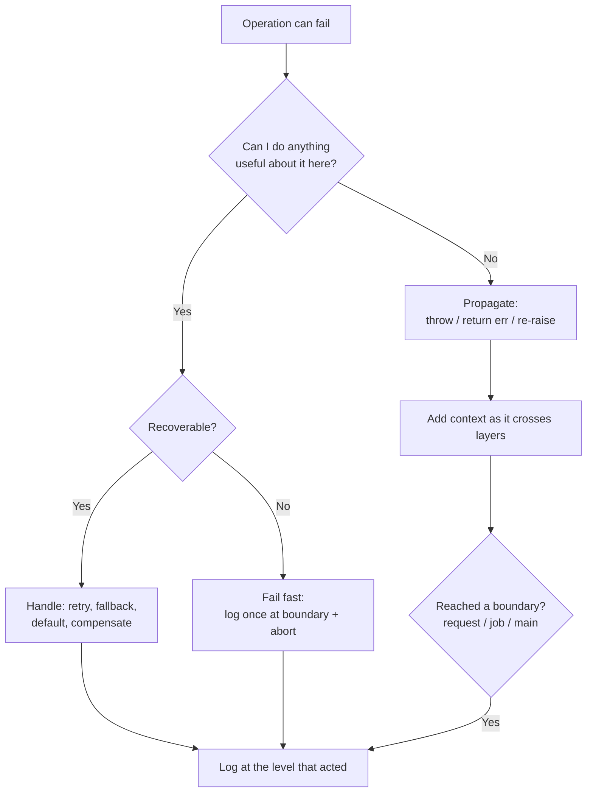

# Error Handling — Interview Questions

> 50+ questions across four tiers (Junior → Mid → Senior → Staff). Covers exceptions vs error codes vs Result, checked vs unchecked, Go's `if err != nil` / `errors.Is` / `errors.As` / `%w`, never swallowing, adding context, exceptions as control flow, null vs Optional/Result, handle-vs-propagate, resource cleanup, panic/recover, exception safety, logging vs throwing, and API error models. Use it for self-review or interview prep.

## Table of Contents

- [Junior](#junior-15-questions)
- [Mid](#mid-15-questions)
- [Senior](#senior-12-questions)
- [Staff](#staff-10-questions)
- [Rapid-Fire](#rapid-fire)
- [Summary](#summary)
- [Further Reading](#further-reading)
- [Related Topics](#related-topics)

The decision a reader is really making at each call site:



---

## Junior (15 questions)

### J1. What is error handling, and why does it deserve its own chapter?

<details><summary>Answer</summary>

Error handling is everything code does when an operation cannot complete normally: signaling, propagating, recovering, cleaning up, and reporting. It gets its own chapter because the *happy path* is usually the small part of real systems — networks fail, disks fill, input is malformed, services time out. Code that ignores this is not "simpler," it is wrong; it just hasn't crashed yet.

</details>

### J2. Exceptions vs error codes vs Result types — name one strength of each.

<details><summary>Answer</summary>

- **Exceptions:** keep the happy path uncluttered; errors propagate automatically until someone catches them.
- **Error codes (return values):** explicit, cheap, visible in the signature; no hidden control flow.
- **Result / `Either` types:** make the failure part of the type, so the compiler forces you to deal with it (`Result<T, E>`, `Option<T>`).

The wrong move is mixing them inconsistently within one layer.

</details>

### J3. What does "never swallow an exception" mean?

<details><summary>Answer</summary>

Don't catch an error and then do nothing with it:

```java
try { risky(); } catch (Exception e) { /* nothing */ }
```

This makes failures invisible — the program limps on in a corrupt state and the bug surfaces later, far from its cause. At minimum, an error must be handled, propagated, or logged with enough context to diagnose it.

</details>

### J4. Why are error codes easy to get wrong?

<details><summary>Answer</summary>

Because the caller can forget to check them. `int rc = doThing();` compiles and runs even if you never inspect `rc`. The failure is silent. Exceptions and `Result` types are better here: exceptions can't be ignored without unwinding the stack, and `Result` types can be made unignorable by the compiler (`#[must_use]` in Rust, linters in Go).

</details>

### J5. What is `if err != nil` in Go, and is it boilerplate?

<details><summary>Answer</summary>

**Trick question — the "yes it's annoying" answer fails it.** It is verbose, but it is not *meaningless* boilerplate. Each block is an explicit decision point: handle, wrap-and-return, or ignore-on-purpose. The verbosity is the price of making every failure visible at the call site — there is no hidden control flow. A senior answer: the noise is real, but the alternative (invisible exceptions) trades visible verbosity for invisible surprise.

</details>

### J6. In Go, how do you add context to an error before returning it?

<details><summary>Answer</summary>

Wrap it with `fmt.Errorf` and the `%w` verb:

```go
if err != nil {
    return fmt.Errorf("load config %q: %w", path, err)
}
```

`%w` preserves the original error in the chain so callers can still inspect it with `errors.Is`/`errors.As`. Use `%v` only when you deliberately want to *stop* the chain (hide the cause).

</details>

### J7. What do `errors.Is` and `errors.As` do?

<details><summary>Answer</summary>

- `errors.Is(err, target)` — walks the wrapped chain checking whether any error in it equals a sentinel (e.g., `errors.Is(err, sql.ErrNoRows)`).
- `errors.As(err, &target)` — walks the chain looking for an error of a specific *type* and, if found, assigns it so you can read its fields.

Both replace fragile string matching (`strings.Contains(err.Error(), "no rows")`).

</details>

### J8. What's wrong with returning `null` to signal "not found"?

<details><summary>Answer</summary>

`null` is ambiguous (not-found? error? uninitialized?) and unenforced — callers forget to check and get a `NullPointerException` later, far from the cause. Prefer an empty collection for "no results," and `Optional`/`Result`/a sentinel error for "single value may be absent." The signature then *tells* the caller absence is possible.

</details>

### J9. When should you return an empty list instead of `null`?

<details><summary>Answer</summary>

Almost always, for collection-returning methods. `getOrders()` returning `null` forces every caller to null-check before iterating; returning `[]` lets them `for (o : getOrders())` safely. Empty is a valid, common state; `null` is a landmine.

</details>

### J10. What is the difference between handling and propagating an error?

<details><summary>Answer</summary>

- **Handle:** you do something useful right here — retry, fall back to a default, return a friendly message.
- **Propagate:** you can't fix it here, so you pass it up (re-throw, `return err`) to a layer that can.

The mistake is handling too early (swallowing) or too late (no boundary ever decides). Handle where you have enough information to act.

</details>

### J11. What is a `finally` block for?

<details><summary>Answer</summary>

It runs whether or not an exception was thrown, so it's where you release resources — close files, sockets, locks. It guarantees cleanup even on the failure path. Modern languages give you cleaner forms: try-with-resources (Java), `using` (C#), `with` (Python), `defer` (Go).

</details>

### J12. What is try-with-resources (Java) / `with` (Python)?

<details><summary>Answer</summary>

Syntactic sugar that auto-closes a resource at the end of the block, even on exception:

```java
try (var in = Files.newInputStream(p)) {
    return read(in);
}   // in.close() runs automatically
```

It replaces error-prone manual `finally { in.close(); }` and handles the "exception while closing" edge case correctly.

</details>

### J13. What does Go's `defer` do?

<details><summary>Answer</summary>

`defer` schedules a call to run when the surrounding function returns, regardless of how it returns (normal or panic). It's Go's idiom for cleanup:

```go
f, err := os.Open(path)
if err != nil { return err }
defer f.Close()
```

Deferred calls run LIFO. Caveat: a `defer`'d `Close()` whose error you ignore can hide a failed flush on writes — capture it when correctness depends on it.

</details>

### J14. Is logging an error the same as handling it?

<details><summary>Answer</summary>

No. Logging records that something happened; handling decides what to *do*. A common anti-pattern is "log and rethrow," which produces duplicate log lines for one failure. Rule of thumb: log where you handle, propagate (don't log) where you don't.

</details>

### J15. What is a stack trace and why keep it?

<details><summary>Answer</summary>

A stack trace records the call path at the moment an exception was created — your single most valuable debugging artifact. You lose it by catching and re-throwing a *new* exception without chaining the cause (`throw new MyError()` instead of `throw new MyError(e)`), or by logging only `e.getMessage()`. Always chain the cause.

</details>

---

## Mid (15 questions)

### M1. Checked vs unchecked exceptions — explain the difference.

<details><summary>Answer</summary>

In Java, **checked** exceptions (subclasses of `Exception` but not `RuntimeException`) must be declared in the method signature and handled or propagated — the compiler enforces it. **Unchecked** exceptions (`RuntimeException`) need no declaration. Checked = "expected, recoverable conditions the caller should consider"; unchecked = "programming errors or unrecoverable faults."

</details>

### M2. Are checked exceptions good or bad?

<details><summary>Answer</summary>

**Trick question — there is no clean "good"/"bad" answer; the interviewer wants the trade-off.** They make recoverable failures visible and force a decision. But they leak implementation details into signatures, break encapsulation, scale badly (every wrapper must re-declare or wrap), and lead to `throws Exception` or empty catches when developers tire of them. Consensus in modern Java/Kotlin: prefer unchecked plus discipline, or `Result`-style returns; Kotlin and Scala dropped checked exceptions entirely. Know *why* both camps exist.

</details>

### M3. Why are exceptions for control flow an anti-pattern?

<details><summary>Answer</summary>

Using `throw`/`catch` to implement ordinary branching (e.g., throwing to break a loop, or `catch (NotFound)` as an `if`) is slow (stack capture has cost), obscures intent, and conflates "exceptional" with "expected." Reserve exceptions for the truly exceptional; use return values or explicit conditionals for routine outcomes like "key absent."

</details>

### M4. What is "catch-and-rethrow without context," and how do you fix it?

<details><summary>Answer</summary>

```java
catch (SQLException e) { throw new SQLException(e); }   // adds nothing
```

It rethrows the same information, sometimes losing the cause. Fix: either let it propagate untouched, or add *new* information the upper layer lacks — what you were doing, which entity, which input — while chaining the cause:

```java
catch (SQLException e) {
    throw new RepositoryException("loading user id=" + id, e);
}
```

</details>

### M5. What is exception translation, and why do it?

<details><summary>Answer</summary>

Converting a low-level exception into one meaningful at the current abstraction layer — e.g., a DAO catching `SQLException` and throwing `UserNotFoundException`. It stops persistence details from leaking into business code, keeping each layer's contract honest. Always chain the cause so the stack trace survives.

</details>

### M6. Optional vs Result vs null — when each?

<details><summary>Answer</summary>

- **`Optional<T>` / `Option<T>`:** value may be absent, and absence carries no *reason* ("user has no middle name").
- **`Result<T, E>` / `Either`:** operation may fail with a *reason* you want to convey (validation errors, IO failure).
- **`null`:** avoid as a domain signal; tolerable only as an internal, immediately-checked detail.

Don't return `Optional` for "operation failed with a cause" — that's what `Result` is for.

</details>

### M7. Should you wrap every line in try/catch?

<details><summary>Answer</summary>

No — that's paranoid handling. Fine-grained try/catch around every statement bloats code, buries the happy path, and usually devolves into copy-pasted swallows. Catch at a boundary where you can make a coherent decision for a whole operation. The right granularity is "per meaningful unit of work," not "per line."

</details>

### M8. When is catching *everything* (`catch (Exception)` / `recover()`) actually OK?

<details><summary>Answer</summary>

**Trick question.** It's legitimate at *outermost boundaries* whose job is to keep the process alive: a request handler that must return 500 rather than crash, a worker that must not let one bad job kill the pool, a top-level supervisor. The rule: catch-all is fine when it (a) sits at a boundary, (b) logs once with full context, and (c) converts the failure into a defined outcome. It's an anti-pattern in the middle of business logic.

</details>

### M9. What is panic/recover in Go, and how does it differ from exceptions?

<details><summary>Answer</summary>

`panic` unwinds the stack running deferred functions; `recover` (only meaningful inside a `defer`) stops the unwinding. It resembles exceptions mechanically but is *not* Go's error idiom. Use `panic` for programmer errors and truly unrecoverable states; use returned `error` values for expected failures. Libraries should not panic across their public API except for genuine misuse.

</details>

### M10. When is it legitimate to recover from a panic?

<details><summary>Answer</summary>

At a process boundary you must keep alive — typically the top of a goroutine that handles a request or job, converting a panic into a logged 500 / failed-job. Recovering deep in library code to "keep going" hides bugs. Recover, log with the stack, and either fail the unit of work cleanly or re-panic if it's genuinely fatal.

</details>

### M11. What is exception safety, and name the guarantee levels.

<details><summary>Answer</summary>

It's the contract about object state when an operation throws partway through:

- **No-throw:** never fails.
- **Strong:** either fully succeeds or leaves state exactly as before (commit-or-rollback).
- **Basic:** no leaks, invariants hold, but state may have changed.
- **No guarantee:** anything goes — avoid.

Aim for strong on operations that mutate shared/important state; basic is the minimum acceptable bar.

</details>

### M12. How do you implement the strong guarantee?

<details><summary>Answer</summary>

Do all the work that can fail on a *copy* or in temporaries, then commit with operations that can't fail. The classic idiom is **copy-and-swap**: build the new state fully, then swap it in with a no-throw operation. For mutations across systems, use transactions or the saga/compensation pattern.

</details>

### M13. Log vs throw — how do you decide?

<details><summary>Answer</summary>

Throw/propagate when you can't handle it here. Log when you *are* the place that decides the outcome. Never both for the same error at the same spot — that double-counts incidents and pollutes logs. Concretely: low-level code returns/throws with context; the boundary logs once at the appropriate severity.

</details>

### M14. What's wrong with `catch (Exception e) { log.error(e); throw e; }` at every layer?

<details><summary>Answer</summary>

It produces one log line *per layer* for a single failure, so your logs show five "errors" that are really one. It also adds nothing to the error. Either add context and rethrow (don't log), or log once and handle. Pick one role per layer.

</details>

### M15. How should an error message be written for a maintainer?

<details><summary>Answer</summary>

State *what* operation failed, on *what* input, and *why* — enough to reproduce without a debugger. `"connection refused"` is weak; `"connect to payments-svc at 10.0.3.4:8443 (attempt 3/3): connection refused"` is actionable. Include identifiers, not secrets. The message is for the engineer at 3 a.m., not the end user.

</details>

---

## Senior (12 questions)

### S1. Design an error model for a public REST/gRPC API.

<details><summary>Answer</summary>

**What the interviewer is really checking:** can you separate internal error representation from the external contract?

- A small, stable set of machine-readable **codes** (e.g., `INVALID_ARGUMENT`, `NOT_FOUND`, `UNAUTHENTICATED`, `RESOURCE_EXHAUSTED`), mapped to HTTP/gRPC status.
- A consistent **envelope**: `{ code, message, details[], requestId }` (RFC 9457 *problem+json* is a good default).
- A human-readable `message` (not for branching) plus structured `details` clients *can* branch on.
- A `requestId`/trace id to correlate with server logs.
- Never leak stack traces, SQL, or internal hostnames to clients.

</details>

### S2. How do you map internal exceptions to API responses without leaking internals?

<details><summary>Answer</summary>

A single boundary layer (exception mapper / middleware / interceptor) catches domain and infrastructure errors and translates them: `ValidationError → 400`, `NotFound → 404`, `AuthError → 401/403`, unknown → `500 + generic message`. The mapper logs the full internal detail server-side with the `requestId`, and returns only the sanitized envelope. Business code throws meaningful domain exceptions; only the boundary knows about HTTP.

</details>

### S3. Sentinel errors vs error types vs opaque errors in Go — trade-offs?

<details><summary>Answer</summary>

- **Sentinel** (`var ErrNotFound = errors.New(...)`): simple, compared with `errors.Is`. Cost: becomes part of your API; renaming breaks callers.
- **Custom types** (`type ValidationError struct{...}`): carry structured data, matched with `errors.As`. Use when callers need fields.
- **Opaque** (just wrap and return): callers can't branch — best when they shouldn't. Expose behavior via interfaces (`interface{ Timeout() bool }`) instead of concrete types when you want to hide identity.

Default to opaque; expose sentinels/types only where callers genuinely must distinguish.

</details>

### S4. How do you handle errors across an async / concurrent boundary?

<details><summary>Answer</summary>

Errors don't propagate up a thread/goroutine stack to the spawner automatically. You must carry them out explicitly: return them on a channel, collect via `errgroup`, settle a `Future`/`Promise` as failed, or use structured concurrency (`CompletableFuture.allOf`, Java's `StructuredTaskScope`, Kotlin coroutines' supervisor scope). Decide aggregation policy: fail-fast (cancel siblings on first error) vs collect-all. Always propagate cancellation so you don't leak work.

</details>

### S5. What is fail-fast vs fail-safe, and when do you choose each?

<details><summary>Answer</summary>

- **Fail-fast:** stop immediately on a bad state (assert preconditions, reject invalid input at the door). Best for programming errors and to prevent corruption.
- **Fail-safe / graceful degradation:** keep serving with reduced functionality (cached data, default config, skip a non-critical feature). Best at runtime boundaries where availability matters.

Mature systems do both: fail-fast on invariants internally, fail-safe on external dependencies.

</details>

### S6. How does error handling interact with retries, circuit breakers, and timeouts?

<details><summary>Answer</summary>

Handling must distinguish **transient** (retry with backoff + jitter) from **permanent** (don't retry — `400`, validation) errors; retrying a permanent failure just amplifies load. A circuit breaker trips after repeated failures to stop hammering a sick dependency. Timeouts turn "hung" into a definite error you can act on. The error *type* drives the policy, which is why typed/classified errors matter at scale.

</details>

### S7. What is the difference between recoverable and unrecoverable errors, and how should APIs encode it?

<details><summary>Answer</summary>

Recoverable = the caller can plausibly do something (retry, choose another path, prompt the user). Unrecoverable = a bug or violated invariant; the only sane response is to crash/abort and get an alert. Rust encodes this in the type system: `Result` for recoverable, `panic!` for unrecoverable. Go: `error` return vs `panic`. Encoding it lets callers stop writing pointless handlers for bugs.

</details>

### S8. How do you make errors observable in production?

<details><summary>Answer</summary>

- **Structured logging:** error as fields (code, entity id, trace id), not interpolated prose.
- **Correlation:** a trace/request id threaded through every log and the client response.
- **Metrics:** counters by error code/category so you alert on rates, not single lines.
- **One log per incident** at the boundary, with the full chain — no duplicate logging per layer.
- **Distinguish severity:** expected 4xx aren't errors; 5xx and unexpected exceptions are.

</details>

### S9. How do you test error paths?

<details><summary>Answer</summary>

Error paths are usually under-tested because they're hard to trigger. Techniques: inject failures (fault injection, mocks that throw/return errors), simulate IO failures (full disk, refused connection, timeout), assert on the *error type and message contract* (not exact prose), property-test that invariants survive on the failure path (exception safety), and use chaos testing for distributed failure. Verify cleanup actually runs (resource released, transaction rolled back).

</details>

### S10. How do you safely refactor toward a Result type in a codebase that throws everywhere?

<details><summary>Answer</summary>

Incrementally, behind a boundary. Introduce `Result` in a new module or at one seam; adapt at the edge (a thin layer that catches exceptions and converts to `Result`, and vice versa) so the two worlds coexist. Migrate call-by-call, leaning on the compiler (`#[must_use]`, sealed result types). Don't do a big-bang rewrite — error handling touches every path, so a global swap is exactly the high-risk change you want to avoid.

</details>

### S11. What are the hidden costs of exceptions, and when do they matter?

<details><summary>Answer</summary>

Constructing an exception captures the stack — cheap relative to most IO, but expensive in a tight loop used as control flow (thousands/sec). The bigger cost is *reasoning*: invisible control flow makes it hard to see all the ways a function can exit. They matter when (a) you throw on a hot path for expected outcomes, or (b) the cognitive cost of hidden exits causes bugs. Don't micro-optimize away exceptions on cold error paths.

</details>

### S12. How do you handle errors during cleanup (an exception while closing)?

<details><summary>Answer</summary>

This is the classic "double fault." Two rules: (1) a cleanup failure must not mask the original, more-important error — try-with-resources solves this by *suppressing* the close exception and attaching it to the primary (`getSuppressed()`); (2) in Go, capture a deferred `Close()` error into the named return only if there wasn't already a more important error. Decide which error "wins" deliberately; never let cleanup silently overwrite the real cause.

</details>

---

## Staff (10 questions)

### S+1. You're setting an org-wide error-handling standard. What goes in it?

<details><summary>Answer</summary>

**What the interviewer is checking:** can you turn taste into an enforceable contract?

- One error model per protocol (REST envelope, gRPC status set) and a mapping table from domain errors to it.
- A rule for log-vs-propagate ("log once at the boundary; propagate with context elsewhere") and a banned list ("no empty catch," "no `catch (Throwable)` outside boundaries").
- Required fields: trace id everywhere, error code taxonomy, severity convention.
- Lint rules / static analysis to enforce it (errcheck, `@CheckReturnValue`, sonar rules) so it's not just a wiki page.
- Guidance on Result vs exceptions for *new* code, plus a migration stance for legacy.

The deliverable is a checked contract, not prose.

</details>

### S+2. How do you choose between exceptions and Result types as a language/platform default?

<details><summary>Answer</summary>

Drivers: does the language *force* handling (Rust/Haskell make `Result` ergonomic and unignorable; Java's checked exceptions tried and partly failed)? What's the team's existing idiom (fighting the ecosystem is costly)? How often are failures "expected" vs "exceptional"? Performance profile (hot paths favor returns). General guidance: `Result` for domain operations where failure is part of the contract and you want compiler enforcement; exceptions for cross-cutting, truly exceptional faults — and never mix both for the *same* category within a layer.

</details>

### S+3. How does error handling change at the distributed-systems level?

<details><summary>Answer</summary>

Failures become partial and ambiguous: a timeout doesn't tell you whether the write happened. This forces **idempotency** (so retries are safe), **at-least-once + dedup** or **exactly-once illusions**, **sagas/compensation** instead of single-process rollback, and **error budgets/SLOs** instead of "no errors." "Add context and propagate" becomes "attach trace context and propagate across the wire." The local discipline scales up, but the guarantees (strong exception safety) get replaced by eventual consistency and reconciliation.

</details>

### S+4. Argue both sides: should a library panic, or always return errors?

<details><summary>Answer</summary>

**Return errors:** the caller owns the failure policy; a library that panics can take down a host process for something the caller could have handled. This is the dominant Go guidance for public APIs.

**Panic (for misuse):** for *programmer errors* — nil where non-nil is required, index out of range, violated precondition — panicking fails fast and loudly, which is better than returning an error nobody checks, and keeps signatures clean. The synthesis: return errors for *expected runtime* failures; panic only for *contract violations by the caller*, documented as such.

</details>

### S+5. How do you prevent error handling from becoming the dominant noise in the codebase?

<details><summary>Answer</summary>

Push failure handling to boundaries and helpers: error-mapping middleware, `errgroup`, decorators/aspects for retry and logging, `?`/`try` operators (Rust/Swift) that collapse propagation to one character, monadic combinators (`map`/`andThen` on `Result`). Centralize policy (one place decides retry/log/translate) so business code expresses intent, not plumbing. The goal is that the happy path reads cleanly while the failure path is still rigorous — not the reverse.

</details>

### S+6. A team reports "our logs are full of errors but nothing is actually broken." Diagnose.

<details><summary>Answer</summary>

Classic symptoms: (1) log-and-rethrow at every layer multiplies one incident into many lines; (2) expected outcomes (validation 4xx, cache miss, `ErrNoRows`) logged at ERROR severity; (3) retries logging each attempt at ERROR. Fixes: log once at the boundary, classify expected outcomes as INFO/DEBUG, alert on *rates and 5xx*, and reserve ERROR for unexpected faults. The deeper issue is conflating "an error value flowed" with "an incident occurred."

</details>

### S+7. How do you reconcile fail-fast with high availability?

<details><summary>Answer</summary>

Apply each at the right scope. Fail-fast *inward*: validate invariants and inputs immediately so corrupt state never spreads, and crash on genuine bugs (let a supervisor restart). Fail-safe *outward*: at dependency boundaries, degrade gracefully (timeouts, circuit breakers, fallbacks, cached responses) so one sick dependency doesn't cascade. The architecture isolates the two with bulkheads — a fast failure in one cell doesn't take down the system.

</details>

### S+8. What is the "errors are values" philosophy and what does it buy you?

<details><summary>Answer</summary>

Treating errors as ordinary first-class values (Go's `error`, Rust's `Result`) rather than out-of-band control flow. Benefits: you can store, pass, aggregate, transform, and inspect them with the normal tools of the language; all exits are visible in the signature; composition is explicit (`errors.Join`, `?`, combinators). The cost is verbosity. The payoff is that control flow has no hidden trapdoors — which is exactly what makes large systems reviewable.

</details>

### S+9. How do you design error handling for backward and forward compatibility?

<details><summary>Answer</summary>

Treat the error contract like any API surface. **Backward:** never repurpose an existing error code's meaning; add new codes additively; keep the envelope shape stable. **Forward:** clients must tolerate *unknown* error codes by falling back to the HTTP/gRPC status class (treat unknown 4xx as client error, 5xx as retryable). Document codes, version the taxonomy if it must change, and avoid branching on human-readable messages — those are free to change.

</details>

### S+10. Walk through an incident caused purely by an error-handling mistake.

<details><summary>Answer</summary>

**What's checked:** can you connect a small code smell to a production outage?

Template: an empty `catch` (or ignored `err`) on a write path meant a partial failure was swallowed; the system reported success while data was silently dropped. Detection lagged because the failure produced no log and no metric. Blast radius grew because retries weren't idempotent, so the eventual manual replay double-applied some records. Remediation: surface the error (return/propagate), add a metric + alert on the failure code, make the operation idempotent, and add a fault-injection test that fails the write to prove the path is now handled. The root cause was "swallowed error," not the dependency that failed.

</details>

---

## Rapid-Fire

| Question | Answer |
|---|---|
| One-line cost of swallowing an exception? | Failures go invisible; bugs surface far from their cause. |
| `%w` vs `%v` in Go `Errorf`? | `%w` keeps the cause in the chain; `%v` flattens (stops the chain). |
| `errors.Is` vs `errors.As`? | `Is` matches a sentinel value; `As` matches/extracts a type. |
| Return `null` or empty list from `getItems()`? | Empty list. |
| `Optional` for "failed with a reason"? | No — use `Result`/`Either`. |
| Exceptions for control flow? | Anti-pattern; reserve for the exceptional. |
| Log *and* rethrow at every layer? | No — log once at the boundary. |
| When is `catch (Exception)` OK? | At a boundary that logs once and returns a defined outcome. |
| Go cleanup idiom? | `defer` (LIFO; capture write-close errors). |
| Strong exception safety means? | All-or-nothing: succeed fully or leave state unchanged. |
| Recover from a panic — where? | Top of a request/job goroutine, then fail the unit cleanly. |
| Transient vs permanent error response? | Retry transient with backoff; never retry permanent. |
| Chain the cause when rethrowing? | Always — it preserves the stack trace. |
| Branch on a human-readable error message? | Never — branch on codes/types. |
| Checked exceptions: settled good or bad? | Neither — a trade-off; modern langs lean unchecked/Result. |

---

## Summary

Good error handling rests on a few invariants that recur at every tier:

- **Make failures visible.** Never swallow; never silently return `null`. Errors-as-values and unignorable `Result` types beat unchecked codes.
- **Handle where you can act; propagate everywhere else** — and *add context* as the error crosses layers (`%w`, exception chaining), never stripping the cause.
- **Separate roles per layer:** business code throws/returns meaningful errors; one boundary logs once, maps to the API model, and decides the outcome.
- **Reserve exceptions/panics for the exceptional;** routine outcomes use return values or conditionals.
- **Guarantee cleanup** (try-with-resources, `defer`, `finally`) and aim for at least basic, ideally strong, exception safety.
- **Design the external error model** deliberately: stable codes, a consistent envelope, a trace id, no internal leakage.
- **At scale, classify errors** (transient vs permanent, recoverable vs not) so retries, circuit breakers, and alerts can act on type rather than guesswork.

The recurring trick questions — "is `if err != nil` bad?", "are checked exceptions good?", "when is catch-all OK?" — all reward the same instinct: name the trade-off and the boundary, don't pick a slogan.

## Further Reading

- *Clean Code*, Robert C. Martin — Chapter 7, "Error Handling."
- *Effective Java*, Joshua Bloch — Items 69–77 (exceptions).
- *The Go Programming Language*, Donovan & Kernighan — Section 5.4 (errors).
- *The Rust Programming Language* — Chapter 9, "Error Handling" (`Result`, `panic!`, `?`).
- RFC 9457 — *Problem Details for HTTP APIs*.
- Andrew Gerrand, "Error handling and Go"; Dave Cheney, "Don't just check errors, handle them gracefully."

## Related Topics

- [Chapter README](../README.md) — the positive rules for error handling.
- [`junior.md`](junior.md) — junior-level definitions and examples.
- [`professional.md`](professional.md) — advanced patterns and production concerns.
- [Defensive vs Offensive Programming](../16-defensive-vs-offensive/README.md) — fail-fast, assertions, and input validation.
- [Anti-Patterns](../../anti-patterns/README.md) — the failure modes (exception swallowing, error-code neglect) catalogued as smells.
