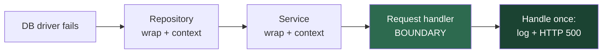

# Error Handling — Junior Level

> Focus: "What's the rule? Show me a clean example." The concrete, day-one habits of handling errors well — prefer real errors over silent codes, attach context, never return or pass `null`, and handle each failure in exactly one clear place. Three languages, dirty → clean, every time.

---

## Table of Contents

1. [Why error handling deserves its own chapter](#why-error-handling-deserves-its-own-chapter)
2. [Real-world analogy](#real-world-analogy)
3. [Rule 1 — Prefer exceptions/errors over silent error codes](#rule-1--prefer-exceptionserrors-over-silent-error-codes)
4. [Rule 2 — Always provide context with the error](#rule-2--always-provide-context-with-the-error)
5. [Rule 3 — Define error types by the caller's needs](#rule-3--define-error-types-by-the-callers-needs)
6. [Rule 4 — Don't return null; don't pass null](#rule-4--dont-return-null-dont-pass-null)
7. [Rule 5 — Fail fast at the boundary](#rule-5--fail-fast-at-the-boundary)
8. [Rule 6 — One clear place to handle each error](#rule-6--one-clear-place-to-handle-each-error)
9. [The three idioms side by side](#the-three-idioms-side-by-side)
10. [Common Mistakes](#common-mistakes)
11. [Test Yourself](#test-yourself)
12. [Cheat Sheet](#cheat-sheet)
13. [Summary](#summary)
14. [Further Reading](#further-reading)
15. [Related Topics](#related-topics)

---

## Why error handling deserves its own chapter

Most code is written for the **happy path** — the case where everything works. But the happy path is the easy part. The quality of a codebase shows in how it behaves when things go wrong: a file is missing, the network times out, the user typed garbage, the database is down.

Error handling is the discipline of making failure **visible, traceable, and recoverable** — without drowning the real logic in noise. Done badly, it produces two opposite disasters:

- **Silent failure** — the error vanishes, the program limps on with corrupt state, and a bug surfaces hours later, three layers away, with no clue where it started.
- **Paranoid noise** — every line wrapped in defensive checks until the actual intent of the code is unreadable.

The rules in this chapter steer between those two. They are not language-specific tricks; they are the same principles whether you write Go's `if err != nil`, Java's `try/catch`, or Python's `try/except`. We'll show all three for every rule.

> **The one-sentence version of the whole chapter:** an error should be *impossible to ignore by accident*, should *carry enough context to debug*, and should be *handled exactly once, in the place that can actually do something about it*.

---

## Real-world analogy

### The kitchen smoke alarm

A smoke alarm is good error handling. When something goes wrong, it is **loud** (you cannot ignore it), it tells you **where** (the one in the kitchen, not the bedroom), and it goes off **once per fire** — not a fresh alarm in every room re-triggering each other into useless din.

Now picture the bad versions:

- **A disconnected alarm** (swallowed exception): the fire spreads silently until the whole house is gone. You never knew until it was far too late.
- **An alarm that just beeps "ERROR"** with no location (context-free error): you know *something* is wrong but waste precious time searching every room.
- **Every alarm in the house screaming at once** (log-and-rethrow at every layer): you can't tell if it's one fire or twenty, and you can't hear yourself think.
- **An alarm so sensitive it screams when you make toast** (paranoid try/catch): you learn to ignore it, so when the real fire comes, you ignore that too.

Good error handling is the well-installed alarm: loud, located, single, and silent until it matters.

---

## Rule 1 — Prefer exceptions/errors over silent error codes

### The rule

When an operation can fail, signal the failure with a mechanism the caller **cannot accidentally ignore** — an exception (Java, Python) or a returned `error` value the language idiom forces you to look at (Go). Do **not** return a magic number like `-1`, `null`, or a status `int` that the caller is free to forget to check.

### Why

An error code is a polite suggestion. Nothing stops the caller from using the result as if it succeeded. The bug then appears far from its cause — in error handling, distance between the cause and the symptom is the enemy.

### Dirty → clean

**Java** — magic return code the caller forgets to check:

```java
// DIRTY — returns -1 on failure; the caller can (and will) ignore it
public int withdraw(Account account, int amount) {
    if (amount > account.balance()) {
        return -1;          // "error" — but nothing forces a check
    }
    account.debit(amount);
    return account.balance();
}

// Call site — the bug: -1 is treated as a real balance
int balance = withdraw(account, 500);
display(balance);           // shows "-1" to the user, or worse, used in math
```

```java
// CLEAN — the failure is an exception; the caller MUST deal with it
public int withdraw(Account account, int amount) {
    if (amount > account.balance()) {
        throw new InsufficientFundsException(account.id(), amount, account.balance());
    }
    account.debit(amount);
    return account.balance();
}

// Call site — success path is clean; failure can't be silently used as a number
int balance = withdraw(account, 500);   // throws if it fails — no -1 to misuse
display(balance);
```

**Python** — sentinel `None`/`-1` versus raising:

```python
# DIRTY — returns None on failure; caller forgets the check, gets a crash later
def find_price(catalog, sku):
    if sku not in catalog:
        return None        # silent
    return catalog[sku].price

total = find_price(catalog, "ABC") * quantity   # TypeError if None — far from the cause
```

```python
# CLEAN — raise a specific exception; the failure is impossible to ignore
class UnknownSku(KeyError):
    pass

def find_price(catalog, sku):
    if sku not in catalog:
        raise UnknownSku(sku)
    return catalog[sku].price

total = find_price(catalog, "ABC") * quantity   # raises UnknownSku at the real cause
```

**Go** — Go has no exceptions, so the idiom is the returned `error`. The clean version is "return the error as a value"; the dirty version is "hide it":

```go
// DIRTY — swallow the error and return a zero value as if nothing happened
func FindPrice(catalog map[string]Item, sku string) float64 {
    item, ok := catalog[sku]
    if !ok {
        return 0          // 0 is a valid price — caller can't tell failure from "free"
    }
    return item.Price
}

// CLEAN — return (value, error); idiom and linters force the caller to check
func FindPrice(catalog map[string]Item, sku string) (float64, error) {
    item, ok := catalog[sku]
    if !ok {
        return 0, fmt.Errorf("unknown sku %q", sku)
    }
    return item.Price, nil
}

// Call site — the error is right there; ignoring it is a visible, lintable choice
price, err := FindPrice(catalog, "ABC")
if err != nil {
    return err
}
total := price * float64(quantity)
```

> **Key idea:** the goal is not "exceptions good, return values bad." Go uses return values *correctly* because the idiom (and tooling like `errcheck`) makes ignoring them stand out. The sin is the *silent* code — a value that looks like success but means failure.

---

## Rule 2 — Always provide context with the error

### The rule

When you raise or return an error, include **what you were trying to do** and the **inputs that mattered**. `"file not found"` is nearly useless. `"loading config /etc/app/db.yaml: file not found"` tells the on-call engineer exactly where to look.

### Why

An error message is read by a tired human at 3 a.m. The difference between a five-minute fix and a two-hour hunt is whether the message answers "what operation, on what data, failed how?"

### Dirty → clean

**Go** — wrap with `%w` to add context while preserving the original error:

```go
// DIRTY — the original error bubbles up naked; no idea which file, which user
func LoadProfile(userID string) (*Profile, error) {
    data, err := os.ReadFile(path(userID))
    if err != nil {
        return nil, err          // "open /x/y: no such file" — but who called it? why?
    }
    return parse(data)
}

// CLEAN — %w adds context AND keeps the original inspectable via errors.Is/As
func LoadProfile(userID string) (*Profile, error) {
    data, err := os.ReadFile(path(userID))
    if err != nil {
        return nil, fmt.Errorf("loading profile for user %s: %w", userID, err)
    }
    return parse(data)
}
// Resulting message: "loading profile for user 42: open /x/y: no such file or directory"
```

`%w` is the wrapping verb. Because the original error is preserved in the chain, a caller can still ask `errors.Is(err, os.ErrNotExist)` to branch on the root cause:

```go
if errors.Is(err, os.ErrNotExist) {
    // a missing file is a normal, expected case here — handle it
}
```

**Java** — pass the cause to the new exception (the chained constructor):

```java
// DIRTY — swallows the cause; the stack trace stops at this line, hiding the root
try {
    return parse(Files.readAllBytes(path));
} catch (IOException e) {
    throw new ConfigException("config error");   // lost: WHAT failed, and WHY
}

// CLEAN — message says what we were doing; `e` preserves the full cause chain
try {
    return parse(Files.readAllBytes(path));
} catch (IOException e) {
    throw new ConfigException("loading config " + path, e);   // cause = e
}
```

Always pass the original exception as the `cause` argument. Dropping it (`throw new ConfigException("...")` with no `e`) erases the stack trace that points to the real failure.

**Python** — chain with `raise ... from`:

```python
# DIRTY — bare re-raise loses the link; or worse, hides the original entirely
try:
    data = read_file(path)
except OSError:
    raise ConfigError("config error")   # Python even warns: original context lost

# CLEAN — `from err` preserves the cause chain ("The above exception was the
# direct cause of the following exception")
try:
    data = read_file(path)
except OSError as err:
    raise ConfigError(f"loading config {path}") from err
```

> **Rule of thumb for the message:** name the **operation** ("loading config"), include the **key input** (`path`, `userID`), and let the wrapped/chained cause supply the low-level detail. Do not restate the lower error ("file not found: file not found") — add new information at each layer.

---

## Rule 3 — Define error types by the caller's needs

### The rule

Design your error types around **what the caller will do with them**, not around where in your code they happened. If two failures lead the caller down the same branch, they can share one type. If the caller must react differently to two failures, they need to be distinguishable.

### Why

The caller is the customer of your error. A handler that has to write `if message.contains("timeout")` is a sign you failed to give it a type it could check cleanly. The *internal* origin of the error is your concern; the *category the caller acts on* is theirs.

### Dirty → clean

**Java** — one giant catch versus types the caller can branch on:

```java
// DIRTY — every failure is a generic RuntimeException; the caller string-matches
public void handle(Request r) {
    try {
        service.process(r);
    } catch (RuntimeException e) {
        if (e.getMessage().contains("not found")) respond(404);
        else if (e.getMessage().contains("invalid")) respond(400);
        else respond(500);                      // brittle, breaks on any reword
    }
}

// CLEAN — types map directly to the caller's decisions
class NotFoundException extends RuntimeException { /* ... */ }
class ValidationException extends RuntimeException { /* ... */ }

public void handle(Request r) {
    try {
        service.process(r);
    } catch (NotFoundException e) {
        respond(404);
    } catch (ValidationException e) {
        respond(400, e.fieldErrors());          // the type carries actionable data
    }
    // anything else propagates to the top-level handler → 500
}
```

Notice the clean version designs exactly the types the HTTP layer needs: one per status it returns. That is "by the caller's needs."

**Python** — a small hierarchy the caller can catch at the right granularity:

```python
# CLEAN — a base for "catch everything from this module" plus specific subclasses
class OrderError(Exception):
    """Base for all order-domain failures."""

class OrderNotFound(OrderError):
    pass

class PaymentDeclined(OrderError):
    def __init__(self, reason):
        super().__init__(f"payment declined: {reason}")
        self.reason = reason

# Caller catches the granularity it needs:
try:
    place_order(cart)
except PaymentDeclined as e:
    show_retry_payment(e.reason)     # specific recovery
except OrderError:
    show_generic_failure()           # catch-all for the domain, still not bare Exception
```

A base class lets a caller say "any order problem" while subclasses let another caller act on the specific one. Both are legitimate *because they match real caller decisions*.

**Go** — sentinel for a fixed condition, typed error when it carries data:

```go
// A sentinel: a fixed, comparable condition the caller branches on with errors.Is
var ErrNotFound = errors.New("not found")

func (r *Repo) Get(id string) (*User, error) {
    u, ok := r.users[id]
    if !ok {
        return nil, ErrNotFound
    }
    return u, nil
}

// A typed error: carries data the caller acts on, extracted with errors.As
type ValidationError struct {
    Field string
    Rule  string
}

func (e *ValidationError) Error() string {
    return fmt.Sprintf("field %q failed rule %q", e.Field, e.Rule)
}

// Caller — branches by category, exactly as it needs:
err := r.Get(id)
if errors.Is(err, ErrNotFound) {
    return respond(404)
}
var ve *ValidationError
if errors.As(err, &ve) {
    return respond(422, ve.Field)   // typed error gives structured detail
}
```

> **The litmus test:** before you create a new error type, ask "will any caller branch on this *separately*?" If yes, it earns a type. If no caller would ever treat it differently from a neighbor, don't multiply types — share one.

---

## Rule 4 — Don't return null; don't pass null

### The rule

Don't return `null` to mean "no result." Return an empty collection, an `Optional`/`Maybe`, a `Result`, or a **Special Case** object instead. And don't *pass* `null` into methods as an argument — it forces every method to guard against it.

### Why

`null` is the cause of an enormous share of production crashes (its inventor, Tony Hoare, called it his "billion-dollar mistake"). A returned `null` is a trap: the caller forgets to check, dereferences it, and gets a `NullPointerException`/`AttributeError`/nil-panic far from where the `null` was born.

### Dirty → clean

**Java** — return empty / `Optional` instead of `null`:

```java
// DIRTY — null return; caller forgets the guard and NPEs
public List<Order> ordersFor(Customer c) {
    if (c.isNew()) {
        return null;          // "no orders" expressed as null
    }
    return repo.findByCustomer(c);
}

for (Order o : ordersFor(customer)) {   // NullPointerException for a new customer
    ...
}
```

```java
// CLEAN (collections) — return an EMPTY list; the loop just does nothing
public List<Order> ordersFor(Customer c) {
    if (c.isNew()) {
        return List.of();     // empty, never null
    }
    return repo.findByCustomer(c);
}

// CLEAN (single value) — Optional makes "might be absent" part of the type
public Optional<Customer> findByEmail(String email) {
    return Optional.ofNullable(repo.lookup(email));
}

findByEmail(email)
    .map(Customer::name)
    .orElse("Guest");        // the caller is forced to consider absence
```

For collections, the rule is absolute: **never return `null` for a list/array/map — return empty.** No caller should have to null-check before iterating.

**Python** — empty/`Optional`, or a Special Case object:

```python
# DIRTY — None return, caller crashes on iteration or attribute access
def tags_for(post):
    if post.is_draft:
        return None
    return post.tags

for t in tags_for(post):     # TypeError: 'NoneType' is not iterable
    ...

# CLEAN — empty collection for "none", Optional typing for a single value
def tags_for(post) -> list[str]:
    if post.is_draft:
        return []            # empty, safe to iterate
    return post.tags

def find_user(uid) -> User | None:   # the type signature SAYS it may be absent
    ...
user = find_user(uid)
name = user.name if user else "Guest"
```

The **Special Case (Null Object)** pattern replaces `None` with a real object that does the safe, default thing — so callers need no checks at all:

```python
# Special Case object — a "guest" user that behaves sensibly everywhere
class GuestUser:
    name = "Guest"
    def can_edit(self, _): return False

def current_user(session) -> User:
    return session.user or GuestUser()   # never None — callers never null-check
```

**Go** — return an explicit error or a zero value, never a `nil` the caller must guess at:

```go
// DIRTY — returns a nil *User with no error; caller can't tell "missing" from "bug"
func (r *Repo) Find(id string) *User {
    return r.users[id]        // nil if absent — silent
}
u := repo.Find(id)
fmt.Println(u.Name)           // nil-pointer panic, far from the cause

// CLEAN — pair the value with an error so absence is explicit and checkable
func (r *Repo) Find(id string) (*User, error) {
    u, ok := r.users[id]
    if !ok {
        return nil, ErrNotFound
    }
    return u, nil
}
u, err := repo.Find(id)
if err != nil {
    return err               // forced to confront absence
}
fmt.Println(u.Name)

// For slices/maps, return an empty (non-nil) value, never something that panics:
func (r *Repo) Tags(id string) []string {
    return r.tags[id]         // a nil slice is fine to range over in Go — returns 0 iterations
}
```

> **And don't *pass* null either.** If a method shouldn't receive `null`, don't make it defend against it on every call — make the *contract* be "non-null," and let it fail fast (next rule) if violated. Passing `null` as "I don't have this value" is how `null` spreads; pass an empty object, an `Optional`, or split the method into two.

---

## Rule 5 — Fail fast at the boundary

### The rule

Validate inputs and detect impossible states **as early as possible** — at the boundary where data enters your system (the API handler, the constructor, the start of a public function). When an invariant is broken, stop immediately and loudly rather than letting bad data flow deeper.

### Why

A bad value that is accepted at the boundary travels through ten functions before it causes a visible crash — and now the stack trace points at the *victim*, not the *culprit*. Failing fast collapses that distance: the error fires next to its cause, where the inputs are still in scope and the message can be specific.

### Dirty → clean

**Python** — validate at the door, not deep inside:

```python
# DIRTY — no validation; the bad value detonates deep in the call chain
def schedule(meeting):
    ...
    duration = meeting.end - meeting.start   # TypeError much later if start is None
    ...

# CLEAN — guard at the boundary; fail with a precise, local message
def schedule(meeting):
    if meeting.start is None or meeting.end is None:
        raise ValueError("meeting must have start and end times")
    if meeting.end <= meeting.start:
        raise ValueError(f"meeting end {meeting.end} must be after start {meeting.start}")
    ...   # from here on, the rest of the function can TRUST its inputs
```

**Java** — guard clauses / `Objects.requireNonNull` in the constructor:

```java
// CLEAN — the object can never exist in an invalid state
public final class DateRange {
    private final LocalDate start;
    private final LocalDate end;

    public DateRange(LocalDate start, LocalDate end) {
        this.start = Objects.requireNonNull(start, "start");   // fail fast on null
        this.end   = Objects.requireNonNull(end, "end");
        if (end.isBefore(start)) {
            throw new IllegalArgumentException("end " + end + " before start " + start);
        }
    }
    // every method below can assume start <= end, both non-null — no defensive checks
}
```

Validating in the constructor means an invalid `DateRange` is **impossible to construct** — every method downstream is freed from re-checking.

**Go** — check at function entry, return the error before doing work:

```go
// CLEAN — validate first; the rest of the function trusts its inputs
func NewDateRange(start, end time.Time) (*DateRange, error) {
    if start.IsZero() || end.IsZero() {
        return nil, errors.New("start and end are required")
    }
    if end.Before(start) {
        return nil, fmt.Errorf("end %s before start %s", end, start)
    }
    return &DateRange{start: start, end: end}, nil
}
```

> **Two flavors of "fail fast."** For *programmer errors and broken invariants* (a `null` where there can never be one) — fail loud and crash; that's a bug to fix. For *expected user/operational input* (a malformed request body) — fail fast too, but with a clean error returned to the user, not a crash. Both stop the bad value at the boundary; they differ only in how violently. The deeper trade-off (when *not* to fail fast) is the [middle level's](middle.md) territory.

---

## Rule 6 — One clear place to handle each error

### The rule

Each error should be **handled exactly once**, at the single boundary that can actually do something about it (return an HTTP status, retry, fall back, show the user a message). Everywhere between the failure and that boundary, just **propagate** — add context if useful, but don't handle. And crucially: **log it once, where you handle it** — never log *and* re-throw.

### Why

If five layers each catch, log, and re-throw the same error, one failure becomes five near-identical stack traces in the logs. On-call can't tell whether it's one incident or twenty. Worse, if an intermediate layer "handles" an error it can't actually fix (returns a default), it hides a real outage as if it were normal.

### Dirty → clean

**Java** — log-and-rethrow at every layer (the classic duplicate-log smell):

```java
// DIRTY — every layer logs the same failure, then throws it onward
public void repoSave(Order o) {
    try {
        jdbc.insert(o);
    } catch (SQLException e) {
        log.error("save failed", e);          // logged here...
        throw new DataException(e);           // ...will be logged again above
    }
}
public void serviceSave(Order o) {
    try {
        repoSave(o);
    } catch (DataException e) {
        log.error("service save failed", e);  // ...and again here
        throw e;
    }
}
```

```java
// CLEAN — propagate with context, stay silent; log ONCE at the boundary
public void repoSave(Order o) throws DataException {
    try {
        jdbc.insert(o);
    } catch (SQLException e) {
        throw new DataException("saving order " + o.id(), e);   // context, no log
    }
}

// The HTTP boundary — the ONE place that handles and logs this error:
@ExceptionHandler(DataException.class)
public ResponseEntity<?> onDataError(DataException e) {
    log.error("order persistence failed", e);   // logged exactly once, here
    return ResponseEntity.status(500).body("could not save order");
}
```

**Python** — handle at the request boundary, not in the helper:

```python
# DIRTY — the helper "handles" a DB error it can't fix, hiding the outage
def get_username(uid):
    try:
        return db.fetch(uid).name
    except DBError:
        return "Unknown"        # a database outage now looks like a normal user!

# CLEAN — the helper propagates; the boundary handles and logs once
def get_username(uid):
    return db.fetch(uid).name   # DBError flows up untouched

@app.errorhandler(DBError)
def handle_db_error(e):
    log.error("database unavailable", exc_info=e)   # logged once, at the boundary
    return jsonify(error="service unavailable"), 503
```

**Go** — wrap on the way up, handle at `main`/the handler:

```go
// Inner layers: add context, return — do NOT log here
func (s *Service) Save(o Order) error {
    if err := s.repo.Insert(o); err != nil {
        return fmt.Errorf("service saving order %s: %w", o.ID, err)
    }
    return nil
}

// The HTTP handler — the single place that handles + logs this error:
func (h *Handler) Save(w http.ResponseWriter, r *http.Request) {
    if err := h.svc.Save(order); err != nil {
        log.Printf("save failed: %v", err)   // logged once, here
        http.Error(w, "could not save order", http.StatusInternalServerError)
        return
    }
    w.WriteHeader(http.StatusCreated)
}
```

The flow of a single error from cause to the one place it's handled:



Only the green boundary handles and logs. Every box before it is transparent: add context, stay silent, pass it on.

> **The principle:** while an error is travelling, you are *propagating* (wrap/translate, no log). When it reaches a layer that can decide its fate, you are *handling* (act once, log once). If you catch `try/except`, log, and re-raise — you haven't decided which you're doing. Pick one.

---

## The three idioms side by side

The same operation — "load a user, fail clearly if absent" — in each language's idiom:

```go
// Go — error as a return value; %w for context; errors.Is for the branch
func LoadUser(id string) (*User, error) {
    u, err := db.Fetch(id)
    if err != nil {
        return nil, fmt.Errorf("loading user %s: %w", id, err)
    }
    return u, nil
}
// Caller:
u, err := LoadUser(id)
if errors.Is(err, sql.ErrNoRows) { return renderNotFound() }
if err != nil { return err }
```

```java
// Java — exception; try-with-resources auto-closes; chained cause keeps the trace
public User loadUser(String id) {
    try (Connection c = pool.get()) {       // auto-closed even on exception
        return db.fetch(c, id);
    } catch (SQLException e) {
        throw new UserLoadException("loading user " + id, e);   // context + cause
    }
}
```

```python
# Python — try/except/else/finally; raise ... from to chain the cause
def load_user(uid):
    conn = pool.get()
    try:
        record = db.fetch(conn, uid)
    except DBError as err:
        raise UserLoadError(f"loading user {uid}") from err     # chain the cause
    else:
        return User.from_record(record)   # runs only if no exception was raised
    finally:
        conn.close()                       # runs no matter what — cleanup
```

Three idioms worth memorizing from these:

- **Go:** `if err != nil`, wrap with `fmt.Errorf("...: %w", err)`, compare with `errors.Is`, extract with `errors.As`, declare fixed conditions as sentinel `var ErrX = errors.New(...)`.
- **Java:** `try { } catch { } finally { }`; **try-with-resources** (`try (var r = ...)`) for guaranteed cleanup; always pass the cause: `new MyException(msg, e)`; checked vs. unchecked is a [middle-level](middle.md) topic.
- **Python:** `try` / `except` / **`else`** (runs only if no exception — keep it for the success-only code) / **`finally`** (always runs — cleanup); chain causes with **`raise NewError(...) from err`**.

---

## Common Mistakes

1. **Swallowing the exception.** `catch (Exception e) {}` or `except Exception: pass` — the error vanishes. The symptom shows up far away, untraceable. If you genuinely must ignore one, catch the *specific* type and leave a comment explaining *why* it's safe.

2. **Catch-and-rethrow with no added context.** `throw new RuntimeException(e)` or `raise RuntimeError() from e` that adds nothing. You lost the typed handling *and* added no information. Either add real context (what you were doing) or don't catch at all.

3. **Error codes the caller can forget.** Returning `-1`, `null`, or a status `int` that nothing forces the caller to check. Use exceptions or, in Go, the `(value, error)` pair the idiom forces you to inspect.

4. **Exceptions for control flow.** Throwing to break out of a loop, or `try/except StopIteration` as ordinary iteration. Exceptions are for the *exceptional*; using them as `goto` makes the flow invisible and (in some runtimes) slow.

5. **Returning `null`.** The caller forgets the check and gets an NPE/`AttributeError`/nil-panic three calls later. Return an empty collection, an `Optional`/`Maybe`, a `Result`, or a Special Case object.

6. **Wrapping every line in try/catch.** Paranoid per-statement handling buries the logic and usually "handles" errors at a layer that can't act. Wrap the *operation* and handle at the *boundary*.

7. **Catching the base type.** `catch (Exception)` / `except Exception:` also grabs out-of-memory, keyboard interrupts, and programming bugs you never meant to touch. Catch the narrowest type you can actually act on.

8. **Logging *and* re-throwing.** Produces duplicate stack traces at every layer. Log once, at the boundary that handles the error; stay silent while propagating.

---

## Test Yourself

<details>
<summary>1. A function returns <code>-1</code> to signal failure. Why is that worse than throwing an exception or returning an error value?</summary>

Nothing forces the caller to check `-1`. They use the result as a real number, and the bug surfaces far from its cause — maybe `-1` flows into a calculation or gets displayed to a user. An exception (Java/Python) cannot be silently used as a success value, and Go's `(value, error)` pair plus tooling makes ignoring the error a visible, lintable choice. The sin is the *silent* code path.
</details>

<details>
<summary>2. What's wrong with the message <code>"file not found"</code>, and how would you fix it?</summary>

It doesn't say *what operation* or *which file* failed — the on-call engineer has to go hunting. Add context: `"loading config /etc/app/db.yaml: file not found"`. In Go, wrap with `fmt.Errorf("loading config %s: %w", path, err)`; in Java, `new ConfigException("loading config " + path, e)`; in Python, `raise ConfigError(f"loading config {path}") from err`. Name the operation, include the key input, preserve the cause.
</details>

<details>
<summary>3. You're tempted to create a separate exception type for every place an error can occur. When should a failure actually get its own type?</summary>

Only when some caller will **branch on it differently**. Error types exist to serve the caller's decisions, not to record where in your code the failure happened. If two failures lead the caller down the same path, they share a type; if the caller must react differently (404 vs. 400), they need distinct types. The litmus test: "will any caller treat this separately?"
</details>

<details>
<summary>4. Why is returning <code>null</code> for "no orders found" worse than returning an empty list?</summary>

A `null` return is a trap: the caller iterates without a guard and gets a `NullPointerException`/`TypeError`/nil-panic — far from where the `null` was created. An empty list (or array/map) makes the loop simply do nothing, with no special-casing needed. For collections the rule is absolute: never return `null`, return empty. For single values, use `Optional`/`Maybe`/a Special Case object so absence is part of the type.
</details>

<details>
<summary>5. What does "fail fast at the boundary" buy you, concretely?</summary>

It collapses the distance between cause and symptom. A bad value validated at the door fails *there*, with the offending input still in scope and a precise message — instead of detonating ten functions deep where the stack trace points at the victim, not the culprit. Validating in a constructor goes further: it makes an invalid object *impossible to construct*, so every downstream method can trust its state without re-checking.
</details>

<details>
<summary>6. You see <code>log.error("save failed", e); throw new DataException(e);</code> repeated in three layers. What's the problem and the fix?</summary>

This is log-and-rethrow: the same failure is logged at every layer, producing duplicate stack traces. On-call can't tell one incident from twenty. Fix: log **exactly once**, at the boundary that handles the error (the request handler / top level). While propagating, only add context (wrap/translate) and stay silent.
</details>

<details>
<summary>7. In Python, what's the difference between the <code>else</code> and <code>finally</code> blocks of a <code>try</code> statement?</summary>

`else` runs **only if no exception was raised** in the `try` block — it's the place for success-only code, kept out of `try` so you don't accidentally catch exceptions from it. `finally` runs **always** — exception or not — and is for cleanup (closing files, releasing locks). A common clean pattern: `try` does the risky call, `except` translates/chains the error, `else` returns the happy-path result, `finally` cleans up.
</details>

<details>
<summary>8. In Go, you wrapped an error with <code>%w</code>. Why does that matter to the caller, versus formatting it into the string with <code>%v</code>?</summary>

`%w` keeps the original error in the chain, so a caller can still ask `errors.Is(err, os.ErrNotExist)` or extract a typed error with `errors.As` even after several layers of wrapping. `%v` flattens the original into plain text — the message is preserved but the *inspectability* is gone, so callers can no longer branch on the root cause. Use `%w` when you want callers to still be able to detect the underlying error.
</details>

---

## Cheat Sheet

| Situation | Do this | Not this |
|---|---|---|
| Signal a failure | Exception (Java/Python) or `(value, error)` (Go) | `return -1` / status `int` / silent `null` |
| Add context to an error | `%w` wrap (Go), chained cause `new X(msg, e)` (Java), `raise X from err` (Python) | Re-throw bare, or drop the cause |
| "No result" for a collection | Return **empty** list/map/array | Return `null`/`None`/nil |
| "Might be absent" single value | `Optional`/`Maybe`, `User \| None`, `(value, error)` | Return `null` |
| "No value, sensible default" | Special Case / Null Object | `null` + checks everywhere |
| Decide which error type to create | One per **caller decision** | One per code location |
| Bad input / broken invariant | **Fail fast** at the boundary (guard clause, constructor check) | Let it flow deep and crash later |
| Error passing through a layer | Propagate: add context, **stay silent** | Catch + log + re-throw |
| Error reaching a layer that can act | **Handle once**: act + log once | Handle in many places |
| Catch granularity | Narrowest type you can act on | `catch (Exception)` / `except Exception:` |
| Cleanup that must always run | `finally` (Py/Java), `defer` (Go), try-with-resources (Java) | Manual close in every branch |

### Idiom quick reference

| | Go | Java | Python |
|---|---|---|---|
| Signal failure | `return nil, err` | `throw new X(...)` | `raise X(...)` |
| Add context | `fmt.Errorf("...: %w", err)` | `new X(msg, cause)` | `raise X(...) from err` |
| Match a known error | `errors.Is(err, ErrX)` | `catch (XException e)` | `except XError:` |
| Extract typed data | `errors.As(err, &target)` | `catch (X e) { e.field() }` | `except X as e: e.field` |
| Cleanup | `defer f.Close()` | try-with-resources | `finally:` |
| Fixed condition | sentinel `var ErrX = errors.New` | exception subclass | exception subclass |

---

## Summary

- **Prefer exceptions/error values over silent codes.** A `-1` or stray `null` is a polite suggestion the caller will ignore; an exception or a forced `(value, error)` pair cannot be silently misused.
- **Always add context.** Name the operation and the key input. Wrap with `%w` (Go), pass the cause (Java), chain with `raise ... from` (Python) so the root cause stays visible.
- **Define error types by the caller's needs**, not by where the failure happened. A type earns its existence only if some caller branches on it separately.
- **Don't return `null`; don't pass `null`.** Return empty collections, `Optional`/`Maybe`/`Result`, or a Special Case object. Make absence part of the type, not a hidden trap.
- **Fail fast at the boundary.** Validate inputs at the door — guard clauses and constructor checks — so bad data dies next to its cause, not ten frames deep.
- **One clear place to handle each error.** Propagate transparently (add context, stay silent) until you reach the boundary that can act; handle and **log there exactly once**. Never log-and-rethrow.
- The three idioms — Go's `if err != nil`/`%w`/`errors.Is`/`As`, Java's `try/catch/finally` + try-with-resources + chained cause, Python's `try/except/else/finally` + `raise ... from` — are different syntax for the same six rules.

---

## Further Reading

- *Clean Code* (Robert C. Martin) — Chapter 7, "Error Handling": prefer exceptions to return codes, provide context with exceptions, define exception classes by the caller's needs, don't return or pass `null`.
- *Effective Java* (Joshua Bloch), 3rd ed. — items on exceptions: favor standard exceptions, include failure-capture information in detail messages, don't ignore exceptions.
- "Error handling and Go" and "Working with Errors in Go 1.13" — the Go Blog, on returning errors as values and `%w` wrapping.
- *The Pragmatic Programmer* (Hunt & Thomas) — "Dead Programs Tell No Lies" and the case for failing fast on broken invariants.
- Python docs — the `try` statement (`except`/`else`/`finally`) and exception chaining (`raise ... from`).

---

## Related Topics

- [`middle.md`](middle.md) — the "why" and the trade-offs: exceptions vs. error values, checked vs. unchecked, wrap vs. translate, when failing fast is wrong.
- [`senior.md`](senior.md) — error handling as architecture: error budgets, observability, fault domains, and API error contracts.
- [`../README.md`](../README.md) — the Clean Code chapter index.
- [`../02-functions/README.md`](../02-functions/README.md) — small functions and guard clauses, where fail-fast validation lives.
- [`../16-defensive-vs-offensive/README.md`](../16-defensive-vs-offensive/README.md) — fail fast vs. degrade gracefully, in depth.
- [`../../functional-programming/README.md`](../../functional-programming/README.md) — `Result`/`Either` and `Option`/`Maybe`: errors as values.
- [`../../refactoring/README.md`](../../refactoring/README.md) — refactoring toward better error handling (replace error codes with exceptions, introduce `null` objects).
- [`../../anti-patterns/README.md`](../../anti-patterns/README.md) — the failure modes (exception swallowing, error codes) catalogued as anti-patterns.
