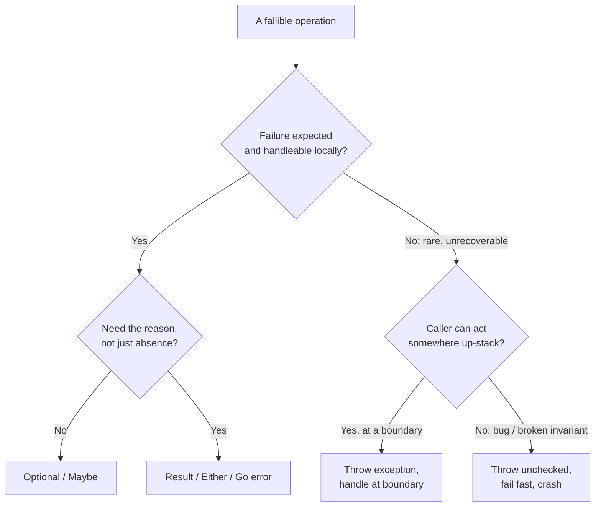

# Error Handling — Middle Level

> Focus: "Why?" and "When does it bend?" — the trade-offs behind every error-handling decision: exceptions vs. error values, where to handle vs. propagate, and when failing fast is the wrong move.

---

## Table of Contents

1. [The two philosophies: exceptions vs. explicit error values](#the-two-philosophies-exceptions-vs-explicit-error-values)
2. [Checked vs. unchecked exceptions: Java's controversial choice](#checked-vs-unchecked-exceptions-javas-controversial-choice)
3. [Where to handle vs. propagate](#where-to-handle-vs-propagate)
4. [Wrapping vs. translation across layers](#wrapping-vs-translation-across-layers)
5. [Sentinel errors vs. typed errors vs. wrapping in Go](#sentinel-errors-vs-typed-errors-vs-wrapping-in-go)
6. [Result/Either as an alternative to exceptions](#resulteither-as-an-alternative-to-exceptions)
7. [Retryable vs. fatal errors](#retryable-vs-fatal-errors)
8. [When failing fast is wrong](#when-failing-fast-is-wrong)
9. [Logging vs. throwing: never both](#logging-vs-throwing-never-both)
10. [Common Mistakes](#common-mistakes)
11. [Test Yourself](#test-yourself)
12. [Cheat Sheet](#cheat-sheet)
13. [Summary](#summary)
14. [Further Reading](#further-reading)
15. [Related Topics](#related-topics)

---

## The two philosophies: exceptions vs. explicit error values

There are two camps, and the divide is genuine — not a matter of one being objectively wrong.

**Exceptions** (Java, Python, C#, Ruby) separate the *happy path* from the *error path*. The success code reads top-to-bottom with no error-checking noise; failures jump up the stack to a handler. The cost: control flow becomes invisible at the call site. You cannot tell, by reading `parseConfig(file)`, whether it might throw — you have to read its body or its docs.

**Explicit error values** (Go, Rust, and the functional `Result`/`Either` style) make every fallible call return its error inline. The error is part of the type signature; the caller is forced to confront it. The cost: verbosity, and the happy path is interleaved with error checks.

```python
# Python — exceptions: happy path is clean, error path is invisible
def load_user(user_id):
    record = db.fetch(user_id)        # may raise DBError — not visible here
    return User.from_record(record)   # may raise ValidationError — not visible here
```

```go
// Go — explicit values: error path is loud, but every failure is documented in the signature
func LoadUser(userID string) (*User, error) {
    record, err := db.Fetch(userID)
    if err != nil {
        return nil, fmt.Errorf("fetch user %s: %w", userID, err)
    }
    return UserFromRecord(record)
}
```

### When each is better

| Situation | Prefer | Why |
|---|---|---|
| Failure is rare and unrecoverable at the call site (out of memory, bug, broken invariant) | Exceptions | The call site can't do anything useful; let it bubble to a top-level handler. |
| Failure is expected and the caller routinely acts on it (file not found, validation, parse failure) | Error values | Forcing the caller to handle it inline prevents silent skips. |
| Deep call stacks where most frames just pass the error up | Exceptions | Avoids threading `error` through 15 functions that don't care. |
| Library boundary / public API where callers need to know what can fail | Error values or typed exceptions | The failure modes become part of the contract. |
| A single operation has many distinct, individually-handleable failure modes | Typed errors / Result | The caller can pattern-match each mode. |

> **The deeper split:** exceptions optimize for the *common case where you can't handle the error locally* (just propagate). Error values optimize for the *common case where you can and should*. Go's designers argued that in systems software, errors are normal business, not exceptional events — so making them invisible is a mistake. Java's designers argued that threading error returns through every layer is noise. Both are right *for their domain*.

---

## Checked vs. unchecked exceptions: Java's controversial choice

Java is the only mainstream language that enforces **checked exceptions**: if a method declares `throws IOException`, every caller must either catch it or re-declare it. The compiler verifies this.

The intent was sound: make failure modes part of the type system, like Go's `error` return. The reality became one of the most criticized features in the language.

```java
// The intent: the signature documents what can fail, and the compiler enforces handling.
public byte[] readConfig(Path p) throws IOException {
    return Files.readAllBytes(p);
}
```

### Why it's controversial

1. **`throws` clauses leak up through every layer.** A low-level `IOException` forces every intermediate method to either handle it (often impossible there) or add `throws IOException` to its own signature — coupling high-level code to low-level implementation details.

2. **It drives developers to the worst possible workaround** — swallowing:

```java
// The cardinal sin checked exceptions accidentally encourage:
try {
    doSomething();
} catch (IOException e) {
    // shut the compiler up — and lose the error forever
}
```

3. **It breaks composition with lambdas and streams.** `Stream.map` doesn't accept a function that throws a checked exception, forcing ugly wrapper code.

### How the ecosystem responded

- **Modern Java** leans heavily on **unchecked** (`RuntimeException`) exceptions. Spring, for example, wraps all persistence errors in unchecked `DataAccessException`.
- **C#, Python, Kotlin, Scala** rejected checked exceptions entirely — all exceptions are unchecked. Kotlin (a JVM language) deliberately removed them, citing the swallowing problem.

> **The middle-level takeaway:** the checked/unchecked debate is really "should the type system force callers to handle failures?" Go and Rust answer *yes* with return values and got it right; Java answered *yes* with checked exceptions and the ergonomics backfired. Use checked exceptions only for **recoverable failures the caller will genuinely act on**, and unchecked for **programming errors and unrecoverable conditions**.

---

## Where to handle vs. propagate

The governing rule: **handle an error at the boundary that can actually act on it.** Everywhere else, propagate.

"Acting on it" means: retry, fall back to a default, translate to a user message, choose an alternative path, or decide to fail the operation. If a function can't do any of those, it has no business catching — it should let the error flow up.

```python
# WRONG — handling at a layer that can't act
def get_user_name(user_id):
    try:
        return db.fetch(user_id).name
    except DBError:
        return "Unknown"   # silently hides a real outage as if it were normal
```

```python
# RIGHT — propagate; let the request handler (the boundary) decide
def get_user_name(user_id):
    return db.fetch(user_id).name   # DBError flows up

# At the HTTP boundary — the place that CAN act:
@app.errorhandler(DBError)
def handle_db_error(e):
    log.error("database unavailable", exc_info=e)   # log once, here
    return jsonify(error="service unavailable"), 503
```

### The boundaries that legitimately handle errors

- **The request/RPC handler** — translate to an HTTP status / gRPC code, log once.
- **The retry/resilience layer** — decide retryable vs. fatal (see below).
- **The `main`/top-level** — last-resort catch-all so the process logs and exits cleanly instead of dumping a raw stack trace.
- **A point with a genuine fallback** — cache miss falls back to origin; primary region fails over to secondary.

Everything between the failure and the boundary should be transparent: add context if useful, then re-raise.

---

## Wrapping vs. translation across layers

When an error crosses a layer boundary, you have two choices.

**Wrapping** preserves the original error and adds context. The caller can still inspect the root cause.

**Translation** replaces the low-level error with a domain-appropriate one, hiding the implementation detail.

```go
// Wrapping (Go) — %w preserves the chain; errors.Is/As can still see the original
func (r *UserRepo) Find(id string) (*User, error) {
    row, err := r.db.Query(...)
    if err != nil {
        return nil, fmt.Errorf("UserRepo.Find(%s): %w", id, err)
    }
    ...
}
```

```java
// Translation (Java) — the SQL detail must NOT leak into the service layer's contract
public User find(String id) {
    try {
        return jdbc.queryForObject(...);
    } catch (SQLException e) {
        // keep the cause for the logs, but expose a domain-level exception
        throw new UserNotFoundException(id, e);
    }
}
```

### Which to use

- **Wrap** within a layer or when crossing into infrastructure you control, and you want to keep the cause inspectable for retry logic or debugging. Always add *what you were doing* ("fetch user 42"), never just re-wrap with no new information.
- **Translate** at an *architectural boundary* (repository → service, library → public API) where leaking the lower layer's error type would couple callers to your implementation. A web service should never throw `psycopg2.OperationalError` at its REST clients.

> **The anti-pattern in between:** catch-and-rethrow that adds nothing — `catch (SQLException e) { throw new RuntimeException(e); }`. This loses the typed handling *and* adds no context. Either add context (wrap) or change the type for a real reason (translate), but never do a no-op pass-through.

---

## Sentinel errors vs. typed errors vs. wrapping in Go

Go has no exceptions, so its error *strategy* is unusually explicit and worth studying even if you don't write Go — the trade-offs generalize.

### Sentinel errors

A package-level error value the caller compares against with `errors.Is`.

```go
var ErrNotFound = errors.New("not found")

func (c *Cache) Get(key string) (Value, error) {
    v, ok := c.m[key]
    if !ok {
        return Value{}, ErrNotFound   // a known, comparable signal
    }
    return v, nil
}

// Caller:
if errors.Is(err, ErrNotFound) {
    return defaultValue   // a normal, expected branch
}
```

**Good for:** a small, fixed set of well-known conditions (`io.EOF`, `sql.ErrNoRows`). **Bad for:** carrying data — a sentinel is a constant, it can't hold the key that wasn't found.

### Typed errors

A custom error type implementing `error`, letting the caller extract structured data via `errors.As`.

```go
type ValidationError struct {
    Field string
    Rule  string
}

func (e *ValidationError) Error() string {
    return fmt.Sprintf("field %q failed rule %q", e.Field, e.Rule)
}

// Caller:
var ve *ValidationError
if errors.As(err, &ve) {
    respond(422, ve.Field, ve.Rule)   // act on the structured data
}
```

**Good for:** errors that carry actionable detail. **Cost:** more code than a sentinel.

### Wrapping

`fmt.Errorf("...: %w", err)` chains errors so context accumulates while `errors.Is`/`errors.As` still see through the chain to the original.

```go
// Each layer adds context; the original sentinel/typed error remains discoverable.
return fmt.Errorf("loading config %q: %w", path, err)
```

### Choosing in Go

| Need | Use |
|---|---|
| A handful of fixed conditions the caller branches on | Sentinel |
| Failures that carry data the caller acts on | Typed error |
| Adding "what I was doing" while preserving inspectability | Wrapping (`%w`) |
| Hiding implementation across a public API boundary | Wrap with a *new sentinel/typed error*, not `%w` of the internal one |

> The last row is the subtlety: `%w` exposes the wrapped error to callers' `errors.Is`. If you don't want callers depending on your internal error, wrap with `%v` (no chain) or translate to your own type.

---

## Result/Either as an alternative to exceptions

Functional languages and Rust make errors *values in the type system* via `Result`/`Either`. The compiler forces you to handle both arms before you can extract the success value — no `null`, no forgotten checks, no invisible jumps.

```rust
// Rust — the ? operator propagates the Err automatically, keeping the happy path clean.
fn load_user(id: &str) -> Result<User, LoadError> {
    let record = db.fetch(id)?;          // returns early on Err, no boilerplate
    let user = User::from_record(record)?;
    Ok(user)
}
```

This is the best of both worlds: the *signature documents failure* (like Go), but propagation is *terse* (like exceptions). Java emulates it with `Optional` (absence only, no error reason) or libraries like Vavr's `Either`; Python has it via libraries (`returns`), though it fights the language's exception-first idioms.



### Trade-offs

- **Result/Either** shines when failure is part of the domain and you want exhaustive, compiler-enforced handling. It pairs naturally with pure functions (no hidden side-effect of "and also it might throw").
- **Exceptions** still win when a failure must abort many stack frames and there's nothing useful to do in between — `Result` forces you to thread it manually through every one of those frames (unless the language has `?`-style sugar).

---

## Retryable vs. fatal errors

Not all errors are equal. The single most important classification in distributed systems: **can retrying help?**

- **Retryable (transient):** network timeout, `503 Service Unavailable`, deadlock, rate-limit, connection reset. The same call later may succeed.
- **Fatal (permanent):** `400 Bad Request`, `404 Not Found`, validation failure, auth failure, a bug. Retrying wastes resources and may amplify an outage.

```go
// Model the distinction in the type so callers don't guess by string-matching.
type Error struct {
    msg       string
    Retryable bool
}

func (e *Error) Error() string { return e.msg }

// Retry layer:
for attempt := 0; attempt < maxAttempts; attempt++ {
    err := do()
    if err == nil {
        return nil
    }
    var e *Error
    if errors.As(err, &e) && e.Retryable {
        time.Sleep(backoff(attempt))   // exponential backoff + jitter
        continue
    }
    return err   // fatal — stop immediately
}
```

> **Why this matters:** retrying a fatal error is at best wasteful and at worst dangerous — retrying a non-idempotent `400` against an overloaded service is exactly how a transient blip becomes a retry storm that takes the service down. The retry decision belongs at one place (the resilience layer), and it must be driven by an *explicit, modeled* property, never by parsing error strings.

The complementary resilience machinery — backoff strategies, circuit breakers, bulkheads — lives in the system-design material; at this level the point is to *classify the error correctly* so the layer above can make the retry decision without guessing.

---

## When failing fast is wrong

"Fail fast" — crash loudly the moment something is wrong — is excellent default advice. It surfaces bugs immediately instead of letting corruption spread. But it is **not universal**.

Failing fast is wrong when **availability matters more than completeness**, and a partial result is more valuable than no result.

### Cases where you should *not* fail fast

1. **Degraded mode / graceful degradation.** A product page should still render if the *recommendations* service is down — show the page without recommendations, not a 500. The recommendation failure is non-critical; failing the whole request fails the user for no reason.

2. **Batch processing.** Importing 10,000 records: one malformed row should be logged and skipped, not abort the entire job. Collect failures and report them at the end.

```python
# Resilient batch: isolate per-item failure instead of failing the whole run.
results, failures = [], []
for row in rows:
    try:
        results.append(process(row))
    except ValidationError as e:
        failures.append((row.id, e))   # collect, don't abort
report(processed=len(results), failed=failures)
```

3. **Best-effort background work.** Cache warming, metrics emission, sending a "nice to have" notification — a failure here should be logged and dropped, never propagated to break the user-facing operation that triggered it.

4. **User-facing input loops.** A REPL or form shouldn't crash because the user typed garbage; it should report and re-prompt.

> **The rule of thumb:** fail fast on **programmer errors and broken invariants** (a `null` where there can't be one — that's a bug, crash and fix it). Degrade gracefully on **expected operational failures of non-critical dependencies** (an optional downstream is slow or down). The mistake juniors make is failing fast on everything; the mistake seniors sometimes make is degrading on everything until real bugs hide behind fallbacks.

---

## Logging vs. throwing: never both

If you both log an error *and* re-throw it, the error gets logged again by the next layer, and again, and again. A single failure produces a wall of near-identical stack traces, and on-call engineers can't tell whether they're looking at one incident or twenty.

```java
// WRONG — log-and-throw produces duplicate log entries up the whole stack
try {
    repo.save(order);
} catch (SQLException e) {
    log.error("failed to save order", e);   // logged here...
    throw new OrderException(e);            // ...and the caller logs it again
}
```

```java
// RIGHT — translate and throw; let exactly ONE place (the boundary) log it
try {
    repo.save(order);
} catch (SQLException e) {
    throw new OrderException("saving order " + order.id(), e);  // no log here
}
// At the top-level handler — the single owner of logging this failure:
catch (OrderException e) {
    log.error("order operation failed", e);
    return status(500);
}
```

**The principle:** an error is *handled* exactly once and *logged* exactly once, at the boundary that handles it. While it's propagating, add context (wrap/translate), but stay silent. If you find yourself logging *and* re-throwing, you haven't decided whether you're handling the error — pick one.

---

## Common Mistakes

1. **Swallowing exceptions.** `catch (Exception e) {}` — the error vanishes; the symptom appears far away, untraceable. If you truly intend to ignore, leave a comment explaining *why* it's safe, and ignore the *specific* type, never the base `Exception`.

2. **Catching the base type.** `catch (Exception)` / `except Exception:` grabs `OutOfMemoryError`, `KeyboardInterrupt`, programming bugs — things you never meant to handle. Catch the narrowest type you can act on.

3. **Returning `null` instead of `Optional`/`Result`/empty.** The caller forgets the check, gets an NPE three calls later with no clue where the `null` originated. Return an empty collection, an `Optional`, or a typed error.

4. **Using exceptions for control flow.** Throwing to break out of a loop, or `try/except StopIteration` as ordinary iteration logic, makes flow unreadable and (in some runtimes) slow. Exceptions are for the *exceptional*.

5. **Error codes the caller can forget to check.** A function returning `int` where `-1` means error: nothing forces the caller to inspect it. This is why Go pairs the error with the value and idiom/linters flag ignored errors.

6. **Wrapping every line in try/catch.** Paranoid per-statement handling buries the logic and usually handles errors at a layer that can't act. Wrap the *operation*, handle at the *boundary*.

7. **Catch-and-rethrow with no context.** `throw new RuntimeException(e)` adds nothing and erases the typed handling. Add context or change the type for a reason — never a no-op.

8. **Retrying fatal errors.** Looping a retry around a `400`/validation failure wastes work and can amplify outages. Classify first.

---

## Test Yourself

<details>
<summary>1. A repository method calls the database and the DB is down. Should the repository catch the error?</summary>

Generally **no** — the repository can't act on a DB outage (it can't retry meaningfully or substitute data). It should *translate* the low-level driver error into a domain error (so the SQL detail doesn't leak) and **propagate**. The boundary that *can* act — the request handler or a retry layer — handles it: returns a 503, triggers failover, or logs once and aborts.
</details>

<details>
<summary>2. Why did Kotlin remove checked exceptions that it inherited from the JVM?</summary>

Because checked exceptions, in practice, drove developers to **swallow** errors just to satisfy the compiler, and they **leaked low-level types up through every layer's signature**, coupling high-level code to implementation details. They also broke cleanly with lambdas/streams. Kotlin judged the ergonomic cost greater than the type-safety benefit and made all exceptions unchecked.
</details>

<details>
<summary>3. When is wrapping (preserving the cause) better than translation (replacing it)?</summary>

Wrap when you're staying within a layer or crossing into infrastructure you control and you want the cause **inspectable** — e.g. so a retry layer can check `errors.Is(err, ErrTimeout)`. Translate at an **architectural boundary** (repository → service, library → public API) where exposing the lower layer's error type would couple callers to your implementation. The cause can still be kept for logs via the `cause`/`%w` chain even when you translate.
</details>

<details>
<summary>4. In Go, you have an error meaning "the user's email already exists," and the caller needs the offending email to show the user. Sentinel, typed error, or wrapping?</summary>

A **typed error**. A sentinel (`var ErrEmailExists = errors.New(...)`) is a constant and can't carry the offending email. Define a type holding the `Email` field; the caller uses `errors.As` to extract it and build the user-facing message.
</details>

<details>
<summary>5. Why is "fail fast on everything" wrong for a product page that depends on a recommendations service?</summary>

Recommendations are a **non-critical** dependency. Failing the whole page (500) because an optional feature is down fails the user for no reason. Degrade gracefully: render the page without recommendations, log the recommendation failure. Reserve fail-fast for **broken invariants and programmer errors** and for **critical** dependencies whose absence makes the response meaningless.
</details>

<details>
<summary>6. You see `log.error("save failed", e); throw new SaveException(e);` in three layers of the stack. What's wrong, and what's the fix?</summary>

This is **log-and-throw**: the same failure is logged at every layer, producing duplicate stack traces and making it impossible to count distinct incidents. Fix: log **exactly once**, at the boundary that handles the error (top-level handler / request handler). While propagating, only *wrap/translate* with context — stay silent.
</details>

<details>
<summary>7. Why can retrying a fatal error be actively dangerous, not just wasteful?</summary>

If the "fatal" error is actually the symptom of an **overloaded** downstream (or you misclassify and retry a 4xx), blind retries multiply load on an already-struggling service — a **retry storm** that turns a transient blip into a full outage. The retry decision must be driven by an explicit *retryable* property, made at one place, with backoff and jitter, and ideally guarded by a circuit breaker.
</details>

<details>
<summary>8. Result/Either gives you compiler-enforced handling. Why do languages with exceptions still exist and thrive?</summary>

Because when a failure must abort **many** stack frames and no intermediate frame can do anything useful, exceptions propagate **for free**, while `Result` must be threaded manually through every frame (absent `?`-style sugar). Exceptions optimize for "I can't handle this here, just get it out of the way"; Result optimizes for "I should handle this here, force me to." Each fits a different common case.
</details>

---

## Cheat Sheet

| Decision | Choose this | When |
|---|---|---|
| Exceptions vs. error values | **Error values** | Failure is expected and locally handleable; library boundary |
| | **Exceptions** | Failure is rare/unrecoverable; deep stacks that just propagate |
| Checked vs. unchecked (Java) | **Checked** | Recoverable failure the caller will genuinely act on |
| | **Unchecked** | Programming errors, broken invariants, unrecoverable conditions |
| Handle vs. propagate | **Handle** | Only at a boundary that can retry/fallback/translate/decide |
| | **Propagate** | Everywhere else — add context, stay silent |
| Wrap vs. translate | **Wrap (`%w`)** | Within/into controlled layers; keep cause inspectable |
| | **Translate** | Architectural/public boundary; hide implementation type |
| Go: sentinel / typed / wrap | **Sentinel** | Small fixed set of conditions (`io.EOF`) |
| | **Typed** | Error carries actionable data |
| | **Wrap** | Add context while preserving inspectability |
| Retry decision | **Retry** | Modeled `Retryable` = true (timeout, 503, deadlock) + backoff/jitter |
| | **Stop** | 4xx, validation, auth, bugs |
| Fail fast vs. degrade | **Fail fast** | Broken invariants, programmer bugs, critical deps |
| | **Degrade** | Optional deps, batch items, best-effort background work |
| Log vs. throw | **Throw (wrap)** | While propagating — no logging |
| | **Log** | Once, at the handling boundary |

---

## Summary

- The **exceptions-vs-error-values** divide is real: exceptions optimize for "propagate, I can't handle this"; error values optimize for "handle this, I'm forcing you to." Match the tool to where the failure is actually handleable.
- Java's **checked exceptions** were the right idea (failures in the type system) with backfiring ergonomics; most ecosystems chose unchecked. Use checked only for failures callers truly act on.
- **Handle errors at the boundary that can act** — retry, fall back, translate, or decide. Propagate transparently everywhere else.
- **Wrap** to keep the cause inspectable within controlled layers; **translate** at architectural boundaries so implementation types don't leak. Never catch-and-rethrow with no context.
- In Go, choose **sentinel / typed / wrapping** by whether the error needs comparison, carries data, or just needs context — and remember `%w` exposes the wrapped error to callers.
- **Result/Either** gives Go-style signature honesty with exception-style terse propagation; exceptions still win for deep, unhandleable-in-between stacks.
- Classify **retryable vs. fatal** explicitly in the type — never by string-matching — and retry only the retryable, with backoff.
- **Fail fast** on bugs and broken invariants; **degrade gracefully** for optional dependencies, batch items, and best-effort work.
- **Log once, at the handling boundary.** Logging *and* throwing produces duplicate noise and hides whether it's one incident or twenty.

---

## Further Reading

- *Clean Code* (Robert C. Martin) — Chapter 7, "Error Handling": prefer exceptions to return codes, don't return/pass `null`, define exceptions by the caller's needs.
- *Effective Java* (Joshua Bloch), 3rd ed. — Items on exceptions: use checked for recoverable conditions, unchecked for programming errors; favor standard exceptions; include failure-capture information.
- "Errors are values" and "Working with Errors in Go 1.13" — the Go Blog, on sentinel/typed errors and `%w` wrapping.
- *The Rust Programming Language*, Chapter 9 — `Result`, the `?` operator, and the recoverable-vs-unrecoverable (`panic!`) distinction.
- *Release It!* (Michael Nygard) — stability patterns: circuit breakers, bulkheads, and why graceful degradation beats failing fast for non-critical dependencies.

---

## Related Topics

- [`junior.md`](junior.md) — the definitions and the basic clean rules of error handling.
- [`senior.md`](senior.md) — error handling as architecture: error budgets, observability, fault domains, and API contract design.
- [`../README.md`](../README.md) — the Clean Code chapter index.
- [`../16-defensive-vs-offensive/README.md`](../16-defensive-vs-offensive/README.md) — defensive vs. offensive programming: the fail-fast vs. degrade trade-off in depth.
- [`../18-logging-and-diagnostics/README.md`](../18-logging-and-diagnostics/README.md) — logging done right, the other half of "log once at the boundary."
- [`../../functional-programming/README.md`](../../functional-programming/README.md) — `Result`/`Either`, `Option`/`Maybe`, and errors as values.
- [`../../refactoring/README.md`](../../refactoring/README.md) — refactoring toward better error handling (replace error codes with exceptions, introduce typed errors).
