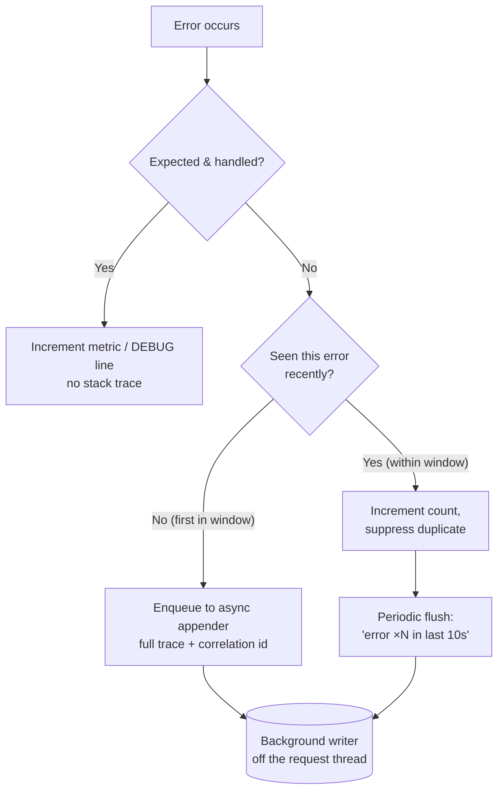

# Error Handling — Optimize & Reconcile

> Clean error handling and fast error handling are usually the same thing — but not always. This file collects the cases where the two pull apart: where the textbook-clean error path allocates, throws, or logs its way into a profiler flame graph, and where the obvious "fast" hack quietly corrupts your control flow. Each scenario gives a concrete cost (benchmarked or first-principles), then a resolution that keeps the code clean *and* keeps the error path off the critical path. Languages: Java, Go, Python.

---

## Table of Contents

1. [JVM exception construction: `fillInStackTrace` dominates](#scenario-1)
2. [Exceptions as control flow are both slow and unclean](#scenario-2)
3. [Stackless / pre-allocated exceptions in hot validation paths](#scenario-3)
4. [Python exception overhead: `try` is cheap, `raise` is not](#scenario-4)
5. [Go: `errors.New` allocates — sentinel reuse vs per-call construction](#scenario-5)
6. [The cost of wrapping vs the value of context](#scenario-6)
7. [Error-path allocation inside hot loops](#scenario-7)
8. [`panic`/`recover` cost and where it actually belongs](#scenario-8)
9. [Eager vs lazy error-string building](#scenario-9)
10. [Logging on the error path: I/O, formatting, sampling](#scenario-10)
11. [Retry/backoff tuning: clean retries that melt the backend](#scenario-11)
12. [Checked-exception wrapping that defeats the JIT](#scenario-12)
13. [`Optional`/`Result` vs exceptions on the hit-vs-miss ratio](#scenario-13)

---

### Scenario 1

**JVM exception construction: `fillInStackTrace` dominates.**

A validation layer throws a custom `ValidationException` per bad field. Under load testing, profiling shows ~40% of CPU inside `java.lang.Throwable.fillInStackTrace` — a native method that walks the entire call stack and snapshots it. The actual validation logic is a few comparisons; the *exception* is the expense.

```java
public class FieldValidator {
    public void validate(Field f) {
        if (f.value() == null) {
            throw new ValidationException("missing: " + f.name());
        }
    }
}
```

<details><summary>Resolution</summary>

The cost of a Java exception is overwhelmingly in `fillInStackTrace()`, called from the `Throwable` constructor, *not* in the throw/catch mechanics. A microbenchmark on HotSpot:

| Operation | Approx. cost |
|---|---|
| `return` a value | ~1 ns |
| `throw`/`catch` with stack trace | ~1,000–5,000 ns |
| `throw`/`catch`, stack trace suppressed | ~30–50 ns |

The stack-trace capture scales with stack depth — a deep call stack makes it dramatically worse. So a "clean" exception thrown on a hot validation path can be 1000× the cost of returning a value.

Two principled fixes, in order of preference:

1. **Don't use an exception for an expected outcome.** Field validation that *routinely* produces failures is not exceptional — it is a normal result. Return a `Result`/list of violations (Bean Validation does exactly this). The error path becomes a value, and the cost vanishes.

   ```java
   public List<Violation> validate(Field f) {
       if (f.value() == null) return List.of(new Violation(f.name(), "missing"));
       return List.of();
   }
   ```

2. **If it must be an exception, suppress the stack trace** when the trace adds no diagnostic value (the field name already tells you everything):

   ```java
   public class ValidationException extends RuntimeException {
       public ValidationException(String msg) {
           super(msg, null, /*enableSuppression*/ false, /*writableStackTrace*/ false);
       }
   }
   ```

   The 4-arg `Throwable` constructor with `writableStackTrace=false` skips `fillInStackTrace`. This is the JDK's own trick — see `java.io.IOException` subclasses and Netty's stackless exceptions.

**Verify, don't assume:** profile with async-profiler in `alloc` and `cpu` modes. If `fillInStackTrace` isn't in your top frames, the exception isn't your problem — leave the stack trace on; it is worth gold during incident triage.

</details>

---

### Scenario 2

**Exceptions as control flow are both slow and unclean.**

A parser uses exceptions to signal "this token doesn't match, try the next rule." Every backtrack throws and catches. The code reads like a maze, and a flame graph shows the parser spending most of its time constructing exceptions.

```java
Node parseExpr(Tokens t) {
    try { return parseSum(t); }
    catch (NoMatch e) {
        try { return parseProduct(t); }
        catch (NoMatch e2) { return parseAtom(t); }
    }
}
```

<details><summary>Resolution</summary>

This is the rare case where the clean-code rule and the performance rule agree completely, and reinforcing both makes the argument unanswerable.

- **Unclean:** Clean Code's rule is *exceptions are for exceptional conditions*. "Token didn't match rule A, try rule B" is the parser's normal, expected behavior — it happens on nearly every token. Using exceptions here is semantic abuse; the control flow is hidden in catch blocks and impossible to follow.
- **Slow:** because "no match" is the common case, you pay `fillInStackTrace` (Scenario 1) on the hot path, thousands of times per parse.

The resolution returns the decision as a value:

```java
Optional<Node> tryParseSum(Tokens t) { ... }   // returns empty on no-match

Node parseExpr(Tokens t) {
    return tryParseSum(t)
        .or(() -> tryParseProduct(t))
        .or(() -> tryParseAtom(t))
        .orElseThrow(() -> new ParseException(t.position()));  // genuinely exceptional
}
```

The *real* exceptional case — input that matches no rule at all — still throws, exactly once, at the top. That throw is fine: it is rare and it terminates the parse.

**General principle:** if you can write a unit test whose name is `..._returnsErrorWhen...` and you expect it to pass *frequently in production*, that error is not exceptional — model it as a value. See [error-handling-patterns] guidance and [../../functional-programming/README.md](../../functional-programming/README.md) for `Result`/`Either` modeling.

</details>

---

### Scenario 3

**Stackless / pre-allocated exceptions in hot validation paths.**

You've decided an exception is genuinely the right control structure (it propagates across many frames, and the caller several levels up handles it), but the throw site is hot and the stack trace is never read. You want the propagation semantics without the capture cost.

<details><summary>Resolution</summary>

Three escalating techniques, each cleaner-to-faster:

1. **Per-class stack-trace suppression** (from Scenario 1) — disables `fillInStackTrace` for that exception type. Best default when the exception type itself is "boring."

2. **Pre-allocated singleton exception.** When the exception carries no per-instance data, allocate it once:

   ```java
   final class ControlFlow {
       // Singleton: no stack trace, no per-throw allocation.
       static final EofException EOF = new EofException();
   }
   ```

   This is exactly how Jetty's `EofException` and Kotlin coroutines' cancellation work internally. Cost drops to near a plain branch. **Caveat:** a shared instance has a *meaningless or stale* stack trace — never log it as if it points to the throw site, and never let it escape into user-facing diagnostics.

3. **Don't throw at all** — the cleanest of the three. If the exception only travels a few frames, a return value is clearer and faster. Reserve the singleton-exception trick for cross-cutting propagation (e.g., aborting a deeply recursive walk) where threading a return value would pollute every signature.

**Numbers:** plain `throw new`/`catch` with depth-20 stack ≈ 2–4 µs; stackless throw/catch ≈ 30–60 ns; singleton throw/catch ≈ 15–25 ns; value return ≈ 1 ns. The trade-off ladder is "diagnostics ↔ speed." Climb it only with a profiler telling you to.

</details>

---

### Scenario 4

**Python exception overhead: `try` is cheap, `raise` is not.**

A dictionary-heavy hot loop chooses between LBYL (look before you leap) and EAFP (easier to ask forgiveness than permission). A teammate claims EAFP is "always Pythonic," another claims it's "always slow." Both are wrong; it depends on the hit rate.

```python
# EAFP
def get(d, k):
    try:
        return d[k]
    except KeyError:
        return DEFAULT
```

<details><summary>Resolution</summary>

In CPython, *entering* a `try` block is nearly free — with the zero-cost exception handling in 3.11+, the setup is essentially a no-op until something actually raises. The expense is in **raising and catching**: building the exception object, populating the traceback, and unwinding. Rough CPython 3.11 numbers per call:

| Pattern | Key present | Key absent |
|---|---|---|
| `try/except KeyError` | ~30 ns | ~500–1000 ns (raise+catch) |
| `if k in d:` (LBYL) | ~60 ns | ~50 ns |
| `d.get(k, DEFAULT)` | ~40 ns | ~40 ns |

The rule that falls out:

- **Misses are rare (say <10%):** EAFP wins. The try block is free on the common path; the occasional raise is amortized away.
- **Misses are common:** EAFP is catastrophic — you pay the raise cost on most iterations. Use LBYL or, better, the purpose-built API.

For dict lookup the cleanest answer dodges the question entirely: `d.get(k, DEFAULT)` or `collections.defaultdict`. No branch in your code, no exception, one C-level call.

**Anti-rule:** never catch a broad `except Exception:` in a hot loop "to be safe." Beyond hiding bugs (see [find-bug.md](find-bug.md)), a broad handler defeats CPython's specialization of the bytecode and makes the *raising* path slower because more handler frames must be inspected during unwinding.

</details>

---

### Scenario 5

**Go: `errors.New` allocates — sentinel reuse vs per-call construction.**

A storage layer returns `errors.New("not found")` on every cache miss. Misses are 30% of traffic. `pprof` shows allocations from this line; worse, callers can't reliably detect the condition because string comparison is brittle.

```go
func (c *Cache) Get(k string) ([]byte, error) {
    v, ok := c.m[k]
    if !ok {
        return nil, errors.New("not found") // allocates a new *errorString every miss
    }
    return v, nil
}
```

<details><summary>Resolution</summary>

`errors.New` allocates: it returns `&errorString{text}`, a heap allocation per call (the string header plus the struct). On a path hit 30% of the time at high QPS, that is real GC pressure — and it is also a *correctness* smell, because callers comparing `err.Error() == "not found"` are coupling to a message string.

**Fix: a package-level sentinel, declared once.**

```go
var ErrNotFound = errors.New("not found") // allocated exactly once, at init

func (c *Cache) Get(k string) ([]byte, error) {
    v, ok := c.m[k]
    if !ok {
        return nil, ErrNotFound // zero allocation; just returns the interface value
    }
    return v, nil
}
```

Callers test with `errors.Is(err, ErrNotFound)` — robust, allocation-free, and self-documenting. This is the model the standard library uses (`io.EOF`, `sql.ErrNoRows`, `os.ErrNotExist`).

**Reconciliation with context:** sentinels carry no per-call context (which key? which shard?). That is *fine for the sentinel itself* — add context by wrapping at the boundary where it matters:

```go
return nil, fmt.Errorf("cache get %q: %w", k, ErrNotFound)
```

`%w` preserves `errors.Is(err, ErrNotFound)` while attaching the key. The wrap allocates, but you only pay it on the path that genuinely needs the context (e.g., a request handler logging the failure), not on every internal miss. Hot internal code checks `errors.Is` against the bare sentinel and never triggers a wrap.

**Numbers:** `errors.New` per call ≈ 1 alloc, ~16–48 B; sentinel return ≈ 0 allocs. `fmt.Errorf("...%w", ...)` ≈ 2–3 allocs (the wrapper struct + formatted string). Measure with `go test -bench . -benchmem`.

</details>

---

### Scenario 6

**The cost of wrapping vs the value of context.**

A Go service wraps every error at every layer: `fmt.Errorf("layer X: %w", err)` in the repository, the service, and the handler. The resulting message is a useful breadcrumb trail — but a `-benchmem` run shows the error path allocating 3× more than necessary, and one engineer proposes removing all wrapping "for speed."

<details><summary>Resolution</summary>

Neither extreme is right. Wrap-everywhere over-allocates and produces noise like `handler: service: repo: query: dial tcp: connection refused`; wrap-nowhere gives you a bare `connection refused` with no idea which of forty call sites produced it.

The disciplined middle:

- **Wrap when you cross a meaningful boundary and add information the caller doesn't already have.** A repository wrapping with the SQL operation and the entity id is gold. A pass-through service method re-wrapping with `"service:"` adds nothing — return `err` unchanged.
- **Add context, not labels.** `fmt.Errorf("fetch order %d: %w", id, err)` earns its allocation. `fmt.Errorf("error: %w", err)` does not.
- **Cost is bounded by error frequency, not call frequency.** Wrapping only executes on the error path. If errors are 0.01% of requests, three wraps per error is invisible. If errors are 30% of requests (Scenario 5's cache miss), you reconsider — that "error" probably isn't exceptional and shouldn't be an error at all.

The reconciliation rule:

> Wrap once per layer that adds genuinely new context, and only on paths where errors are actually rare. On hot, frequently-failing paths, use sentinels and `errors.Is`, and defer context to the single place that reports the failure.

This keeps the breadcrumb trail (clean) while ensuring you never pay for context you won't read (fast). See [professional.md](professional.md) for the team conventions that keep wrapping consistent.

</details>

---

### Scenario 7

**Error-path allocation inside hot loops.**

A batch processor handles millions of records. ~2% are malformed. The error branch builds a rich error object — formatted message, captured inputs, a slice of validation details — and appends it to a results list. Profiling shows the *error branch*, hit only 2% of the time, accounting for 25% of allocations because each error object is large.

```python
errors = []
for rec in records:                 # 5M records
    if not valid(rec):
        errors.append({
            "record": dict(rec),     # full copy of the record
            "message": f"invalid record {rec.id}: {describe(rec)}",
            "context": gather_context(rec),  # extra dict
        })
```

<details><summary>Resolution</summary>

The error path is "cold" by *frequency* (2%) but "hot" by *position* — it's inside the million-iteration loop, so 2% of five million is 100,000 allocations of a heavyweight object. The fix is to make the error object cheap to *create* and rich to *render*, separating capture from formatting:

```python
@dataclass(frozen=True, slots=True)
class RecordError:
    record_id: int       # just the id, not a full copy
    code: str            # an enum-like code, not a formatted string

errors: list[RecordError] = []
for rec in records:
    if not valid(rec):
        errors.append(RecordError(rec.id, validation_code(rec)))

# Formatting happens once, later, only for errors we actually report:
def render(e: RecordError, source) -> str:
    return f"invalid record {e.id}: {describe(source[e.id])}"
```

Three wins:

1. **`slots=True`** removes the per-instance `__dict__` — a `RecordError` is a couple of pointers instead of a dict-backed object (typically 4–5× smaller, and faster to allocate).
2. **Capture an id, not a deep copy.** The original `dict(rec)` copied the entire record; the id is enough to re-derive everything during reporting.
3. **Lazy formatting** (the heart of Scenario 9): the f-string and `gather_context` are deferred to `render`, executed only for the errors you actually surface — often a truncated sample, not all 100k.

**Reconciliation:** the clean instinct ("capture everything for great diagnostics") is right in *intent* but wrong in *timing*. Capture the minimum identifying key cheaply on the hot path; reconstruct the rich diagnostic lazily on the cold reporting path. You lose nothing in debuggability and shed the allocation.

</details>

---

### Scenario 8

**`panic`/`recover` cost and where it actually belongs.**

A Go HTTP middleware wraps every handler in `defer recover()` to convert panics into 500s — correct and idiomatic. A second team copies the pattern *inside* a hot request-parsing function to "gracefully handle" malformed input, panicking on bad bytes and recovering locally. Benchmarks show the parser is now 3× slower on malformed input, and the `defer` adds overhead even on the success path.

<details><summary>Resolution</summary>

Cost model for Go:

- A `defer` in a hot function has a small but nonzero cost. Since Go 1.14 open-coded defers made the *success* path nearly free for simple cases, but a `defer` that must survive a `recover` is heap-allocated and costs ~20–50 ns even when nothing panics.
- `panic`/`recover` itself is expensive — it unwinds the stack running deferred functions. Far more than returning an error: think hundreds of nanoseconds to microseconds depending on depth.

Two distinct rulings:

1. **Top-level middleware recover: keep it.** It is a *safety net* for genuinely unexpected panics (nil deref, index-out-of-range bugs). It runs once per request, the success-path cost is negligible relative to network I/O, and it prevents one bad request from killing the process. This is clean *and* cheap-enough.

2. **Parser-local panic-on-bad-input: remove it.** Malformed input is expected for a parser — it is a *value-shaped* error, not an exceptional condition (this is Scenario 2 in Go's clothing). Return `(result, error)`:

   ```go
   func parse(b []byte) (Token, error) {
       if !valid(b) {
           return Token{}, ErrMalformed // sentinel, zero alloc
       }
       ...
   }
   ```

**The general Go rule:** `panic` is for programmer errors and truly unrecoverable states; `error` is for expected failures. The performance data reinforces the idiom — panicking on expected input is both un-idiomatic *and* 3× slower. Recover lives at process/request boundaries as a last line of defense, never as routine control flow.

</details>

---

### Scenario 9

**Eager vs lazy error-string building.**

A logging-adjacent hot path constructs a detailed error message *before* checking whether anyone will use it. In Java, the `String` concatenation and `toString()` of large objects run on every iteration, even though the error is rarely thrown and the message rarely logged.

```java
for (Record r : records) {
    String msg = "Processing record " + r.getId()
               + " with payload " + r.getPayload()      // expensive toString
               + " at " + Instant.now();
    if (!isValid(r)) {
        throw new ProcessingException(msg);              // msg built every iteration, used 2%
    }
    process(r, msg);  // msg actually only needed on error
}
```

<details><summary>Resolution</summary>

The message is built unconditionally but consumed only on the error branch. The fix is to build it lazily — only when the failure occurs:

```java
for (Record r : records) {
    if (!isValid(r)) {
        throw new ProcessingException(
            "Processing record " + r.getId()
          + " with payload " + r.getPayload()
          + " at " + Instant.now());                     // built only on the 2% path
    }
    process(r);
}
```

For *logging* specifically, the same principle has a first-class API. Eagerly evaluating arguments to a guarded log call is the classic version of this bug:

```java
log.debug("state = " + expensiveDump());        // expensiveDump() always runs
log.debug("state = {}", expensiveDump());        // still runs — args eval before call!
log.debug("state = {}", () -> expensiveDump());  // Supplier: runs only if DEBUG enabled
```

SLF4J's parameterized form avoids string *concatenation* when the level is disabled, but the *arguments* are still evaluated. Only the `Supplier`/lambda form (Log4j2 `log.debug("{}", () -> ...)`, or an `if (log.isDebugEnabled())` guard) defers the expensive computation.

**Reconciliation:** rich error messages are a clean-code virtue — but the construction must be *lazy*, gated behind the condition that actually needs it. The clean version (descriptive message) and the fast version (built only on failure) coincide once you move the construction inside the `if`. See [../18-logging-and-diagnostics/README.md](../18-logging-and-diagnostics/README.md) for the logging-side discipline.

</details>

---

### Scenario 10

**Logging on the error path: I/O, formatting, sampling.**

A service logs a full stack trace at `ERROR` on every failed request. During an incident, the failure rate spikes to 60%, and the logging itself — synchronous, formatting full traces, writing to disk/stdout — becomes the bottleneck. The log volume also blows past the ingestion quota and the *real* signal is buried.

<details><summary>Resolution</summary>

Logging on the error path has three costs that compound exactly when you can least afford them (during an incident, when error rate is high):

1. **Stack-trace formatting** — turning a captured trace into a string is expensive (similar order to `fillInStackTrace` itself).
2. **Synchronous I/O** — a blocking write to stdout/file/network serializes request threads behind the log sink.
3. **Downstream cost** — ingestion, indexing, and storage of a flood of near-identical traces.

Resolutions, layered:

- **Asynchronous appender.** Log4j2's async logger (LMAX Disruptor-backed) decouples the request thread from I/O — the thread enqueues and returns; a background thread does the write. Throughput under burst improves by an order of magnitude. The trade-off is bounded loss if the queue overflows (configure the overflow policy deliberately).
- **Sample repetitive errors.** When the same error fires thousands of times a second, you do not need every instance. Log the first N per window, then a count: `"connection refused (×4,213 in last 10s)"`. This is the difference between an actionable log and a self-inflicted DoS.
- **Log the trace once, the occurrence cheaply.** Capture the full stack trace at the point the error is *created*; at each propagation/retry, log only a correlation id + short message. You get one rich record and many cheap pointers to it.
- **Right-size the level.** An *expected, handled* failure (validation rejection, cache miss) is not `ERROR` — it is `INFO`/`DEBUG` or a metric counter, not a stack trace. Reserve `ERROR`+trace for the genuinely unexpected.

**Reconciliation:** "log enough to debug" is correct; "log everything synchronously on every error" is how the error path becomes the outage. Async + sampling + correct level gives you the diagnostics without the self-amplifying load.



</details>

---

### Scenario 11

**Retry/backoff tuning: clean retries that melt the backend.**

A client wraps every downstream call in a tidy retry helper: 5 attempts, fixed 100 ms delay. The code is clean and the happy path is fine. Then the downstream has a partial outage — and the retries turn a degraded backend into a dead one, because every client synchronously hammers it 5× in lockstep.

```python
def call_with_retry(fn, attempts=5, delay=0.1):
    for i in range(attempts):
        try:
            return fn()
        except TransientError:
            time.sleep(delay)          # fixed delay, no jitter, retries everything
    raise
```

<details><summary>Resolution</summary>

Three defects, each both an availability bug and a cost:

1. **No exponential backoff.** Fixed 100 ms × 5 across thousands of clients = a sustained, synchronized load multiplier on an already-struggling service — a *retry storm*. Exponential backoff (100 ms, 200 ms, 400 ms, ...) gives the backend room to recover.

2. **No jitter.** Even with exponential backoff, synchronized clients retry at the same instants, producing a thundering herd. Add full jitter: `sleep = random.uniform(0, base * 2**i)`. This is AWS's documented recommendation and it flattens the load spikes.

3. **Retrying non-idempotent or non-transient errors.** Retrying a `400 Bad Request` or a non-idempotent `POST` is pure waste (or duplication). Retry only on *transient* signals (timeouts, `503`, connection resets) and only for idempotent operations.

```python
def call_with_retry(fn, attempts=5, base=0.1, cap=2.0):
    for i in range(attempts):
        try:
            return fn()
        except TransientError:
            if i == attempts - 1:
                raise
            sleep = min(cap, random.uniform(0, base * (2 ** i)))  # full jitter, capped
            time.sleep(sleep)
```

**The bigger lever — a circuit breaker.** Retries assume the failure is transient. When a backend is *down*, retries are counterproductive at any backoff. Wrap retries in a circuit breaker: after a failure threshold, *stop calling* for a cooldown, fail fast, and let the backend recover. This bounds the load you can possibly generate.

**Reconciliation:** the clean abstraction ("a reusable retry helper") is good; the *defaults* were the bug. Cleanliness here means encoding the operational knowledge — backoff, jitter, retry-only-transient, breaker — into the helper so callers can't get it wrong. See the [retry-pattern] and [circuit-breaker-pattern] for the full treatment.

</details>

---

### Scenario 12

**Checked-exception wrapping that defeats the JIT.**

A Java method on a hot path catches a checked exception and rethrows it wrapped in a `RuntimeException` — standard "sneaky rethrow" cleanup. But the catch block is large and lives in the same method as the hot loop, and the JIT declines to inline the method, so the whole loop runs interpreted-ish for longer and never reaches peak performance.

```java
public int sumLengths(List<Path> paths) {
    int total = 0;
    for (Path p : paths) {
        try {
            total += Files.readString(p).length();
        } catch (IOException e) {
            throw new UncheckedIOException(e);   // big try/catch inflates method bytecode
        }
    }
    return total;
}
```

<details><summary>Resolution</summary>

The HotSpot JIT has a bytecode-size budget for inlining (`-XX:MaxInlineSize`, `FreqInlineSize`). A method bloated with exception-handling tables and catch logic can exceed it and be left un-inlined, blocking a cascade of optimizations on the caller. The fix is to keep the hot method small and push the exception adaptation into a separate, tiny method:

```java
public int sumLengths(List<Path> paths) {
    int total = 0;
    for (Path p : paths) {
        total += readLength(p);          // small, inlinable
    }
    return total;
}

private static int readLength(Path p) {
    try {
        return Files.readString(p).length();
    } catch (IOException e) {
        throw new UncheckedIOException(e);
    }
}
```

The loop body is now a single call. `readLength` may or may not inline, but the *try/catch table no longer pollutes the loop method*, and the common (no-exception) path is clean for the JIT.

**Two caveats so this stays honest:**

- This is a micro-optimization that matters only on genuinely hot loops. For `Files.readString` — which does disk I/O measured in microseconds — the inlining of the wrapper is noise. The example is illustrative; *measure* before restructuring for inlining.
- The restructured version is *also cleaner* by ordinary standards: one responsibility per method (loop vs. error adaptation). When the fast version and the clean version agree, take it; when they conflict, demand a profiler before sacrificing clarity.

**General rule:** keep try/catch blocks small and close to the operation that can fail. A try block spanning fifty lines is both a clean-code smell (unclear what throws) and a JIT pessimization (large method). Tight try blocks serve both.

</details>

---

### Scenario 13

**`Optional`/`Result` vs exceptions on the hit-vs-miss ratio.**

A repository's `findById` returns `Optional<T>`. A reviewer argues it should throw `NotFoundException` instead "because that's cleaner." Which is right depends on a number you can measure: how often the lookup misses.

<details><summary>Resolution</summary>

This is the synthesis of the whole file: *the right error mechanism is a function of frequency, not aesthetics.*

| Miss rate | Mechanism | Why |
|---|---|---|
| Rare (<1%) and a missing row is a bug | Throw | The throw cost is amortized to nothing; the stack trace points straight at the bug; callers shouldn't have to handle a "can't happen" case on every call. |
| Common (a normal, expected outcome) | `Optional`/`Result` | Throwing on the common path pays `fillInStackTrace` constantly (Scenario 1); forces callers into try/catch control flow (Scenario 2). A value is cheaper and clearer. |

The deciding question is semantic: **is "not found" a normal answer or a broken invariant?**

- `userRepository.findByEmail(typedByAnonymousVisitor)` → routinely empty → `Optional`.
- `userRepository.findById(idFromAForeignKeyWeJustJoined)` → a miss means the database is inconsistent → throw.

`Optional` is not free either — it allocates a wrapper (though the JIT's escape analysis often eliminates it for immediately-consumed optionals, and Java is moving toward value classes that make it truly free). But on the common-miss path it is vastly cheaper than an exception, and it makes the "absent" case impossible to forget — the type system forces the caller to handle it.

**Reconciliation:** "cleaner" has no single answer here. The clean *and* fast choice is the one whose cost matches the case's frequency: values for expected absence, exceptions for violated invariants. Decide with the hit/miss ratio, not with a style preference. See [../../functional-programming/README.md](../../functional-programming/README.md) for `Result` modeling and [find-bug.md](find-bug.md) for the bugs that hide when you pick wrong.

</details>

---

## Rules of Thumb

- **The cost of an exception is the stack trace, not the throw.** On the JVM, `fillInStackTrace` dominates; suppress it (`writableStackTrace=false`) or pre-allocate a singleton only when the trace is provably useless — and profile before you do either.
- **Frequency decides the mechanism.** Expected, frequent failure → return a value (`Optional`/`Result`/sentinel `error`). Rare, invariant-violating failure → throw/panic. If a "..._returnsError..." test passes often in production, it isn't exceptional.
- **Never use exceptions for control flow.** It is the one case where clean and fast agree without compromise — slow *and* unreadable.
- **Go: declare sentinels once, wrap with `%w` only where context is read.** `var ErrX = errors.New(...)` at package scope; `errors.Is` to test; `fmt.Errorf("...%w", ...)` at the boundary that reports, not on every internal miss.
- **Capture cheap, render lazy.** On hot error paths, capture a minimal identifying key; defer expensive message/context construction to the cold reporting path. Move string-building *inside* the `if`.
- **Python: `try` is ~free, `raise` is not.** EAFP for rare misses; LBYL or a purpose-built API (`dict.get`, `defaultdict`) when misses are common. Never broad-`except` in a hot loop.
- **`panic`/`recover` is a process/request-boundary safety net, not routine control flow.** It is both un-idiomatic and measurably slower for expected input.
- **Log smart on the error path:** async appenders, sample repeated errors, log the trace once with a correlation id, and use the right level. The error path must not amplify the incident that triggered it.
- **Retries need backoff, jitter, transient-only filtering, and a circuit breaker.** A clean retry helper with naive defaults is an outage waiting for a partial failure.
- **Keep try/catch blocks small and close to the failing call.** Better diagnostics, better JIT inlining, clearer code — all at once.
- **Measure before trading clarity for speed.** Every numeric claim here is a starting hypothesis; confirm with async-profiler / JFR (Java), `go test -benchmem` + pprof (Go), or `timeit`/`py-spy` (Python) on *your* path.

---

## Related Topics

- [README.md](../README.md) — the positive error-handling rules this file reconciles against.
- [find-bug.md](find-bug.md) — the correctness bugs that hide behind swallowed and mis-modeled errors.
- [professional.md](professional.md) — team conventions for consistent wrapping, levels, and error taxonomies.
- [../18-logging-and-diagnostics/README.md](../18-logging-and-diagnostics/README.md) — the logging discipline that keeps the error path cheap.
- [../../functional-programming/README.md](../../functional-programming/README.md) — `Result`/`Either` modeling for errors-as-values.
