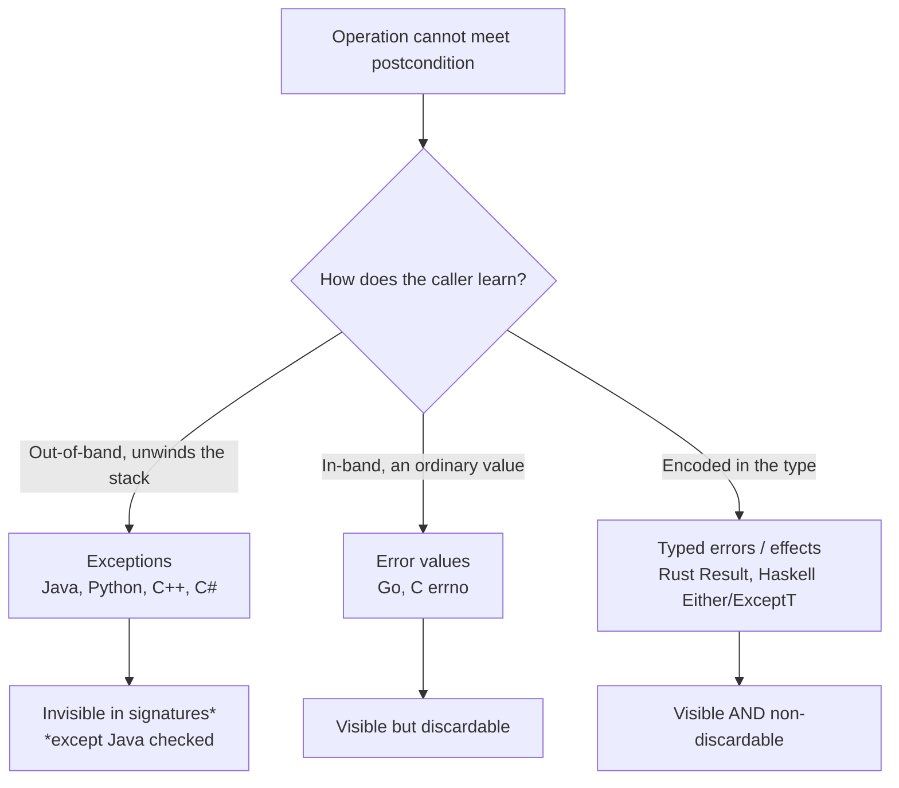
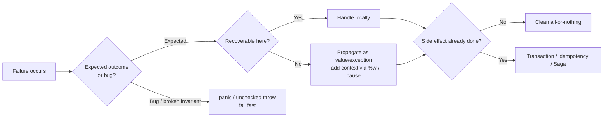

# Error Handling — Professional Level

> Focus: the deep end. Competing error-handling *philosophies* compared rigorously — exceptions vs. error values vs. typed effects; the famous critiques (checked exceptions, "errors are values"); the measured cost of stack unwinding; making illegal states unrepresentable; exception-safety guarantees; and how all of it falls apart under concurrency and the half-failed operation.

---

## Table of Contents

1. [Three philosophies, one problem](#three-philosophies-one-problem)
2. [The checked-exceptions debate](#the-checked-exceptions-debate)
3. ["Errors are values" — Go's bet](#errors-are-values--gos-bet)
4. [Errors as types — Result, Either, ExceptT](#errors-as-types--result-either-exceptt)
5. [Making illegal states unrepresentable](#making-illegal-states-unrepresentable)
6. [The cost of exceptions](#the-cost-of-exceptions)
7. [Exception-safety guarantees (Abrahams)](#exception-safety-guarantees-abrahams)
8. [The half-failed-operation problem](#the-half-failed-operation-problem)
9. [Error handling in concurrent and async code](#error-handling-in-concurrent-and-async-code)
10. [Common Mistakes](#common-mistakes)
11. [Test Yourself](#test-yourself)
12. [Cheat Sheet](#cheat-sheet)
13. [Summary](#summary)
14. [Further Reading](#further-reading)
15. [Related Topics](#related-topics)

---

## Three philosophies, one problem

Every language picks a strategy for the same question: *when an operation cannot deliver its postcondition, how does the caller learn, and what is the type of "might fail"?* Three families dominate.



The axes that actually matter:

| Axis | Exceptions | Error values | Typed errors |
|---|---|---|---|
| Visible in the signature? | No (unchecked) / Yes (checked) | Yes, by convention | Yes, in the type |
| Can the caller silently ignore it? | Yes (no `catch`) | Yes (`_ = err`) | No (must destructure / `?`) |
| Cost on the happy path | ~0 | one comparison | ~0 |
| Cost on the failure path | high (unwind + capture) | ~0 | ~0 |
| Composability | implicit propagation | manual `if err != nil` | monadic / `?` operator |

No family is strictly superior. The interesting engineering is knowing *which property you are buying* and what you pay for it.

---

## The checked-exceptions debate

Java is the only mainstream language that made a category of exceptions part of the method signature and forced the caller to `catch` or `throws`. The idea — the compiler proves you considered every failure — is sound on paper and widely regarded as a mistake in practice.

**Bruce Eckel, "Does Java need Checked Exceptions?"** argued that checked exceptions don't scale: they couple callers to the implementation details of callees, and the friction pushes developers toward the worst possible workaround — the empty `catch`.

**Anders Hejlsberg** (C# lead designer), in the classic *Artima* interview "The Trouble with Checked Exceptions," gave two arguments for why C# deliberately omitted them:

1. **Versioning.** Adding a `throws` clause to a published method is a source-breaking change to every caller. So library authors either never evolve their error sets or lie with `throws Exception`.
2. **Scalability.** In a deep call stack, every intermediate layer must declare or wrap every checked exception below it. The result is `throws`-clause pollution or, more often, the swallow:

```java
// The pathology checked exceptions produce in the wild:
try {
    doRiskyThing();
} catch (Exception e) {
    // TODO
}
```

This is *worse* than no error handling — it actively destroys the information an unchecked exception would have propagated.

The empirical verdict: later JVM languages (Kotlin, Scala) dropped checked exceptions entirely, and modern Java codebases overwhelmingly use unchecked `RuntimeException` subtypes plus a documented contract. The one place checked exceptions arguably still earn their keep is a *narrow, stable, recoverable* boundary — e.g., `IOException` on a single I/O facade — where the caller genuinely has a different code path for failure.

> **Takeaway:** the lesson is not "exceptions bad" but "forcing handling at *compile time* via the signature only works when the error set is small, stable, and locally recoverable." That is rarely true.

---

## "Errors are values" — Go's bet

Go rejected exceptions for ordinary failures. **Rob Pike, "Errors are values"** (the Go blog) states the thesis directly: an error is an ordinary value of type `error`, and you program with it using normal control flow. The benefit is that the cost and the handling are *both* in plain sight.

```go
f, err := os.Open(name)
if err != nil {
    return fmt.Errorf("open %s: %w", name, err) // wrap, add context, propagate
}
defer f.Close()
```

The repetitive `if err != nil` is the most-criticized aspect of Go. Pike's defense is that the repetition is a feature: it forces you to decide, at every call site, what failure means *here*. Where it gets tedious, you abstract the *pattern*, not hide the error:

```go
// bufio.Scanner accumulates the first error; you check once, not per-line.
sc := bufio.NewScanner(r)
for sc.Scan() {
    process(sc.Text())
}
if err := sc.Err(); err != nil { // single check
    return err
}
```

Go's `%w` verb (Go 1.13+) builds a wrap chain inspectable with `errors.Is` (sentinel matching) and `errors.As` (type extraction). This gives you the *context accumulation* exceptions get for free from the stack trace — but explicitly and cheaply.

The genuine weaknesses of the value approach:

- **The discard is one keystroke.** `f, _ := os.Open(name)` silently ignores the error. `errcheck` / `go vet` catch many but not all cases.
- **No enforced exhaustiveness.** Nothing makes you handle the error; the type system permits ignoring it (unlike Rust).
- **Panics still exist** for truly unrecoverable states, and the `panic`/`recover` boundary is a hidden second channel that must be used disciplinedly (recover only at goroutine/request boundaries).

---

## Errors as types — Result, Either, ExceptT

The third family encodes failure in the *return type* and makes ignoring it impossible.

### Rust `Result<T, E>`

```rust
fn parse_config(path: &Path) -> Result<Config, ConfigError> {
    let text = fs::read_to_string(path)?;          // ? propagates io::Error...
    let cfg: Config = toml::from_str(&text)?;      // ...via From<io::Error> for ConfigError
    cfg.validate()?;
    Ok(cfg)
}
```

`Result` is `#[must_use]`: a discarded `Result` is a compiler *warning*, and `clippy` escalates it. The `?` operator gives exception-like ergonomics (propagate up) with value semantics (visible in the type, zero hidden cost) — the best of both, at the price of writing out the error type. Rust reserves `panic!` for bugs / invariant violations, mirroring Go's panic boundary.

### Haskell `Either` and `ExceptT`

`Either e a` is the pure-functional Result. The Monad instance threads the error automatically — `do` notation reads like the happy path while short-circuiting on the first `Left`:

```haskell
validateUser :: RawInput -> Either ValidationError User
validateUser raw = do
  name  <- validateName  (rawName raw)   -- short-circuits on first Left
  email <- validateEmail (rawEmail raw)
  age   <- validateAge   (rawAge raw)
  pure (User name email age)
```

When failure must coexist with side effects (I/O), `ExceptT e IO a` is the monad-transformer stack that combines error short-circuiting with `IO`. This makes the *effect* — "this computation may fail with `e` and do I/O" — part of the type. That is the strongest form of "errors visible in the signature," and the cost is the conceptual weight of monad transformers.

> **The unifying insight:** Rust and Haskell make failure **non-discardable** (the type system rejects ignoring it) and **non-throwing** (no unwinding cost). Exceptions are discardable-by-omission and costly to throw; Go values are discardable-by-`_` but cheap. Pick the property your domain needs.

---

## Making illegal states unrepresentable

The deepest error-handling move is to *delete the error case* by choosing types that cannot represent the invalid state. Yaron Minsky's phrase "make illegal states unrepresentable" is the principle; it converts runtime errors into compile errors.

Compare a stringly-typed connection vs. a sum type:

```haskell
-- Bad: three loosely-related fields => ~16 representable states, ~3 valid.
data Connection = Connection
  { isConnected :: Bool, host :: Maybe String, lastPing :: Maybe Time }

-- Good: exactly the valid states exist. Disconnected has no host; Connected always does.
data Connection
  = Disconnected
  | Connecting Host
  | Connected   Host Time
```

Every function that pattern-matches `Connection` is now *forced* by the compiler to handle each case — exhaustiveness checking turns "I forgot the disconnected case" from a production NPE into a build failure. Rust enums (`enum Connection { ... }`) and Kotlin `sealed class` give the same guarantee on the JVM.

The same logic kills the most common error of all — returning `null`. A function that returns `Optional<T>` / `Option<T>` / `Maybe a` makes "absent" a state the type system tracks, so the caller cannot dereference it without acknowledging absence. This is why `null` is "the billion-dollar mistake" (Tony Hoare's own term): it injects an illegal state (`null`) into *every* reference type, defeating the type checker. See [`../15-pure-functions/README.md`](../15-pure-functions/README.md) for why total, referentially-transparent functions compose so much better than ones that throw.

---

## The cost of exceptions

Exceptions are cheap on the happy path and surprisingly expensive on the throw path. The dominant cost is almost never the unwinding — it's **capturing the stack trace**.

### JVM: `fillInStackTrace`

When a `Throwable` is constructed, its constructor calls `fillInStackTrace()`, which walks the entire call stack and snapshots it. This is the expensive part — often 90%+ of throw cost — and it happens at *construction*, not at `throw`. Two mitigations:

```java
// 1. Reuse a stackless exception for control-flow-ish hot paths (sparingly):
class FastException extends RuntimeException {
    FastException(String m) { super(m, null, false, false); } // writableStackTrace=false
}
// 2. The JIT can elide the trace entirely: -XX:+OmitStackTraceInFastThrow
//    means a hot, repeatedly-thrown builtin exception eventually throws a
//    pre-allocated traceless instance (the infamous "exception with no message").
```

Benchmarks (JMH, `-prof gc`) typically show: throwing+catching with a full trace is on the order of **microseconds**; throwing a stackless exception is **tens of nanoseconds** — comparable to a normal return. The lesson is not "never throw" but "never throw on the *hot* path, and never throw to signal an *expected* outcome."

### Go: error allocation

A Go `error` is an interface value; constructing one via `errors.New` / `fmt.Errorf` allocates. Sentinel errors are allocated once at package init (`var ErrNotFound = errors.New("not found")`) precisely so the hot path compares a pointer instead of allocating. `fmt.Errorf("...: %w", err)` allocates a wrapper per call — fine for genuine failures, wasteful if done in a tight non-error loop.

### Python: cheap `try`, expensive `raise`

CPython's exception *setup* is cheap — entering a `try` block is nearly free under the "zero-cost exceptions" model of CPython 3.11+ (exception tables instead of per-block setup bytecode). The expensive part is *raising*: building the traceback object and the exception instance. This underpins the EAFP idiom ("Easier to Ask Forgiveness than Permission") — Python *expects* you to use exceptions for genuinely exceptional control flow because the `try` is free, but `raise` in a hot loop is not.

| Runtime | Happy-path `try`/setup | Throw + capture trace | Main cost driver |
|---|---|---|---|
| JVM (HotSpot) | ~0 | µs-scale | `fillInStackTrace` (stack walk) |
| Go | ~0 (`if err != nil`) | ~0 to one alloc | `fmt.Errorf` allocation |
| CPython 3.11+ | ~0 (zero-cost tables) | µs-scale | traceback construction |
| Rust `Result` | ~0 | ~0 | none (it's a value) |

> **Rule:** exceptions-as-control-flow is a real, measurable cost — but the cost lives in *throwing*, not in *guarding*. The classic anti-pattern (using `try/catch` to break out of a loop on the common case) pays the throw cost on every iteration.

---

## Exception-safety guarantees (Abrahams)

When an operation may fail partway through, *what state is the object left in?* David Abrahams formalized this for the C++ STL into a hierarchy now used across all exception-based languages. Every public method should document which guarantee it provides.

| Guarantee | Promise on failure | Example |
|---|---|---|
| **No-throw (nofail)** | The operation always succeeds; never throws. | `swap`, destructors, `Close()` cleanup, `Move` |
| **Strong (commit-or-rollback)** | If it throws, state is *exactly* as before the call. Transactional. | `vector::push_back`, a DB transaction |
| **Basic** | If it throws, no leaks and all invariants hold, but state may have changed. | most general mutating ops |
| **None** | All bets off; may leak or corrupt. | unacceptable in published code |

The canonical technique for the **strong** guarantee is **copy-and-swap**: do all the fallible work on a copy, then commit with a no-throw `swap` at the very end. Nothing observable changes until the operation cannot fail.

```cpp
// Strong guarantee via copy-and-swap:
Widget& operator=(Widget rhs) { // rhs is a copy; if copying throws, *this is untouched
    swap(*this, rhs);           // swap is no-throw -> the commit point
    return *this;               // old state destroyed in rhs's destructor
}
```

The same pattern appears everywhere: build the new value, then atomically swap the pointer/reference. In Go, defer-based cleanup gives the *basic* guarantee (resources released) but **not** the strong one unless you explicitly stage-then-commit. The reason this matters: a `catch` block that "recovers" is worthless if the object it's recovering is in an indeterminate state.

---

## The half-failed-operation problem

The hardest error-handling problem is the operation that fails *after* producing a side effect. You charged the card, then the inventory write failed. Now what? Exceptions and Results are equally helpless here — the failure isn't a *return value* problem, it's a *consistency* problem.

```
charge card  -> OK
write order   -> FAILS
=> money taken, no order. The exception/Result tells you it failed,
   not how to undo the half that succeeded.
```

Strategies, in rough order of strength:

1. **Avoid the problem — make the whole thing atomic.** A single DB transaction gets you the strong guarantee for free: `ROLLBACK` un-does every partial write. Only works when all effects share one transactional resource.
2. **Idempotency + retry.** Make each step safe to repeat (idempotency keys), so a crashed half-operation can be re-driven to completion. This is the backbone of payment systems.
3. **Compensating actions (Saga).** When you cross transactional boundaries (charge a *remote* payment API, then write a *local* order), you cannot share a transaction. Record each completed step and run an explicit *compensation* (refund the charge) on later failure.
4. **Outbox / two-phase patterns.** Stage the side effect as data inside the same transaction as the business write, then a separate dispatcher performs the external effect at-least-once.

The professional habit is to ask, *before* writing the try/catch, "what are the side effects of each step, and is this operation atomic?" Defensive sequencing — do all the fallible-and-side-effect-free validation first, do the irreversible effect last — converts many half-failures into clean all-or-nothing failures. This is the offensive/defensive boundary discussed in [`../16-defensive-vs-offensive/README.md`](../16-defensive-vs-offensive/README.md).

---

## Error handling in concurrent and async code

Sequential error handling assumes one stack and one failure at a time. Concurrency breaks both assumptions: *N* operations can fail *simultaneously*, and an error thrown in one task has no stack relationship to the code that spawned it.

### Go: `errgroup` and structured concurrency

A bare goroutine that fails has nowhere to return its error — `go f()` discards the return value entirely. `golang.org/x/sync/errgroup` solves this: it collects the *first* error, cancels the shared context, and lets the parent wait on all children.

```go
g, ctx := errgroup.WithContext(ctx)
for _, url := range urls {
    url := url
    g.Go(func() error {
        return fetch(ctx, url) // ctx is cancelled when ANY task errors
    })
}
if err := g.Wait(); err != nil { // returns the first non-nil error
    return err
}
```

This is *structured concurrency*: child lifetimes are bounded by the parent, and errors propagate up the spawn tree, not into the void. The trade-off — you get the *first* error; the rest are dropped (their tasks are cancelled).

### Aggregate failure: when you need *all* the errors

Sometimes "first error wins" is wrong — validating 10 fields, you want all 10 failures, not the first. Languages provide an aggregate channel:

- **.NET / C#:** `Task.WhenAll` surfaces an `AggregateException` holding *every* failure — the cleanest model.
- **Java:** `CompletableFuture.allOf(...)` completes exceptionally with *one* exception; for genuine aggregation you collect each future's result and build a composite.
- **Go:** `errors.Join(err1, err2, ...)` (Go 1.20+) wraps multiple errors into one that `errors.Is` can still query.
- **Python:** `asyncio.gather(..., return_exceptions=True)` returns exceptions as results instead of raising the first; `asyncio.TaskGroup` (3.11+) raises an `ExceptionGroup` containing *all* failures, handled with `except*`.

```python
async with asyncio.TaskGroup() as tg:   # structured concurrency, 3.11+
    for url in urls:
        tg.create_task(fetch(url))
# On exit: if any task raised, an ExceptionGroup with ALL failures is raised:
# except* ConnectionError as eg: ...   (handles the connection subset)
```

### Promise rejection and the silent-failure trap

In JavaScript, an unhandled Promise rejection is the async analogue of a swallowed exception — it has no `catch` and produces only an `unhandledrejection` event. `await`ing a rejected Promise re-throws it into the surrounding `try/catch`, restoring sequential semantics, which is exactly why `async/await` won over raw `.then()` chains: it puts the failure back on a stack the `catch` can see.

> **The cross-cutting rule:** in concurrent code, decide explicitly between **fail-fast** (cancel siblings on first error — `errgroup`) and **fail-aggregate** (collect every error — `TaskGroup` / `AggregateException` / `errors.Join`). Defaulting silently to "first error, drop the rest" loses diagnostic information you'll wish you had at 3 a.m.

---

## Common Mistakes

1. **Throwing for expected outcomes.** "User not found" is not exceptional during a login flow — it's a normal branch. Throwing makes the happy/failure cost asymmetric and pollutes logs. Return `Optional`/`Result`/a typed value for *expected* absence; reserve exceptions for *invariant violations*.

2. **`catch (Exception e)` swallowing everything.** Catches `InterruptedException`, programming bugs, and recoverable I/O alike, then hides them. Catch the *narrowest* type you can actually handle; let the rest propagate.

3. **Catch-and-rethrow that strips context.** `catch (SQLException e) { throw new RuntimeException(); }` deletes the original cause and stack. Always chain: `throw new ServiceException("loading user " + id, e)` (Java) / `fmt.Errorf("load user %d: %w", id, err)` (Go).

4. **Using the discard to silence the compiler.** `f, _ := os.Open(p)` and Rust's `let _ = result;` defeat the entire value / `#[must_use]` mechanism. If you truly mean "I don't care," say so loudly and comment *why*.

5. **Logging *and* rethrowing the same error.** Produces duplicate stack traces in logs (log-and-throw). Decide once: either handle-and-log at the boundary, or propagate — not both.

6. **Ignoring the strong-guarantee question.** Mutating an object across several fallible steps with no rollback path leaves it corrupt on failure. Stage-then-commit (copy-and-swap) for anything a caller might catch and continue past.

7. **Bare goroutines / unawaited Promises.** `go work()` and a non-awaited async call drop their errors into the void. Use `errgroup` / `TaskGroup` / always `await` (or attach `.catch`).

8. **`try/except` (or `try/catch`) around the entire function.** Paranoid blanket handling can't distinguish which line failed and usually can't do anything meaningful. Guard the specific fallible call, not the whole body.

---

## Test Yourself

1. **Why is `fillInStackTrace` the reason a Java exception is expensive, and how do you build a cheap one?**
<details><summary>Answer</summary>
The cost is in the `Throwable` *constructor*, which walks the whole call stack to snapshot it — not in the `throw` or the unwinding. A cheap exception calls `super(msg, cause, enableSuppression, writableStackTrace=false)` so no trace is captured, dropping throw cost from microseconds to tens of nanoseconds. Use only for hot, control-flow-ish paths where the trace adds no value; you lose the diagnostic stack in exchange. HotSpot also auto-elides traces for repeatedly thrown builtins via `-XX:+OmitStackTraceInFastThrow`.
</details>

2. **Hejlsberg gives two reasons C# omitted checked exceptions. What are they?**
<details><summary>Answer</summary>
(1) <strong>Versioning</strong> — adding a checked exception to a published method's signature breaks every caller's source, so libraries can't evolve their error sets cleanly. (2) <strong>Scalability</strong> — in deep call stacks every layer must declare or wrap every checked exception below, producing <code>throws</code> pollution or, in practice, empty <code>catch</code> blocks that destroy information. The observed real-world result is the swallow.
</details>

3. **Rust `Result` and Go `error` are both "errors as values." What's the key difference?**
<details><summary>Answer</summary>
Discardability. <code>Result</code> is <code>#[must_use]</code> — ignoring it is a compiler warning, and <code>?</code> forces you to either propagate or destructure. Go's <code>error</code> can be silently dropped with <code>_</code>, and nothing in the language compels handling it (only external linters like <code>errcheck</code>). Rust makes failure <em>non-discardable</em>; Go makes it <em>visible but optional</em>.
</details>

4. **You charge a card, then the order write fails. Why can't `try/catch` or `Result` fix this, and what can?**
<details><summary>Answer</summary>
Because the failure is a <em>consistency</em> problem, not a return-value problem: the error tells you it failed, not how to undo the side effect already committed (the charge). Fixes: share one transaction so a rollback un-does everything (when possible); make steps idempotent and retry; or, across transactional boundaries, use a Saga with explicit compensating actions (refund) plus an outbox to perform external effects at-least-once. Sequencing all fallible-and-effect-free work before the irreversible step also converts many half-failures into clean all-or-nothing failures.
</details>

5. **What does the strong exception-safety guarantee promise, and how is copy-and-swap used to achieve it?**
<details><summary>Answer</summary>
Strong = commit-or-rollback: if the operation throws, observable state is exactly as it was before the call (transactional). Copy-and-swap achieves it by performing all fallible work on a copy, then committing with a <em>no-throw</em> <code>swap</code> as the single commit point — nothing the caller can observe changes until the operation can no longer fail. Abrahams formalized the hierarchy (no-throw &gt; strong &gt; basic &gt; none) for the C++ STL.
</details>

6. **In concurrent code, when do you want `errgroup` semantics vs. `TaskGroup`/`AggregateException` semantics?**
<details><summary>Answer</summary>
Use <em>fail-fast</em> (`errgroup`: first error wins, cancel the siblings via the shared context) when any single failure makes the whole result useless and you want to stop wasting work — e.g., fan-out fetches where one bad node aborts the request. Use <em>fail-aggregate</em> (`asyncio.TaskGroup`'s `ExceptionGroup`, .NET `AggregateException`, Go `errors.Join`) when you need <em>every</em> failure — e.g., validating all fields or processing a batch where partial results and a full error list both matter.
</details>

7. **Why is throwing an exception to break out of a loop on the common case a measurable mistake, but wrapping a hot loop in a single `try` block essentially free?**
<details><summary>Answer</summary>
The cost of exceptions is in <em>raising</em> (constructing the exception + capturing the trace), not in establishing the protected region. Entering a `try` is ~0 on HotSpot and on CPython 3.11+ (zero-cost exception tables). So a `try` guarding a loop costs nothing until something throws; using `throw` as the loop-exit on the common path pays the full construction cost on <em>every</em> iteration.
</details>

8. **How does "make illegal states unrepresentable" eliminate a class of error handling entirely?**
<details><summary>Answer</summary>
By choosing types (sum types / sealed classes / enums, and `Option`/`Maybe` instead of `null`) such that the invalid state cannot be constructed, the corresponding runtime check disappears — there is nothing to validate because the value cannot exist. Exhaustiveness checking then forces every consumer to handle each legal case at compile time, converting a potential production failure (forgot the "disconnected" branch, dereferenced `null`) into a build error.
</details>

---

## Cheat Sheet

| Situation | Right tool | Why |
|---|---|---|
| Expected "not found"/"absent" | `Optional`/`Option`/`Maybe`, not exception | absence isn't exceptional; keeps cost symmetric |
| Programming bug / broken invariant | unchecked exception / `panic!` / `panic` | fail fast, loud, with a trace |
| Recoverable failure visible in signature | Go `error`, Rust `Result`, Haskell `Either` | caller is forced (Rust) or expected (Go) to handle |
| Add context while propagating | `fmt.Errorf("...: %w", err)` / chained-cause exception | preserves the wrap chain for `errors.Is`/`As` |
| Hot path that must "throw" | stackless exception (`writableStackTrace=false`) | skips `fillInStackTrace`, the dominant cost |
| Mutating op a caller may recover past | strong guarantee via copy-and-swap | object stays consistent on failure |
| Side effect then a fallible step | one transaction / idempotency / Saga + outbox | solves the half-failed-operation consistency problem |
| Fan-out, first failure aborts | `errgroup` / cancellation | fail-fast, cancel siblings |
| Need every failure | `TaskGroup`/`ExceptionGroup`, `AggregateException`, `errors.Join` | fail-aggregate |
| Async call that may reject | always `await` inside `try`, or attach `.catch` | avoids the silent unhandled-rejection swallow |



---

## Summary

- The three families — **exceptions**, **error values**, **typed errors** — differ on two axes that drive every trade-off: *is failure visible in the signature?* and *can the caller silently ignore it?* Rust/Haskell make it visible **and** non-discardable; Go makes it visible but optional; unchecked exceptions make it invisible.
- **Checked exceptions** failed on versioning and scalability (Eckel, Hejlsberg); the real-world result is the empty `catch`. The lesson is that compile-time-forced handling only works for a small, stable, locally-recoverable error set.
- **"Errors are values"** (Pike) trades `if err != nil` verbosity for total transparency of cost and handling, plus cheap wrap chains via `%w`/`errors.Is`/`errors.As`.
- The **cost of exceptions** is in *raising* — `fillInStackTrace` on the JVM, traceback construction in CPython, allocation in Go — not in guarding. So `try` is free; `throw`-as-control-flow is not.
- **Exception safety** (Abrahams) gives you a vocabulary — no-throw / strong / basic / none — and copy-and-swap is the technique for the strong (transactional) guarantee.
- The **half-failed operation** is a consistency problem no error-return mechanism solves; you need transactions, idempotency, or Sagas, plus the discipline of doing irreversible effects last.
- **Concurrency** forces an explicit choice between fail-fast (`errgroup`) and fail-aggregate (`TaskGroup`/`AggregateException`/`errors.Join`), and unhandled Promise rejections / bare goroutines are the async form of the swallowed exception.

---

## Further Reading

- Rob Pike — *Errors are values* (The Go Blog).
- Bruce Eckel — *Does Java need Checked Exceptions?*
- Bill Venners & Bruce Eckel — *The Trouble with Checked Exceptions* (Anders Hejlsberg interview, Artima).
- David Abrahams — *Exception-Safety in Generic Components* (the basic/strong/no-throw hierarchy).
- Yaron Minsky — *Effective ML / Make illegal states unrepresentable* (Jane Street).
- Tony Hoare — *Null References: The Billion Dollar Mistake* (QCon).
- The Go Blog — *Working with Errors in Go 1.13* (`%w`, `errors.Is`, `errors.As`).
- *The Rust Programming Language*, ch. 9 — *Error Handling* (`Result`, `?`, `panic!`).
- Python docs — *PEP 654: Exception Groups and `except*`*; *asyncio TaskGroup*.
- Joshua Bloch — *Effective Java*, Items 69–77 (exceptions).

---

## Related Topics

- [`senior.md`](senior.md) — applied error-handling patterns one rung down.
- [`interview.md`](interview.md) — error-handling Q&A across all levels.
- [`../README.md`](../README.md) — the Error Handling chapter overview and positive rules.
- [`../15-pure-functions/README.md`](../15-pure-functions/README.md) — why total, side-effect-free functions compose better than throwing ones.
- [`../16-defensive-vs-offensive/README.md`](../16-defensive-vs-offensive/README.md) — fail-fast vs. tolerate, and where to validate.
- [`../../functional-programming/README.md`](../../functional-programming/README.md) — `Either`/`Result`/`Maybe` as monadic error handling.
