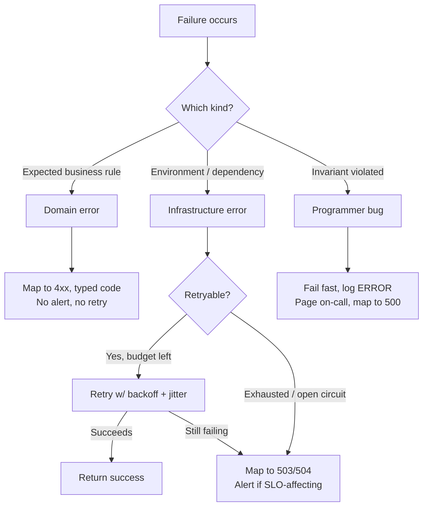
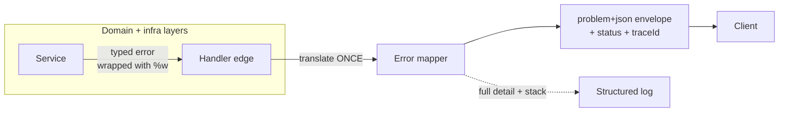
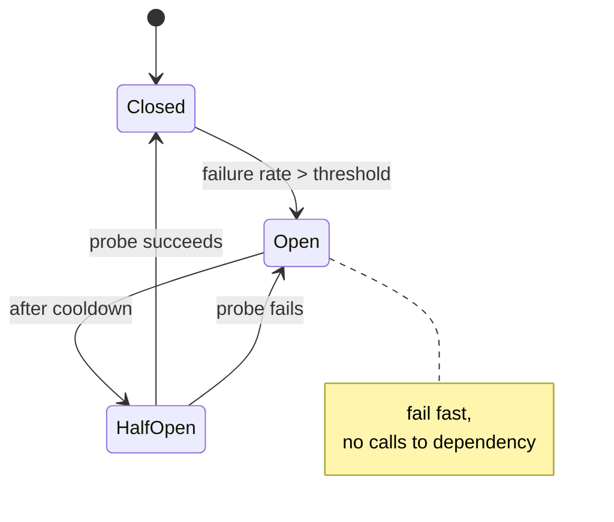

# Error Handling — Senior Level

> Focus: error handling as a **codebase-wide strategy**, not a per-function reflex. Taxonomy, a uniform error model across an API, the boundary where errors become responses, resilience integration (retry/timeout/circuit-breaker), structured context for observability, and the lint rules and conventions that keep a whole team consistent. Go + Java + Python.

---

## Table of Contents

1. [The error taxonomy: three kinds, three policies](#the-error-taxonomy-three-kinds-three-policies)
2. [One error model per service](#one-error-model-per-service)
3. [Mapping errors to transport: HTTP, gRPC, problem+json](#mapping-errors-to-transport-http-grpc-problemjson)
4. [The translation boundary](#the-translation-boundary)
5. [Global handlers and middleware](#global-handlers-and-middleware)
6. [Structured context for observability](#structured-context-for-observability)
7. [Resilience: retry, timeout, circuit breaker](#resilience-retry-timeout-circuit-breaker)
8. [Go panic/recover policy](#go-panicrecover-policy)
9. [Enforcement: lint rules that ban swallowing](#enforcement-lint-rules-that-ban-swallowing)
10. [Team conventions](#team-conventions)
11. [Common Mistakes](#common-mistakes)
12. [Test Yourself](#test-yourself)
13. [Cheat Sheet](#cheat-sheet)
14. [Summary](#summary)
15. [Further Reading](#further-reading)
16. [Related Topics](#related-topics)

---

## The error taxonomy: three kinds, three policies

Most error-handling chaos comes from treating every failure the same way. At team scale, the first deliverable is a **taxonomy** — a shared vocabulary that dictates *who handles what, where, and whether it's retryable*.

| Kind | Examples | Whose fault | Retryable | Policy |
|---|---|---|---|---|
| **Domain error** (expected) | `InsufficientFunds`, `OrderNotFound`, validation failure | The request | No | Map to a 4xx, return cleanly, do **not** alert |
| **Infrastructure error** (transient) | DB timeout, dependency 503, broken connection | The environment | Often | Retry with backoff, circuit-break, map to 5xx if exhausted |
| **Programmer bug** (invariant violation) | nil deref, index out of range, "this can't happen" | The code | No | Fail fast, log at `ERROR`/`FATAL`, page someone, **never** silently recover |

This taxonomy is the spine of every other decision in this chapter. A retry layer must retry *only* infrastructure errors. An alert must fire *only* for bugs and exhausted infrastructure errors. A 4xx response is *only* ever a domain error.



Encode the taxonomy in the type system so it can't be ignored:

**Go** — a sentinel/behavior split. Domain errors are typed; infrastructure errors carry a `Temporary()` behavior; bugs are panics.

```go
// domain errors: typed, comparable, never retried
var (
    ErrOrderNotFound   = errors.New("order not found")
    ErrInsufficientFunds = errors.New("insufficient funds")
)

// infrastructure errors implement a behavior, not a type check
type temporary interface{ Temporary() bool }

func IsRetryable(err error) bool {
    var t temporary
    return errors.As(err, &t) && t.Temporary()
}
```

**Java** — a sealed hierarchy makes the three kinds exhaustive and switchable:

```java
public sealed interface AppError
        permits DomainError, InfraError, BugError {}

public sealed interface DomainError extends AppError
        permits OrderNotFound, InsufficientFunds {}

public record OrderNotFound(String orderId) implements DomainError {}
public record InfraError(String dependency, boolean retryable, Throwable cause) implements AppError {}
```

**Python** — a base exception per kind; everything inherits:

```python
class AppError(Exception): ...
class DomainError(AppError): ...           # -> 4xx, no retry, no alert
class InfraError(AppError):                # -> 5xx, maybe retry
    retryable: bool = True
class OrderNotFound(DomainError): ...
```

---

## One error model per service

A team-scale failure mode: every endpoint invents its own error shape. One returns `{"error": "..."}`, another `{"message": "...", "code": 42}`, a third a bare string. Clients can't write one error handler. **Pick one envelope and enforce it.**

The industry default is [RFC 9457 Problem Details](https://www.rfc-editor.org/rfc/rfc9457) (`application/problem+json`), the successor to RFC 7807:

```json
{
  "type": "https://api.acme.com/errors/insufficient-funds",
  "title": "Insufficient funds",
  "status": 402,
  "detail": "Account 8821 has balance 12.00, required 50.00",
  "instance": "/accounts/8821/withdrawals/abc-123",
  "code": "INSUFFICIENT_FUNDS",
  "traceId": "4bf92f3577b34da6a3ce929d0e0e4736"
}
```

Rules that make the envelope usable:

- **`code` is a stable machine-readable enum**, never a free-text message. Clients branch on `code`; humans read `detail`. Changing a `detail` string is non-breaking; changing a `code` is a breaking API change.
- **`type` is a dereferenceable URL** pointing at docs for that error class.
- **`traceId` is always present** so a support ticket maps to a trace in one query.
- **`detail` never leaks internals** — no stack traces, SQL, file paths, or PII reach the client. Those go to logs keyed by `traceId`.

Define the registry of codes in one place so it's reviewable as a unit:

```go
type Code string

const (
    CodeNotFound          Code = "NOT_FOUND"           // 404
    CodeValidation        Code = "VALIDATION_FAILED"   // 422
    CodeInsufficientFunds Code = "INSUFFICIENT_FUNDS"  // 402
    CodeUnavailable       Code = "DEPENDENCY_DOWN"      // 503
    CodeInternal          Code = "INTERNAL"            // 500
)
```

---

## Mapping errors to transport: HTTP, gRPC, problem+json

The mapping from internal error to wire status lives in **exactly one table**, owned by the boundary layer. Scatter it and you get a `404` for "not found" in one handler and a `200 {"error":...}` in another.

| Internal kind | HTTP | gRPC code | Alert? |
|---|---|---|---|
| Validation / bad input | 400 / 422 | `INVALID_ARGUMENT` | No |
| Not found | 404 | `NOT_FOUND` | No |
| Auth required / forbidden | 401 / 403 | `UNAUTHENTICATED` / `PERMISSION_DENIED` | No |
| Conflict / version mismatch | 409 | `ABORTED` / `FAILED_PRECONDITION` | No |
| Rate limited | 429 | `RESOURCE_EXHAUSTED` | On sustained |
| Dependency timeout/down | 503 / 504 | `UNAVAILABLE` / `DEADLINE_EXCEEDED` | Yes (SLO) |
| Programmer bug | 500 | `INTERNAL` | Yes (page) |

> **`499` and the canceled request.** If the client disconnects (`context.Canceled`), don't log it as a 500 error or retry it — there's no one to answer. Nginx records this as `499`; map `context.Canceled` to a no-op, not an alert.

The cardinal rule: **a 5xx means "we failed," a 4xx means "you sent something we can't accept."** A misclassified domain error as 5xx pollutes your error-rate SLO and pages on-call for a user typo. A misclassified bug as 4xx hides a real defect from your dashboards.

---

## The translation boundary

Internally, code throws/returns rich typed errors. Externally, clients see the envelope. The conversion happens at **one architectural seam** — typically the HTTP/gRPC handler edge. Everything below the seam speaks domain errors; nothing below it knows about HTTP status codes.



Why a single seam matters:

- **Layers stay portable.** A repository that returns `ErrOrderNotFound` works behind HTTP, gRPC, a CLI, or a batch job. If it returned `404` it would be coupled to HTTP forever.
- **One place to change the contract.** Adding `traceId` to every response is a one-file edit.
- **Bugs can't leak.** The mapper is the only code that turns an unrecognized error into a sanitized 500 — so a stack trace can never reach a client by accident.

```go
// the ONLY function that knows both domain errors and HTTP
func toProblem(err error) Problem {
    switch {
    case errors.Is(err, ErrOrderNotFound):
        return Problem{Status: 404, Code: CodeNotFound, Detail: err.Error()}
    case errors.Is(err, ErrInsufficientFunds):
        return Problem{Status: 402, Code: CodeInsufficientFunds, Detail: err.Error()}
    case IsRetryable(err):
        return Problem{Status: 503, Code: CodeUnavailable, Detail: "dependency unavailable"}
    default:
        // unknown == bug. Sanitize, log full detail under traceId, alert.
        return Problem{Status: 500, Code: CodeInternal, Detail: "internal error"}
    }
}
```

---

## Global handlers and middleware

The translation seam is implemented as a framework-level handler so individual endpoints never write `try/catch` for cross-cutting concerns. One handler, every route.

**Spring — `@RestControllerAdvice`:**

```java
@RestControllerAdvice
public class GlobalExceptionHandler {

    @ExceptionHandler(OrderNotFound.class)
    public ProblemDetail handleNotFound(OrderNotFound ex) {
        var pd = ProblemDetail.forStatus(HttpStatus.NOT_FOUND);
        pd.setType(URI.create("https://api.acme.com/errors/not-found"));
        pd.setProperty("code", "NOT_FOUND");
        pd.setProperty("traceId", MDC.get("traceId"));
        return pd;
    }

    @ExceptionHandler(Exception.class)             // catch-all == bug
    public ProblemDetail handleUnknown(Exception ex) {
        log.error("unhandled exception traceId={}", MDC.get("traceId"), ex);
        var pd = ProblemDetail.forStatus(HttpStatus.INTERNAL_SERVER_ERROR);
        pd.setProperty("code", "INTERNAL");
        pd.setProperty("traceId", MDC.get("traceId"));
        return pd;                                  // no stack trace to client
    }
}
```

**FastAPI — exception handlers:**

```python
from fastapi import FastAPI, Request
from fastapi.responses import JSONResponse

app = FastAPI()

@app.exception_handler(DomainError)
async def domain_handler(request: Request, exc: DomainError):
    return JSONResponse(
        status_code=exc.status,           # each DomainError carries its status
        media_type="application/problem+json",
        content={"code": exc.code, "detail": str(exc),
                 "traceId": request.state.trace_id},
    )

@app.exception_handler(Exception)         # bug catch-all
async def unknown_handler(request: Request, exc: Exception):
    logger.exception("unhandled", extra={"traceId": request.state.trace_id})
    return JSONResponse(
        status_code=500, media_type="application/problem+json",
        content={"code": "INTERNAL", "detail": "internal error",
                 "traceId": request.state.trace_id},
    )
```

**Go — middleware that recovers and translates:**

```go
func ErrorMiddleware(next http.Handler) http.Handler {
    return http.HandlerFunc(func(w http.ResponseWriter, r *http.Request) {
        defer func() {
            if rec := recover(); rec != nil {            // bug -> 500
                slog.Error("panic recovered", "panic", rec,
                    "trace_id", traceID(r), "stack", string(debug.Stack()))
                writeProblem(w, Problem{Status: 500, Code: CodeInternal})
            }
        }()
        next.ServeHTTP(w, r)
    })
}
```

> Handlers themselves return errors; a thin wrapper calls `toProblem` and writes the envelope. The pattern `func(w, r) error` + one adapter keeps every handler free of status-code logic.

---

## Structured context for observability

An error with no context is a needle in a log haystack. At team scale, **every error must carry the chain that produced it and a correlation ID that ties it to a request, a trace, and a log line.**

### Wrap, don't replace

**Go** — `fmt.Errorf` with `%w` builds an inspectable chain. Each layer adds *what it was doing*, not a restated message:

```go
func (r *Repo) FindOrder(ctx context.Context, id string) (*Order, error) {
    row := r.db.QueryRowContext(ctx, q, id)
    if err := row.Scan(&o.ID); err != nil {
        if errors.Is(err, sql.ErrNoRows) {
            return nil, fmt.Errorf("order %s: %w", id, ErrOrderNotFound)
        }
        return nil, fmt.Errorf("query order %s: %w", id, err) // preserves cause
    }
    return &o, nil
}
// errors.Is(err, ErrOrderNotFound) still works through the wrap.
// errors.As(err, &pgErr) still reaches the driver error.
```

**Never** `fmt.Errorf("...: %v", err)` at a boundary you care about — `%v` flattens the chain to a string and `errors.Is`/`errors.As` stop working.

**Java** — chain the cause; never swallow it:

```java
catch (SQLException e) {
    throw new InfraError("orders-db", isRetryable(e), e); // cause preserved
}
```

**Python** — `raise ... from ...` preserves `__cause__`:

```python
try:
    row = cursor.fetchone()
except OperationalError as e:
    raise InfraError("orders-db") from e   # never bare `raise InfraError(...)`
```

### Correlation ID propagation

A `traceId` (W3C `traceparent`) enters at the edge, lives in request-scoped context, and appears on every log and every error response.

- **Go:** carry it in `context.Context`; inject into `slog` via a handler.
- **Java:** SLF4J **MDC** (`MDC.put("traceId", ...)`); a servlet filter sets it, the logging pattern prints it.
- **Python:** `contextvars.ContextVar` set in middleware; a logging filter reads it.

The payoff: one query — `traceId=4bf92f...` — returns the entire causal story across services, with the sanitized 500 the user saw linked to the full stack trace that never left your logs. See [../18-logging-and-diagnostics/README.md](../18-logging-and-diagnostics/README.md) for structured logging and trace correlation.

---

## Resilience: retry, timeout, circuit breaker

The taxonomy pays off here: resilience patterns act **only on infrastructure errors**, never on domain errors or bugs. Retrying a `404` is pointless; retrying a `400` is a bug; retrying a non-idempotent write can double-charge a customer.

### Timeouts first

A retry without a timeout is a hang multiplied. Every outbound call has a deadline, propagated from the inbound request.

```go
ctx, cancel := context.WithTimeout(r.Context(), 2*time.Second)
defer cancel()
resp, err := client.Do(req.WithContext(ctx))
```

### Retry only retryable, idempotent operations

```go
func withRetry(ctx context.Context, op func() error) error {
    backoff := 50 * time.Millisecond
    for attempt := 0; attempt < 3; attempt++ {
        err := op()
        if err == nil || !IsRetryable(err) {  // domain error / bug -> stop now
            return err
        }
        jitter := time.Duration(rand.Int63n(int64(backoff)))   // avoid thundering herd
        select {
        case <-time.After(backoff + jitter):
            backoff *= 2                                        // exponential
        case <-ctx.Done():
            return ctx.Err()
        }
    }
    return fmt.Errorf("exhausted retries: %w", ErrUnavailable)
}
```

Rules: **exponential backoff + jitter**, a **retry budget** (cap total attempts/time), and a hard rule that only idempotent operations retry. Use idempotency keys for writes that must.

### Circuit breaker

When a dependency is down, retrying every request makes it worse and burns your latency budget. A circuit breaker trips open after a failure threshold, fast-fails for a cooldown, then half-opens to probe.



**Java (Resilience4j) — config-as-code:**

```java
var cb = CircuitBreaker.of("orders", CircuitBreakerConfig.custom()
    .failureRateThreshold(50)                       // open at 50% failures
    .slowCallDurationThreshold(Duration.ofSeconds(2))
    .waitDurationInOpenState(Duration.ofSeconds(10))
    .slidingWindowSize(20)
    .recordException(InfraError::isRetryable)        // domain errors don't count!
    .build());
Supplier<Order> decorated = CircuitBreaker.decorateSupplier(cb, () -> client.fetch(id));
```

> **Critical:** the breaker must count *only* infrastructure failures. If validation 4xx errors trip the breaker, a flood of bad input takes down a healthy dependency. This is `recordException` / `ignoreExceptions` in Resilience4j and the equivalent everywhere — it's the taxonomy enforced at the resilience layer.

These patterns are the bridge to distributed-systems concerns; the retry, timeout, and circuit-breaker skills cover production tuning in depth.

---

## Go panic/recover policy

Go has no exceptions, but `panic`/`recover` are frequently abused as one. The team policy:

- **Panic only for programmer bugs** — unrecoverable invariant violations (`must`-style helpers, impossible `default` cases). A panic means "the code is wrong," not "the input is bad."
- **Return `error` for everything expected** — domain and infrastructure failures are values, checked by the caller.
- **Recover only at process boundaries** — the top of each goroutine and the HTTP/gRPC middleware. A recovered panic becomes a logged 500, so one bad request can't crash the whole server.
- **Never `recover()` to ignore.** Recovering and continuing as if nothing happened hides corruption.

```go
// library: return errors, never panic across an API boundary
func ParseConfig(b []byte) (*Config, error) {
    var c Config
    if err := json.Unmarshal(b, &c); err != nil {
        return nil, fmt.Errorf("parse config: %w", err)
    }
    return &c, nil
}

// internal invariant: panic is correct — reaching here is a bug
func (s State) String() string {
    switch s {
    case Open: return "open"
    case Closed: return "closed"
    default:
        panic(fmt.Sprintf("unhandled state: %d", s)) // crash in tests/dev, recovered at edge in prod
    }
}

// every goroutine you spawn needs its own recover — middleware doesn't cover them
go func() {
    defer func() {
        if r := recover(); r != nil {
            slog.Error("goroutine panic", "panic", r, "stack", string(debug.Stack()))
        }
    }()
    process(job)
}()
```

> A panic in a goroutine that nothing recovers **crashes the entire process**, not just that goroutine. This is the single most common Go production outage from error handling. Every `go func()` that can panic needs its own `recover`.

---

## Enforcement: lint rules that ban swallowing

Conventions that aren't enforced decay. Wire the rules into CI so swallowing fails the build, not code review.

### Go — `golangci-lint`

```yaml
# .golangci.yml
linters:
  enable:
    - errcheck      # unchecked error returns -> build fails
    - errorlint     # %v on errors, == comparison instead of errors.Is
    - wrapcheck     # errors from external pkgs must be wrapped at boundaries
    - nilerr        # `return nil` after checking `err != nil`
    - bodyclose     # unclosed HTTP response bodies (resource leak)
    - contextcheck  # context not propagated to outbound calls
linters-settings:
  errcheck:
    check-type-assertions: true
    exclude-functions:
      - (*bytes.Buffer).Write   # writes to in-memory buffers can't fail
```

- **`errcheck`** is the floor: ignoring a returned `error` fails the build. The only escape is an explicit `_ =`, which is greppable and reviewable.
- **`errorlint`** catches `err == ErrFoo` (should be `errors.Is`) and `%v`-flattened chains (should be `%w`).

### Java — SpotBugs / Error Prone

- **SpotBugs:** `DE_MIGHT_IGNORE` (ignored exception), `REC_CATCH_EXCEPTION` (overly broad catch). Fail the build via the Gradle/Maven plugin.
- **Error Prone:** `[CheckReturnValue]`, `[UnusedException]`, and annotate factory methods with `@CheckReturnValue` so a discarded `Result` is a compile error.

### Python — `flake8-bugbear` + `ruff`

```toml
# pyproject.toml
[tool.ruff.lint]
select = ["B", "TRY", "BLE", "RET"]
# B902: blind except           BLE001: do not catch blind `except Exception`
# TRY002/003: exception design  TRY300: consider `else` block
# TRY401: redundant exception in logging.exception(...)
```

`flake8-bugbear`'s `B` rules and ruff's `TRY`/`BLE` families flag bare `except:`, broad `except Exception` without re-raise, and `raise` that loses the cause.

> Combine with a **"don't make it worse" baseline** for legacy code: fail only on *new* violations so the rule lands in a million-line repo without 8,000 day-one failures. See [../../refactoring/README.md](../../refactoring/README.md) for baseline/strangler-fig migration patterns.

---

## Team conventions

Things to write down once and link from every PR template:

- **Never swallow.** Every caught error is logged-with-context, returned/rethrown-with-context, or *deliberately* ignored with an inline comment explaining why. No empty `catch`.
- **Wrap at boundaries, not everywhere.** Add context when crossing a module/layer seam (`%w`, `from e`, chained cause). Don't re-wrap the same error five times up the stack — that's just noise in the log.
- **One error model per service.** Document the envelope and the code registry; new codes go through review.
- **`null`/`nil` is not an error channel.** Use `Optional`/`Result`/`(T, error)` for "absent"; reserve errors for failures. (See [../05-objects-and-data-structures/README.md](../05-objects-and-data-structures/README.md) on modeling absence.)
- **Log OR return, not both.** Log an error once, at the layer that decides to stop propagating it (usually the boundary). Logging at every layer produces N copies of one failure.
- **Errors at boundaries are an API contract.** The error codes a service emits are part of its public interface — version them like any other contract. See [../07-boundaries/README.md](../07-boundaries/README.md).

---

## Common Mistakes

- **Log-and-rethrow.** `log.error(e); throw e;` produces the same error logged three times across three layers. Decide once, at the boundary, whether to log or propagate.
- **One error shape per endpoint.** Without a shared envelope, clients can't write a single error handler. Enforce problem+json globally.
- **Domain errors as 5xx.** A `404` modeled as a 500 pages on-call for a user typo and corrupts the error-rate SLO. 4xx = client's problem, 5xx = ours.
- **Retrying everything.** Retrying a 4xx wastes a budget; retrying a non-idempotent write double-applies it. Retry only retryable infrastructure errors on idempotent operations.
- **Breaker counts domain errors.** A flood of validation failures trips the circuit and takes down a healthy dependency. The breaker must record infrastructure failures only.
- **`%v` instead of `%w`.** Flattens the chain to a string; `errors.Is`/`errors.As` stop working downstream. `errorlint` catches it.
- **Unrecovered goroutine panic.** Middleware recovers the request goroutine, not the ones you spawn. An unrecovered panic in any goroutine crashes the whole process.
- **Stack traces to the client.** Internal detail leaking through a 500 is both an info-leak and useless to the caller. Sanitize at the mapper; log full detail under `traceId`.
- **`null` as "not found."** The caller forgets the check and gets an NPE three frames later. Return `Optional`/`Result`/a typed sentinel.

---

## Test Yourself

1. **Your dashboard shows a 5xx error-rate spike, but users report no problems. What's the likely cause and fix?**

<details><summary>Answer</summary>

Domain errors (e.g., "not found," validation) are being mapped to 5xx instead of 4xx. They count against the availability SLO and page on-call even though the system is healthy and the *client* sent something invalid. Fix the error mapper so domain errors map to 4xx; reserve 5xx for actual failures (bugs, exhausted infrastructure errors). Audit the single translation seam — there should be exactly one place this mapping lives.

</details>

2. **A teammate adds `catch (Exception e) { log.error("error", e); throw e; }` in a service-layer method. What's wrong?**

<details><summary>Answer</summary>

Log-and-rethrow. The error will be logged again at the next layer and once more at the global handler — three log lines for one failure, scattered across the trace. Either handle it here (log + stop propagation) or propagate it with added context (`throw new InfraError("...", e)`) and let the **boundary** do the single log. Logging should happen once, at the layer that decides to stop the error.

</details>

3. **Why must a circuit breaker be configured to ignore domain (4xx) errors?**

<details><summary>Answer</summary>

A breaker exists to protect against an *unhealthy dependency*. Domain errors mean the dependency is working fine and rejecting bad input correctly. If a burst of invalid requests counts toward the failure threshold, the breaker trips open and starts fast-failing *valid* requests too — a self-inflicted outage. Configure `recordException`/`ignoreExceptions` (Resilience4j) or the equivalent so only infrastructure failures move the breaker.

</details>

4. **In Go, you write `return fmt.Errorf("loading user: %v", err)`. A caller's `errors.Is(err, sql.ErrNoRows)` now returns false. Why?**

<details><summary>Answer</summary>

`%v` formats the cause into the message string and discards the wrapped error. The chain is severed, so `errors.Is`/`errors.As` can't reach the underlying `sql.ErrNoRows`. Use `%w` (`fmt.Errorf("loading user: %w", err)`) to preserve the chain. `errorlint` flags exactly this.

</details>

5. **You spawn `go processJob(j)` in a worker pool. A bug panics inside it. The whole service crashes. The HTTP recover middleware was supposed to catch this — why didn't it?**

<details><summary>Answer</summary>

`recover` only catches panics in the *same goroutine* as the deferred function. The middleware's `recover` protects the request goroutine, not the worker goroutine you spawned. An unrecovered panic in any goroutine terminates the entire process. Each spawned goroutine needs its own `defer func(){ recover() }()`.

</details>

6. **A service returns `{"error": "INSUFFICIENT_FUNDS"}` and another returns `{"message": "insufficient funds", "code": 402}`. A mobile client team is frustrated. What's the strategic fix, and why is `code` not the same as the message?**

<details><summary>Answer</summary>

Adopt one error envelope across all services (RFC 9457 problem+json) with a stable machine-readable `code` enum, a human `detail`, and a `traceId`. `code` is a contract clients branch on programmatically; the message is free text for humans and may be localized or reworded without breaking anyone. Conflating them means any wording change is a breaking API change, and clients end up string-matching messages — fragile and untranslatable.

</details>

---

## Cheat Sheet

| Concern | Do | Don't |
|---|---|---|
| **Classify** | Domain / Infrastructure / Bug, encoded in types | One `catch (Exception)` for all |
| **Wire format** | One problem+json envelope, stable `code` enum | Per-endpoint ad-hoc shapes |
| **Status mapping** | Single table; 4xx=client, 5xx=us | Domain error as 500 |
| **Translation** | One boundary seam (handler/middleware) | Status codes in the repo layer |
| **Context** | `%w` / `from e` / chained cause + `traceId` | `%v`, `raise X` (no `from`), swallow |
| **Logging** | Log once at the boundary | Log-and-rethrow at every layer |
| **Retry** | Retryable infra + idempotent + backoff/jitter/budget | Retry 4xx or non-idempotent writes |
| **Breaker** | Count infra failures only | Trip on domain 4xx |
| **Go panic** | Bugs only; recover at every goroutine + edge | `recover()` to ignore; panic for input |
| **CI** | `errcheck`/`errorlint`/`wrapcheck`, SpotBugs, bugbear/ruff `TRY`/`BLE` | Rely on review to catch swallowing |
| **Client safety** | Sanitize 500; full detail under `traceId` | Stack traces / SQL to the client |

---

## Summary

Senior-level error handling is a **system property**, not a per-function habit. Start from a three-kind taxonomy — domain, infrastructure, bug — because every downstream decision (status code, retry, alert, breaker) keys off it. Encode the taxonomy in types so it can't be ignored. Define **one** error envelope (problem+json) with stable machine codes, and translate internal errors to the wire at **one boundary seam** implemented as global middleware/handlers, so layers stay portable and bugs can't leak. Carry causal context (`%w`, chained causes, `from e`) and a correlation ID through every layer so one `traceId` query tells the whole story. Wire resilience patterns to act on infrastructure errors only — retry idempotent operations with backoff and a budget, time-bound every outbound call, and trip the breaker on infrastructure failures alone. In Go, panic only for bugs and recover at every goroutine and process edge. Finally, **enforce** all of it with linters in CI — `errcheck`/`errorlint`/`wrapcheck`, SpotBugs/Error Prone, flake8-bugbear/ruff — because a convention nobody enforces is a convention nobody follows.

---

## Further Reading

- **RFC 9457** — Problem Details for HTTP APIs (the error-envelope standard).
- **Google Cloud API Design Guide** — error model and gRPC↔HTTP status mapping.
- **Release It!** (Michael Nygard) — circuit breaker, bulkhead, timeout, and the stability patterns this chapter integrates.
- **Effective Go** & the Go blog "Working with Errors in Go 1.13" — `%w`, `errors.Is`/`As`, wrapping.
- **Resilience4j** and **go-resilience** docs — production config for retry/breaker/bulkhead.
- **OpenTelemetry** semantic conventions for errors and the W3C `traceparent` spec.

---

## Related Topics

- [junior.md](junior.md) — the mechanics: try/catch, returning errors, what swallowing looks like.
- [middle.md](middle.md) — custom exception hierarchies, `Result`/`Optional`, where to handle vs. propagate.
- [professional.md](professional.md) — error handling at platform/org scale: error budgets, cross-service contracts, failure injection.
- [../07-boundaries/README.md](../07-boundaries/README.md) — errors at a boundary are part of the API contract.
- [../18-logging-and-diagnostics/README.md](../18-logging-and-diagnostics/README.md) — structured logging, trace correlation, log-once.
- [../05-objects-and-data-structures/README.md](../05-objects-and-data-structures/README.md) — modeling absence with `Optional`/`Result` instead of `null`.
- [../../anti-patterns/README.md](../../anti-patterns/README.md) — exception swallowing, control-flow-by-exception, and related anti-patterns.
- [../../refactoring/README.md](../../refactoring/README.md) — baseline mode and strangler-fig for introducing lint rules to legacy code.

---

> **Next:** [professional.md](professional.md) — error budgets, SLOs, cross-service error contracts, and chaos/failure injection.
