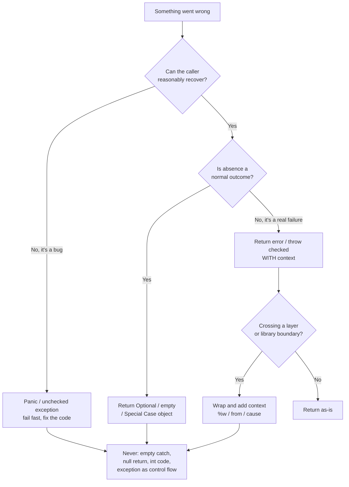
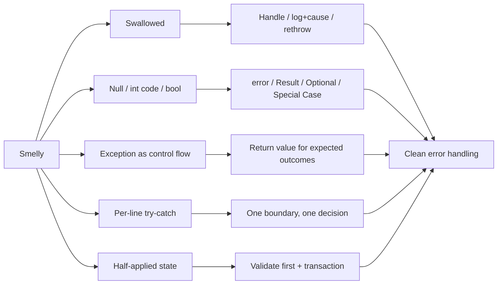

# Error Handling — Practice Tasks

> Twelve refactoring exercises that move code from defensive noise and silent failure toward error handling that is explicit, contextual, and impossible to ignore. Each task gives you a scenario, the smelly code (Go, Java, or Python — varied), a precise instruction, and a full solution with the reasoning behind it. Work top to bottom: difficulty climbs from "stop hiding a bug" to "make a multi-step operation failure-atomic."

---

## Table of Contents

1. [Task 1 — Stop swallowing an exception (Java, easy)](#task-1--stop-swallowing-an-exception-java-easy)
2. [Task 2 — Add context to a wrapped error (Go, easy)](#task-2--add-context-to-a-wrapped-error-go-easy)
3. [Task 3 — Preserve the cause when re-raising (Python, easy)](#task-3--preserve-the-cause-when-re-raising-python-easy)
4. [Task 4 — Replace an int error code with a real error (Go, medium)](#task-4--replace-an-int-error-code-with-a-real-error-go-medium)
5. [Task 5 — Replace a bool "ok" flag with a Result (Python, medium)](#task-5--replace-a-bool-ok-flag-with-a-result-python-medium)
6. [Task 6 — Remove exceptions-as-control-flow (Python, medium)](#task-6--remove-exceptions-as-control-flow-python-medium)
7. [Task 7 — Replace a null return with Optional / Special Case (Java, medium)](#task-7--replace-a-null-return-with-optional--special-case-java-medium)
8. [Task 8 — Collapse paranoid per-line try/catch into one boundary (Java, medium)](#task-8--collapse-paranoid-per-line-trycatch-into-one-boundary-java-medium)
9. [Task 9 — Introduce a typed error taxonomy (Go, hard)](#task-9--introduce-a-typed-error-taxonomy-go-hard)
10. [Task 10 — Convert checked-exception soup to unchecked + one handler (Java, hard)](#task-10--convert-checked-exception-soup-to-unchecked--one-handler-java-hard)
11. [Task 11 — Make an operation failure-atomic (Python, hard)](#task-11--make-an-operation-failure-atomic-python-hard)
12. [Task 12 — Error-handling audit (Go — open-ended)](#task-12--error-handling-audit-go--open-ended)

---

## How to Use

- Read the scenario, then **try the refactor yourself** before opening the solution. The instinct you build matters more than matching the answer.
- Keep behaviour observable: a refactor that changes what callers see on failure is a redesign, not a refactor. Each task states what must stay constant.
- The decision tree below is the mental model the whole chapter trains. Glance at it when a task asks "which mechanism?"



---

## Task 1 — Stop swallowing an exception (Java, easy)

**Scenario:** A nightly job parses a config file. When parsing fails the job silently uses stale in-memory config, and nobody finds out for weeks that the file has been malformed.

**Smelly code:**

```java
class ConfigLoader {
    private Config current = Config.defaults();

    public void reload(Path path) {
        try {
            current = Config.parse(Files.readString(path));
        } catch (Exception e) {
            // ignore — keep the old config
        }
    }

    public Config current() {
        return current;
    }
}
```

**Instruction:** Stop swallowing the failure. A caught exception must do at least one of three things: be handled meaningfully, be logged with its stack trace, or be rethrown. Decide which is correct here and apply it. Do not catch `Exception` if you only mean to tolerate one specific failure.

<details>
<summary>Solution</summary>

```java
class ConfigLoader {
    private static final Logger log = LoggerFactory.getLogger(ConfigLoader.class);
    private Config current = Config.defaults();

    /**
     * Reloads config from disk. On failure the previous config is retained
     * (deliberate degraded mode), but the failure is logged so it is visible
     * in monitoring. The exception carries its cause for diagnosis.
     */
    public void reload(Path path) {
        try {
            current = Config.parse(Files.readString(path));
        } catch (IOException e) {
            log.error("Config reload failed reading {}; keeping previous config", path, e);
        } catch (ConfigParseException e) {
            log.error("Config at {} is malformed; keeping previous config", path, e);
        }
    }

    public Config current() {
        return current;
    }
}
```

**Reasoning:**

- An empty `catch` block is the single most expensive habit in error handling: it converts a loud failure into a silent corruption that surfaces far from its cause. The fix is never "catch less broadly and still ignore" — it is to make the failure *observable*.
- "Keep the old config" is a legitimate design choice (degraded mode), so we keep it — but now it is logged at `error` level with the full exception (`log.error(msg, e)` passes the throwable, preserving the stack trace). Monitoring can alert on it.
- We narrowed `catch (Exception e)` to the two failures that can actually occur (`IOException`, `ConfigParseException`). Catching `Exception` would also swallow `NullPointerException` and other bugs — those should crash, not be tolerated.
- If stale config were *not* acceptable, the right move would be to rethrow (wrapped, see Task 2/3) and let the scheduler fail the job loudly.

</details>

---

## Task 2 — Add context to a wrapped error (Go, easy)

**Scenario:** A user reports "open /etc/app/profile.json: no such file or directory" in the logs. The team has no idea which feature triggered it because the error bubbled up through six functions, each returning it verbatim.

**Smelly code:**

```go
func loadProfile(userID string) (*Profile, error) {
    path := profilePath(userID)
    data, err := os.ReadFile(path)
    if err != nil {
        return nil, err
    }
    var p Profile
    if err := json.Unmarshal(data, &p); err != nil {
        return nil, err
    }
    return &p, nil
}
```

**Instruction:** Wrap each error with context that names the operation and the relevant identifiers, using `%w` so callers can still inspect the underlying error with `errors.Is` / `errors.As`. Do not log here — adding context is the job; logging happens once at the boundary.

<details>
<summary>Solution</summary>

```go
func loadProfile(userID string) (*Profile, error) {
    path := profilePath(userID)

    data, err := os.ReadFile(path)
    if err != nil {
        return nil, fmt.Errorf("load profile for user %q: read %s: %w", userID, path, err)
    }

    var p Profile
    if err := json.Unmarshal(data, &p); err != nil {
        return nil, fmt.Errorf("load profile for user %q: parse %s: %w", userID, path, err)
    }
    return &p, nil
}
```

Now the log reads:

```
load profile for user "u-8841": read /etc/app/profile.json: open /etc/app/profile.json: no such file or directory
```

A caller can still branch on the underlying cause:

```go
p, err := loadProfile(id)
if errors.Is(err, os.ErrNotExist) {
    // first-time user: create a default profile
}
```

**Reasoning:**

- `%w` (not `%v`) wraps the error, so `errors.Is(err, os.ErrNotExist)` and `errors.As(err, &target)` keep working up the stack. Use `%v` only when you deliberately want to *flatten* the chain and hide the cause.
- Good context answers "what were we trying to do, and on what?" — the operation (`load profile`), the subject (`user "u-8841"`), and the resource (the path). It does **not** repeat the lower-level message; `os.ReadFile` already says `open ... no such file`.
- Wrap at each layer that adds meaning, not at every line. Here the function is the meaningful unit, so it gets one wrap per failure point.
- Resist logging here. If every layer both wraps *and* logs, one failure produces six log lines. Wrap on the way up; log exactly once where the error stops propagating.

</details>

---

## Task 3 — Preserve the cause when re-raising (Python, easy)

**Scenario:** A service translates low-level storage errors into a domain `RepositoryError`. The on-call engineer sees `RepositoryError: could not load order` but the traceback stops there — the real cause (a connection timeout) is gone, because the original exception was discarded.

**Smelly code:**

```python
class RepositoryError(Exception):
    pass

def load_order(order_id: str) -> Order:
    try:
        row = db.query("SELECT * FROM orders WHERE id = %s", order_id)
    except DBError:
        raise RepositoryError(f"could not load order {order_id}")
    return Order.from_row(row)
```

**Instruction:** Re-raise the domain exception while preserving the original cause, so the traceback shows both layers. Use explicit exception chaining.

<details>
<summary>Solution</summary>

```python
class RepositoryError(Exception):
    """Domain-level failure to read or write persistent state."""


def load_order(order_id: str) -> Order:
    try:
        row = db.query("SELECT * FROM orders WHERE id = %s", order_id)
    except DBError as exc:
        raise RepositoryError(f"could not load order {order_id}") from exc
    return Order.from_row(row)
```

The traceback now ends with:

```
DBError: connection timed out after 5000ms

The above exception was the direct cause of the following exception:

RepositoryError: could not load order ord-1192
```

**Reasoning:**

- `raise NewError(...) from exc` sets `__cause__`, so Python prints **both** exceptions with the "direct cause" bridge. Without `from`, the original `DBError` is replaced and its traceback is lost (or, if it leaks via `__context__`, printed under the more confusing "During handling of the above exception" banner).
- Translating a low-level error into a domain error at a boundary is good design — callers of the repository shouldn't know about `DBError`. But translation must not *erase* the cause; on-call needs the timeout to know whether to restart the DB or scale connections.
- Use `from None` only when you intentionally want to suppress the cause (e.g. hiding an internal lookup-miss that you are replacing with a clean `KeyError`). That is the explicit, documented opposite of this fix — never the accidental default.
- Keep the domain exception's message about the *domain* ("could not load order"); let the chained cause carry the storage-level detail.

</details>

---

## Task 4 — Replace an int error code with a real error (Go, medium)

**Scenario:** A withdrawal function returns an `int` status code. Callers are supposed to check it against a table of constants, but a new teammate assumed "0 means success, nonzero means error" — which is backwards from this API — and shipped a bug that let overdrafts through.

**Smelly code:**

```go
const (
    StatusOK            = 1
    StatusInsufficient  = 2
    StatusAccountFrozen = 3
    StatusUnknownAcct   = 4
)

func Withdraw(acct *Account, amount int64) int {
    if acct == nil {
        return StatusUnknownAcct
    }
    if acct.Frozen {
        return StatusAccountFrozen
    }
    if acct.Balance < amount {
        return StatusInsufficient
    }
    acct.Balance -= amount
    return StatusOK
}

// Caller, easy to get wrong:
if Withdraw(acct, 500) != 0 { // BUG: 0 is never returned; success is 1
    // ...thought this was the error branch
}
```

**Instruction:** Replace the integer status with idiomatic Go error values. Make "success" the absence of an error so the compiler and convention guide the caller. Keep the distinct failure cases distinguishable.

<details>
<summary>Solution</summary>

```go
var (
    ErrUnknownAccount   = errors.New("unknown account")
    ErrAccountFrozen    = errors.New("account is frozen")
    ErrInsufficientFunds = errors.New("insufficient funds")
)

func Withdraw(acct *Account, amount int64) error {
    if acct == nil {
        return ErrUnknownAccount
    }
    if acct.Frozen {
        return fmt.Errorf("withdraw %d: %w", amount, ErrAccountFrozen)
    }
    if acct.Balance < amount {
        return fmt.Errorf("withdraw %d from balance %d: %w", amount, acct.Balance, ErrInsufficientFunds)
    }
    acct.Balance -= amount
    return nil
}

// Caller — the idiom is unmissable:
if err := Withdraw(acct, 500); err != nil {
    switch {
    case errors.Is(err, ErrInsufficientFunds):
        // offer overdraft protection
    case errors.Is(err, ErrAccountFrozen):
        // direct to support
    default:
        return err
    }
}
```

**Reasoning:**

- Integer codes carry no type safety: nothing stops a caller comparing against the wrong constant, ignoring the return entirely, or mixing up the success sentinel. `error` is the language's agreed channel — `err != nil` is the one idiom every Go reader knows.
- Sentinel errors (`errors.New`) give callers a stable identity to test with `errors.Is`, while `fmt.Errorf("...: %w", ...)` layers in the dynamic context (amount, balance) without losing that identity.
- Success becomes `nil`, the universal Go convention, so the "is this the error branch?" ambiguity that caused the overdraft bug disappears.
- For richer failures (e.g. needing the shortfall amount programmatically), promote the sentinel to a struct type implementing `error` and use `errors.As` — see Task 9.

</details>

---

## Task 5 — Replace a bool "ok" flag with a Result (Python, medium)

**Scenario:** A parser returns `(value, ok)`. Half the callers forget the `ok` and use a `None` value as if it were real, producing `TypeError` deep in unrelated code. The actual reason parsing failed is never available.

**Smelly code:**

```python
def parse_port(raw: str) -> tuple[int | None, bool]:
    try:
        port = int(raw)
    except ValueError:
        return None, False
    if not (0 < port <= 65535):
        return None, False
    return port, True

# Caller forgets the flag:
port, _ = parse_port(user_input)
sock.bind(("0.0.0.0", port))  # port may be None -> obscure failure later
```

**Instruction:** Replace the `(value, ok)` tuple with an explicit `Result` type that carries either a value or a reason for failure. Make it so a caller cannot read the value without acknowledging that it might be an error.

<details>
<summary>Solution</summary>

```python
from __future__ import annotations
from dataclasses import dataclass
from typing import Generic, TypeVar

T = TypeVar("T")

@dataclass(frozen=True)
class Ok(Generic[T]):
    value: T

@dataclass(frozen=True)
class Err:
    reason: str

Result = Ok[T] | Err


def parse_port(raw: str) -> Result[int]:
    try:
        port = int(raw)
    except ValueError:
        return Err(f"port must be an integer, got {raw!r}")
    if not (0 < port <= 65535):
        return Err(f"port {port} out of range 1..65535")
    return Ok(port)


# Caller is forced to discriminate before touching the value:
match parse_port(user_input):
    case Ok(port):
        sock.bind(("0.0.0.0", port))
    case Err(reason):
        raise SystemExit(f"bad --port: {reason}")
```

**Reasoning:**

- A `(value, ok)` tuple is a primitive-obsession version of a Result: the flag and the value are not bound together by the type system, so the flag is trivially dropped (`port, _ = ...`). The bug then surfaces as a `None` masquerading as an `int`, far from the parse site.
- `Ok | Err` is a closed union. `match` (or an `isinstance` ladder) forces the caller to handle both arms; you cannot reach `.value` on an `Err`, so the "forgot to check" failure mode is structurally impossible.
- Unlike the bool, `Err` carries *why* it failed — the message that the original code threw away. That message is exactly what the user needs.
- This is appropriate when failure is an expected, recoverable outcome of a pure function (parsing, validation). If failure were truly exceptional, raising `ValueError` with a clear message would be equally valid — the sin in the original was the silent `None`, not the choice of mechanism.

</details>

---

## Task 6 — Remove exceptions-as-control-flow (Python, medium)

**Scenario:** A function finds the first valid record in a list by *throwing* to break out of a loop, and uses a broad `except` as the normal "found it" path. It is slow, it hides real errors, and it reads like a puzzle.

**Smelly code:**

```python
class Found(Exception):
    def __init__(self, item):
        self.item = item

def first_active(users):
    try:
        for u in users:
            if u.is_active and u.has_verified_email:
                raise Found(u)
        return None
    except Found as f:
        return f.item

def charge_all(invoices, gateway):
    charged = []
    for inv in invoices:
        try:
            gateway.charge(inv)   # raises on decline
            charged.append(inv)
        except Exception:
            pass  # "skip declines" — but also skips network errors, bugs, KeyboardInterrupt
    return charged
```

**Instruction:** Rewrite both functions so exceptions are used only for *exceptional* conditions, not for ordinary branching. The first should use a plain loop/comprehension; the second should distinguish an expected business outcome (a decline) from a genuine error.

<details>
<summary>Solution</summary>

```python
def first_active(users):
    return next(
        (u for u in users if u.is_active and u.has_verified_email),
        None,
    )


def charge_all(invoices, gateway):
    """Charge each invoice. Declines are an expected outcome and are
    recorded; genuine errors (network, bugs) propagate."""
    charged, declined = [], []
    for inv in invoices:
        try:
            gateway.charge(inv)
        except CardDeclined as e:        # expected business outcome
            declined.append((inv, e.code))
            continue
        charged.append(inv)
    return ChargeReport(charged=charged, declined=declined)
```

**Reasoning:**

- `first_active` used a custom exception purely to escape a loop. Control flow is what `return`, `break`, and `next(generator, default)` are for; exceptions add stack-unwinding cost and obscure intent. The one-line `next(... , None)` says exactly what it does.
- In `charge_all`, `except Exception: pass` conflated two completely different things: a card decline (a normal result the business wants recorded) and a failure (timeout, bug, `KeyboardInterrupt`). The fix catches the *specific* expected exception (`CardDeclined`), records it as data, and lets everything else propagate so it can be retried, alerted on, or fixed.
- A decline is not exceptional — half of all charges might decline — so it becomes part of the return value (`ChargeReport`), not an exception. Reserve exceptions for the cases a caller cannot reasonably foresee.
- Rule of thumb: if you find yourself catching an exception you expect to happen on most inputs, the exception is being used as control flow; convert it to a return value.

</details>

---

## Task 7 — Replace a null return with Optional / Special Case (Java, medium)

**Scenario:** `findCustomer` returns `null` when nothing matches. Every call site is littered with null checks, and the ones that forget throw `NullPointerException` in production. One reporting path actually wants a harmless "anonymous" customer instead of a check at all.

**Smelly code:**

```java
class CustomerRepository {
    public Customer findCustomer(String id) {
        Row row = db.findById(id);
        if (row == null) {
            return null;       // caller must remember to check
        }
        return Customer.from(row);
    }
}

// Scattered call sites:
Customer c = repo.findCustomer(id);
String name = c.getName();             // NPE when not found
double discount = c.getLoyaltyTier().discount(); // chained NPE risk
```

**Instruction:** Eliminate the `null` return. Use `Optional<Customer>` for call sites that must branch on presence, and provide a Special Case (Null Object) `Customer` for the reporting path that wants sensible defaults instead of a check. Show both call styles.

<details>
<summary>Solution</summary>

```java
class CustomerRepository {
    /** Returns the customer if one exists; never null. */
    public Optional<Customer> findCustomer(String id) {
        return Optional.ofNullable(db.findById(id)).map(Customer::from);
    }

    /** Always returns a usable Customer; an unknown id yields the anonymous one. */
    public Customer findCustomerOrAnonymous(String id) {
        return findCustomer(id).orElse(Customer.ANONYMOUS);
    }
}

class Customer {
    /** Special Case object: safe defaults, no null, no branching needed. */
    public static final Customer ANONYMOUS = new Customer("anonymous", LoyaltyTier.NONE) {
        @Override public boolean isAnonymous() { return true; }
    };
    // ... real fields, getName(), getLoyaltyTier() ...
    public boolean isAnonymous() { return false; }
}

// Call site that must branch — the compiler forces the decision:
String name = repo.findCustomer(id)
    .map(Customer::getName)
    .orElse("Unknown customer");

// Reporting path that never wants to branch — Special Case absorbs absence:
double discount = repo.findCustomerOrAnonymous(id)
    .getLoyaltyTier()       // ANONYMOUS returns LoyaltyTier.NONE
    .discount();            // NONE.discount() == 0.0, no NPE possible
```

**Reasoning:**

- `null` is "an absence with no type and no contract." It compiles fine at every unchecked call site and detonates at runtime. `Optional<Customer>` makes the absence part of the *type*, so the caller cannot dereference without first dealing with the empty case.
- `Optional` is the right tool when the caller genuinely needs to decide between present/absent (the display name path). It is **not** a license to write `.get()` everywhere — that just relocates the NPE; use `map`/`orElse`/`ifPresent`.
- The Special Case (Null Object) pattern fits the reporting path: those call sites don't want to *handle* absence, they want a customer that behaves sanely (zero discount, name "anonymous"). `Customer.ANONYMOUS` lets the arithmetic proceed with no conditional at all.
- Both techniques delete `null` from the API surface. Pick `Optional` when absence is a branch point, Special Case when absence has a meaningful default behaviour.

</details>

---

## Task 8 — Collapse paranoid per-line try/catch into one boundary (Java, medium)

**Scenario:** A method imports a CSV row into the database. Every single statement is wrapped in its own try/catch "to be safe," but the catches all just log and continue, so a half-imported row gets committed and the logs are useless.

**Smelly code:**

```java
void importRow(String[] cells) {
    Customer c = null;
    try { c = new Customer(cells[0]); }
    catch (Exception e) { log.warn("name failed", e); }

    try { c.setEmail(cells[1]); }
    catch (Exception e) { log.warn("email failed", e); }

    try { c.setAge(Integer.parseInt(cells[2])); }
    catch (Exception e) { log.warn("age failed", e); }

    try { repo.save(c); }
    catch (Exception e) { log.warn("save failed", e); }
}
```

**Instruction:** Collapse the per-statement handling into a single try/catch at the natural boundary (one row = one unit of work). The whole row should succeed or fail as a unit, with one clear log line. Separate the code that *does* the work from the code that *handles* failure.

<details>
<summary>Solution</summary>

```java
void importRow(String[] cells, ImportReport report) {
    try {
        Customer c = buildCustomer(cells);   // does the work; throws on any problem
        repo.save(c);
        report.recordImported();
    } catch (ImportException e) {
        report.recordSkipped(cells, e);      // one row, one outcome
        log.warn("skipped row {}: {}", report.rowNumber(), e.getMessage(), e);
    }
}

/** All the parsing/validation that can fail, in one place. */
private Customer buildCustomer(String[] cells) {
    if (cells.length < 3) {
        throw new ImportException("expected 3 columns, got " + cells.length);
    }
    try {
        Customer c = new Customer(cells[0]);
        c.setEmail(cells[1]);
        c.setAge(Integer.parseInt(cells[2]));
        return c;
    } catch (NumberFormatException e) {
        throw new ImportException("age is not a number: " + cells[2], e);
    } catch (IllegalArgumentException e) {
        throw new ImportException("invalid field: " + e.getMessage(), e);
    }
}
```

**Reasoning:**

- Per-line try/catch is "paranoid handling": it pretends every statement fails independently, but they don't — once the name fails to parse, the email, age, and save are meaningless. The original code dereferenced a `null` `c` on the very next line, *adding* an NPE on top of the original failure.
- Worse, "log and continue" committed partially-built rows. The right unit of atomicity here is **one row**: build it fully, then save it, and if anything in that chain fails, skip the whole row. One try, one catch, one log line, one decision.
- Robert Martin's guideline applies: a method's body should either do work *or* handle errors, not braid them together line by line. `buildCustomer` does the work and throws a single domain exception type; `importRow` handles it once.
- The catch translates low-level failures (`NumberFormatException`) into a domain `ImportException` *with the cause* (`, e`) so the log retains the stack trace (compare Task 3's chaining).

</details>

---

## Task 9 — Introduce a typed error taxonomy (Go, hard)

**Scenario:** An HTTP handler calls a service that returns plain `fmt.Errorf` strings. The handler tries to choose a status code (400 vs 404 vs 500) by doing `strings.Contains(err.Error(), "not found")`. This is fragile — a reworded message silently turns a 404 into a 500.

**Smelly code:**

```go
func (s *Service) GetUser(id string) (*User, error) {
    if id == "" {
        return nil, fmt.Errorf("id is required")
    }
    u, ok := s.store[id]
    if !ok {
        return nil, fmt.Errorf("user %s not found", id)
    }
    return u, nil
}

// Handler guesses status from the message text:
func handler(w http.ResponseWriter, r *http.Request) {
    u, err := svc.GetUser(r.URL.Query().Get("id"))
    if err != nil {
        if strings.Contains(err.Error(), "not found") {
            http.Error(w, err.Error(), 404)
        } else if strings.Contains(err.Error(), "required") {
            http.Error(w, err.Error(), 400)
        } else {
            http.Error(w, "internal error", 500)
        }
        return
    }
    json.NewEncoder(w).Encode(u)
}
```

**Instruction:** Introduce a small, typed error taxonomy that classifies failures by *kind* (validation, not-found, internal). The service returns typed errors; the boundary maps kind → HTTP status with `errors.As`, never by string matching.

<details>
<summary>Solution</summary>

```go
// --- taxonomy ---
type Kind int

const (
    KindInternal Kind = iota
    KindValidation
    KindNotFound
)

type DomainError struct {
    Kind    Kind
    Message string
    Cause   error
}

func (e *DomainError) Error() string {
    if e.Cause != nil {
        return fmt.Sprintf("%s: %v", e.Message, e.Cause)
    }
    return e.Message
}
func (e *DomainError) Unwrap() error { return e.Cause }

func Validation(format string, a ...any) *DomainError {
    return &DomainError{Kind: KindValidation, Message: fmt.Sprintf(format, a...)}
}
func NotFound(format string, a ...any) *DomainError {
    return &DomainError{Kind: KindNotFound, Message: fmt.Sprintf(format, a...)}
}

// --- service returns typed errors ---
func (s *Service) GetUser(id string) (*User, error) {
    if id == "" {
        return nil, Validation("id is required")
    }
    u, ok := s.store[id]
    if !ok {
        return nil, NotFound("user %s not found", id)
    }
    return u, nil
}

// --- boundary maps kind -> status, once, for the whole API ---
func statusFor(err error) (int, string) {
    var de *DomainError
    if errors.As(err, &de) {
        switch de.Kind {
        case KindValidation:
            return http.StatusBadRequest, de.Message
        case KindNotFound:
            return http.StatusNotFound, de.Message
        }
    }
    return http.StatusInternalServerError, "internal error"
}

func handler(w http.ResponseWriter, r *http.Request) {
    u, err := svc.GetUser(r.URL.Query().Get("id"))
    if err != nil {
        code, msg := statusFor(err)
        if code == http.StatusInternalServerError {
            log.Printf("unhandled error: %v", err) // log the detail, hide it from the client
        }
        http.Error(w, msg, code)
        return
    }
    json.NewEncoder(w).Encode(u)
}
```

**Reasoning:**

- Classifying errors by their *string* couples the boundary to message wording — a copy-edit ("not found" → "does not exist") silently breaks routing. A typed taxonomy makes the classification a stable, compiler-checked contract.
- `DomainError` carries a `Kind` (the machine-readable classification), a human `Message`, and a `Cause` (with `Unwrap()` so `errors.Is`/`errors.As` still see wrapped lower-level errors). Constructors (`Validation`, `NotFound`) keep call sites terse and consistent.
- `errors.As(err, &de)` extracts the typed error even if it has been wrapped further up the stack, so the mapping survives additional context layers. The default arm is `500` — unknown errors are treated as internal, and only those are logged with full detail while the client sees a generic message (don't leak internals).
- The kind→status mapping lives in exactly one function (`statusFor`), so the whole API is consistent and a new kind is a one-line change. Keep the taxonomy small; three or four kinds usually cover an entire service.

</details>

---

## Task 10 — Convert checked-exception soup to unchecked + one handler (Java, hard)

**Scenario:** A service method declares five checked exceptions. Every caller either re-declares all five (viral `throws`) or wraps each in its own catch that just rethrows — boilerplate that buries the two cases anyone actually handles.

**Smelly code:**

```java
public Report generate(String accountId)
        throws SQLException, IOException, ParseException,
               TimeoutException, GeneralSecurityException {
    Connection c = pool.get();            // SQLException
    byte[] raw = blobStore.read(accountId); // IOException
    Data d = parser.parse(raw);           // ParseException
    Data decrypted = crypto.decrypt(d);   // GeneralSecurityException
    return remote.render(decrypted);      // TimeoutException
}

// Every caller, multiplied across the codebase:
try {
    report = svc.generate(id);
} catch (SQLException e) { throw new RuntimeException(e); }
catch (IOException e) { throw new RuntimeException(e); }
catch (ParseException e) { throw new RuntimeException(e); }
catch (TimeoutException e) { throw new RuntimeException(e); }
catch (GeneralSecurityException e) { throw new RuntimeException(e); }
```

**Instruction:** Replace the checked-exception soup with a single unchecked domain exception thrown from `generate`, and handle errors in *one* place (the boundary) rather than at every call. Preserve the original cause. Distinguish, in the unchecked exception, the cases the boundary still needs to tell apart.

<details>
<summary>Solution</summary>

```java
/** Unchecked: callers that can't recover don't have to declare or catch it. */
public class ReportException extends RuntimeException {
    public enum Cause { UNAVAILABLE, CORRUPT_DATA, TIMEOUT, UNEXPECTED }
    private final Cause cause;

    public ReportException(Cause cause, String message, Throwable t) {
        super(message, t);                 // keeps the original stack trace
        this.cause = cause;
    }
    public Cause cause() { return cause; }
}

public Report generate(String accountId) {     // no throws clause
    try {
        Connection c = pool.get();
        byte[] raw = blobStore.read(accountId);
        Data d = parser.parse(raw);
        Data decrypted = crypto.decrypt(d);
        return remote.render(decrypted);
    } catch (SQLException | IOException e) {
        throw new ReportException(Cause.UNAVAILABLE, "report source unavailable for " + accountId, e);
    } catch (ParseException | GeneralSecurityException e) {
        throw new ReportException(Cause.CORRUPT_DATA, "report data unreadable for " + accountId, e);
    } catch (TimeoutException e) {
        throw new ReportException(Cause.TIMEOUT, "report render timed out for " + accountId, e);
    }
}

// Most callers now write nothing:
Report report = svc.generate(id);

// Exactly one boundary (e.g. the controller) decides what each failure means:
try {
    return ResponseEntity.ok(svc.generate(id));
} catch (ReportException e) {
    log.error("report generation failed for {}", id, e);   // cause preserved
    return switch (e.cause()) {
        case UNAVAILABLE, TIMEOUT -> ResponseEntity.status(503).build(); // retryable
        case CORRUPT_DATA         -> ResponseEntity.status(422).build();
        case UNEXPECTED           -> ResponseEntity.status(500).build();
    };
}
```

**Reasoning:**

- Checked exceptions force *every* intermediate caller to either handle or re-declare them, even when there is nothing useful to do at that layer. The result is viral `throws` clauses or catch-and-rethrow boilerplate that drowns the two callers who can actually respond. Converting to a single unchecked `ReportException` lets uninterested layers stay silent — the exception flows straight to the one place equipped to handle it.
- We did not throw away the distinctions that matter: the multi-catch groups five low-level exceptions into three *domain-meaningful* causes (`UNAVAILABLE`, `CORRUPT_DATA`, `TIMEOUT`), recorded on the exception so the boundary can choose 503 vs 422 vs 500. Collapsing to one error type does not mean collapsing to one meaning.
- `super(message, t)` chains the original throwable, so the log retains the real stack trace (a database `SQLException`, a `TimeoutException`, etc.) — the unchecked wrapper adds intent without erasing the cause.
- Error *handling* now happens once, at the boundary, exactly where the system knows what a failure should mean to the outside world (an HTTP status, a retry, an alert). Inner methods only *signal*; they don't decide.

</details>

---

## Task 11 — Make an operation failure-atomic (Python, hard)

**Scenario:** `transfer` debits one account, then credits another, then writes an audit row. If the credit or audit step fails midway, the money has already left the source account but never arrived — the system is left in a corrupt, half-applied state.

**Smelly code:**

```python
def transfer(src: Account, dst: Account, amount: Decimal, ledger):
    src.balance -= amount          # mutates immediately
    if dst.is_frozen:
        raise AccountFrozen(dst.id)  # too late: src already debited
    dst.balance += amount
    ledger.append(audit_entry(src, dst, amount))  # may raise: dst already credited
```

**Instruction:** Make `transfer` failure-atomic: either all effects apply or none do. Validate everything *before* mutating, and structure the work so that a failure after the first mutation cannot leave a partial result. Show the "check first" approach and note when you'd reach for a transaction / rollback instead.

<details>
<summary>Solution</summary>

```python
def transfer(src: Account, dst: Account, amount: Decimal, ledger) -> None:
    # 1. Validate everything that can be checked up front — no mutation yet.
    if amount <= 0:
        raise ValueError(f"amount must be positive, got {amount}")
    if dst.is_frozen:
        raise AccountFrozen(dst.id)
    if src.balance < amount:
        raise InsufficientFunds(src.id, requested=amount, available=src.balance)

    entry = audit_entry(src, dst, amount)   # build (can fail) before committing

    # 2. Commit: the remaining steps cannot fail under our invariants.
    #    No validation is interleaved with mutation, so there is no half-state.
    src.balance -= amount
    dst.balance += amount
    ledger.append(entry)
```

When the steps touch a real datastore (and so *can* fail mid-commit — disk, network, a constraint), guarantee atomicity with a transaction and let it roll back:

```python
def transfer(src_id: str, dst_id: str, amount: Decimal) -> None:
    if amount <= 0:
        raise ValueError(f"amount must be positive, got {amount}")
    with db.transaction():                       # all-or-nothing
        src = repo.lock_for_update(src_id)       # row lock prevents races
        dst = repo.lock_for_update(dst_id)
        if dst.is_frozen:
            raise AccountFrozen(dst.id)          # raising aborts the tx -> rollback
        if src.balance < amount:
            raise InsufficientFunds(src.id, requested=amount, available=src.balance)
        repo.debit(src, amount)
        repo.credit(dst, amount)
        repo.write_audit(src, dst, amount)
    # On any exception the `with` block rolls back; no partial transfer persists.
```

**Reasoning:**

- The original interleaved *validation* with *mutation*: it debited the source, then discovered the destination was frozen. Once the first irreversible effect has happened, raising leaves corrupt state. The core fix is **do all checks before any mutation** — push every failure to a point where nothing has changed yet.
- For pure in-memory mutation we can also arrange the steps so that, after validation passes, the remaining operations cannot fail (simple arithmetic on validated inputs, with the audit entry *built* before the commit). That gives a "commit phase" with no failure points — a poor man's atomicity.
- When the effects span a real datastore, in-memory ordering is not enough: a write can fail mid-sequence regardless of prior checks. There you need a real transaction so the database guarantees all-or-nothing, and a raised exception triggers rollback. Row locking (`lock_for_update`) additionally prevents two concurrent transfers from racing on the same balance.
- Either way the invariant is the same and worth stating in tests: **after `transfer`, total money across both accounts is unchanged, or `transfer` raised and nothing moved.** A failure-atomic operation has no observable intermediate state.

</details>

---

## Task 12 — Error-handling audit (Go — open-ended)

**Scenario:** Below is a realistic handler. List **every error-handling smell** you can find and give a one-line fix for each, then sketch the corrected control flow.

```go
func (h *Handler) UpdateUser(w http.ResponseWriter, r *http.Request) {
    body, _ := io.ReadAll(r.Body)              // (a)
    var req UpdateRequest
    json.Unmarshal(body, &req)                 // (b)

    user := h.store.Find(req.ID)               // (c) returns nil if missing
    user.Name = req.Name                       // (d)

    if err := h.store.Save(user); err != nil {
        return                                 // (e)
    }

    func() {
        defer func() { recover() }()           // (f)
        h.audit.Log(req.ID, "updated")
    }()

    if h.store.Save(user) != nil {             // (g)
        w.WriteHeader(500)
    }
    w.Write([]byte("ok"))
}
```

<details>
<summary>Solution</summary>

| # | Smell | One-line fix |
|---|---|---|
| (a) | Ignored error from `io.ReadAll` (`body, _ :=`) | Check it: `body, err := io.ReadAll(r.Body); if err != nil { return 400 }`. |
| (b) | Swallowed `json.Unmarshal` error — invalid JSON proceeds with a zero-value `req` | Capture and handle: `if err := json.Unmarshal(body, &req); err != nil { http.Error(w, "bad json", 400); return }`. |
| (c) | `Find` returns `nil` on a miss (null return) | Return `(\*User, error)` or an `(\*User, bool)`; treat the miss as `404`, don't dereference. |
| (d) | Nil-pointer dereference: `user.Name` when `user == nil` | Guard before use — flows from fixing (c). |
| (e) | Swallowed `Save` error — returns `200`-ish to a *failed* save with no status, no log | Map to a status and log once: `log.Printf(...); http.Error(w, "save failed", 500); return`. |
| (f) | `recover()` used to silently discard panics from `audit.Log` — exceptions-as-control-flow + swallowing | Don't `recover` for control flow; if `Log` can fail, give it an `error` return and handle it, or let a genuine panic crash and be caught by middleware. |
| (g) | Duplicate `Save` (already saved at (e)) — double write, and uses `!= nil` inline making intent murky | Remove the redundant save; there should be exactly one persistence call per request. |
| — | No request context / cancellation passed to store calls | Thread `r.Context()` into `store.Find`/`Save` so a cancelled request stops work. |
| — | Status code written *after* `w.Write` in some paths | Write the status code before the body; never write a 200 body then try to set 500. |

**Corrected control flow:**

```go
func (h *Handler) UpdateUser(w http.ResponseWriter, r *http.Request) {
    ctx := r.Context()

    body, err := io.ReadAll(r.Body)
    if err != nil {
        http.Error(w, "cannot read body", http.StatusBadRequest)
        return
    }

    var req UpdateRequest
    if err := json.Unmarshal(body, &req); err != nil {
        http.Error(w, "invalid JSON", http.StatusBadRequest)
        return
    }

    user, err := h.store.Find(ctx, req.ID)
    if errors.Is(err, ErrNotFound) {
        http.Error(w, "user not found", http.StatusNotFound)
        return
    }
    if err != nil {
        log.Printf("find user %s: %v", req.ID, err)
        http.Error(w, "internal error", http.StatusInternalServerError)
        return
    }

    user.Name = req.Name
    if err := h.store.Save(ctx, user); err != nil {     // exactly one save
        log.Printf("save user %s: %v", req.ID, err)
        http.Error(w, "save failed", http.StatusInternalServerError)
        return
    }

    if err := h.audit.Log(ctx, req.ID, "updated"); err != nil {
        log.Printf("audit log for %s failed: %v", req.ID, err) // non-fatal: log, don't drop silently
    }

    w.WriteHeader(http.StatusOK)
    _, _ = w.Write([]byte("ok"))
}
```

**Order of attack:** fix the swallowed errors first (a, b, e) since those hide everything else; then the null return + nil deref (c, d); then remove the `recover` control-flow hack (f) and the duplicate save (g); finally thread context and order the status writes.

</details>

---

## Self-Assessment

You have internalized this chapter when you can answer "yes" to all of these:

- [ ] **No empty catch.** Every caught error is handled, logged with its cause, or rethrown — never silently dropped (Tasks 1, 8, 12).
- [ ] **Context on the way up, log once.** Errors gain operation + identifier context as they propagate (`%w`, `... from exc`, `cause`) and are logged exactly once, at the boundary (Tasks 2, 3, 9, 10).
- [ ] **Errors live in the type system.** No int codes, no `(value, bool)` tuples, no `null` returns — failures are `error`/exceptions/`Result`/`Optional` that a caller cannot accidentally ignore (Tasks 4, 5, 7).
- [ ] **Exceptions are exceptional.** Expected outcomes (a decline, a not-found, end-of-loop) are return values; exceptions are reserved for the genuinely unforeseen (Task 6).
- [ ] **Handling happens at boundaries.** Inner code signals; one outer layer decides what a failure means (status code, retry, alert). No paranoid per-line try/catch (Tasks 8, 10).
- [ ] **A typed taxonomy, kept small.** Failures are classified by *kind*, not by string matching, with a single kind→response mapping (Task 9).
- [ ] **Operations are failure-atomic.** Validate before mutating; either all effects apply or none do, backed by a transaction when state is persistent (Task 11).



---

## Related Topics

- [README.md](../README.md) — the positive rules these exercises invert.
- [junior.md](junior.md) · [find-bug.md](find-bug.md) · [optimize.md](optimize.md) — definitions, buggy snippets to fix, and performance angles for the same chapter.
- [Refactoring roadmap](../../refactoring/README.md) — the broader catalog of code smells and the mechanical refactorings (Extract Method, Replace Error Code with Exception, Introduce Null Object) used in these solutions.
