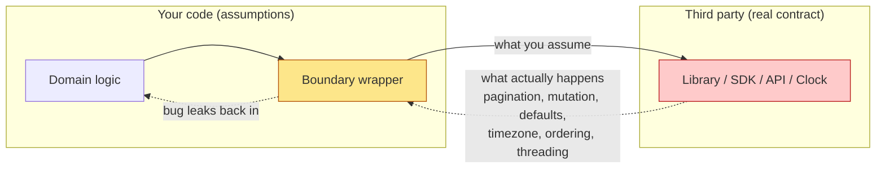

# Boundaries — Find the Bug

> 12 snippets where the bug lives at a **boundary** — the seam between your code and a third party (a library, an SDK, an external API, the OS clock). The code compiles, the tests pass, and yet production breaks. The root cause is almost always the same: an assumption about the other side that was never true, or stopped being true on an upgrade. Find it first; the fix is almost always an *abstraction layer* you control.

---

## Table of Contents

1. [Snippet 1 — The mock that ignores pagination (Go)](#snippet-1--the-mock-that-ignores-pagination-go)
2. [Snippet 2 — Library default flips on upgrade (Python)](#snippet-2--library-default-flips-on-upgrade-python)
3. [Snippet 3 — Shared SDK client, no thread safety (Java)](#snippet-3--shared-sdk-client-no-thread-safety-java)
4. [Snippet 4 — Wrapper swallows the error code (Go)](#snippet-4--wrapper-swallows-the-error-code-go)
5. [Snippet 5 — Library timezone leaks into domain logic (Python)](#snippet-5--library-timezone-leaks-into-domain-logic-python)
6. [Snippet 6 — Library mutates the slice you still hold (Go)](#snippet-6--library-mutates-the-slice-you-still-hold-go)
7. [Snippet 7 — Hyrum's Law: relying on undocumented ordering (Java)](#snippet-7--hyrums-law-relying-on-undocumented-ordering-java)
8. [Snippet 8 — Connection pool exhaustion: the resource never closes (Python)](#snippet-8--connection-pool-exhaustion-the-resource-never-closes-python)
9. [Snippet 9 — Leaked library type changes a default field (Go)](#snippet-9--leaked-library-type-changes-a-default-field-go)
10. [Snippet 10 — Stubbing a return that the real API never returns (Java)](#snippet-10--stubbing-a-return-that-the-real-api-never-returns-java)
11. [Snippet 11 — Locale-sensitive parsing at the boundary (Java)](#snippet-11--locale-sensitive-parsing-at-the-boundary-java)
12. [Snippet 12 — JSON number becomes float, money loses cents (Python)](#snippet-12--json-number-becomes-float-money-loses-cents-python)
13. [Scorecard](#scorecard)
14. [Related Topics](#related-topics)

---

## How to Use

For each snippet:

1. Read the code and the surrounding context (the caller, the test, the upgrade note).
2. Ask the boundary question: **"What does my code assume about the other side — and is that assumption guaranteed?"** A guarantee comes from a documented contract, not from "it worked when I tried it."
3. Locate the exact line where the assumption is made.
4. Open the answer. Confirm the bug, the *root cause at the boundary*, and the fix.

The recurring lesson: boundaries are where two sets of assumptions meet. The bug is rarely a typo — it is a contract you imagined. Mocks encode your imagination; production runs the real contract.



---

## Snippet 1 — The mock that ignores pagination (Go)

**Difficulty:** ⭐⭐ Medium

```go
// Production code that lists every active subscription for a customer.
type BillingAPI interface {
    ListSubscriptions(ctx context.Context, customerID string) ([]Subscription, error)
}

func CountActive(ctx context.Context, api BillingAPI, customerID string) (int, error) {
    subs, err := api.ListSubscriptions(ctx, customerID)
    if err != nil {
        return 0, err
    }
    active := 0
    for _, s := range subs {
        if s.Status == "active" {
            active++
        }
    }
    return active, nil
}

// Test
type fakeBilling struct{ subs []Subscription }

func (f *fakeBilling) ListSubscriptions(ctx context.Context, id string) ([]Subscription, error) {
    return f.subs, nil
}

func TestCountActive(t *testing.T) {
    api := &fakeBilling{subs: []Subscription{
        {Status: "active"}, {Status: "active"}, {Status: "canceled"},
    }}
    n, _ := CountActive(context.Background(), api, "cus_1")
    if n != 2 {
        t.Fatalf("want 2, got %d", n)
    }
}
```

The real Stripe-style client behind `BillingAPI` returns **at most 100 items per page** and sets a `has_more` flag; you must follow a cursor to get the rest.

**What's wrong?**

<details><summary>Answer</summary>

**Bug:** A customer with 250 subscriptions gets counted as if they had 100. `CountActive` undercounts by ignoring pages 2 and 3.

**Root cause at the boundary:** The interface `ListSubscriptions(...) ([]Subscription, error)` *flattens away* the real API's pagination. The mock honestly implements that flattened contract (return a slice), so the test passes. But the real implementation can only return one page per call — the slice the interface promises is a fiction. The mock encodes your wishful contract, not the vendor's.

**Why it hid:** The test author owns the mock and the interface, so they made both agree. Nobody tested against the real pagination semantics. This is the classic failure of *mocking what you don't own*: the mock can only be as correct as your understanding of the third party — and your understanding was wrong.

**Fix:** Make the boundary wrapper own pagination, and make the domain interface expose either a complete iterator or an explicitly-paged result. Then write a **learning test** against the real client (recorded once) to verify the cursor loop.

```go
// The wrapper you own hides the cursor; the domain sees "all of them".
type StripeBilling struct{ client *stripe.Client }

func (s *StripeBilling) ListSubscriptions(ctx context.Context, customerID string) ([]Subscription, error) {
    var out []Subscription
    cursor := ""
    for {
        page, err := s.client.Subscriptions.List(ctx, customerID, cursor)
        if err != nil {
            return nil, err
        }
        out = append(out, page.Items...)
        if !page.HasMore {
            return out, nil
        }
        cursor = page.NextCursor
    }
}
```

Now the mock is allowed to return a full slice — because the wrapper genuinely fulfills that contract. The pagination assumption lives in exactly one place you control.
</details>

---

## Snippet 2 — Library default flips on upgrade (Python)

**Difficulty:** ⭐⭐ Medium

```python
import requests

def fetch_report(report_id: str) -> dict:
    # Internal reporting service, slow on big reports.
    resp = requests.get(f"https://reports.internal/v1/{report_id}")
    resp.raise_for_status()
    return resp.json()
```

This shipped on `requests==2.x` and ran fine for a year. The team bumped a transitive dependency, which pulled in a new HTTP client used elsewhere, and someone "modernized" this call to the team's shared client wrapper:

```python
# shared_http.py  (new internal wrapper, built on httpx)
import httpx

_client = httpx.Client()  # default timeout in httpx is 5 seconds

def get(url: str) -> httpx.Response:
    return _client.get(url)
```

```python
def fetch_report(report_id: str) -> dict:
    resp = shared_http.get(f"https://reports.internal/v1/{report_id}")
    resp.raise_for_status()
    return resp.json()
```

**What's wrong?**

<details><summary>Answer</summary>

**Bug:** Large reports that used to succeed now fail with `ReadTimeout`. The original `requests.get` had **no timeout by default** (it would wait indefinitely); `httpx.Client` defaults to a **5-second** timeout. A report that takes 12 seconds worked before and times out now.

**Root cause at the boundary:** Behavior depended on a *library default* that was never made explicit. Two libraries disagree on the default, and the disagreement is silent — both calls read as `get(url)`. The contract that mattered ("how long do we wait?") was implicit, so swapping the implementation silently changed domain behavior.

> Note: "no timeout by default" is itself a latent bug in the original — it just hadn't bitten yet. The migration only exposed how much you were relying on an unstated default.

**Why it hid:** Defaults are invisible at the call site. Nothing in `fetch_report` mentions timeouts, so the upgrade looked behavior-preserving. Diff review showed `requests.get(url)` → `shared_http.get(url)`; both look identical in intent.

**Fix:** Never inherit a library's timeout (or retries, or redirect, or TLS-verify) default. Make every boundary-crossing value explicit and owned by your wrapper:

```python
# shared_http.py
import httpx

# Choose deliberately; document the why. Reports can be slow.
DEFAULT_TIMEOUT = httpx.Timeout(connect=5.0, read=30.0, write=5.0, pool=5.0)

def get(url: str, *, timeout: httpx.Timeout = DEFAULT_TIMEOUT) -> httpx.Response:
    with httpx.Client(timeout=timeout) as client:
        return client.get(url)
```

And for the slow report specifically, pass an explicit longer read timeout. The rule: **a library default is not a decision your code made — so make the decision.**
</details>

---

## Snippet 3 — Shared SDK client, no thread safety (Java)

**Difficulty:** ⭐⭐⭐ Hard

```java
public final class S3Uploader {
    // Reuse one client for performance — recommended by the SDK docs.
    private static final AmazonS3 S3 = AmazonS3ClientBuilder.standard().build();

    public void upload(String bucket, String key, InputStream data, long length) {
        ObjectMetadata meta = new ObjectMetadata();
        meta.setContentLength(length);
        // The SDK's transfer config lives on a shared mutable field.
        meta.setSSEAlgorithm(currentTenant().requiresEncryption() ? "aws:kms" : null);
        S3.putObject(bucket, key, data, meta);
    }
}
```

Called concurrently from a request-handling thread pool, one call per upload, each with its own `ObjectMetadata`.

**What's wrong?**

<details><summary>Answer</summary>

**Bug:** This particular snippet is *mostly* fine — `AmazonS3` clients are documented as thread-safe and `ObjectMetadata` is a per-call local. The trap is one layer down and far more common in real code: people reuse a single **mutable** request/config object across threads. Watch what happens when an engineer "optimizes" by hoisting the metadata to a field:

```java
public final class S3Uploader {
    private static final AmazonS3 S3 = AmazonS3ClientBuilder.standard().build();
    private final ObjectMetadata meta = new ObjectMetadata(); // hoisted "to avoid allocation"

    public void upload(String bucket, String key, InputStream data, long length) {
        meta.setContentLength(length);
        meta.setSSEAlgorithm(currentTenant().requiresEncryption() ? "aws:kms" : null);
        S3.putObject(bucket, key, data, meta); // shared mutable state across threads
    }
}
```

Now two concurrent uploads race on `meta`. Tenant A (requires KMS) and Tenant B (no encryption) interleave: A sets `contentLength` and `aws:kms`, B overwrites `SSEAlgorithm` to `null` before A's `putObject` reads it, and **Tenant A's data is uploaded unencrypted**, or with B's content length, corrupting the object.

**Root cause at the boundary:** The SDK's thread-safety contract is asymmetric and *type-specific*. The *client* is thread-safe; the *request/metadata objects* are not. "Reuse the client" got over-generalized into "reuse everything," because the boundary documentation distinction was never encoded in the code. A shared SDK type leaked its concurrency assumptions into your service.

**Why it hid:** Single-threaded tests never interleave. The data race surfaces only under concurrency, intermittently, often as a silent wrong-encryption rather than a crash.

**Fix:** Keep the expensive, thread-safe client shared; construct the per-request object fresh every call (as the first version did). Encode the rule in your wrapper so callers cannot hoist:

```java
public final class S3Uploader {
    private final AmazonS3 s3; // injected, shared, thread-safe — OK

    public void upload(String bucket, String key, InputStream data,
                       long length, boolean encrypt) {
        ObjectMetadata meta = new ObjectMetadata(); // always per-call
        meta.setContentLength(length);
        if (encrypt) meta.setSSEAlgorithm("aws:kms");
        s3.putObject(bucket, key, data, meta);
    }
}
```

Rule: at a boundary, know *which* SDK objects are shareable. Treat "thread-safe" as a per-type claim, never a blanket one.
</details>

---

## Snippet 4 — Wrapper swallows the error code (Go)

**Difficulty:** ⭐⭐ Medium

```go
// A thin wrapper around the payments SDK.
func (p *Payments) Charge(ctx context.Context, amount Money, card string) error {
    _, err := p.sdk.CreateCharge(ctx, &sdk.ChargeRequest{
        Amount: amount.Cents(),
        Source: card,
    })
    if err != nil {
        return fmt.Errorf("charge failed: %w", err)
    }
    return nil
}

// Caller
func (s *OrderService) Pay(ctx context.Context, o *Order) error {
    if err := s.payments.Charge(ctx, o.Total, o.Card); err != nil {
        // Network blip or declined card — retry a few times.
        return s.retry(ctx, func() error {
            return s.payments.Charge(ctx, o.Total, o.Card)
        })
    }
    return nil
}
```

The SDK distinguishes a **card declined** (`sdk.ErrCardDeclined`, terminal — do not retry) from a **transient gateway error** (`sdk.ErrGatewayTimeout`, safe to retry).

**What's wrong?**

<details><summary>Answer</summary>

**Bug:** The caller retries on *every* error, including `ErrCardDeclined`. A declined card is retried 3–5 times. If the gateway is *not* idempotent on retry — or if the decline later flips to an approval after the customer tops up — the customer can be **charged multiple times**, or the system hammers the gateway with guaranteed-to-fail requests, tripping rate limits.

**Root cause at the boundary:** The wrapper flattens a *structured* error into an opaque string-ish `error`. It wraps with `%w`, so the original is technically retrievable — but the caller has no typed signal and no documented way to ask "is this retryable?" The boundary lost the one piece of information that drives the control-flow decision: the error *class*.

**Why it hid:** "Charge failed: ..." reads like a complete, honest error. Tests for the happy path and a single generic-failure path both pass. The distinction only matters under the specific declined-vs-transient split, which a generic mock returning `errors.New("boom")` never exercises.

**Fix:** Translate the SDK's error taxonomy into *your* domain error taxonomy at the boundary, so callers branch on meaning, not strings:

```go
var (
    ErrPaymentDeclined  = errors.New("payment declined")  // terminal
    ErrPaymentTransient = errors.New("payment transient")  // retryable
)

func (p *Payments) Charge(ctx context.Context, amount Money, card string) error {
    _, err := p.sdk.CreateCharge(ctx, &sdk.ChargeRequest{Amount: amount.Cents(), Source: card})
    switch {
    case err == nil:
        return nil
    case errors.Is(err, sdk.ErrCardDeclined):
        return fmt.Errorf("%w: %v", ErrPaymentDeclined, err)
    case errors.Is(err, sdk.ErrGatewayTimeout):
        return fmt.Errorf("%w: %v", ErrPaymentTransient, err)
    default:
        return fmt.Errorf("charge failed: %w", err) // unknown → do not retry by default
    }
}

// Caller retries only the transient class.
func (s *OrderService) Pay(ctx context.Context, o *Order) error {
    err := s.payments.Charge(ctx, o.Total, o.Card)
    if errors.Is(err, ErrPaymentTransient) {
        return s.retry(ctx, func() error { return s.payments.Charge(ctx, o.Total, o.Card) })
    }
    return err
}
```

A boundary wrapper's job is not just to *call* the library — it is to *translate the library's contract*, errors included, into terms your domain can reason about.
</details>

---

## Snippet 5 — Library timezone leaks into domain logic (Python)

**Difficulty:** ⭐⭐⭐ Hard

```python
from datetime import datetime

def is_within_business_day(scheduled_at: datetime) -> bool:
    """Reject orders scheduled outside Mon-Fri."""
    return scheduled_at.weekday() < 5  # 0=Mon ... 4=Fri

def parse_scheduled(payload: dict) -> datetime:
    # The client sends ISO 8601, e.g. "2026-06-13T22:30:00-06:00"
    return datetime.fromisoformat(payload["scheduled_at"])

# Usage
dt = parse_scheduled({"scheduled_at": "2026-06-13T22:30:00-06:00"})
ok = is_within_business_day(dt)
```

The business runs on **UTC**. Customers send timestamps with their *local* offset.

**What's wrong?**

<details><summary>Answer</summary>

**Bug:** `2026-06-13T22:30:00-06:00` is a **Saturday** in the customer's local time, but `2026-06-14T04:30:00Z` — still Saturday in UTC here, but consider `2026-06-12T22:30:00-06:00` which is Friday local yet `2026-06-13T04:30:00Z` = **Saturday** in UTC. `weekday()` operates on the *naive wall-clock fields* of whatever offset the parser produced, **not** on a normalized instant. The business-day check answers a different question than intended ("is the customer's local wall-clock a weekday?" vs. "is it a business day in our UTC calendar?"). Orders get accepted or rejected by the customer's offset, not the company's.

**Root cause at the boundary:** `datetime.fromisoformat` faithfully preserves the *incoming* offset — that is correct library behavior. The bug is that domain logic (`weekday()`) was run on a timezone-aware datetime *without normalizing to the business timezone first*. The library's "preserve what you were given" default leaked an external timezone straight into a domain decision.

**Why it hid:** During development everyone tested with their own machine's timezone (often the company TZ), so the offset matched and the bug was invisible. It surfaces only for customers in other zones, near midnight, near a weekday boundary — exactly the inputs nobody adds to a fixture.

**Fix:** Normalize at the boundary. The instant a timestamp enters the domain, convert it to the canonical zone (UTC, or whatever the business calendar uses) and forbid naive datetimes:

```python
from datetime import datetime, timezone

BUSINESS_TZ = timezone.utc  # the calendar the business actually runs on

def parse_scheduled(payload: dict) -> datetime:
    dt = datetime.fromisoformat(payload["scheduled_at"])
    if dt.tzinfo is None:
        raise ValueError("scheduled_at must include a timezone offset")
    return dt.astimezone(BUSINESS_TZ)  # normalize once, at the edge

def is_within_business_day(scheduled_at: datetime) -> bool:
    assert scheduled_at.tzinfo == BUSINESS_TZ, "must be normalized before domain use"
    return scheduled_at.weekday() < 5
```

Rule: timezone conversion is a *boundary* responsibility. Domain code should only ever see instants in one known zone.
</details>

---

## Snippet 6 — Library mutates the slice you still hold (Go)

**Difficulty:** ⭐⭐⭐ Hard

```go
import "sort"

func TopThree(scores []Score) []Score {
    // The caller still uses `scores` after this for an audit log,
    // and expects it in original (insertion) order.
    sort.Slice(scores, func(i, j int) bool {
        return scores[i].Value > scores[j].Value
    })
    if len(scores) > 3 {
        return scores[:3]
    }
    return scores
}

// Caller
func Report(scores []Score) {
    top := TopThree(scores)
    render(top)
    auditLog(scores) // expects original order, original length conceptually
}
```

**What's wrong?**

<details><summary>Answer</summary>

**Bug:** `sort.Slice` sorts **in place**. The caller's `scores` is now reordered by value, so `auditLog(scores)` records the wrong order. Worse, `return scores[:3]` returns a slice that **shares the same backing array** as the caller's `scores`; any later mutation of `top` writes through into `scores`, and the audit sees those changes too. The function silently corrupts data the caller still owns.

**Root cause at the boundary:** `sort.Slice` (and slice-reslicing in general) is a library facility with a *mutation* contract — it does not allocate a copy. The function accepted a caller-owned slice and handed it to a mutating library call, leaking the library's in-place semantics back onto the caller. The boundary failed to establish ownership: who is allowed to mutate this slice?

**Why it hid:** A unit test that passes a fresh literal `[]Score{...}` and only checks the *returned* top-three never observes the aliasing — there is no second reader in the test. The corruption needs a caller that uses the slice both before and after, which only exists in production.

**Fix:** Treat caller-owned data as immutable across the boundary. Copy before mutating, and return a copy (or an independent slice) so the result cannot alias the input:

```go
func TopThree(scores []Score) []Score {
    sorted := make([]Score, len(scores))
    copy(sorted, scores) // do not touch the caller's slice
    sort.Slice(sorted, func(i, j int) bool { return sorted[i].Value > sorted[j].Value })
    n := 3
    if len(sorted) < n {
        n = len(sorted)
    }
    return sorted[:n:n] // three-index slice: cap == len, no accidental aliasing
}
```

Rule: when a library mutates in place (sort, `append`, `bytes.Buffer` reuse, JSON decoders reusing buffers), the boundary owns the decision to copy. Never pass caller-owned data into a mutating call you don't control without first establishing who owns the mutation.
</details>

---

## Snippet 7 — Hyrum's Law: relying on undocumented ordering (Java)

**Difficulty:** ⭐⭐⭐ Hard

```java
// Build a canonical signature string from request params, then HMAC it.
public String sign(Map<String, String> params, String secret) {
    StringBuilder sb = new StringBuilder();
    for (Map.Entry<String, String> e : params.entrySet()) {
        sb.append(e.getKey()).append('=').append(e.getValue()).append('&');
    }
    return hmacSha256(sb.toString(), secret);
}

// Caller built the map like this and it always worked:
Map<String, String> params = new HashMap<>();
params.put("amount", "100");
params.put("currency", "USD");
params.put("nonce", "abc");
String sig = sign(params, secret);
```

Both client and server use *this exact code* to sign and verify. It has matched for two years on Java 8. The team upgrades the JVM.

**What's wrong?**

<details><summary>Answer</summary>

**Bug:** `HashMap` iteration order is **unspecified** — it depends on key hash codes and internal bucket layout, which can change between JVM versions (and does, e.g., in the treeification and hashing tweaks across major releases). The signature was *accidentally* stable because client and server happened to run the same JVM with the same bucket order. After the upgrade, iteration order shifts on one side, the concatenated string differs, the HMAC differs, and **every signature verification fails** — total outage of signed requests.

**Root cause at the boundary:** This is **Hyrum's Law**: with enough usage, every observable behavior of an interface — even ones the contract never promised — becomes something someone depends on. `HashMap` never promised an order. The code depended on the order anyway, and a patch/upgrade "broke" behavior that was never guaranteed.

**Why it hid:** It works in every test and every environment that shares the same JVM build. The dependency on iteration order is invisible — there is no line that says "I rely on order here." It only breaks when the two sides diverge on a JVM version or when a map grows past a resize threshold.

**Fix:** Never depend on undocumented behavior. Make the ordering an *explicit, specified* part of the contract — canonicalize by sorting keys, and use a structure whose order is guaranteed:

```java
public String sign(Map<String, String> params, String secret) {
    // Specify the order; do not inherit it from the map implementation.
    StringBuilder sb = new StringBuilder();
    new TreeMap<>(params).forEach((k, v) ->
        sb.append(k).append('=').append(v).append('&'));
    return hmacSha256(sb.toString(), secret);
}
```

`TreeMap` guarantees ascending key order regardless of JVM, library version, or insertion order. The signature now depends only on documented behavior. Whenever you cross a boundary that must be *reproducible* (signing, hashing, caching keys, serialization), pin every observable detail explicitly.
</details>

---

## Snippet 8 — Connection pool exhaustion: the resource never closes (Python)

**Difficulty:** ⭐⭐ Medium

```python
import psycopg2.pool

pool = psycopg2.pool.SimpleConnectionPool(minconn=1, maxconn=10, dsn=DSN)

def get_user(user_id: int) -> dict | None:
    conn = pool.getconn()
    cur = conn.cursor()
    cur.execute("SELECT id, email FROM users WHERE id = %s", (user_id,))
    row = cur.fetchone()
    if row is None:
        return None          # early return
    return {"id": row[0], "email": row[1]}
```

This endpoint gets ~50 requests/second. After a few minutes under load, every request hangs.

**What's wrong?**

<details><summary>Answer</summary>

**Bug:** The connection is **never returned to the pool**. There is no `pool.putconn(conn)`. Every call leaks one connection. The pool has `maxconn=10`; after 10 calls (faster than that under concurrency), `getconn()` blocks forever waiting for a connection that will never come back. The early `return None` path makes it even worse — but *every* path leaks, because there is no release at all.

**Root cause at the boundary:** A pooled resource has a **borrow/return** contract: what you take from the pool you must give back, on every path including exceptions and early returns. The code crossed the boundary (borrowed a connection) but never honored the other half of the contract. The library cannot reclaim what you do not return.

**Why it hid:** A unit test calls `get_user` once or twice and never approaches `maxconn`. Functionally the query is correct, the test asserts the right row, and the leak is invisible until sustained concurrency drains the pool. It manifests as "the app hangs after a while," not as a test failure.

**Fix:** Tie the resource's lifetime to a scope so return is guaranteed on every exit path. A context manager makes the borrow/return symmetric and exception-safe:

```python
from contextlib import contextmanager

@contextmanager
def borrow_conn():
    conn = pool.getconn()
    try:
        yield conn
    finally:
        pool.putconn(conn)   # always returned, even on exception/early return

def get_user(user_id: int) -> dict | None:
    with borrow_conn() as conn:
        with conn.cursor() as cur:
            cur.execute("SELECT id, email FROM users WHERE id = %s", (user_id,))
            row = cur.fetchone()
    if row is None:
        return None
    return {"id": row[0], "email": row[1]}
```

Rule: any resource acquired from a boundary (connection, file handle, lock, lease, semaphore slot) must be released in a `finally`/`with`/`defer`. "I'll close it at the end" is wrong the moment the function gains a second exit path.
</details>

---

## Snippet 9 — Leaked library type changes a default field (Go)

**Difficulty:** ⭐⭐⭐ Hard

```go
import "github.com/some/jwtlib"

// jwtlib.Claims is the library's struct; we pass it around the whole codebase.
func IssueToken(userID string) (string, error) {
    claims := jwtlib.Claims{
        Subject: userID,
        // ExpiresAt left as zero value
    }
    return jwtlib.Sign(claims, signingKey)
}

func Authorize(token string) (string, error) {
    claims, err := jwtlib.Verify(token, signingKey)
    if err != nil {
        return "", err
    }
    return claims.Subject, nil
}
```

On `jwtlib v1`, an unset `ExpiresAt` (zero value) meant **"no expiry"** and `Verify` accepted it. The team upgrades to `jwtlib v2`, where the maintainers — citing security — changed `Verify` to **reject tokens without an `ExpiresAt`** by default.

**What's wrong?**

<details><summary>Answer</summary>

**Bug:** After the upgrade, *every* token issued by `IssueToken` (which never sets `ExpiresAt`) is rejected by `Authorize`. Every user is logged out and cannot log back in — a full authentication outage. The behavior change is intentional and arguably correct on the library's side, but your code relied on the old default ("zero = no expiry, accepted").

**Root cause at the boundary:** The library's type `jwtlib.Claims` leaked throughout the codebase, and your code depended on the *default semantics of its zero value*. Defaults and zero-value meaning are part of a library's contract that maintainers can and do change across major versions. Because the type was used directly everywhere, there was no single place that owned "what fields must always be set" — the assumption was scattered and implicit.

**Why it hid:** v1 tests passed (zero `ExpiresAt` accepted). The upgrade diff is a one-line `go.mod` bump with no source change, so review sees nothing alarming. The break is at runtime, after deploy, for all users at once.

**Fix:** Do not let the library type be your domain type. Wrap it behind your own type and your own explicit policy, so defaults are decisions you make, not values you inherit:

```go
type Token struct {
    UserID string
    TTL    time.Duration
}

func (t Token) sign(key []byte) (string, error) {
    if t.TTL <= 0 {
        return "", errors.New("token TTL must be set") // your policy, explicit
    }
    claims := jwtlib.Claims{
        Subject:   t.UserID,
        ExpiresAt: time.Now().Add(t.TTL).Unix(), // always set
    }
    return jwtlib.Sign(claims, key)
}
```

Now `jwtlib.Claims` exists in exactly one file. The required-fields policy is explicit and tested. A future library default change touches one adapter, not the whole codebase. Rule: a third-party type at the core of your domain is a liability — its defaults are someone else's decision.
</details>

---

## Snippet 10 — Stubbing a return that the real API never returns (Java)

**Difficulty:** ⭐⭐ Medium

```java
public interface GeocodingClient {
    Coordinates geocode(String address); // returns coordinates for an address
}

public class DeliveryRouter {
    private final GeocodingClient geocoder;

    public Route planRoute(String fromAddress, String toAddress) {
        Coordinates from = geocoder.geocode(fromAddress);
        Coordinates to = geocoder.geocode(toAddress);
        return Route.between(from, to); // uses from.lat, from.lng, ...
    }
}

// Test
@Test
void planRoute_buildsRouteBetweenCoordinates() {
    GeocodingClient stub = mock(GeocodingClient.class);
    when(stub.geocode(anyString()))
        .thenReturn(new Coordinates(40.0, -73.0)); // always a valid result
    Route route = new DeliveryRouter(stub).planRoute("A St", "B Ave");
    assertNotNull(route);
}
```

The real geocoding service returns **`null` (or an empty result) when an address is not found** — a routine outcome for typos and PO boxes, not an exception.

**What's wrong?**

<details><summary>Answer</summary>

**Bug:** `planRoute` never handles the not-found case. The stub *always* returns a valid `Coordinates`, so the test passes, but in production an unrecognized address makes `geocode` return `null`, and `Route.between(from, to)` throws `NullPointerException` (or, worse, treats a null/zero coordinate as `(0,0)` — a point in the Gulf of Guinea — and silently plans a route to the ocean).

**Root cause at the boundary:** The mock encodes a *happier* contract than the real API. The real `geocode` has a documented "not found → null/empty" branch that the stub omits entirely. The test verifies behavior against a fictional API that always succeeds — *mocking what you don't own*, with a mock more optimistic than reality.

**Why it hid:** `when(...).thenReturn(validCoords)` is the obvious, frictionless way to write the stub, and it makes the test green. Nobody stubbed the not-found path because the interface (`Coordinates geocode(String)`) doesn't *advertise* that path — it returns `Coordinates`, not `Optional<Coordinates>`. The boundary type itself hides the failure mode.

**Fix:** Make the boundary type express the real contract, then the compiler forces the caller to handle every branch — and write a **learning test** against the real service to confirm not-found behavior:

```java
public interface GeocodingClient {
    Optional<Coordinates> geocode(String address); // not-found is in the type
}

public Route planRoute(String fromAddress, String toAddress) {
    Coordinates from = geocoder.geocode(fromAddress)
        .orElseThrow(() -> new AddressNotFound(fromAddress));
    Coordinates to = geocoder.geocode(toAddress)
        .orElseThrow(() -> new AddressNotFound(toAddress));
    return Route.between(from, to);
}
```

Now a stub *cannot* return a bare `Coordinates`; it must return `Optional.empty()` or `Optional.of(...)`, which nudges the test author to cover both. The type carries the contract across the boundary so the mock cannot lie about it.
</details>

---

## Snippet 11 — Locale-sensitive parsing at the boundary (Java)

**Difficulty:** ⭐⭐⭐ Hard

```java
// Parse a price from an incoming partner CSV feed.
public BigDecimal parsePrice(String raw) {
    // raw looks like "1,234.56"
    NumberFormat nf = NumberFormat.getInstance(); // uses the JVM default locale
    return new BigDecimal(nf.parse(raw).toString());
}
```

The integration was developed and tested on machines configured with the US locale. The service is later deployed to a region where the host's default locale is German (`de-DE`), where `.` is the thousands separator and `,` is the decimal separator.

**What's wrong?**

<details><summary>Answer</summary>

**Bug:** On a German-locale host, `NumberFormat.getInstance()` interprets `"1,234.56"` as `1.234` followed by a stray `.56` — depending on leniency it parses to `1234` *or* truncates at the first unexpected separator, yielding `1.234` (one point two three four). A `$1,234.56` line item is recorded as **$1.234**. Every price from the partner feed is silently wrong by orders of magnitude, in a direction that depends on which host the job lands on.

**Root cause at the boundary:** `NumberFormat.getInstance()` uses the **JVM default locale**, which is an *environment* value, not a property of the data. The partner feed is in a fixed format (US-style), but the parser's interpretation of that format depends on where the code happens to run. An implicit, environment-derived library default leaked into the parsing of external data whose format is actually fixed.

**Why it hid:** Developed and tested on US-locale machines where the default happened to match the data. Identical code, identical input — different result purely because of `Locale.getDefault()` on the deploy host. No test catches it because tests run on the developer's locale.

**Fix:** Never let ambient locale decide how to parse data whose format is defined by the source. Pin the format explicitly at the boundary:

```java
public BigDecimal parsePrice(String raw) {
    // The partner feed is documented as en-US numeric format. Pin it.
    DecimalFormat fmt = (DecimalFormat) NumberFormat.getInstance(Locale.US);
    fmt.setParseBigDecimal(true);
    try {
        return (BigDecimal) fmt.parse(raw);
    } catch (ParseException e) {
        throw new IllegalArgumentException("malformed price: " + raw, e);
    }
}
```

The same principle covers `toLowerCase()`/`toUpperCase()` (the infamous Turkish dotless-`i`), date parsing, and string collation: anything locale-sensitive at a data boundary must specify the locale explicitly rather than inherit `Locale.getDefault()`.
</details>

---

## Snippet 12 — JSON number becomes float, money loses cents (Python)

**Difficulty:** ⭐⭐ Medium

```python
import json

def total_from_payload(body: bytes) -> float:
    data = json.loads(body)
    total = 0.0
    for line in data["lines"]:
        total += line["price"] * line["qty"]
    return total

# Incoming payload (from an upstream service that sends money as JSON numbers)
# {"lines": [{"price": 0.10, "qty": 3}, {"price": 0.20, "qty": 1}]}
```

**What's wrong?**

<details><summary>Answer</summary>

**Bug:** `json.loads` parses JSON numbers like `0.10` into **binary floats** by default. `0.10` is not exactly representable; `0.10 * 3` yields `0.30000000000000004`, and accumulating across thousands of line items drifts the total off by cents. For money, this fails reconciliation: the computed total no longer matches the sum the upstream intended, and rounding at the end (`round(total, 2)`) papers over some cases but not the ones where drift crosses a half-cent boundary.

**Root cause at the boundary:** The JSON decoder's default number type (`float`) leaked into financial arithmetic. The boundary received decimal money and the library silently converted it to binary floating point — a representation that cannot hold exact decimal cents. The default (`float`) was the library's decision, not yours, and it is the wrong type for the domain.

**Why it hid:** Small fixtures (`0.10 * 3`) often *look* fine when printed with default formatting, and `round(..., 2)` hides many cases. The drift only becomes visible at scale or in reconciliation against an exact-decimal source — neither of which a small unit test exercises.

**Fix:** Decode money as `Decimal` *at the boundary*, before any arithmetic, by telling the JSON library to parse numbers as `Decimal`:

```python
import json
from decimal import Decimal

def total_from_payload(body: bytes) -> Decimal:
    data = json.loads(body, parse_float=Decimal)  # JSON floats -> Decimal at the edge
    total = Decimal("0")
    for line in data["lines"]:
        total += Decimal(line["price"]) * Decimal(line["qty"])
    return total
```

`parse_float=Decimal` converts every JSON decimal number into an exact `Decimal` as it crosses the boundary, so domain arithmetic is exact. Rule: when a library's default representation (float, naive datetime, byte string, lossy type coercion) is wrong for your domain, override it *at the edge* — never let lossy data reach domain logic.
</details>

---

## Scorecard

Tally what you caught **before** opening each answer.

| # | Snippet | Boundary failure mode | Difficulty |
|---|---------|-----------------------|------------|
| 1 | Pagination mock | Mock encodes a flattened contract the real API doesn't honor | ⭐⭐ |
| 2 | httpx vs requests timeout | Relying on an unstated library default | ⭐⭐ |
| 3 | Shared SDK metadata | Over-generalizing a per-type thread-safety claim | ⭐⭐⭐ |
| 4 | Swallowed error code | Wrapper flattens a structured error taxonomy | ⭐⭐ |
| 5 | Timezone leak | External offset reaches domain logic unnormalized | ⭐⭐⭐ |
| 6 | In-place sort | Library mutates caller-owned data; aliased return | ⭐⭐⭐ |
| 7 | HashMap order | Hyrum's Law: depending on undocumented ordering | ⭐⭐⭐ |
| 8 | Pool exhaustion | Borrowed resource never returned | ⭐⭐ |
| 9 | JWT zero-value default | Leaked type's default semantics change on upgrade | ⭐⭐⭐ |
| 10 | Optimistic geocode stub | Mock omits the real not-found branch | ⭐⭐ |
| 11 | Locale parsing | Ambient locale decides interpretation of fixed-format data | ⭐⭐⭐ |
| 12 | JSON float money | Library default type is lossy for the domain | ⭐⭐ |

**Scoring (caught before the answer):**

- **11–12** — You think in contracts, not in code that "worked once." You instinctively ask what the other side *guarantees*.
- **8–10** — Strong boundary instincts. Tighten up on defaults and zero-value semantics, the quietest of the failure modes.
- **5–7** — You catch the loud ones (resources, errors). Study the silent ones: defaults, timezones, ordering, lossy types.
- **0–4** — Re-read [junior.md](junior.md) and [tasks.md](tasks.md). The pattern to internalize: **every boundary is a contract, and you only control your half.**

The throughline across all twelve: the bug was never in the third party. It was in an assumption your code made about the third party — a contract you imagined, a default you inherited, a mock that agreed with your imagination instead of reality. The fix is always the same shape: **own a thin layer at the boundary** that makes every assumption explicit, translates the real contract into your domain's terms, and confines the third party's quirks to one place you can test and change.

---

## Related Topics

- [README.md](../README.md) — the positive rules: separation, learning tests, adapters, and the boundary interface you own.
- [junior.md](junior.md) — the beginner-level walkthrough of what a boundary is and why it matters.
- [tasks.md](tasks.md) — exercises: wrap a real SDK, write a learning test, and replace a leaked type with an adapter.
- [../../anti-patterns/README.md](../../anti-patterns/README.md) — boundary-adjacent anti-patterns to recognize and avoid.
- [../../refactoring/README.md](../../refactoring/README.md) — refactoring techniques (Extract Class, Introduce Adapter) used to retrofit a boundary onto code that leaked a third-party type.
