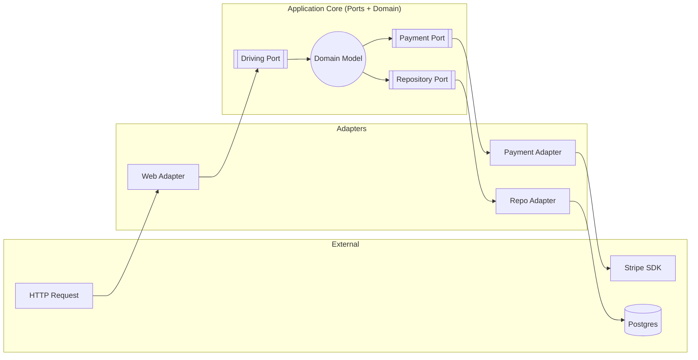
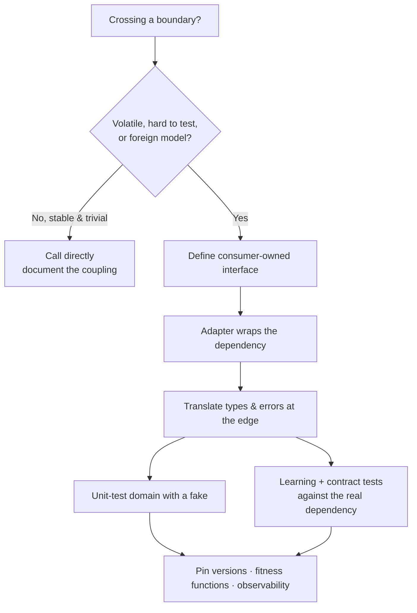

# Boundaries — Interview Questions

> 50+ questions on managing the seams between your code and code you don't own — third-party libraries, SDKs, web services, and even the standard library. Grouped Junior → Mid → Senior → Staff. Harder questions include *what the interviewer is really checking*. Use as self-review or interview prep.

---

## Table of Contents

- [Junior (15)](#junior-15-questions)
- [Mid (15)](#mid-15-questions)
- [Senior (13)](#senior-13-questions)
- [Staff (10)](#staff-10-questions)
- [Rapid-Fire](#rapid-fire)
- [Summary](#summary)
- [Further Reading](#further-reading)
- [Related Topics](#related-topics)

---

## Junior (15 questions)

### J1. What is a "boundary" in software?

<details><summary>Answer</summary>

The line where your code meets code you don't control — a third-party library, a vendor SDK, an external web service, a database driver, or the language's standard library. At that line you reconcile *their* model of the world with *yours*. Clean Code's "Boundaries" chapter is about keeping that line clean and keeping the number of crossings small.
</details>

### J2. Why wrap third-party code instead of calling it directly everywhere?

<details><summary>Answer</summary>

Three reasons:
1. **Localize change** — when the library's API changes or you swap libraries, only the wrapper changes, not 200 call sites.
2. **Speak your domain** — the wrapper exposes the subset of methods *you* need, named in *your* terms, not the library's.
3. **Insulate from surprises** — you decide how the library's errors, nulls, and edge cases map into your codebase.
</details>

### J3. What's the canonical example from *Clean Code* of a leaky boundary?

<details><summary>Answer</summary>

Passing a raw `Map` (`java.util.Map<String, Sensor>`) around the system. Every caller can `clear()` it, every caller depends on the full `Map` interface, and a future change to `Map` ripples everywhere. The fix is to wrap it inside a `Sensors` class that exposes only `getById(id)` — the methods the app actually needs.
</details>

### J4. What is a learning test?

<details><summary>Answer</summary>

A small automated test you write *against the third-party library itself* to confirm you understand how it behaves — not to test your own code. You write it while learning the API. As a bonus it becomes a regression guard: when you upgrade the dependency, the learning tests tell you whether its behavior changed.
</details>

### J5. Who pays to write learning tests, and why is it "free"?

<details><summary>Answer</summary>

You're going to learn the API anyway by experimenting. A learning test captures that experiment as runnable code instead of throwing it away. The cost is roughly the same as ad-hoc tinkering, but you keep the artifact — and it pays back at every future upgrade.
</details>

### J6. What does "mock what you own" mean?

<details><summary>Answer</summary>

Only create test doubles for *your own* interfaces, not for third-party classes. If you depend on a library, wrap it behind an interface you define, then mock that interface. Mocking the library directly couples your tests to assumptions about code you can't control.
</details>

### J7. What is the Adapter pattern, and how does it relate to boundaries?

<details><summary>Answer</summary>

Adapter converts one interface into another that the client expects. At a boundary, an adapter takes the third-party API and re-shapes it into *your* interface. Your code talks to the interface; the adapter does the translation. It's the most common concrete tool for wrapping a dependency.
</details>

### J8. What is the Facade pattern, and how does it differ from Adapter at a boundary?

<details><summary>Answer</summary>

A Facade provides one simplified interface over a *complex subsystem* of many classes. An Adapter re-shapes *one* interface into another. At a boundary you reach for a Facade when the library is a sprawling toolkit (e.g., an entire AWS SDK) and you want one small front door; you reach for an Adapter when you need to make one foreign interface fit one of yours.
</details>

### J9. What's wrong with returning a third-party type from your own public method?

<details><summary>Answer</summary>

You've leaked the dependency into your API. Now every caller transitively depends on that library, the library's type appears in your signatures, and you can't swap the library without breaking callers. Return *your* types from *your* boundaries.
</details>

### J10. Give an everyday example of a boundary you cross daily.

<details><summary>Answer</summary>

An HTTP client (`requests`, `axios`, `net/http`), a JSON parser, a database driver, a logging library, a payment SDK (Stripe), a cloud SDK (AWS, GCP), or a message-queue client (Kafka). Each is code you don't own and shouldn't scatter raw across your codebase.
</details>

### J11. If you wrap a library, where should the wrapper live?

<details><summary>Answer</summary>

In a dedicated, thin module/package at the edge of your architecture — often called an `infrastructure`, `adapters`, or `gateway` layer. The domain/business code depends on the *interface*; the adapter implementation depends on the library.
</details>

### J12. What's a "thin" wrapper versus a "fat" one?

<details><summary>Answer</summary>

A thin wrapper exposes nearly 1:1 the library's methods with little translation. A fat wrapper adds domain semantics, validation, retries, and type mapping. Thin wrappers are cheap but leak the library's shape; fat wrappers cost more but truly insulate. Choose based on how likely the library is to change and how foreign its model is.
</details>

### J13. Why is it risky to depend on the *latest* version of a dependency by default?

<details><summary>Answer</summary>

Unpinned versions (`^1.2.0`, `latest`) mean your build can pull in a new release with behavior changes or vulnerabilities without you choosing to. Pin versions and use a lockfile so builds are reproducible; upgrade deliberately.
</details>

### J14. What is a lockfile and why does it matter at boundaries?

<details><summary>Answer</summary>

A lockfile (`package-lock.json`, `go.sum`, `Cargo.lock`, `poetry.lock`) records the exact resolved version and hash of every transitive dependency. It makes builds reproducible and protects you from a boundary silently shifting under you between builds.
</details>

### J15. Should you write tests that hit a real third-party service over the network in your unit-test suite?

<details><summary>Answer</summary>

No. Network calls make unit tests slow, flaky, and dependent on an external system being up. Test your *adapter* against the real service in a separate, clearly-labeled integration suite; in unit tests, depend on your own interface and use a fake or mock.
</details>

---

## Mid (15 questions)

### M1. Walk me through wrapping a third-party SDK end to end.

<details><summary>Answer</summary>

1. **Define the interface you wish you had** — driven by what your domain needs (`PaymentGateway.charge(amount, card) -> Receipt`), not by the SDK.
2. **Write an adapter** implementing that interface using the SDK.
3. **Map types** — convert SDK request/response/error types into your domain types at the adapter edge.
4. **Inject the interface** into your domain code (dependency injection), never the concrete adapter.
5. **Learning/adapter tests** verify the adapter against the real SDK in an integration suite; unit tests use a fake of your interface.

The SDK now appears in exactly one file.
</details>

### M2. Why should the *consumer* define the boundary interface, not the provider?

<details><summary>Answer</summary>

This is the Dependency Inversion Principle. The interface should express what the client *needs* (the Interface Segregation "role"), not what the library *offers*. If the provider defines it, the interface mirrors the library and you've gained nothing — swapping the library still breaks the contract. Consumer-defined interfaces stay small and stable.

*What the interviewer is checking:* whether you understand that an abstraction owned by the wrong side is not an abstraction at all — it's just the library's API with extra steps.
</details>

### M3. Why is mocking a third-party type dangerous?

<details><summary>Answer</summary>

A mock encodes *your assumptions* about how the library behaves. If those assumptions are wrong, or the library changes them in an upgrade, your mock keeps passing while production breaks — the mock "lies." You never tested against reality. The fix: wrap the library, mock *your* interface (which you control and whose contract you guarantee with an adapter integration test).
</details>

### M4. What is contract testing, and what problem does it solve?

<details><summary>Answer</summary>

Contract testing verifies that a consumer and a provider agree on the shape of their interaction *without* running both together. The consumer records the requests it makes and responses it expects (a "contract"); the provider replays that contract against its real implementation to prove it satisfies every consumer. It catches integration breakages that unit tests with mocks miss — because both sides are checked against the *same* contract.
</details>

### M5. How does Pact implement consumer-driven contract testing?

<details><summary>Answer</summary>

In the consumer's test you stand up a Pact mock server, make the call, and assert expectations; Pact writes a *pact file* (JSON of interactions). That file is published to a Pact Broker. On the provider side, Pact replays each interaction against the real provider and verifies the responses match. If the provider changes incompatibly, provider verification fails — before deployment.

*What the interviewer is checking:* that you know mocks alone don't guarantee the two services actually fit, and that the contract is *consumer-driven* — providers can't ship a change that breaks a known consumer.
</details>

### M6. Contrast a stub, a mock, and a fake at a boundary.

<details><summary>Answer</summary>

- **Stub** — returns canned answers; no behavior verification.
- **Mock** — records calls and asserts they happened a certain way (interaction verification).
- **Fake** — a lightweight working implementation (in-memory DB, in-memory queue) honoring the same interface.

At boundaries, a **fake of your own interface** is often the best double: realistic, reusable, and not brittle the way over-specified mocks are.
</details>

### M7. What is the Ports and Adapters (Hexagonal) architecture?

<details><summary>Answer</summary>

Coined by Alistair Cockburn. The application core defines **ports** — interfaces for everything it talks to (driven ports like `PaymentGateway`, driving ports like `OrderService`). **Adapters** implement those ports for specific technologies (a Stripe adapter, a Postgres adapter, an HTTP-controller adapter). The core depends only on ports; technology lives entirely in adapters. Boundaries become explicit, swappable, and testable.


</details>

### M8. What is an anti-corruption layer (ACL)?

<details><summary>Answer</summary>

A DDD term (Eric Evans) for a translation layer between your bounded context and a foreign model (a legacy system, a partner API, another team's service). It maps the foreign model into your domain language so the foreign concepts and quirks never leak into your model. It's a boundary wrapper applied at the *domain-model* level rather than the single-class level.
</details>

### M9. How is an anti-corruption layer different from a simple adapter?

<details><summary>Answer</summary>

Scale and intent. An adapter typically re-shapes one interface. An ACL is a whole layer (facades + adapters + translators + sometimes its own model) that protects an entire bounded context from another model's concepts — different vocabulary, invariants, and consistency rules. ACL is the architectural-scale version of "don't let their model become your model."
</details>

### M10. When should you *not* wrap a dependency?

<details><summary>Answer</summary>

- **Stable, ubiquitous stdlib types** (`String`, `List`, `time.Time`, `Optional`) — wrapping adds noise and everyone already knows them.
- **Pure value/data libraries** with no behavior to swap.
- **Throwaway scripts / spikes** where insulation has no payoff.
- When the wrapper would be a pure pass-through with zero translation — that's ceremony, not abstraction.

The test: would wrapping ever let you swap or change something? If not, skip it.
</details>

### M11. Should you wrap the standard library? (trick)

<details><summary>Answer</summary>

Usually **no**. The stdlib is the one dependency that is *more* stable and better-known than your wrapper. Wrapping `List` or `time` adds a layer everyone must learn for zero swap-ability. Exceptions: when you genuinely need to constrain the API surface, or normalize platform differences, or gain testability — e.g., a `Clock` interface over `time.Now()` so tests can control time. Wrap for *control or testability*, never reflexively.

*What the interviewer is checking:* that "wrap third-party code" is a heuristic with a *reason* (change/insulation/testability), not a dogma you apply to everything.
</details>

### M12. Is mocking always good? (trick)

<details><summary>Answer</summary>

No. Over-mocking produces tests that assert *how* code is implemented rather than *what* it does, so they break on every refactor and pass even when the system is broken (the mock lied). Mock at architectural seams you own; prefer fakes for stateful collaborators; use real objects for cheap in-process dependencies. A test suite that's 90% mocks is testing the mocks.
</details>

### M13. Is an adapter always worth it? (trick)

<details><summary>Answer</summary>

No. An adapter costs an interface, an implementation, type-mapping, and indirection that every reader must trace. It pays off when the dependency is likely to change, is hard to test against, or has a foreign model. For a stable, simple, well-known dependency used in one place, a direct call is clearer. Abstractions you'll never exploit are liabilities.
</details>

### M14. How do you decide the *granularity* of a boundary interface?

<details><summary>Answer</summary>

Follow Interface Segregation: make the interface as small as the consumer's need. A reporting module that only reads users wants `UserReader.findById`, not a 30-method `UserRepository`. Narrow interfaces are easier to fake, mock, and swap, and they reveal the true coupling.
</details>

### M15. How do you keep two services from drifting apart without a shared library?

<details><summary>Answer</summary>

Schema + contract testing. Publish a versioned schema (OpenAPI, Protobuf, Avro, JSON Schema) as the source of truth, generate or validate both sides against it, and add consumer-driven contract tests (Pact) so the provider can't ship a breaking change unnoticed. A shared client *library* couples release cycles; a shared *contract* couples only the interface.
</details>

---

## Senior (13 questions)

### S1. Explain Hyrum's Law and its consequences at boundaries.

<details><summary>Answer</summary>

Hyrum's Law: *"With a sufficient number of users of an API, it does not matter what you promise in the contract: all observable behaviors of your system will be depended on by somebody."* Consequence: any observable detail — error message text, map iteration order, timing, undocumented fields — becomes a de-facto part of your contract. At boundaries this means (a) your wrapper should expose *only* what you intend to support, and (b) when you provide an API, hide incidental behavior aggressively or someone will couple to it.

*What the interviewer is checking:* whether you understand that the *documented* contract is not the *real* contract once an API has many users — which justifies narrow, deliberate boundary surfaces.
</details>

### S2. What is a leaky abstraction, and give a boundary example.

<details><summary>Answer</summary>

Joel Spolsky's Law of Leaky Abstractions: every non-trivial abstraction leaks details of the thing it abstracts. Examples: an ORM that hides SQL until you hit an N+1 query and must understand SQL anyway; a `Repository` that abstracts persistence until a transaction or a vendor-specific error forces the database back into view; a network filesystem that behaves like local until latency or a partition exposes it. The lesson isn't "don't abstract" — it's "know what your abstraction leaks and don't pretend it's perfect."
</details>

### S3. Your adapter wraps a library that throws library-specific exceptions. What should it do with them?

<details><summary>Answer</summary>

Translate them at the boundary. Catch the library's exceptions and re-throw your own domain/infrastructure exceptions (`PaymentDeclinedException`, `GatewayUnavailableException`), preserving the cause. If library exception types leak past the adapter, the dependency has leaked too — callers now catch `StripeException` and you can't swap providers.
</details>

### S4. How do learning tests and contract tests fit into CI for a critical dependency?

<details><summary>Answer</summary>

- **Learning/adapter integration tests** run against the real dependency (or a high-fidelity sandbox) on a schedule and on dependency-upgrade PRs — they catch behavior changes.
- **Contract tests** (provider verification) run in the provider's pipeline; consumer pact publication gates the consumer's pipeline.
- **Unit tests** use fakes of your own interfaces and run on every commit.

The split keeps the fast suite fast while still proving the boundary holds before release.
</details>

### S5. A vendor announces a breaking SDK change in 6 months. Your code calls it in 40 places. What's your plan?

<details><summary>Answer</summary>

1. Introduce a consumer-defined interface and an adapter; migrate the 40 call sites to the interface (mechanical, behavior-preserving — Strangler Fig).
2. Now the SDK is isolated in one adapter.
3. Add learning tests pinning current behavior.
4. Implement the new SDK behind the *same* interface in a second adapter; switch via config/feature flag.
5. Verify with contract/integration tests, roll out, delete the old adapter.

The boundary you should have had earlier turns a 40-site migration into a one-file swap.
</details>

### S6. How do you pin transitive dependencies, and why is the *transitive* part the dangerous one?

<details><summary>Answer</summary>

Direct deps are visible in your manifest; transitive deps are pulled by your deps and easy to ignore — yet a malicious or broken transitive package (supply-chain attack, e.g., event-stream; or breakage like left-pad) breaks you just as hard. Use lockfiles to pin the full resolved tree, enable hash verification, run an SCA scanner (Dependabot, Renovate, `npm audit`, `govulncheck`), and use explicit overrides / minimal-version selection for risky transitives.
</details>

### S7. When does a Facade over a boundary become a "god wrapper" smell?

<details><summary>Answer</summary>

When the facade grows to mirror the entire library (every method passed through), it stops simplifying and becomes a parallel API you also must maintain — with none of the swap-ability benefit because it's coupled 1:1. A facade should expose the *small* subset the application uses. If it has 80 methods, it's not a facade; it's the library with a new name.
</details>

### S8. How do ports & adapters interact with the testing pyramid?

<details><summary>Answer</summary>

Ports make the pyramid natural. The domain core, depending only on ports, is tested with fast unit tests using fakes — the broad base. Each adapter gets focused integration tests against its real technology — the middle. A few end-to-end tests exercise the whole hexagon — the thin top. Because technology is confined to adapters, the slow tests are confined too, so most of the suite stays fast.
</details>

### S9. The library's data model and yours disagree (different IDs, units, nullability). Where does reconciliation belong?

<details><summary>Answer</summary>

In the adapter / anti-corruption layer, never in the domain. The translator converts units, resolves ID schemes, normalizes nullable-vs-required, and rejects malformed foreign data at the edge. The domain receives only valid, domain-shaped objects. Letting the foreign model's quirks reach the core is exactly the corruption an ACL exists to prevent.
</details>

### S10. How do you test code against a third-party service that has no sandbox and side effects (e.g., sends real emails / charges cards)?

<details><summary>Answer</summary>

Layered: (1) unit tests against your interface with a fake; (2) adapter contract tests recorded once against the real API and replayed (VCR/cassette-style, e.g., `vcr`, `nock`, `go-vcr`) so you don't re-hit it; (3) a *small* number of gated smoke tests against the provider's test mode if one exists, run out of band — not on every commit. Never let a unit test trigger a real charge.
</details>

### S11. What's the relationship between boundaries and the Dependency Inversion / Stable Abstractions principle?

<details><summary>Answer</summary>

Boundaries are where dependency inversion earns its keep: the volatile detail (a third-party library) is forced to depend on a stable abstraction (your port) rather than the other way around. The arrow of dependency points *into* the abstraction from both sides. This keeps the stable core free of volatile details and lets the volatile periphery change without touching the core — the whole point of a clean boundary.
</details>

### S12. A teammate says "we don't need wrappers, the library is well-designed." How do you respond?

<details><summary>Answer</summary>

Library quality isn't the question — *coupling* and *change* are. A beautifully designed library still (a) appears in your signatures and leaks dependence, (b) can introduce breaking changes or CVEs on its schedule, and (c) is hard to fake in tests. The decision is risk-based: high churn / hard-to-test / many call sites argue for a wrapper; stable / trivial / single-call-site argue against. "It's well-designed" addresses none of those axes.
</details>

### S13. How do feature flags and adapters combine to make a dependency swap safe?

<details><summary>Answer</summary>

Implement both old and new behind the same port. A flag selects the adapter at runtime, enabling Branch by Abstraction: ship the new adapter dark, dial it up by percentage, compare results (shadow/dual-run), and roll back instantly by flipping the flag if metrics regress. The port guarantees both adapters are substitutable; the flag controls exposure. No long-lived migration branch is needed.
</details>

---

## Staff (10 questions)

### St1. How do you govern third-party boundaries across dozens of teams without becoming a bottleneck?

<details><summary>Answer</summary>

Establish guardrails, not gates: an approved-dependency list with an SCA pipeline (license + CVE scanning), a "golden path" template that bakes in adapter layering, automated dependency-update bots with required contract-test passes, and architecture fitness functions that fail CI when a banned third-party type appears outside the adapters package. Teams stay autonomous inside the guardrails; the platform team owns the guardrails, not the reviews.

*What the interviewer is checking:* whether you can scale a boundary discipline through tooling and policy instead of heroics and manual review.
</details>

### St2. Write an architecture fitness function that enforces "no third-party type leaks past the adapter layer."

<details><summary>Answer</summary>

In Java with ArchUnit:

```java
@ArchTest
static final ArchRule domain_must_not_depend_on_vendor =
    noClasses().that().resideInAPackage("..domain..")
        .should().dependOnClassesThat().resideInAnyPackage(
            "com.stripe..", "software.amazon.awssdk..");
```

Equivalents: Go's `go-arch-lint` / import-restriction linters, .NET's `NetArchTest`, JS/TS `dependency-cruiser` rules. Run it in CI; a leak fails the build at the moment it's introduced, not at the next audit.
</details>

### St3. How does Hyrum's Law change how you *deprecate* a public API you own?

<details><summary>Answer</summary>

Assume every observable behavior is depended on, so a "compatible" change may still break someone. Tactics: instrument the old surface to discover real usage before removing anything; provide migration tooling and a long deprecation window; use versioned endpoints / parallel APIs; and when you must change incidental behavior, do it behind a flag with a measured rollout. The cost of a clean boundary on the *provider* side is permanent vigilance about what you expose.
</details>

### St4. Two bounded contexts must integrate; one is a legacy mainframe. Design the boundary.

<details><summary>Answer</summary>

An anti-corruption layer as its own deployable: a facade exposing your domain operations, translators mapping mainframe records (fixed-width, EBCDIC, batch semantics) into your model, and an adapter handling transport (MQ, file drop, CICS). Add idempotency and reconciliation because the mainframe is batch/eventually-consistent. The ACL absorbs all the impedance mismatch; both contexts keep their own clean model and evolve independently.
</details>

### St5. How do you decide between a *shared library* and a *contract* for cross-team integration?

<details><summary>Answer</summary>

Shared library: maximum reuse but couples release cycles, version-locks every consumer, and spreads one team's types into others' codebases (a giant shared boundary). Contract (schema + Pact): consumers stay independent, deploy on their own cadence, and own their own adapter; cost is duplicated mapping code. For organizationally independent teams, prefer the contract; reserve shared libraries for truly stable, foundational types owned by a platform team with strong SemVer discipline.
</details>

### St6. How do you measure whether your boundaries are healthy?

<details><summary>Answer</summary>

Signals: number of files importing a given vendor package (should trend to ~1 per dependency); fitness-function violations over time; mean time to complete a dependency upgrade or swap; flaky-test rate attributable to external services; CVE exposure window (time from advisory to patched). Healthy boundaries show up as cheap upgrades, isolated vendor imports, and a fast, stable test suite.
</details>

### St7. A "wrap everything" mandate has produced 200 trivial pass-through adapters. What's the failure mode and the fix?

<details><summary>Answer</summary>

Failure mode: abstraction without benefit — indirection that obscures behavior, doubles the code to read, and never actually enables a swap (each adapter is coupled 1:1 to its library). It's the inverse smell of leaking. Fix: collapse pass-through wrappers around stable, single-use, well-known dependencies back to direct calls; reserve adapters for dependencies that are volatile, hard to test, or have foreign models. The principle is risk-driven, not universal.
</details>

### St8. How do contracts and observability combine to catch boundary drift in production?

<details><summary>Answer</summary>

Contracts catch drift *before* deploy; observability catches it *after*, for the cases contracts miss (Hyrum's Law behaviors, partial provider rollouts, data-shape drift). Instrument adapters with metrics (error rate, latency, schema-validation failures) and structured logs of unexpected fields; alert on a spike in validation failures from a dependency. Together they form a before-and-after safety net around every external seam.
</details>

### St9. When is it correct to deliberately *couple* to a third-party type rather than wrap it?

<details><summary>Answer</summary>

When the type *is* effectively a standard and the cost of an abstraction exceeds its benefit: a ubiquitous value type (`UUID`, `BigDecimal`, `time.Time`), a protocol type that the whole industry shares, or a framework's core type that your entire app is built around (wrapping the web framework's `Request` everywhere is usually pointless). Coupling is a deliberate, documented decision based on stability and pervasiveness — not an accident.
</details>

### St10. How do you sequence a migration off a strategic vendor (e.g., one cloud provider's SDK) across a large codebase?

<details><summary>Answer</summary>

1. Introduce ports for each capability used (storage, queue, secrets) and migrate call sites to them (Strangler Fig), proving behavior with characterization + contract tests.
2. Confine the incumbent SDK to per-capability adapters.
3. Stand up new-vendor adapters behind the same ports; dual-run and compare under feature flags.
4. Migrate capability by capability, region by region, with instant flag rollback.
5. Decommission old adapters once metrics confirm parity.

The ports turn an existential rewrite into a sequence of reversible, independently shippable swaps.
</details>

---

## Rapid-Fire

| Question | Answer |
|---|---|
| Why wrap third-party code? | Localize change, speak your domain, insulate from surprises. |
| Who defines the boundary interface? | The **consumer** (Dependency Inversion). |
| Mock what you own or what you don't? | **What you own** — never third-party types. |
| Learning test tests whose code? | The **library's** — captures your understanding of it. |
| Adapter vs Facade? | Adapter re-shapes one interface; Facade simplifies a whole subsystem. |
| Best test double for a stateful collaborator? | A **fake** of your interface. |
| What does Pact verify? | That a provider satisfies its consumers' recorded contracts. |
| Ports & Adapters another name? | **Hexagonal** architecture. |
| ACL protects what? | Your domain model from a foreign model. |
| Wrap the standard library? | Usually **no** — only for control/testability (e.g., `Clock`). |
| Is mocking always good? | **No** — over-mocking tests implementation, mocks can lie. |
| Is an adapter always worth it? | **No** — only when change/testability/foreignness justify it. |
| Hyrum's Law in one line? | Every observable behavior becomes someone's de-facto contract. |
| Leaky abstraction? | Every non-trivial abstraction leaks the underlying details. |
| How to make builds reproducible at boundaries? | Pin versions + lockfile + hash verification. |
| Where do library exceptions get translated? | In the **adapter**, into your domain errors. |

---

## Summary

Boundaries are where your code touches code you don't own. The core discipline: **minimize the crossings and own the abstraction at each one.** Wrap dependencies behind a *consumer-defined* interface so the vendor's types, errors, and model never leak into your domain; isolate the vendor in a single adapter so a swap or upgrade is a one-file change. Use **learning tests** to pin a dependency's real behavior, **mock only what you own** (and prefer fakes), and use **contract testing** (Pact) so independent services can't drift apart. Architecturally this scales into **Ports & Adapters** and, at the model level, an **anti-corruption layer**.

The senior judgment is knowing when *not* to apply the rules: don't wrap the stable standard library, don't reflexively add adapters around trivial single-use dependencies, and don't over-mock. **Hyrum's Law** and **leaky abstractions** are the humbling truths — contracts are never fully captured and abstractions never fully hide — so pair clean boundaries with version pinning, fitness functions, and observability to catch drift before and after deploy.



---

## Further Reading

- Robert C. Martin, *Clean Code*, Ch. 8 "Boundaries."
- Eric Evans, *Domain-Driven Design* — Anti-Corruption Layer.
- Alistair Cockburn, "Hexagonal Architecture (Ports and Adapters)."
- Joel Spolsky, "The Law of Leaky Abstractions."
- Hyrum Wright, "Hyrum's Law" (hyrumslaw.com).
- Pact documentation — consumer-driven contract testing.
- Steve Freeman & Nat Pryce, *Growing Object-Oriented Software, Guided by Tests* — "mock roles, not objects."

---

## Related Topics

- [Boundaries — README](README.md)
- [Boundaries — Junior](junior.md)
- [Boundaries — Professional](professional.md)
- [Clean Code — Unit Tests](../08-unit-tests/README.md)
- [Clean Code — chapter index](../README.md)
- [Design Patterns](../../design-patterns/README.md)
- [Refactoring](../../refactoring/README.md)
