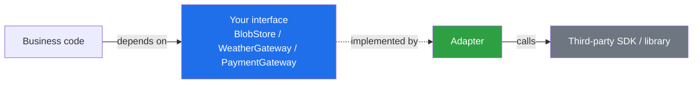
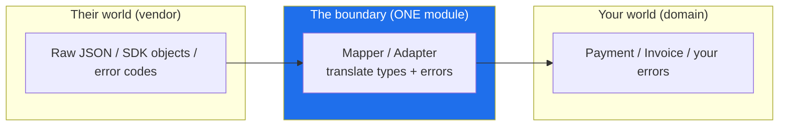

# Boundaries — Junior Level

> **Level:** Junior — "What's the rule? Show me a clean example."
> **Source:** Robert C. Martin, *Clean Code*, Chapter 8 — "Boundaries."

---

## Table of Contents

1. [What is a boundary?](#what-is-a-boundary)
2. [Real-world analogy](#real-world-analogy)
3. [Rule 1 — Wrap third-party code behind your own interface](#rule-1--wrap-third-party-code-behind-your-own-interface)
4. [Rule 2 — Don't let library types leak across your codebase](#rule-2--dont-let-library-types-leak-across-your-codebase)
5. [Rule 3 — Write a learning test for every new dependency](#rule-3--write-a-learning-test-for-every-new-dependency)
6. [Rule 4 — Define your own interface when the real one doesn't exist yet](#rule-4--define-your-own-interface-when-the-real-one-doesnt-exist-yet)
7. [Rule 5 — Keep boundary translation in one place](#rule-5--keep-boundary-translation-in-one-place)
8. [Common Mistakes](#common-mistakes)
9. [Test Yourself](#test-yourself)
10. [Cheat Sheet](#cheat-sheet)
11. [Summary](#summary)
12. [Further Reading](#further-reading)
13. [Related Topics](#related-topics)

---

## What is a boundary?

A **boundary** is the seam where *your* code meets code you don't own — a database driver, an HTTP client, a JSON library, a payment SDK, a cloud provider's API. On one side sits code you write and control. On the other sits code that someone else writes, versions, and can change without asking you.

The danger is that the two sides bleed into each other. When a vendor's types, method names, and quirks spread through hundreds of your files, you no longer own your codebase — the vendor does. Every time they rename a method, deprecate a class, or change behavior in a minor release, the damage radiates everywhere they touched.

This chapter is about keeping that seam **clean and narrow**. The core move is simple: put a thin layer of *your own* code between you and the third party, so the rest of your system depends on an abstraction *you* control — not on the vendor's API directly.

> **Key idea:** You will never fully control third-party code. What you *can* control is how much of it touches your code. Boundaries shrink that surface to a single, deliberate seam.

The five rules in this chapter:

| Rule | One-line version |
|---|---|
| **Wrap it** | Hide the library behind an interface you define (Adapter / Facade). |
| **Don't leak types** | Vendor types stop at the boundary; your domain types flow inside. |
| **Learning tests** | Write tests that prove you understand the library — and catch breaking upgrades. |
| **Define the interface first** | If the real API doesn't exist yet, invent the one you *wish* you had. |
| **One place to translate** | All conversion between "their world" and "your world" lives in one module. |

---

## Real-world analogy

### The wall socket

Your laptop charger does not plug directly into the power station 50 miles away. It plugs into a **wall socket** — a standardized boundary. Behind that socket, the utility company can switch from coal to solar, re-route the grid, or upgrade transformers. None of it reaches your laptop, because the socket's shape and voltage never change.

The socket is an **interface you depend on**. The power company is the **third party**. The wiring inside the wall is the **adapter** that translates the grid's messy reality into the clean two-or-three-prong contract your devices expect.

Now imagine the opposite: every appliance in your house is hard-wired directly to the street transformer, each with its own bespoke connection. The day the utility upgrades the transformer, you rewire your entire house. That is what a codebase looks like when a library leaks everywhere — no socket, just a thousand soldered joints.

### The interpreter

You're negotiating a deal in a country whose language you don't speak. You hire one **interpreter**. Every sentence you say goes through them; every sentence the other side says comes back through them. Your team only ever talks to the interpreter — never directly to the other side.

If the other side switches their representative, or starts using slang, *only the interpreter adapts*. Your team keeps speaking its own language. That single interpreter is your **boundary translation layer**: one place where two worlds meet and get translated.

---

## Rule 1 — Wrap third-party code behind your own interface

**The rule:** When you use an SDK or library, don't sprinkle its calls throughout your code. Define a small interface that describes what *your application* needs, then write one adapter that implements that interface using the library. The rest of your code talks to your interface, never to the vendor.

This is the **Adapter** pattern (and, for a cluster of vendor calls, the **Facade** pattern). Your interface is small and shaped around your needs; the vendor's API is large and shaped around theirs. The adapter bridges the two.

### Why it matters

- **Swappability:** changing vendors means rewriting one adapter, not the whole codebase.
- **Testability:** your code depends on an interface, so tests can substitute a fake. (See Rule 3 on *why you mock your own interface, not theirs*.)
- **Smaller surface:** your interface exposes only the 3 methods you use, not the vendor's 200.

### Go — define a small interface, accept it

In Go, the idiomatic move is to **define the interface where it's consumed** and accept it as a parameter. Keep it tiny — only the methods you actually call.

```go
// Dirty: every caller reaches straight into the AWS S3 SDK.
func SaveAvatar(client *s3.Client, userID string, data []byte) error {
    _, err := client.PutObject(context.TODO(), &s3.PutObjectInput{
        Bucket: aws.String("avatars"),
        Key:    aws.String(userID + ".png"),
        Body:   bytes.NewReader(data),
    })
    return err
}
// s3.Client, s3.PutObjectInput, aws.String now appear in every file that stores anything.
```

```go
// Clean: define the interface YOU need.
type BlobStore interface {
    Put(ctx context.Context, key string, data []byte) error
    Get(ctx context.Context, key string) ([]byte, error)
}

// One adapter wraps the SDK. This is the ONLY file that imports the S3 SDK.
type S3Store struct {
    client *s3.Client
    bucket string
}

func (s *S3Store) Put(ctx context.Context, key string, data []byte) error {
    _, err := s.client.PutObject(ctx, &s3.PutObjectInput{
        Bucket: aws.String(s.bucket),
        Key:    aws.String(key),
        Body:   bytes.NewReader(data),
    })
    return err
}

func (s *S3Store) Get(ctx context.Context, key string) ([]byte, error) { /* ... */ }

// Your code depends on BlobStore, not on s3.Client.
func SaveAvatar(store BlobStore, userID string, data []byte) error {
    return store.Put(context.Background(), userID+".png", data)
}
```

`SaveAvatar` no longer knows S3 exists. Swap in Google Cloud Storage by writing a `GCSStore` that satisfies `BlobStore` — `SaveAvatar` doesn't change a line.

### Java — wrap an HTTP client behind an interface

```java
// Dirty: business logic is welded to Apache HttpClient.
class WeatherService {
    public double currentTemp(String city) throws IOException {
        CloseableHttpClient client = HttpClients.createDefault();
        HttpGet get = new HttpGet("https://api.weather.com/v1?city=" + city);
        CloseableHttpResponse resp = client.execute(get);
        String body = EntityUtils.toString(resp.getEntity());
        return new JSONObject(body).getDouble("temp_c");
    }
}
// HttpClient, HttpGet, JSONObject leak into every service that calls an API.
```

```java
// Clean: an interface shaped around what we need.
interface WeatherGateway {
    double currentTempCelsius(String city);
}

// One adapter holds all the HttpClient/JSON details.
class HttpWeatherGateway implements WeatherGateway {
    private final HttpClient client;          // java.net.http
    private final ObjectMapper mapper;        // Jackson

    HttpWeatherGateway(HttpClient client, ObjectMapper mapper) {
        this.client = client;
        this.mapper = mapper;
    }

    @Override
    public double currentTempCelsius(String city) {
        var request = HttpRequest.newBuilder()
            .uri(URI.create("https://api.weather.com/v1?city=" + city))
            .build();
        try {
            var resp = client.send(request, HttpResponse.BodyHandlers.ofString());
            return mapper.readTree(resp.body()).get("temp_c").asDouble();
        } catch (IOException | InterruptedException e) {
            throw new WeatherUnavailableException(city, e); // our own exception
        }
    }
}

// Business code depends only on WeatherGateway.
class TripPlanner {
    private final WeatherGateway weather;
    TripPlanner(WeatherGateway weather) { this.weather = weather; }

    boolean isGoodForHiking(String city) {
        return weather.currentTempCelsius(city) > 15;
    }
}
```

`TripPlanner` knows nothing about HTTP, JSON, or which library does the work. The choice of HTTP client and JSON parser is now an implementation detail behind one class.

### Python — a thin adapter around a library

```python
# Dirty: the `stripe` SDK is called directly from order logic.
import stripe

def charge_order(order):
    stripe.api_key = "sk_live_..."
    charge = stripe.Charge.create(
        amount=int(order.total * 100),
        currency="usd",
        source=order.token,
    )
    order.charge_id = charge.id          # stripe's object shape leaks into Order
    return charge.status == "succeeded"
```

```python
# Clean: a Protocol describing what WE need, plus a thin adapter.
from typing import Protocol
from dataclasses import dataclass

@dataclass(frozen=True)
class PaymentResult:
    reference: str
    succeeded: bool

class PaymentGateway(Protocol):
    def charge(self, amount_cents: int, currency: str, token: str) -> PaymentResult: ...

class StripeGateway:
    """The ONLY module that imports stripe."""
    def __init__(self, client):           # inject the stripe module/client
        self._client = client

    def charge(self, amount_cents: int, currency: str, token: str) -> PaymentResult:
        charge = self._client.Charge.create(
            amount=amount_cents, currency=currency, source=token,
        )
        return PaymentResult(reference=charge.id, succeeded=charge.status == "succeeded")

# Order logic depends on the Protocol, not on stripe.
def charge_order(order, gateway: PaymentGateway) -> bool:
    result = gateway.charge(int(order.total * 100), "usd", order.token)
    order.charge_id = result.reference
    return result.succeeded
```

`charge_order` now reads in your domain's vocabulary — `amount_cents`, `PaymentResult` — and Stripe lives behind one wall.



The arrows that matter point *into* your interface. The vendor sits at the far right, reachable only through the adapter.

---

## Rule 2 — Don't let library types leak across your codebase

**The rule:** A third-party type (`stripe.Charge`, `s3.PutObjectInput`, an ORM `Row`, a `JSONObject`) should not appear in your function signatures, your domain models, or your business logic. Convert it to *your own* type at the boundary and pass *that* inward.

A leaked type is a hidden dependency. If `stripe.Charge` is a parameter or return value in fifty functions, then fifty functions depend on Stripe — even the ones that "just do business logic." The compiler (or your import statements) will tell the truth: search for the vendor's package name and count the files. Every hit is a place the vendor reaches.

### Why it matters

- **Blast radius:** a leaked type means a vendor change ripples through every file that names it.
- **Honesty:** your domain model should describe *your* domain, not Stripe's database schema.
- **Independence:** code that imports no vendor packages can be tested and reasoned about in isolation.

### Go

```go
// Dirty: the SDK's request/response types flow through your domain.
func PriceFromInvoice(inv *stripe.Invoice) Money { ... }  // domain depends on stripe
func RenderReceipt(charge *stripe.Charge) string { ... }  // and again
```

```go
// Clean: translate at the boundary; pass your own types inward.
type Payment struct {       // YOUR type
    Reference string
    Amount    Money
    Succeeded bool
}

// Conversion happens once, in the adapter.
func toPayment(c *stripe.Charge) Payment {
    return Payment{Reference: c.ID, Amount: Money(c.Amount), Succeeded: c.Status == "succeeded"}
}

func RenderReceipt(p Payment) string { ... }  // depends on nothing third-party
```

### Java

```java
// Dirty: Jackson's JsonNode is a parameter to business code.
BigDecimal extractTotal(JsonNode invoiceJson) { ... }   // business logic now needs Jackson
```

```java
// Clean: parse into your own record at the boundary.
record Invoice(String id, BigDecimal total, List<LineItem> lines) {}

// Adapter turns JsonNode -> Invoice (once). Everything else takes Invoice.
BigDecimal extractTotal(Invoice invoice) { return invoice.total(); }
```

### Python

```python
# Dirty: a SQLAlchemy Row object is returned to the service layer.
def get_user(session) -> Row:        # service layer now knows about SQLAlchemy rows
    return session.execute(select(users).where(...)).one()

# Clean: map the row to your own dataclass inside the repository.
@dataclass(frozen=True)
class User:
    id: int
    email: str

def get_user(session) -> User:
    row = session.execute(select(users).where(...)).one()
    return User(id=row.id, email=row.email)   # translate here, return YOUR type
```

> **A quick litmus test:** grep your codebase for the vendor's import name (`import stripe`, `software.amazon.awssdk`, `com.fasterxml.jackson`). If it appears outside the adapter/repository folder, a type has probably leaked.

---

## Rule 3 — Write a learning test for every new dependency

**The rule:** Before you wire a new library into your app, write small tests that call *the real library* the way you intend to use it. These **learning tests** verify your understanding — and, kept in the suite, they re-run on every upgrade and fail loudly when the vendor changes behavior.

You're going to spend time learning a new library anyway: reading docs, poking it in a REPL, running throwaway snippets. A learning test captures that exploration as code you keep. The cost is nearly free; the payoff is a built-in tripwire for breaking changes.

### Why it matters

- **You learn faster:** experiments that assert their results clarify the API better than docs alone.
- **Upgrades are safer:** when you bump the version, the learning tests tell you what changed — *before* it surprises you in production.
- **Documentation:** the test is an executable example of "how we use this library."

### Java — a learning test for a JSON library

```java
// Not testing OUR code — testing our UNDERSTANDING of Jackson.
class JacksonLearningTest {
    private final ObjectMapper mapper = new ObjectMapper();

    @Test
    void unknownFieldsAreIgnoredByDefault() throws Exception {
        // We rely on this: APIs add fields; our parsing must not break.
        record Point(int x, int y) {}
        Point p = mapper.readValue("{\"x\":1,\"y\":2,\"z\":3}", Point.class);
        assertEquals(1, p.x());
        assertEquals(2, p.y());
        // If a Jackson upgrade made unknown fields throw, THIS test fails first.
    }

    @Test
    void missingFieldBecomesDefault() throws Exception {
        record Config(boolean enabled) {}
        Config c = mapper.readValue("{}", Config.class);
        assertFalse(c.enabled());   // our wrapper assumes false, not an exception
    }
}
```

### Python — a learning test for an HTTP library

```python
# Pin down the behavior of `requests` that our adapter depends on.
import requests

def test_raise_for_status_raises_on_404():
    # We rely on raise_for_status() to turn 4xx/5xx into exceptions.
    resp = requests.get("https://httpbin.org/status/404")
    with pytest.raises(requests.HTTPError):
        resp.raise_for_status()

def test_json_decoding_of_known_shape():
    resp = requests.get("https://httpbin.org/json")
    body = resp.json()
    assert "slideshow" in body   # if the library's .json() ever changes, we hear about it
```

### Go — a learning test for a library

```go
// Confirm an assumption about the library we wrap.
func TestUUID_IsRFC4122Version4(t *testing.T) {
    id := uuid.New()                  // github.com/google/uuid
    if id.Version() != 4 {
        t.Fatalf("expected v4 UUID, got v%d", id.Version())
    }
    if id.Variant() != uuid.RFC4122 {
        t.Fatalf("expected RFC4122 variant, got %v", id.Variant())
    }
    // Our wrapper assumes v4 randomness. If the library default changes, this fails.
}
```

> **The trap this avoids — "mocking what you don't own."** It is tempting to skip the real library and just mock it in your unit tests. But a mock encodes *your belief* about how the library behaves. If the real library changes, your mock keeps passing while production breaks — **the mock lies.** Learning tests exercise the real thing, so they catch the lie. The correct pattern: *wrap* the library (Rule 1), then mock *your wrapper* in unit tests, and keep a few learning tests against the real library.

---

## Rule 4 — Define your own interface when the real one doesn't exist yet

**The rule:** When you depend on something that isn't built yet — a teammate's service, a vendor API still in design, hardware not delivered — don't wait. Define the interface *you wish you had*, code your side against it, and fill in the real implementation later. This is "programming to an interface," applied across a boundary in time.

In *Clean Code*, Martin describes a team that needed a transmitter API that didn't exist. Rather than stall, they wrote the `Transmitter` interface they wanted, built the rest of the system on it, and slotted in a fake until the real API arrived. When it did, an adapter connected the two — no rework of the system that used it.

### Why it matters

- **No blocking:** your work proceeds in parallel with the dependency's development.
- **You design the ideal API:** the interface reflects what your code *needs*, not what the vendor happens to ship.
- **The fake is your test double:** the same interface that unblocks you also lets you test.

### Go

```go
// The real "fraud check" service isn't deployed yet.
// Define the interface WE want, code against it now.
type FraudChecker interface {
    Score(ctx context.Context, order Order) (riskScore float64, err error)
}

// A fake unblocks development and powers tests.
type AlwaysSafeFraudChecker struct{}

func (AlwaysSafeFraudChecker) Score(context.Context, Order) (float64, error) {
    return 0.0, nil
}

// Later: a real adapter that calls the service satisfies the SAME interface.
// type HTTPFraudChecker struct { ... }  // implements FraudChecker
```

### Java

```java
// The notifications platform is still being built by another team.
interface Notifier {
    void notify(UserId user, Message message);
}

// Stub it now so the checkout flow can be built and tested today.
class LoggingNotifier implements Notifier {
    @Override
    public void notify(UserId user, Message message) {
        System.out.println("[would notify] " + user + ": " + message.summary());
    }
}

// When the real platform ships: class PushNotifier implements Notifier { ... }
```

### Python

```python
from typing import Protocol

# The recommendation engine isn't ready; design the contract we want.
class Recommender(Protocol):
    def top_picks(self, user_id: int, limit: int) -> list[int]: ...

# A trivial fake keeps the storefront moving.
class PopularItemsRecommender:
    def __init__(self, popular_ids: list[int]):
        self._popular = popular_ids

    def top_picks(self, user_id: int, limit: int) -> list[int]:
        return self._popular[:limit]

# Later: a real MLRecommender implements the same Protocol.
```

> **The payoff:** when the real dependency arrives, you write *one* adapter to fit your interface. Nothing that consumes the interface changes — you designed the seam in advance.

---

## Rule 5 — Keep boundary translation in one place

**The rule:** All the conversion between "their world" and "your world" — parsing, mapping fields, translating error codes, adapting types — lives in **one module per boundary** (the adapter / repository / gateway). It must not be scattered across the call sites.

If three different files each parse the same vendor response a slightly different way, you have three subtly different interpretations of the same data, three places to update when the API changes, and three places for bugs to hide. One translation point means one source of truth.

### Why it matters

- **Single point of change:** the vendor renames a field → you edit one mapping function.
- **No drift:** every caller sees the data interpreted identically.
- **Errors get normalized:** vendor error codes become *your* error types in one spot, so the rest of your code handles one consistent error model (see [error handling](../06-error-handling/README.md)).

### Java — one translation point

```java
// Dirty: every caller re-parses and re-maps the vendor's response.
double a = new JSONObject(resp1).getJSONObject("data").getDouble("amount_usd");
// ... elsewhere ...
double b = new JSONObject(resp2).getJSONObject("data").optDouble("amount_usd", 0); // drifted!
```

```java
// Clean: one method owns the translation.
class PaymentResponseMapper {
    static Payment toPayment(String rawJson) {
        var data = new JSONObject(rawJson).getJSONObject("data");
        return new Payment(
            data.getString("id"),
            Money.ofUsd(data.getDouble("amount_usd")),
            "succeeded".equals(data.getString("status"))
        );
    }
}
// Every caller: Payment p = PaymentResponseMapper.toPayment(raw);
```

### Go

```go
// All mapping AND error translation in one adapter method.
func (s *StripeGateway) Charge(ctx context.Context, amount Money, token string) (Payment, error) {
    c, err := s.client.Charge(ctx, stripeChargeParams(amount, token))
    if err != nil {
        return Payment{}, translateError(err) // vendor error -> OUR error, here only
    }
    return toPayment(c), nil                   // vendor type -> OUR type, here only
}
```

### Python

```python
# One adapter method maps fields and normalizes errors. Callers see only PaymentResult.
class StripeGateway:
    def charge(self, amount_cents: int, currency: str, token: str) -> PaymentResult:
        try:
            c = self._client.Charge.create(amount=amount_cents, currency=currency, source=token)
        except self._client.error.CardError as e:
            raise PaymentDeclined(str(e)) from e        # their error -> our error, here only
        return PaymentResult(reference=c.id, succeeded=c.status == "succeeded")
```



---

## Common Mistakes

These are the anti-patterns this chapter exists to prevent. Learn to spot them in code review.

### 1. Leaking third-party types throughout the codebase

The single most common boundary failure. A vendor type appears as a parameter or return value far from the boundary, dragging the dependency along with it.

```python
# Smell: a service-layer function takes the ORM's raw row.
def calculate_discount(row) -> float:   # `row` is a SQLAlchemy Row — leaked
    ...
```
**Fix:** map to your own type at the repository, pass that inward (Rule 2).

### 2. No abstraction layer over an SDK or library

Business logic calls the SDK directly. There is no interface, no adapter — just `stripe.Charge.create(...)` sitting in the middle of order processing.

**Fix:** define a small interface shaped around your needs and one adapter that implements it (Rule 1). Even a one-method interface is worth it.

### 3. Mocking what you don't own

You mock the third-party library directly in unit tests. The mock asserts how *you think* the library behaves. When the real library changes, the mock keeps passing — and lies to you.

```python
# Smell: mocking stripe directly. If stripe changes, this test still passes.
mock_stripe.Charge.create.return_value = FakeCharge(status="succeeded")
```
**Fix:** wrap the library (Rule 1), mock *your wrapper* in unit tests, and keep a few **learning tests** (Rule 3) against the real library to catch its changes. Mock only what you own. See [mocking-strategies] in the unit-tests chapter ([../08-unit-tests/README.md](../08-unit-tests/README.md)).

### 4. Tight coupling to a specific library version

Code reaches into the library's internals or relies on undocumented behavior, so even a minor-version bump breaks you. Symptoms: importing from a library's `internal`/`impl` package, depending on the exact text of an error message, or pinning a version you're scared to ever change.

**Fix:** depend only on the library's *public, documented* surface, behind your adapter. Let learning tests verify the behaviors you actually rely on.

### 5. Skipping the learning test for a new dependency

A new library is wired in straight from a Stack Overflow snippet, with no test confirming you understand how it behaves at the edges (errors, nulls, empty input, unknown fields). The first surprise arrives in production.

**Fix:** spend 20 minutes writing learning tests (Rule 3). You were going to experiment anyway — keep the experiments as tests.

### 6. A "thick" adapter that does business logic

The opposite failure: the adapter grows business rules (discount calculation, validation policy) instead of staying a thin translator. Now your domain logic is trapped against the vendor again.

**Fix:** the adapter only *translates* (types, errors, protocol). Business decisions live in your domain, behind the interface.

---

## Test Yourself

<details>
<summary>1. What's the difference between depending on a library directly and depending on it through your own interface?</summary>

Depending directly means the vendor's types and method names appear throughout your code, so the vendor's changes ripple everywhere and your code can't be tested without the real library. Depending through your own interface means your code references only an abstraction *you* defined; the vendor lives behind one adapter. Vendor changes are confined to that adapter, and tests substitute a fake for the interface.
</details>

<details>
<summary>2. Why is "mocking what you don't own" dangerous?</summary>

A mock encodes *your assumption* about how the third party behaves. If that assumption is wrong, or the library changes in an upgrade, the mock keeps returning what you told it to — so your tests pass while production fails. The mock lies. The fix is to wrap the library and mock your own wrapper (whose behavior you control and verify), while learning tests exercise the real library to catch its changes.
</details>

<details>
<summary>3. What is a learning test, and what two jobs does it do?</summary>

A learning test calls the *real* third-party library the way you intend to use it and asserts the behavior you depend on. Job one: it teaches you the library (executable experiments beat docs). Job two: kept in the suite, it re-runs on every dependency upgrade and fails loudly if the vendor changes the behavior you rely on — an early warning before that change reaches production.
</details>

<details>
<summary>4. The payment API your team needs hasn't been built yet. What do you do?</summary>

Define the interface you *wish* you had — shaped around what your code needs — and write a fake implementation so the rest of the system can be built and tested today (Rule 4). When the real API ships, write one adapter that implements your interface using it. Nothing that consumes the interface has to change.
</details>

<details>
<summary>5. You see <code>JsonNode</code> as a parameter in a method deep in the pricing logic. What's wrong, and how do you fix it?</summary>

A third-party type (Jackson's `JsonNode`) has leaked out of the boundary into business logic, so the pricing code now depends on Jackson. Fix it by parsing the JSON into your own domain type (e.g., an `Invoice` record) *at the boundary*, and passing that domain type into the pricing logic. The pricing code should reference no vendor types.
</details>

<details>
<summary>6. Why keep all boundary translation in one module instead of converting at each call site?</summary>

One module means one source of truth for how the vendor's data maps to yours and how their errors map to yours. When the vendor renames a field or changes an error code, you edit one place. Scattered conversions drift apart (different defaults, different parsing), multiply the change cost, and create inconsistent interpretations of the same data.
</details>

<details>
<summary>7. Is a one-method interface over a library worth the effort?</summary>

Often, yes. Even a single-method interface gives you a swap point, a test seam (mock your wrapper), and a place to normalize errors and types. The cost is one small file; the benefit is that the rest of your code stops depending on the vendor. The exception is genuinely trivial, standard-library-stable utilities you'd never swap — but for any external SDK or networked service, wrap it.
</details>

---

## Cheat Sheet

| Situation | Do this |
|---|---|
| Using an SDK / library | Define a small interface for *your* needs; one adapter implements it (Rule 1). |
| A vendor type appears in business code | Convert it to your own type at the boundary; pass yours inward (Rule 2). |
| Adopting a new dependency | Write learning tests against the *real* library before wiring it in (Rule 3). |
| The dependency isn't built yet | Define the interface you wish you had; fake it now, adapt later (Rule 4). |
| Parsing / mapping a vendor response | Do it in one module; every caller uses that (Rule 5). |
| Writing a unit test that touches a library | Mock *your wrapper*, never the library you don't own. |
| Translating vendor errors | Map to your own error types in the adapter, once. |

**The mantra:** *Wrap it, don't leak it, learn it, fake it before it exists, translate it in one place.*

**Where the vendor's import name is allowed to appear:** the adapter / gateway / repository module — and nowhere else.

---

## Summary

A boundary is the seam between code you own and code you don't. Left unmanaged, a third party's types and quirks spread through your whole system, and you end up maintaining *their* design decisions.

The discipline is five small habits:

1. **Wrap** the library behind an interface you define (Adapter / Facade), so your code depends on your abstraction, not the vendor.
2. **Don't leak** the vendor's types past the boundary — translate to your own domain types and pass those inward.
3. **Write learning tests** against the real library to understand it and to catch breaking upgrades. Never mock what you don't own; mock your wrapper instead.
4. **Define the interface first** when the real dependency doesn't exist yet — code against the API you wish you had, and adapt the real one later.
5. **Keep all translation in one place**, so a vendor change is a one-file change.

Done well, boundaries make third-party code feel like part of your own design: small, named, swappable, and testable. The vendor can change; your code barely notices.

---

## Further Reading

- Robert C. Martin, *Clean Code* (2008), Chapter 8 — "Boundaries."
- Eric Evans, *Domain-Driven Design* (2003) — "Anticorruption Layer," the pattern for protecting your domain from another system's model.
- Gang of Four, *Design Patterns* (1994) — **Adapter** and **Facade**, the structural patterns underpinning Rule 1.
- Michael Feathers, *Working Effectively with Legacy Code* (2004) — seams and test doubles around hard-to-test dependencies.

---

## Related Topics

- [middle.md](middle.md) — Boundaries in real codebases: anticorruption layers, dependency inversion across module boundaries, and trade-offs.
- [senior.md](senior.md) — Architectural boundaries: ports and adapters (hexagonal architecture), versioning, and evolving a boundary under load.
- [Chapter README](../README.md) — the positive rules of this chapter.
- [Error Handling](../06-error-handling/README.md) — normalizing vendor errors into your own error model at the boundary.
- [Unit Tests](../08-unit-tests/README.md) — why you mock your own wrapper, not the library you don't own.
- [Abstraction and Information Hiding](../22-abstraction-and-information-hiding/README.md) — the broader principle a boundary applies: depend on abstractions, hide details.
- [Design Patterns](../../design-patterns/README.md) — Adapter and Facade in depth.
- [Refactoring](../../refactoring/README.md) — extracting an interface around an existing dependency.
- [Anti-Patterns](../../anti-patterns/README.md) — the failure modes (leaky abstractions, vendor lock-in) this chapter prevents.
