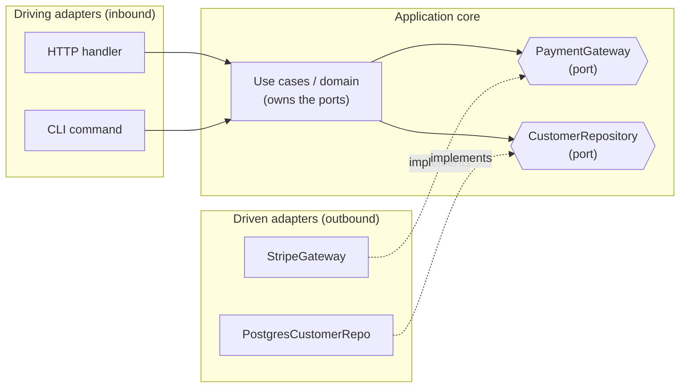

# Boundaries — Middle Level

> Focus: "Why?" and "When does it bend?" — the cost of wrapping, how thick the adapter should be, who owns the interface, and when leaking third-party types is the right call.

---

## Table of Contents

1. [What a boundary actually buys you](#what-a-boundary-actually-buys-you)
2. [When to wrap and when not to](#when-to-wrap-and-when-not-to)
3. [How thick should the adapter be?](#how-thick-should-the-adapter-be)
4. [Mapping library types to domain types at the seam](#mapping-library-types-to-domain-types-at-the-seam)
5. [Who defines the interface — dependency inversion at the boundary](#who-defines-the-interface--dependency-inversion-at-the-boundary)
6. [Ports & adapters: a first look at hexagonal architecture](#ports--adapters-a-first-look-at-hexagonal-architecture)
7. ["Mock what you own" and contract tests](#mock-what-you-own-and-contract-tests)
8. [Learning tests as upgrade guards in CI](#learning-tests-as-upgrade-guards-in-ci)
9. [When leakage is acceptable](#when-leakage-is-acceptable)
10. [Common Mistakes](#common-mistakes)
11. [Test Yourself](#test-yourself)
12. [Cheat Sheet](#cheat-sheet)
13. [Summary](#summary)
14. [Further Reading](#further-reading)
15. [Related Topics](#related-topics)

---

## What a boundary actually buys you

A boundary is the seam between **code you control** and **code you don't** — a vendor SDK, a network client, a third-party library, an OS API. The junior framing is "wrap external stuff so it's swappable." That is true but incomplete. The real returns are:

1. **A single point of change.** When the vendor renames `Client.Do()` to `Client.Execute()` in v3, you edit one adapter file, not 400 call sites.
2. **A vocabulary you own.** Your domain code speaks `Payment`, `Customer`, `Money` — not `StripeChargeObject` or `com.vendor.PaymentIntentResponseDTO`.
3. **A testing seam.** Your business logic depends on *your* interface, which you can fake in-process. You stop spinning up the real vendor to unit-test a discount calculation.
4. **A blast-radius limiter.** A breaking SDK upgrade detonates inside the adapter, where one focused test suite catches it — not scattered across the codebase where it surfaces as production incidents.

The cost is real too: an extra interface, an extra mapping layer, and the discipline to route every call through it. The middle-level skill is knowing **when that cost pays for itself** — which is the rest of this document.

---

## When to wrap and when not to

The instinct "wrap everything external" is wrong. Wrapping has a carrying cost: more types, more indirection, more code to read before you reach the logic. Wrap based on **volatility and ownership**, not on "is it from outside my package."

| Dependency | Wrap it? | Why |
|---|---|---|
| `time.Time` / `java.time.Instant` / `datetime` | **No** | Stable stdlib, designed by the language team, never breaking. A `MyTime` wrapper is pure friction. |
| `String`, `List`, `int`, slices, `dict` | **No** | Language primitives. Wrapping them is parody. |
| A payment SDK (Stripe, Adyen, Braintree) | **Yes** | Volatile vendor API, network-bound, breaking changes between majors, you want to fake it in tests. |
| An HTTP/gRPC client to another team's service | **Yes** | The contract is owned by someone else and changes on their schedule. |
| A logging facade (`slf4j`, `log/slog`) | **Usually no** | Already an abstraction; wrapping the wrapper adds nothing. |
| A serialization lib (Jackson, `encoding/json`, `pydantic`) | **Sometimes** | Wrap if it leaks annotations into domain types; otherwise leave it. |
| A mature, slow-moving OSS utility (Guava, lodash) | **No** | Low volatility, no network, trivially swappable if ever needed. |

The discriminating question: **"If this dependency makes a breaking change, where do I want the pain to land?"** If the honest answer is "I don't care, it never breaks and it's not in my tests' way," don't wrap. If it's "in one file I can fix in an hour," wrap.

> **Rule of thumb:** Stability is the deciding axis. Wrap the **volatile and externally-owned** (SDKs, vendor clients, other teams' services). Leave the **stable and language-owned** (`time.Time`, `String`, collections) bare. Wrapping a stable stdlib type is a smell of its own — over-abstraction.

---

## How thick should the adapter be?

This is the question that separates a useful boundary from a leaky or a bloated one. There are three thicknesses; pick by how much of the SDK you actually use.

### Thin (pass-through facade)

The adapter exposes nearly the same surface as the SDK, just behind your interface. Use when you genuinely need most of the SDK's features and the SDK's model already matches your domain.

**Risk:** if your interface returns the vendor's types, it isn't really a boundary — it's a leak with extra steps. A thin adapter must still translate *types*, even if it barely translates *behavior*.

### Medium (translating adapter) — the default

The adapter exposes only the operations your app needs, takes domain inputs, and returns domain outputs. The vendor types never escape. This is the right answer 80% of the time.

```go
// Port — what MY app needs. Defined by the consumer, in the domain package.
type PaymentGateway interface {
    Charge(ctx context.Context, c Charge) (Receipt, error)
}

// Domain types — owned by me, no vendor anything.
type Charge  struct { Amount Money; CustomerID CustomerID; IdempotencyKey string }
type Receipt struct { ID string; Status PaymentStatus }

// Adapter — the ONLY file that imports the vendor SDK.
type StripeGateway struct{ client *stripe.Client }

func (g *StripeGateway) Charge(ctx context.Context, c Charge) (Receipt, error) {
    pi, err := g.client.PaymentIntents.New(ctx, &stripe.PaymentIntentParams{
        Amount:   stripe.Int64(c.Amount.Cents()),
        Currency: stripe.String(c.Amount.Currency().Code()),
        Metadata: map[string]string{"customer": string(c.CustomerID)},
    })
    if err != nil {
        return Receipt{}, mapStripeError(err) // vendor error -> domain error
    }
    return Receipt{ID: pi.ID, Status: mapStatus(pi.Status)}, nil
}
```

### Thick (anti-corruption layer)

The adapter does real work: reshaping data models, reconciling differing concepts, enforcing invariants the vendor doesn't. Use when the vendor's model is *fundamentally different* from yours (Domain-Driven Design calls this an **anti-corruption layer**). Expensive — justify it.

> **Heuristic:** Make the adapter **exactly as thick as the conceptual distance** between the vendor's model and yours. Same model → thin/medium. Different model → thick ACL. Never thick "just in case."

---

## Mapping library types to domain types at the seam

The single most common boundary failure is letting the vendor's types leak past the adapter. Once `stripe.PaymentIntent` or `org.apache.http.HttpResponse` appears in a method signature three layers deep in your domain, the boundary is fiction.

The fix is an explicit **mapping function at the seam**. It is the membrane: vendor types go in, domain types come out, and nothing vendor-shaped crosses in the other direction.

```python
# Domain type — owned by us.
@dataclass(frozen=True)
class Customer:
    id: CustomerId
    email: Email
    tier: Tier

class CustomerRepository(Protocol):           # the PORT, defined by our domain
    def find(self, id: CustomerId) -> Customer | None: ...

# Adapter — the only module importing the vendor client.
class CrmCustomerRepository:
    def __init__(self, crm: VendorCrmClient) -> None:
        self._crm = crm

    def find(self, id: CustomerId) -> Customer | None:
        raw = self._crm.get_contact(str(id))   # vendor type: VendorContact
        if raw is None:
            return None
        return _to_domain(raw)                  # mapping at the seam

def _to_domain(raw: "VendorContact") -> Customer:
    return Customer(
        id=CustomerId(raw.contact_id),
        email=Email(raw.primary_email or raw.email),  # reconcile vendor quirks here
        tier=_TIER_MAP.get(raw.plan_code, Tier.FREE),  # vendor codes -> our enum
    )
```

Why a *function* and not inline mapping? Because the mapping is the thing most likely to break on upgrade, and the thing you most want to unit-test in isolation. Keep it pure, keep it small, name it clearly. The mapping table (`_TIER_MAP`, `mapStatus`, `mapStripeError`) is where vendor vocabulary dies and your vocabulary begins.

> **Tell-tale leak:** if your domain layer needs to `import stripe` / `import com.vendor.*` / `import github.com/vendor/sdk`, the type has leaked. The import statement is the cheapest leak detector you have — enforce it with an architecture test (`ArchUnit`, `import-linter`, `go-arch-lint`).

---

## Who defines the interface — dependency inversion at the boundary

Junior intuition: "the library provides an interface, I implement against it." That puts the arrow pointing **outward** — your domain depends on the vendor. Dependency inversion flips it: **the consumer defines the interface**, and the adapter implements it.

This matters because it changes *whose shape wins*. If the vendor defines the interface, your domain method takes whatever parameters the vendor finds convenient. If the consumer defines it, the interface lists exactly what the domain needs — no more, no less — in the domain's own vocabulary.

```java
// WRONG direction — domain depends on the vendor's interface and types.
class PricingService {
    PricingService(com.vendor.TaxApiClient client) { ... }  // vendor type leaks into domain
}

// RIGHT direction — domain declares the port it needs; adapter conforms.
package com.acme.pricing;            // domain package OWNS this interface
public interface TaxCalculator {     // named in OUR language, takes OUR types
    Money taxFor(Order order, Region region);
}

package com.acme.infra.vendor;       // infra package implements it
class VendorTaxCalculator implements TaxCalculator {
    private final com.vendor.TaxApiClient client;     // vendor lives here only
    public Money taxFor(Order order, Region region) {
        var resp = client.calculate(toVendorRequest(order, region));
        return Money.ofCents(resp.getTaxCents(), order.currency());
    }
}
```

The interface lives in the **domain package**; the implementation lives in the **infrastructure package**. The domain has zero compile-time knowledge of the vendor. This is the "D" in [SOLID](../../design-patterns/README.md) applied at the system's edge: high-level policy doesn't depend on low-level detail; both depend on an abstraction the policy owns.

> A practical test: **can you delete the vendor and still compile the domain?** If the domain package imports the vendor, the answer is no, and the interface is in the wrong place.

---

## Ports & adapters: a first look at hexagonal architecture

The pattern above generalizes. **Ports and adapters** (Alistair Cockburn's *hexagonal architecture*) names two roles:

- **Port** — an interface owned by the application core, expressing a capability it needs (*driven port*, e.g. `PaymentGateway`) or offers (*driving port*, e.g. a use-case API).
- **Adapter** — a concrete implementation that connects a port to a real technology: Stripe, Postgres, Kafka, an HTTP handler.

The core depends only on ports. Adapters depend on the core (to implement the port) and on the outside technology. Dependencies always point **inward**, toward the domain.



You do **not** need full hexagonal architecture in every project. For a small service, "interface in the domain package, adapter in the infra package, mapping function at the seam" *is* hexagonal architecture in miniature, and it's enough. The vocabulary (port/adapter/driving/driven) becomes worth its weight when the system grows enough to have several inbound and outbound technologies. See [`senior.md`](senior.md) for when to formalize it.

---

## "Mock what you own" and contract tests

The rule **"mock what you own, never mock what you don't"** is the most important testing consequence of boundaries.

Why is mocking a third party dangerous? A mock encodes *your belief* about how the dependency behaves. When the real API changes — a field is renamed, an error code changes, pagination semantics shift — your mock keeps returning the old, comfortable shape. **The mock passes; production fails.** The mock has become a lie you maintain.

So:

- **Mock your own port.** `PaymentGateway` is yours; fake it freely to unit-test the domain. The fake can't drift from reality because *you* define reality.
- **Don't mock the vendor's client.** Instead, test the adapter against the **real dependency** (or the vendor's official sandbox), via an integration or contract test.

A **contract test** pins the assumptions the adapter makes about the real dependency:

```python
# Integration test — runs against the vendor SANDBOX, gated to CI/nightly, not unit lane.
@pytest.mark.integration
def test_charge_adapter_against_real_stripe_sandbox():
    gateway = StripeGateway(stripe.Client(api_key=SANDBOX_KEY))
    receipt = gateway.charge(Charge(Money.usd(1000), CustomerId("cus_test"), key="idem-1"))
    assert receipt.status is PaymentStatus.SUCCEEDED   # our domain enum, mapped at the seam
```

The division of labor:

| Test | What it covers | Mocks? | Speed |
|---|---|---|---|
| Domain unit test | Business logic | Fakes **your port** | Fast (ms) |
| Adapter contract/integration test | Adapter ↔ real vendor | Nothing — real sandbox | Slow (network) |

This split is exactly why you built the boundary: the slow, flaky, network-bound tests collapse to *one small adapter suite*, while the bulk of your tests stay fast and deterministic against fakes of your own ports. More on the fake-vs-mock spectrum in [`../08-unit-tests/README.md`](../08-unit-tests/README.md).

---

## Learning tests as upgrade guards in CI

A **learning test** is a test you write *against the third party itself* to learn and then document how it behaves. You're not testing your code — you're testing your understanding of theirs.

```java
// Learning test: does the JSON lib parse a missing field as null or throw?
@Test
void vendorParser_treatsMissingFieldAsNull() {
    var result = VendorJson.parse("{}", Config.class);
    assertNull(result.getTimeout());   // documents: missing -> null, NOT a default
}
```

The payoff comes at **upgrade time**. When you bump the dependency from v2.4 to v3.0, you don't read the entire changelog hoping to spot what affects you — you **run the learning tests against the new version**. If `vendorParser_treatsMissingFieldAsNull` now fails because v3 throws on missing fields, CI tells you precisely which assumption broke, in seconds.

This converts dependency upgrades from "hope and pray, find out in production" into "run the suite, read the red." Wire it up:

- Keep learning tests in a tagged suite (`@Tag("learning")`, `// +build learning`, `@pytest.mark.learning`).
- Run them in CI on a **scheduled job** and on any **dependency-bump PR** (Dependabot/Renovate).
- A red learning test on a bump PR is the signal to read *that specific* section of the changelog and adjust the adapter.

> Learning tests + contract tests + "mock what you own" form a tripod: learning tests document the vendor's behavior, contract tests verify the adapter still matches it, and owning your ports keeps the rest of the suite fast and honest.

---

## When leakage is acceptable

Boundaries are an investment. Like any investment, sometimes the return doesn't justify it. Be honest about these cases instead of dogmatic:

- **Throwaway and one-off code.** A migration script that runs once, a scratch tool, a spike to validate an idea. Leaking the SDK type everywhere is fine — the code dies next week.
- **Internal tools with one consumer.** An ops dashboard used by three engineers, never shipped, never tested in isolation. The boundary's testing and blast-radius benefits don't apply.
- **The dependency *is* the product's core and is stable.** If you're building a thin wrapper *service* whose entire job is to expose one vendor, an extra abstraction is ceremony. Embrace the coupling you were paid to create.
- **Prototype / pre-product-market-fit.** Before you know the domain, premature ports calcify the wrong model. Leak now; extract the boundary once the domain stabilizes (the refactoring is mechanical — see [`../../refactoring/README.md`](../../refactoring/README.md)).

> **Honest distinction:** "leakage is acceptable here" is a real call for throwaway and single-consumer code. It is **not** a license for "the main payment path in our flagship service leaks Stripe types because wrapping was extra work." The test is lifespan × change-frequency × number of call sites. High on those axes → wrap. Low → leak and move on.

---

## Common Mistakes

1. **Wrapping stable stdlib types.** A `Clock` interface over `time.Time` is sometimes justified (testability of *time*), but a `MyString` over `String` or a `MyList` over `[]T` is pure over-abstraction. Wrap volatility, not familiarity.

2. **The leaky boundary.** Building an interface but having its methods *return the vendor's types*. `interface PaymentGateway { stripe.PaymentIntent charge(...) }` is not a boundary — it's a vendor import with a hat on. The return type must be a domain type.

3. **Mocking what you don't own.** Mocking the vendor's HTTP client in unit tests. The mock can't break when the vendor changes, so your tests stay green while production burns. Mock your port; integration-test the adapter.

4. **No learning test before adopting a dependency.** Adopting a library by reading the README and guessing edge-case behavior. Write a learning test; encode what you learned; let CI catch the day the behavior changes.

5. **The interface owned by the wrong layer.** Putting the port interface in the infrastructure package next to the adapter. Now the domain imports infra to reference the interface — the dependency arrow points the wrong way. The port belongs in the *domain*.

6. **Adapter thickness mismatch.** A thick anti-corruption layer over a dependency whose model already matches yours (wasted work), or a thin pass-through over a dependency whose model is wildly different (the impedance mismatch leaks into the domain anyway).

7. **Wrapping after the leak has spread.** Deciding to "add a boundary later," after `import stripe` already appears in 60 files. Extraction is now a project, not an afternoon. Decide volatility up front; for genuinely volatile vendors, wrap from the first call.

---

## Test Yourself

<details>
<summary>1. Should you wrap `java.time.Instant` / Go's `time.Time` behind your own interface?</summary>

Generally **no** — it's a stable, language-owned type that never makes breaking changes, so a wrapper is friction with no payoff. The one nuance: you might introduce a `Clock`/`Now()` *port* to make time **controllable in tests** (so you can freeze "now"). But note what that wraps — it wraps the *act of reading the current time*, returning a normal `time.Time`/`Instant`. You are not replacing the type itself with `MyTime`.
</details>

<details>
<summary>2. Why is "mock what you own" a consequence of having boundaries, not a separate rule?</summary>

Because the thing you *own* and can safely mock is the **port** — and ports only exist if you've drawn a boundary. Without a boundary, the only thing to mock is the vendor's client (which you don't own, so its mock lies). The boundary creates an owned interface; owning it is precisely what makes mocking safe. No boundary → nothing safe to mock.
</details>

<details>
<summary>3. Your adapter interface returns <code>List&lt;com.vendor.Record&gt;</code>. Is this a real boundary?</summary>

No. A boundary that leaks the vendor's types is cosmetic. Domain code that consumes the list now transitively depends on `com.vendor.Record`; a vendor change to that class ripples through every consumer, defeating the entire purpose. Fix: map `com.vendor.Record` → a domain type at the seam, and return `List<DomainRecord>`. The `import com.vendor.*` must not exist outside the adapter file.
</details>

<details>
<summary>4. Who should define the <code>PaymentGateway</code> interface — the Stripe adapter or the domain?</summary>

The **domain** (the consumer). Dependency inversion says the high-level policy owns the abstraction and the low-level detail conforms to it. If the adapter defines the interface, its shape is driven by Stripe's convenience and Stripe types leak in. If the domain defines it, the interface speaks the domain's language and lists exactly what the domain needs. Litmus test: you can delete the Stripe SDK and the domain still compiles.
</details>

<details>
<summary>5. How thick should an adapter over a vendor whose data model is almost identical to yours be?</summary>

**Thin to medium.** The adapter's job is mostly type translation (vendor type → domain type) plus exposing only the operations you use; it does little behavioral reshaping because the models already align. Reserve a **thick** anti-corruption layer for vendors whose model is conceptually distant from yours — building a thick ACL over an already-matching model is wasted effort and extra code to maintain.
</details>

<details>
<summary>6. A learning test that passed on v2 of a library fails after upgrading to v3. What does that tell you, and what do you do?</summary>

It tells you a **behavioral assumption your adapter relies on has changed** in v3 — precisely the kind of breaking change a changelog buries. You do *not* just "make the test green." You read the specific changelog entry, decide whether the new behavior is acceptable, and update the adapter (and the learning test) to match v3's reality. The failing test has done its job: it pinpointed the break before production did.
</details>

<details>
<summary>7. When is leaking a third-party type genuinely fine?</summary>

When the boundary's payoffs don't apply: throwaway/one-off scripts, internal tools with a single consumer, prototypes before the domain stabilizes, or a service whose explicit purpose is to be a thin wrapper around one vendor. The decision metric is lifespan × change-frequency × number of call sites — low on all three means leak and move on; high on any means wrap.
</details>

<details>
<summary>8. Why do contract/integration tests run against the real dependency (or its sandbox) rather than a mock?</summary>

Because their entire purpose is to verify that the adapter's assumptions still match **reality**. A mock would just confirm the adapter matches your *belief* about the vendor — which is exactly the belief that goes stale. Running against the real sandbox catches renamed fields, changed error codes, and shifted semantics. The trade-off (slow, network-bound, occasionally flaky) is acceptable because the boundary confines these tests to one small adapter suite instead of the whole codebase.
</details>

---

## Cheat Sheet

| Situation | Do |
|---|---|
| Stable stdlib type (`time.Time`, `String`, collections) | Don't wrap — use it directly |
| Volatile vendor SDK, network client, other team's service | Wrap behind a port you own |
| Vendor model matches yours | Thin/medium translating adapter |
| Vendor model conceptually distant | Thick anti-corruption layer |
| Returning data from the adapter | Map to a **domain type** at the seam; never return vendor types |
| Defining the port interface | In the **domain** package, in the domain's vocabulary |
| Implementing the port | In the **infra** package — the only place that imports the vendor |
| Unit-testing domain logic | **Mock/fake your own port** |
| Verifying the adapter | **Contract/integration test against the real vendor/sandbox** |
| Adopting or upgrading a dependency | Write/run **learning tests**; gate on dependency-bump PRs in CI |
| Throwaway/internal/prototype code | Leaking is acceptable — skip the boundary |

**One-line heuristics**
- Wrap **volatility and external ownership**, not "foreign-ness."
- The adapter is the **only** file allowed to import the vendor.
- The port lives where it's **consumed**, not where it's **implemented**.
- **Mock what you own; integration-test what you don't.**
- Learning tests turn upgrades from *hope* into *read the red*.

---

## Summary

A boundary is the membrane between code you own and code you don't, and its value is concrete: one point of change, your own vocabulary, a fast testing seam, and a contained blast radius on upgrades. The middle-level skill is judgment about **where** to draw it. Wrap dependencies that are **volatile and externally owned** — vendor SDKs, network clients, other teams' services — and leave **stable, language-owned** types like `time.Time` and `String` bare; wrapping those is over-abstraction. Size the adapter to the conceptual distance between the vendor's model and yours: thin/medium translation when they align, a thick anti-corruption layer only when they don't. At the seam, a mapping function converts vendor types into domain types so the vendor import never escapes the adapter. The consumer — your domain — **owns the port interface**; the infrastructure layer implements it, which is dependency inversion applied to the system's edge and the kernel of hexagonal architecture. Testing follows from the boundary: **mock what you own** (your ports, in fast unit tests), **integration-test what you don't** (the adapter against the real vendor or its sandbox), and keep **learning tests** as CI guards that catch breaking upgrades the moment a dependency bumps. Finally, be honest about when the investment doesn't pay: in throwaway scripts, single-consumer internal tools, and pre-stabilization prototypes, leaking is the pragmatic call.

---

## Further Reading

- Robert C. Martin, *Clean Code*, Chapter 8: "Boundaries" — learning tests, exploring third-party boundaries, `Map` example.
- Eric Evans, *Domain-Driven Design* — Anti-Corruption Layer pattern.
- Alistair Cockburn, "Hexagonal Architecture (Ports and Adapters)."
- Steve Freeman & Nat Pryce, *Growing Object-Oriented Software, Guided by Tests* — origin of "only mock types you own."
- J.B. Rainsberger, "Integrated Tests Are a Scam" — why contract tests beat broad integration tests.

---

## Related Topics

- [`junior.md`](junior.md) — the definitions: what a boundary, adapter, and learning test are.
- [`senior.md`](senior.md) — architectural enforcement, when to formalize hexagonal architecture, large-codebase boundary migration.
- [`../README.md`](../README.md) — the Boundaries chapter overview and positive rules.
- [`../08-unit-tests/README.md`](../08-unit-tests/README.md) — fakes vs. mocks, the testing seam ports create.
- [`../19-modules-and-packages/README.md`](../19-modules-and-packages/README.md) — package layout that keeps ports in the domain and adapters in infra.
- [`../../design-patterns/README.md`](../../design-patterns/README.md) — Adapter, Facade, and the Dependency Inversion Principle.
- [`../../refactoring/README.md`](../../refactoring/README.md) — extracting a boundary after a leak has already spread.
