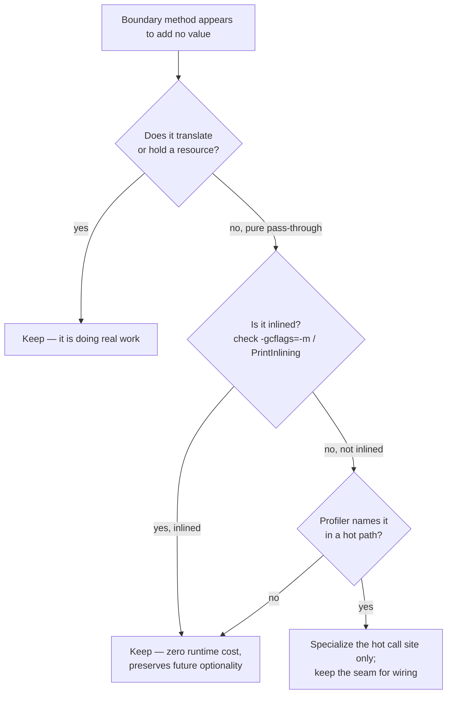

# Boundaries — Optimize & Reconcile

> A boundary is a seam — between your domain and a third-party library, between your service and the network, between your process and the kernel. Seams cost something: a copy, an allocation, a virtual dispatch, a syscall. This file is about paying that cost deliberately. The default answer is *keep the seam, optimize the mapping* — delete an abstraction to save nanoseconds only when a profiler names it. Each scenario gives a concrete cost, the measurement that exposes it, and a resolution that preserves the boundary's value while removing the waste.

---

## Table of Contents

1. [The adapter that allocates a domain object per call](#scenario-1--the-adapter-that-allocates-a-domain-object-per-call)
2. [Materializing a full mapped slice when the caller streams](#scenario-2--materializing-a-full-mapped-slice-when-the-caller-streams)
3. [Interface dispatch in a hot loop (Go)](#scenario-3--interface-dispatch-in-a-hot-loop-go)
4. [Megamorphic call site defeating the JIT (Java)](#scenario-4--megamorphic-call-site-defeating-the-jit-java)
5. [JSON marshalling cost at the serialization boundary](#scenario-5--json-marshalling-cost-at-the-serialization-boundary)
6. [Decoding the whole payload when you need three fields](#scenario-6--decoding-the-whole-payload-when-you-need-three-fields)
7. [A new HTTP client per call](#scenario-7--a-new-http-client-per-call)
8. [Opening a DB connection per request instead of pooling](#scenario-8--opening-a-db-connection-per-request-instead-of-pooling)
9. [The wrapper that copies a large buffer needlessly](#scenario-9--the-wrapper-that-copies-a-large-buffer-needlessly)
10. [Batching at the boundary to amortize round trips](#scenario-10--batching-at-the-boundary-to-amortize-round-trips)
11. [Caching translated results at the boundary](#scenario-11--caching-translated-results-at-the-boundary)
12. [The thin pass-through that earns its keep](#scenario-12--the-thin-pass-through-that-earns-its-keep)
13. [Protobuf re-encode on every fan-out write](#scenario-13--protobuf-re-encode-on-every-fan-out-write)

[Rules of Thumb](#rules-of-thumb) · [Related Topics](#related-topics)

---

### Scenario 1 — The adapter that allocates a domain object per call

You wrapped a payments SDK so the rest of the code never sees `Stripe.Charge`. The adapter maps the vendor type to a clean `Payment` domain record on every read.

```go
// Boundary adapter: vendor type -> domain type
func (a *StripeAdapter) Get(id string) (Payment, error) {
    ch, err := a.client.Charges.Get(id, nil) // *stripe.Charge
    if err != nil {
        return Payment{}, err
    }
    return Payment{
        ID:       ch.ID,
        Amount:   Money{Cents: ch.Amount, Currency: string(ch.Currency)},
        Status:   mapStatus(ch.Status),
        Customer: Customer{ID: ch.Customer.ID, Email: ch.Customer.Email},
    }, nil
}
```

This is correct and the right shape — the domain never imports `stripe`. The question is only whether the mapping itself is wasteful *when the workload demands it*.

<details><summary>Resolution</summary>

For a single network-bound `Get`, the mapping is free relative to the ~80 ms HTTP round trip. The allocation of one `Payment` struct (~120 ns) is 0.0001% of the call. **Do not touch it.** The seam is paying for itself in decoupling at zero observable cost.

The cost only matters when the mapping runs in a tight loop *without* I/O — e.g., re-mapping 1M cached vendor objects during a reconciliation batch:

```go
// 1M iterations, no I/O: now the mapping is the workload
for _, ch := range cachedCharges {
    payments = append(payments, mapCharge(ch)) // ~120 ns + escape to heap each
}
```

Measure with `go test -bench . -benchmem`. If `mapCharge` shows `4 allocs/op` because `Money`, `Customer`, and two strings escape, the fix is *not* to delete the adapter — it is to map into a preallocated, reused buffer and avoid per-field heap escapes:

```go
payments := make([]Payment, len(cachedCharges)) // one allocation total
for i, ch := range cachedCharges {
    mapChargeInto(&payments[i], ch) // writes fields in place, no escape
}
```

Principle: **keep the seam, optimize the mapping.** The adapter's job (isolating the vendor type) is unrelated to *how* the mapping allocates. You can make the translation zero-allocation without leaking `stripe.Charge` into the domain.
</details>

---

### Scenario 2 — Materializing a full mapped slice when the caller streams

The repository boundary returns `[]Order`, fully mapped from DB rows. The only caller sums a field and discards the rest.

```python
# Boundary: DB rows -> domain Orders, all materialized
def list_orders(self, customer_id: int) -> list[Order]:
    rows = self.db.execute("SELECT * FROM orders WHERE customer_id = %s", (customer_id,))
    return [self._row_to_order(r) for r in rows]  # maps ALL columns of ALL rows

# Only caller:
total = sum(o.amount_cents for o in repo.list_orders(cid))
```

For a customer with 500K orders, this builds 500K fully-hydrated `Order` objects (each ~600 bytes with nested `LineItem` lists) to read one integer field per object — roughly 300 MB of transient objects to compute one sum.

<details><summary>Resolution</summary>

Two independent fixes, both keep the boundary:

1. **Don't over-fetch at the seam.** If the caller needs only `amount_cents`, expose a narrower boundary method that maps less:

```python
def sum_order_amounts(self, customer_id: int) -> int:
    # push the aggregate to the DB; map nothing
    (total,) = self.db.execute(
        "SELECT COALESCE(SUM(amount_cents),0) FROM orders WHERE customer_id = %s",
        (customer_id,)).fetchone()
    return total
```

This is ~3 orders of magnitude cheaper: one row crosses the boundary instead of 500K objects.

2. **When the caller genuinely needs every object but processes them one at a time, stream instead of materialize.** Map lazily so peak memory is O(1), not O(N):

```python
def iter_orders(self, customer_id: int) -> Iterator[Order]:
    cur = self.db.execute("SELECT * FROM orders WHERE customer_id = %s", (customer_id,))
    for row in cur:                 # server-side cursor; rows arrive in batches
        yield self._row_to_order(row)  # map one at a time
```

Measurement: peak RSS drops from ~300 MB to a few MB; the per-object mapping cost is unchanged but is now overlapped with DB fetch latency. The seam (`Order` domain type, no SQL leaking to the caller) is intact. The lesson: **a boundary that materializes is a convenience, not a law** — offer a streaming variant when the access pattern is one-pass.
</details>

---

### Scenario 3 — Interface dispatch in a hot loop (Go)

A pricing engine depends on a `TaxStrategy` interface to keep the boundary between pricing logic and jurisdiction-specific rules. In production there is exactly one implementation, called 50M times per batch.

```go
type TaxStrategy interface {
    Rate(region string) float64
}

func priceAll(lines []Line, tax TaxStrategy) {
    for i := range lines {
        lines[i].Tax = lines[i].Subtotal * tax.Rate(lines[i].Region) // iface call
    }
}
```

Each `tax.Rate(...)` is an interface method call: a load of the itab, a load of the function pointer, then an indirect call. Indirect calls cannot be inlined and pressure the branch predictor's indirect-branch buffer.

<details><summary>Resolution</summary>

Measure first. On a modern CPU an interface dispatch is ~1–3 ns vs ~0.3 ns for a direct call; the *real* loss is missed inlining and constant-folding of `Rate`'s body. Benchmark both:

```
BenchmarkIface-8      50000000    2.4 ns/op
BenchmarkConcrete-8   50000000    0.5 ns/op   // tax computed via concrete type
```

If the loop is genuinely hot (the benchmark difference scaled to 50M iterations is 95 ms vs 25 ms per batch — a real 70 ms), the resolution is **not to delete the interface from the design**. Keep it at the seam where polymorphism is needed; specialize at the call site:

- **Hoist a concrete type for the hot loop.** If `priceAll` is only ever called with `*USTax`, accept the concrete type in the hot function and keep the interface for the wiring layer:

```go
func priceAllUS(lines []Line, tax *USTax) { // concrete -> inlinable
    for i := range lines {
        lines[i].Tax = lines[i].Subtotal * tax.Rate(lines[i].Region)
    }
}
```

- **Or hoist the work out of the loop.** If `Region` has few distinct values, resolve the rate once per region and index a map/array — the dispatch happens dozens of times, not 50M:

```go
rates := map[string]float64{}
for _, l := range lines {
    if _, ok := rates[l.Region]; !ok {
        rates[l.Region] = tax.Rate(l.Region) // dispatch once per region
    }
}
for i := range lines {
    lines[i].Tax = lines[i].Subtotal * rates[lines[i].Region]
}
```

Principle: **don't delete the abstraction to save nanoseconds unless measured.** The interface is the seam that lets you add `EUTax` next quarter; you preserve it for wiring and bypass it only in the proven hot path.
</details>

---

### Scenario 4 — Megamorphic call site defeating the JIT (Java)

A serialization boundary dispatches over a `Codec` interface. Early on there were 2 implementations; the call site was bimorphic and the JIT inlined both behind a type guard. Now there are nine codecs hitting the same site.

```java
interface Codec { byte[] encode(Object o); }

byte[] out = codec.encode(payload); // same bytecode index, 9 receiver types observed
```

Once a call site has seen more than two receiver types, HotSpot marks it **megamorphic**: it stops inlining and emits a full vtable lookup. The lost inlining can cost 5–20× on the encode path because the codec's tight serialization loop no longer fuses with the caller.

<details><summary>Resolution</summary>

Confirm with `-XX:+PrintInlining` (look for `not inlining ... megamorphic`) or `-XX:+UnlockDiagnosticVMOptions -XX:+PrintCompilation`. If confirmed and hot:

- **Split the call site.** Route by format *before* the hot dispatch so each site sees one or two types:

```java
byte[] out = switch (format) {
    case JSON  -> jsonCodec.encode(payload);   // monomorphic site
    case PROTO -> protoCodec.encode(payload);  // monomorphic site
    default    -> codec.encode(payload);
};
```

Each branch is its own bytecode index, so each is mono/bimorphic again and inlinable.

- **Or, if one format dominates traffic, give it a dedicated typed path** and leave the polymorphic `Codec` for the long tail. Microbenchmark with JMH; the encode loop for the hot format will re-inline and the throughput recovers.

The `Codec` abstraction stays — it is the boundary that lets you add a tenth format without touching callers. You only de-megamorphize the *site*, not the design. Note the symmetry with Scenario 3: in both, the seam is sound and the fix is local to the hot call site, not the architecture.
</details>

---

### Scenario 5 — JSON marshalling cost at the serialization boundary

An RPC handler decodes a request, does ~10 µs of work, and encodes a response. Under load (40K req/s) the service is CPU-bound and a flame graph shows 55% of CPU in `json.Marshal`/`json.Unmarshal`.

```go
func handle(w http.ResponseWriter, r *http.Request) {
    var req Request
    json.NewDecoder(r.Body).Decode(&req)   // reflection-based decode
    resp := process(req)
    json.NewEncoder(w).Encode(resp)        // reflection-based encode
}
```

Go's `encoding/json` walks the type with reflection on every call. For a 4 KB payload this is on the order of 8–15 µs per direction — comparable to or larger than the actual business logic.

<details><summary>Resolution</summary>

The boundary (JSON over HTTP, because clients require it) is non-negotiable. Optimize the marshalling, in order of effort:

1. **Reuse encoder/decoder buffers.** Avoid per-call allocation of scratch buffers with a `sync.Pool` of `bytes.Buffer`. Cuts allocations, ~10–20% throughput.

2. **Generate codec code instead of reflecting.** Drop in a code-generated marshaller (`easyjson`, `go-json`, or a generated `MarshalJSON`) for the hot types. Reflection-free encode/decode is typically **3–5× faster**:

```
encoding/json   12.4 µs/op   3712 B/op   42 allocs/op
go-json          3.1 µs/op    896 B/op    6 allocs/op
```

3. **Change the boundary format where you control both ends.** If a chatty internal hop uses JSON only by habit, switch that hop to Protobuf or msgpack — smaller on the wire and faster to (de)serialize. Keep JSON only at the public, client-facing edge.

Crucially the *shape* of the boundary is unchanged: handlers still take a `Request` struct and return a `Response`. You swapped the marshaller, not the seam. This is the marshalling analogue of Scenario 1 — optimize the translation, keep the boundary.
</details>

---

### Scenario 6 — Decoding the whole payload when you need three fields

A webhook receiver gets 30 KB events but only routes on `type` and `id`. It fully unmarshals every event into a 60-field struct before inspecting two of them.

```java
WebhookEvent ev = mapper.readValue(body, WebhookEvent.class); // parses all 60 fields
switch (ev.getType()) { ... }                                  // uses 2 fields
```

Full Jackson binding of a 30 KB document allocates the entire object graph (~5–8 µs and dozens of objects) when the routing decision needs 40 bytes of it.

<details><summary>Resolution</summary>

Use a streaming/partial parse at the boundary, then fully bind only the events you actually keep:

```java
// Pull-parse just enough to route; skip the rest of the tokens.
try (JsonParser p = factory.createParser(body)) {
    String type = null, id = null;
    while (p.nextToken() != null && (type == null || id == null)) {
        if ("type".equals(p.getCurrentName())) { p.nextToken(); type = p.getText(); }
        else if ("id".equals(p.getCurrentName())) { p.nextToken(); id = p.getText(); }
    }
    if (!shouldProcess(type)) return; // dropped 90% of traffic without full bind
}
WebhookEvent ev = mapper.readValue(body, WebhookEvent.class); // only for the 10% we keep
```

If 90% of events are dropped at the router, this turns 90% of the decode cost into a cheap token scan. Measure with JMH or an allocation profiler (`async-profiler -e alloc`): allocations on the drop path fall to near zero.

Equivalent moves elsewhere: Go's `json.RawMessage` to defer sub-document decoding; Protobuf's lazy fields. The principle is **decode at the granularity the decision needs** — the boundary still produces domain objects, but only for data that survives the gate.
</details>

---

### Scenario 7 — A new HTTP client per call

An adapter to a downstream geocoding service constructs a client inside each call. Looks tidy and self-contained.

```python
def geocode(self, address: str) -> LatLng:
    client = httpx.Client(timeout=2.0)   # NEW client (and connection pool) per call
    resp = client.get(self.url, params={"q": address})
    return self._to_latlng(resp.json())
```

A fresh client means a fresh connection pool: a new TCP handshake (1 RTT) plus a new TLS handshake (1–2 RTT) on every call. Against a service 30 ms away, that adds ~60–90 ms of pure handshake latency to a request whose useful work is one keep-alive-able GET.

<details><summary>Resolution</summary>

Create the client once and reuse it; let the boundary object hold the pool for its lifetime:

```python
class GeocodeAdapter:
    def __init__(self, url: str):
        self.url = url
        self._client = httpx.Client(timeout=2.0, limits=httpx.Limits(max_keepalive_connections=20))

    def geocode(self, address: str) -> LatLng:
        resp = self._client.get(self.url, params={"q": address}) # reuses keep-alive conn
        return self._to_latlng(resp.json())
```

Now the second and subsequent calls skip both handshakes: latency drops from ~90 ms to ~30 ms (one RTT for the request itself). At 1K req/s you also stop exhausting ephemeral ports and stop thrashing the TLS session cache.

This is universal: Go's `http.Client` (and its `Transport`) is designed to be **created once and shared** — its connection pool lives on the `Transport`; a per-call client defeats pooling entirely. Same for DB clients, gRPC channels, and SDK handles. **The boundary object owns the expensive resource; calls borrow from it.** See Scenario 8 for the database variant and the [connection-pooling] guidance for sizing.
</details>

---

### Scenario 8 — Opening a DB connection per request instead of pooling

A repository — the boundary between domain code and the database — opens and closes a connection inside each method.

```java
public Optional<User> findById(long id) {
    try (Connection c = DriverManager.getConnection(url, user, pass)) { // physical connect each call
        var ps = c.prepareStatement("SELECT * FROM users WHERE id = ?");
        ps.setLong(1, id);
        ...
    }
}
```

`DriverManager.getConnection` performs a full TCP connect plus the database's auth/handshake — for PostgreSQL that is several round trips and server-side backend startup, often **5–30 ms**, dwarfing a 0.2 ms indexed primary-key lookup.

<details><summary>Resolution</summary>

Put a pool (HikariCP) behind the boundary; the repository borrows a warm connection and returns it:

```java
// One pool for the process; sized to the DB, not the request rate.
private final DataSource ds; // HikariDataSource, e.g. maximumPoolSize = 2 * cores

public Optional<User> findById(long id) {
    try (Connection c = ds.getConnection()) {     // checkout from pool (~µs)
        var ps = c.prepareStatement("SELECT * FROM users WHERE id = ?");
        ps.setLong(1, id);
        ...
    } // returned to pool, not closed
}
```

Connection checkout from a warm pool is microseconds. End-to-end query latency falls from ~15 ms to ~0.3 ms and the database stops drowning in connection churn (each PostgreSQL backend is a process; thousands of connect/disconnect cycles per second is a self-inflicted outage).

The repository boundary is *exactly the right place* to own the pool: domain code stays ignorant of JDBC and pooling, while the seam centralizes the optimization. Sizing the pool is its own discipline — see the [connection-pooling] skill (more connections is not faster past `~(core_count * 2 + effective_spindles)`).
</details>

---

### Scenario 9 — The wrapper that copies a large buffer needlessly

A storage adapter wraps an object-store SDK. Its read method returns the body as a fresh `[]byte`, copying the SDK's buffer "to be safe" and to avoid leaking the SDK's reader type.

```go
func (s *Store) Read(key string) ([]byte, error) {
    obj, err := s.sdk.GetObject(key) // obj.Body is an io.ReadCloser
    if err != nil {
        return nil, err
    }
    defer obj.Body.Close()
    data, _ := io.ReadAll(obj.Body)        // copy #1: into a buffer
    out := make([]byte, len(data))         // copy #2: defensive copy
    copy(out, data)
    return out, nil
}
```

For 50 MB objects this does two full copies (100 MB of memmove) and double-peaks memory. The second copy guards against nothing — `data` is already freshly owned by this function.

<details><summary>Resolution</summary>

First, delete the gratuitous copy — `io.ReadAll` already returns a buffer this function owns:

```go
data, err := io.ReadAll(obj.Body) // single copy; safe to return
return data, err
```

That alone halves the bytes moved and the peak memory. But the deeper win is to **not materialize at all when the caller streams to a sink** (disk, HTTP response, hasher). Keep the seam by returning a `ReadCloser`, not a raw SDK type:

```go
// Boundary returns a generic stream, not the vendor's reader type.
func (s *Store) Open(key string) (io.ReadCloser, error) {
    obj, err := s.sdk.GetObject(key)
    if err != nil {
        return nil, err
    }
    return obj.Body, nil // caller io.Copy's it; zero full-buffer copies
}

// Caller:
rc, _ := store.Open(key)
defer rc.Close()
io.Copy(w, rc) // streams 50 MB through a 32 KB buffer
```

Peak memory drops from ~100 MB to ~32 KB and the large memmoves vanish. The abstraction is preserved — callers see `io.ReadCloser`, never the SDK's concrete type — but it no longer forces materialization. Offer `Read` (materialize) for small objects and `Open` (stream) for large ones, mirroring Scenario 2's materialize-vs-stream split.
</details>

---

### Scenario 10 — Batching at the boundary to amortize round trips

A notification service calls the email provider once per recipient. The boundary is clean (a `Mailer` interface) but the granularity is per-message.

```python
for user in recipients:           # 10,000 users
    self.mailer.send(user.email, subject, body)  # 1 HTTPS round trip each
```

10,000 sequential round trips at ~40 ms each is ~400 s of wall time, and 10,000 TLS-amortized requests against the provider's rate limits. The provider exposes a bulk endpoint that takes up to 1,000 recipients per call.

<details><summary>Resolution</summary>

Batch at the boundary; the domain still "sends to recipients," but the adapter coalesces:

```python
def send_bulk(self, recipients: list[str], subject: str, body: str) -> None:
    for chunk in batched(recipients, 1000):     # provider cap per call
        self._client.post(self.url, json={
            "to": list(chunk), "subject": subject, "body": body,
        })
```

10,000 messages become 10 round trips: ~400 s collapses to ~0.4 s. The batch size is bounded by the provider's documented limit, not guessed.

When no bulk endpoint exists, the equivalent is **bounded concurrency** at the boundary (a worker pool / semaphore) rather than fully sequential calls — e.g. 50 in-flight requests cuts wall time ~50× without overwhelming the downstream. Either way the seam absorbs the optimization: callers express intent ("notify these users"); the adapter chooses batching or concurrency. Pair with the [retry-pattern] for partial-batch failures. Caution: batching trades latency-per-item for throughput and adds partial-failure handling — only adopt it where the volume justifies the added complexity (cf. Scenario 13's reuse-the-encoding move).
</details>

---

### Scenario 11 — Caching translated results at the boundary

A currency-conversion adapter calls a rates API and maps the response to a domain `Rate`. Rates change at most once per minute, but the hot path requests them thousands of times per second.

```java
public Rate rateFor(String from, String to) {
    var resp = client.get("/rates?from=" + from + "&to=" + to); // network call EVERY time
    return toRate(resp);                                         // + mapping every time
}
```

Every conversion pays a full network round trip plus marshalling for data that is stable for ~60 s. At 5K req/s this is 5K wasteful API calls per second — latency, cost, and rate-limit pressure.

<details><summary>Resolution</summary>

Cache the *translated domain object* behind the boundary with a TTL matched to the data's volatility:

```java
private final LoadingCache<Pair<String,String>, Rate> cache = Caffeine.newBuilder()
    .expireAfterWrite(Duration.ofSeconds(30))   // < the 60s change cadence
    .maximumSize(10_000)
    .build(k -> toRate(client.get("/rates?from=" + k.a + "&to=" + k.b)));

public Rate rateFor(String from, String to) {
    return cache.get(Pair.of(from, to)); // network + mapping only on miss
}
```

Hit rate approaches 100% on a hot pair; the 5K req/s collapses to ~one upstream call per pair per 30 s. p99 latency for the conversion drops from ~40 ms (network) to ~200 ns (cache hit).

Cache the *mapped* `Rate`, not the raw JSON, so cache hits also skip the unmarshalling cost (the Scenario 5 problem). The boundary remains the single place that knows about the upstream API; correctness rests on choosing a TTL shorter than the data's change cadence and accepting staleness within it. For invalidation strategy and stampede protection, see the [caching-strategies] skill.
</details>

---

### Scenario 12 — The thin pass-through that earns its keep

A reviewer flags an adapter whose method "does nothing" — it just forwards to the SDK with no translation, and proposes deleting it to "save a layer."

```go
func (a *RedisCache) Get(ctx context.Context, key string) (string, error) {
    return a.client.Get(ctx, key).Result() // no mapping, no logic
}
```

The temptation is to call `client.Get` directly everywhere and remove the indirection — one fewer function call, one fewer file.

<details><summary>Resolution</summary>

**Keep the thin wrapper, but know exactly what it buys and what it costs.**

Cost: in Go a one-line forwarding method is almost always inlined by the compiler — verify with `go build -gcflags='-m'` (look for `can inline ... Get`). The runtime overhead is *zero* after inlining. In Java a forwarding method is trivially inlined by C2. So "save a layer" saves nothing measurable.

Benefit (why the seam stays): the wrapper is the single chokepoint where you can later add a timeout, a circuit breaker, metrics, key namespacing, or swap Redis for an in-memory fake in tests — without touching call sites. That optionality is the whole point of the boundary.

So the rule inverts the usual advice: **a thin pass-through is justified precisely because it is free.** You do not delete an abstraction to save nanoseconds that the compiler already eliminated. You would only collapse the layer if profiling proved the call is *not* inlined (e.g., it crosses an interface in a megamorphic hot site — Scenario 3/4) *and* it sits in a proven hot path. Absent that evidence, the seam stays.


</details>

---

### Scenario 13 — Protobuf re-encode on every fan-out write

An event publisher maps a domain event to a Protobuf message and writes it to N downstream topics, re-encoding the *same* message once per topic.

```go
func (p *Publisher) Publish(ev DomainEvent, topics []string) error {
    for _, topic := range topics {       // e.g. 8 topics
        msg := toProto(ev)               // build proto message: alloc
        b, err := proto.Marshal(msg)     // encode: alloc + CPU, IDENTICAL each loop
        if err != nil {
            return err
        }
        p.broker.Write(topic, b)
    }
    return nil
}
```

The mapping and the Protobuf encode are identical across all N topics, yet they run N times. For an 8-topic fan-out of a 2 KB event, that is 8× the encode CPU and 8× the transient allocations for a single logical event.

<details><summary>Resolution</summary>

Encode once at the boundary, then fan out the bytes:

```go
func (p *Publisher) Publish(ev DomainEvent, topics []string) error {
    b, err := proto.Marshal(toProto(ev)) // map + encode ONCE
    if err != nil {
        return err
    }
    for _, topic := range topics {
        if err := p.broker.Write(topic, b); err != nil { // reuse the same bytes
            return err
        }
    }
    return nil
}
```

CPU and allocations on the encode path drop by the fan-out factor (8× here). Verify with `-benchmem`: `allocs/op` falls because `toProto`/`Marshal` run once instead of eight times.

This is the boundary-level form of hoisting an invariant out of a loop: the *serialized representation* is the invariant. The seam is unchanged — `Publish(DomainEvent, topics)` — but the translation happens at the coarsest granularity that is still correct. The same reasoning powers HTTP response caching (encode the body once, serve many) and templated message rendering (Scenario 10's bulk send is the network-side twin). Caveat: this is only valid when the encoded bytes are truly identical per topic; if any topic needs per-topic fields, encode the shared prefix once and append the variant.
</details>

---

## Rules of Thumb

- **Keep the seam, optimize the mapping.** The decoupling value of an adapter is independent of how its translation allocates. Make the mapping zero-copy/zero-alloc before you ever consider leaking a vendor type.
- **Don't delete an abstraction to save nanoseconds unless a profiler named it.** Interface dispatch, a thin pass-through, a value-object map — these are usually inlined or dwarfed by I/O. Measure (`go test -bench -benchmem`, JMH, `async-profiler`, flame graphs) before you specialize.
- **Cost is relative to the call.** A 120 ns mapping is free next to an 80 ms HTTP call and expensive inside a 50M-iteration loop. The same code is fine in one boundary and a bottleneck in another.
- **Match the boundary's granularity to the access pattern.** Offer a streaming/iterating variant alongside the materializing one; decode only the fields a decision needs; expose narrow query methods so the seam maps less.
- **The boundary object owns expensive resources.** Connection pools, HTTP clients, gRPC channels, prepared statements — create once, reuse across calls. A resource constructed per call is the most common and most costly boundary mistake.
- **Amortize at the seam, not the caller.** Batch round trips, cache the *translated* result with a TTL matched to volatility, and encode-once-fan-out-many. Callers express intent; the adapter chooses the amortization.
- **Specialize the hot call site, not the architecture.** De-megamorphize a site, hoist a concrete type into a hot loop, cache a per-region rate — all local moves that leave the polymorphic seam intact for wiring and extension.
- **A thin pass-through is justified when it is free.** Inlined forwarding costs zero at runtime and preserves the chokepoint where timeouts, metrics, and test fakes will later live.
- **Optimization must not reintroduce a smell.** Single-pass fusions, manual buffer reuse, and bypassed abstractions are uglier; reach for them only with profiling evidence, exactly as you would resist a premature [code smell](../../refactoring/01-code-smells/01-bloaters/optimize.md) "fix."

---

## Related Topics

- [find-bug.md](find-bug.md) — boundary bugs: mocks that lie, leaked vendor types, version coupling.
- [professional.md](professional.md) — senior judgment on when a seam is worth its cost.
- [Chapter README](../README.md) — the positive rules of clean boundaries.
- [Abstraction and Information Hiding](../22-abstraction-and-information-hiding/README.md) — choosing what a seam exposes vs hides.
- [Design Patterns](../../design-patterns/README.md) — Adapter, Facade, Proxy: the structural patterns these seams are built from.
- [Bloaters — Optimize](../../refactoring/01-code-smells/01-bloaters/optimize.md) — the same "clean refactor with a measurable cost" discipline applied to code smells.

Skills worth pairing with this chapter: [connection-pooling], [caching-strategies], [retry-pattern], [profiling-techniques].
