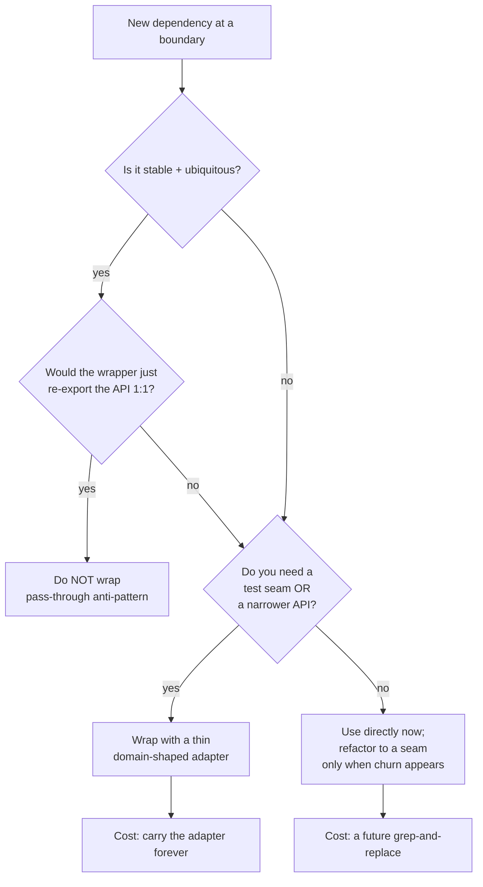
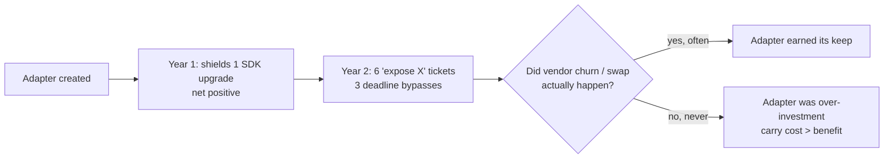

# Boundaries — Professional Level

> Focus: the economics of abstraction at the seam. When wrapping a dependency *earns its keep* and when it is dead weight; how Hyrum's Law and leaky abstractions limit boundary stability; designing seams for testability without over-mocking; and the long-term maintenance cost of an adapter layer.

---

## Table of Contents

1. [The economics of a boundary](#the-economics-of-a-boundary)
2. [The wrong-abstraction trap (Sandi Metz)](#the-wrong-abstraction-trap-sandi-metz)
3. [Hyrum's Law and boundary stability](#hyrums-law-and-boundary-stability)
4. [The Law of Leaky Abstractions (Spolsky)](#the-law-of-leaky-abstractions-spolsky)
5. [When NOT to wrap — the pass-through anti-pattern](#when-not-to-wrap--the-pass-through-anti-pattern)
6. [Designing seams for testability without over-mocking](#designing-seams-for-testability-without-over-mocking)
7. [SemVer's promises and limits](#semvers-promises-and-limits)
8. [API vs ABI boundaries](#api-vs-abi-boundaries)
9. [The maintenance cost of an adapter over time](#the-maintenance-cost-of-an-adapter-over-time)
10. [A case where wrapping was the wrong call](#a-case-where-wrapping-was-the-wrong-call)
11. [Common Mistakes](#common-mistakes)
12. [Test Yourself](#test-yourself)
13. [Cheat Sheet](#cheat-sheet)
14. [Summary](#summary)
15. [Further Reading](#further-reading)
16. [Related Topics](#related-topics)

---

## The economics of a boundary

A boundary is a deliberately narrow interface between *your* code and code you do not control — a third-party SDK, a database driver, an OS API, another team's service. Clean Code (Martin, ch. 8) frames the *positive* rule: keep third-party types from leaking through your system; convert at the edge. This page is about the *price* of that rule, because the rule is not free and applying it reflexively is a senior-level mistake.

Every boundary you introduce is a bet. The wrapper costs:

- **Upfront design time** — you must decide what subset of the dependency's surface to expose.
- **Ongoing translation** — every new feature of the dependency you want must be re-plumbed through your interface.
- **A permanent indirection** readers must trace through to understand what actually happens.

The wrapper pays off when:

- The dependency is **unstable** (frequent breaking changes) or **swappable** (you genuinely expect to change vendors).
- The dependency's API is **awkward, unsafe, or wider than you need**, and your wrapper narrows it to your domain's vocabulary.
- The boundary is a **natural test seam** for code you cannot otherwise drive cheaply.

The honest accounting is a present-value calculation: `wrap` wins when the discounted future cost of churn through an un-wrapped boundary exceeds the wrapper's build + carry cost. Most teams get this wrong in one direction — they wrap everything by habit (cargo-culting "hexagonal architecture") — and a few get it wrong the other way, leaking a fast-moving SDK into 200 call sites.



---

## The wrong-abstraction trap (Sandi Metz)

> "duplication is far cheaper than the wrong abstraction." — Sandi Metz, *The Wrong Abstraction* (2016, sandimetz.com)

Boundaries are abstractions, and Metz's law applies with full force. The failure mode is **premature wrapping**: you see a new dependency, you reflexively define an interface, and you guess at the shape your domain will need before you have two or three real call sites to triangulate from.

The cost asymmetry is the whole point:

- **Wrong wrapper, discovered late.** You committed to an interface (`PaymentGateway.charge(amount, currency)`) before you knew the domain needed idempotency keys, partial captures, and multi-currency settlement. Now every consumer codes to the wrong contract, and you cannot fix it without a coordinated migration across all of them. The abstraction has *trapped* the wrongness.
- **Duplicated direct calls, refactored later.** Three call sites talk to the Stripe SDK directly. When the pattern stabilizes, you extract the adapter from the *observed* usage — you have evidence, not guesses. The grep-and-replace is mechanical and local.

Metz's empirical observation: when a wrong abstraction has accreted callers, the path of least resistance is to add a parameter or a flag rather than back it out. That parameterization compounds. A boundary interface bristling with `options`, `mode`, and `legacy` flags is the archetype of a wrong abstraction nobody dared delete.

> **Practitioner rule:** prefer *leak-now, refactor-later* over *wrap-now, guess-the-shape*. Inline the dependency until the third concrete use case reveals the real seam. This is the boundary-specific form of "Rule of Three" (Fowler, *Refactoring*).

```python
# Premature wrapper, guessed before two real callers existed.
# It now lies about the domain: there is no "currency" concept yet,
# and the real need (idempotency) is missing.
class PaymentGateway:
    def charge(self, amount: int, currency: str) -> str: ...  # wrong shape, hard to change

# Leak-now alternative: use the SDK directly at the (single) call site.
import stripe
intent = stripe.PaymentIntent.create(
    amount=1999, currency="usd", idempotency_key=order.id,
)
# Extract an adapter only after 2-3 sites agree on the real shape.
```

---

## Hyrum's Law and boundary stability

> "With a sufficient number of users of an API, it does not matter what you promise in the contract: all observable behaviors of your system will be depended on by somebody." — Hyrum Wright (hyrumslaw.com), popularized in *Software Engineering at Google* (Winters, Manshreck, Wright, ch. 1).

This is the deep reason boundary stability is *harder than the documented contract suggests*. Your wrapper's public interface is not merely its method signatures — it is everything observable: error message text, iteration order, latency characteristics, the exact exception type, whether a list is mutable, log output, even timing-dependent flakiness that a downstream test learned to tolerate.

Implications for the engineer who *owns* a boundary:

- **You cannot make your wrapper a perfect shield.** If your adapter forwards the dependency's exception types, those types become part of *your* contract by Hyrum's Law, even if you never documented them. Translate them deliberately, or you have re-leaked the dependency through the back door.
- **The dependency's Hyrum surface is larger than its SemVer guarantees.** A library can bump a patch version, keep the documented API identical, and still break you because you depended on undocumented behavior. This is precisely the risk a thin adapter is supposed to contain — but only if the adapter *normalizes* the observable behavior, not just the signatures.
- **Defensive practice:** if you must rely on an observable-but-unpromised behavior of a dependency (e.g., that a Mongo cursor returns documents in insertion order on a single shard), pin it with a **characterization test** at the boundary. That test fails loudly when the dependency's hidden behavior shifts, converting a production incident into a CI failure.

The corollary for *your* exported interfaces (when your boundary is consumed by other teams): the more popular your wrapper, the less you can change it, regardless of your stated SemVer policy. Google's internal answer is large-scale automated refactoring (Rosie / `clang-tidy` codemods) precisely because Hyrum's Law makes manual deprecation impossible at scale.

---

## The Law of Leaky Abstractions (Spolsky)

> "All non-trivial abstractions, to some degree, are leaky." — Joel Spolsky, *The Law of Leaky Abstractions* (2002, joelonsoftware.com).

A boundary wrapper promises to hide the dependency. Spolsky's law says it can never fully succeed: the underlying reality leaks through whenever you hit an edge the abstraction didn't anticipate.

Concrete leaks every senior engineer has met:

- **An ORM hides SQL** — until you hit an N+1 query, a deadlock under a specific isolation level, or a query the ORM cannot express. Suddenly you must understand the SQL the abstraction generates.
- **A connection-pool wrapper hides sockets** — until a half-open TCP connection causes a 30-second hang that your domain interface has no vocabulary to express.
- **A retry-with-backoff adapter hides transient failures** — until non-idempotent operations get double-applied, and the leak is *correctness*, not performance.

The senior consequence is not "don't abstract." It is: **design the wrapper so the leak is observable and recoverable through the wrapper, not around it.** A boundary that forces consumers to reach past it (importing the raw SDK to handle the case the wrapper forgot) has the worst of both worlds — the cost of the wrapper *plus* the leak. Either widen the wrapper to cover the case, or accept that this dependency is too leaky to abstract and use it directly.

```go
// Leaky abstraction handled WELL: the wrapper exposes a typed,
// domain-meaningful signal for the leak (rate limiting) instead of
// forcing callers to import the vendor SDK to inspect raw errors.
type RateLimited struct{ RetryAfter time.Duration }

func (e *RateLimited) Error() string { return "downstream rate limited" }

func (c *Client) Fetch(ctx context.Context, id string) (Doc, error) {
    resp, err := c.sdk.Get(ctx, id)
    if err != nil {
        var apiErr *vendor.APIError
        if errors.As(err, &apiErr) && apiErr.StatusCode == 429 {
            // Translate the leak into OUR vocabulary; callers never touch vendor types.
            return Doc{}, &RateLimited{RetryAfter: apiErr.RetryAfter()}
        }
        return Doc{}, fmt.Errorf("fetch %s: %w", id, err)
    }
    return toDoc(resp), nil
}
```

---

## When NOT to wrap — the pass-through anti-pattern

The most common over-engineering at boundaries is the **1:1 pass-through wrapper**: an interface whose every method forwards verbatim to one method of the dependency, renaming nothing meaningful and narrowing nothing.

```java
// Pass-through anti-pattern: zero value added, permanent maintenance debt.
public interface JsonMapper {
    <T> T readValue(String content, Class<T> type) throws IOException;
    String writeValueAsString(Object value) throws JsonProcessingException;
}

public final class JacksonJsonMapper implements JsonMapper {
    private final ObjectMapper delegate = new ObjectMapper();
    public <T> T readValue(String c, Class<T> t) throws IOException {
        return delegate.readValue(c, t);     // identical signature, identical exception
    }
    public String writeValueAsString(Object v) throws JsonProcessingException {
        return delegate.writeValueAsString(v); // re-exporting Jackson's own exception type
    }
}
```

Why this is harmful, not harmless:

- **It re-leaks the dependency anyway.** The signatures and even the exception types (`JsonProcessingException`) are Jackson's. By Hyrum's Law, you've made Jackson part of your contract while paying for an abstraction that hides nothing.
- **It taxes every reader and every change.** A new serialization need means editing the interface, the impl, and (often) a test double — three edits to expose one method that already existed.
- **It gives false reassurance** that you "could swap Jackson." You can't, cheaply — the interface mirrors Jackson's shape, so Gson would not fit it without changes.

**Skip the wrapper when the dependency is stable and ubiquitous.** You don't wrap the standard library. You don't wrap `java.util.List`, Go's `encoding/json`, or Python's `datetime` — they are effectively part of the platform, their churn is near zero, and a wrapper would be pure pass-through. Martin's own caveat in *Clean Code*: the boundary discipline targets *volatile* third-party code, not the platform you've standardized on.

A useful litmus test: **if you can't name a method on your interface that does something the dependency's method doesn't — different name reflecting domain language, narrower contract, normalized errors, or removed capability — you are writing a pass-through, and you should delete it.**

---

## Designing seams for testability without over-mocking

A *seam* (Feathers, *Working Effectively with Legacy Code*) is "a place where you can alter behavior in your program without editing in that place." Boundaries are the highest-value seams because the thing on the far side — network, clock, filesystem, payment processor — is slow, non-deterministic, or has side effects you cannot trigger in a unit test.

But the seam invites a second-order mistake: **over-mocking**. This maps onto the two TDD schools:

| | London / mockist | Detroit / classicist (Chicago) |
|---|---|---|
| Origin | Freeman & Pryce, *Growing Object-Oriented Software, Guided by Tests* | Beck, *Test-Driven Development by Example* |
| Tests verify | *interactions* (which methods were called) | *state* (the resulting value) |
| Doubles | mock most collaborators | use real objects; double only the boundary |
| Coupling | tests couple to implementation structure | tests couple to behavior |
| Risk | brittle tests; "mocks lie" | slower; needs more setup |

The danger most relevant to boundaries: **never mock what you don't own** (GOOS, and Steve Freeman's "Mock Roles, Not Objects"). When you `mock(StripeClient.class)` and assert `verify(stripe).charge(1999, "usd")`, your test passes against your *belief* about Stripe's API. When Stripe changes the contract — renames a field, changes an error type, adds a required idempotency key — your mock keeps lying and your tests stay green while production breaks. The mock encodes a frozen, possibly-wrong model of a system you don't control.

The disciplined pattern:

1. **Own the seam.** Define a thin port (`PaymentGateway`) in *your* domain language. Mock *that*, because you own it and control its contract.
2. **Verify the adapter against reality** with an *integration / contract test* that exercises the real SDK against a sandbox or a recorded fixture (VCR-style, e.g. `vcrpy`, WireMock, or Stripe's test mode). This is the "learning test" Martin prescribes: a test that pins your understanding of the dependency *and* alarms you when an upgrade changes it.
3. **Don't over-specify.** Classicist style at the boundary means: assert the *result* your code produced from a fake/stub, not the precise call sequence to the vendor — unless the call sequence *is* the behavior under test (e.g., "we must send the idempotency key").

```python
# GOOD: mock the port we own; the adapter is verified separately by a learning test.
class FakePaymentGateway:
    def __init__(self): self.charges = []
    def charge(self, order_id, cents): self.charges.append((order_id, cents)); return "ch_fake"

def test_checkout_charges_total():
    gw = FakePaymentGateway()
    service = CheckoutService(gateway=gw)        # depends on OUR port, not StripeClient
    service.checkout(order_with_total(1999))
    assert gw.charges == [("ord_1", 1999)]       # state/outcome, not vendor call shape

# The learning/contract test (run separately, against Stripe test mode):
def test_stripe_adapter_charges_real_sandbox():
    adapter = StripePaymentGateway(api_key=TEST_KEY)
    cid = adapter.charge("ord_1", 1999)
    assert cid.startswith("ch_")                 # pins our understanding of the real API
```

> **Heuristic (Fowler, *Mocks Aren't Stubs*):** mock across architecturally significant boundaries you own; use real objects within a boundary. Mocking *outward* across an unowned boundary is the over-mocking smell.

---

## SemVer's promises and limits

Semantic Versioning (semver.org, Tom Preston-Werner) gives you `MAJOR.MINOR.PATCH`: MAJOR for breaking changes, MINOR for backward-compatible features, PATCH for backward-compatible fixes. Boundary stability planning *starts* with SemVer and must not *end* there.

What SemVer promises:

- A pinned major version (`^4.2.0` allows `4.x`, not `5.0`) should not break your documented usage.
- It gives you a vocabulary to express your tolerance for change in a lockfile.

What SemVer cannot deliver:

- **It does not protect against Hyrum's Law.** A patch release that keeps the documented API can still break code depending on undocumented behavior. SemVer constrains the *intended* contract; it says nothing about the *observed* one.
- **It relies on the maintainer's judgment** of what counts as "breaking." Maintainers routinely ship behavior changes as MINOR because they didn't consider your edge case. The empirical record (e.g., studies of npm) shows breaking changes leak into non-major releases regularly.
- **It is per-package, not per-graph.** Transitive dependencies and diamond conflicts ("dependency hell") are not solved by each package being well-behaved.

Boundary consequence: SemVer tells you *where the maintainer thinks the risk is*, which is exactly why a thin adapter plus a learning test is the belt-and-suspenders. The lockfile pins the version; the adapter localizes the change to one file; the contract test catches the Hyrum-Law breakage SemVer permits.

---

## API vs ABI boundaries

Most application engineers reason about boundaries at the **API** (Application Programming Interface) level — source-code compatibility. A different and stricter boundary exists below it: the **ABI** (Application Binary Interface) — binary compatibility of compiled artifacts (calling conventions, struct layout, symbol mangling, vtable layout).

Why it matters at boundaries:

- **Java** distinguishes *source* compatibility from *binary* compatibility (JLS ch. 13, "Binary Compatibility"). Adding a method to an interface is source-incompatible for implementers but, with a `default` method, binary-compatible for callers — pre-compiled callers keep linking. Removing a `public` field, changing a method's return type, or reordering enum constants breaks the ABI even if a re-compile would succeed. A library can be "SemVer-minor" at the API level and ABI-breaking for consumers who don't recompile.
- **Go** has no stable ABI between compiler versions — it deliberately requires recompilation from source, which is why the boundary is the *source* module graph and why plugins (`plugin` package) are notoriously fragile across versions.
- **Python** has the C-API ABI problem: native extensions compiled against one CPython ABI may not load on another. The **Stable ABI / Limited API** (PEP 384) exists precisely to give extension authors a narrow, durable binary boundary (`abi3` wheels) that survives across minor CPython releases.
- **C/C++** is the canonical case: changing a struct's field order or size changes its ABI; consumers linking the old layout read garbage. This is why shared libraries use SONAME versioning and why "header-only" or opaque-pointer (PIMPL) designs are deliberate ABI-boundary techniques.

Practical rule: when your wrapper is *distributed as a binary* (a shared library, a plugin, a published native wheel), the boundary is the ABI and your stability obligations are far stricter than SemVer-at-source implies. When it ships as recompiled-from-source, the API is the boundary and ABI concerns largely vanish.

---

## The maintenance cost of an adapter over time

The adapter you write today is a liability you carry until you delete the dependency. The carrying cost is rarely modeled, and it compounds:

- **Feature lag.** Every capability the dependency adds is unavailable through your wrapper until someone re-plumbs it. Teams develop a backlog of "expose X from the SDK through our port" tickets. The wrapper becomes a bottleneck on adopting the very library you chose for its features.
- **Drift toward leakage.** Under deadline pressure, engineers bypass the wrapper "just this once" to reach a SDK feature. Each bypass erodes the boundary until it shields nothing — you pay for the wrapper *and* have the leak.
- **The "two abstractions" tax.** Your wrapper has a model of the world; the SDK has its own. When they diverge (the SDK reorganizes its API in a major version), you must reconcile two mental models, not one. The wrapper that was supposed to *protect* you from the upgrade now *amplifies* it: you migrate the SDK *and* re-validate your translation layer.
- **Onboarding friction.** New engineers must learn both your port and the underlying SDK to debug anything, because Spolsky's law guarantees the SDK leaks through eventually.

The senior move is to **size the adapter to the volatility and swap-probability of the dependency, then revisit the decision.** A boundary is not a permanent architectural commitment; it is a hypothesis ("this dependency will churn or be swapped") that should be re-examined. If two years pass and you never swapped vendors and the API never broke you, the wrapper was probably over-investment — note it, and don't repeat the reflex on the next dependency.



---

## A case where wrapping was the wrong call

**Context.** A backend team standardized on PostgreSQL and used a mature, stable driver (e.g. `pgx` in Go / `psycopg` in Python / the JDBC `PreparedStatement` API in Java). Following a hexagonal-architecture template, they wrapped the driver behind a `Database` port with methods like `query(sql, args) -> Rows` and `exec(sql, args) -> int`.

**Why it was the wrong call.**

1. **Pass-through, not abstraction.** Every port method forwarded a SQL string and args to the driver and returned the driver's row type renamed. It hid nothing — SQL strings (the most database-specific thing imaginable) flowed straight through. The "we could swap to MySQL" justification was fiction: the SQL dialect, not the driver, is the lock-in, and the port carried the dialect unchanged.
2. **It leaked the very type it claimed to hide.** The port's `Rows` was a thin alias over `pgx.Rows`; consumers called driver-specific scanning semantics. By Hyrum's Law, `pgx`'s behavior was now the team's contract — through the wrapper.
3. **It blocked features.** When the team wanted `pgx`'s batch protocol and `COPY` for a 50× bulk-insert speedup, the port had no vocabulary for them. Adding it meant widening the port toward the driver's full surface — i.e., admitting the port should not have existed.
4. **It complicated testing without making it honest.** Tests mocked the `Database` port and asserted exact SQL strings — a textbook over-mock. The mocks passed while a real `JOIN` had a typo, because no test ran against a real Postgres. They had paid for a seam and still had no confidence.

**The better design.** Push the boundary *up* to the domain, not down to the driver. The right port is a `OrderRepository` with `save(order)` and `findOverdue()` — domain operations whose *implementation* uses the stable driver directly, with no intermediate `Database` interface. Repositories are tested with Testcontainers / a real Postgres in integration tests (a learning/contract test), and unit-tested domain logic depends on the repository port it owns. The stable, ubiquitous driver is used directly; the volatile thing (which SQL, which schema) lives behind a domain-meaningful seam. This is the difference between *wrapping a dependency* (often wrong) and *owning a domain port whose adapter happens to use that dependency* (usually right).

> Lesson: "wrap third-party code" is not the rule. The rule is "express the boundary in your domain's language and only abstract what is volatile." A pass-through over a stable driver violates both.

---

## Common Mistakes

- **Wrapping by reflex.** Defining a port for every dependency because a template said "hexagonal." Most stable, ubiquitous libraries should be used directly.
- **Pass-through interfaces.** A wrapper whose methods 1:1 mirror the dependency's signatures and re-export its exception types. It adds cost and hides nothing (and re-leaks via Hyrum's Law).
- **Mocking what you don't own.** Mocking the vendor SDK and asserting call shapes; the mock encodes a possibly-wrong model and stays green when the real API changes.
- **Guessing the abstraction's shape early.** Committing to a boundary interface before two or three real call sites exist — the wrong-abstraction trap. Prefer leak-now, refactor-later.
- **Assuming the wrapper is a perfect shield.** Forwarding the dependency's exception types / row types / iteration order makes them part of your contract anyway.
- **Trusting SemVer as a stability guarantee.** SemVer constrains intended contracts, not observed behavior; pair it with a lockfile + a characterization/contract test.
- **Confusing API and ABI obligations.** Shipping a binary artifact under SemVer-source rules; reordering a struct field is ABI-breaking even when source-compatible.
- **Reaching past the wrapper "just once."** Each bypass erodes the boundary until you pay for the wrapper *and* have the leak.

---

## Test Yourself

1. **A teammate proposes wrapping the standard JSON library behind a `Serializer` interface "for flexibility." The interface's two methods forward verbatim to the library. Is this a boundary worth having?**

<details><summary>Answer</summary>

No — it's the pass-through anti-pattern over a stable, ubiquitous dependency. The interface renames nothing, narrows nothing, and re-exports the library's exception types, so by Hyrum's Law the library is already your contract. You pay design + carry cost for zero shielding, and the "could swap libraries" claim is false because the interface mirrors this library's shape. Use the JSON library directly. Reserve boundaries for *volatile* dependencies or where the wrapper genuinely narrows/renames toward your domain.
</details>

2. **Your adapter forwards `vendor.APIError` to callers. SemVer says the next vendor release is a MINOR bump. Why might your consumers still break, and what guards against it?**

<details><summary>Answer</summary>

Hyrum's Law: consumers depend on the *observable* `APIError` (its fields, status codes, message text), which the vendor may change in a MINOR release without violating its documented contract. Because your adapter forwarded the vendor type, that observable behavior is now part of *your* contract. Guards: (a) translate vendor errors into your own domain error types at the boundary so the vendor type never escapes; (b) pin the behaviors you rely on with characterization/contract tests that run against the real vendor (test mode / recorded fixtures), turning a silent break into a CI failure.
</details>

3. **Distinguish the failure mode of mockist over-mocking at an unowned boundary from classicist testing at an owned port.**

<details><summary>Answer</summary>

Over-mocking at an *unowned* boundary means mocking the vendor SDK directly and asserting the exact calls/arguments you believe it expects. The mock is your frozen model of a system you don't control; when the vendor changes its contract the mock keeps lying and tests stay green while production breaks ("don't mock what you don't own," GOOS). Classicist testing at an *owned* port means you define a thin domain port, substitute a fake/stub of *that*, and assert the *resulting state/outcome* — not the vendor call shape. The vendor adapter is verified separately by a learning/contract test against the real dependency. You couple tests to behavior you own, not to an unowned implementation.
</details>

4. **Two years ago you wrapped a Postgres driver behind a generic `Database` port. You now want `COPY`-based bulk insert. Why does the wrapper hurt, and what should the boundary have been?**

<details><summary>Answer</summary>

The generic `Database` port has no vocabulary for `COPY`/batch — exposing it means widening the port toward the driver's full surface, which proves the port should never have existed. It was a pass-through over a stable, ubiquitous dependency that leaked SQL strings (the real lock-in) straight through. The right boundary is a *domain* port — e.g. `OrderRepository.save/findOverdue` — whose adapter uses the stable driver directly (including `COPY`), tested with a real Postgres (Testcontainers). Abstract the volatile thing (schema/SQL behind domain operations), not the stable driver.
</details>

5. **A library promises SemVer and ships a PATCH. Your build still breaks at link time, though a recompile fixes it. What boundary did it violate?**

<details><summary>Answer</summary>

The ABI, not the API. SemVer/source compatibility says a recompile from source would work — and it does. But your pre-compiled artifact linked against the old binary contract (calling convention, struct layout, symbol/vtable layout), which the PATCH changed. For binary-distributed dependencies (shared libraries, native extensions, plugins) the boundary is the ABI; tools like CPython's Limited API / `abi3` (PEP 384) or SONAME versioning exist precisely to make that binary boundary durable across releases.
</details>

6. **When is "leak now, refactor later" the *wrong* default, and you should wrap up front?**

<details><summary>Answer</summary>

When the dependency is known-volatile or genuinely swap-likely (an early-stage vendor, a service you're A/B-testing against a competitor), when leaking it would scatter across so many call sites that the future refactor is prohibitively large, or when the dependency's API is unsafe/awkward enough that a narrowing wrapper is correctness-critical (e.g., forcing idempotency keys). The Metz heuristic is about *premature* abstraction with unknown shape — if you already have strong evidence of the shape and the churn, wrapping up front is the cheaper bet.
</details>

---

## Cheat Sheet

| Decision | Rule of thumb |
|---|---|
| Wrap a stable, ubiquitous dependency (stdlib, mature driver)? | No — direct use; a wrapper would be pass-through. |
| Wrap a volatile or swap-likely dependency? | Yes — thin adapter in domain language. |
| Wrapper re-exports the dependency's signatures/exceptions 1:1? | Pass-through anti-pattern — delete it. |
| Define the boundary interface before real call sites exist? | No — leak now, extract on the 3rd use (Rule of Three / Metz). |
| Mock the vendor SDK directly in unit tests? | No — mock the port *you own*; contract-test the adapter against the real dependency. |
| Forward vendor exception/row types through the wrapper? | No — translate to domain types (Hyrum's Law makes forwarded types your contract). |
| Rely on SemVer alone for boundary stability? | No — pin a lockfile + characterization/contract test. |
| Ship the wrapper as a binary artifact? | Boundary is the ABI; stricter than SemVer-source. Use stable/limited ABI tooling. |
| Wrapper survived 2 years with no swap and no break? | Note it as over-investment; don't reflex-wrap the next dependency. |

**One-liner:** *abstract the volatile, use the stable directly, mock only what you own, and translate everything observable at the seam.*

---

## Summary

A boundary is an economic bet, not a default. The Clean Code rule — keep third-party types from leaking — is sound, but applying it reflexively produces pass-through wrappers that cost design and carry time while shielding nothing. Sandi Metz's law ("duplication is far cheaper than the wrong abstraction") argues for *leak-now, refactor-later*: inline a dependency until two or three call sites reveal the real seam, then extract. Hyrum's Law warns that everything observable at a boundary becomes a depended-upon contract, so a wrapper only shields you if it *normalizes* observable behavior (errors, types, ordering), not just signatures. Spolsky's leaky-abstraction law says the underlying reality always leaks eventually, so design wrappers so the leak is recoverable *through* the wrapper, not around it. For testing, own the seam: mock the port you control and verify the adapter against the real dependency with a learning/contract test — never mock what you don't own. SemVer constrains intended contracts but not observed behavior; ABI obligations are stricter still for binary artifacts. The recurring wrong call is wrapping a stable, ubiquitous dependency in a generic pass-through; the recurring right call is expressing the boundary in your domain's language and abstracting only what is volatile.

---

## Further Reading

- Robert C. Martin, *Clean Code* (2008), ch. 8 "Boundaries" — learning tests, isolating third-party code.
- Sandi Metz, *The Wrong Abstraction* (2016), sandimetz.com — "duplication is far cheaper than the wrong abstraction."
- Hyrum Wright, *Hyrum's Law*, hyrumslaw.com; and Winters, Manshreck & Wright, *Software Engineering at Google* (2020), ch. 1 & ch. 21–22.
- Joel Spolsky, *The Law of Leaky Abstractions* (2002), joelonsoftware.com.
- Steve Freeman & Nat Pryce, *Growing Object-Oriented Software, Guided by Tests* (2009) — "mock roles, not objects"; don't mock what you don't own.
- Martin Fowler, *Mocks Aren't Stubs* (martinfowler.com) — mockist vs classicist schools.
- Michael Feathers, *Working Effectively with Legacy Code* (2004) — seams.
- Tom Preston-Werner, *Semantic Versioning*, semver.org; *Java Language Specification* ch. 13 "Binary Compatibility"; PEP 384 "Defining a Stable ABI."

---

## Related Topics

- [senior.md](senior.md) — the practitioner-level boundary patterns and anti-patterns.
- [interview.md](interview.md) — boundary questions across all levels.
- [Boundaries — chapter README](../README.md) — the positive rules and anti-pattern list.
- [Abstraction and Information Hiding](../22-abstraction-and-information-hiding/README.md) — what a good abstraction hides and why.
- [Unit Tests](../08-unit-tests/README.md) — test seams, doubles, and the learning test.
- [Design Patterns](../../design-patterns/README.md) — Adapter, Facade, and Proxy as boundary mechanisms.
