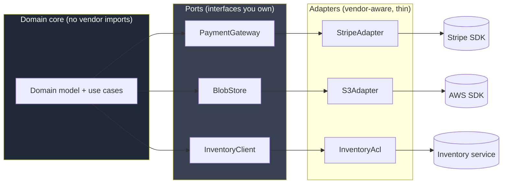
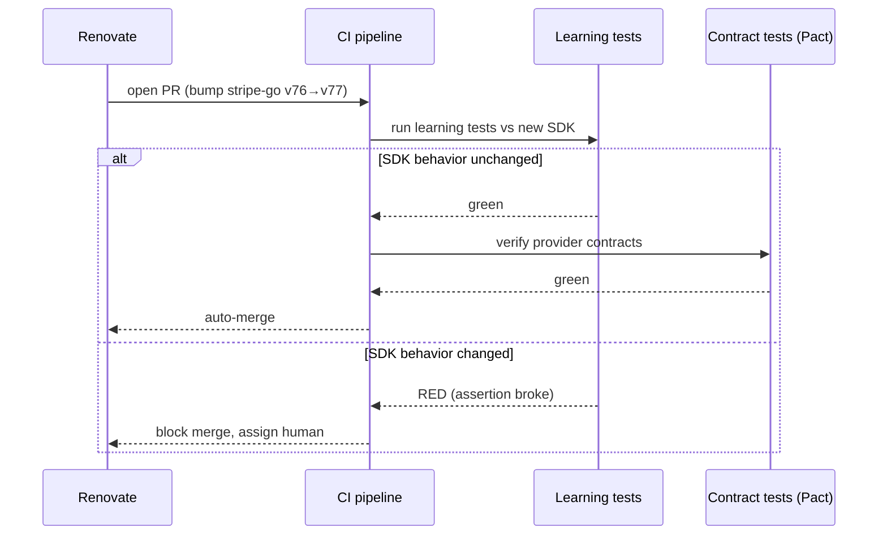
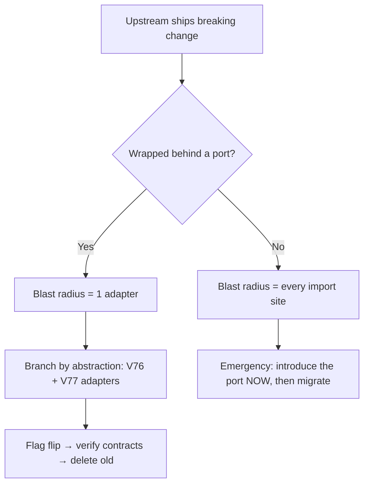

# Boundaries — Senior Level

> Focus: managing boundaries across a *system* — ports-and-adapters and clean architecture at scale, anti-corruption layers between bounded contexts, swappable vendor SDKs, dependency-upgrade governance, consumer-driven contract tests, and the blast radius of breaking upstream changes.

---

## Table of Contents

1. [The boundary map of a real system](#the-boundary-map-of-a-real-system)
2. [Ports and adapters at scale](#ports-and-adapters-at-scale)
3. [Anti-corruption layers between bounded contexts](#anti-corruption-layers-between-bounded-contexts)
4. [Wrapping vendor SDKs so they are swappable](#wrapping-vendor-sdks-so-they-are-swappable)
5. [Wrapping cloud SDKs for testability](#wrapping-cloud-sdks-for-testability)
6. [Dependency governance: pinning, lockfiles, automated upgrades](#dependency-governance-pinning-lockfiles-automated-upgrades)
7. [Learning tests and contract tests as upgrade gates](#learning-tests-and-contract-tests-as-upgrade-gates)
8. [Consumer-driven contract testing for service boundaries](#consumer-driven-contract-testing-for-service-boundaries)
9. [Managing the blast radius of a breaking upstream change](#managing-the-blast-radius-of-a-breaking-upstream-change)
10. [Supply-chain awareness at the dependency boundary](#supply-chain-awareness-at-the-dependency-boundary)
11. [Common Mistakes](#common-mistakes)
12. [Test Yourself](#test-yourself)
13. [Cheat Sheet](#cheat-sheet)
14. [Summary](#summary)
15. [Further Reading](#further-reading)
16. [Related Topics](#related-topics)

---

## The boundary map of a real system

A boundary is any seam where *your* code meets code you don't control: a third-party SDK, another team's service, a database driver, a cloud provider, an OS API. Each seam is a place where change can leak in. The senior job is not to eliminate seams — it is to make every seam **visible, owned, and narrow** so a change on the other side has a bounded, known impact.



The discipline: **the domain core imports nothing from `adapters/` and nothing from a vendor package.** Dependencies point inward. Every arrow that crosses out of the core passes through a port — an interface your team defined in your team's vocabulary.

A practical heuristic for spotting an uncontained boundary: grep for the vendor's package name across the codebase. If `import "github.com/stripe/stripe-go/v76"` appears in 40 files, you have 40 boundaries to migrate when Stripe ships v77. If it appears in 1 file, you have one.

```bash
# Count the blast radius of each vendor dependency
git grep -l 'stripe-go' | wc -l        # should be ~1 (the adapter)
git grep -l 'aws-sdk-go-v2' | wc -l     # should equal the number of adapters, not handlers
```

---

## Ports and adapters at scale

At team scale the rule "wrap third-party libraries" becomes an architecture: **hexagonal / ports-and-adapters**, the outer ring of clean architecture. The contract is enforced by package structure and CI, not by goodwill.

### Define the port in your own language

The port lives next to the domain and speaks the domain's nouns — never the vendor's.

```go
// internal/payments/port.go — the PORT. No vendor types here.
package payments

import "context"

type Money struct {
	AmountMinor int64  // cents; never float
	Currency    string // ISO-4217
}

type ChargeRequest struct {
	IdempotencyKey string
	Amount         Money
	CustomerRef    string
}

type Charge struct {
	ID     string
	Status ChargeStatus // your enum, not Stripe's string
}

// Gateway is owned by us. Implementations live in adapters/.
type Gateway interface {
	Charge(ctx context.Context, req ChargeRequest) (Charge, error)
	Refund(ctx context.Context, chargeID string, amount Money) error
}

// Domain errors — adapters translate vendor errors into these.
var (
	ErrCardDeclined  = errors.New("payments: card declined")
	ErrRateLimited   = errors.New("payments: rate limited")
	ErrIdempotent    = errors.New("payments: duplicate idempotency key")
)
```

```go
// internal/payments/stripe/adapter.go — the ADAPTER. Only file that imports Stripe.
package stripe

import (
	stripe "github.com/stripe/stripe-go/v76"
	"github.com/stripe/stripe-go/v76/charge"
	"myco/internal/payments"
)

type Adapter struct{ client *stripe.Client }

func (a *Adapter) Charge(ctx context.Context, req payments.ChargeRequest) (payments.Charge, error) {
	params := &stripe.ChargeParams{
		Amount:   stripe.Int64(req.Amount.AmountMinor),
		Currency: stripe.String(req.Amount.Currency),
	}
	params.SetIdempotencyKey(req.IdempotencyKey)
	ch, err := charge.New(params)
	if err != nil {
		return payments.Charge{}, translate(err) // map Stripe errors → domain errors
	}
	return payments.Charge{ID: ch.ID, Status: mapStatus(ch.Status)}, nil
}
```

The translation layer (`translate`, `mapStatus`) is the load-bearing part. A `stripe.Error` with code `card_declined` becomes `payments.ErrCardDeclined`. The domain handles `ErrCardDeclined`; it never sees `*stripe.Error`. When you swap Stripe for Adyen, you write a new adapter and delete one. Nothing in the core changes.

### Enforce the boundary in CI, not in code review

Humans forget; the build does not. Make "no vendor import in the core" a fitness function.

**Java — ArchUnit:**

```java
@AnalyzeClasses(packages = "com.myco.payments")
class BoundaryRules {
    @ArchTest
    static final ArchRule core_has_no_vendor_imports =
        noClasses().that().resideInAPackage("..domain..")
            .should().dependOnClassesThat()
            .resideInAnyPackage("com.stripe..", "software.amazon.awssdk..");

    @ArchTest
    static final ArchRule adapters_depend_on_ports_not_vice_versa =
        classes().that().resideInAPackage("..adapter..")
            .should().dependOnClassesThat().resideInAPackage("..port..");
}
```

**Go — `depguard` (via `golangci-lint`):**

```yaml
# .golangci.yml
linters-settings:
  depguard:
    rules:
      domain-core:
        files: ["**/internal/payments/*.go", "!**/internal/payments/stripe/**"]
        deny:
          - pkg: "github.com/stripe/stripe-go"
            desc: "vendor imports belong in the stripe adapter only"
```

**Python — `import-linter`:**

```ini
# .importlinter
[importlinter:contract:core-is-pure]
name = Domain core must not import vendor SDKs
type = forbidden
source_modules = myco.payments.domain
forbidden_modules = stripe, boto3, google.cloud
```

These three fail the build the moment someone imports a vendor SDK into the core. That is the whole game: the architecture is only real if it is mechanically checked.

---

## Anti-corruption layers between bounded contexts

When two services (or two bounded contexts in a monolith) own different models of "the same" concept — your `Order` vs. the legacy billing system's `Invoice` — direct integration lets the *other* model's assumptions leak into yours. An **Anti-Corruption Layer (ACL)** is a translation boundary that keeps each context's model clean.

The ACL is more than a DTO mapper. It is the place where you:

- **Rename** foreign concepts into local ones (`legacyStatus "B"` → `OrderStatus.SHIPPED`).
- **Reject** states your domain considers invalid (the legacy system allows a negative quantity; your domain refuses to construct one).
- **Fill gaps** the upstream model doesn't carry (default a missing currency to the context's base currency, explicitly).
- **Absorb churn** — when the legacy system reorganizes its fields, only the ACL changes.

```python
# acl/billing.py — Anti-corruption layer for the legacy billing service.
from myco.orders.domain import Order, OrderStatus, Money

_STATUS_MAP = {"A": OrderStatus.PENDING, "B": OrderStatus.SHIPPED, "X": OrderStatus.CANCELLED}

class BillingAcl:
    def __init__(self, raw_client: "LegacyBillingClient") -> None:
        self._client = raw_client  # vendor/legacy client lives ONLY here

    def fetch_order(self, ref: str) -> Order:
        raw = self._client.get_invoice(ref)  # foreign shape, foreign vocabulary
        if raw["qty"] < 0:
            raise ValueError(f"billing returned invalid quantity for {ref}")
        return Order(
            id=raw["inv_no"],
            status=_STATUS_MAP.get(raw["st"], OrderStatus.UNKNOWN),
            total=Money(minor=raw["cents"], currency=raw.get("ccy", "USD")),
        )
```

The domain receives a fully-formed, validated `Order`. It never learns that "shipped" is spelled `"B"` somewhere. Strategically, an ACL is how you integrate with a system you cannot change (a vendor, a legacy monolith) without letting its design decisions metastasize through your codebase.

---

## Wrapping vendor SDKs so they are swappable

"Swappable" is not an abstract virtue — it is what lets you survive a vendor outage, a pricing change, a region requirement, or an acquisition. The bar for a good wrapper:

1. **The port exposes only what your domain needs**, not the SDK's full surface. A `BlobStore` with `Put/Get/Delete/Exists` is easier to re-implement than one that mirrors all 200 S3 operations.
2. **No vendor type appears in the port signature** — not in arguments, returns, or errors. If `s3.GetObjectOutput` leaks, the abstraction is fake.
3. **Idempotency, retries, and timeouts are part of the port's contract**, decided by you, not inherited from SDK defaults.
4. **There is a second, real implementation** — even if only the in-memory fake used in tests. An interface with exactly one production implementation and a fake proves swappability is achievable.

```java
// Port — owned by us
public interface BlobStore {
    void put(String key, byte[] data, String contentType);
    Optional<byte[]> get(String key);
    void delete(String key);
}

// Adapter — the only class that imports the AWS SDK
public final class S3BlobStore implements BlobStore {
    private final S3Client s3;          // software.amazon.awssdk.services.s3
    private final String bucket;

    @Override public void put(String key, byte[] data, String contentType) {
        try {
            s3.putObject(b -> b.bucket(bucket).key(key).contentType(contentType),
                         RequestBody.fromBytes(data));
        } catch (S3Exception e) {
            throw new BlobStoreException("put failed for " + key, e); // domain exception
        }
    }
}

// Fake — production-quality test double, lives next to tests
public final class InMemoryBlobStore implements BlobStore {
    private final Map<String, byte[]> store = new ConcurrentHashMap<>();
    @Override public void put(String key, byte[] d, String ct) { store.put(key, d); }
    @Override public Optional<byte[]> get(String key) { return Optional.ofNullable(store.get(key)); }
    @Override public void delete(String key) { store.remove(key); }
}
```

> **Pragmatic limit:** do not wrap a library whose *job is to be the interface* — an HTTP router, a JSON serializer, a logging facade like SLF4J (which is itself an abstraction). Wrap things you'd realistically swap or need to fake: payment, storage, auth, email, SMS, feature flags, search. Wrapping `json.Marshal` behind a port is ceremony with no payoff.

---

## Wrapping cloud SDKs for testability

Cloud SDKs (AWS, GCP, Azure) are the worst boundaries to leave unwrapped: they're verbose, they require credentials, they reach the network, and they version aggressively. Direct use makes unit tests impossible — they become integration tests that need a real account or a mock that lies.

Two viable strategies, ranked:

**1. Wrap behind your own port (preferred).** As above — the domain depends on `BlobStore`, tests use `InMemoryBlobStore`. Fast, deterministic, zero credentials.

**2. Use the SDK's own seam where one exists, behind an adapter.** The AWS Go SDK v2 lets you inject an interface for each service client; you can stub it. But you should still keep that stubbing *inside the adapter's tests*, not in domain tests.

```go
// Define the minimal slice of the AWS interface the adapter uses.
type s3PutAPI interface {
	PutObject(ctx context.Context, in *s3.PutObjectInput, opts ...func(*s3.Options)) (*s3.PutObjectOutput, error)
}

type S3Adapter struct{ api s3PutAPI }

// In adapter unit tests, inject a stub implementing s3PutAPI — no AWS account needed.
```

For the integration layer, run real-cloud tests against **LocalStack** (AWS) or the GCP emulators, gated to a nightly pipeline — not on every PR. The unit boundary stays fast; the integration boundary stays real but slow and isolated.

> **Anti-pattern — mocking what you don't own.** Do not write a unit test that mocks `S3Client.putObject` directly in your domain test and asserts it was called with specific arguments. The mock encodes *your belief* about the SDK's behavior. When AWS changes that behavior in v3, your mock keeps passing while production breaks. Mock your *own* port; verify the *real* SDK with a learning test (next section).

---

## Dependency governance: pinning, lockfiles, automated upgrades

A dependency is a boundary you import wholesale. At team scale you need a *policy*, not per-developer judgment.

### Pin and lock everything

| Ecosystem | Manifest (ranges) | Lockfile (exact, committed) | Verify integrity |
|---|---|---|---|
| Go | `go.mod` | `go.sum` (hashes) | `GOFLAGS=-mod=readonly`, `go mod verify` |
| Java (Maven) | `pom.xml` | enforce via `maven-enforcer` + `dependencyManagement` BOM | `mvn dependency:tree`, checksum plugin |
| Java (Gradle) | `build.gradle` | `gradle.lockfile` (`dependencyLocking`) | `--write-locks` controlled |
| Python | `pyproject.toml` | `poetry.lock` / `uv.lock` / `requirements.txt` (pinned + hashes) | `pip install --require-hashes` |

The rule: **manifests may carry ranges; the lockfile is exact and committed; CI builds from the lockfile with no resolution allowed.** A build that re-resolves versions at CI time is not reproducible and not auditable.

### Automate upgrades, gate them with tests

Manual upgrades rot — teams skip them until forced by a CVE, then face a 12-version jump. Use **Renovate** or **Dependabot** to open small, frequent PRs.

```json
// renovate.json — grouped, scheduled, auto-merge for safe updates
{
  "extends": ["config:recommended"],
  "schedule": ["before 9am on monday"],
  "packageRules": [
    {
      "matchUpdateTypes": ["patch", "pin", "digest"],
      "automerge": true,
      "automergeType": "branch"
    },
    {
      "matchUpdateTypes": ["major"],
      "labels": ["dependencies", "breaking-review"],
      "automerge": false
    },
    {
      "groupName": "aws-sdk",
      "matchPackagePatterns": ["^software.amazon.awssdk", "^github.com/aws/aws-sdk-go-v2"]
    }
  ],
  "vulnerabilityAlerts": { "labels": ["security"], "automerge": true }
}
```

Policy that makes this safe: **patch/minor auto-merge only if CI is green; major upgrades require a human and a passing contract/learning test.** The bot creates the churn; your test suite decides whether it lands.

---

## Learning tests and contract tests as upgrade gates

A **learning test** (Beck/Martin term) is a test you write against a *third-party* dependency to pin down the behavior your code relies on. It is the upgrade gate for libraries you don't own.

```go
// payments/stripe/learning_test.go
// Pins the Stripe SDK behavior our adapter depends on. Runs against a stub server.
func TestStripe_DeclinedCard_ReturnsCardError(t *testing.T) {
	srv := stripeStub(t, 402, `{"error":{"type":"card_error","code":"card_declined"}}`)
	defer srv.Close()

	_, err := charge.New(&stripe.ChargeParams{ /* ... */ })

	var se *stripe.Error
	require.ErrorAs(t, err, &se)
	require.Equal(t, stripe.ErrorCodeCardDeclined, se.Code) // the contract we rely on
}
```

When Renovate bumps `stripe-go`, this test runs in CI. If Stripe renamed `ErrorCodeCardDeclined` or changed the error shape, the learning test fails on the upgrade PR — *before* the new version reaches production. The learning test is what makes auto-merge of dependency upgrades safe: it converts "the upstream might have changed behavior" from a production incident into a red CI check on a bot PR.

The same principle applies to behavioral assumptions: parsing quirks, timezone handling, default timeouts, retry semantics. Every assumption your adapter makes about the SDK should have a learning test. When it fails on an upgrade, you've learned exactly which assumption broke.



---

## Consumer-driven contract testing for service boundaries

Between *services*, the boundary is an API, and the failure mode is asymmetric: the provider deploys a "harmless" change and silently breaks a consumer it didn't know existed. **Consumer-driven contract testing (Pact)** flips this — consumers publish the exact shape they depend on, and the provider's CI verifies it can satisfy every consumer before deploying.

```javascript
// consumer side (the calling service) — defines the contract it needs
const { PactV3 } = require('@pact-foundation/pact');

describe('OrdersClient', () => {
  const pact = new PactV3({ consumer: 'checkout', provider: 'orders-api' });

  it('fetches an order by id', () => {
    pact
      .given('order 42 exists')
      .uponReceiving('a request for order 42')
      .withRequest({ method: 'GET', path: '/orders/42' })
      .willRespondWith({
        status: 200,
        body: { id: 42, status: 'SHIPPED', totalMinor: 1599 }, // only fields checkout uses
      });

    return pact.executeTest(async (mock) => {
      const order = await new OrdersClient(mock.url).get(42);
      expect(order.status).toBe('SHIPPED');
    });
  });
});
```

The consumer's test produces a **pact file** published to a Pact Broker. The provider's CI runs `pactProvider:verify` against the real provider, replaying every consumer's expectations. The Broker's **`can-i-deploy`** gate then answers the deploy-time question:

```bash
# Provider CI, before deploying orders-api to prod:
pact-broker can-i-deploy \
  --pacticipant orders-api --version "$GIT_SHA" \
  --to-environment production
# exits non-zero if any consumer's contract would break
```

Contract tests catch the *interface* break that unit tests on either side cannot — neither service tests the seam, only the Pact does. Use Pact for the cross-team service boundary; use OpenAPI schema validation for the simpler "did the shape drift" check; use learning tests for the library boundary. They cover different seams.

---

## Managing the blast radius of a breaking upstream change

When an upstream you depend on ships a breaking change (a vendor API deprecation, a library major bump, an internal service's v2), the senior task is to *contain the cost*, which the boundary architecture has already minimized.

A repeatable playbook:

1. **Measure the blast radius first.** `git grep -l` the affected symbol. If the dependency is properly wrapped, the count is 1–2 adapter files. If it's leaked, you've found your real problem.
2. **Pin to the last-known-good version** in the lockfile to stop the bleeding and buy time.
3. **Update the learning/contract test to the new behavior** and watch it go red — this documents exactly what changed.
4. **Branch by abstraction at the port** if both old and new must coexist during rollout: keep the `Gateway` interface, ship `StripeAdapterV76` and `StripeAdapterV77` side by side, switch by feature flag.
5. **Migrate behind the flag, verify with contract tests, then delete the old adapter.**



The whole point of the earlier sections is this moment: a breaking upstream change should be a *bounded, scheduled migration of one adapter*, not a cross-cutting emergency. If it's an emergency, the boundary wasn't real — and the fix is to introduce the port under the pressure, so the *next* break is contained.

---

## Supply-chain awareness at the dependency boundary

Every dependency is also a *trust* boundary. A senior owns the supply-chain posture of what crosses it.

- **SBOM (Software Bill of Materials).** Generate a CycloneDX or SPDX SBOM in CI (`syft`, `cyclonedx-gomod`, `cyclonedx-maven-plugin`) so you can answer "are we affected by CVE-X?" in minutes, not days. This was the operational difference between teams during Log4Shell.
- **Vulnerability scanning as a gate.** `govulncheck` (Go, reachability-aware), `pip-audit` (Python), OWASP Dependency-Check / `mvn dependency-check` (Java), Trivy/Grype on the SBOM. Fail the build on known-exploited CVEs; warn on the rest.
- **Provenance and integrity.** Hash-pin lockfiles. Prefer registries that support signed provenance (Sigstore/cosign, npm provenance). Verify, don't trust.
- **Reduce the boundary surface.** The cheapest supply-chain win is fewer dependencies. A one-function utility you wrote is a smaller attack surface than a transitive tree of 300 packages pulled in for one helper. The same wrapping discipline that makes vendors swappable also makes them *droppable*.

```bash
# Go: reachability-aware scan — only flags CVEs your code can actually reach
govulncheck ./...

# Generate an SBOM in CI for audit + CVE matching
syft packages dir:. -o cyclonedx-json > sbom.json
grype sbom:sbom.json --fail-on high
```

---

## Common Mistakes

- **Fake abstraction.** A port that exposes a vendor type in its signature (`func Get() (*s3.GetObjectOutput, error)`). The import moved but the coupling didn't — swapping the vendor still touches every caller.
- **Wrapping everything.** Putting a port over JSON serialization, the HTTP router, or SLF4J. Ceremony with no swap scenario behind it. Wrap things you'd realistically replace or fake.
- **Mocking what you don't own.** Asserting on calls to the vendor SDK in domain tests. The mock encodes your assumptions; it passes forever while reality drifts. Mock your port; verify the SDK with a learning test.
- **No upgrade gate.** Auto-merging dependency PRs with no learning/contract test. You've automated the *introduction* of breaking changes into main.
- **Re-resolving versions in CI.** Building from manifest ranges instead of the committed lockfile. Non-reproducible, non-auditable, and the source of "works on my machine."
- **One ACL per call instead of per context.** Translating ad hoc at each call site re-introduces the foreign model everywhere. Centralize translation in one ACL per upstream context.
- **Discovering the blast radius during the incident.** Not knowing how many files import a vendor until it breaks. `git grep` should be a routine pre-upgrade check, not a 2 a.m. discovery.

---

## Test Yourself

<details><summary>1. You wrapped Stripe behind a `Gateway` interface, but `Charge()` returns a `*stripe.Charge`. Is the boundary real?</summary>

No. The vendor type leaked into the port signature, so every caller still depends on `stripe.Charge`. Swapping to Adyen would touch every call site. A real boundary returns *your* `Charge` type; the adapter maps `*stripe.Charge` → your type internally. The test for a real boundary: can you delete the vendor package and have only the adapter fail to compile?
</details>

<details><summary>2. A teammate's domain unit test mocks `s3Client.putObject` and asserts the exact arguments. Why is this fragile?</summary>

It mocks something you don't own. The mock encodes your *belief* about the AWS SDK's contract. When AWS changes that contract in a major version, the mock keeps passing (it's your code, not theirs) while production breaks. Fix: mock your own `BlobStore` port in domain tests; verify the real SDK behavior with a learning test that runs on every SDK upgrade.
</details>

<details><summary>3. Renovate opens a PR bumping a library from v3 to v4 (major). Your patch/minor PRs auto-merge. Should this one?</summary>

No. Major bumps mean a documented breaking change. The policy should require a human plus a green learning/contract test. The value of learning tests is precisely here: they turn "v4 might have changed the behavior we rely on" into a concrete red CI check on the upgrade PR, so the human reviews a specific failure instead of guessing.
</details>

<details><summary>4. Two consumers depend on your `orders-api`. You want to remove a field. How do you know if it's safe?</summary>

Consumer-driven contract tests. Each consumer publishes a pact declaring the fields it uses. Run `pact-broker can-i-deploy --pacticipant orders-api --to-environment production`; it verifies your new version against every published consumer contract and fails if any still depends on the field. Unit tests on either side can't catch this — only the contract spans the seam.
</details>

<details><summary>5. An upstream vendor deprecates an endpoint with 60 days' notice. Where do you start?</summary>

Measure the blast radius: `git grep -l` the vendor symbol. If properly wrapped, the change is confined to one adapter — schedule a bounded migration, optionally branch-by-abstraction with a flag, verify with contract tests, delete the old path. If the count is high, the boundary was never real; the immediate work is to introduce the port now so the migration (and the next break) is contained.
</details>

<details><summary>6. Why generate an SBOM if you already pin versions in a lockfile?</summary>

A lockfile pins *direct and transitive* versions for reproducible builds; an SBOM is the *queryable inventory* used for audit and incident response. When the next Log4Shell drops, the SBOM lets you answer "are we affected, and where?" in minutes by matching the CVE against the bill of materials — across all services — instead of grepping repos by hand under pressure.
</details>

---

## Cheat Sheet

| Concern | Tool / pattern | Rule |
|---|---|---|
| Keep core vendor-free | Ports & adapters, depguard / ArchUnit / import-linter | Core imports no vendor package; CI enforces it |
| Translate vendor errors | Adapter translation layer | `*stripe.Error` → `ErrCardDeclined` at the seam |
| Integrate foreign contexts | Anti-corruption layer | One ACL per upstream context; validate + rename |
| Swappable vendors | Minimal port + real fake | No vendor type in port signature; ship an in-memory fake |
| Testable cloud SDKs | Wrap; LocalStack/emulators nightly | Unit tests use the fake; integration tests use emulators |
| Reproducible builds | Committed lockfile, `-mod=readonly`, `--require-hashes` | CI builds from lockfile, never re-resolves |
| Automated upgrades | Renovate / Dependabot | Patch/minor auto-merge on green; major needs human |
| Library upgrade gate | Learning test | Pin every SDK assumption; runs on every bump |
| Service boundary safety | Pact + `can-i-deploy` | Consumers define contracts; provider verifies before deploy |
| Breaking upstream change | `git grep` → branch by abstraction → flag → delete | Contain to one adapter; migrate on schedule |
| Supply chain | SBOM (syft) + scan (govulncheck/pip-audit/Trivy) | Fail on known-exploited CVEs; fewer deps = smaller surface |

---

## Summary

At team scale, boundaries stop being a code-cleanliness preference and become an architecture with mechanical enforcement. The domain core speaks its own vocabulary and imports nothing from a vendor; every seam passes through a port your team owns; CI fitness functions fail the build the instant a vendor type leaks inward. That single discipline pays off at every other boundary: ACLs keep foreign models from corrupting yours, wrapped SDKs become swappable and testable, learning tests turn risky upgrades into automated PRs, and consumer-driven contracts make service evolution safe. When an upstream finally ships a breaking change, the blast radius is one adapter on a scheduled migration — not a cross-cutting emergency. And because every dependency is also a trust boundary, the senior owns its supply-chain posture: pinned lockfiles, SBOMs, vulnerability gates, and the cheapest win of all — fewer dependencies to begin with.

---

## Further Reading

- Robert C. Martin, *Clean Architecture* — the dependency rule and the boundary chapters.
- Eric Evans, *Domain-Driven Design* — bounded contexts and the Anti-Corruption Layer pattern.
- Alistair Cockburn, *Hexagonal Architecture (Ports and Adapters)* — the original articulation.
- Kent Beck, *Test-Driven Development: By Example* — learning tests for third-party code.
- Pact documentation and the *can-i-deploy* workflow — consumer-driven contract testing.
- Martin Fowler, *Strangler Fig Application* and *Branch By Abstraction* — incremental migration at boundaries.
- CycloneDX / SPDX specs; CISA SBOM guidance — supply-chain inventory at the dependency boundary.

---

## Related Topics

- [junior.md](junior.md) — the core idea: wrap third-party code behind your own interface.
- [middle.md](middle.md) — adapters, fakes, and learning tests in practice.
- [professional.md](professional.md) — boundary testing strategy and integration-test design.
- [Chapter README](../README.md) — the positive rules for boundaries.
- [Modules and Packages](../19-modules-and-packages/README.md) — package structure that enforces the dependency direction.
- [Abstraction and Information Hiding](../22-abstraction-and-information-hiding/README.md) — what a good port should and shouldn't expose.
- [Design Patterns](../../design-patterns/README.md) — Adapter, Facade, and Proxy as boundary tools.
- [Anti-Patterns](../../anti-patterns/README.md) — leaky abstraction, vendor lock-in, and distributed monolith.
