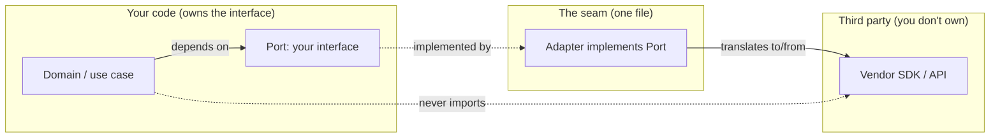

# Boundaries — Practice Tasks

> 12 hands-on refactoring exercises on managing third-party boundaries. Every task gives a scenario, smelly code where a vendor dependency has leaked or resists testing, a precise instruction, and a collapsible full solution with reasoning. Languages vary (Go / Java / Python). Difficulty climbs from easy to hard.

---

## Table of Contents

1. [Wrap a logging SDK behind your own interface](#task-1--wrap-a-logging-sdk-behind-your-own-interface) — Easy (Go)
2. [Write a learning test for a date-parsing library](#task-2--write-a-learning-test-for-a-date-parsing-library) — Easy (Python)
3. [Stop leaking a vendor type across the codebase](#task-3--stop-leaking-a-vendor-type-across-the-codebase) — Easy (Java)
4. [Map an SDK response to a domain type at the seam](#task-4--map-an-sdk-response-to-a-domain-type-at-the-seam) — Medium (Go)
5. [Replace a mock-of-third-party with wrapper + mock-your-own-interface](#task-5--replace-a-mock-of-third-party-with-wrapper--mock-your-own-interface) — Medium (Python)
6. [Make a network client swappable for a fake](#task-6--make-a-network-client-swappable-for-a-fake) — Medium (Go)
7. [Define your own interface for not-yet-built code](#task-7--define-your-own-interface-for-not-yet-built-code) — Medium (Java)
8. [Ports & adapters for a payment client](#task-8--ports--adapters-for-a-payment-client) — Hard (Go)
9. [Ports & adapters for a storage/blob client](#task-9--ports--adapters-for-a-storageblob-client) — Hard (Python)
10. [Add a contract test that pins the adapter to the real API](#task-10--add-a-contract-test-that-pins-the-adapter-to-the-real-api) — Hard (Go)
11. [Decouple from a specific library version with an anti-corruption layer](#task-11--decouple-from-a-specific-library-version-with-an-anti-corruption-layer) — Hard (Java)
12. [Boundary audit (open-ended)](#task-12--boundary-audit-open-ended) — Hard (Python)

---

## How to Use

Work top to bottom; each task assumes the boundary vocabulary built by the previous ones. For every task:

1. Read the scenario and the smelly code. Name the boundary problem before you read the instruction — *which third-party type leaked, and how far?*
2. Attempt the refactor yourself. Sketch the interface you would own *before* looking at the solution.
3. Expand the solution and compare. The reasoning matters more than matching the exact code — there is usually more than one clean seam.
4. Ask the recurring boundary question: **"If this vendor disappeared tomorrow, how many files would I have to touch?"** The answer should be *one* — the adapter.

A healthy boundary looks like the diagram below: your domain talks only to an interface you own; exactly one adapter knows the vendor exists.



---

## Task 1 — Wrap a logging SDK behind your own interface

**Difficulty:** Easy · **Language:** Go

**Scenario:** Every package imports `github.com/acme/zlog` directly and calls `zlog.Emit(level, msg, fields)`. The vendor's type appears in 40 files. Marketing wants to swap to a different logger next quarter.

**Smelly code:**

```go
package orders

import "github.com/acme/zlog"

func PlaceOrder(o Order) error {
    zlog.Emit(zlog.LevelInfo, "placing order", zlog.Fields{"id": o.ID})
    if err := save(o); err != nil {
        zlog.Emit(zlog.LevelError, "save failed", zlog.Fields{"err": err.Error()})
        return err
    }
    return nil
}
```

**Instruction:** Extract a minimal `Logger` interface that *you* own, expressed in terms of your needs (not the vendor's `Fields` type). Make `orders` depend on the interface. Keep one adapter that knows about `zlog`.

<details><summary>Solution</summary>

```go
// package log — the interface YOU own. No vendor import here.
package log

type Logger interface {
    Info(msg string, kv ...any)
    Error(msg string, kv ...any)
}
```

```go
// package zlogadapter — the ONLY place that imports the vendor.
package zlogadapter

import "github.com/acme/zlog"

type Adapter struct{}

func New() Adapter { return Adapter{} }

func (Adapter) Info(msg string, kv ...any)  { zlog.Emit(zlog.LevelInfo, msg, toFields(kv)) }
func (Adapter) Error(msg string, kv ...any) { zlog.Emit(zlog.LevelError, msg, toFields(kv)) }

func toFields(kv []any) zlog.Fields {
    f := make(zlog.Fields, len(kv)/2)
    for i := 0; i+1 < len(kv); i += 2 {
        key, _ := kv[i].(string)
        f[key] = kv[i+1]
    }
    return f
}
```

```go
// package orders — now depends on log.Logger, never on zlog.
package orders

import "myapp/log"

func PlaceOrder(l log.Logger, o Order) error {
    l.Info("placing order", "id", o.ID)
    if err := save(o); err != nil {
        l.Error("save failed", "err", err.Error())
        return err
    }
    return nil
}
```

**Reasoning:** The interface is phrased in *your* vocabulary (`Info`/`Error`, variadic key-values), not the vendor's `Fields`/`LevelInfo`. That is the difference between a wrapper and a leak: a wrapper hides the vendor's shape; a thin pass-through that re-exports `zlog.Fields` would just move the leak one layer down. Now swapping loggers means writing one new adapter, not editing 40 files.

</details>

---

## Task 2 — Write a learning test for a date-parsing library

**Difficulty:** Easy · **Language:** Python

**Scenario:** Your team is adopting `dateutil` to parse user-supplied dates. Nobody is sure how it handles ambiguous input like `"03/04/2024"` or a bare time. You are about to scatter `dateutil.parser.parse(...)` through production code based on guesses.

**Smelly code:**

```python
from dateutil import parser

def parse_user_date(raw: str):
    # We *think* this gives day-first... or is it month-first? Ship it and find out.
    return parser.parse(raw)
```

**Instruction:** Before writing production code, write a *learning test* — a test against the third-party library that documents its actual behavior for the cases you care about. Then write the production wrapper so the behavior is pinned by the test, not by hope.

<details><summary>Solution</summary>

```python
# test_dateutil_learning.py — characterization of the vendor, not of our code.
import datetime as dt
import pytest
from dateutil import parser


def test_dateutil_defaults_to_month_first():
    # Learning: "03/04/2024" is parsed as March 4th, NOT April 3rd.
    assert parser.parse("03/04/2024") == dt.datetime(2024, 3, 4)


def test_dateutil_dayfirst_flag_flips_interpretation():
    assert parser.parse("03/04/2024", dayfirst=True) == dt.datetime(2024, 4, 3)


def test_dateutil_fills_missing_date_with_today():
    # Learning: a bare time inherits "today" as the date — surprising, must guard.
    out = parser.parse("14:30", default=dt.datetime(2000, 1, 1))
    assert out == dt.datetime(2000, 1, 1, 14, 30)


def test_dateutil_raises_on_garbage():
    with pytest.raises(parser.ParserError):
        parser.parse("not a date")
```

```python
# dates.py — production wrapper whose contract is now documented by the tests above.
import datetime as dt
from dateutil import parser

# Our product is EU-facing, so we lock in day-first explicitly rather than
# relying on the library default that the learning test exposed as month-first.
_EPOCH = dt.datetime(1970, 1, 1)


def parse_user_date(raw: str) -> dt.date:
    return parser.parse(raw, dayfirst=True, default=_EPOCH).date()
```

**Reasoning:** A learning test is a cheap experiment that you keep. It costs minutes now and pays off twice: it documents the surprising defaults (`dayfirst`, the "fill from today" behavior) in executable form, and it acts as an upgrade tripwire — when you bump `dateutil` and a default changes, the learning test goes red instead of production. You are no longer guessing about code you don't own; you have measured it.

</details>

---

## Task 3 — Stop leaking a vendor type across the codebase

**Difficulty:** Easy · **Language:** Java

**Scenario:** A REST handler, a service, and a repository all pass around `com.stripe.model.Customer` (the raw Stripe SDK type). Your business logic now reads Stripe field names (`getMetadata()`, `getLivemode()`) and your tests need real Stripe objects to compile.

**Smelly code:**

```java
import com.stripe.model.Customer;

class BillingService {
    Customer loadCustomer(String id) throws StripeException {
        return Customer.retrieve(id); // Stripe type escapes here
    }

    boolean isInGoodStanding(Customer c) {      // ...and here
        return !c.getDelinquent() && c.getBalance() <= 0;
    }
}

class CustomerController {
    String greeting(Customer c) {               // ...and here, in the web layer
        return "Hello " + c.getName();
    }
}
```

**Instruction:** Define a small domain type `Account` that holds only the fields your business cares about. Map the Stripe `Customer` to `Account` at the boundary so the vendor type never travels past the SDK call.

<details><summary>Solution</summary>

```java
// Domain type — pure, no Stripe import. This is what the rest of the app sees.
record Account(String id, String name, boolean delinquent, long balanceMinorUnits) {
    boolean isInGoodStanding() {
        return !delinquent && balanceMinorUnits <= 0;
    }
}
```

```java
// The seam: the only class that imports com.stripe.*
import com.stripe.model.Customer;
import com.stripe.exception.StripeException;

class StripeAccountGateway {
    Account loadAccount(String id) throws StripeException {
        return toDomain(Customer.retrieve(id));
    }

    private Account toDomain(Customer c) {
        return new Account(c.getId(), c.getName(), c.getDelinquent(), c.getBalance());
    }
}
```

```java
// Business + web layers now speak Account, with the rule living on the domain type.
class BillingService {
    private final StripeAccountGateway gateway;
    BillingService(StripeAccountGateway gateway) { this.gateway = gateway; }

    boolean isInGoodStanding(String id) throws StripeException {
        return gateway.loadAccount(id).isInGoodStanding();
    }
}

class CustomerController {
    String greeting(Account a) { return "Hello " + a.name(); }
}
```

**Reasoning:** Mapping to a domain type at the seam confines the vendor to one class. The business rule (`isInGoodStanding`) moved onto your own type, so it is testable with a plain `new Account(...)` and no Stripe object. The web layer no longer knows the word "Stripe." When Stripe renames `getDelinquent()` in their next major version, the compile error lands in exactly one file — `StripeAccountGateway.toDomain` — instead of three.

</details>

---

## Task 4 — Map an SDK response to a domain type at the seam

**Difficulty:** Medium · **Language:** Go

**Scenario:** A weather feature calls a third-party SDK whose response is a deeply nested, optional-everything struct full of vendor quirks (Fahrenheit, pointers, a `Cod` int status field). The handler is drowning in nil checks and unit conversions.

**Smelly code:**

```go
import "github.com/owm/sdk"

func (h *Handler) Today(city string) (string, error) {
    resp, err := h.owm.Current(city) // resp is *sdk.CurrentResponse
    if err != nil {
        return "", err
    }
    if resp.Cod != 200 {
        return "", fmt.Errorf("owm code %d", resp.Cod)
    }
    if resp.Main == nil || resp.Main.Temp == nil {
        return "", errors.New("missing temp")
    }
    celsius := (*resp.Main.Temp - 32) * 5 / 9 // vendor sends Fahrenheit
    return fmt.Sprintf("%s: %.0f°C", city, celsius), nil
}
```

**Instruction:** Introduce a `Weather` domain struct (`City string`, `TempC float64`) and a function that translates the SDK response into it — owning the nil handling, the status check, and the F→C conversion. Leave the handler clean.

<details><summary>Solution</summary>

```go
package weather

// Domain type. Celsius, no pointers, no vendor status codes.
type Weather struct {
    City  string
    TempC float64
}
```

```go
package owmadapter

import (
    "errors"
    "fmt"

    "github.com/owm/sdk"
    "myapp/weather"
)

type Client struct{ owm *sdk.Client }

func New(owm *sdk.Client) *Client { return &Client{owm: owm} }

func (c *Client) Current(city string) (weather.Weather, error) {
    resp, err := c.owm.Current(city)
    if err != nil {
        return weather.Weather{}, fmt.Errorf("owm request: %w", err)
    }
    return toDomain(city, resp)
}

// All vendor quirks die here: status code, nil pointers, Fahrenheit.
func toDomain(city string, r *sdk.CurrentResponse) (weather.Weather, error) {
    if r == nil || r.Cod != 200 {
        return weather.Weather{}, fmt.Errorf("owm bad response: %v", r)
    }
    if r.Main == nil || r.Main.Temp == nil {
        return weather.Weather{}, errors.New("owm response missing temperature")
    }
    return weather.Weather{
        City:  city,
        TempC: (*r.Main.Temp - 32) * 5 / 9,
    }, nil
}
```

```go
// Handler now reads like business intent.
func (h *Handler) Today(city string) (string, error) {
    w, err := h.weather.Current(city)
    if err != nil {
        return "", err
    }
    return fmt.Sprintf("%s: %.0f°C", w.City, w.TempC), nil
}
```

**Reasoning:** The adapter's `toDomain` is an *anti-corruption layer*: it absorbs the vendor's defensive-programming surface (status ints, three layers of nil pointers, imperial units) so the rest of the program works with a clean, always-valid `Weather`. The handler shrank to two lines and now contains zero vendor knowledge. Critically, `toDomain` is a pure function — you can unit-test the F→C math and the nil handling by passing it hand-built `*sdk.CurrentResponse` values, with no network and no live SDK.

</details>

---

## Task 5 — Replace a mock-of-third-party with wrapper + mock-your-own-interface

**Difficulty:** Medium · **Language:** Python

**Scenario:** A test monkeypatches the `boto3` S3 client deep inside the code and asserts against its exact call signature (`put_object(Bucket=..., Key=..., Body=...)`). The test is green, but it is testing AWS's API, not yours — and it breaks the day boto3 renames a kwarg.

**Smelly code:**

```python
# uploader.py
import boto3

def upload_report(data: bytes, name: str):
    s3 = boto3.client("s3")
    s3.put_object(Bucket="reports", Key=f"{name}.pdf", Body=data)

# test_uploader.py
from unittest.mock import patch, MagicMock

def test_upload_report():
    with patch("uploader.boto3") as mock_boto:
        client = MagicMock()
        mock_boto.client.return_value = client
        upload_report(b"...", "july")
        # Asserting against boto3's API — a mock of code we don't own.
        client.put_object.assert_called_once_with(
            Bucket="reports", Key="july.pdf", Body=b"..."
        )
```

**Instruction:** "Don't mock what you don't own." Extract a `ReportStore` interface (a Protocol) that expresses *your* operation (`save(name, data)`). Implement it once with boto3. Mock *your* interface in the test.

<details><summary>Solution</summary>

```python
# store.py — the interface you own.
from typing import Protocol


class ReportStore(Protocol):
    def save(self, name: str, data: bytes) -> None: ...
```

```python
# s3_store.py — the single seam that knows boto3 exists.
import boto3
from store import ReportStore


class S3ReportStore(ReportStore):
    def __init__(self, bucket: str, client=None):
        self._bucket = bucket
        self._client = client or boto3.client("s3")

    def save(self, name: str, data: bytes) -> None:
        self._client.put_object(Bucket=self._bucket, Key=f"{name}.pdf", Body=data)
```

```python
# uploader.py — depends on the interface, not boto3.
from store import ReportStore


def upload_report(store: ReportStore, data: bytes, name: str) -> None:
    store.save(name, data)
```

```python
# test_uploader.py — mock YOUR interface. Fast, stable, intention-revealing.
from unittest.mock import create_autospec
from store import ReportStore
from uploader import upload_report


def test_upload_report_saves_under_its_name():
    store = create_autospec(ReportStore, instance=True)
    upload_report(store, b"...july data...", "july")
    store.save.assert_called_once_with("july", b"...july data...")
```

**Reasoning:** Mocking a type you don't own bakes the vendor's current API into your test as an assumption — when boto3 changes `put_object`'s contract, your test stays green while production breaks (the mock *lies*). By owning `ReportStore`, the unit test asserts against your stable `save(name, data)` contract, and the risky boto3-specific behavior is isolated in `S3ReportStore`, where a learning/integration test (Task 10) can verify it against real S3. `create_autospec` ensures the mock can't drift from the real interface signature.

</details>

---

## Task 6 — Make a network client swappable for a fake

**Difficulty:** Medium · **Language:** Go

**Scenario:** A function builds `*http.Request`, calls `http.DefaultClient.Do`, and unmarshals the body inline. Tests can only run with a live network or a global monkeypatch, and there's no way to simulate a 500 or a timeout.

**Smelly code:**

```go
func FetchUser(id string) (User, error) {
    resp, err := http.DefaultClient.Do(
        must(http.NewRequest("GET", "https://api.example.com/users/"+id, nil)),
    )
    if err != nil {
        return User{}, err
    }
    defer resp.Body.Close()
    var u User
    return u, json.NewDecoder(resp.Body).Decode(&u)
}
```

**Instruction:** Introduce a `Doer` interface (`Do(*http.Request) (*http.Response, error)`) that `*http.Client` already satisfies. Inject it. Show a test that uses a hand-rolled fake to simulate a 500 with no network.

<details><summary>Solution</summary>

```go
package api

import (
    "encoding/json"
    "fmt"
    "net/http"
)

// Doer is satisfied by *http.Client out of the box — you own the seam without
// reimplementing anything.
type Doer interface {
    Do(*http.Request) (*http.Response, error)
}

type Client struct {
    http    Doer
    baseURL string
}

func NewClient(d Doer, baseURL string) *Client {
    return &Client{http: d, baseURL: baseURL}
}

func (c *Client) FetchUser(id string) (User, error) {
    req, err := http.NewRequest(http.MethodGet, c.baseURL+"/users/"+id, nil)
    if err != nil {
        return User{}, err
    }
    resp, err := c.http.Do(req)
    if err != nil {
        return User{}, err
    }
    defer resp.Body.Close()
    if resp.StatusCode != http.StatusOK {
        return User{}, fmt.Errorf("unexpected status %d", resp.StatusCode)
    }
    var u User
    if err := json.NewDecoder(resp.Body).Decode(&u); err != nil {
        return User{}, fmt.Errorf("decode user: %w", err)
    }
    return u, nil
}
```

```go
package api

import (
    "io"
    "net/http"
    "strings"
    "testing"
)

// A fake Doer: no sockets, full control over status and body.
type fakeDoer func(*http.Request) (*http.Response, error)

func (f fakeDoer) Do(r *http.Request) (*http.Response, error) { return f(r) }

func TestFetchUser_ServerError(t *testing.T) {
    c := NewClient(fakeDoer(func(*http.Request) (*http.Response, error) {
        return &http.Response{
            StatusCode: http.StatusInternalServerError,
            Body:       io.NopCloser(strings.NewReader("boom")),
        }, nil
    }), "https://api.example.com")

    if _, err := c.FetchUser("42"); err == nil {
        t.Fatal("expected error on 500, got nil")
    }
}
```

**Reasoning:** `*http.Client` already implements `Do`, so the `Doer` interface costs nothing in production — you pass the real client. But in tests, any function with the right signature becomes a fake, letting you simulate 500s, timeouts (`return nil, context.DeadlineExceeded`), and malformed bodies deterministically and offline. The general lesson: depend on the *narrowest* interface the standard library already satisfies, and the boundary becomes free.

</details>

---

## Task 7 — Define your own interface for not-yet-built code

**Difficulty:** Medium · **Language:** Java

**Scenario:** You are building checkout. The fraud-scoring service won't exist for two sprints, but you must finish and test the checkout flow now. The team's instinct is to stub out a half-finished `HttpFraudClient` and code against it.

**Smelly code:**

```java
class CheckoutService {
    boolean approve(Order order) {
        // The real client doesn't exist yet, so this is commented out and
        // checkout is blocked on another team. Or worse: a fake HTTP call
        // to a URL that 404s today.
        // HttpFraudClient client = new HttpFraudClient("http://fraud-svc/score");
        // double score = client.score(order);
        return true; // "temporary"
    }
}
```

**Instruction:** Apply "define your own interface for code that doesn't exist yet." Declare a `FraudScorer` interface shaped by *what checkout needs*, code and test `CheckoutService` against it today, and provide a trivial fake so the flow is fully testable before the real adapter lands.

<details><summary>Solution</summary>

```java
// The interface checkout WANTS — designed from the consumer's needs, before any
// implementation exists. The real service must later conform to this, not vice versa.
interface FraudScorer {
    /** @return risk in [0.0, 1.0]; higher is riskier. */
    double score(Order order);
}
```

```java
class CheckoutService {
    private final FraudScorer scorer;
    private final double threshold;

    CheckoutService(FraudScorer scorer, double threshold) {
        this.scorer = scorer;
        this.threshold = threshold;
    }

    boolean approve(Order order) {
        return scorer.score(order) < threshold;
    }
}
```

```java
// Test the full flow today, with a fake we fully control.
class CheckoutServiceTest {
    @Test void rejectsHighRiskOrders() {
        FraudScorer alwaysRisky = order -> 0.99;
        var checkout = new CheckoutService(alwaysRisky, 0.8);
        assertFalse(checkout.approve(new Order(/* ... */)));
    }

    @Test void approvesLowRiskOrders() {
        FraudScorer alwaysSafe = order -> 0.1;
        var checkout = new CheckoutService(alwaysSafe, 0.8);
        assertTrue(checkout.approve(new Order(/* ... */)));
    }
}
```

```java
// Two sprints later: the real adapter implements YOUR interface.
class HttpFraudScorer implements FraudScorer {
    private final HttpFraudClient client; // the vendor/remote thing, hidden here
    HttpFraudScorer(HttpFraudClient client) { this.client = client; }

    @Override public double score(Order order) {
        return client.score(toRequest(order)).riskScore();
    }
    // ...mapping omitted...
}
```

**Reasoning:** Defining the interface from the *consumer's* perspective inverts the dependency: checkout is no longer blocked on the fraud team, and when their service arrives it must fit *your* `FraudScorer` contract via an adapter — keeping their HTTP/JSON shape out of your domain. You ship and test the whole checkout flow now, against fakes that are one line each. This is the boundary version of "program to an interface": the interface exists for *your* benefit, so its shape is dictated by your needs, not by an SDK that doesn't even exist yet.

</details>

---

## Task 8 — Ports & adapters for a payment client

**Difficulty:** Hard · **Language:** Go

**Scenario:** `OrderService.Pay` is hardwired to the Braintree SDK: it builds Braintree request structs, reads Braintree error codes, and maps Braintree statuses inline. Switching to Stripe (or testing without a sandbox) is impossible.

**Smelly code:**

```go
func (s *OrderService) Pay(o Order, token string) error {
    req := &braintree.TransactionRequest{
        Amount:             braintree.NewDecimal(o.TotalCents, 2),
        PaymentMethodNonce: token,
    }
    tx, err := s.bt.Transaction().Create(req)
    if err != nil {
        return err
    }
    if tx.Status != braintree.SubmittedForSettlement {
        return fmt.Errorf("braintree status %s", tx.Status)
    }
    o.PaymentID = tx.Id
    return s.repo.Save(o)
}
```

**Instruction:** Apply ports & adapters. Define a `PaymentGateway` port in domain terms (`Charge(amountCents int64, token string) (Receipt, error)`). Implement a Braintree adapter. Make `OrderService` depend only on the port. Show a fake adapter for tests.

<details><summary>Solution</summary>

```go
package payments

// Port — phrased entirely in domain terms. No vendor types in or out.
type PaymentGateway interface {
    Charge(amountCents int64, token string) (Receipt, error)
}

type Receipt struct {
    TransactionID string
    Settled       bool
}
```

```go
package braintreeadapter

import (
    "fmt"

    "github.com/braintree-go/braintree-go"
    "myapp/payments"
)

// The ONLY file that imports braintree.
type Gateway struct{ bt *braintree.Braintree }

func New(bt *braintree.Braintree) *Gateway { return &Gateway{bt: bt} }

func (g *Gateway) Charge(amountCents int64, token string) (payments.Receipt, error) {
    tx, err := g.bt.Transaction().Create(&braintree.TransactionRequest{
        Amount:             braintree.NewDecimal(amountCents, 2),
        PaymentMethodNonce: token,
    })
    if err != nil {
        return payments.Receipt{}, fmt.Errorf("braintree charge: %w", err)
    }
    return payments.Receipt{
        TransactionID: tx.Id,
        Settled:       tx.Status == braintree.SubmittedForSettlement,
    }, nil
}
```

```go
package orders

import "myapp/payments"

type OrderService struct {
    gateway payments.PaymentGateway // depends on the PORT, not braintree
    repo    Repository
}

func (s *OrderService) Pay(o Order, token string) error {
    receipt, err := s.gateway.Charge(o.TotalCents, token)
    if err != nil {
        return err
    }
    if !receipt.Settled {
        return fmt.Errorf("payment not settled: %s", receipt.TransactionID)
    }
    o.PaymentID = receipt.TransactionID
    return s.repo.Save(o)
}
```

```go
package orders

// Fake adapter for tests — no sandbox, no network, programmable failures.
type fakeGateway struct {
    receipt payments.Receipt
    err     error
}

func (f fakeGateway) Charge(int64, string) (payments.Receipt, error) {
    return f.receipt, f.err
}

func TestPay_FailsWhenNotSettled(t *testing.T) {
    svc := &OrderService{
        gateway: fakeGateway{receipt: payments.Receipt{TransactionID: "t1", Settled: false}},
        repo:    newFakeRepo(),
    }
    if err := svc.Pay(Order{TotalCents: 1000}, "nonce"); err == nil {
        t.Fatal("expected error when payment not settled")
    }
}
```

**Reasoning:** The port `PaymentGateway` is the *application's* contract: amount in cents, an opaque token, a domain `Receipt`. The Braintree adapter translates that to and from Braintree's request structs and status enums. Three payoffs: (1) swapping to Stripe is one new adapter implementing the same port; (2) `OrderService` is tested with a one-struct fake — no sandbox credentials; (3) Braintree's vocabulary (`SubmittedForSettlement`, `TransactionRequest`) is quarantined to a single file. Compare with the [structural patterns](../../design-patterns/README.md) Adapter — this is that pattern applied at a system boundary.

</details>

---

## Task 9 — Ports & adapters for a storage/blob client

**Difficulty:** Hard · **Language:** Python

**Scenario:** A document service is married to Azure Blob Storage. It constructs `BlobServiceClient`, deals with `ContainerClient`, catches `azure.core.exceptions.ResourceNotFoundError`, and returns Azure stream objects to callers. Local development requires real Azure credentials.

**Smelly code:**

```python
from azure.storage.blob import BlobServiceClient
from azure.core.exceptions import ResourceNotFoundError

class DocumentService:
    def __init__(self, conn_str: str):
        self._svc = BlobServiceClient.from_connection_string(conn_str)
        self._container = self._svc.get_container_client("docs")

    def get(self, doc_id: str) -> bytes:
        try:
            return self._container.download_blob(doc_id).readall()
        except ResourceNotFoundError:
            raise KeyError(doc_id)

    def put(self, doc_id: str, data: bytes) -> None:
        self._container.upload_blob(doc_id, data, overwrite=True)
```

**Instruction:** Define a `BlobStore` port (`get(key) -> bytes`, `put(key, data)`, raising your own `BlobNotFound`). Write an Azure adapter and an in-memory adapter. Make `DocumentService` depend on the port. Translate Azure's exception to your own at the seam.

<details><summary>Solution</summary>

```python
# ports.py — your contract, your exception. No azure import.
from abc import ABC, abstractmethod


class BlobNotFound(KeyError):
    """Raised when a key is absent, regardless of backing store."""


class BlobStore(ABC):
    @abstractmethod
    def get(self, key: str) -> bytes: ...

    @abstractmethod
    def put(self, key: str, data: bytes) -> None: ...
```

```python
# azure_store.py — the single seam touching Azure.
from azure.storage.blob import BlobServiceClient
from azure.core.exceptions import ResourceNotFoundError
from ports import BlobStore, BlobNotFound


class AzureBlobStore(BlobStore):
    def __init__(self, conn_str: str, container: str = "docs"):
        svc = BlobServiceClient.from_connection_string(conn_str)
        self._container = svc.get_container_client(container)

    def get(self, key: str) -> bytes:
        try:
            return self._container.download_blob(key).readall()
        except ResourceNotFoundError as e:
            # Translate the vendor exception into OUR exception at the boundary.
            raise BlobNotFound(key) from e

    def put(self, key: str, data: bytes) -> None:
        self._container.upload_blob(key, data, overwrite=True)
```

```python
# memory_store.py — a real adapter for tests and local dev. No cloud, no creds.
from ports import BlobStore, BlobNotFound


class InMemoryBlobStore(BlobStore):
    def __init__(self):
        self._data: dict[str, bytes] = {}

    def get(self, key: str) -> bytes:
        try:
            return self._data[key]
        except KeyError:
            raise BlobNotFound(key)

    def put(self, key: str, data: bytes) -> None:
        self._data[key] = data
```

```python
# document_service.py — depends on the port only.
from ports import BlobStore


class DocumentService:
    def __init__(self, store: BlobStore):
        self._store = store

    def get(self, doc_id: str) -> bytes:
        return self._store.get(doc_id)

    def put(self, doc_id: str, data: bytes) -> None:
        self._store.put(doc_id, data)
```

```python
# test_document_service.py
import pytest
from memory_store import InMemoryBlobStore
from ports import BlobNotFound
from document_service import DocumentService


def test_round_trip():
    svc = DocumentService(InMemoryBlobStore())
    svc.put("report.pdf", b"hello")
    assert svc.get("report.pdf") == b"hello"


def test_missing_doc_raises_our_exception():
    svc = DocumentService(InMemoryBlobStore())
    with pytest.raises(BlobNotFound):
        svc.get("nope")
```

**Reasoning:** Two things leaked in the original: Azure's *types* (the container client, the blob stream) and Azure's *exception* (`ResourceNotFoundError`). The port closes both leaks — callers see `bytes` and `BlobNotFound`, never Azure. The in-memory adapter is not a mock; it is a genuine, behaviorally-complete implementation of the same port, which makes tests fast and lets you run the whole service locally with zero cloud setup. Because both adapters honor identical semantics (missing key → `BlobNotFound`), tests written against the fake stay meaningful against Azure.

</details>

---

## Task 10 — Add a contract test that pins the adapter to the real API

**Difficulty:** Hard · **Language:** Go

**Scenario:** You have the Braintree adapter from Task 8 and an in-memory fake for unit tests. But nothing guarantees the *fake behaves like the real thing*, nor that the real adapter still matches Braintree's API after a version bump. The fake could drift and your unit tests would lie.

**Smelly code:** (the gap — there is no shared test)

```go
// Unit tests use fakeGateway. Integration uses braintreeadapter.Gateway.
// They are tested SEPARATELY, so the fake can diverge from reality undetected.
```

**Instruction:** Write a single *contract test* — a table of behavioral assertions about the `PaymentGateway` port — and run it against *both* the in-memory fake and the real Braintree adapter (the latter gated behind a build tag / env var so CI can skip it offline). This keeps the fake honest and the real adapter pinned.

<details><summary>Solution</summary>

```go
package payments_test

import (
    "testing"

    "myapp/payments"
)

// The contract: any PaymentGateway implementation MUST satisfy these.
// Both the fake and the real adapter are fed through the same suite.
func PaymentGatewayContract(t *testing.T, newGateway func() payments.PaymentGateway) {
    t.Run("valid token settles and returns a transaction id", func(t *testing.T) {
        g := newGateway()
        r, err := g.Charge(1000, validTestToken)
        if err != nil {
            t.Fatalf("unexpected error: %v", err)
        }
        if !r.Settled {
            t.Error("expected Settled=true for a valid charge")
        }
        if r.TransactionID == "" {
            t.Error("expected a non-empty TransactionID")
        }
    })

    t.Run("declined token returns an error or an unsettled receipt", func(t *testing.T) {
        g := newGateway()
        r, err := g.Charge(1000, declinedTestToken)
        if err == nil && r.Settled {
            t.Error("expected decline to surface as error or Settled=false")
        }
    })

    t.Run("zero amount is rejected", func(t *testing.T) {
        g := newGateway()
        if _, err := g.Charge(0, validTestToken); err == nil {
            t.Error("expected error for zero-amount charge")
        }
    })
}
```

```go
// contract_fake_test.go — always runs; keeps the fake honest.
package payments_test

import (
    "testing"

    "myapp/payments"
)

func TestFakeGatewayContract(t *testing.T) {
    PaymentGatewayContract(t, func() payments.PaymentGateway {
        return NewFakeGateway() // the fake used by unit tests elsewhere
    })
}
```

```go
//go:build integration
// contract_braintree_test.go — runs only with `go test -tags=integration`,
// so offline CI skips it but a nightly job pins the real API.
package payments_test

import (
    "os"
    "testing"

    "github.com/braintree-go/braintree-go"
    "myapp/braintreeadapter"
    "myapp/payments"
)

func TestBraintreeGatewayContract(t *testing.T) {
    key := os.Getenv("BRAINTREE_SANDBOX_KEY")
    if key == "" {
        t.Skip("BRAINTREE_SANDBOX_KEY not set; skipping live contract test")
    }
    PaymentGatewayContract(t, func() payments.PaymentGateway {
        return braintreeadapter.New(newSandboxClient(key))
    })
}
```

**Reasoning:** A contract test is one suite that defines what the *port* promises, then runs against every implementation. The fake variant runs on every commit (fast, offline) and guarantees the fake can't silently drift from the real semantics. The Braintree variant is gated behind a build tag and an env-var skip, so it runs in a nightly job against the sandbox — that is your tripwire for "Braintree changed their API." Together they solve the central danger of fakes: that your green unit tests are testing a fiction. The shared suite makes the fake and the real adapter provably interchangeable.

</details>

---

## Task 11 — Decouple from a specific library version with an anti-corruption layer

**Difficulty:** Hard · **Language:** Java

**Scenario:** The codebase uses an old JSON library (`org.legacyjson`) everywhere: `JSONObject`, `JSONArray`, and its checked `JSONException` appear in 200 files. You want to migrate to Jackson, but every method signature, every `catch`, and every field access leaks the legacy type. A big-bang rewrite is too risky.

**Smelly code:**

```java
import org.legacyjson.JSONObject;
import org.legacyjson.JSONException;

class UserParser {
    User parse(String raw) throws JSONException {     // legacy exception leaks
        JSONObject json = new JSONObject(raw);        // legacy type leaks
        return new User(
            json.getString("id"),
            json.getString("name"),
            json.optInt("age", 0)
        );
    }
}
```

**Instruction:** Introduce an anti-corruption layer: a tiny `Json` interface you own (`getString`, `getInt`), backed today by the legacy library. Make `UserParser` and all callers depend on your interface. This lets you swap legacy→Jackson by writing one new implementation, with no churn in business code.

<details><summary>Solution</summary>

```java
// Json — the interface YOU own. No JSON library type appears in its signatures.
public interface Json {
    String getString(String key);
    int getInt(String key, int defaultValue);

    /** Parses raw text into your abstraction. Throws your own unchecked exception. */
    static Json parse(String raw) {
        return JsonFactory.INSTANCE.parse(raw);
    }
}

public class JsonParseException extends RuntimeException {
    public JsonParseException(String msg, Throwable cause) { super(msg, cause); }
}
```

```java
// Today's implementation, backed by the legacy library — the ONLY file importing it.
import org.legacyjson.JSONObject;
import org.legacyjson.JSONException;

final class LegacyJson implements Json {
    private final JSONObject delegate;

    LegacyJson(String raw) {
        try {
            this.delegate = new JSONObject(raw);
        } catch (JSONException e) {
            throw new JsonParseException("invalid json", e); // translate to OUR exception
        }
    }

    @Override public String getString(String key) {
        try { return delegate.getString(key); }
        catch (JSONException e) { throw new JsonParseException("missing key: " + key, e); }
    }

    @Override public int getInt(String key, int defaultValue) {
        return delegate.optInt(key, defaultValue);
    }
}

final class JsonFactory {
    static final JsonFactory INSTANCE = new JsonFactory();
    Json parse(String raw) { return new LegacyJson(raw); } // swap to JacksonJson here later
}
```

```java
// Business code: no legacy import, no checked JSONException, no churn during migration.
class UserParser {
    User parse(String raw) {
        Json json = Json.parse(raw);
        return new User(
            json.getString("id"),
            json.getString("name"),
            json.getInt("age", 0)
        );
    }
}
```

```java
// Migration day: one new implementation, then flip the factory. Zero business-code edits.
import com.fasterxml.jackson.databind.JsonNode;
import com.fasterxml.jackson.databind.ObjectMapper;

final class JacksonJson implements Json {
    private static final ObjectMapper MAPPER = new ObjectMapper();
    private final JsonNode node;

    JacksonJson(String raw) {
        try { this.node = MAPPER.readTree(raw); }
        catch (Exception e) { throw new JsonParseException("invalid json", e); }
    }

    @Override public String getString(String key) { return node.get(key).asText(); }
    @Override public int getInt(String key, int def) {
        return node.has(key) ? node.get(key).asInt(def) : def;
    }
}
```

**Reasoning:** The anti-corruption layer (`Json` + `JsonParseException`) draws a line the legacy library cannot cross. Two leaks are sealed: the legacy *types* (`JSONObject`) and its *checked exception* (`JSONException`), which had forced `throws` clauses up through 200 signatures. Once business code depends only on `Json`, migrating to Jackson is a single new class plus one factory line — the 200 files never change. This is the strategy that makes a risky big-bang rewrite into a safe, incremental swap; pair it with the [refactoring](../../refactoring/README.md) discipline of keeping tests green at every step.

</details>

---

## Task 12 — Boundary audit (open-ended)

**Difficulty:** Hard · **Language:** Python

**Scenario:** Below is a real-looking notification service. List **every boundary problem** you can identify and write a one-line plan for fixing each.

```python
import sendgrid
from twilio.rest import Client as TwilioClient
from sendgrid.helpers.mail import Mail
from twilio.base.exceptions import TwilioRestException

class NotificationService:
    def __init__(self, sg_key, twilio_sid, twilio_token):
        self.sg = sendgrid.SendGridAPIClient(sg_key)
        self.twilio = TwilioClient(twilio_sid, twilio_token)

    def notify(self, user, message):
        # email
        mail = Mail(
            from_email="noreply@app.com",
            to_emails=user.email,
            subject="Notification",
            html_content=message,
        )
        self.sg.send(mail)  # returns a sendgrid Response; callers inspect .status_code

        # sms
        try:
            self.twilio.messages.create(
                body=message, from_="+15550000000", to=user.phone,
            )
        except TwilioRestException as e:
            if e.code == 21211:   # magic Twilio error code for invalid number
                raise ValueError("bad phone")
            raise

# test_notifications.py
from unittest.mock import patch

def test_notify():
    with patch("notifications.sendgrid") as sg, patch("notifications.TwilioClient") as tw:
        svc = NotificationService("k", "s", "t")
        svc.notify(user, "hi")
        sg.return_value.send.assert_called_once()   # asserting against SendGrid's API
```

**Instruction:** Produce a table of boundary problems and fixes, then an ordered plan of attack.

<details><summary>Solution</summary>

| Boundary problem | Where | Fix |
|---|---|---|
| No abstraction over two SDKs | whole class | Define two ports you own: `EmailSender.send(to, subject, body)` and `SmsSender.send(to, body)`. `NotificationService` depends on the ports. |
| Vendor types leak to callers | `sg.send(mail)` returns a SendGrid `Response`; callers read `.status_code` | Adapter returns a domain result (or raises a domain error); SendGrid `Response` never escapes the adapter. |
| Vendor exception leaks | `TwilioRestException` caught in business logic | Translate to your own `InvalidRecipient` / `NotificationError` at the adapter seam. |
| Magic vendor error code | `if e.code == 21211` | Move the code-to-meaning mapping into the Twilio adapter; the domain sees `InvalidRecipient`, not `21211`. |
| Mocking what you don't own | test patches `sendgrid` and `TwilioClient`, asserts `.send` | Mock *your* `EmailSender`/`SmsSender` ports instead; the test becomes stable and intention-revealing. |
| No learning test | SendGrid/Twilio behavior is assumed | Add learning tests (or sandbox contract tests) characterizing send success, invalid-recipient, and rate-limit responses. |
| No fake for local dev | can't run without live keys | Provide `InMemoryEmailSender` / `InMemorySmsSender` adapters recording sent messages. |
| Hardcoded vendor config | `from_email`, `from_` number inline | Inject sender identity via adapter config, not literals buried in business logic. |
| Two failure modes diverge | email failure is silent, SMS raises | Decide one domain policy (e.g., both raise `NotificationError`); apply it uniformly across adapters. |

**Order of attack** (recommended):

1. **Write learning tests** for SendGrid and Twilio so you know the real success/error behavior before wrapping (Task 2 / Task 10 style).
2. **Define the ports** `EmailSender` and `SmsSender` from `NotificationService`'s point of view (Task 7).
3. **Build the SDK adapters** (`SendGridEmailSender`, `TwilioSmsSender`), translating vendor responses and the `21211` code into domain results/errors at the seam (Task 3 / Task 4).
4. **Build in-memory adapters** for tests and local dev (Task 9).
5. **Rewrite the test** to mock/inject your ports rather than the SDKs (Task 5).
6. **Add a contract test** run against both the real and in-memory adapters to keep the fakes honest (Task 10).

The end state: `NotificationService` imports neither `sendgrid` nor `twilio`; each vendor lives in exactly one adapter file; and "swap SendGrid for SES" is a one-file change.

</details>

---

## Self-Assessment

Rate yourself on each boundary skill (1 = shaky, 5 = solid):

- [ ] I can spot a vendor type leaking past the SDK call and name how many files it has infected.
- [ ] I design interfaces from the *consumer's* needs, not by mirroring the SDK's shape.
- [ ] I map third-party types to domain types at a single seam (anti-corruption layer).
- [ ] I write learning tests before adopting an unfamiliar library, and keep them as upgrade tripwires.
- [ ] I never mock a type I don't own; I wrap it and mock my own interface instead.
- [ ] I can make a network/HTTP client swappable for a fake with no global monkeypatching.
- [ ] I can stand up ports & adapters for a payment, storage, or messaging client from scratch.
- [ ] I write contract tests that run against both the real adapter and the fake to prevent drift.
- [ ] I can decouple business code from a specific library version so a migration is a one-file swap.
- [ ] After any refactor, exactly one file would change if the vendor disappeared tomorrow.

If any item is below 4, revisit the matching task and re-do it without looking at the solution.

---

## Related Topics

- [junior.md](junior.md) — the beginner-level definitions of these boundary anti-patterns and their clean alternatives.
- [find-bug.md](find-bug.md) — buggy snippets where boundary leaks and dishonest mocks hide.
- [optimize.md](optimize.md) — taking already-correct boundary code and tightening the seam.
- [Chapter README](../README.md) — the positive rules this practice set drills.
- [Design Patterns](../../design-patterns/README.md) — Adapter, Facade, and Strategy underpin the seams used here.
- [Refactoring](../../refactoring/README.md) — the keep-tests-green discipline that makes an incremental vendor swap safe.
