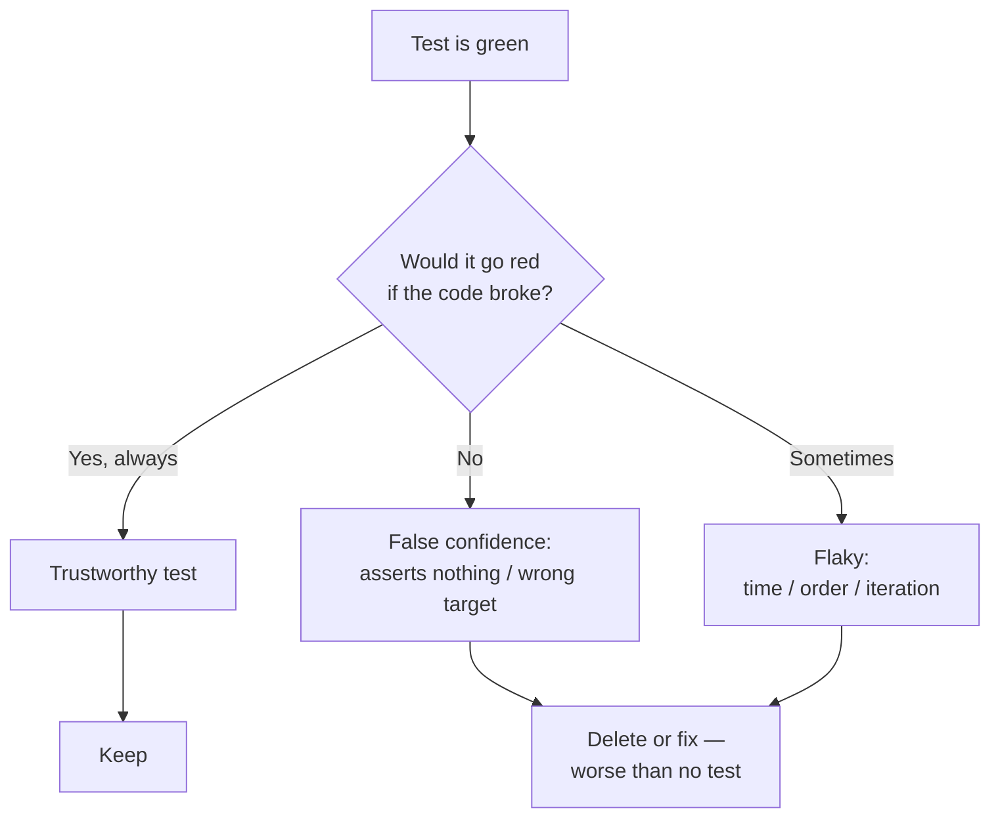

# Unit Tests — Find the Bug

> 12 snippets where the **test itself is broken**. The production code may be fine; the test gives false confidence — it passes when it shouldn't, or it can never observe the defect it claims to guard. Find what's wrong with each test, then read the fix.

A green test suite is a promise: "every behavior here is verified." A buggy test breaks that promise silently. Worse than no test — a no-op test occupies the slot where a real test would live, and its green checkmark deters anyone from writing the real one. These are the highest-leverage bugs to learn to spot, because nothing else in the pipeline catches them. The compiler is happy. CI is green. The reviewer skims past `@Test`.

---

## Table of Contents

1. [Snippet 1 — The assertion that never runs](#snippet-1--the-assertion-that-never-runs-go) (Go) · Easy
2. [Snippet 2 — Asserting a value against itself](#snippet-2--asserting-a-value-against-itself-python) (Python) · Easy
3. [Snippet 3 — The test that mocks the thing under test](#snippet-3--the-test-that-mocks-the-thing-under-test-java) (Java) · Medium
4. [Snippet 4 — Reference equality passes by accident](#snippet-4--reference-equality-passes-by-accident-go) (Go) · Medium
5. [Snippet 5 — The async test that finishes too early](#snippet-5--the-async-test-that-finishes-too-early-go) (Go) · Hard
6. [Snippet 6 — Swallowed exception hides the failure](#snippet-6--swallowed-exception-hides-the-failure-java) (Java) · Medium
7. [Snippet 7 — Order-dependent tests via shared fixture](#snippet-7--order-dependent-tests-via-shared-fixture-python) (Python) · Hard
8. [Snippet 8 — Map iteration order makes it flaky](#snippet-8--map-iteration-order-makes-it-flaky-go) (Go) · Medium
9. [Snippet 9 — Wall-clock and timezone dependence](#snippet-9--wall-clock-and-timezone-dependence-python) (Python) · Medium
10. [Snippet 10 — Coverage without verification](#snippet-10--coverage-without-verification-java) (Java) · Easy
11. [Snippet 11 — The early return that skips the assertion](#snippet-11--the-early-return-that-skips-the-assertion-python) (Python) · Medium
12. [Snippet 12 — The mock that's never wired in](#snippet-12--the-mock-thats-never-wired-in-java) (Java) · Hard

---

## How to Use

For each snippet:

1. Read the test code. Assume the production code does exactly what its name says — the bug is in the **test**.
2. Ask the diagnostic question: *if the production code were broken, would this test turn red?* If the answer is "no" or "not always," the test is buggy.
3. Form your answer before expanding the `<details>`. Predict the failure mode: false pass (green when it should be red) or flaky (red/green at random).
4. Check the fix. Note the principle — most of these violate one rule: **a test must have an observable, deterministic failure mode tied to the behavior it names.**



---

### Snippet 1 — The assertion that never runs (Go)

**Difficulty:** Easy

```go
func TestDiscountAppliedForLargeOrders(t *testing.T) {
    cart := NewCart()
    for i := 0; i < 100; i++ {
        cart.Add(Item{Price: 10.0})
    }

    total := cart.Total()

    go func() {
        if total != 900.0 { // expected 1000 - 10% bulk discount
            t.Errorf("expected 900.0, got %v", total)
        }
    }()
}
```

**What's wrong with this test?**

<details><summary>Answer</summary>

The assertion runs in a **goroutine that is never awaited**. `TestDiscountAppliedForLargeOrders` returns the instant the goroutine is launched; the test function completes and the runner moves on before the closure executes. If `total` is wrong, `t.Errorf` may run after the test is already reported as passed — and calling `t.Errorf` from a goroutine after the test has finished is itself a data race / undefined behavior, not a clean failure.

**Why it gives false confidence:** the test is green even when `Total()` returns `1000.0` (no discount applied). The assertion is real, but it never has a chance to fail the test. This is the single most common "no observable failure mode" bug in Go.

**Fix:** never assert from an un-awaited goroutine. Assert synchronously.

```go
func TestDiscountAppliedForLargeOrders(t *testing.T) {
    cart := NewCart()
    for i := 0; i < 100; i++ {
        cart.Add(Item{Price: 10.0})
    }

    total := cart.Total()

    if total != 900.0 {
        t.Errorf("expected 900.0, got %v", total)
    }
}
```

If you genuinely need concurrency in a test, use a `sync.WaitGroup` and `wg.Wait()` before the test returns, and route the assertion result back through a channel — never call `t.Errorf` from a goroutine that may outlive the test.
</details>

---

### Snippet 2 — Asserting a value against itself (Python)

**Difficulty:** Easy

```python
def test_normalize_strips_and_lowercases():
    raw = "  Hello World  "
    result = normalize(raw)
    assert result == normalize(raw)
```

**What's wrong with this test?**

<details><summary>Answer</summary>

The assertion compares the function's output **to itself**. `normalize(raw) == normalize(raw)` is true as long as `normalize` is deterministic — regardless of *what* it returns. It passes if `normalize` returns `"hello world"`, `"  Hello World  "`, `""`, or `None`. The only thing it verifies is that the function doesn't return a different value each call.

**Why it gives false confidence:** the test name promises that stripping and lowercasing happen. The assertion verifies nothing about either. A reviewer sees a named test with a real `assert` and trusts it.

This usually arises from a copy-paste mistake: the author meant to write the expected literal, pasted the call again, and never noticed because it went green immediately.

**Fix:** assert against an independent, hard-coded expected value.

```python
def test_normalize_strips_and_lowercases():
    assert normalize("  Hello World  ") == "hello world"

def test_normalize_handles_empty():
    assert normalize("   ") == ""
```

The expected value must be computed by a *different* mechanism than the code under test — ideally a human-written literal. Never derive `expected` from the same function call you are testing.
</details>

---

### Snippet 3 — The test that mocks the thing under test (Java)

**Difficulty:** Medium

```java
@Test
void shouldCalculateInterestCorrectly() {
    InterestCalculator calculator = mock(InterestCalculator.class);
    when(calculator.compute(new BigDecimal("1000"), 0.05, 2))
        .thenReturn(new BigDecimal("102.50"));

    BigDecimal result = calculator.compute(new BigDecimal("1000"), 0.05, 2);

    assertEquals(new BigDecimal("102.50"), result);
}
```

**What's wrong with this test?**

<details><summary>Answer</summary>

The class under test, `InterestCalculator`, is **mocked**. The test stubs `compute(...)` to return `102.50`, then calls `compute(...)`, then asserts it returns `102.50`. It is testing Mockito's ability to return what you told it to return. The real `compute` method body never executes.

**Why it gives false confidence:** if the real `compute` formula is wrong — say it computes simple instead of compound interest — this test stays green forever, because the real method is never invoked. The test verifies the mock, not the code.

The rule: **you mock collaborators, never the subject under test.** The subject must be a real instance.

**Fix:** instantiate the real calculator; mock only its dependencies (if any).

```java
@Test
void shouldCalculateCompoundInterestCorrectly() {
    InterestCalculator calculator = new InterestCalculator(); // real instance

    BigDecimal result = calculator.compute(new BigDecimal("1000"), 0.05, 2);

    // 1000 * (1.05^2 - 1) = 102.50
    assertEquals(0, new BigDecimal("102.50").compareTo(result));
}
```

(Note also `compareTo` instead of `equals` — `BigDecimal` `equals` is scale-sensitive, so `102.50` `!=` `102.5`. That's the bug in Snippet 4's family.)
</details>

---

### Snippet 4 — Reference equality passes by accident (Go)

**Difficulty:** Medium

```go
func TestCloneReturnsEqualConfig(t *testing.T) {
    original := &Config{Timeout: 30, Retries: 3, Tags: []string{"prod"}}

    clone := original.Clone()

    if clone != original {
        t.Error("clone should equal original")
    }
}
```

**What's wrong with this test?**

<details><summary>Answer</summary>

`clone` and `original` are both `*Config` (pointers). The comparison `clone != original` compares **pointer identity**, not the pointed-to values. A correct `Clone()` returns a *new* pointer with equal contents, so `clone != original` is `true` — and the test... reports an error. Wait — look closer: the test errors when they are *not* the same pointer, which is exactly what a correct clone produces. This test **fails for a correct implementation and passes only if `Clone` returns the original pointer (i.e., doesn't clone at all)**.

So the test is inverted in two ways. The intent was "clone has equal field values." What it actually checks is "clone is literally the same object" — which is the opposite of cloning. A broken `Clone` that just does `return original` makes this test **green**.

**Why it gives false confidence:** the most dangerous clone bug — a shallow copy that shares the underlying `Tags` slice — is invisible to a pointer comparison anyway.

**Fix:** compare values with `reflect.DeepEqual` (or field-by-field), and assert the pointers differ and the backing array is not shared.

```go
func TestCloneReturnsIndependentEqualConfig(t *testing.T) {
    original := &Config{Timeout: 30, Retries: 3, Tags: []string{"prod"}}

    clone := original.Clone()

    if clone == original {
        t.Fatal("clone must be a distinct object, not the same pointer")
    }
    if !reflect.DeepEqual(clone, original) {
        t.Errorf("clone differs in value: got %+v, want %+v", clone, original)
    }

    // Prove the slice is deep-copied, not aliased.
    clone.Tags[0] = "mutated"
    if original.Tags[0] != "prod" {
        t.Error("clone shares the Tags backing array with original")
    }
}
```
</details>

---

### Snippet 5 — The async test that finishes too early (Go)

**Difficulty:** Hard

```go
func TestEventBusDeliversToSubscriber(t *testing.T) {
    bus := NewEventBus()
    var received string

    bus.Subscribe("user.created", func(e Event) {
        received = e.Payload // handler runs on a worker goroutine
    })

    bus.Publish(Event{Topic: "user.created", Payload: "alice"})

    if received != "alice" {
        t.Errorf("expected 'alice', got %q", received)
    }
}
```

**What's wrong with this test?**

<details><summary>Answer</summary>

`Publish` dispatches to subscribers **asynchronously** on a worker goroutine. The assertion runs on the test goroutine immediately after `Publish` returns — almost always *before* the handler has had a chance to set `received`. So `received` is still `""` at assertion time.

If the test passes, it's worse than failing: it means the handler happened to win the race on this machine, this run. On CI it may flake red; locally it may flake green. There is also a **data race**: `received` is written from the worker goroutine and read from the test goroutine with no synchronization — `go test -race` would flag it.

**Why it gives false confidence:** when it's green, the author concludes "delivery works." It doesn't prove delivery; it proves a timing coincidence. A broken bus that never calls the handler would also leave `received == ""` and fail — but for the wrong reason, and intermittently.

**Fix:** synchronize. Have the handler signal completion, and wait with a timeout so a genuinely-broken bus fails deterministically instead of hanging.

```go
func TestEventBusDeliversToSubscriber(t *testing.T) {
    bus := NewEventBus()
    done := make(chan string, 1)

    bus.Subscribe("user.created", func(e Event) {
        done <- e.Payload
    })

    bus.Publish(Event{Topic: "user.created", Payload: "alice"})

    select {
    case got := <-done:
        if got != "alice" {
            t.Errorf("expected 'alice', got %q", got)
        }
    case <-time.After(time.Second):
        t.Fatal("handler was never called within 1s")
    }
}
```

The channel both synchronizes the read and gives a clean, deterministic timeout failure if delivery never happens.
</details>

---

### Snippet 6 — Swallowed exception hides the failure (Java)

**Difficulty:** Medium

```java
@Test
void shouldRejectWithdrawalAboveBalance() {
    Account account = new Account(new BigDecimal("100"));

    try {
        account.withdraw(new BigDecimal("500"));
        // should throw InsufficientFundsException
    } catch (InsufficientFundsException e) {
        // expected
    }
}
```

**What's wrong with this test?**

<details><summary>Answer</summary>

If `withdraw` **fails to throw** — i.e., the production bug is real and an over-limit withdrawal is wrongly allowed — the `try` block completes normally, the `catch` is skipped, and the test method returns without any assertion. **Green.** The test only fails if some *other* unexpected exception escapes, which is not what it's testing.

The catch-and-ignore pattern means the test can never observe the absence of the expected exception. It passes both when the code is correct and when the code is broken in exactly the way the test claims to guard against.

**Why it gives false confidence:** this looks like a careful "expected exception" test. It is the inverse — it guarantees a pass regardless of behavior.

**Fix:** assert that the exception is thrown. Modern JUnit makes this declarative and impossible to get wrong.

```java
@Test
void shouldRejectWithdrawalAboveBalance() {
    Account account = new Account(new BigDecimal("100"));

    assertThrows(
        InsufficientFundsException.class,
        () -> account.withdraw(new BigDecimal("500"))
    );
    // Balance must be untouched after a rejected withdrawal.
    assertEquals(0, new BigDecimal("100").compareTo(account.balance()));
}
```

`assertThrows` fails the test if no exception (or the wrong type) is thrown. If you must use a try/catch, add `fail("expected InsufficientFundsException")` as the last line of the `try`.
</details>

---

### Snippet 7 — Order-dependent tests via shared fixture (Python)

**Difficulty:** Hard

```python
class TestUserRegistry:
    registry = UserRegistry()  # class attribute — shared across all tests

    def test_add_user(self):
        self.registry.add(User("alice"))
        assert self.registry.count() == 1

    def test_remove_user(self):
        self.registry.add(User("bob"))
        self.registry.remove("bob")
        assert self.registry.count() == 1  # alice still here from test_add_user
```

**What's wrong with this test?**

<details><summary>Answer</summary>

`registry` is a **class attribute**, so it is one shared, mutable object across every method in the class. `test_remove_user` asserts `count() == 1` — but that `1` is `alice`, leaked in from `test_add_user`. The two tests are coupled through shared state.

This produces several failure modes, all bad:

- **Order dependence.** Run `test_remove_user` alone (`pytest -k test_remove_user`) and it fails: only `bob` was added and then removed, so `count()` is `0`, not `1`. The test only passes when `test_add_user` runs first.
- **False confidence.** When the full class runs in definition order, both pass — encoding the leak as if it were correct behavior.
- **Parallelism / shuffling breaks it.** `pytest-randomly` or `pytest-xdist` reorders tests; the suite goes red non-deterministically.

The assertion `count() == 1` in `test_remove_user` is *wrong on its own terms* — it should be `0` — but the shared fixture papered over the mistake.

**Why it gives false confidence:** each test looks self-contained. The bug only surfaces under isolation or reordering, which most authors never try.

**Fix:** give each test a fresh fixture. Use `setup_method` (or a pytest fixture) so state never crosses test boundaries.

```python
class TestUserRegistry:
    def setup_method(self):
        self.registry = UserRegistry()  # fresh instance per test

    def test_add_user(self):
        self.registry.add(User("alice"))
        assert self.registry.count() == 1

    def test_remove_user(self):
        self.registry.add(User("bob"))
        self.registry.remove("bob")
        assert self.registry.count() == 0  # now correct
```
</details>

---

### Snippet 8 — Map iteration order makes it flaky (Go)

**Difficulty:** Medium

```go
func TestFormatHeadersProducesCanonicalString(t *testing.T) {
    headers := map[string]string{
        "Content-Type": "application/json",
        "Accept":       "application/json",
        "X-Request-Id": "abc123",
    }

    result := FormatHeaders(headers) // iterates the map, joins with "; "

    expected := "Content-Type: application/json; Accept: application/json; X-Request-Id: abc123"
    if result != expected {
        t.Errorf("got %q, want %q", result, expected)
    }
}
```

**What's wrong with this test?**

<details><summary>Answer</summary>

Go **randomizes map iteration order** by design. If `FormatHeaders` simply ranges over the map, the output order varies run to run. The `expected` string hard-codes one particular order, so the test passes only when iteration happens to match — perhaps 1 in 6 runs for three keys. It is flaky: red and green at random.

There are two possible underlying realities, and the test distinguishes neither cleanly:

1. `FormatHeaders` is supposed to be order-independent → the test is wrong to assert a fixed order.
2. `FormatHeaders` is supposed to produce a canonical (sorted) order → then *the production code* has a bug (it doesn't sort), and the test should assert the sorted result deterministically.

**Why it gives false confidence:** on a developer's machine it may pass several times in a row, get committed, then flake in CI — eroding trust in the whole suite ("just re-run it").

**Fix:** decide on the contract. If order shouldn't matter, compare as a set. If a canonical order is required, make the code sort and assert the sorted string.

```go
// Contract: headers are emitted in sorted key order.
func TestFormatHeadersIsCanonical(t *testing.T) {
    headers := map[string]string{
        "Content-Type": "application/json",
        "Accept":       "application/json",
        "X-Request-Id": "abc123",
    }

    result := FormatHeaders(headers)

    // Accept < Content-Type < X-Request-Id
    expected := "Accept: application/json; Content-Type: application/json; X-Request-Id: abc123"
    if result != expected {
        t.Errorf("got %q, want %q", result, expected)
    }
}
```

If order truly doesn't matter, split on `"; "`, sort both slices, and compare — never assert a fixed order against an unordered source.
</details>

---

### Snippet 9 — Wall-clock and timezone dependence (Python)

**Difficulty:** Medium

```python
from datetime import datetime, timedelta

def test_token_expires_after_one_hour():
    token = issue_token(user_id=42)
    # issue_token sets token.expires_at = datetime.now() + timedelta(hours=1)
    assert token.expires_at > datetime.now()
    assert token.expires_at.hour == (datetime.now().hour + 1) % 24
```

**What's wrong with this test?**

<details><summary>Answer</summary>

Two clock-dependent flaws:

1. **The `.hour` assertion is a midnight time bomb.** `datetime.now()` is evaluated twice — once inside `issue_token`, once in the assertion. If the test runs at, say, `23:59:59.9`, `issue_token`'s `now()` may land in one hour and the assertion's `now()` a fraction of a second later in the next minute or hour, breaking the arithmetic. The `% 24` handles the day boundary numerically but not the two-reads race.
2. **`> datetime.now()` is non-deterministic and weak.** It only checks "expires in the future," which would pass even if expiry were 1 second or 10 years out — it does not verify "one hour."
3. **Naive `datetime` ignores timezone.** If `issue_token` ever switches to `datetime.utcnow()` or a tz-aware time while the test uses local `now()`, comparisons silently shift by the UTC offset.

So the test is simultaneously flaky (rare midnight failures) and too weak (never actually pins one hour).

**Why it gives false confidence:** it's green ~99.99% of runs, then fails once at a release cut near midnight, and someone "fixes" it with a retry.

**Fix:** inject the clock. Make time a dependency so the test controls it exactly.

```python
def test_token_expires_exactly_one_hour_after_issue():
    fixed_now = datetime(2026, 1, 1, 12, 0, 0)
    clock = lambda: fixed_now  # injected, deterministic

    token = issue_token(user_id=42, now=clock)

    assert token.expires_at == fixed_now + timedelta(hours=1)
```

Now the assertion is exact, deterministic, and timezone-stable because both sides use the same injected instant. Production passes a real clock; the test passes a frozen one.
</details>

---

### Snippet 10 — Coverage without verification (Java)

**Difficulty:** Easy

```java
@Test
void exercisesTheReportGenerator() {
    ReportGenerator generator = new ReportGenerator(salesData);

    generator.generateMonthly();
    generator.generateQuarterly();
    generator.generateAnnual();

    // (no assertions)
}
```

**What's wrong with this test?**

<details><summary>Answer</summary>

There are **no assertions**. The test calls three methods and ends. It passes as long as none of them throws. It "covers" every line inside the three generators — coverage tools will color them green — but it verifies nothing about the *output*. A report generator that returns blank PDFs, wrong totals, or last year's numbers passes this test.

This is the coverage-inflation anti-pattern: a test written to hit a coverage target, not to verify behavior. It actively harms — the 90% coverage badge implies those lines are tested when they are merely executed.

**Why it gives false confidence:** dashboards show green coverage; the suite shows green tests; both are lying about correctness.

**Fix:** assert the observable result of each call. Execution without observation is not a test.

```java
@Test
void monthlyReportSumsSalesForTheMonth() {
    ReportGenerator generator = new ReportGenerator(januarySales);

    Report report = generator.generateMonthly();

    assertEquals(new BigDecimal("12500.00"), report.total());
    assertEquals(31, report.dayCount());
    assertEquals("January 2026", report.period());
}
```

If a method returns `void` and has no observable output, assert its side effect (a stored row, an emitted event, a changed field). If it has neither return value nor observable effect, ask whether it does anything worth testing.
</details>

---

### Snippet 11 — The early return that skips the assertion (Python)

**Difficulty:** Medium

```python
def test_premium_users_get_priority_support(users):
    for user in users:
        if not user.is_premium:
            return  # skip non-premium users
        assert user.support_tier == "priority"
```

**What's wrong with this test?**

<details><summary>Answer</summary>

The `return` exits the **entire test function**, not just the current iteration. The author meant `continue` (skip this user) but wrote `return` (abandon the test). If the very first user in `users` is non-premium, the function returns immediately and the assertion never runs — the test passes having checked nothing.

Even with `continue`, there's a second latent bug: if `users` happens to contain *no* premium users, the loop body's assertion never executes and the test passes vacuously. A test that can pass without ever evaluating its assertion is not a test.

**Why it gives false confidence:** for most fixtures it appears to work; reorder the fixture so a free user comes first and the test silently stops verifying.

**Fix:** filter explicitly, assert the subset is non-empty, then assert on every relevant element. Better, parametrize so each case is independent.

```python
import pytest

@pytest.mark.parametrize("user", [u for u in ALL_USERS if u.is_premium])
def test_premium_users_get_priority_support(user):
    assert user.support_tier == "priority"
```

If a loop is unavoidable, guard against the vacuous case:

```python
def test_premium_users_get_priority_support(users):
    premium = [u for u in users if u.is_premium]
    assert premium, "fixture must contain at least one premium user"
    for user in premium:
        assert user.support_tier == "priority", f"{user.id} had {user.support_tier}"
```
</details>

---

### Snippet 12 — The mock that's never wired in (Java)

**Difficulty:** Hard

```java
@Test
void shouldChargeCustomerWhenOrderPlaced() {
    PaymentGateway gateway = mock(PaymentGateway.class);
    when(gateway.charge(any(), any())).thenReturn(PaymentResult.success("txn-1"));

    // OrderService constructs its own gateway internally:
    OrderService service = new OrderService();

    service.placeOrder(new Order("cust-1", new BigDecimal("99.99")));

    verify(gateway).charge(eq("cust-1"), eq(new BigDecimal("99.99")));
}
```

**What's wrong with this test?**

<details><summary>Answer</summary>

The mock `gateway` is created and stubbed, but it is **never injected** into `OrderService`. `new OrderService()` builds its own internal gateway (or a static/real one), so `placeOrder` calls a *different* object than the one the test holds. The mock records no interactions.

The `verify(gateway).charge(...)` line should fail — and it would, except for the deeper problem: the test never proves the *real* charge happened. If `OrderService` uses a real gateway, `placeOrder` may hit a live payment API during the unit run (slow, flaky, and possibly charging real money). If it uses an internal stub that silently no-ops, `verify` against the unrelated mock fails for a confusing reason, and someone "fixes" it by deleting the `verify` — leaving a test that places an order and checks nothing.

This is the over-coupling / no-seam problem: a class that constructs its own dependencies cannot be tested in isolation.

**Why it gives false confidence:** the test *looks* like a proper interaction test with a mock and a `verify`. The mock is decorative — disconnected from the object under test.

**Fix:** inject the dependency (constructor injection) so the test's mock is the one actually used.

```java
@Test
void shouldChargeCustomerWhenOrderPlaced() {
    PaymentGateway gateway = mock(PaymentGateway.class);
    when(gateway.charge(any(), any())).thenReturn(PaymentResult.success("txn-1"));

    OrderService service = new OrderService(gateway); // injected seam

    service.placeOrder(new Order("cust-1", new BigDecimal("99.99")));

    verify(gateway).charge(eq("cust-1"), eq(new BigDecimal("99.99")));
}
```

The fix is as much a design change as a test change — `OrderService` must accept its `PaymentGateway`. Hard-to-test code is usually telling you about a missing seam, not a missing test trick.
</details>

---

## Scorecard

| # | Title | Lang | Failure mode | Root cause |
|---|-------|------|--------------|------------|
| 1 | Assertion that never runs | Go | False pass | Assertion in un-awaited goroutine |
| 2 | Value asserted against itself | Python | False pass | Expected derived from the code under test |
| 3 | Mocks the thing under test | Java | False pass | Subject is mocked, not collaborator |
| 4 | Reference equality by accident | Go | Inverted / weak | Pointer compare instead of value compare |
| 5 | Async finishes too early | Go | Flaky + race | No synchronization before assertion |
| 6 | Swallowed exception | Java | False pass | catch-and-ignore, no failure when not thrown |
| 7 | Order-dependent fixture | Python | Order-dependent | Shared mutable class-level state |
| 8 | Map iteration order | Go | Flaky | Asserts fixed order on unordered source |
| 9 | Wall-clock / timezone | Python | Flaky + weak | Reads `now()` instead of injected clock |
| 10 | Coverage without verification | Java | False pass | No assertions at all |
| 11 | Early return skips assertion | Python | False/vacuous pass | `return` instead of `continue`; vacuous loop |
| 12 | Mock never wired in | Java | False pass / live call | Dependency not injected; no seam |

**Score yourself:**

- **10–12 found:** You read tests adversarially. You'd catch these in review before they rot the suite.
- **6–9 found:** Solid. Re-read the flaky ones (5, 8, 9) — non-determinism is the hardest class to spot statically.
- **3–5 found:** You're catching the obvious no-op tests. Practice the diagnostic question on every test: *would this go red if the code broke?*
- **0–2 found:** Start with the rule that catches most of these — a test must have an **observable, deterministic failure mode** tied to the behavior in its name.

The unifying lesson: a passing test is only evidence if it could have failed. For every test you write, mentally break the production code and confirm the test turns red. If you can't make it fail, it isn't testing anything.

---

## Related Topics

- [junior.md](junior.md) — the definition: what a unit test is and the qualities of a trustworthy one
- [tasks.md](tasks.md) — exercises to write tests with real, observable failure modes
- [Unit Tests chapter README](../README.md) — the positive rules these snippets violate
- [Anti-Patterns](../../anti-patterns/README.md) — broader catalog of practices to recognize and avoid
- [Refactoring](../../refactoring/README.md) — Snippet 7 and 12 are as much design fixes (seams, isolation) as test fixes
