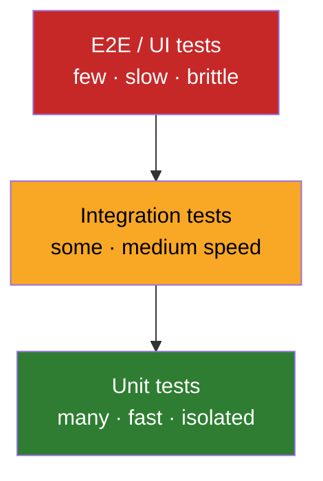
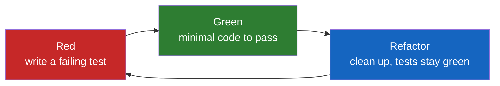

# Unit Tests — Interview Questions

> 50+ questions grouped by tier (Junior → Staff). On the harder ones, "what the interviewer is really checking" calls out the signal behind the question. Use for self-review or interview prep.

---

## Table of Contents

- [Junior (15)](#junior-15)
- [Mid (15)](#mid-15)
- [Senior (14)](#senior-14)
- [Staff (10)](#staff-10)
- [Trick Questions](#trick-questions)
- [Rapid-Fire](#rapid-fire)
- [Summary](#summary)
- [Further Reading](#further-reading)
- [Related Topics](#related-topics)

---

## Junior (15)

### J1. What is a unit test?

<details><summary>Answer</summary>

An automated test that exercises one *unit of behavior* in isolation, runs in milliseconds, and gives a binary pass/fail. "Unit" means a behavior, not necessarily a single class or method — a small cluster of collaborators that together produce one observable outcome counts as one unit.
</details>

### J2. What does F.I.R.S.T. stand for?

<details><summary>Answer</summary>

- **Fast** — milliseconds, so you run them constantly.
- **Independent** — no test depends on another's state or ordering.
- **Repeatable** — same result in any environment, any time.
- **Self-validating** — pass/fail with no manual inspection of output.
- **Timely** — written alongside (or before) the production code, not months later.
</details>

### J3. What is the AAA pattern?

<details><summary>Answer</summary>

**Arrange–Act–Assert.** Arrange the inputs and dependencies, Act by invoking the behavior once, Assert on the outcome. Three visually distinct blocks make a test readable at a glance. The behavioral-spec equivalent is **Given–When–Then**.
</details>

### J4. Given–When–Then vs Arrange–Act–Assert — same thing?

<details><summary>Answer</summary>

Structurally identical. AAA comes from the xUnit/TDD tradition; Given–When–Then from BDD (Cucumber, Gherkin). GWT emphasizes business-readable phrasing and is common at the acceptance level; AAA is the everyday unit-test idiom. Pick one vocabulary per codebase.
</details>

### J5. Why should tests be fast?

<details><summary>Answer</summary>

A suite you run on every save changes how you work — fast feedback catches mistakes within seconds. A suite that takes ten minutes gets run only in CI, so bugs are found long after they were introduced, when the context is gone. Speed is what makes tests a *design tool* rather than a *gate*.
</details>

### J6. What does "test isolation" mean?

<details><summary>Answer</summary>

Each test sets up its own state, runs, and tears down without leaking into others. No shared mutable globals, no reliance on execution order, no DB rows left behind. Isolation is what makes a failure pinpoint a cause instead of cascading across the suite.
</details>

### J7. What's the difference between testing behavior and testing implementation?

<details><summary>Answer</summary>

Behavior tests assert on *observable outcomes* through the public API — given this input, you get that output or that side effect. Implementation tests assert on *how* the code did it — which private method ran, what internal field changed. Behavior tests survive refactoring; implementation tests break the moment you touch internals, even when behavior is unchanged.

**What the interviewer is really checking:** whether you understand that tests are a contract on *what*, not *how* — the single biggest factor in whether a suite helps or hinders refactoring.
</details>

### J8. What is a fixture?

<details><summary>Answer</summary>

The known, fixed state a test runs against — the objects, data, and dependencies set up before the Act step. Shared setup lives in a `setUp`/`@BeforeEach` method or a builder, but only when it genuinely applies to every test in the group.
</details>

### J9. What is a test double?

<details><summary>Answer</summary>

A generic term (coined by Gerard Meszaros) for any object that stands in for a real dependency in a test. Subtypes: **dummy, stub, spy, mock, fake**.
</details>

### J10. What's the difference between a stub and a mock?

<details><summary>Answer</summary>

A **stub** *provides* canned answers to calls — it feeds the test (state-based). A **mock** *verifies* that calls happened a certain way — it has expectations you assert against (interaction-based). Stub: "when asked for the price, return 10." Mock: "the gateway's `charge()` must be called exactly once with this amount."
</details>

### J11. Name the five test doubles in one line each.

<details><summary>Answer</summary>

- **Dummy** — passed but never used; fills a parameter slot.
- **Stub** — returns hardcoded answers to indirect inputs.
- **Spy** — a stub that also records how it was called, for later inspection.
- **Mock** — pre-programmed with expectations and self-verifies them.
- **Fake** — a working but simplified implementation (e.g., an in-memory repository).
</details>

### J12. What is the test pyramid?

<details><summary>Answer</summary>

A heuristic (Mike Cohn) for test distribution: **many** fast unit tests at the base, **fewer** integration tests in the middle, **few** end-to-end tests at the top. The shape reflects that higher-level tests are slower, more brittle, and more expensive to maintain, so most coverage belongs where it is cheapest.


</details>

### J13. What's the "ice-cream cone" anti-pattern?

<details><summary>Answer</summary>

The pyramid inverted: lots of slow E2E/manual tests at the top and few unit tests at the bottom. Symptoms — a 40-minute CI run, flaky browser tests, and developers afraid to refactor because nothing fast tells them what broke.
</details>

### J14. What is a flaky test?

<details><summary>Answer</summary>

A test that passes and fails non-deterministically on the same code. Causes: reliance on wall-clock time, random data, network/disk, shared state, or thread timing. A flaky test is worse than no test — it trains the team to ignore red, so a real failure gets waved through.
</details>

### J15. Should a test ever depend on the order tests run in?

<details><summary>Answer</summary>

No. Order dependence violates the *Independent* in F.I.R.S.T. Each test must set up everything it needs and clean up after itself. Many runners deliberately randomize order to surface hidden coupling — if your suite breaks under shuffle, it is already broken.
</details>

---

## Mid (15)

### M1. What are the three laws of TDD?

<details><summary>Answer</summary>

Uncle Bob's formulation:
1. Write no production code until you have a failing test.
2. Write no more of a test than is sufficient to fail (a compile error counts).
3. Write no more production code than is sufficient to pass the current failing test.

The cycle they enforce is **Red → Green → Refactor**: make it fail, make it pass minimally, then clean up with the safety net in place.
</details>

### M2. "One assert per test" — agree or disagree?

<details><summary>Answer</summary>

The principle is better stated as **one *concept* per test**. Multiple `assert` lines that all verify a single logical outcome (e.g., the three fields of a parsed address) are fine and readable. What you avoid is one test verifying *unrelated* concerns — when the first fails, you never learn about the rest, and the test name can't describe what it checks.

**What the interviewer is really checking:** whether you parrot a rule or understand its intent. The literal rule causes assertion-counting silliness; the concept-based reading is what experienced engineers apply.
</details>

### M3. When do you use a fake instead of a mock?

<details><summary>Answer</summary>

Use a **fake** when the dependency has meaningful behavior you want to exercise without the real cost — an in-memory repository, an in-memory clock, a test SMTP server. Fakes give state-based tests that read naturally and don't couple to call sequences. Reach for a **mock** only when the *interaction itself* is the behavior under test (e.g., "we must publish exactly one event").
</details>

### M4. What is the difference between a classicist and a mockist?

<details><summary>Answer</summary>

Two TDD schools (Fowler's terms). **Classicists** (Detroit/Chicago school) use real objects and fakes wherever possible, mocking only awkward collaborators; they test through state. **Mockists** (London school) mock all collaborators and test interactions, driving design outside-in. Classicist tests are more refactoring-resilient; mockist tests give finer design feedback but couple to call structure.
</details>

### M5. Why is high coverage not the same as good tests?

<details><summary>Answer</summary>

Coverage measures lines *executed*, not behavior *verified*. You can run every line and assert nothing — 100% coverage, zero protection. Coverage is a guide that finds *untested* code; it cannot tell you the *tested* code is meaningfully tested. Use it to spot gaps, never as a quality score.
</details>

### M6. How do you test code that depends on the current time?

<details><summary>Answer</summary>

Inject the clock. Pass a `Clock` abstraction (Java `java.time.Clock`, Go `func() time.Time` or an interface, a fakeable `now()` in Python) instead of calling the system clock directly. Tests supply a fixed or controllable clock. Never `sleep()` to wait for time to pass — that makes tests slow and flaky.
</details>

### M7. How do you test code that uses randomness?

<details><summary>Answer</summary>

Inject the source of randomness (a seeded RNG or a `Random`/`rand.Source` passed in), so tests are deterministic. For properties that must hold across *all* inputs (e.g., "shuffle preserves elements"), use property-based testing with a fixed seed so failures are reproducible.
</details>

### M8. What does "Arrange" smell of when it's huge?

<details><summary>Answer</summary>

A large Arrange block signals the unit under test has too many dependencies or the test is at the wrong level. Cures: extract a **Test Data Builder** with sane defaults so each test overrides only what differs; introduce fakes; or split the production class (a setup-heavy test often points at an SRP violation). Setup longer than the test itself is a documented anti-pattern.
</details>

### M9. What should you generally NOT unit-test?

<details><summary>Answer</summary>

- Third-party/library code you don't own (test your *use* of it via integration tests instead).
- Trivial getters/setters and auto-generated code.
- Framework wiring with no logic.
- Pure configuration.

Test the behavior *you* wrote and own. Tautological tests (mock returns X, assert you got X) verify the mock, not your code.
</details>

### M10. How do you make a flaky test deterministic?

<details><summary>Answer</summary>

Find the source of nondeterminism and remove it: inject the clock and RNG; replace `sleep`-based waits with explicit synchronization or polling with a deadline; isolate shared state; pin ordering-independent data structures. If a test stays flaky, quarantine it loudly (not silently skip) and fix the root cause — never add a retry to mask it.
</details>

### M11. What is a Test Data Builder and why use one?

<details><summary>Answer</summary>

A builder pre-configured with valid defaults that tests tweak only as needed:

```java
User u = aUser().withRole("admin").build();
```

It keeps tests focused on the one attribute that matters, gives a single source of truth for "a valid User," and survives schema changes (add a field → change the builder, not 200 tests). See the Builder pattern.
</details>

### M12. What's the problem with asserting on log output or private fields?

<details><summary>Answer</summary>

Both couple the test to implementation. Logs are diagnostics, not contracts — reformatting a message shouldn't fail a test. Private fields are internal state that refactoring is free to change. Assert on the observable behavior the caller actually depends on; if a private detail has no observable effect, it doesn't need a test.
</details>

### M13. How should you name a test?

<details><summary>Answer</summary>

So the name reads as a specification of behavior: `withdraw_failsWhenBalanceInsufficient`, or `should_reject_expired_token`. A good name tells you what broke from the failure report alone, without opening the file. Avoid `test1`, `testWithdraw` — they describe the method, not the behavior.
</details>

### M14. What is the difference between a spy and a mock?

<details><summary>Answer</summary>

A **spy** records calls passively; you inspect the recording *after* the Act step and assert on it (state-then-verify). A **mock** carries expectations *set up before* the Act and verifies them itself. Practically, spies fit AAA cleanly (assert at the end); mocks front-load expectations. Many frameworks blur the line (`verify()` on a Mockito mock is spy-like usage).
</details>

### M15. Why write the test first in TDD?

<details><summary>Answer</summary>

Writing the test first forces you to use the API before it exists, so you design for the caller, not the implementation. It guarantees the test can actually fail (a test never seen red is suspect), keeps scope tight (you write only what's needed to pass), and yields tests-as-documentation as a byproduct.
</details>

---

## Senior (14)

### S1. Why do mockist tests break more often during refactoring?

<details><summary>Answer</summary>

Mockist tests assert on *interactions* — which collaborator was called, with what, how many times. Refactoring changes interactions even when behavior is unchanged: you split a method, route a call through a new collaborator, batch two calls into one. Every such change reds the mock-heavy tests, producing "refactoring tax." State-based tests on observable outcomes don't notice the rewiring.

**What the interviewer is really checking:** whether you've felt the long-term maintenance cost of over-mocking, not just the short-term convenience.
</details>

### S2. What is mutation testing and what does it tell you that coverage can't?

<details><summary>Answer</summary>

Mutation testing (PIT, Stryker, mutmut) introduces small faults into production code — flip a `<` to `<=`, negate a condition, swap `+`/`-` — and reruns your tests. A "killed" mutant means some test failed (good); a "survived" mutant means *no test noticed the bug* (your tests are weak there). It measures the *fault-detecting power* of the suite, which line coverage cannot. Cost: runtime, since it reruns tests per mutant.
</details>

### S3. What is property-based testing and when is it worth it?

<details><summary>Answer</summary>

Instead of fixed examples, you state an *invariant* and the framework (QuickCheck, Hypothesis, jqwik, gopter) generates hundreds of random inputs, then *shrinks* any failure to a minimal counterexample. Worth it for: round-trips (`decode(encode(x)) == x`), algebraic laws (commutativity, idempotence), parsers, and anything with a broad input space example tests can't cover. Pairs with example tests, doesn't replace them. In short: assert the law, let the generator hunt the edge case.
</details>

### S4. Is 100% code coverage the goal?

<details><summary>Answer</summary>

No. Coverage is a *guide, not a goal*. Chasing 100% buys diminishing returns and incentivizes assertion-free tests that hit lines without checking behavior — Goodhart's law: when a measure becomes a target, it stops being a good measure. Aim for high coverage of *important* logic and accept that some glue/config code isn't worth testing. A team that mandates 100% usually ends up with worse tests, not better code.

**What the interviewer is really checking:** that you treat metrics as feedback, not as the objective, and can resist a tempting-but-wrong "yes."
</details>

### S5. Should you test private methods?

<details><summary>Answer</summary>

No — test them *through* the public API that uses them. If a private method has logic complex enough that you feel the urge to test it directly, that's a design signal: it likely wants to be a public method on a *separate* collaborator (extract class). Testing privates directly couples tests to implementation and blocks the very refactoring that would improve the design.
</details>

### S6. How do you test concurrent code?

<details><summary>Answer</summary>

You can't reliably prove concurrency correct with ordinary unit tests because schedules are nondeterministic. Strategies: (1) keep concurrency at the edges and unit-test pure logic separately; (2) use deterministic schedulers or controllable executors to force interleavings; (3) stress/loop tests with thread sanitizers (Go `-race`, Java's jcstress, TSan) to *surface* races probabilistically; (4) model-check critical protocols (TLA+) for the hard cases. Treat passing concurrency tests as evidence, not proof.
</details>

### S7. What is the difference between solitary and sociable unit tests?

<details><summary>Answer</summary>

Fowler's terms. A **solitary** test isolates the unit from all collaborators using doubles. A **sociable** test lets the unit use its real collaborators (often with only the outermost boundary faked). Classicists favor sociable; mockists favor solitary. Sociable tests catch integration bugs between your own classes that solitary tests mock away.
</details>

### S8. When is mocking the wrong choice?

<details><summary>Answer</summary>

When you mock types you don't own (the mock encodes your *assumptions* about the library, which drift from reality), when you mock value objects (just construct them), and when the mock setup restates the implementation line-by-line (the test becomes a change-detector, not a behavior check). "Don't mock what you don't own" — wrap third-party APIs behind your own interface and mock that, or test against a real/fake instance.
</details>

### S9. Is TDD always required?

<details><summary>Answer</summary>

No. TDD is a powerful default, especially for logic with clear inputs/outputs, but it's a tool, not a religion. Exploratory/spike work, UI tweaking, and code where the design is genuinely unknown can be faster test-after — *as long as the tests get written*. What's non-negotiable is that shipped behavior has tests; *when* you write them is a judgment call. Beware teams that use "we don't always TDD" as cover for "we don't test."

**What the interviewer is really checking:** whether you hold dogma or can reason about cost/benefit and still insist on the outcome (tested code) regardless of process.
</details>

### S10. How do you decide what level to test a behavior at?

<details><summary>Answer</summary>

Test at the *lowest level that can fully express the behavior and its edge cases*. Branch-heavy domain logic → unit. Wiring/serialization/SQL correctness → integration. Critical user journeys → a thin layer of E2E. Pushing a test down the pyramid makes it faster and more stable; pushing it up gives confidence the pieces connect. The art is testing each concern *once*, at the right level, not everywhere.
</details>

### S11. What is a "change-detector" test and why is it bad?

<details><summary>Answer</summary>

A test so tightly coupled to implementation that *any* code change breaks it, even refactors that preserve behavior. It detects *change*, not *defects*. The team learns to update the test mechanically to match the code — at which point the test verifies nothing and adds friction. The fix is to assert on behavior through stable interfaces.
</details>

### S12. How do you keep a large test suite fast?

<details><summary>Answer</summary>

Keep the bulk as true unit tests (no I/O). Run them in parallel (requires isolation). Use in-memory fakes instead of real infra in the unit tier. Reserve DB/network for a smaller integration tier run less often or sharded. Profile the suite — a handful of slow tests usually dominate; move or fix them. Budget per-test time (e.g., fail anything over 50ms in the unit tier).
</details>

### S13. How do tests interact with refactoring safety?

<details><summary>Answer</summary>

Behavior-focused tests are the *enabler* of refactoring — they let you restructure internals and confirm behavior is unchanged in seconds. Implementation-focused tests do the opposite: they make refactoring expensive because every internal change reds tests, so people stop refactoring and rot sets in. The quality of your test suite directly governs how malleable your codebase stays. See [refactoring](../../refactoring/README.md).
</details>

### S14. What's the relationship between testability and good design?

<details><summary>Answer</summary>

Hard-to-test code is usually badly designed code. Pain points map directly: can't construct it (too many dependencies → SRP/DI problem); must mock statics/singletons (hidden global coupling); can't observe the outcome (no clear output, side effects buried). TDD surfaces these early because the test is the first client of the design. Testability is a *proxy* for low coupling and high cohesion.
</details>

---

## Staff (10)

### St1. How do you set an organization-wide testing strategy without mandating a coverage number?

<details><summary>Answer</summary>

Define outcomes, not metrics: every change is reviewable with a fast feedback loop; the unit tier runs in under a few minutes; flaky tests are tracked and budgeted like incidents. Encode the pyramid as guidance, fund a stable integration environment, and measure *escaped defects* and *refactoring confidence* (survey + change-failure rate) rather than coverage. Use coverage as a code-review conversation prompt, not a gate. The goal is a culture where tests are trusted, so red means stop.
</details>

### St2. How do you manage flaky tests at scale?

<details><summary>Answer</summary>

Treat flakiness as a first-class signal. Detect it automatically (rerun-on-fail with tracking, or dedicated flaky-detection that reruns recently-changed tests). Quarantine flaky tests out of the blocking path but *visibly*, with an owner and SLA — never silently `@Ignore`. Track flaky rate as a health metric. Invest in the common root causes (shared clocks, shared DB, async waits) at the framework level so individual teams don't re-solve them.
</details>

### St3. When is end-to-end testing worth its cost, and how do you bound it?

<details><summary>Answer</summary>

E2E is worth it for a *thin* set of revenue-critical user journeys where the cost of silent breakage is high and only the fully-wired system can prove correctness (checkout, login, payment). Bound it by: testing each journey *once*, keeping the count in the tens not thousands, running them on a stable pre-prod environment, and pairing them with synthetic monitoring in production. Everything a lower tier can verify should not be re-verified at E2E.
</details>

### St4. How do you test a system clock, randomness, and concurrency together in a scheduler?

<details><summary>Answer</summary>

Push all three nondeterministic sources behind injected seams: a `Clock`, a seeded RNG, and a controllable executor/scheduler. The scheduler logic then becomes deterministic — you advance a *virtual clock*, the executor runs tasks synchronously in a test, and the RNG is seeded. This converts a flaky integration concern into a fast, repeatable unit test. The real clock/threads/RNG are wired only in production and covered by a thin sociable test.
</details>

### St5. How do you evolve a legacy codebase with no tests toward testability?

<details><summary>Answer</summary>

Start with **characterization tests** (Feathers): pin current behavior at a coarse boundary so you can refactor without changing it. Find a *seam* — a place to substitute a dependency without editing the code under test. Break dependencies with the smallest safe move (extract interface, parameterize constructor). Add focused unit tests as you carve out each unit. Never try to "add tests everywhere" up front; add them where you're about to change code. See [refactoring code smells](../../refactoring/README.md).
</details>

### St6. Mutation score is low but coverage is high — what do you do?

<details><summary>Answer</summary>

High coverage with low mutation score means tests *execute* code but don't *check* it — assertion-free or weak-assertion tests. Triage: look at surviving mutants, identify the behaviors with no real assertion, and strengthen those tests. Don't chase 100% mutation score (equivalent mutants and diminishing returns make it impractical); target the high-value logic. Treat mutation testing as a periodic audit, not a per-commit gate, because of its cost.
</details>

### St7. How do contract tests fit between unit and E2E?

<details><summary>Answer</summary>

Contract tests (Pact, Spring Cloud Contract) verify that two services agree on an interface *without* spinning up both. The consumer records expectations; the provider verifies it satisfies them. This catches integration breakage that mocked unit tests miss and E2E catches too late and too slowly. They let each service deploy independently with confidence — the pyramid's answer to "my mocks lie about the other service."
</details>

### St8. How do you stop the team from writing brittle, over-mocked tests?

<details><summary>Answer</summary>

Make the better path easier: provide in-memory fakes for owned infrastructure, Test Data Builders for domain objects, and review guidelines that flag "mock restates implementation" and "asserts on private/log." Teach "don't mock what you don't own." Track refactoring tax anecdotally — when a behavior-preserving change reds many tests, that's a teachable moment. Culture and shared tooling beat lint rules here.
</details>

### St9. What signals tell you a test suite is a liability rather than an asset?

<details><summary>Answer</summary>

- Developers routinely *delete or rewrite* tests to make a refactor pass (change-detectors).
- Red is normal; people merge through known failures (trust is gone).
- The suite is slow enough that it only runs in CI.
- Flaky reruns are part of the workflow.
- Coverage is high but escaped-defect rate isn't improving.

Any of these means the suite costs more than it returns; fix the root cause rather than adding more tests.
</details>

### St10. How do you balance TDD with discovery/spike work?

<details><summary>Answer</summary>

Spike *throwaway* code without tests to learn the problem, then delete it and re-implement test-first now that the design is known ("spike and stabilize"). The discovery phase optimizes for learning speed; the implementation phase optimizes for correctness and longevity. The discipline is in actually throwing the spike away — keeping spike code in production untested is how "we'll add tests later" becomes "we never did."
</details>

---

## Trick Questions

### T1. "If coverage is 100%, the code is well tested." True?

<details><summary>Answer</summary>

**False.** Coverage measures execution, not verification. A suite with no assertions can hit 100% and catch nothing. 100% is also a Goodhart trap — making it a target degrades test quality.
</details>

### T2. "You should test every private method directly." True?

<details><summary>Answer</summary>

**False.** Test privates through the public API. The urge to test a private directly is a design signal to extract it into its own collaborator.
</details>

### T3. "Mocking is always the right way to isolate dependencies." True?

<details><summary>Answer</summary>

**False.** Often a fake or the real value object is better. Mock only when the *interaction* is the behavior, and never mock types you don't own.
</details>

### T4. "TDD is mandatory for all code." True?

<details><summary>Answer</summary>

**False.** TDD is a strong default, not a universal law. Tested behavior is non-negotiable; *test-first* is a judgment call by context.
</details>

### T5. "More tests are always better." True?

<details><summary>Answer</summary>

**False.** Redundant, slow, or brittle tests are pure liability — maintenance cost with no added protection. Test each behavior once, at the right level.
</details>

### T6. "A passing test means the behavior is correct." True?

<details><summary>Answer</summary>

**False.** It means the behavior matches what the test asserts. If the test asserts the wrong thing (or a tautology against a mock), green is meaningless. A test never observed failing is not yet trustworthy.
</details>

### T7. "Integration tests can replace unit tests." True?

<details><summary>Answer</summary>

**False.** Integration tests are slower and combinatorially explode for edge cases; you can't economically cover every branch through the full stack. Units cover logic cheaply; integration covers wiring. They're complementary tiers.
</details>

---

## Rapid-Fire

| Question | Answer |
|---|---|
| F.I.R.S.T.? | Fast, Independent, Repeatable, Self-validating, Timely |
| AAA? | Arrange, Act, Assert |
| GWT? | Given, When, Then (BDD form of AAA) |
| Stub vs mock? | Stub feeds state; mock verifies interaction |
| Five doubles? | Dummy, Stub, Spy, Mock, Fake |
| Pyramid order? | Many unit → some integration → few E2E |
| TDD cycle? | Red → Green → Refactor |
| One assert rule, restated? | One *concept* per test |
| Coverage is a…? | Guide, not a goal |
| Test privates? | Through the public API |
| Mock what you don't own? | No — wrap it, mock the wrapper |
| Flaky test fix? | Remove nondeterminism, don't add retries |
| Test time/randomness? | Inject a clock / seeded RNG |
| Beyond coverage? | Mutation testing measures fault detection |
| Broad input space? | Property-based testing |
| Classicist vs mockist? | Real objects + state vs mocks + interactions |
| What not to test? | Code you don't own, trivial accessors, generated code |

---

## Summary

Good unit tests verify **behavior through the public API**, follow **F.I.R.S.T.**, and read as **Arrange–Act–Assert** specifications. Choose test doubles deliberately — prefer fakes and stubs, reserve mocks for when the *interaction is the behavior*, and never mock what you don't own. Treat the **test pyramid** as the cost model: most coverage at the fast unit base. Use **coverage as a guide, not a goal**; reach for **mutation testing** to gauge real fault-detecting power and **property-based testing** to cover input spaces examples can't. Keep tests **deterministic** by injecting clocks, RNGs, and schedulers. The litmus test for the whole suite: does it make refactoring *safe and cheap*, or does it tax every change? Behavior-focused, isolated, fast tests are an asset; brittle, over-mocked, flaky tests are a liability.



---

## Further Reading

- Kent Beck — *Test-Driven Development: By Example*
- Gerard Meszaros — *xUnit Test Patterns* (the test-double taxonomy)
- Michael Feathers — *Working Effectively with Legacy Code* (seams, characterization tests)
- Martin Fowler — *Mocks Aren't Stubs* (classicist vs mockist)
- Steve Freeman & Nat Pryce — *Growing Object-Oriented Software, Guided by Tests*

---

## Related Topics

- [Unit Tests — Junior](junior.md)
- [Unit Tests — Professional](professional.md)
- [Chapter README](../README.md)
- [Boundaries](../07-boundaries/README.md)
- [Refactoring](../../refactoring/README.md)
- Builder pattern (Test Data Builder)